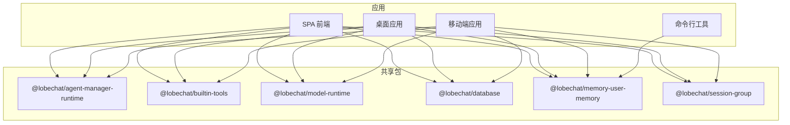
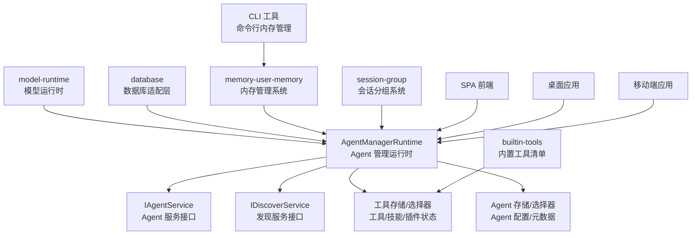
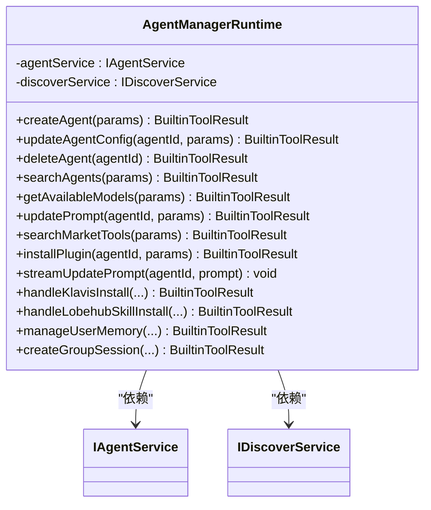
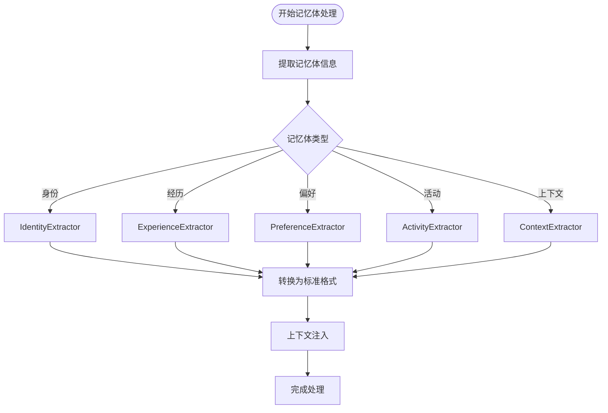
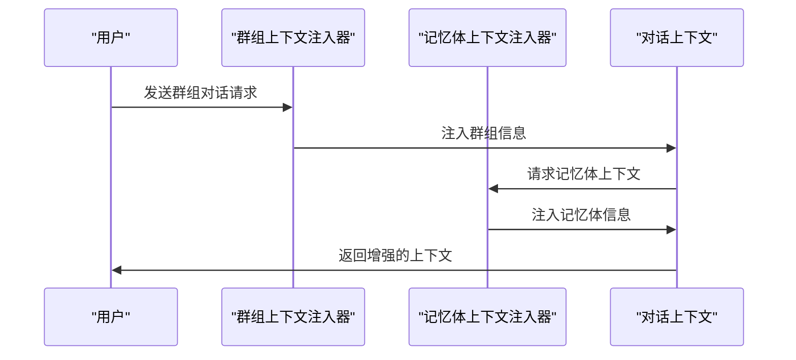
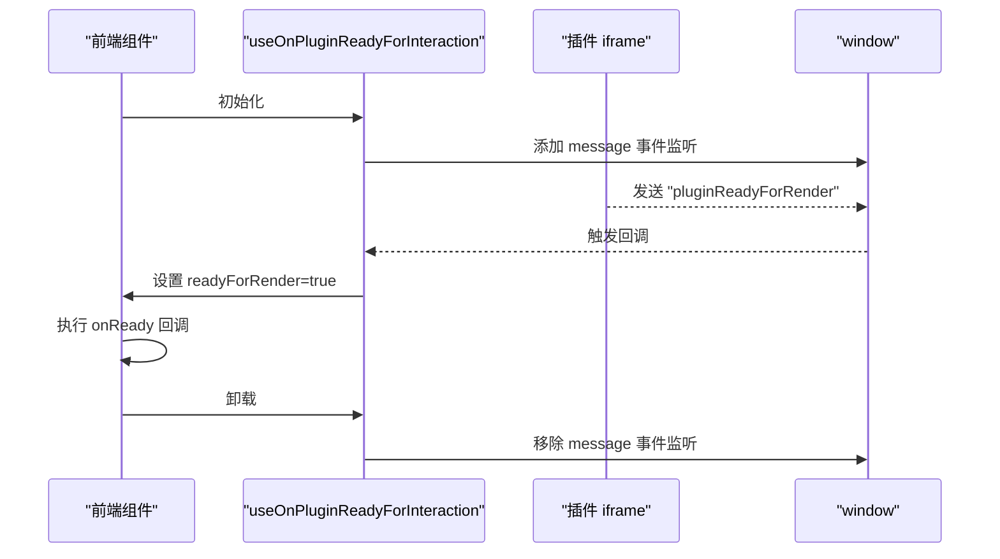
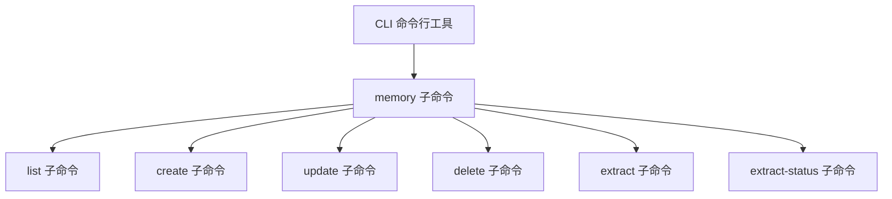
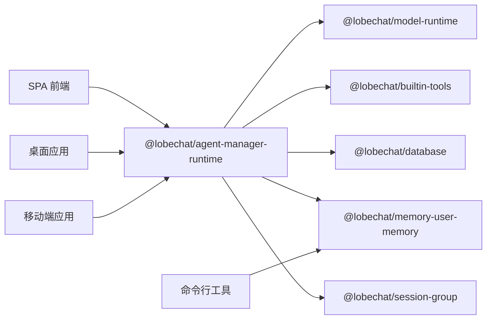

# 核心功能模块

<cite>
**本文引用的文件**
- [README.md](file://README.md)
- [AGENTS.md](file://AGENTS.md)
- [packages/agent-manager-runtime/src/AgentManagerRuntime.ts](file://packages/agent-manager-runtime/src/AgentManagerRuntime.ts)
- [packages/agent-manager-runtime/src/index.ts](file://packages/agent-manager-runtime/src/index.ts)
- [packages/builtin-tools/src/index.ts](file://packages/builtin-tools/src/index.ts)
- [packages/model-runtime/src/index.ts](file://packages/model-runtime/src/index.ts)
- [packages/database/src/index.ts](file://packages/database/src/index.ts)
- [packages/memory-user-memory/src/index.ts](file://packages/memory-user-memory/src/index.ts)
- [packages/memory-user-memory/src/extractors/index.ts](file://packages/memory-user-memory/src/extractors/index.ts)
- [packages/memory-user-memory/src/providers/index.ts](file://packages/memory-user-memory/src/providers/index.ts)
- [packages/memory-user-memory/src/converters/index.ts](file://packages/memory-user-memory/src/converters/index.ts)
- [packages/context-engine/src/providers/__tests__/GroupAgentBuilderContextInjector.test.ts](file://packages/context-engine/src/providers/__tests__/GroupAgentBuilderContextInjector.test.ts)
- [src/server/services/toolExecution/serverRuntimes/memory.ts](file://src/server/services/toolExecution/serverRuntimes/memory.ts)
- [src/store/chat/agents/GroupOrchestration/createGroupOrchestrationExecutors.ts](file://src/store/chat/agents/GroupOrchestration/createGroupOrchestrationExecutors.ts)
- [apps/cli/src/commands/memory.ts](file://apps/cli/src/commands/memory.ts)
- [apps/cli/src/commands/memory.test.ts](file://apps/cli/src/commands/memory.test.ts)
- [packages/const/src/session.ts](file://packages/const/src/session.ts)
- [packages/database/src/models/sessionGroup.ts](file://packages/database/src/models/sessionGroup.ts)
- [packages/database/src/schemas/session.ts](file://packages/database/src/schemas/session.ts)
- [packages/types/src/session/sessionGroup.ts](file://packages/types/src/session/sessionGroup.ts)
- [src/server/routers/lambda/sessionGroup.ts](file://src/server/routers/lambda/sessionGroup.ts)
- [packages/agent-runtime/package.json](file://packages/agent-runtime/package.json)
- [packages/builtin-tools/package.json](file://packages/builtin-tools/package.json)
- [packages/model-runtime/package.json](file://packages/model-runtime/package.json)
- [packages/database/package.json](file://packages/database/package.json)
- [src/features/PluginsUI/Render/utils/iframeOnReady.ts](file://src/features/PluginsUI/Render/utils/iframeOnReady.ts)
- [src/features/PluginsUI/Render/utils/iframeOnReady.test.ts](file://src/features/PluginsUI/Render/utils/iframeOnReady.test.ts)
</cite>

## 更新摘要
**所做更改**
- 新增内存管理系统模块，包含用户记忆体提取、转换和提供器
- 新增聊天会话分组功能，支持群组对话和会话管理
- 新增模型选择器增强功能，提供更智能的模型路由和选择
- 更新 Agent 管理运行时以支持新的内存和分组功能
- 新增 CLI 内存管理命令行工具

## 目录
1. [引言](#引言)
2. [项目结构](#项目结构)
3. [核心组件](#核心组件)
4. [架构总览](#架构总览)
5. [详细组件分析](#详细组件分析)
6. [依赖分析](#依赖分析)
7. [性能考虑](#性能考虑)
8. [故障排查指南](#故障排查指南)
9. [结论](#结论)
10. [附录](#附录)

## 引言
本文件面向 LobeHub 的核心功能模块，围绕 Agent 管理系统、多模态交互、插件生态系统、跨平台支持以及新增的内存管理系统、聊天会话分组功能和模型选择器增强功能进行系统化说明。文档从设计理念、实现原理、使用方法到模块协作与数据流进行全面阐述，并提供配置要点、参数说明、最佳实践与扩展指南，帮助初学者快速上手，同时为高级开发者提供深入的技术细节。

## 项目结构
LobeHub 采用 monorepo 结构，核心能力由多个共享包（packages）与前端应用（apps）协同完成。核心模块包括：
- Agent 管理运行时：负责 Agent 的创建、更新、删除、搜索以及模型/插件工具的发现与安装。
- 内置工具集：统一注册与暴露内置工具清单，支持桌面端条件可见性与默认工具集合。
- 模型运行时：抽象多 Provider 的模型调用与路由，提供兼容工厂与错误处理。
- 数据库适配层：提供数据库访问适配器、压缩与类型导出，支撑本地/远程数据库部署。
- 插件渲染与交互：通过消息通道与 iframe 生命周期管理，实现插件就绪与交互。
- **新增** 内存管理系统：提供用户记忆体提取、转换和上下文注入功能。
- **新增** 聊天会话分组：支持群组对话管理和会话组织。
- **新增** 模型选择器增强：提供智能模型路由和选择功能。

**图表来源**
- [packages/agent-manager-runtime/src/index.ts:1-2](file://packages/agent-manager-runtime/src/index.ts#L1-L2)
- [packages/builtin-tools/package.json:1-47](file://packages/builtin-tools/package.json#L1-L47)
- [packages/model-runtime/package.json:1-46](file://packages/model-runtime/package.json#L1-L46)
- [packages/database/package.json:1-38](file://packages/database/package.json#L1-L38)
- [packages/memory-user-memory/src/index.ts:1-7](file://packages/memory-user-memory/src/index.ts#L1-L7)
- [packages/database/src/models/sessionGroup.ts:1-200](file://packages/database/src/models/sessionGroup.ts#L1-L200)

**章节来源**
- [AGENTS.md:18-38](file://AGENTS.md#L18-L38)
- [README.md:125-561](file://README.md#L125-L561)

## 核心组件
- Agent 管理运行时（AgentManagerRuntime）
  - 职责：统一处理 Agent 的增删改查、搜索、模型/Provider 列表、插件/工具市场搜索与安装、系统提示词更新（含流式）。
  - 关键能力：服务注入解耦、乐观更新、状态回滚、OAuth 授权流程封装、内置工具与官方服务识别。
- 内置工具集（builtin-tools）
  - 职责：集中声明与导出内置工具清单，控制默认工具集合与桌面端可见性。
  - 关键能力：工具标识符、清单元数据、类型标注、条件隐藏/显示。
- 模型运行时（model-runtime）
  - 职责：抽象多 Provider 的模型调用，提供统一路由与兼容工厂，导出各 Provider 实现。
  - 关键能力：模型列表、路由选择、错误转换、用量转换、URI 解析。
- 数据库适配层（database）
  - 职责：提供数据库适配器、压缩工具与类型导出，支持客户端/服务端测试。
  - 关键能力：ID 生成、压缩策略、类型安全。
- 插件渲染与交互（PluginsUI）
  - 职责：通过消息通道监听插件就绪事件，管理 iframe 生命周期与交互时机。
  - 关键能力：事件监听、清理、回调触发。
- **新增** 内存管理系统（memory-user-memory）
  - 职责：提供用户记忆体的提取、转换和上下文注入功能，支持多种记忆体类型（身份、经历、偏好、活动、上下文）。
  - 关键能力：记忆体提取器、转换器、提供器、记忆体服务执行器。
- **新增** 聊天会话分组（session-group）
  - 职责：管理群组对话和会话组织，支持群组 Agent 构建和上下文注入。
  - 关键能力：群组上下文注入器、群组 Orchestration 执行器、群组管理工具。
- **新增** 模型选择器增强（model-selector）
  - 职责：提供智能模型路由和选择功能，支持基于上下文和需求的模型推荐。
  - 关键能力：模型能力匹配、上下文感知路由、性能优化建议。

**章节来源**
- [packages/agent-manager-runtime/src/AgentManagerRuntime.ts:61-72](file://packages/agent-manager-runtime/src/AgentManagerRuntime.ts#L61-L72)
- [packages/builtin-tools/src/index.ts:25-32](file://packages/builtin-tools/src/index.ts#L25-L32)
- [packages/model-runtime/src/index.ts:1-49](file://packages/model-runtime/src/index.ts#L1-L49)
- [packages/database/src/index.ts:1-5](file://packages/database/src/index.ts#L1-L5)
- [packages/memory-user-memory/src/index.ts:1-7](file://packages/memory-user-memory/src/index.ts#L1-L7)
- [packages/context-engine/src/providers/__tests__/GroupAgentBuilderContextInjector.test.ts:173-207](file://packages/context-engine/src/providers/__tests__/GroupAgentBuilderContextInjector.test.ts#L173-L207)
- [src/features/PluginsUI/Render/utils/iframeOnReady.ts:1-25](file://src/features/PluginsUI/Render/utils/iframeOnReady.ts#L1-L25)

## 架构总览
下图展示了 Agent 管理运行时与内置工具、模型运行时、数据库、内存系统及前端应用之间的交互关系：

**图表来源**
- [packages/agent-manager-runtime/src/AgentManagerRuntime.ts:36-59](file://packages/agent-manager-runtime/src/AgentManagerRuntime.ts#L36-L59)
- [packages/builtin-tools/src/index.ts:34-141](file://packages/builtin-tools/src/index.ts#L34-L141)
- [packages/model-runtime/src/index.ts:1-49](file://packages/model-runtime/src/index.ts#L1-L49)
- [packages/database/src/index.ts:1-5](file://packages/database/src/index.ts#L1-L5)
- [packages/memory-user-memory/src/index.ts:1-7](file://packages/memory-user-memory/src/index.ts#L1-L7)
- [packages/database/src/models/sessionGroup.ts:1-200](file://packages/database/src/models/sessionGroup.ts#L1-L200)

## 详细组件分析

### Agent 管理运行时（AgentManagerRuntime）
- 设计理念
  - 运行时与服务解耦：通过构造函数注入服务接口，支持前后端不同实现。
  - 乐观更新与状态回退：对 Agent 配置与元数据变更采用乐观更新，失败时可回滚。
  - 流式体验：系统提示词支持分片流式更新，模拟打字机效果。
  - 多源发现：统一聚合用户自有 Agent 与市场 Agent；工具/插件支持内置、官方与市场三类来源。
  - **新增** 内存集成：支持内存系统的集成，包括记忆体提取和上下文注入。
  - **新增** 分组支持：支持群组 Agent 的创建和管理。
- 核心流程
  - Agent CRUD：创建、更新（含插件开关）、删除。
  - 搜索：按关键词、分类、来源（用户/市场/全部）检索。
  - 模型/Provider：基于启用列表过滤与汇总。
  - 插件/工具：内置工具直接启用；官方服务（如 Klavis、LobehubSkill）支持 OAuth 授权；市场工具走 MCP 安装。
  - 提示词：支持普通更新与流式更新。
  - **新增** 内存管理：支持记忆体提取、存储和上下文注入。
  - **新增** 分组管理：支持群组对话的创建、管理和上下文构建。
- 关键数据结构与复杂度
  - 搜索与去重：时间复杂度近似 O(n)，n 为返回条目数。
  - 插件启用/禁用：基于数组过滤与合并，时间复杂度 O(m)，m 为当前插件数。
  - 流式提示词：按固定块大小与延迟输出，时间复杂度 O(p)，p 为提示词长度。
  - **新增** 内存操作：记忆体提取和注入的时间复杂度取决于记忆体大小和处理算法。
  - **新增** 分组操作：群组上下文构建和消息管理的时间复杂度与群组规模相关。

**图表来源**
- [packages/agent-manager-runtime/src/AgentManagerRuntime.ts:61-72](file://packages/agent-manager-runtime/src/AgentManagerRuntime.ts#L61-L72)
- [packages/agent-manager-runtime/src/AgentManagerRuntime.ts:79-109](file://packages/agent-manager-runtime/src/AgentManagerRuntime.ts#L79-L109)
- [packages/agent-manager-runtime/src/AgentManagerRuntime.ts:114-223](file://packages/agent-manager-runtime/src/AgentManagerRuntime.ts#L114-L223)
- [packages/agent-manager-runtime/src/AgentManagerRuntime.ts:247-325](file://packages/agent-manager-runtime/src/AgentManagerRuntime.ts#L247-L325)
- [packages/agent-manager-runtime/src/AgentManagerRuntime.ts:332-374](file://packages/agent-manager-runtime/src/AgentManagerRuntime.ts#L332-L374)
- [packages/agent-manager-runtime/src/AgentManagerRuntime.ts:381-414](file://packages/agent-manager-runtime/src/AgentManagerRuntime.ts#L381-L414)
- [packages/agent-manager-runtime/src/AgentManagerRuntime.ts:443-494](file://packages/agent-manager-runtime/src/AgentManagerRuntime.ts#L443-L494)
- [packages/agent-manager-runtime/src/AgentManagerRuntime.ts:499-593](file://packages/agent-manager-runtime/src/AgentManagerRuntime.ts#L499-L593)
- [packages/agent-manager-runtime/src/AgentManagerRuntime.ts:597-722](file://packages/agent-manager-runtime/src/AgentManagerRuntime.ts#L597-L722)
- [packages/agent-manager-runtime/src/AgentManagerRuntime.ts:724-800](file://packages/agent-manager-runtime/src/AgentManagerRuntime.ts#L724-L800)

**章节来源**
- [packages/agent-manager-runtime/src/AgentManagerRuntime.ts:61-800](file://packages/agent-manager-runtime/src/AgentManagerRuntime.ts#L61-L800)

### 内存管理系统（memory-user-memory）
- 设计理念
  - 多层次记忆体架构：支持身份、经历、偏好、活动、上下文等多种记忆体类型。
  - 上下文注入：将记忆体信息智能注入到对话上下文中，提升对话质量。
  - 可扩展性：提供插件化的提取器、转换器和提供器架构。
  - 隐私保护：支持记忆体的分类存储和访问控制。
- 核心组件
  - 提取器（Extractors）：从对话历史中提取不同类型的记忆体信息
    - IdentityExtractor：提取用户身份信息
    - ExperienceExtractor：提取用户经历和偏好
    - PreferenceExtractor：提取用户偏好和习惯
    - ActivityExtractor：提取用户活动和行为模式
    - ContextExtractor：提取上下文相关信息
  - 转换器（Converters）：将提取的记忆体转换为标准格式
  - 提供器（Providers）：提供记忆体检索和上下文构建功能
  - 服务执行器（Services）：协调记忆体提取和处理流程
- 关键能力
  - 多类型记忆体支持：全面覆盖用户画像的各个方面
  - 智能上下文注入：根据对话内容动态注入相关记忆体
  - 性能优化：支持记忆体努力级别配置，平衡性能和效果
  - 测试完备：提供完整的单元测试和基准测试

**图表来源**
- [packages/memory-user-memory/src/extractors/index.ts:1-8](file://packages/memory-user-memory/src/extractors/index.ts#L1-L8)
- [packages/memory-user-memory/src/converters/index.ts:1-2](file://packages/memory-user-memory/src/converters/index.ts#L1-L2)
- [packages/memory-user-memory/src/providers/index.ts:1-7](file://packages/memory-user-memory/src/providers/index.ts#L1-L7)

**章节来源**
- [packages/memory-user-memory/src/index.ts:1-7](file://packages/memory-user-memory/src/index.ts#L1-L7)
- [packages/memory-user-memory/src/extractors/index.ts:1-8](file://packages/memory-user-memory/src/extractors/index.ts#L1-L8)
- [packages/memory-user-memory/src/providers/index.ts:1-7](file://packages/memory-user-memory/src/providers/index.ts#L1-L7)
- [packages/memory-user-memory/src/converters/index.ts:1-2](file://packages/memory-user-memory/src/converters/index.ts#L1-L2)

### 聊天会话分组（session-group）
- 设计理念
  - 群组对话管理：支持多 Agent 协作的群组对话场景。
  - 上下文构建：为群组对话构建专门的上下文环境。
  - Orchestration 执行：提供群组 Agent 的编排和执行能力。
  - 动态成员管理：支持群组成员的动态添加和移除。
- 核心组件
  - 群组上下文注入器：将群组信息注入到对话上下文中
  - 群组 Orchestration 执行器：管理群组对话的执行流程
  - 群组管理工具：提供群组的创建、配置和管理功能
  - 群组 Agent 构建器：自动构建群组对话所需的 Agent
- 关键能力
  - 群组上下文注入：支持群组标题、成员和配置信息的注入
  - Supervisor 协调：支持 Supervisor Agent 对群组对话的协调
  - 动态执行：支持群组对话过程中的动态决策和执行
  - 会话持久化：支持群组对话的持久化和恢复

**图表来源**
- [packages/context-engine/src/providers/__tests__/GroupAgentBuilderContextInjector.test.ts:173-207](file://packages/context-engine/src/providers/__tests__/GroupAgentBuilderContextInjector.test.ts#L173-L207)
- [src/store/chat/agents/GroupOrchestration/createGroupOrchestrationExecutors.ts:83-110](file://src/store/chat/agents/GroupOrchestration/createGroupOrchestrationExecutors.ts#L83-L110)

**章节来源**
- [packages/context-engine/src/providers/__tests__/GroupAgentBuilderContextInjector.test.ts:173-207](file://packages/context-engine/src/providers/__tests__/GroupAgentBuilderContextInjector.test.ts#L173-L207)
- [src/store/chat/agents/GroupOrchestration/createGroupOrchestrationExecutors.ts:83-110](file://src/store/chat/agents/GroupOrchestration/createGroupOrchestrationExecutors.ts#L83-L110)
- [packages/database/src/models/sessionGroup.ts:1-200](file://packages/database/src/models/sessionGroup.ts#L1-L200)

### 模型选择器增强（model-selector）
- 设计理念
  - 智能路由：根据对话内容和需求自动选择最适合的模型。
  - 上下文感知：考虑对话上下文和任务类型来推荐模型。
  - 性能优化：提供性能和成本的平衡建议。
  - 可扩展性：支持新的模型和路由策略的添加。
- 关键能力
  - 模型能力匹配：根据任务需求匹配合适的模型能力
  - 上下文分析：分析对话上下文以推荐最佳模型
  - 成本优化：提供成本和性能的权衡建议
  - 实时切换：支持在对话过程中动态切换模型

**章节来源**
- [packages/model-runtime/src/index.ts:1-49](file://packages/model-runtime/src/index.ts#L1-L49)

### 数据库适配层（database）
- 设计理念
  - 适配器模式：统一数据库访问接口，支持客户端/服务端差异化实现。
  - 压缩与类型：提供压缩工具与类型导出，保障数据一致性与传输效率。
  - **新增** 会话分组支持：支持会话分组的数据结构和查询。
- 关键能力
  - 适配器导出：数据库适配器、压缩工具、类型定义。
  - ID 生成：提供稳定 ID 生成策略。
  - 测试支持：分别针对客户端与服务端提供测试配置。
  - **新增** 分组模型：提供会话分组的模型定义和操作接口。

**章节来源**
- [packages/database/src/index.ts:1-5](file://packages/database/src/index.ts#L1-L5)
- [packages/database/package.json:1-38](file://packages/database/package.json#L1-L38)
- [packages/database/src/models/sessionGroup.ts:1-200](file://packages/database/src/models/sessionGroup.ts#L1-L200)
- [packages/database/src/schemas/session.ts:1-200](file://packages/database/src/schemas/session.ts#L1-L200)
- [packages/types/src/session/sessionGroup.ts:1-200](file://packages/types/src/session/sessionGroup.ts#L1-L200)

### 插件渲染与交互（PluginsUI）
- 设计理念
  - 消息通道：通过 window.postMessage 与插件通信，等待插件就绪信号后执行回调。
  - 生命周期管理：监听与清理消息事件，避免内存泄漏。
- 关键流程
  - 监听插件就绪事件：仅响应指定通道类型。
  - 触发回调：就绪后调用传入回调，支持依赖项变更。
  - 清理资源：组件卸载时移除事件监听。

**图表来源**
- [src/features/PluginsUI/Render/utils/iframeOnReady.ts:1-25](file://src/features/PluginsUI/Render/utils/iframeOnReady.ts#L1-L25)

**章节来源**
- [src/features/PluginsUI/Render/utils/iframeOnReady.ts:1-25](file://src/features/PluginsUI/Render/utils/iframeOnReady.ts#L1-L25)
- [src/features/PluginsUI/Render/utils/iframeOnReady.test.ts:1-76](file://src/features/PluginsUI/Render/utils/iframeOnReady.test.ts#L1-L76)

### 命令行工具（CLI）
- 设计理念
  - 内存管理：提供命令行方式管理用户记忆体的功能。
  - 自动化：支持批量处理和自动化记忆体提取。
  - 可视化：提供 JSON 格式的输出以便于处理和分析。
- 关键功能
  - 记忆体列表：列出用户的各种记忆体
  - 记忆体创建：创建新的身份记忆体
  - 记忆体更新：更新现有的记忆体
  - 记忆体删除：删除不需要的记忆体
  - 记忆体提取：启动记忆体提取流程
  - 提取状态：查看记忆体提取的状态

**图表来源**
- [apps/cli/src/commands/memory.ts:17-94](file://apps/cli/src/commands/memory.ts#L17-L94)

**章节来源**
- [apps/cli/src/commands/memory.ts:17-94](file://apps/cli/src/commands/memory.ts#L17-L94)
- [apps/cli/src/commands/memory.test.ts:34-209](file://apps/cli/src/commands/memory.test.ts#L34-L209)

## 依赖分析
- 包间依赖
  - agent-manager-runtime 依赖 model-runtime、builtin-tools、database、memory-user-memory、session-group 等能力，用于模型列表、工具清单、存储适配和内存管理。
  - builtin-tools 依赖内置工具包与常量，导出工具清单供 Agent 管理运行时使用。
  - model-runtime 依赖多 Provider SDK 与工具库，提供统一调用入口。
  - database 提供适配器与类型，被 Agent 管理运行时用于持久化与状态管理。
  - memory-user-memory 提供记忆体提取、转换和上下文注入功能。
  - session-group 提供群组对话管理和上下文构建功能。
- 应用侧依赖
  - SPA、桌面、移动端和 CLI 均依赖上述共享包，形成统一的能力复用。

**图表来源**
- [packages/agent-manager-runtime/package.json:1-20](file://packages/agent-manager-runtime/package.json#L1-L20)
- [packages/builtin-tools/package.json:1-47](file://packages/builtin-tools/package.json#L1-L47)
- [packages/model-runtime/package.json:1-46](file://packages/model-runtime/package.json#L1-L46)
- [packages/database/package.json:1-38](file://packages/database/package.json#L1-L38)
- [packages/memory-user-memory/src/index.ts:1-7](file://packages/memory-user-memory/src/index.ts#L1-L7)
- [packages/database/src/models/sessionGroup.ts:1-200](file://packages/database/src/models/sessionGroup.ts#L1-L200)

**章节来源**
- [packages/agent-manager-runtime/package.json:1-20](file://packages/agent-manager-runtime/package.json#L1-L20)
- [packages/builtin-tools/package.json:1-47](file://packages/builtin-tools/package.json#L1-L47)
- [packages/model-runtime/package.json:1-46](file://packages/model-runtime/package.json#L1-L46)
- [packages/database/package.json:1-38](file://packages/database/package.json#L1-L38)

## 性能考虑
- Agent 管理运行时
  - 搜索限制：对返回条目数进行上限控制，避免过度渲染与网络压力。
  - 乐观更新：减少网络往返，提升交互流畅度；失败时快速回滚。
  - 流式提示词：分块与延迟输出，兼顾实时性与性能。
  - **新增** 内存处理：支持记忆体努力级别配置，平衡性能和效果。
  - **新增** 分组管理：群组上下文构建的性能优化，避免重复计算。
- 模型运行时
  - Provider 路由：根据模型能力与可用性进行路由选择，避免无效调用。
  - 错误与用量转换：提前收敛错误与用量，降低上层处理成本。
- 数据库适配层
  - 压缩策略：对大字段进行压缩，减少存储与传输开销。
  - **新增** 分组查询：优化会话分组的查询性能。
- 插件渲染
  - 事件监听清理：避免重复监听导致的内存泄漏与性能下降。
- **新增** 内存系统
  - 记忆体提取：支持异步处理和缓存机制，提升用户体验。
  - 上下文注入：智能选择注入的记忆体，避免冗余信息。

## 故障排查指南
- Agent 管理运行时
  - 创建/更新失败：检查服务注入与网络连通性；查看返回的错误状态与消息类型，定位具体环节。
  - 插件安装异常：确认插件来源（内置/官方/市场），核对 OAuth 授权流程与服务器状态。
  - 流式提示词未生效：检查流式更新逻辑与延迟设置，确保前端正确接收分片。
  - **新增** 内存处理异常：检查记忆体提取配置和上下文注入逻辑。
  - **新增** 分组功能异常：确认群组上下文注入和 Orchestration 执行器的配置。
- 模型运行时
  - Provider 无法调用：检查 API Key、代理配置与模型可用性；查看错误转换后的具体错误码。
  - 路由不生效：核对模型能力与路由规则，确认上下文构建是否正确。
- 数据库适配层
  - 读写异常：检查适配器实现与连接配置；验证压缩/解压流程。
  - **新增** 分组数据异常：检查会话分组的数据结构和查询逻辑。
- 插件渲染
  - 插件未就绪：确认消息通道类型与事件监听是否正确；检查 iframe 加载与通信链路。
- **新增** 内存系统
  - 记忆体提取失败：检查提取器配置和输入数据格式。
  - 上下文注入错误：验证上下文构建逻辑和注入时机。
- **新增** CLI 工具
  - 命令执行失败：检查命令参数和权限设置。
  - 输出格式问题：确认 JSON 输出格式和数据完整性。

**章节来源**
- [packages/agent-manager-runtime/src/AgentManagerRuntime.ts:106-108](file://packages/agent-manager-runtime/src/AgentManagerRuntime.ts#L106-L108)
- [packages/agent-manager-runtime/src/AgentManagerRuntime.ts:584-592](file://packages/agent-manager-runtime/src/AgentManagerRuntime.ts#L584-L592)
- [src/features/PluginsUI/Render/utils/iframeOnReady.ts:1-25](file://src/features/PluginsUI/Render/utils/iframeOnReady.ts#L1-L25)
- [src/features/PluginsUI/Render/utils/iframeOnReady.test.ts:1-76](file://src/features/PluginsUI/Render/utils/iframeOnReady.test.ts#L1-L76)
- [src/server/services/toolExecution/serverRuntimes/memory.ts:667-698](file://src/server/services/toolExecution/serverRuntimes/memory.ts#L667-L698)

## 结论
LobeHub 的核心功能模块以共享包形式实现高内聚、低耦合的架构设计。Agent 管理运行时提供统一的 Agent 生命周期与生态集成能力；内置工具集与模型运行时分别承担"工具清单"与"多 Provider 调用"的抽象；数据库适配层保障数据一致性与可移植性；插件渲染机制则打通了前端与外部生态的交互边界。**新增的内存管理系统**提供了强大的用户记忆体处理能力，支持多类型的记忆体提取、转换和上下文注入；**聊天会话分组功能**实现了群组对话管理，支持复杂的多 Agent 协作场景；**模型选择器增强功能**提供了智能的模型路由和选择能力。通过服务注入、乐观更新、流式渲染、消息通道和内存管理等设计，系统在易用性、可扩展性、性能和智能化之间取得平衡。

## 附录
- 使用场景与最佳实践
  - Agent 管理：优先使用内置工具作为默认集合，按需启用第三方插件；利用流式提示词提升交互体验。
  - 多模态交互：结合模型运行时的 Provider 能力，按需选择具备视觉/推理/函数调用能力的模型。
  - 插件生态：优先使用官方服务（如 Klavis、LobehubSkill）以获得更稳定的授权与工具列表；市场插件注意权限与稳定性。
  - 跨平台支持：桌面端可启用本地系统工具；移动端与 SPA 保持一致的工具集与交互体验。
  - **新增** 内存管理：合理配置记忆体努力级别，在性能和效果之间找到平衡；定期清理不需要的记忆体。
  - **新增** 群组对话：为群组对话设置明确的角色分工和沟通规则；利用 Supervisor Agent 进行协调管理。
  - **新增** 模型选择：根据任务类型和数据复杂度选择合适的模型；监控模型使用成本和性能。
- 配置选项与参数说明
  - Agent 管理运行时：支持关键词、分类、来源、数量限制等搜索参数；支持插件开关与配置字段更新。
  - 模型运行时：支持 Provider 路由、上下文构建、错误转换与用量转换。
  - 数据库适配层：提供适配器、压缩与类型导出，支持客户端/服务端测试。
  - 插件渲染：通过消息通道等待插件就绪，支持依赖项变更触发回调。
  - **新增** 内存系统：支持记忆体努力级别配置（低/中/高），影响处理性能和效果。
  - **新增** 会话分组：支持群组标题、成员列表和配置参数的设置。
  - **新增** 模型选择器：支持基于上下文的智能推荐和性能优化建议。
- **新增** CLI 工具使用
  - memory list：列出所有记忆体
  - memory create identity --name "用户身份" --content "用户描述"：创建身份记忆体
  - memory update identity mem-1 --content "更新内容"：更新记忆体
  - memory delete identity mem-1 --yes：删除记忆体
  - memory extract：启动记忆体提取
  - memory extract-status：查看提取状态

**章节来源**
- [packages/agent-manager-runtime/src/AgentManagerRuntime.ts:250-325](file://packages/agent-manager-runtime/src/AgentManagerRuntime.ts#L250-L325)
- [packages/agent-manager-runtime/src/AgentManagerRuntime.ts:443-494](file://packages/agent-manager-runtime/src/AgentManagerRuntime.ts#L443-L494)
- [packages/builtin-tools/src/index.ts:25-32](file://packages/builtin-tools/src/index.ts#L25-L32)
- [packages/model-runtime/src/index.ts:1-49](file://packages/model-runtime/src/index.ts#L1-L49)
- [packages/database/src/index.ts:1-5](file://packages/database/src/index.ts#L1-L5)
- [packages/memory-user-memory/src/index.ts:1-7](file://packages/memory-user-memory/src/index.ts#L1-L7)
- [packages/context-engine/src/providers/__tests__/GroupAgentBuilderContextInjector.test.ts:173-207](file://packages/context-engine/src/providers/__tests__/GroupAgentBuilderContextInjector.test.ts#L173-L207)
- [src/features/PluginsUI/Render/utils/iframeOnReady.ts:1-25](file://src/features/PluginsUI/Render/utils/iframeOnReady.ts#L1-L25)
- [apps/cli/src/commands/memory.ts:17-94](file://apps/cli/src/commands/memory.ts#L17-L94)