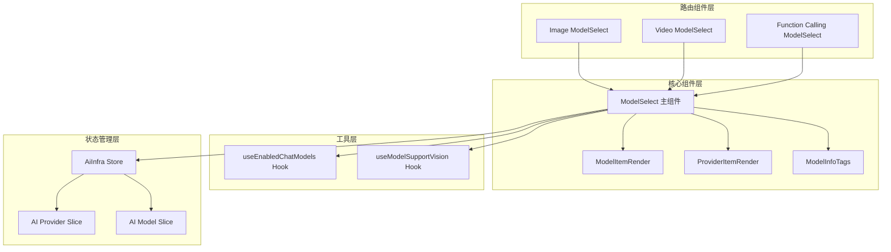
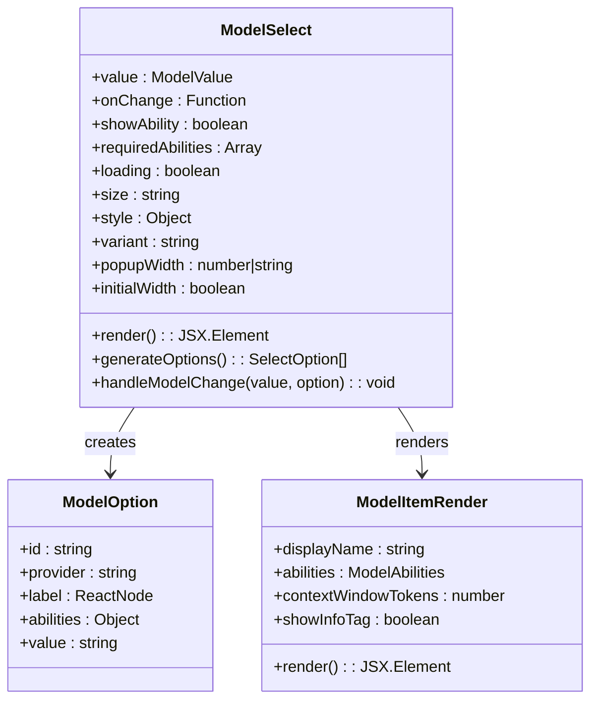
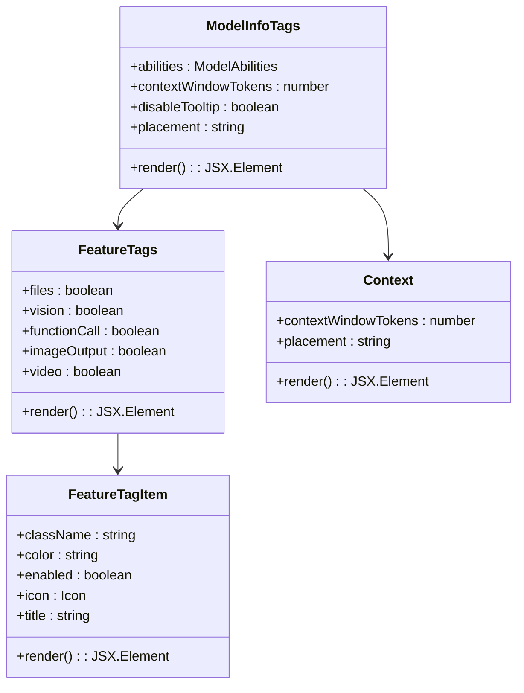
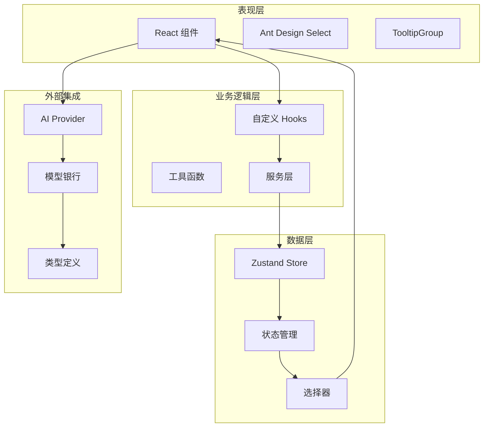
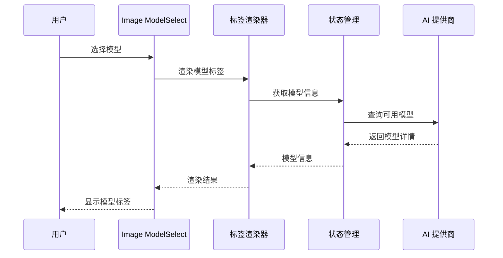
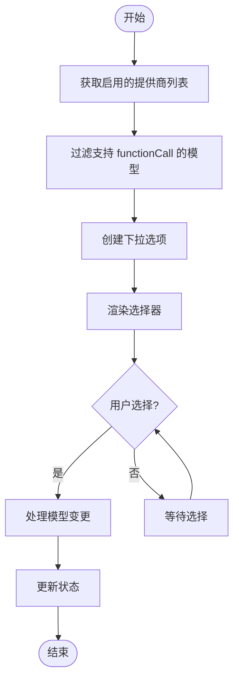
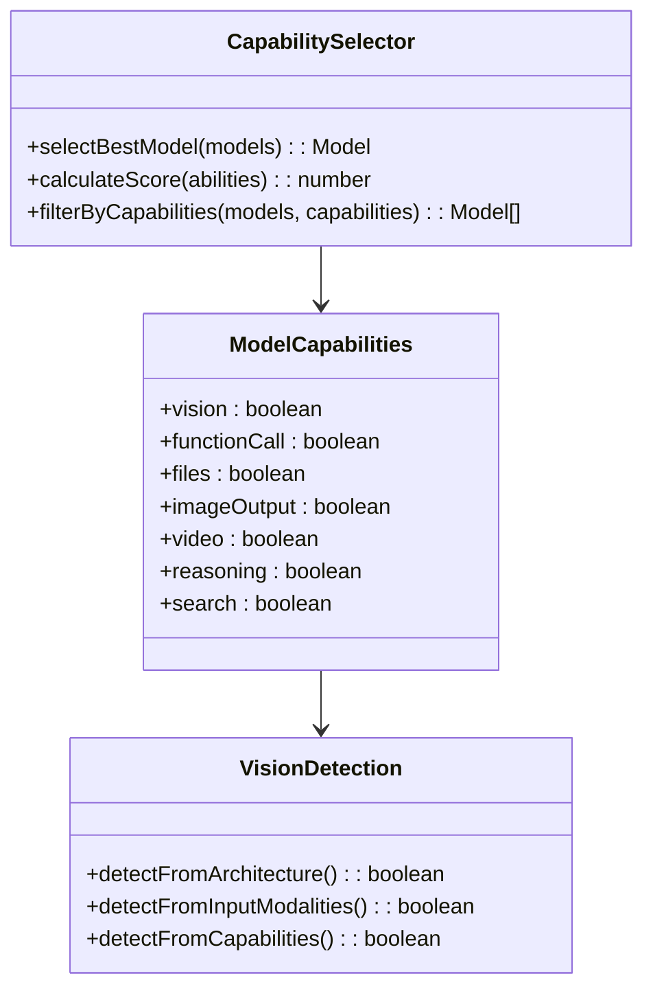
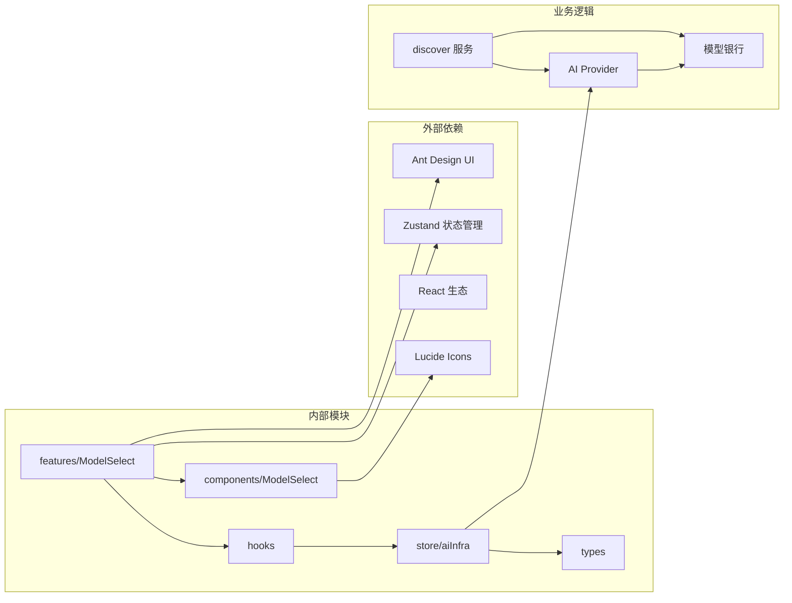

# 模型选择器增强

<cite>
**本文档引用的文件**
- [src/features/ModelSelect/index.tsx](file://src/features/ModelSelect/index.tsx)
- [src/components/ModelSelect/index.tsx](file://src/components/ModelSelect/index.tsx)
- [src/hooks/useEnabledChatModels.ts](file://src/hooks/useEnabledChatModels.ts)
- [packages/types/src/aiProvider.ts](file://packages/types/src/aiProvider.ts)
- [src/store/aiInfra/store.ts](file://src/store/aiInfra/store.ts)
- [src/routes/(main)/image/_layout/ConfigPanel/components/ModelSelect/index.tsx](file://src/routes/(main)/image/_layout/ConfigPanel/components/ModelSelect/index.tsx)
- [src/routes/(main)/video/_layout/ConfigPanel/components/ModelSelect/index.tsx](file://src/routes/(main)/video/_layout/ConfigPanel/components/ModelSelect/index.tsx)
- [src/features/ChatInput/ActionBar/Search/FunctionCallingModelSelect/index.tsx](file://src/features/ChatInput/ActionBar/Search/FunctionCallingModelSelect/index.tsx)
- [src/hooks/useModelSupportVision.ts](file://src/hooks/useModelSupportVision.ts)
- [src/server/services/discover/index.ts](file://src/server/services/discover/index.ts)
</cite>

## 目录

1. [简介](#简介)
2. [项目结构](#项目结构)
3. [核心组件](#核心组件)
4. [架构概览](#架构概览)
5. [详细组件分析](#详细组件分析)
6. [依赖关系分析](#依赖关系分析)
7. [性能考虑](#性能考虑)
8. [故障排除指南](#故障排除指南)
9. [结论](#结论)

## 简介

模型选择器增强是 LobeChat 项目中的一个关键功能模块，旨在为用户提供直观、高效的模型选择体验。该模块通过统一的组件架构，支持多种模型类型（聊天、图像生成、视频处理等），并提供丰富的模型能力展示和筛选功能。

本增强功能主要包含以下特性：

- 统一的模型选择界面
- 多维度的模型能力标签系统
- 基于能力的智能筛选机制
- 支持多种模型类型的专用选择器
- 实时的模型状态管理

## 项目结构

模型选择器功能分布在多个关键目录中：

**图表来源**

- [src/features/ModelSelect/index.tsx:1-150](file://src/features/ModelSelect/index.tsx#L1-L150)
- [src/components/ModelSelect/index.tsx:1-368](file://src/components/ModelSelect/index.tsx#L1-L368)
- [src/hooks/useEnabledChatModels.ts:1-11](file://src/hooks/useEnabledChatModels.ts#L1-L11)

**章节来源**

- [src/features/ModelSelect/index.tsx:1-150](file://src/features/ModelSelect/index.tsx#L1-L150)
- [src/components/ModelSelect/index.tsx:1-368](file://src/components/ModelSelect/index.tsx#L1-L368)

## 核心组件

### ModelSelect 主组件

ModelSelect 是整个模型选择器的核心组件，提供了统一的模型选择界面。该组件支持多种配置选项，包括尺寸、样式、加载状态等。

**图表来源**

- [src/features/ModelSelect/index.tsx:38-149](file://src/features/ModelSelect/index.tsx#L38-L149)

### 模型能力标签系统

模型选择器实现了完整的模型能力标签系统，用于直观展示模型的各项能力特征。

**图表来源**

- [src/components/ModelSelect/index.tsx:55-235](file://src/components/ModelSelect/index.tsx#L55-L235)

**章节来源**

- [src/features/ModelSelect/index.tsx:56-149](file://src/features/ModelSelect/index.tsx#L56-L149)
- [src/components/ModelSelect/index.tsx:204-235](file://src/components/ModelSelect/index.tsx#L204-L235)

## 架构概览

模型选择器采用分层架构设计，确保了良好的可维护性和扩展性：

**图表来源**

- [src/store/aiInfra/store.ts:1-37](file://src/store/aiInfra/store.ts#L1-L37)
- [packages/types/src/aiProvider.ts:362-368](file://packages/types/src/aiProvider.ts#L362-L368)

## 详细组件分析

### 路由特定模型选择器

系统为不同功能场景提供了专门的模型选择器组件：

#### 图像模型选择器

图像模型选择器针对图像生成任务进行了优化，提供了专门的标签渲染器：

**图表来源**

- [src/routes/(main)/image/\_layout/ConfigPanel/components/ModelSelect/index.tsx](<file://src/routes/(main)/image/_layout/ConfigPanel/components/ModelSelect/index.tsx#L124-L169>)

#### 视频模型选择器

视频模型选择器专注于视频处理相关的模型选择：

**章节来源**

- [src/routes/(main)/video/\_layout/ConfigPanel/components/ModelSelect/index.tsx](<file://src/routes/(main)/video/_layout/ConfigPanel/components/ModelSelect/index.tsx#L141-L166>)

### 功能调用模型选择器

专门为函数调用能力设计的模型选择器，过滤出支持 functionCall 能力的模型：

**图表来源**

- [src/features/ChatInput/ActionBar/Search/FunctionCallingModelSelect/index.tsx:34-91](file://src/features/ChatInput/ActionBar/Search/FunctionCallingModelSelect/index.tsx#L34-L91)

**章节来源**

- [src/features/ChatInput/ActionBar/Search/FunctionCallingModelSelect/index.tsx:34-91](file://src/features/ChatInput/ActionBar/Search/FunctionCallingModelSelect/index.tsx#L34-L91)

### 模型能力检测系统

系统提供了多种方式来检测和验证模型的能力：

**图表来源**

- [src/server/services/discover/index.ts:194-221](file://src/server/services/discover/index.ts#L194-L221)

**章节来源**

- [src/hooks/useModelSupportVision.ts:1-5](file://src/hooks/useModelSupportVision.ts#L1-L5)
- [src/server/services/discover/index.ts:194-221](file://src/server/services/discover/index.ts#L194-L221)

## 依赖关系分析

模型选择器系统的依赖关系展现了清晰的分层架构：

**图表来源**

- [src/features/ModelSelect/index.tsx:1-10](file://src/features/ModelSelect/index.tsx#L1-L10)
- [src/store/aiInfra/store.ts:1-37](file://src/store/aiInfra/store.ts#L1-L37)

**章节来源**

- [packages/types/src/aiProvider.ts:362-368](file://packages/types/src/aiProvider.ts#L362-L368)
- [src/store/aiInfra/store.ts:1-37](file://src/store/aiInfra/store.ts#L1-L37)

## 性能考虑

模型选择器在设计时充分考虑了性能优化：

### 渲染优化

- 使用 React.memo 避免不必要的重新渲染
- useMemo 缓存计算结果，减少重复计算
- 条件渲染避免渲染不必要元素

### 数据流优化

- 单一状态源避免数据同步问题
- 按需加载模型数据
- 智能缓存策略

### 用户体验优化

- 即时反馈机制
- 加载状态指示
- 错误边界处理

## 故障排除指南

### 常见问题及解决方案

#### 模型选择器无数据显示

1. 检查 AI 提供商是否正确配置
2. 验证模型银行数据是否加载成功
3. 确认用户权限设置

#### 模型能力显示异常

1. 检查模型能力检测逻辑
2. 验证模型架构信息
3. 确认能力映射配置

#### 性能问题

1. 检查组件重渲染频率
2. 优化状态更新策略
3. 实施适当的缓存机制

**章节来源**

- [src/hooks/useEnabledChatModels.ts:1-11](file://src/hooks/useEnabledChatModels.ts#L1-L11)
- [src/store/aiInfra/store.ts:1-37](file://src/store/aiInfra/store.ts#L1-L37)

## 结论

模型选择器增强功能通过统一的架构设计和丰富的功能特性，为用户提供了优秀的模型选择体验。该系统具有以下优势：

1. **高度可扩展性**：模块化设计支持新功能的快速集成
2. **强大的过滤能力**：基于能力的智能筛选满足不同使用场景
3. **优秀的用户体验**：直观的界面设计和即时反馈机制
4. **完善的错误处理**：健壮的状态管理和错误恢复机制
5. **性能优化**：多层优化策略确保系统响应速度

该增强功能不仅提升了现有功能的质量，还为未来的功能扩展奠定了坚实的基础。
