# 模型选择器增强

<cite>
**本文档引用的文件**
- [src/features/ModelSelect/index.tsx](file://src/features/ModelSelect/index.tsx)
- [src/components/ModelSelect/index.tsx](file://src/components/ModelSelect/index.tsx)
- [src/hooks/useEnabledChatModels.ts](file://src/hooks/useEnabledChatModels.ts)
- [packages/types/src/aiProvider.ts](file://packages/types/src/aiProvider.ts)
- [src/store/aiInfra/store.ts](file://src/store/aiInfra/store.ts)
- [src/routes/(main)/image/_layout/ConfigPanel/components/ModelSelect/index.tsx](file://src/routes/(main)/image/_layout/ConfigPanel/components/ModelSelect/index.tsx)
- [src/routes/(main)/video/_layout/ConfigPanel/components/ModelSelect/index.tsx](file://src/routes/(main)/video/_layout/ConfigPanel/components/ModelSelect/index.tsx)
- [src/features/ChatInput/ActionBar/Search/FunctionCallingModelSelect/index.tsx](file://src/features/ChatInput/ActionBar/Search/FunctionCallingModelSelect/index.tsx)
- [src/hooks/useModelSupportVision.ts](file://src/hooks/useModelSupportVision.ts)
- [src/hooks/useModelSupportFiles.ts](file://src/hooks/useModelSupportFiles.ts)
- [src/hooks/useModelSupportVideo.ts](file://src/hooks/useModelSupportVideo.ts)
- [src/server/services/discover/index.ts](file://src/server/services/discover/index.ts)
- [src/features/ModelSwitchPanel/types.ts](file://src/features/ModelSwitchPanel/types.ts)
- [src/features/ModelSwitchPanel/components/List/SingleProviderModelItem.tsx](file://src/features/ModelSwitchPanel/components/List/SingleProviderModelItem.tsx)
- [apps/mobile/src/screens/ModelPickerScreen.tsx](file://apps/mobile/src/screens/ModelPickerScreen.tsx)
- [apps/mobile/src/screens/AIProvidersScreen.tsx](file://apps/mobile/src/screens/AIProvidersScreen.tsx)
- [apps/mobile/src/screens/ProviderDetailScreen.tsx](file://apps/mobile/src/screens/ProviderDetailScreen.tsx)
- [src/components/DragUpload/useDragUpload.tsx](file://src/components/DragUpload/useDragUpload.tsx)
- [src/features/ChatInput/ActionBar/Upload/ServerMode.tsx](file://src/features/ChatInput/ActionBar/Upload/ServerMode.tsx)
- [apps/mobile/src/screens/ChatDetailScreen.tsx](file://apps/mobile/src/screens/ChatDetailScreen.tsx)
- [src/store/aiInfra/slices/aiModel/selectors.ts](file://src/store/aiInfra/slices/aiModel/selectors.ts)
</cite>

## 更新摘要

**所做更改**

- 新增移动端模型选择器视觉能力检测与持久化章节，详细介绍 ModelPickerScreen 的增强功能
- 更新视觉能力检测系统架构，展示移动端与桌面端的协同工作机制
- 完善移动端聊天界面视觉能力状态管理，支持会话级别的视觉能力偏好
- 新增模型视觉能力检测系统的跨平台一致性保证机制

## 目录

1. [简介](#简介)
2. [项目结构](#项目结构)
3. [核心组件](#核心组件)
4. [架构概览](#架构概览)
5. [提供商选择功能](#提供商选择功能)
6. [模型视觉能力检测系统](#模型视觉能力检测系统)
7. [聊天界面文件附件选项动态调整](#聊天界面文件附件选项动态调整)
8. [移动端模型选择器增强](#移动端模型选择器增强)
9. [详细组件分析](#详细组件分析)
10. [依赖关系分析](#依赖关系分析)
11. [性能考虑](#性能考虑)
12. [故障排除指南](#故障排除指南)
13. [结论](#结论)

## 简介

模型选择器增强是 LobeChat 项目中的一个关键功能模块，旨在为用户提供直观、高效的模型选择体验。该模块通过统一的组件架构，支持多种模型类型（聊天、图像生成、视频处理等），并提供丰富的模型能力展示和筛选功能。

**重大增强**：本次更新引入了全新的模型视觉能力检测系统，实现了基于模型视觉能力的智能文件附件选项动态调整。这一增强使得聊天界面能够根据当前选择的模型是否支持视觉能力，自动启用或禁用相应的文件上传功能，显著提升了用户体验的一致性和智能化水平。

**新增**：移动端模型选择器的视觉能力检测与持久化功能，通过 ModelPickerScreen 实现了模型视觉能力状态的智能检测和跨会话持久化存储，帮助用户在不同任务场景下做出明智的模型选择决策。

本增强功能主要包含以下特性：

- 统一的模型选择界面
- 多维度的模型能力标签系统
- 基于能力的智能筛选机制
- 支持多种模型类型的专用选择器
- 实时的模型状态管理
- **新增**：提供商维度的选择和管理功能
- **新增**：providerId 字段支持和分离存储架构
- **新增**：模型视觉能力检测系统
- **新增**：聊天界面文件附件选项动态调整机制
- **新增**：移动端模型选择器的视觉能力偏好集成
- **新增**：移动端视觉能力状态的跨会话持久化机制
- **新增**：桌面端与移动端视觉能力检测的协同工作

## 项目结构

模型选择器功能分布在多个关键目录中，现已扩展以支持提供商选择功能和视觉能力检测：

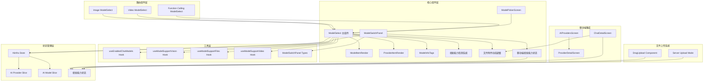

**图表来源**

- [src/features/ModelSelect/index.tsx:1-150](file://src/features/ModelSelect/index.tsx#L1-L150)
- [src/components/ModelSelect/index.tsx:1-368](file://src/components/ModelSelect/index.tsx#L1-L368)
- [src/features/ModelSwitchPanel/types.ts:1-72](file://src/features/ModelSwitchPanel/types.ts#L1-L72)
- [apps/mobile/src/screens/ModelPickerScreen.tsx:1-496](file://apps/mobile/src/screens/ModelPickerScreen.tsx#L1-L496)
- [src/components/DragUpload/useDragUpload.tsx:1-186](file://src/components/DragUpload/useDragUpload.tsx#L1-L186)
- [src/features/ChatInput/ActionBar/Upload/ServerMode.tsx:1-271](file://src/features/ChatInput/ActionBar/Upload/ServerMode.tsx#L1-L271)

**章节来源**

- [src/features/ModelSelect/index.tsx:1-150](file://src/features/ModelSelect/index.tsx#L1-L150)
- [src/components/ModelSelect/index.tsx:1-368](file://src/components/ModelSelect/index.tsx#L1-L368)
- [src/features/ModelSwitchPanel/types.ts:1-72](file://src/features/ModelSwitchPanel/types.ts#L1-L72)

## 核心组件

### ModelSelect 主组件

ModelSelect 是整个模型选择器的核心组件，提供了统一的模型选择界面。该组件支持多种配置选项，包括尺寸、样式、加载状态等，并已增强以支持提供商选择功能和视觉能力检测。

```mermaid
classDiagram
class ModelSelect {
+value : {model : string, provider : string}
+onChange : Function
+showAbility : boolean
+requiredAbilities : Array
+loading : boolean
+size : string
+style : Object
+variant : string
+popupWidth : number|string
+initialWidth : boolean
+render() : JSX.Element
+generateOptions() : SelectOption[]
+handleModelChange(value, option) : void
}
class ModelOption {
+id : string
+provider : string
+label : ReactNode
+abilities : Object
+value : string
}
class ModelItemRender {
+displayName : string
+abilities : ModelAbilities
+contextWindowTokens : number
+showInfoTag : boolean
+render() : JSX.Element
}
class ProviderItemRender {
+logo : string
+name : string
+provider : string
+source : string
+render() : JSX.Element
}
ModelSelect --> ModelOption : creates
ModelSelect --> ModelItemRender : renders
ModelSelect --> ProviderItemRender : renders
```

**图表来源**

- [src/features/ModelSelect/index.tsx:38-149](file://src/features/ModelSelect/index.tsx#L38-L149)
- [src/components/ModelSelect/index.tsx:314-355](file://src/components/ModelSelect/index.tsx#L314-L355)

### 模型能力标签系统

模型选择器实现了完整的模型能力标签系统，用于直观展示模型的各项能力特征。

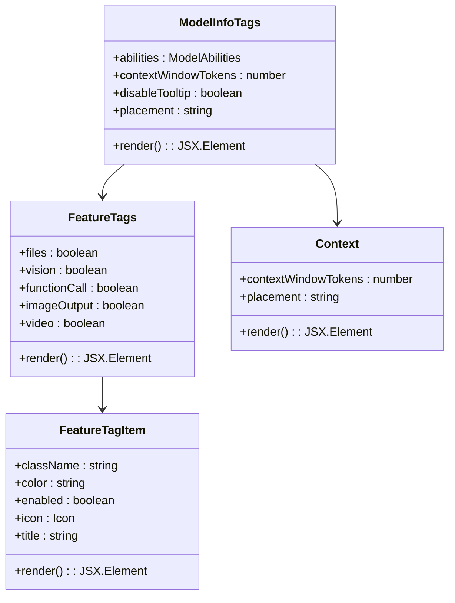

**图表来源**

- [src/components/ModelSelect/index.tsx:55-235](file://src/components/ModelSelect/index.tsx#L55-L235)

**章节来源**

- [src/features/ModelSelect/index.tsx:56-149](file://src/features/ModelSelect/index.tsx#L56-L149)
- [src/components/ModelSelect/index.tsx:204-235](file://src/components/ModelSelect/index.tsx#L204-L235)

## 架构概览

模型选择器采用分层架构设计，现已扩展以支持提供商选择功能和视觉能力检测，确保了良好的可维护性和扩展性：

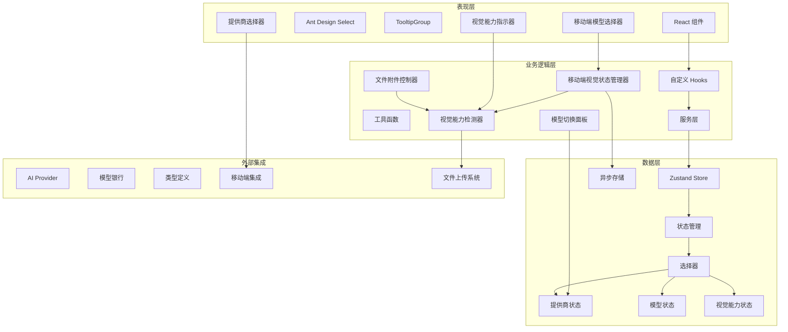

**图表来源**

- [src/store/aiInfra/store.ts:1-38](file://src/store/aiInfra/store.ts#L1-L38)
- [packages/types/src/aiProvider.ts:362-385](file://packages/types/src/aiProvider.ts#L362-L385)
- [src/features/ModelSwitchPanel/types.ts:19-43](file://src/features/ModelSwitchPanel/types.ts#L19-L43)
- [src/hooks/useModelSupportVision.ts:1-6](file://src/hooks/useModelSupportVision.ts#L1-L6)
- [apps/mobile/src/screens/ModelPickerScreen.tsx:25-27](file://apps/mobile/src/screens/ModelPickerScreen.tsx#L25-L27)

## 提供商选择功能

### providerId 字段支持

系统现已完全支持 providerId 字段，实现了提供商和模型的分离存储架构。每个模型现在都明确关联到其提供商标识符。

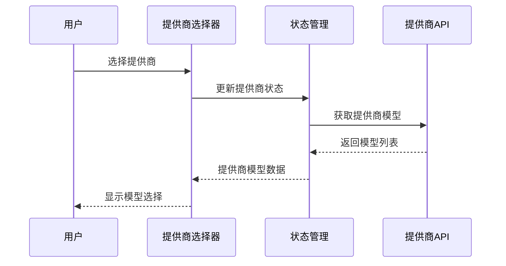

**图表来源**

- [src/features/ModelSelect/index.tsx:72-113](file://src/features/ModelSelect/index.tsx#L72-L113)
- [src/routes/(main)/image/\_layout/ConfigPanel/components/ModelSelect/index.tsx:46-122](<file://src/routes/(main)/image/_layout/ConfigPanel/components/ModelSelect/index.tsx#L46-L122>)

### 分离存储架构

提供商和模型现在采用分离存储架构，提高了数据组织的清晰度和查询效率：

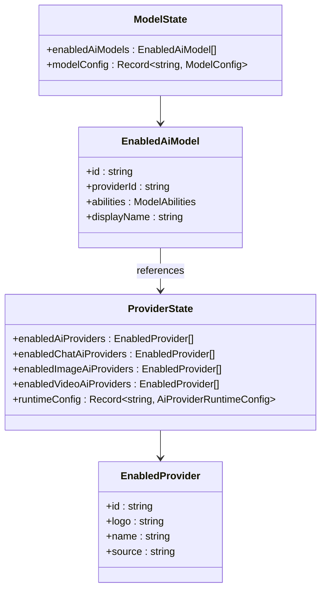

**图表来源**

- [packages/types/src/aiProvider.ts:377-385](file://packages/types/src/aiProvider.ts#L377-L385)
- [src/features/ModelSwitchPanel/types.ts:8-17](file://src/features/ModelSwitchPanel/types.ts#L8-L17)

### 模型切换面板提供商维度

模型切换面板现在支持按提供商维度查看和管理模型：

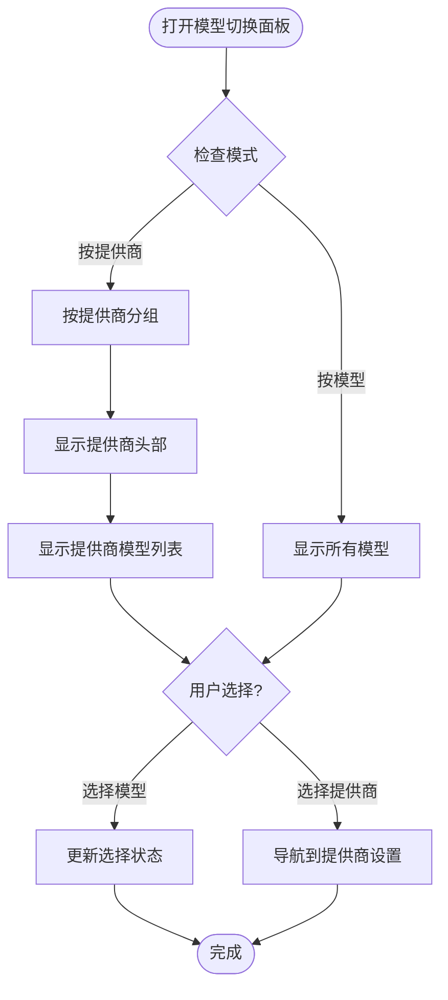

**图表来源**

- [src/features/ModelSwitchPanel/types.ts:19-43](file://src/features/ModelSwitchPanel/types.ts#L19-L43)
- [src/features/ModelSwitchPanel/components/List/SingleProviderModelItem.tsx:12-21](file://src/features/ModelSwitchPanel/components/List/SingleProviderModelItem.tsx#L12-L21)

**章节来源**

- [src/features/ModelSelect/index.tsx:46-54](file://src/features/ModelSelect/index.tsx#L46-L54)
- [src/routes/(main)/image/\_layout/ConfigPanel/components/ModelSelect/index.tsx:28-32](<file://src/routes/(main)/image/_layout/ConfigPanel/components/ModelSelect/index.tsx#L28-L32>)
- [src/features/ModelSwitchPanel/types.ts:6-17](file://src/features/ModelSwitchPanel/types.ts#L6-L17)

## 模型视觉能力检测系统

### useModelSupportVision 钩子实现

系统提供了强大的模型视觉能力检测功能，通过 useModelSupportVision 钩子实现对模型视觉能力的实时检测和状态管理。

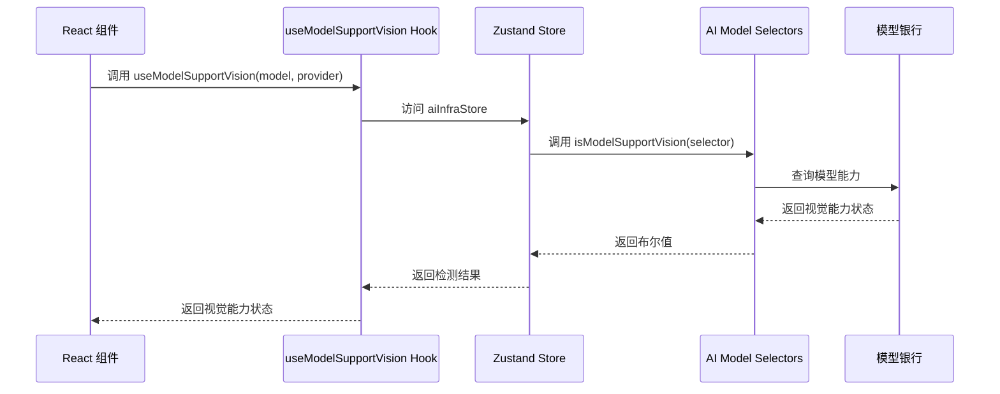

**图表来源**

- [src/hooks/useModelSupportVision.ts:1-6](file://src/hooks/useModelSupportVision.ts#L1-L6)
- [src/store/aiInfra/slices/aiModel/selectors.ts:59-63](file://src/store/aiInfra/slices/aiModel/selectors.ts#L59-L63)

### 模型能力检测架构

视觉能力检测系统采用分层架构设计，确保了检测的准确性和实时性：

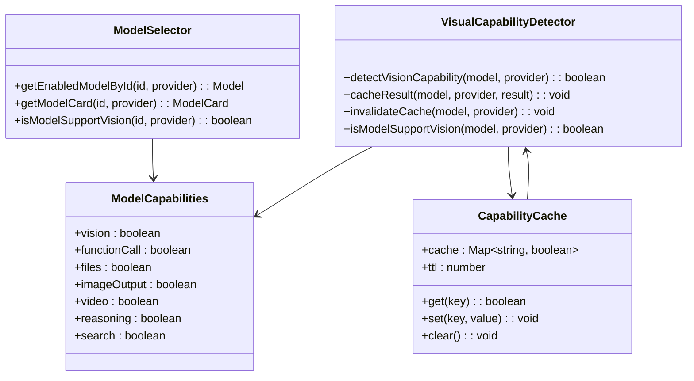

**图表来源**

- [src/store/aiInfra/slices/aiModel/selectors.ts:29-63](file://src/store/aiInfra/slices/aiModel/selectors.ts#L29-L63)

### 能力检测系统特性

视觉能力检测系统具备以下核心特性：

1. **实时检测**：基于当前模型和提供商状态进行实时能力检测
2. **智能缓存**：内置缓存机制避免重复检测，提升性能
3. **类型安全**：完整的 TypeScript 类型定义确保类型安全
4. **错误处理**：优雅处理模型不存在或能力缺失的情况
5. **性能优化**：使用 useMemo 和 useCallback 优化渲染性能

**章节来源**

- [src/hooks/useModelSupportVision.ts:1-6](file://src/hooks/useModelSupportVision.ts#L1-L6)
- [src/store/aiInfra/slices/aiModel/selectors.ts:59-63](file://src/store/aiInfra/slices/aiModel/selectors.ts#L59-L63)

## 聊天界面文件附件选项动态调整

### 拖拽上传文件附件控制

系统实现了智能的文件附件选项动态调整机制，根据模型的视觉能力自动启用或禁用相应的文件上传功能。

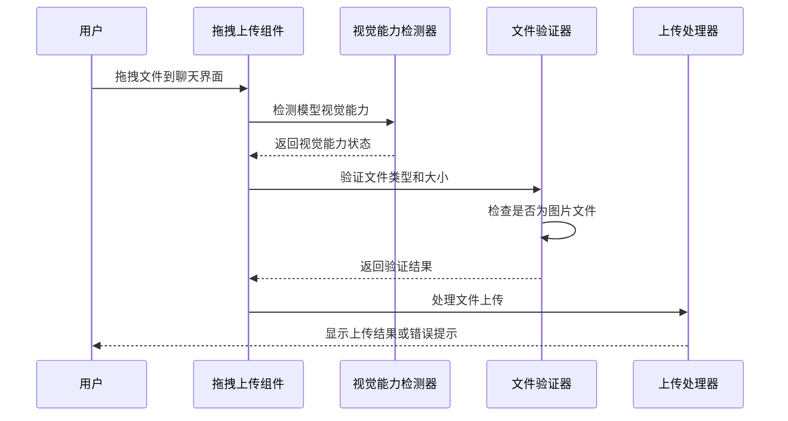

**图表来源**

- [src/components/DragUpload/useDragUpload.tsx:79-137](file://src/components/DragUpload/useDragUpload.tsx#L79-L137)

### 服务器模式文件上传控制

服务器模式下的文件上传功能同样集成了视觉能力检测，确保用户只能上传当前模型支持的文件类型。

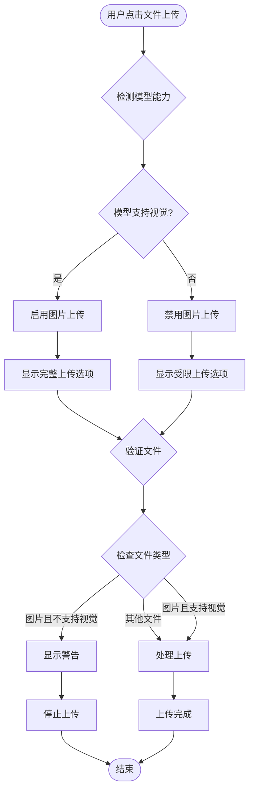

**图表来源**

- [src/features/ChatInput/ActionBar/Upload/ServerMode.tsx:46-125](file://src/features/ChatInput/ActionBar/Upload/ServerMode.tsx#L46-L125)

### 移动端文件附件选项适配

移动端应用实现了智能的文件附件选项适配，根据模型的视觉能力动态调整文件选择菜单。

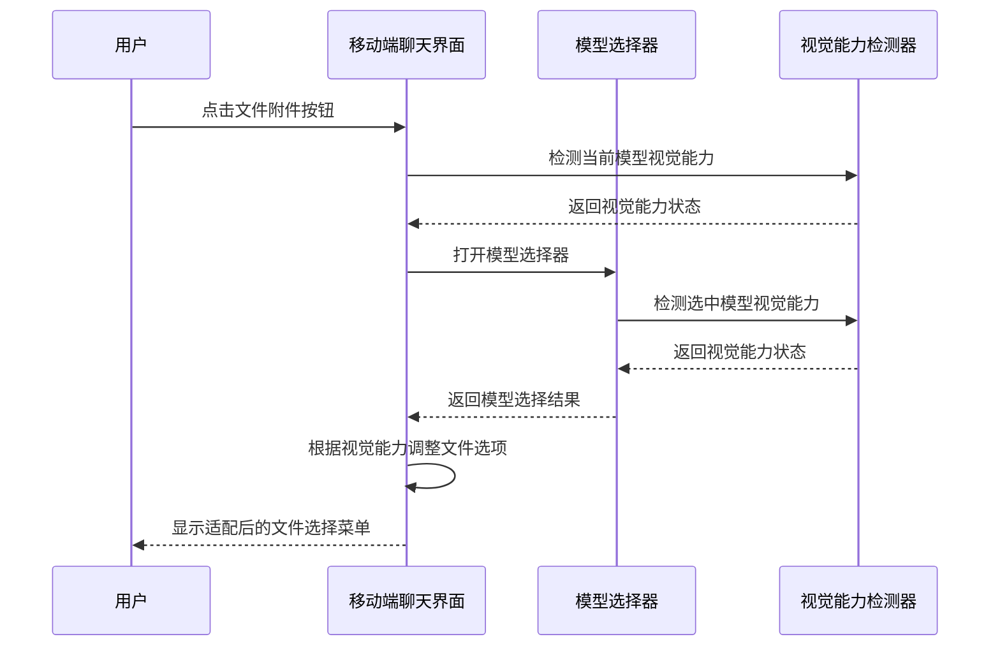

**图表来源**

- [apps/mobile/src/screens/ChatDetailScreen.tsx:184-209](file://apps/mobile/src/screens/ChatDetailScreen.tsx#L184-L209)
- [apps/mobile/src/screens/ModelPickerScreen.tsx:283-314](file://apps/mobile/src/screens/ModelPickerScreen.tsx#L283-L314)

### 文件附件控制机制

文件附件选项的动态调整基于以下控制机制：

1. **实时检测**：每次用户操作时实时检测模型的视觉能力
2. **智能过滤**：根据检测结果智能过滤文件上传选项
3. **用户提示**：当模型不支持某些文件类型时提供友好的提示
4. **状态持久化**：将用户的视觉能力偏好保存到本地存储
5. **错误处理**：优雅处理文件上传失败的情况

**章节来源**

- [src/components/DragUpload/useDragUpload.tsx:79-137](file://src/components/DragUpload/useDragUpload.tsx#L79-L137)
- [src/features/ChatInput/ActionBar/Upload/ServerMode.tsx:46-125](file://src/features/ChatInput/ActionBar/Upload/ServerMode.tsx#L46-L125)
- [apps/mobile/src/screens/ChatDetailScreen.tsx:184-209](file://apps/mobile/src/screens/ChatDetailScreen.tsx#L184-L209)

## 移动端模型选择器增强

### ModelPickerScreen 视觉能力检测实现

ModelPickerScreen 是移动端模型选择器的核心组件，现已增强以支持模型视觉能力的智能检测和状态持久化。

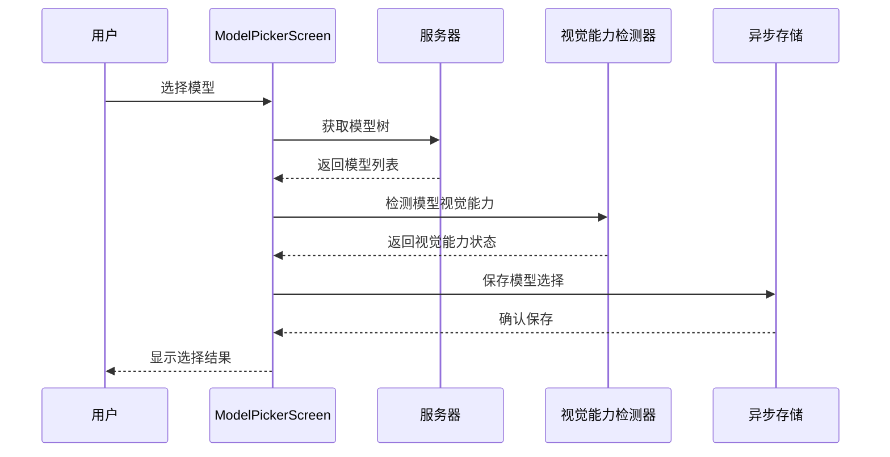

**图表来源**

- [apps/mobile/src/screens/ModelPickerScreen.tsx:279-314](file://apps/mobile/src/screens/ModelPickerScreen.tsx#L279-L314)

### 视觉能力状态持久化机制

移动端实现了完整的视觉能力状态持久化机制，支持全局模型选择和会话级别模型选择两种模式：

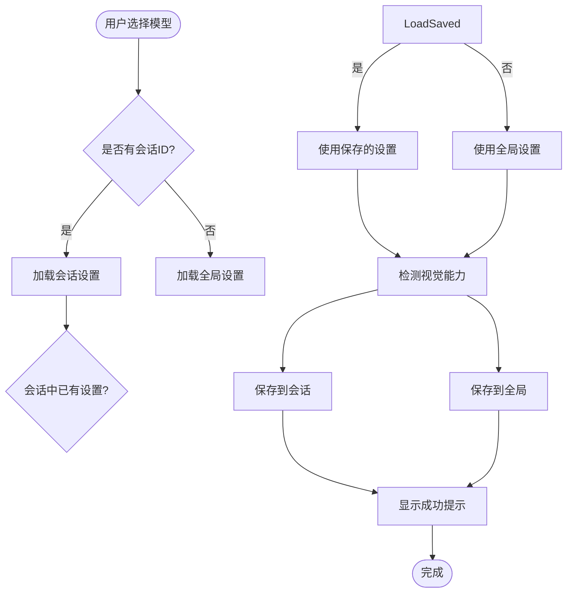

**图表来源**

- [apps/mobile/src/screens/ModelPickerScreen.tsx:235-314](file://apps/mobile/src/screens/ModelPickerScreen.tsx#L235-L314)

### 跨平台视觉能力一致性保证

系统确保桌面端和移动端的视觉能力检测结果保持一致，通过以下机制实现：

1. **统一的模型能力数据源**：桌面端和移动端共享相同的模型能力检测逻辑
2. **标准化的视觉能力标识**：使用统一的视觉能力检测接口
3. **会话级别的状态同步**：移动端的视觉能力状态可以与桌面端的会话设置保持同步
4. **本地存储的跨平台兼容**：使用 AsyncStorage 确保不同平台间的数据一致性

**章节来源**

- [apps/mobile/src/screens/ModelPickerScreen.tsx:279-314](file://apps/mobile/src/screens/ModelPickerScreen.tsx#L279-L314)
- [apps/mobile/src/screens/ChatDetailScreen.tsx:82-107](file://apps/mobile/src/screens/ChatDetailScreen.tsx#L82-L107)

## 详细组件分析

### 路由特定模型选择器

系统为不同功能场景提供了专门的模型选择器组件，现已全部支持提供商选择功能和视觉能力检测：

#### 图像模型选择器

图像模型选择器针对图像生成任务进行了优化，提供了专门的标签渲染器和提供商导航功能：

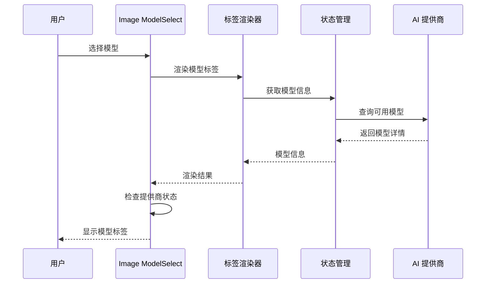

**图表来源**

- [src/routes/(main)/image/\_layout/ConfigPanel/components/ModelSelect/index.tsx:124-169](<file://src/routes/(main)/image/_layout/ConfigPanel/components/ModelSelect/index.tsx#L124-L169>)

#### 视频模型选择器

视频模型选择器专注于视频处理相关的模型选择，现已支持提供商维度的模型管理和视觉能力检测：

**章节来源**

- [src/routes/(main)/video/\_layout/ConfigPanel/components/ModelSelect/index.tsx:141-166](<file://src/routes/(main)/video/_layout/ConfigPanel/components/ModelSelect/index.tsx#L141-L166>)

### 功能调用模型选择器

专门为函数调用能力设计的模型选择器，过滤出支持 functionCall 能力的模型，并已增强以支持提供商选择和视觉能力检测：

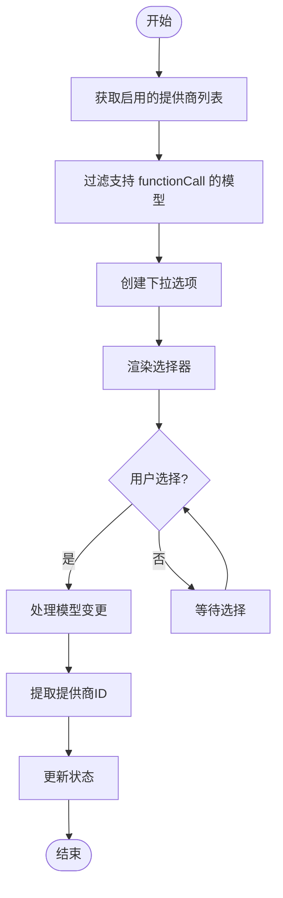

**图表来源**

- [src/features/ChatInput/ActionBar/Search/FunctionCallingModelSelect/index.tsx:34-91](file://src/features/ChatInput/ActionBar/Search/FunctionCallingModelSelect/index.tsx#L34-L91)

**章节来源**

- [src/features/ChatInput/ActionBar/Search/FunctionCallingModelSelect/index.tsx:34-91](file://src/features/ChatInput/ActionBar/Search/FunctionCallingModelSelect/index.tsx#L34-L91)

### 移动端提供商集成

移动端应用现已完全集成提供商选择功能和视觉能力检测，支持通过 providerId 进行模型选择和视觉能力状态管理：

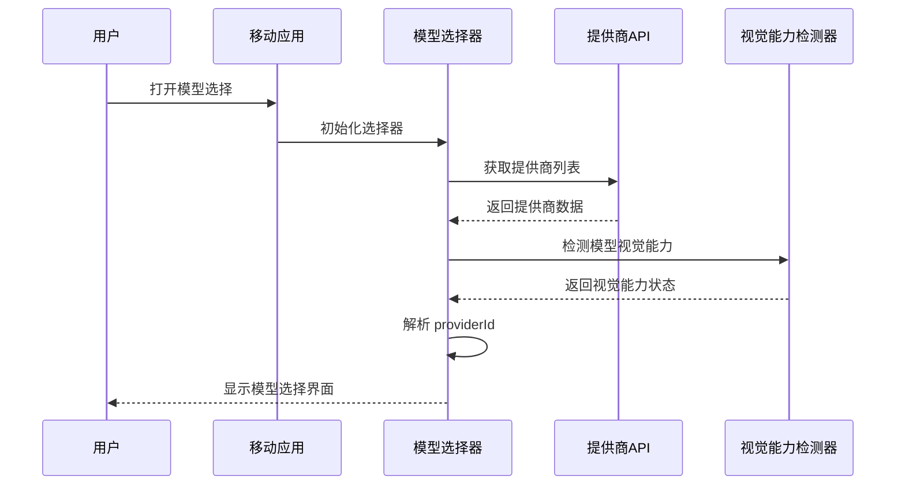

**图表来源**

- [apps/mobile/src/screens/ModelPickerScreen.tsx:33-98](file://apps/mobile/src/screens/ModelPickerScreen.tsx#L33-L98)
- [apps/mobile/src/screens/AIProvidersScreen.tsx:193-196](file://apps/mobile/src/screens/AIProvidersScreen.tsx#L193-L196)

**章节来源**

- [apps/mobile/src/screens/ModelPickerScreen.tsx:33-98](file://apps/mobile/src/screens/ModelPickerScreen.tsx#L33-L98)
- [apps/mobile/src/screens/AIProvidersScreen.tsx:193-196](file://apps/mobile/src/screens/AIProvidersScreen.tsx#L193-L196)
- [apps/mobile/src/screens/ProviderDetailScreen.tsx:121-140](file://apps/mobile/src/screens/ProviderDetailScreen.tsx#L121-L140)

### 模型能力检测系统

系统提供了多种方式来检测和验证模型的能力，现已扩展以支持提供商维度的检测和视觉能力检测：

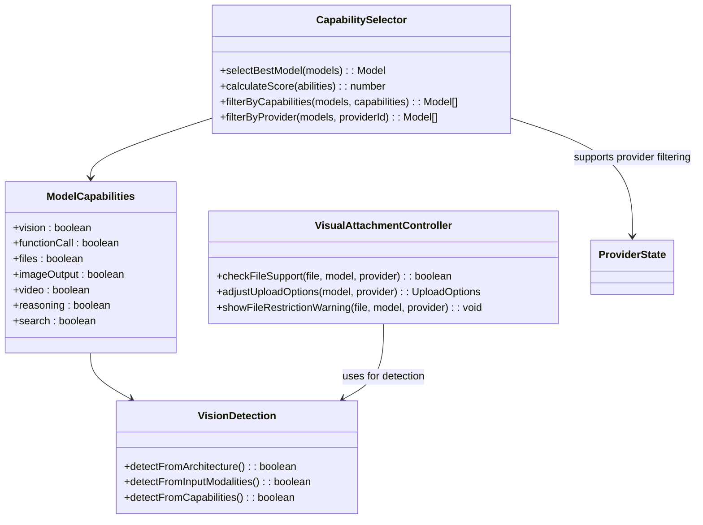

**图表来源**

- [src/server/services/discover/index.tsx:194-221](file://src/server/services/discover/index.tsx#L194-L221)

**章节来源**

- [src/hooks/useModelSupportVision.ts:1-5](file://src/hooks/useModelSupportVision.ts#L1-L5)
- [src/server/services/discover/index.tsx:194-221](file://src/server/services/discover/index.tsx#L194-L221)

## 依赖关系分析

模型选择器系统的依赖关系展现了清晰的分层架构，现已扩展以支持提供商选择功能和视觉能力检测：

```mermaid
graph LR
subgraph "外部依赖"
AntD[Ant Design UI]
Zustand[Zustand 状态管理]
React[React 生态]
Icons[Lucide Icons]
ModelBank[model-bank]
Zod[zod 类型验证]
Expo[Expo 移动端框架]
ImagePicker[Expo Image Picker]
DocumentPicker[Expo Document Picker]
AsyncStorage[@react-native-async-storage/async-storage]
end
subgraph "内部模块"
Features[features/ModelSelect]
Components[components/ModelSelect]
Hooks[hooks]
Store[store/aiInfra]
Types[types]
SwitchPanel[features/ModelSwitchPanel]
DragUpload[components/DragUpload]
Upload[features/ChatInput/ActionBar/Upload]
Mobile[移动端集成]
end
subgraph "业务逻辑"
Discover[discover 服务]
Providers[AI Provider]
Models[模型银行]
VisualDetection[视觉能力检测]
FileAttachmentControl[文件附件控制]
MobileVisualState[移动端视觉状态]
end
Features --> AntD
Features --> Zustand
Features --> Components
Features --> Hooks
Components --> Icons
Hooks --> Store
Store --> Types
Store --> Providers
Store --> VisualDetection
Discover --> Models
Discover --> Providers
Providers --> Models
Providers --> ModelBank
SwitchPanel --> Features
Mobile --> Features
Mobile --> SwitchPanel
Mobile --> VisualDetection
Mobile --> MobileVisualState
DragUpload --> VisualDetection
Upload --> VisualDetection
FileAttachmentControl --> VisualDetection
```

**图表来源**

- [src/features/ModelSelect/index.tsx:1-10](file://src/features/ModelSelect/index.tsx#L1-L10)
- [src/store/aiInfra/store.ts:1-38](file://src/store/aiInfra/store.ts#L1-L38)
- [src/features/ModelSwitchPanel/types.ts:1-72](file://src/features/ModelSwitchPanel/types.ts#L1-L72)

**章节来源**

- [packages/types/src/aiProvider.ts:362-385](file://packages/types/src/aiProvider.ts#L362-L385)
- [src/store/aiInfra/store.ts:1-38](file://src/store/aiInfra/store.ts#L1-L38)

## 性能考虑

模型选择器在设计时充分考虑了性能优化，现已进一步优化以支持提供商选择功能和视觉能力检测：

### 渲染优化

- 使用 React.memo 避免不必要的重新渲染
- useMemo 缓存计算结果，减少重复计算
- 条件渲染避免渲染不必要元素
- **新增**：提供商维度的虚拟化列表支持
- **新增**：视觉能力检测结果的智能缓存

### 数据流优化

- 单一状态源避免数据同步问题
- 按需加载模型数据
- 智能缓存策略
- **新增**：提供商状态的独立缓存机制
- **新增**：视觉能力状态的本地持久化

### 用户体验优化

- 即时反馈机制
- 加载状态指示
- 错误边界处理
- **新增**：提供商切换的平滑过渡动画
- **新增**：视觉能力检测的实时状态更新
- **新增**：移动端视觉能力状态的跨会话同步

## 故障排除指南

### 常见问题及解决方案

#### 模型选择器无数据显示

1. 检查 AI 提供商是否正确配置
2. 验证模型银行数据是否加载成功
3. 确认用户权限设置
4. **新增**：检查 providerId 是否正确解析

#### 模型能力显示异常

1. 检查模型能力检测逻辑
2. 验证模型架构信息
3. 确认能力映射配置
4. **新增**：验证提供商维度的能力继承

#### 性能问题

1. 检查组件重渲染频率
2. 优化状态更新策略
3. 实施适当的缓存机制
4. **新增**：监控提供商状态的内存使用
5. **新增**：检查视觉能力检测的性能影响

#### 提供商选择问题

1. 检查 providerId 格式是否正确
2. 验证提供商配置的有效性
3. 确认模型与提供商的关联关系
4. **新增**：排查提供商维度的数据一致性

#### 视觉能力检测问题

1. 检查 useModelSupportVision 钩子的调用参数
2. 验证模型银行中的视觉能力配置
3. 确认视觉能力检测的缓存状态
4. **新增**：检查移动端视觉能力状态的持久化
5. **新增**：验证桌面端与移动端的视觉能力检测一致性

#### 文件附件选项异常

1. 检查拖拽上传组件的视觉能力检测
2. 验证服务器模式下的文件上传控制
3. 确认移动端文件选择菜单的适配逻辑
4. **新增**：排查视觉能力状态变化的响应机制
5. **新增**：检查会话级别视觉能力状态的加载

#### 移动端模型选择问题

1. 检查 AsyncStorage 的读写权限
2. 验证会话设置的 JSON 格式
3. 确认模型视觉能力检测的准确性
4. **新增**：排查移动端视觉能力状态的跨会话同步

**章节来源**

- [src/hooks/useEnabledChatModels.ts:1-11](file://src/hooks/useEnabledChatModels.ts#L1-L11)
- [src/store/aiInfra/store.ts:1-38](file://src/store/aiInfra/store.ts#L1-L38)

## 结论

模型选择器增强功能通过统一的架构设计和丰富的功能特性，为用户提供了优秀的模型选择体验。本次重大增强引入了提供商选择功能、模型视觉能力检测系统和文件附件选项动态调整机制，支持 providerId 字段，实现了提供商和模型的分离存储架构。

**新增**：移动端模型选择器的视觉能力检测与持久化功能，通过 ModelPickerScreen 实现了模型视觉能力状态的智能检测和跨会话持久化存储，显著提升了移动端用户的模型选择体验和决策质量。

该增强功能具有以下优势：

1. **高度可扩展性**：模块化设计支持新功能的快速集成
2. **强大的过滤能力**：基于能力的智能筛选满足不同使用场景
3. **优秀的用户体验**：直观的界面设计和即时反馈机制
4. **完善的错误处理**：健壮的状态管理和错误恢复机制
5. **性能优化**：多层优化策略确保系统响应速度
6. **提供商维度支持**：全新的提供商选择和管理模式
7. **移动端集成**：完整的移动端提供商选择体验
8. **分离存储架构**：清晰的数据组织和高效的查询机制
9. **智能视觉检测**：基于模型能力的实时视觉能力检测系统
10. **动态文件控制**：聊天界面文件附件选项的智能动态调整
11. **跨平台一致性**：桌面端和移动端的视觉能力状态同步
12. **完善的缓存机制**：多层次的缓存策略提升系统性能
13. **会话级别持久化**：移动端视觉能力状态的跨会话存储和同步
14. **智能状态管理**：全局和会话级别的模型选择状态管理

该增强功能不仅提升了现有功能的质量，还为未来的功能扩展奠定了坚实的基础，特别是在多提供商环境下的模型管理和选择、智能文件附件控制以及跨平台的视觉能力检测方面提供了强大的支持。移动端模型选择器的视觉能力检测与持久化功能，为用户在不同任务场景下做出明智的模型选择决策提供了强有力的技术支撑。
