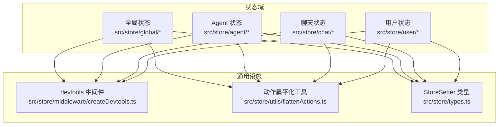
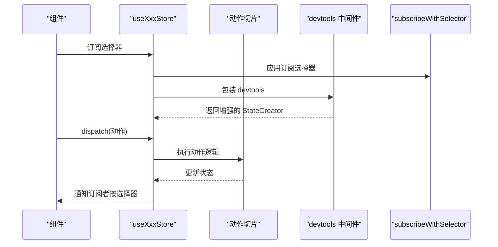
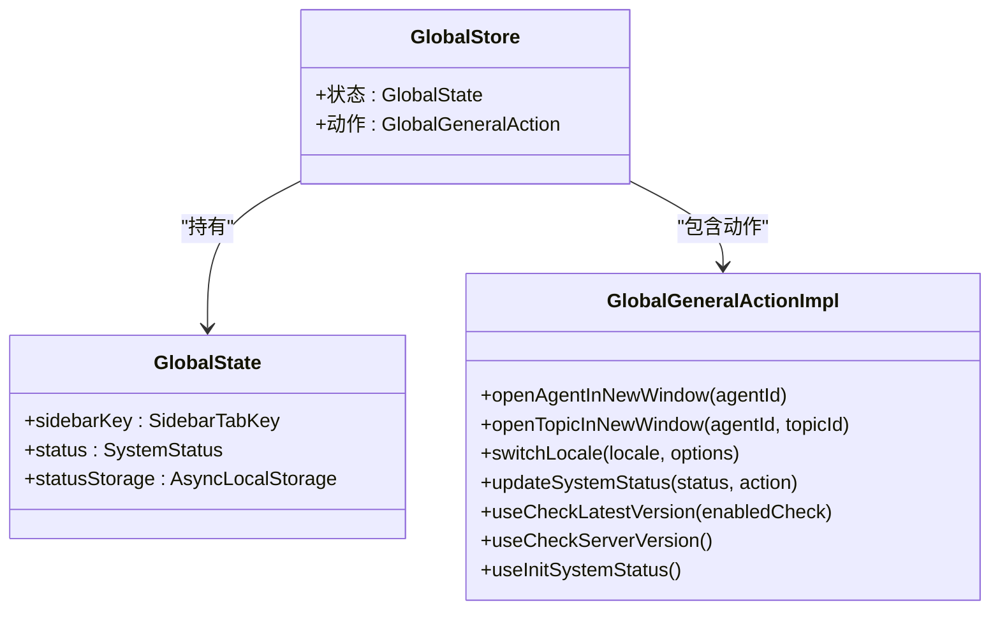
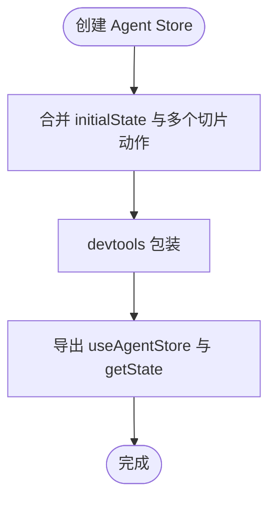
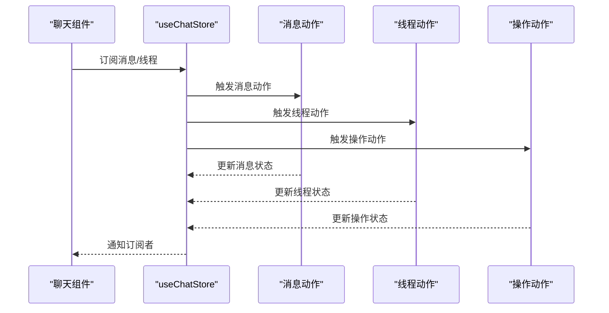
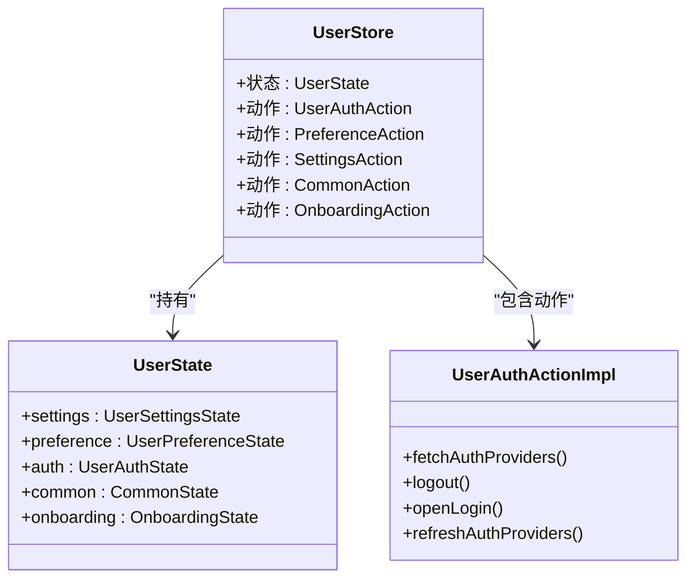
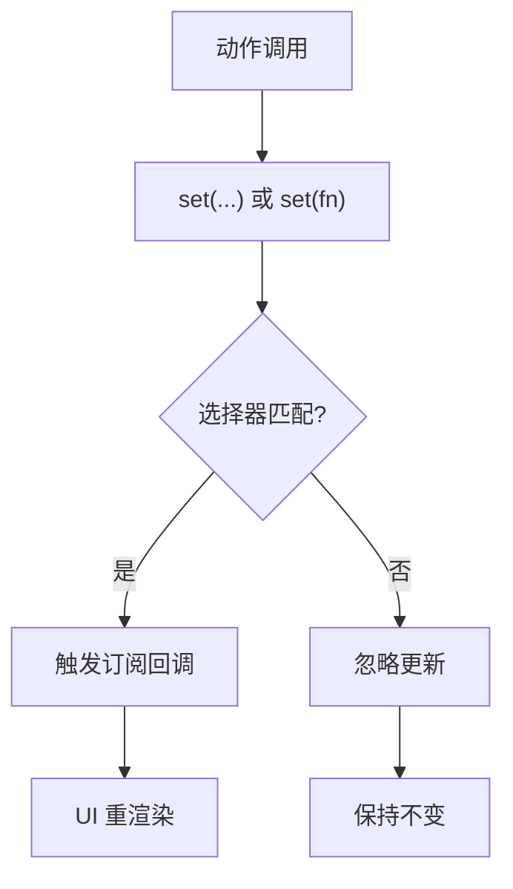
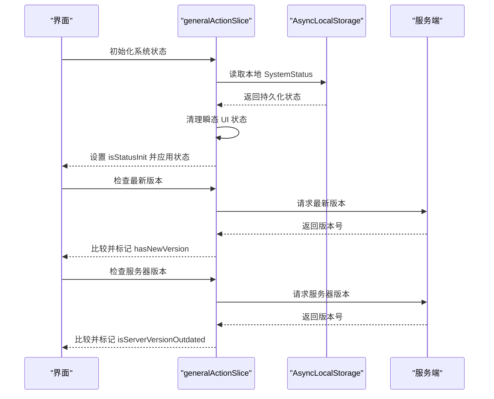
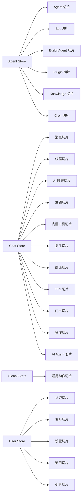

# 状态管理系统

<cite>
**本文引用的文件**
- [src/store/agent/store.ts](file://src/store/agent/store.ts)
- [src/store/chat/store.ts](file://src/store/chat/store.ts)
- [src/store/global/store.ts](file://src/store/global/store.ts)
- [src/store/user/store.ts](file://src/store/user/store.ts)
- [src/store/middleware/createDevtools.ts](file://src/store/middleware/createDevtools.ts)
- [src/store/utils/flattenActions.ts](file://src/store/utils/flattenActions.ts)
- [src/store/agent/initialState.ts](file://src/store/agent/initialState.ts)
- [src/store/chat/initialState.ts](file://src/store/chat/initialState.ts)
- [src/store/global/initialState.ts](file://src/store/global/initialState.ts)
- [src/store/user/initialState.ts](file://src/store/user/initialState.ts)
- [src/store/global/actions/general.ts](file://src/store/global/actions/general.ts)
- [src/store/user/slices/auth/action.ts](file://src/store/user/slices/auth/action.ts)
- [src/store/types.ts](file://src/store/types.ts)
</cite>

## 目录

1. [简介](#简介)
2. [项目结构](#项目结构)
3. [核心组件](#核心组件)
4. [架构总览](#架构总览)
5. [详细组件分析](#详细组件分析)
6. [依赖关系分析](#依赖关系分析)
7. [性能考量](#性能考量)
8. [故障排除指南](#故障排除指南)
9. [结论](#结论)
10. [附录](#附录)

## 简介

本文件系统性梳理基于 Zustand 的状态管理架构与最佳实践，覆盖分层状态设计、动作分发、状态订阅与选择器、持久化与同步、调试与开发工具集成、以及性能优化与故障排除。文档聚焦以下状态域：全局状态、Agent 状态、聊天状态与用户状态，并给出创建新状态切片、定义动作处理器与实现状态选择器的步骤指引。

## 项目结构

仓库采用按 “功能域” 划分的多状态仓（slice）组织方式，每个领域拥有独立的 store 文件、initialState、slices 与 selectors。Zustand 通过 “切片聚合” 的模式将多个动作与状态合并到单一 store 实例中，配合 devtools 与订阅中间件实现可观测与高效更新。

图表来源

- [src/store/global/store.ts](file://src/store/global/store.ts#L1-L41)
- [src/store/agent/store.ts](file://src/store/agent/store.ts#L1-L62)
- [src/store/chat/store.ts](file://src/store/chat/store.ts#L1-L84)
- [src/store/user/store.ts](file://src/store/user/store.ts#L1-L59)
- [src/store/middleware/createDevtools.ts](file://src/store/middleware/createDevtools.ts#L1-L24)
- [src/store/utils/flattenActions.ts](file://src/store/utils/flattenActions.ts#L1-L53)
- [src/store/types.ts](file://src/store/types.ts#L1-L9)

章节来源

- [src/store/global/store.ts](file://src/store/global/store.ts#L1-L41)
- [src/store/agent/store.ts](file://src/store/agent/store.ts#L1-L62)
- [src/store/chat/store.ts](file://src/store/chat/store.ts#L1-L84)
- [src/store/user/store.ts](file://src/store/user/store.ts#L1-L59)

## 核心组件

- Zustand 集成点
  - 使用传统创建器与相等性比较，结合订阅选择器中间件，减少不必要重渲染。
  - 动作通过 “扁平化” 工具从多个切片实例中提取并绑定 this 上下文，保证可序列化与可调试。
- 中间件
  - Devtools：按 URL 参数条件启用，命名空间区分各 store，支持开发环境调试。
- 切片聚合
  - 各 store 将 initialState 与多个切片的动作合并，形成统一的 useXxxStore Hook 与 getState 方法。

章节来源

- [src/store/agent/store.ts](file://src/store/agent/store.ts#L1-L62)
- [src/store/chat/store.ts](file://src/store/chat/store.ts#L1-L84)
- [src/store/global/store.ts](file://src/store/global/store.ts#L1-L41)
- [src/store/user/store.ts](file://src/store/user/store.ts#L1-L59)
- [src/store/middleware/createDevtools.ts](file://src/store/middleware/createDevtools.ts#L1-L24)
- [src/store/utils/flattenActions.ts](file://src/store/utils/flattenActions.ts#L1-L53)

## 架构总览

Zustand 在本项目中的运行时流程如下：初始化时，每个 store 调用 devtools 包装器与订阅选择器中间件；随后将多个切片的动作与初始状态进行扁平化合并；UI 组件通过 useXxxStore 订阅所需字段，仅在相关字段变化时触发重渲染。

图表来源

- [src/store/chat/store.ts](file://src/store/chat/store.ts#L74-L77)
- [src/store/middleware/createDevtools.ts](file://src/store/middleware/createDevtools.ts#L6-L23)

## 详细组件分析

### 全局状态（Global Store）

- 职责
  - 系统级 UI 状态、版本检查、语言切换、资源管理器列宽、客户端数据库初始化状态等。
- 初始状态与系统状态
  - 初始状态包含 UI 标签页键、系统状态对象与持久化存储封装。
  - 系统状态包含面板宽度、显示开关、排序与分页参数等。
- 动作
  - 通用动作切片提供打开窗口、语言切换、系统状态更新、版本检查与系统状态初始化等能力。
- 持久化
  - 通过异步本地存储封装保存系统状态，初始化时从本地恢复并清理瞬态 UI 状态。

图表来源

- [src/store/global/store.ts](file://src/store/global/store.ts#L17-L40)
- [src/store/global/initialState.ts](file://src/store/global/initialState.ts#L178-L266)
- [src/store/global/actions/general.ts](file://src/store/global/actions/general.ts#L25-L239)

章节来源

- [src/store/global/store.ts](file://src/store/global/store.ts#L1-L41)
- [src/store/global/initialState.ts](file://src/store/global/initialState.ts#L1-L267)
- [src/store/global/actions/general.ts](file://src/store/global/actions/general.ts#L1-L242)

### Agent 状态（Agent Store）

- 职责
  - 管理 Agent 相关的切片状态与动作，包括内置 Agent、插件、知识库、定时任务等。
- 结构
  - 初始状态由多个切片初始状态合并；动作通过多个切片创建器聚合。
  - 使用 devtools 包装与浅比较优化订阅。

图表来源

- [src/store/agent/store.ts](file://src/store/agent/store.ts#L41-L62)
- [src/store/agent/initialState.ts](file://src/store/agent/initialState.ts#L1-L12)

章节来源

- [src/store/agent/store.ts](file://src/store/agent/store.ts#L1-L62)
- [src/store/agent/initialState.ts](file://src/store/agent/initialState.ts#L1-L12)

### 聊天状态（Chat Store）

- 职责
  - 聊天消息、主题、线程、AI 聊天、AI Agent、内置工具、插件、翻译、TTS、门户与操作等。
- 结构
  - 多个动作类与函数式动作被聚合，使用订阅选择器中间件提升订阅效率。
  - 提供全局挂载用于调试。

图表来源

- [src/store/chat/store.ts](file://src/store/chat/store.ts#L50-L77)
- [src/store/chat/initialState.ts](file://src/store/chat/initialState.ts#L1-L40)

章节来源

- [src/store/chat/store.ts](file://src/store/chat/store.ts#L1-L84)
- [src/store/chat/initialState.ts](file://src/store/chat/initialState.ts#L1-L40)

### 用户状态（User Store）

- 职责
  - 用户设置、偏好、认证、通用信息与引导流程。
- 结构
  - 初始状态由多个切片初始状态合并；动作包含认证、偏好、设置、通用与引导。
  - 使用订阅选择器中间件与 devtools 包装。

图表来源

- [src/store/user/store.ts](file://src/store/user/store.ts#L23-L47)
- [src/store/user/initialState.ts](file://src/store/user/initialState.ts#L1-L25)
- [src/store/user/slices/auth/action.ts](file://src/store/user/slices/auth/action.ts#L39-L94)

章节来源

- [src/store/user/store.ts](file://src/store/user/store.ts#L1-L59)
- [src/store/user/initialState.ts](file://src/store/user/initialState.ts#L1-L25)
- [src/store/user/slices/auth/action.ts](file://src/store/user/slices/auth/action.ts#L1-L97)

### 动作分发与状态订阅机制

- 动作分发
  - 通过 “扁平化” 工具将多个切片实例的动作方法提取并绑定 this，确保可调用且可调试。
  - StoreSetter 类型约束 set/get 的签名，保证动作内部对状态的更新一致性。
- 订阅机制
  - 使用 subscribeWithSelector 中间件，仅在选择器返回的子集发生变化时触发回调。
  - 浅比较优化 useXxxStore，避免不必要的重渲染。

图表来源

- [src/store/utils/flattenActions.ts](file://src/store/utils/flattenActions.ts#L18-L52)
- [src/store/types.ts](file://src/store/types.ts#L1-L9)
- [src/store/chat/store.ts](file://src/store/chat/store.ts#L74-L77)

章节来源

- [src/store/utils/flattenActions.ts](file://src/store/utils/flattenActions.ts#L1-L53)
- [src/store/types.ts](file://src/store/types.ts#L1-L9)
- [src/store/chat/store.ts](file://src/store/chat/store.ts#L1-L84)

### 状态持久化策略与数据同步

- 全局系统状态持久化
  - 通过异步本地存储封装保存 SystemStatus，初始化时从本地恢复，并清理瞬态 UI 状态。
- 版本与服务器一致性检查
  - 前端版本与服务端版本对比，超过阈值则标记过旧，提示升级或降级处理。
- 认证提供方数据同步
  - 用户登录后拉取账户与第三方提供方列表，刷新认证提供方状态。

图表来源

- [src/store/global/actions/general.ts](file://src/store/global/actions/general.ts#L133-L238)
- [src/store/global/initialState.ts](file://src/store/global/initialState.ts#L209-L266)

章节来源

- [src/store/global/actions/general.ts](file://src/store/global/actions/general.ts#L1-L242)
- [src/store/global/initialState.ts](file://src/store/global/initialState.ts#L1-L267)

### 开发工具与调试

- Devtools 条件启用
  - 通过 URL 查询参数控制是否显示 devtools，命名空间区分不同 store。
- 调试入口
  - 聊天 store 在浏览器环境下挂载到全局变量以便直接访问与调试。
- 最佳实践
  - 为动作命名 action 参数，便于 devtools 追踪。
  - 对大对象更新使用选择器与浅比较，避免全量重渲染。

章节来源

- [src/store/middleware/createDevtools.ts](file://src/store/middleware/createDevtools.ts#L1-L24)
- [src/store/chat/store.ts](file://src/store/chat/store.ts#L79-L81)

### 创建新的状态切片与动作处理器

- 步骤
  - 定义切片初始状态接口与默认值。
  - 编写动作类或函数式动作，接收 set/get/\_api，返回可被扁平化的对象。
  - 在对应 store 的 initialState 与 createStore 中引入该切片。
  - 导出 useXxxStore 与 getState 工具。
- 示例路径
  - 参考用户认证切片的动作实现与注册位置，理解 “类实例动作 + 扁平化” 的模式。
  - 参考全局通用动作切片，学习如何组合本地存储与网络请求。

章节来源

- [src/store/user/slices/auth/action.ts](file://src/store/user/slices/auth/action.ts#L39-L94)
- [src/store/user/store.ts](file://src/store/user/store.ts#L36-L47)

### 实现状态选择器

- 推荐做法
  - 使用浅比较与订阅选择器，仅订阅需要的字段。
  - 对复杂选择器进行 memo 化，避免重复计算。
- 参考
  - Chat Store 已使用 subscribeWithSelector 与 shallow 优化订阅。

章节来源

- [src/store/chat/store.ts](file://src/store/chat/store.ts#L74-L77)

## 依赖关系分析

- 组件耦合
  - 各 store 通过 initialState 与动作切片聚合，低耦合高内聚。
  - 动作通过 StoreSetter 统一更新，避免跨 store 直接访问。
- 外部依赖
  - devtools 与 subscribeWithSelector 作为中间件注入。
  - 扁平化工具解决类实例原型方法复制问题。
- 循环依赖
  - 通过 “动作工厂 + 扁平化” 避免直接相互引用。

图表来源

- [src/store/agent/store.ts](file://src/store/agent/store.ts#L41-L53)
- [src/store/chat/store.ts](file://src/store/chat/store.ts#L50-L69)
- [src/store/global/store.ts](file://src/store/global/store.ts#L23-L31)
- [src/store/user/store.ts](file://src/store/user/store.ts#L36-L47)

章节来源

- [src/store/agent/store.ts](file://src/store/agent/store.ts#L1-L62)
- [src/store/chat/store.ts](file://src/store/chat/store.ts#L1-L84)
- [src/store/global/store.ts](file://src/store/global/store.ts#L1-L41)
- [src/store/user/store.ts](file://src/store/user/store.ts#L1-L59)

## 性能考量

- 订阅优化
  - 使用 subscribeWithSelector 与 shallow，仅在选择器命中时更新。
- 动作粒度
  - 将大块状态拆分为细粒度切片，降低更新范围。
- 深拷贝与不可变
  - 使用浅拷贝与局部更新，避免深层对象重建。
- 中间件选择
  - 在开发环境启用 devtools，在生产关闭，减少开销。

## 故障排除指南

- 症状：动作未生效或状态未更新
  - 检查动作是否通过扁平化正确注入，确认 this 绑定是否丢失。
  - 确认 set 调用是否传入 action 名称，便于 devtools 追踪。
- 症状：UI 不更新或频繁重渲染
  - 检查订阅选择器是否过于宽泛，尽量缩小选择范围。
  - 确认是否使用 shallow 与 subscribeWithSelector。
- 症状：本地持久化异常
  - 检查系统状态初始化流程与瞬态状态清理逻辑。
  - 确认异步存储封装的读写时机与错误处理。
- 症状：devtools 未显示
  - 检查 URL 查询参数是否包含对应 store 名称，确认 isDev 环境判断。

章节来源

- [src/store/utils/flattenActions.ts](file://src/store/utils/flattenActions.ts#L18-L52)
- [src/store/middleware/createDevtools.ts](file://src/store/middleware/createDevtools.ts#L6-L23)
- [src/store/global/actions/general.ts](file://src/store/global/actions/general.ts#L133-L238)

## 结论

本状态管理方案以 Zustand 为核心，通过 “切片聚合 + 扁平化动作 + 订阅选择器 + devtools” 的组合，实现了清晰的职责分离、高效的订阅更新与良好的可观测性。配合持久化与版本检查机制，满足复杂前端场景下的状态管理需求。建议在新增功能时遵循现有模式，优先拆分子状态、最小化动作粒度，并充分利用选择器与中间件优化性能。

## 附录

- 快速参考
  - 创建新切片：定义 initialState 与动作，注册到对应 store 的 initialState 与 createStore。
  - 使用 devtools：在 URL 添加查询参数以启用对应 store 的调试面板。
  - 订阅优化：使用 subscribeWithSelector 与 shallow，结合选择器精准订阅。
