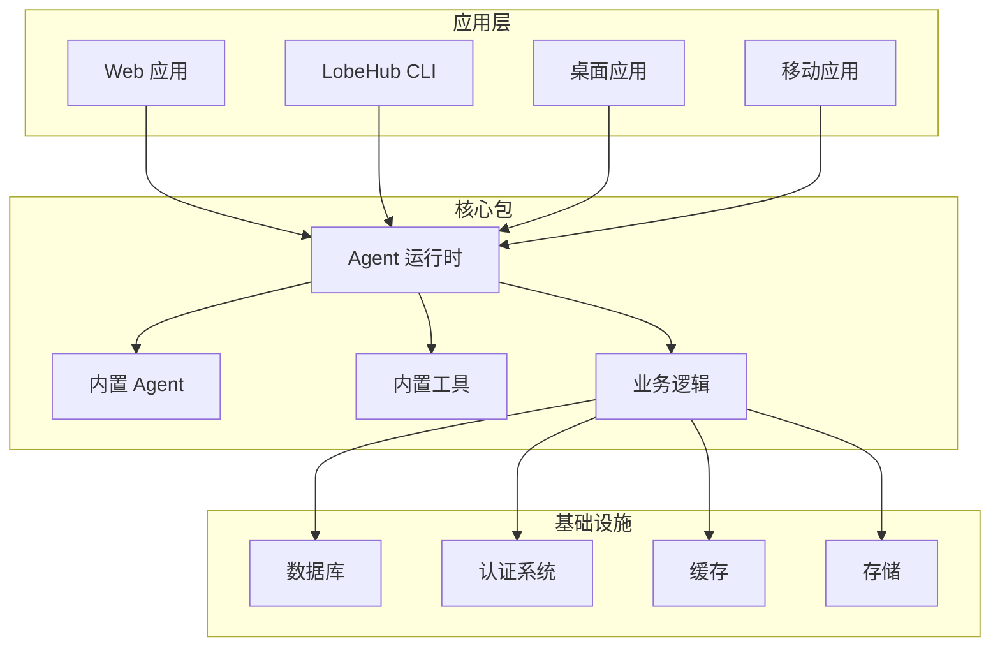
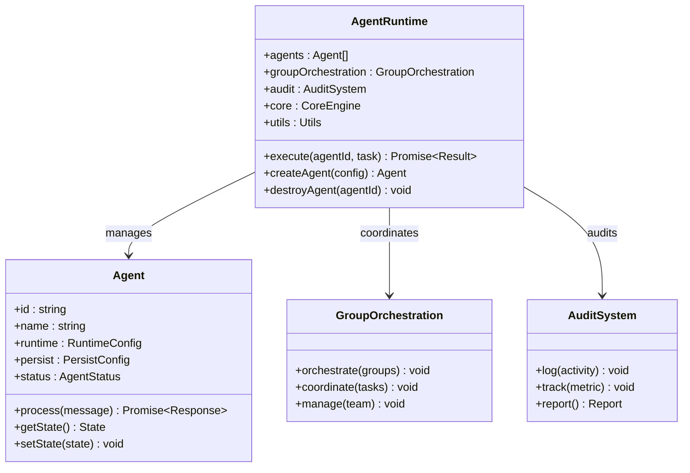
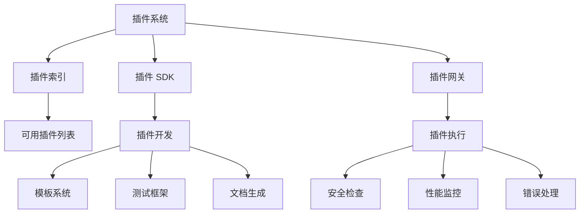
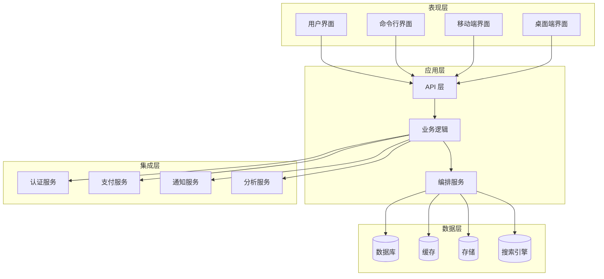
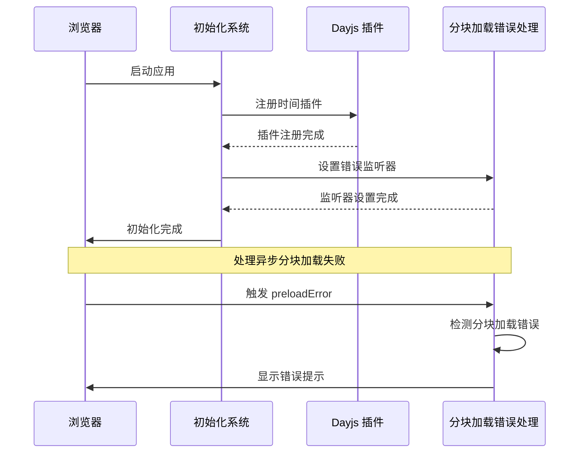
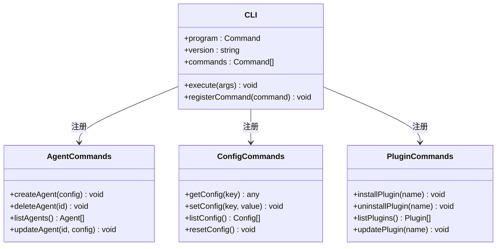
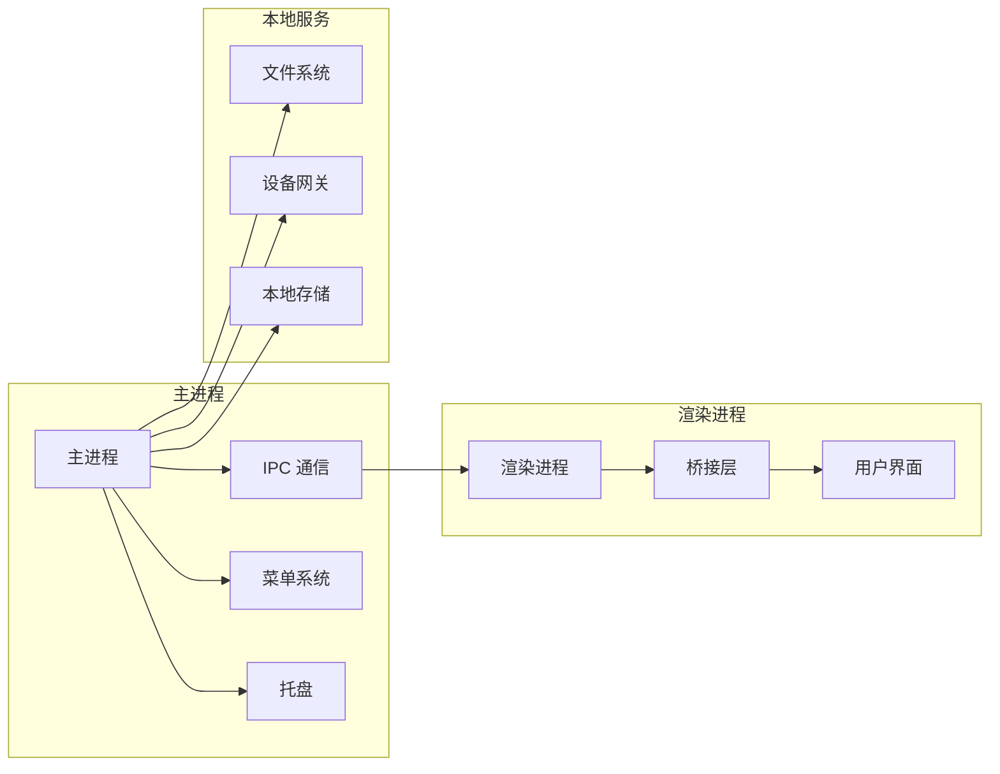
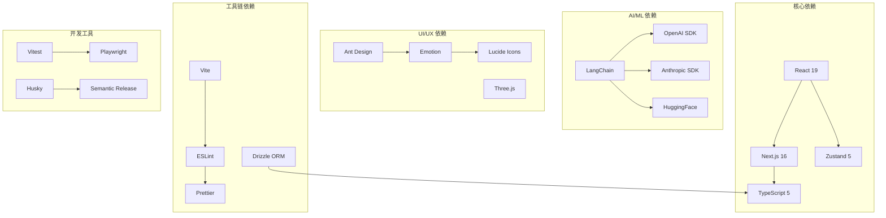
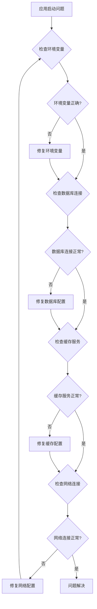

# 社区聚合器系统

<cite>
**本文档引用的文件**
- [README.md](file://README.md)
- [package.json](file://package.json)
- [src/initialize.ts](file://src/initialize.ts)
- [apps/cli/src/index.ts](file://apps/cli/src/index.ts)
- [apps/desktop/package.json](file://apps/desktop/package.json)
- [apps/cli/package.json](file://apps/cli/package.json)
- [packages/agent-runtime/src/index.ts](file://packages/agent-runtime/src/index.ts)
- [packages/builtin-agents/src/index.ts](file://packages/builtin-agents/src/index.ts)
</cite>

## 目录
1. [简介](#简介)
2. [项目结构](#项目结构)
3. [核心组件](#核心组件)
4. [架构概览](#架构概览)
5. [详细组件分析](#详细组件分析)
6. [依赖关系分析](#依赖关系分析)
7. [性能考虑](#性能考虑)
8. [故障排除指南](#故障排除指南)
9. [结论](#结论)

## 简介

LobeHub 是一个开源的综合性 AI Agent 框架，专注于构建人类与 AI 团队协作的工作空间。该系统支持语音合成、多模态交互以及可扩展的功能调用插件系统，提供一键免费部署私有 ChatGPT/LLM 网页应用程序的能力。

该项目采用现代化的技术栈，包括 Next.js、Vite、React 19、TypeScript 等核心技术，构建了一个功能丰富且高度可扩展的 AI Agent 生态系统。

## 项目结构

LobeHub 采用多包工作区（monorepo）架构，主要包含以下核心模块：

**图表来源**
- [package.json:30-35](file://package.json#L30-L35)
- [apps/cli/src/index.ts:1-51](file://apps/cli/src/index.ts#L1-L51)

**章节来源**
- [package.json:30-35](file://package.json#L30-L35)
- [README.md:125-564](file://README.md#L125-L564)

## 核心组件

### Agent 运行时系统

Agent 运行时是整个系统的核心执行引擎，负责管理 AI Agent 的生命周期、状态管理和任务协调。

**图表来源**
- [packages/agent-runtime/src/index.ts:1-7](file://packages/agent-runtime/src/index.ts#L1-L7)

### 内置 Agent 系统

系统提供了多种预定义的内置 Agent，每种 Agent 都针对特定的工作场景进行了优化：

| Agent 类型 | 功能描述 | 使用场景 |
|------------|----------|----------|
| Agent Builder | 自动化 Agent 创建 | 快速生成个性化 AI 助手 |
| Group Agent Builder | 多 Agent 协作编排 | 团队协作和项目管理 |
| Group Supervisor | Agent 组监督者 | 任务分配和进度监控 |
| Inbox | 消息收件箱 | 统一消息管理和通知 |
| Page Agent | 页面内容代理 | 文档编写和内容创作 |

**章节来源**
- [packages/builtin-agents/src/index.ts:1-55](file://packages/builtin-agents/src/index.ts#L1-L55)

### 插件生态系统

LobeHub 提供了强大的插件系统，支持超过 10,000 种技能和 MCP 兼容插件：

**图表来源**
- [README.md:387-420](file://README.md#L387-L420)

**章节来源**
- [README.md:387-420](file://README.md#L387-L420)

## 架构概览

LobeHub 采用了分层架构设计，确保系统的可扩展性和可维护性：

**图表来源**
- [package.json:157-401](file://package.json#L157-L401)

## 详细组件分析

### 初始化系统

应用启动时会进行一系列初始化操作，确保系统正常运行：

**图表来源**
- [src/initialize.ts:1-37](file://src/initialize.ts#L1-L37)

**章节来源**
- [src/initialize.ts:1-37](file://src/initialize.ts#L1-L37)

### CLI 工具链

LobeHub 提供了完整的命令行工具，支持各种管理操作：

**图表来源**
- [apps/cli/src/index.ts:1-51](file://apps/cli/src/index.ts#L1-L51)

**章节来源**
- [apps/cli/src/index.ts:1-51](file://apps/cli/src/index.ts#L1-L51)

### 桌面应用架构

桌面应用基于 Electron 构建，提供原生应用体验：

**图表来源**
- [apps/desktop/package.json:1-123](file://apps/desktop/package.json#L1-L123)

**章节来源**
- [apps/desktop/package.json:1-123](file://apps/desktop/package.json#L1-L123)

## 依赖关系分析

LobeHub 的依赖关系呈现复杂的多层次结构：

**图表来源**
- [package.json:157-401](file://package.json#L157-L401)

**章节来源**
- [package.json:157-401](file://package.json#L157-L401)

## 性能考虑

### 缓存策略

系统实现了多层次的缓存机制来优化性能：

1. **浏览器缓存**：利用浏览器的 HTTP 缓存和 IndexedDB 存储
2. **应用级缓存**：使用 Zustand 状态管理进行内存缓存
3. **服务端缓存**：Redis 缓存常用数据和计算结果
4. **CDN 缓存**：静态资源通过 CDN 加速分发

### 异步加载

为了提升首屏加载速度，系统采用异步加载策略：

- **代码分割**：按路由和功能模块进行代码分割
- **懒加载组件**：非关键路径组件延迟加载
- **预加载策略**：关键资源提前预加载
- **分块错误处理**：自动检测和处理分块加载失败

### 数据库优化

- **连接池管理**：优化数据库连接复用
- **查询优化**：使用索引和查询计划优化
- **批量操作**：减少数据库往返次数
- **读写分离**：分离读写操作提高并发性能

## 故障排除指南

### 常见问题诊断

### 错误监控和日志

系统集成了全面的错误监控和日志记录机制：

- **前端错误捕获**：全局错误边界和 Promise 拒绝处理
- **后端错误追踪**：结构化日志和错误堆栈跟踪
- **性能监控**：关键指标收集和性能分析
- **用户行为追踪**：用户操作和使用模式分析

**章节来源**
- [src/initialize.ts:19-32](file://src/initialize.ts#L19-L32)

## 结论

LobeHub 社区聚合器系统是一个功能完整、架构清晰的 AI Agent 生态平台。其设计特点包括：

1. **模块化架构**：采用多包工作区结构，便于维护和扩展
2. **全平台支持**：同时支持 Web、CLI、桌面和移动应用
3. **强大的插件系统**：支持超过 10,000 种技能和 MCP 兼容插件
4. **高性能设计**：优化的缓存策略和异步加载机制
5. **完善的开发工具链**：从开发到部署的完整工具支持

该系统为构建下一代 AI Agent 应用提供了坚实的基础，支持从个人使用到企业级部署的各种场景需求。