# 艺术作品生成屏幕

<cite>
**本文档引用的文件**
- [ArtworkScreen.tsx](file://apps/mobile/src/screens/ArtworkScreen.tsx)
- [api.ts](file://apps/mobile/src/lib/api.ts)
- [types/index.ts](file://apps/mobile/src/types/index.ts)
- [tokens.ts](file://apps/mobile/src/theme/tokens.ts)
- [add-new-image-model.mdx](file://docs/development/basic/add-new-image-model.mdx)
- [dimensionConstraints.ts](file://src/routes/(main)/image/_layout/ConfigPanel/utils/dimensionConstraints.ts)
- [aspectRatio.ts](file://src/store/image/utils/aspectRatio.ts)
- [ImageResolutionSlider.tsx](file://src/features/ModelSwitchPanel/components/ControlsForm/ImageResolutionSlider.tsx)
- [ImageResolution2Slider.tsx](file://src/features/ModelSwitchPanel/components/ControlsForm/ImageResolution2Slider.tsx)
</cite>

## 目录

1. [简介](#简介)
2. [项目结构](#项目结构)
3. [核心组件](#核心组件)
4. [架构概览](#架构概览)
5. [详细组件分析](#详细组件分析)
6. [依赖关系分析](#依赖关系分析)
7. [性能考虑](#性能考虑)
8. [故障排除指南](#故障排除指南)
9. [结论](#结论)

## 简介

艺术作品生成屏幕是 LobeHub 移动应用中的一个核心功能模块，专门用于图像生成和管理。该屏幕提供了完整的 AI 图像生成功能，包括模型选择、参数配置、参考图像上传、批量生成和结果展示等完整工作流程。

该系统支持多种 AI 提供商（如 OpenAI、DALL-E、Midjourney 等）的图像生成服务，用户可以通过直观的界面进行图像创作，并实时跟踪生成进度。系统采用响应式设计，适配各种移动设备屏幕尺寸。

## 项目结构

艺术作品生成屏幕位于移动应用的 screens 目录中，采用模块化设计：

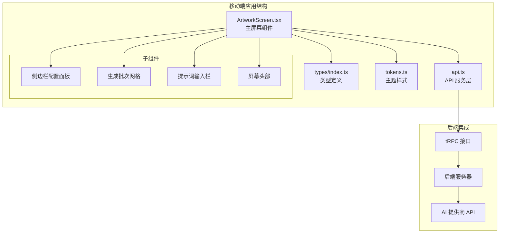

**图表来源**

- [ArtworkScreen.tsx:1-1032](file://apps/mobile/src/screens/ArtworkScreen.tsx#L1-L1032)
- [api.ts:559-604](file://apps/mobile/src/lib/api.ts#L559-L604)

**章节来源**

- [ArtworkScreen.tsx:1-1032](file://apps/mobile/src/screens/ArtworkScreen.tsx#L1-L1032)
- [api.ts:1-604](file://apps/mobile/src/lib/api.ts#L1-L604)

## 核心组件

### 主要功能模块

艺术作品生成屏幕包含以下核心功能模块：

1. **模型选择器** - 支持多种 AI 图像生成模型的动态加载和选择
2. **配置面板** - 包括分辨率、宽高比、图像数量等参数设置
3. **参考图像上传** - 支持多张参考图片的上传和管理
4. **生成队列管理** - 实时跟踪生成状态和进度
5. **结果展示** - 网格布局展示生成的图像结果

### 数据流架构

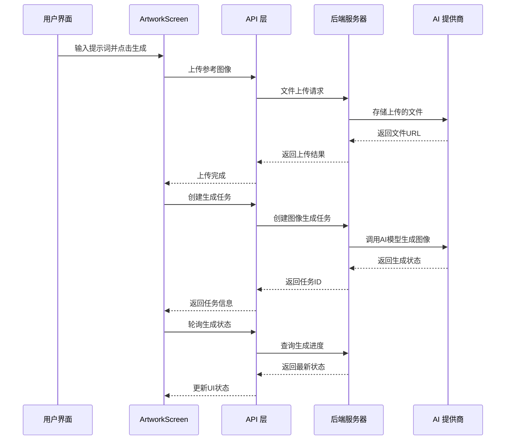

**图表来源**

- [ArtworkScreen.tsx:376-453](file://apps/mobile/src/screens/ArtworkScreen.tsx#L376-L453)
- [api.ts:559-604](file://apps/mobile/src/lib/api.ts#L559-L604)

**章节来源**

- [ArtworkScreen.tsx:189-1018](file://apps/mobile/src/screens/ArtworkScreen.tsx#L189-L1018)
- [api.ts:559-604](file://apps/mobile/src/lib/api.ts#L559-L604)

## 架构概览

### 整体架构设计

艺术作品生成屏幕采用分层架构设计，确保了良好的可维护性和扩展性：

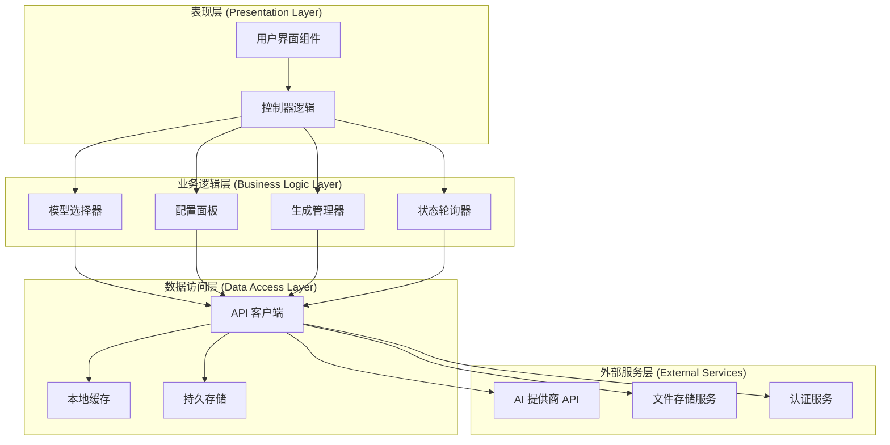

**图表来源**

- [ArtworkScreen.tsx:216-309](file://apps/mobile/src/screens/ArtworkScreen.tsx#L216-L309)
- [api.ts:299-317](file://apps/mobile/src/lib/api.ts#L299-L317)

### 状态管理模式

系统采用集中式状态管理，通过 React Hooks 和自定义存储解决方案实现：

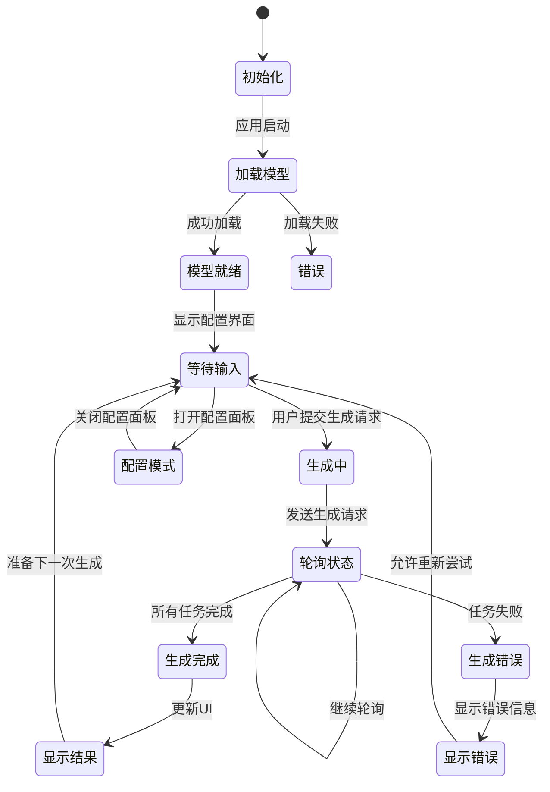

**图表来源**

- [ArtworkScreen.tsx:334-373](file://apps/mobile/src/screens/ArtworkScreen.tsx#L334-L373)
- [ArtworkScreen.tsx:455-463](file://apps/mobile/src/screens/ArtworkScreen.tsx#L455-L463)

**章节来源**

- [ArtworkScreen.tsx:216-309](file://apps/mobile/src/screens/ArtworkScreen.tsx#L216-L309)

## 详细组件分析

### 主屏幕组件 (ArtworkScreen)

主屏幕组件是整个艺术作品生成功能的核心，负责协调所有子组件和业务逻辑：

#### 组件状态管理

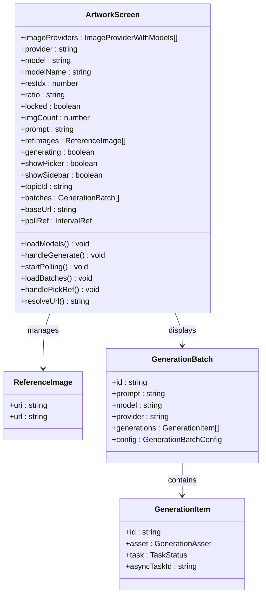

**图表来源**

- [ArtworkScreen.tsx:189-214](file://apps/mobile/src/screens/ArtworkScreen.tsx#L189-L214)
- [types/index.ts:501-541](file://apps/mobile/src/types/index.ts#L501-L541)

#### 生成流程控制

生成流程采用异步状态管理，确保用户体验的流畅性：

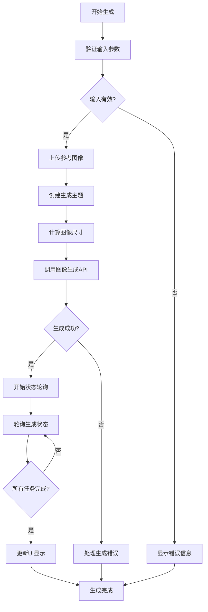

**图表来源**

- [ArtworkScreen.tsx:376-453](file://apps/mobile/src/screens/ArtworkScreen.tsx#L376-L453)
- [ArtworkScreen.tsx:334-373](file://apps/mobile/src/screens/ArtworkScreen.tsx#L334-L373)

**章节来源**

- [ArtworkScreen.tsx:189-1018](file://apps/mobile/src/screens/ArtworkScreen.tsx#L189-L1018)

### API 服务层

API 服务层封装了与后端服务器的所有通信逻辑，提供统一的接口给前端组件使用：

#### 核心 API 方法

| 方法名                | 功能描述               | 参数                                                   | 返回值                               |
| --------------------- | ---------------------- | ------------------------------------------------------ | ------------------------------------ |
| `getRuntimeState`     | 获取 AI 提供商运行状态 | 无                                                     | `AiProviderRuntimeState`             |
| `createTopic`         | 创建新的生成主题       | `type: 'image'`                                        | `Promise<string>`                    |
| `createImage`         | 创建图像生成任务       | `generationTopicId, imageNum, model, provider, params` | `Promise<GenerationResult>`          |
| `getBatches`          | 获取生成批次列表       | `topicId, type: 'image'`                               | `Promise<GenerationBatch[]>`         |
| `getGenerationStatus` | 获取生成状态           | `generationId, asyncTaskId`                            | `Promise<GenerationStatus>`          |
| `upload`              | 上传文件               | `uri, name, type`                                      | `Promise<{id: string, url: string}>` |

#### 错误处理机制

API 层实现了完善的错误处理机制：

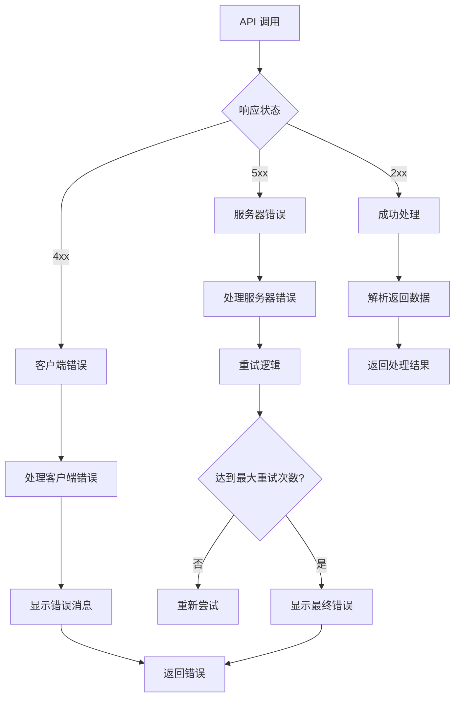

**图表来源**

- [api.ts:111-138](file://apps/mobile/src/lib/api.ts#L111-L138)
- [api.ts:559-604](file://apps/mobile/src/lib/api.ts#L559-L604)

**章节来源**

- [api.ts:299-317](file://apps/mobile/src/lib/api.ts#L299-L317)
- [api.ts:559-604](file://apps/mobile/src/lib/api.ts#L559-L604)

### 类型定义系统

系统使用 TypeScript 进行严格的类型定义，确保数据结构的一致性和安全性：

#### 核心类型定义

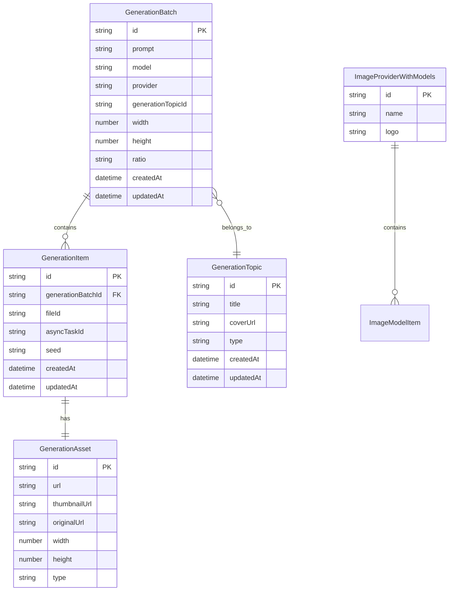

**图表来源**

- [types/index.ts:492-568](file://apps/mobile/src/types/index.ts#L492-L568)

**章节来源**

- [types/index.ts:492-568](file://apps/mobile/src/types/index.ts#L492-L568)

## 依赖关系分析

### 外部依赖

艺术作品生成屏幕依赖于多个外部库和服务：

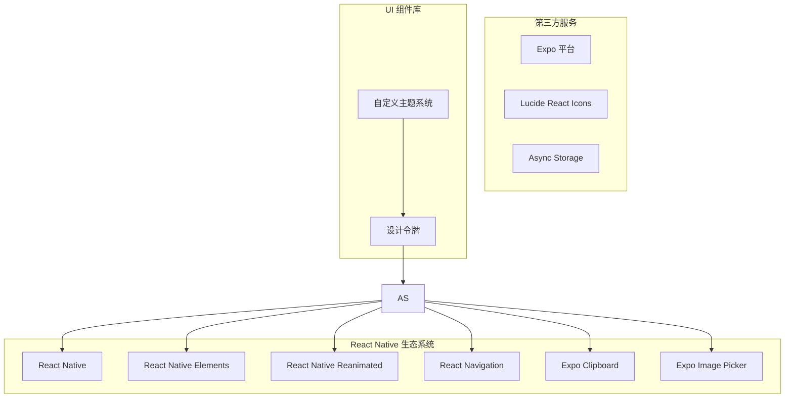

**图表来源**

- [ArtworkScreen.tsx:8-50](file://apps/mobile/src/screens/ArtworkScreen.tsx#L8-L50)

### 内部模块依赖

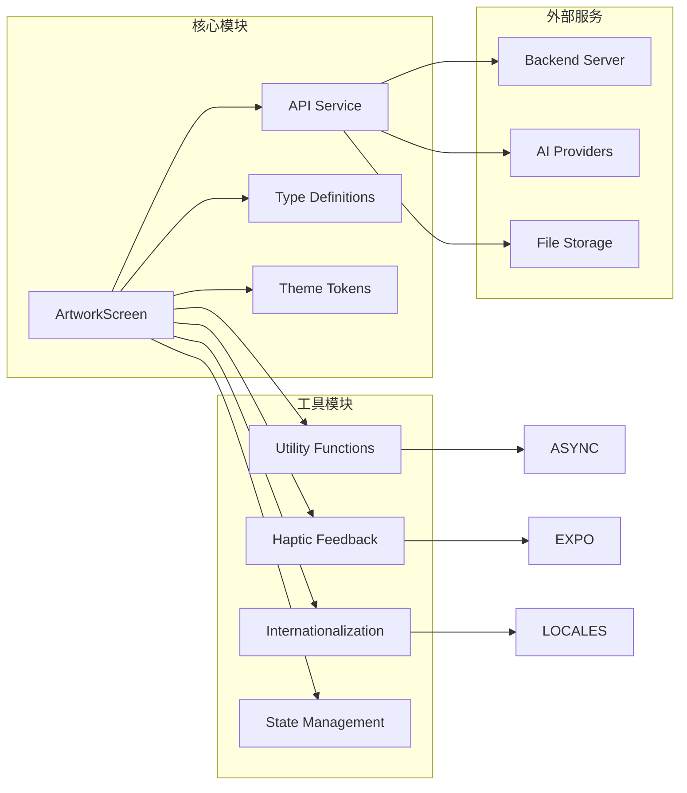

**图表来源**

- [ArtworkScreen.tsx:43-49](file://apps/mobile/src/screens/ArtworkScreen.tsx#L43-L49)
- [api.ts:14-46](file://apps/mobile/src/lib/api.ts#L14-L46)

**章节来源**

- [ArtworkScreen.tsx:8-50](file://apps/mobile/src/screens/ArtworkScreen.tsx#L8-L50)
- [api.ts:14-46](file://apps/mobile/src/lib/api.ts#L14-L46)

## 性能考虑

### 响应式设计优化

系统采用了多项性能优化策略：

1. **懒加载组件** - 使用 React.lazy 和 Suspense 实现组件的按需加载
2. **虚拟滚动** - 对大量生成结果使用虚拟滚动技术
3. **图片优化** - 自动缩放和压缩生成的图像
4. **状态缓存** - 使用 AsyncStorage 缓存用户配置

### 网络请求优化

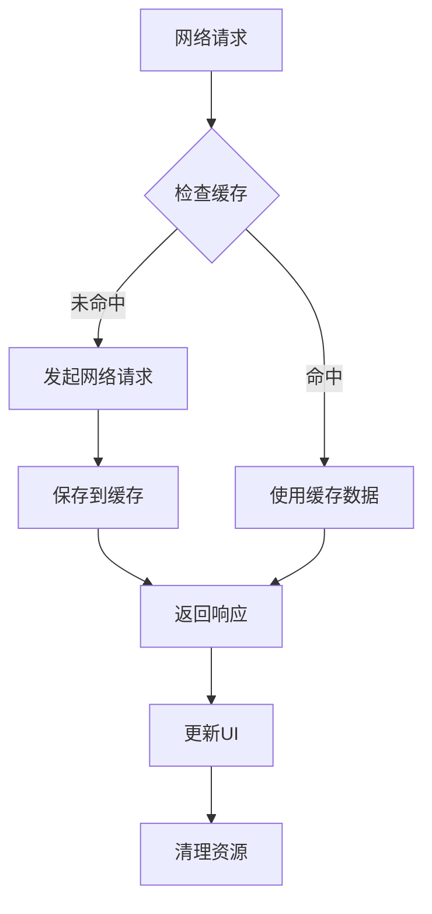

**图表来源**

- [ArtworkScreen.tsx:262-290](file://apps/mobile/src/screens/ArtworkScreen.tsx#L262-L290)

### 内存管理

系统实现了智能的内存管理策略：

- **自动清理** - 组件卸载时自动清理定时器和事件监听器
- **图片释放** - 使用完成后及时释放图片资源
- **状态重置** - 生成完成后重置相关状态避免内存泄漏

## 故障排除指南

### 常见问题及解决方案

#### 1. 图像生成失败

**症状**: 生成任务长时间处于 Processing 状态或直接失败

**可能原因**:

- AI 提供商 API 限制
- 网络连接不稳定
- 模型参数超出限制

**解决步骤**:

1. 检查网络连接状态
2. 验证 AI 提供商的 API 密钥配置
3. 调整图像尺寸和参数设置
4. 查看详细的错误日志

#### 2. 参考图像上传失败

**症状**: 参考图像无法上传或显示为占位符

**解决方法**:

1. 确认文件格式和大小限制
2. 检查存储权限设置
3. 尝试重新选择文件
4. 清理应用缓存后重试

#### 3. 状态轮询异常

**症状**: 生成状态不更新或更新延迟

**排查步骤**:

1. 检查定时器是否正常工作
2. 验证 API 响应格式
3. 确认网络请求是否被拦截
4. 查看控制台错误信息

**章节来源**

- [ArtworkScreen.tsx:334-373](file://apps/mobile/src/screens/ArtworkScreen.tsx#L334-L373)

### 开发调试技巧

#### 日志记录策略

系统在关键节点添加了详细的日志记录：

```typescript
// 生成前的日志
console.log('开始生成图像:', { prompt, model, dimensions });

// 状态更新日志
console.log('生成状态更新:', { generationId, status, progress });

// 错误日志
console.error('图像生成失败:', { error, params });
```

#### 性能监控

建议使用以下工具进行性能监控：

- React DevTools Profiler
- Flipper Network Inspector
- Expo Dev Menu

## 结论

艺术作品生成屏幕是一个功能完整、架构清晰的图像生成系统。它成功地将复杂的 AI 图像生成功能封装在一个简洁易用的界面中，为用户提供了流畅的创作体验。

### 主要优势

1. **用户友好**: 直观的界面设计和流畅的交互体验
2. **功能完整**: 支持多种 AI 提供商和丰富的配置选项
3. **性能优化**: 采用多项性能优化策略确保流畅运行
4. **可扩展性**: 模块化的架构设计便于功能扩展和维护

### 技术亮点

- 响应式设计适配各种移动设备
- 异步状态管理和错误处理机制
- 类型安全的 TypeScript 实现
- 智能的缓存和资源管理策略

该系统为 AI 图像生成领域提供了一个优秀的参考实现，展示了如何将复杂的技术功能转化为简单易用的应用程序。
