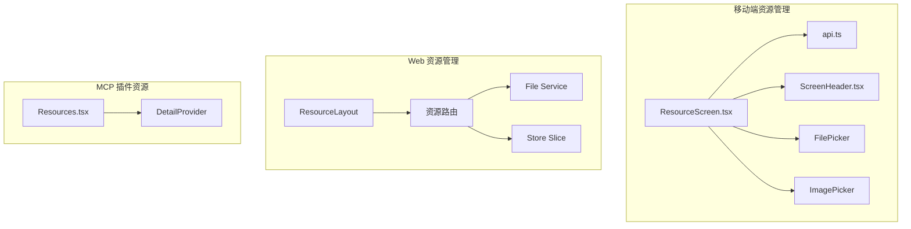
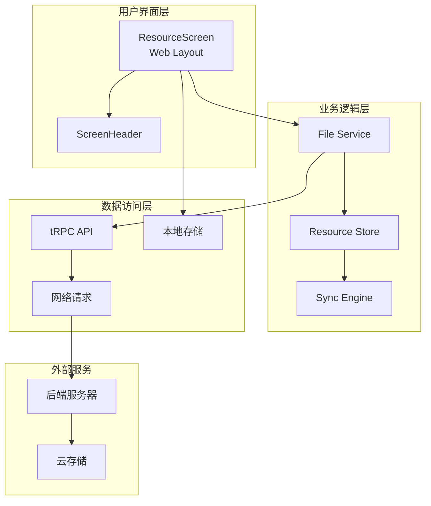
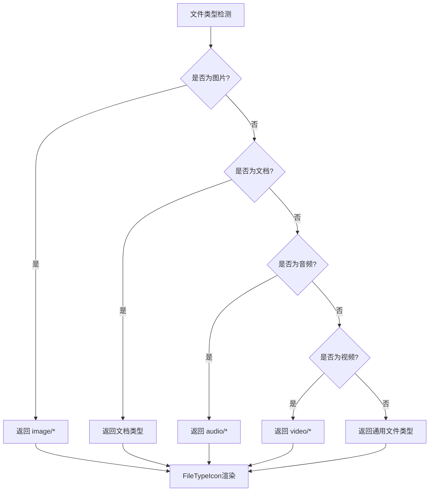
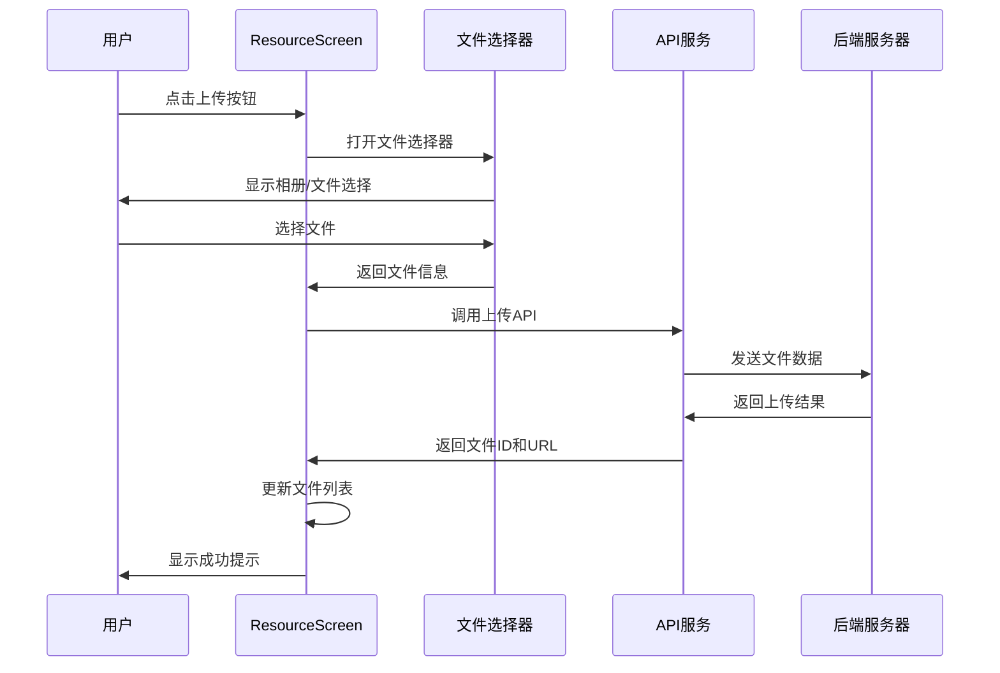
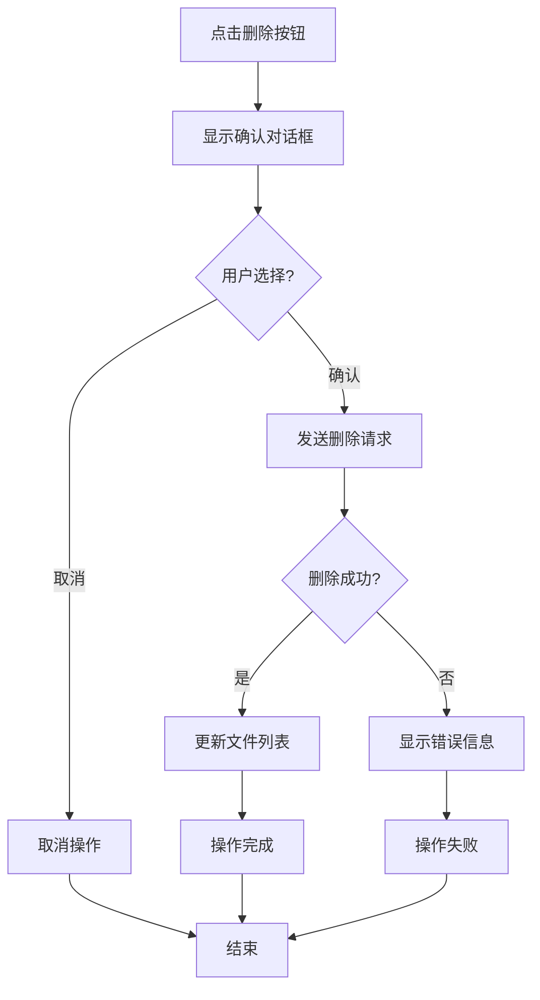
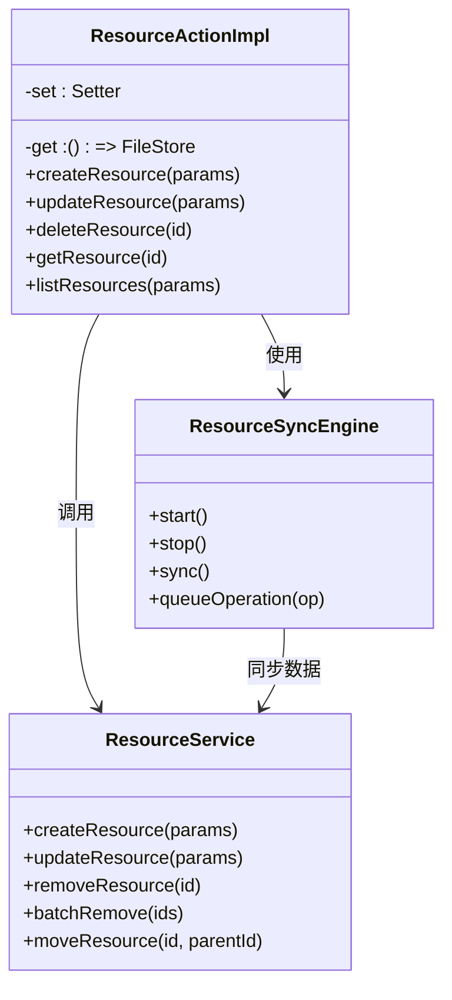
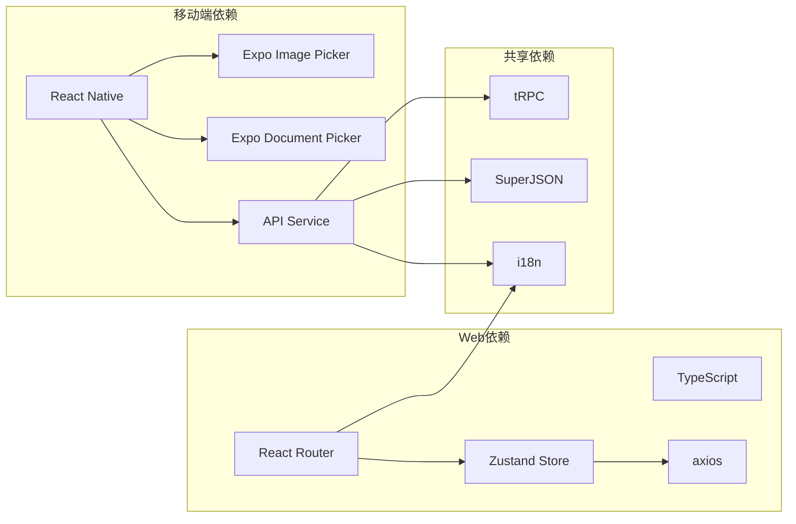

# 资源访问屏幕

<cite>
**本文档中引用的文件**
- [ResourceScreen.tsx](file://apps/mobile/src/screens/ResourceScreen.tsx)
- [api.ts](file://apps/mobile/src/lib/api.ts)
- [ScreenHeader.tsx](file://apps/mobile/src/components/ui/ScreenHeader.tsx)
- [Resources.tsx](file://src/features/MCPPluginDetail/Schema/Resources.tsx)
- [index.tsx](file://src/routes/(main)/resource/_layout/index.tsx)
- [action.ts](file://src/store/file/slices/resource/action.ts)
- [index.ts](file://src/services/resource/index.ts)
</cite>

## 目录

1. [简介](#简介)
2. [项目结构](#项目结构)
3. [核心组件](#核心组件)
4. [架构概览](#架构概览)
5. [详细组件分析](#详细组件分析)
6. [依赖关系分析](#依赖关系分析)
7. [性能考虑](#性能考虑)
8. [故障排除指南](#故障排除指南)
9. [结论](#结论)

## 简介

资源访问屏幕是 LobeHub 应用中的一个关键功能模块，为用户提供了一个统一的界面来管理、查看和操作各种类型的文件资源。该系统支持多种文件类型（图像、文档、音频、视频），提供上传、删除、搜索和分类浏览等功能。

该功能主要分为两个平台实现：

- **移动端实现**：基于 React Native 的 ResourceScreen 组件
- **Web 实现**：基于 React Router 的资源管理界面

## 项目结构

资源访问功能在项目中的组织结构如下：

**图表来源**

- [ResourceScreen.tsx:1-469](file://apps/mobile/src/screens/ResourceScreen.tsx#L1-L469)
- [api.ts:1-604](file://apps/mobile/src/lib/api.ts#L1-L604)
- [index.tsx:1-18](<file://src/routes/(main)/resource/_layout/index.tsx#L1-L18>)

**章节来源**

- [ResourceScreen.tsx:1-50](file://apps/mobile/src/screens/ResourceScreen.tsx#L1-L50)
- [index.tsx:1-18](<file://src/routes/(main)/resource/_layout/index.tsx#L1-L18>)

## 核心组件

### 移动端资源屏幕 (ResourceScreen)

ResourceScreen 是移动端的核心组件，提供了完整的文件管理功能：

**主要特性：**

- 文件列表展示（支持所有、图片、文档、其他分类）
- 文件上传功能（支持相机胶卷和文件选择器）
- 文件删除确认机制
- 下拉刷新功能
- 搜索过滤功能
- 图像缩略图预览

**状态管理：**

- 文件列表状态 (`files`)
- 加载状态 (`loading`)
- 刷新状态 (`refreshing`)
- 上传状态 (`uploading`)
- 分类筛选 (`category`)
- 搜索文本 (`searchText`)

**章节来源**

- [ResourceScreen.tsx:172-469](file://apps/mobile/src/screens/ResourceScreen.tsx#L172-L469)

### API 服务层

文件操作通过专门的 API 服务层进行管理：

**核心功能：**

- 文件列表获取
- 文件上传处理
- 文件删除操作
- tRPC 协议封装
- 超级 JSON 数据转换

**章节来源**

- [api.ts:319-350](file://apps/mobile/src/lib/api.ts#L319-L350)

### Web 资源布局

Web 平台采用 React Router 的布局模式：

**布局结构：**

- 资源主布局组件
- 热键注册功能
- 嵌套路由支持

**章节来源**

- [index.tsx:8-17](<file://src/routes/(main)/resource/_layout/index.tsx#L8-L17>)

## 架构概览

资源访问系统的整体架构采用分层设计：

**图表来源**

- [ResourceScreen.tsx:172-469](file://apps/mobile/src/screens/ResourceScreen.tsx#L172-L469)
- [api.ts:111-138](file://apps/mobile/src/lib/api.ts#L111-L138)
- [action.ts:28-36](file://src/store/file/slices/resource/action.ts#L28-L36)

## 详细组件分析

### 文件类型识别系统

系统实现了智能的文件类型识别机制：

**图表来源**

- [ResourceScreen.tsx:62-102](file://apps/mobile/src/screens/ResourceScreen.tsx#L62-L102)

**章节来源**

- [ResourceScreen.tsx:62-102](file://apps/mobile/src/screens/ResourceScreen.tsx#L62-L102)

### 文件上传流程

文件上传采用异步处理机制：

**图表来源**

- [ResourceScreen.tsx:223-237](file://apps/mobile/src/screens/ResourceScreen.tsx#L223-L237)
- [api.ts:333-348](file://apps/mobile/src/lib/api.ts#L333-L348)

**章节来源**

- [ResourceScreen.tsx:223-286](file://apps/mobile/src/screens/ResourceScreen.tsx#L223-L286)
- [api.ts:333-348](file://apps/mobile/src/lib/api.ts#L333-L348)

### 文件删除确认机制

系统采用安全的删除确认流程：

**图表来源**

- [ResourceScreen.tsx:290-311](file://apps/mobile/src/screens/ResourceScreen.tsx#L290-L311)

**章节来源**

- [ResourceScreen.tsx:290-311](file://apps/mobile/src/screens/ResourceScreen.tsx#L290-L311)

### 资源同步引擎

Web 平台实现了资源同步机制：

**图表来源**

- [action.ts:28-36](file://src/store/file/slices/resource/action.ts#L28-L36)
- [index.ts:222-248](file://src/services/resource/index.ts#L222-L248)

**章节来源**

- [action.ts:28-36](file://src/store/file/slices/resource/action.ts#L28-L36)
- [index.ts:222-248](file://src/services/resource/index.ts#L222-L248)

## 依赖关系分析

资源访问系统的依赖关系如下：

**图表来源**

- [ResourceScreen.tsx:12-49](file://apps/mobile/src/screens/ResourceScreen.tsx#L12-L49)
- [api.ts:14-46](file://apps/mobile/src/lib/api.ts#L14-L46)

**章节来源**

- [ResourceScreen.tsx:12-49](file://apps/mobile/src/screens/ResourceScreen.tsx#L12-L49)
- [api.ts:14-46](file://apps/mobile/src/lib/api.ts#L14-L46)

## 性能考虑

### 移动端优化策略

1. **懒加载实现**：使用 React Native 的 FlatList 进行虚拟化渲染
2. **图片缓存**：缩略图使用本地缓存机制
3. **网络优化**：批量文件上传，减少网络请求次数
4. **内存管理**：及时清理不再使用的文件引用

### Web 平台优化

1. **状态管理**：使用 Zustand 进行轻量级状态管理
2. **数据同步**：实现增量同步，避免全量数据传输
3. **缓存策略**：本地存储常用资源信息
4. **并发控制**：限制同时进行的文件操作数量

## 故障排除指南

### 常见问题及解决方案

**文件上传失败**

- 检查网络连接状态
- 验证文件大小限制
- 确认权限设置
- 查看服务器响应状态码

**文件列表加载缓慢**

- 清理本地缓存数据
- 检查服务器响应时间
- 减少同时进行的操作数量
- 优化网络请求参数

**搜索功能异常**

- 验证搜索关键词格式
- 检查服务器搜索接口
- 确认索引状态
- 清除搜索历史记录

**章节来源**

- [ResourceScreen.tsx:190-210](file://apps/mobile/src/screens/ResourceScreen.tsx#L190-L210)
- [api.ts:82-92](file://apps/mobile/src/lib/api.ts#L82-L92)

## 结论

资源访问屏幕是一个功能完整、架构清晰的文件管理系统。它成功地在移动端和 Web 平台之间实现了功能对等，提供了统一的用户体验。系统的主要优势包括：

1. **跨平台一致性**：移动端和 Web 版本提供相似的功能体验
2. **模块化设计**：清晰的组件分离和职责划分
3. **性能优化**：针对不同平台的特定优化策略
4. **扩展性**：易于添加新的文件类型和功能特性

该系统为用户提供了高效、直观的文件管理体验，是 LobeHub 应用的重要组成部分。
