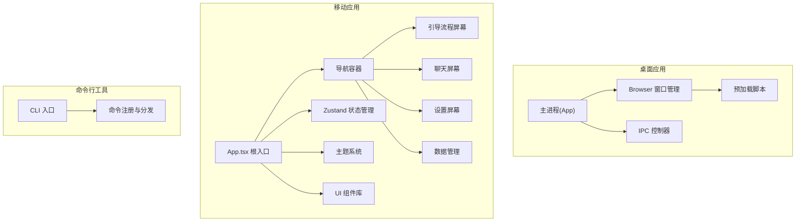
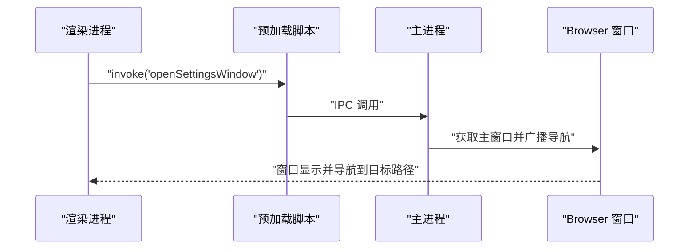
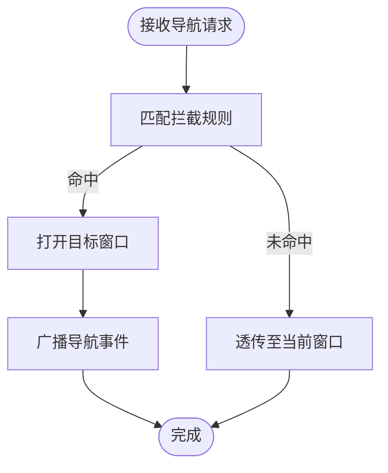
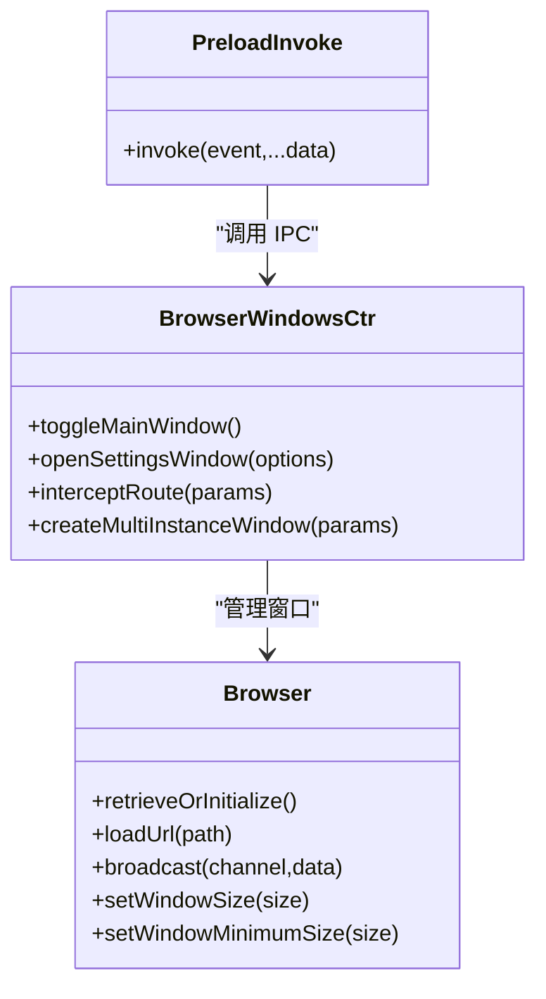
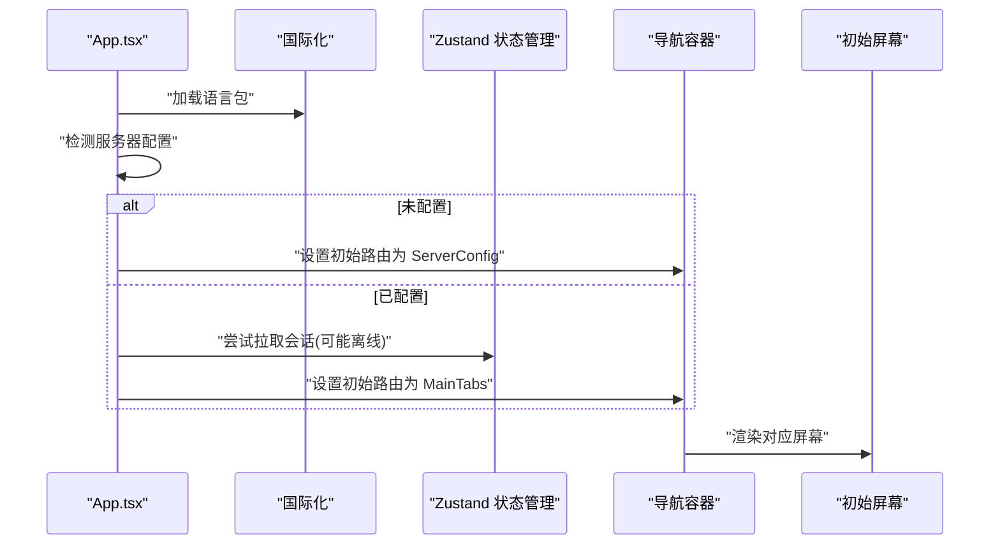
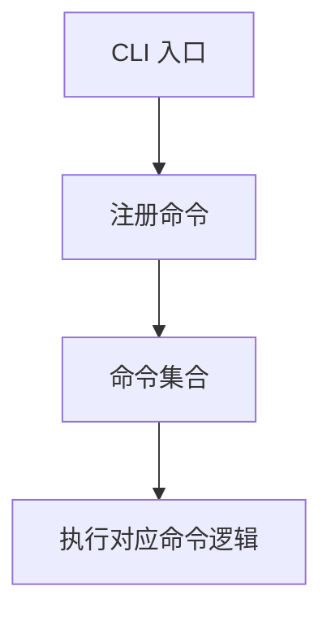
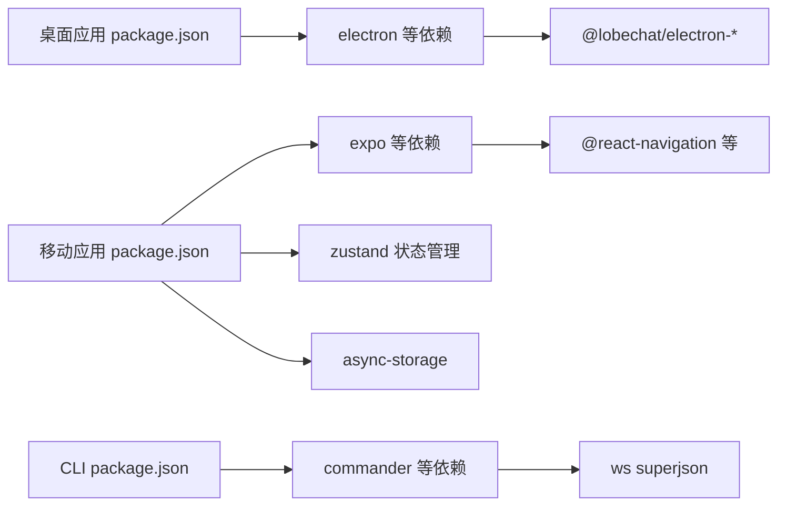

# 跨平台支持

<cite>
**本文引用的文件**
- [apps/desktop/package.json](file://apps/desktop/package.json)
- [apps/mobile/package.json](file://apps/mobile/package.json)
- [apps/cli/package.json](file://apps/cli/package.json)
- [apps/mobile/App.tsx](file://apps/mobile/App.tsx)
- [apps/mobile/src/navigation/index.tsx](file://apps/mobile/src/navigation/index.tsx)
- [apps/mobile/src/screens/ServerConfigScreen.tsx](file://apps/mobile/src/screens/ServerConfigScreen.tsx)
- [apps/mobile/src/screens/ChatListScreen.tsx](file://apps/mobile/src/screens/ChatListScreen.tsx)
- [apps/mobile/src/screens/ChatDetailScreen.tsx](file://apps/mobile/src/screens/ChatDetailScreen.tsx)
- [apps/mobile/src/screens/onboarding/WelcomeScreen.tsx](file://apps/mobile/src/screens/onboarding/WelcomeScreen.tsx)
- [apps/mobile/src/screens/onboarding/ProviderSetupScreen.tsx](file://apps/mobile/src/screens/onboarding/ProviderSetupScreen.tsx)
- [apps/mobile/src/screens/onboarding/CompletionScreen.tsx](file://apps/mobile/src/screens/onboarding/CompletionScreen.tsx)
- [apps/mobile/src/screens/ChatSettingsScreen.tsx](file://apps/mobile/src/screens/ChatSettingsScreen.tsx)
- [apps/mobile/src/screens/DataManagementScreen.tsx](file://apps/mobile/src/screens/DataManagementScreen.tsx)
- [apps/mobile/src/services/api.ts](file://apps/mobile/src/services/api.ts)
- [apps/mobile/src/store/session.ts](file://apps/mobile/src/store/session.ts)
- [apps/mobile/src/store/chat.ts](file://apps/mobile/src/store/chat.ts)
- [apps/mobile/src/store/sessionGroup.ts](file://apps/mobile/src/store/sessionGroup.ts)
- [apps/mobile/src/store/discover.ts](file://apps/mobile/src/store/discover.ts)
- [apps/mobile/src/store/file.ts](file://apps/mobile/src/store/file.ts)
- [apps/mobile/src/store/topic.ts](file://apps/mobile/src/store/topic.ts)
- [apps/mobile/src/store/connection.ts](file://apps/mobile/src/store/connection.ts)
- [apps/mobile/src/theme/index.ts](file://apps/mobile/src/theme/index.ts)
- [apps/mobile/src/theme/tokens.ts](file://apps/mobile/src/theme/tokens.ts)
- [apps/mobile/src/lib/api.ts](file://apps/mobile/src/lib/api.ts)
- [apps/mobile/src/components/ui/ScreenHeader.tsx](file://apps/mobile/src/components/ui/ScreenHeader.tsx)
- [apps/mobile/src/components/ui/QuickActionRow.tsx](file://apps/mobile/src/components/ui/QuickActionRow.tsx)
- [apps/mobile/src/components/ui/SettingsGroup.tsx](file://apps/mobile/src/components/ui/SettingsGroup.tsx)
- [apps/cli/src/index.ts](file://apps/cli/src/index.ts)
- [apps/cli/src/commands/config.ts](file://apps/cli/src/commands/config.ts)
- [apps/cli/src/commands/login.ts](file://apps/cli/src/commands/login.ts)
- [apps/cli/src/commands/logout.ts](file://apps/cli/src/commands/logout.ts)
- [apps/cli/src/commands/status.ts](file://apps/cli/src/commands/status.ts)
- [apps/cli/src/commands/search.ts](file://apps/cli/src/commands/search.ts)
- [apps/cli/src/commands/kb.ts](file://apps/cli/src/commands/kb.ts)
- [apps/cli/src/commands/agent.ts](file://apps/cli/src/commands/agent.ts)
- [apps/cli/src/commands/message.ts](file://apps/cli/src/commands/message.ts)
- [apps/cli/src/commands/model.ts](file://apps/cli/src/commands/model.ts)
- [apps/cli/src/commands/provider.ts](file://apps/cli/src/commands/provider.ts)
- [apps/cli/src/commands/plugin.ts](file://apps/cli/src/commands/plugin.ts)
- [apps/cli/src/commands/skill.ts](file://apps/cli/src/commands/skill.ts)
- [apps/cli/src/commands/topic.ts](file://apps/cli/src/commands/topic.ts)
- [apps/cli/src/commands/doc.ts](file://apps/cli/src/commands/doc.ts)
- [apps/cli/src/commands/file.ts](file://apps/cli/src/commands/file.ts)
- [apps/cli/src/commands/generate.ts](file://apps/cli/src/commands/generate.ts)
- [apps/cli/src/commands/memory.ts](file://apps/cli/src/commands/memory.ts)
- [apps/cli/src/commands/eval.ts](file://apps/cli/src/commands/eval.ts)
- [apps/desktop/src/main/controllers/BrowserWindowsCtr.ts](file://apps/desktop/src/main/controllers/BrowserWindowsCtr.ts)
- [apps/desktop/src/common/routes.ts](file://apps/desktop/src/common/routes.ts)
- [apps/desktop/src/preload/invoke.ts](file://apps/desktop/src/preload/invoke.ts)
- [apps/desktop/src/main/core/browser/Browser.ts](file://apps/desktop/src/main/core/browser/Browser.ts)
- [apps/desktop/src/main/core/App.ts](file://apps/desktop/src/main/core/App.ts)
- [apps/desktop/src/main/appBrowsers.ts](file://apps/desktop/src/main/appBrowsers.ts)
- [apps/desktop/src/main/exports.ts](file://apps/desktop/src/main/exports.ts)
- [apps/desktop/src/main/exports.d.ts](file://apps/desktop/src/main/exports.d.ts)
- [apps/desktop/src/preload/routeInterceptor.ts](file://apps/desktop/src/preload/routeInterceptor.ts)
- [apps/desktop/src/preload/streamer.ts](file://apps/desktop/src/preload/streamer.ts)
- [apps/desktop/src/preload/streamer.test.ts](file://apps/desktop/src/preload/streamer.test.ts)
- [apps/desktop/src/preload/electronApi.ts](file://apps/desktop/src/preload/electronApi.ts)
- [apps/desktop/src/preload/electronApi.test.ts](file://apps/desktop/src/preload/electronApi.test.ts)
- [apps/desktop/src/preload/invoke.test.ts](file://apps/desktop/src/preload/invoke.test.ts)
- [apps/desktop/src/preload/routeInterceptor.test.ts](file://apps/desktop/src/preload/routeInterceptor.test.ts)
- [apps/desktop/src/main/core/browser/BrowserManager.ts](file://apps/desktop/src/main/core/browser/BrowserManager.ts)
- [apps/desktop/src/main/core/browser/WindowStateManager.ts](file://apps/desktop/src/main/core/browser/WindowStateManager.ts)
- [apps/desktop/src/main/core/browser/WindowThemeManager.ts](file://apps/desktop/src/main/core/browser/WindowThemeManager.ts)
- [apps/desktop/src/main/core/infrastructure/BackendProxyProtocolManager.ts](file://apps/desktop/src/main/core/infrastructure/BackendProxyProtocolManager.ts)
- [apps/desktop/src/main/core/infrastructure/I18nManager.ts](file://apps/desktop/src/main/core/infrastructure/I18nManager.ts)
- [apps/desktop/src/main/core/infrastructure/StoreManager.ts](file://apps/desktop/src/main/core/infrastructure/StoreManager.ts)
- [apps/desktop/src/main/core/infrastructure/UpdaterManager.ts](file://apps/desktop/src/main/core/infrastructure/UpdaterManager.ts)
- [apps/desktop/src/main/core/infrastructure/RendererProtocolManager.ts](file://apps/desktop/src/main/core/infrastructure/RendererProtocolManager.ts)
- [apps/desktop/src/main/core/infrastructure/RendererUrlManager.ts](file://apps/desktop/src/main/core/infrastructure/RendererUrlManager.ts)
- [apps/desktop/src/main/core/infrastructure/StaticFileServerManager.ts](file://apps/desktop/src/main/core/infrastructure/StaticFileServerManager.ts)
- [apps/desktop/src/main/core/infrastructure/ToolDetectorManager.ts](file://apps/desktop/src/main/core/infrastructure/ToolDetectorManager.ts)
- [apps/desktop/src/main/core/infrastructure/IoCContainer.ts](file://apps/desktop/src/main/core/infrastructure/IoCContainer.ts)
- [apps/desktop/src/main/core/infrastructure/ProtocolManager.ts](file://apps/desktop/src/main/core/infrastructure/ProtocolManager.ts)
- [apps/desktop/src/main/core/infrastructure/RendererUrlManager.ts](file://apps/desktop/src/main/core/infrastructure/RendererUrlManager.ts)
- [apps/desktop/src/main/core/infrastructure/StoreManager.ts](file://apps/desktop/src/main/core/infrastructure/StoreManager.ts)
- [apps/desktop/src/main/core/infrastructure/UpdaterManager.ts](file://apps/desktop/src/main/core/infrastructure/UpdaterManager.ts)
- [apps/desktop/src/main/core/infrastructure/ToolDetectorManager.ts](file://apps/desktop/src/main/core/infrastructure/ToolDetectorManager.ts)
- [apps/desktop/src/main/core/infrastructure/BackendProxyProtocolManager.ts](file://apps/desktop/src/main/core/infrastructure/BackendProxyProtocolManager.ts)
- [apps/desktop/src/main/core/infrastructure/RendererProtocolManager.ts](file://apps/desktop/src/main/core/infrastructure/RendererProtocolManager.ts)
- [apps/desktop/src/main/core/infrastructure/StaticFileServerManager.ts](file://apps/desktop/src/main/core/infrastructure/StaticFileServerManager.ts)
- [apps/desktop/src/main/core/infrastructure/IoCContainer.ts](file://apps/desktop/src/main/core/infrastructure/IoCContainer.ts)
- [apps/desktop/src/main/core/infrastructure/ProtocolManager.ts](file://apps/desktop/src/main/core/infrastructure/ProtocolManager.ts)
- [apps/desktop/src/main/core/infrastructure/RendererUrlManager.ts](file://apps/desktop/src/main/core/infrastructure/RendererUrlManager.ts)
- [apps/desktop/src/main/core/infrastructure/StoreManager.ts](file://apps/desktop/src/main/core/infrastructure/StoreManager.ts)
- [apps/desktop/src/main/core/infrastructure/UpdaterManager.ts](file://apps/desktop/src/main/core/infrastructure/UpdaterManager.ts)
- [apps/desktop/src/main/core/infrastructure/ToolDetectorManager.ts](file://apps/desktop/src/main/core/infrastructure/ToolDetectorManager.ts)
- [apps/desktop/src/main/core/infrastructure/BackendProxyProtocolManager.ts](file://apps/desktop/src/main/core/infrastructure/BackendProxyProtocolManager.ts)
- [apps/desktop/src/main/core/infrastructure/RendererProtocolManager.ts](file://apps/desktop/src/main/core/infrastructure/RendererProtocolManager.ts)
- [apps/desktop/src/main/core/infrastructure/StaticFileServerManager.ts](file://apps/desktop/src/main/core/infrastructure/StaticFileServerManager.ts)
- [apps/desktop/src/main/core/infrastructure/IoCContainer.ts](file://apps/desktop/src/main/core/infrastructure/IoCContainer.ts)
- [apps/desktop/src/main/core/infrastructure/ProtocolManager.ts](file://apps/desktop/src/main/core/infrastructure/ProtocolManager.ts)
- [apps/desktop/src/main/core/infrastructure/RendererUrlManager.ts](file://apps/desktop/src/main/core/infrastructure/RendererUrlManager.ts)
- [apps/desktop/src/main/core/infrastructure/StoreManager.ts](file://apps/desktop/src/main/core/infrastructure/StoreManager.ts)
- [apps/desktop/src/main/core/infrastructure/UpdaterManager.ts](file://apps/desktop/src/main/core/infrastructure/UpdaterManager.ts)
- [apps/desktop/src/main/core/infrastructure/ToolDetectorManager.ts](file://apps/desktop/src/main/core/infrastructure/ToolDetectorManager.ts)
- [apps/desktop/src/main/core/infrastructure/BackendProxyProtocolManager.ts](file://apps/desktop/src/main/core/infrastructure/BackendProxyProtocolManager.ts)
- [apps/desktop/src/main/core/infrastructure/RendererProtocolManager.ts](file://apps/desktop/src/main/core/infrastructure/RendererProtocolManager.ts)
- [apps/desktop/src/main/core/infrastructure/StaticFileServerManager.ts](file://apps/desktop/src/main/core/infrastructure/StaticFileServerManager.ts)
- [apps/desktop/src/main/core/infrastructure/IoCContainer.ts](file://apps/desktop/src/main/core/infrastructure/IoCContainer.ts)
- [apps/desktop/src/main/core/infrastructure/ProtocolManager.ts](file://apps/desktop/src/main/core/infrastructure/ProtocolManager.ts)
- [apps/desktop/src/main/core/infrastructure/RendererUrlManager.ts](file://apps/desktop/src/main/core/infrastructure/RendererUrlManager.ts)
- [apps/desktop/src/main/core/infrastructure/StoreManager.ts](file://apps/desktop/src/main/core/infrastructure/StoreManager.ts)
- [apps/desktop/src/main/core/infrastructure/UpdaterManager.ts](file://apps/desktop/src/main/core/infrastructure/UpdaterManager.ts)
- [apps/desktop/src/main/core/infrastructure/ToolDetectorManager.ts](file://apps/desktop/src/main/core/infrastructure/ToolDetectorManager.ts)
- [apps/desktop/src/main/core/infrastructure/BackendProxyProtocolManager.ts](file://apps/desktop/src/main/core/infrastructure/BackendProxyProtocolManager.ts)
- [apps/desktop/src/main/core/infrastructure/RendererProtocolManager.ts](file://apps/desktop/src/main/core/infrastructure/RendererProtocolManager.ts)
- [apps/desktop/src/main/core/infrastructure/StaticFileServerManager.ts](file://apps/desktop/src/main/core/infrastructure/StaticFileServerManager.ts)
- [apps/desktop/src/main/core/infrastructure/IoCContainer.ts](file://apps/desktop/src/main/core/infrastructure/IoCContainer.ts)
- [apps/desktop/src/main/core/infrastructure/ProtocolManager.ts](file://apps/desktop/src/main/core/infrastructure/ProtocolManager.ts)
- [apps/desktop/src/main/core/infrastructure/RendererUrlManager.ts](file://apps/desktop/src/main/core/infrastructure/RendererUrlManager.ts)
- [apps/desktop/src/main/core/infrastructure/StoreManager.ts](file://apps/desktop/src/main/core/infrastructure/StoreManager.ts)
- [apps/desktop/src/main/core/infrastructure/UpdaterManager.ts](file://apps/desktop/src/main/core/infrastructure/UpdaterManager.ts)
- [apps/desktop/src/main/core/infrastructure/ToolDetectorManager.ts](file://apps/desktop/src/main/core/infrastructure/ToolDetectorManager.ts)
- [apps/desktop/src/main/core/infrastructure/BackendProxyProtocolManager.ts](file://apps/desktop/src/main/core/infrastructure/BackendProxyProtocolManager.ts)
- [apps/desktop/src/main/core/infrastructure/RendererProtocolManager.ts](file://apps/desktop/src/main/core/infrastructure/RendererProtocolManager.ts)
- [apps/desktop/src/main/core/infrastructure/StaticFileServerManager.ts](file://apps/desktop/src/main/core/infrastructure/StaticFileServerManager.ts)
- [apps/desktop/src/main/core/infrastructure/IoCContainer.ts](file://apps/desktop/src/main/core/infrastructure/IoCContainer.ts)
- [apps/desktop/src/main/core/infrastructure/ProtocolManager.ts](file://apps/desktop/src/main/core/infrastructure/ProtocolManager.ts)
- [apps/desktop/src/main/core/infrastructure/RendererUrlManager.ts](file://apps/desktop/src/main/core/infrastructure/RendererUrlManager.ts)
- [apps/desktop/src/main/core/infrastructure/StoreManager.ts](file://apps/desktop/src/main/core/infrastructure/StoreManager.ts)
- [apps/desktop/src/main/core/infrastructure/UpdaterManager.ts](file://apps/desktop/src/main/core/infrastructure/UpdaterManager.ts)
- [apps/desktop/src/main/core/infrastructure/ToolDetectorManager.ts](file://apps/desktop/src/main/core/infrastructure/ToolDetectorManager.ts)
- [apps/desktop/src/main/core/infrastructure/BackendProxyProtocolManager.ts](file://apps/desktop/src/main/core/infrastructure/BackendProxyProtocolManager.ts)
- [apps/desktop/src/main/core/infrastructure/RendererProtocolManager.ts](file://apps/desktop/src/main/core/infrastructure/RendererProtocolManager.ts)
- [apps/desktop/src/main/core/infrastructure/StaticFileServerManager.ts](file://apps/desktop/src/main/core/infrastructure/StaticFileServerManager.ts)
- [apps/desktop/src/main/core/infrastructure/IoCContainer.ts](file://apps/desktop/src/main/core/infrastructure/IoCContainer.ts)
- [apps/desktop/src/main/core/infrastructure/ProtocolManager.ts](file://apps/desktop/src/main/core/infrastructure/ProtocolManager.ts)
- [apps/desktop/src/main/core/infrastructure/RendererUrlManager.ts](file://apps/desktop/src/main/core/infrastructure/RendererUrlManager.ts)
- [apps/desktop/src/main/core/infrastructure/StoreManager.ts](file://apps/desktop/src......)
</cite>

## 更新摘要

**所做更改**

- 新增移动端引导流程屏幕组件详解
- 新增移动端聊天设置和数据管理屏幕组件
- 新增移动端状态管理架构说明
- 新增移动端 UI 组件库介绍
- 更新移动端屏幕组件到最新版本

## 目录

1. [引言](#引言)
2. [项目结构](#项目结构)
3. [核心组件](#核心组件)
4. [架构总览](#架构总览)
5. [组件详解](#组件详解)
6. [依赖关系分析](#依赖关系分析)
7. [性能考量](#性能考量)
8. [故障排查指南](#故障排查指南)
9. [结论](#结论)
10. [附录](#附录)

## 引言

本技术文档聚焦于跨平台支持系统，覆盖 Web 应用、桌面应用（Electron）、移动应用（React Native/Expo）与命令行工具（CLI）的架构设计与实现要点。文档将深入解析 SPA 架构下的路由管理、状态同步与平台适配；阐述桌面应用的进程间通信（IPC）、系统集成与原生能力访问；详解移动应用的导航体系、主题与离线策略；并提供各平台一致功能体验的实现路径与最佳实践。

**更新** 本次更新重点反映了移动端新增的引导流程、聊天设置、数据管理等功能模块，以及完善的状态管理系统架构。

## 项目结构

该仓库采用多包工作区组织，核心平台应用位于 apps 目录：

- 桌面应用：apps/desktop（Electron 主进程与渲染进程、预加载脚本）
- 移动应用：apps/mobile（Expo + React Navigation + Zustand 状态管理）
- 命令行工具：apps/cli（基于 commander 的 CLI）
- Web 应用：SPA 渲染端由主仓库前端工程提供（本仓库未包含具体源码，但通过桌面应用的渲染 URL 管理与协议桥接实现统一）

**图表来源**

- [apps/desktop/src/main/core/App.ts:1-50](file://apps/desktop/src/main/core/App.ts#L1-L50)
- [apps/desktop/src/main/core/browser/Browser.ts:1-120](file://apps/desktop/src/main/core/browser/Browser.ts#L1-L120)
- [apps/desktop/src/main/controllers/BrowserWindowsCtr.ts:1-80](file://apps/desktop/src/main/controllers/BrowserWindowsCtr.ts#L1-L80)
- [apps/desktop/src/preload/invoke.ts:1-9](file://apps/desktop/src/preload/invoke.ts#L1-L9)
- [apps/mobile/App.tsx:1-67](file://apps/mobile/App.tsx#L1-L67)
- [apps/mobile/src/navigation/index.tsx:1-50](file://apps/mobile/src/navigation/index.tsx#L1-L50)
- [apps/cli/src/index.ts:1-51](file://apps/cli/src/index.ts#L1-L51)

**章节来源**

- [apps/desktop/package.json:1-123](file://apps/desktop/package.json#L1-L123)
- [apps/mobile/package.json:1-43](file://apps/mobile/package.json#L1-L43)
- [apps/cli/package.json:1-43](file://apps/cli/package.json#L1-L43)

## 核心组件

- 桌面应用核心
  - 主进程应用实例负责窗口生命周期、协议注册、网络代理与本地资源服务
  - Browser 类封装窗口创建、事件监听、内容加载与错误回退
  - 预加载脚本提供安全的 IPC 调用通道与路由拦截
  - IPC 控制器负责窗口操作、设置页打开、路由拦截等
- 移动应用核心
  - App.tsx 作为根入口，负责国际化加载、初始路由判定、主题与状态栏
  - 导航容器承载页面栈与主题切换
  - 引导流程屏幕组件：欢迎、服务器配置、完成三个步骤
  - 聊天设置屏幕：会话配置、模型选择、温度设置、系统提示词
  - 数据管理屏幕：缓存清理、数据导出、应用重置
  - Zustand 状态管理：聊天、会话、会话组、发现、文件、主题、连接状态
  - UI 组件库：屏幕头部、快捷操作行、设置分组等
  - API 服务层：统一的 tRPC HTTP 接口封装
- 命令行工具核心
  - CLI 入口集中注册各类命令，形成统一的运维与管理入口

**章节来源**

- [apps/desktop/src/main/core/App.ts:1-120](file://apps/desktop/src/main/core/App.ts#L1-L120)
- [apps/desktop/src/main/core/browser/Browser.ts:1-200](file://apps/desktop/src/main/core/browser/Browser.ts#L1-L200)
- [apps/desktop/src/main/controllers/BrowserWindowsCtr.ts:1-120](file://apps/desktop/src/main/controllers/BrowserWindowsCtr.ts#L1-L120)
- [apps/desktop/src/preload/invoke.ts:1-9](file://apps/desktop/src/preload/invoke.ts#L1-L9)
- [apps/mobile/App.tsx:1-67](file://apps/mobile/App.tsx#L1-L67)
- [apps/mobile/src/navigation/index.tsx:1-50](file://apps/mobile/src/navigation/index.tsx#L1-L50)
- [apps/mobile/src/store/chat.ts:1-353](file://apps/mobile/src/store/chat.ts#L1-L353)
- [apps/mobile/src/lib/api.ts:1-403](file://apps/mobile/src/lib/api.ts#L1-L403)
- [apps/cli/src/index.ts:1-51](file://apps/cli/src/index.ts#L1-L51)

## 架构总览

桌面应用采用 Electron 主进程 + 多个 BrowserWindow 的架构，通过预加载脚本与 IPC 控制器实现渲染进程与主进程的双向通信。移动应用以 Expo 为基础，使用 React Navigation 进行页面导航，并通过 Zustand 状态管理实现跨屏幕的状态同步。CLI 工具通过命令注册机制提供统一的运维入口。

**图表来源**

- [apps/desktop/src/preload/invoke.ts:1-9](file://apps/desktop/src/preload/invoke.ts#L1-L9)
- [apps/desktop/src/main/controllers/BrowserWindowsCtr.ts:23-53](file://apps/desktop/src/main/controllers/BrowserWindowsCtr.ts#L23-L53)
- [apps/desktop/src/main/core/browser/Browser.ts:464-472](file://apps/desktop/src/main/core/browser/Browser.ts#L464-L472)

## 组件详解

### SPA 架构与路由管理（桌面端）

桌面应用通过 Browser 类构建 BrowserWindow 并加载渲染端 URL，同时提供路由拦截与窗口模板化管理。路由拦截配置定义了特定路径前缀的处理策略，控制器负责根据匹配结果打开目标窗口并进行导航广播。

**图表来源**

- [apps/desktop/src/common/routes.ts:35-72](file://apps/desktop/src/common/routes.ts#L35-L72)
- [apps/desktop/src/main/controllers/BrowserWindowsCtr.ts:106-144](file://apps/desktop/src/main/controllers/BrowserWindowsCtr.ts#L106-L144)

**章节来源**

- [apps/desktop/src/common/routes.ts:1-73](file://apps/desktop/src/common/routes.ts#L1-L73)
- [apps/desktop/src/main/controllers/BrowserWindowsCtr.ts:1-234](file://apps/desktop/src/main/controllers/BrowserWindowsCtr.ts#L1-L234)

### 桌面应用：Electron 架构与 IPC

- 窗口管理
  - Browser 类负责窗口创建、事件绑定、内容加载与错误回退
  - 支持最小尺寸设置、窗口定位、主题联动与视觉效果重载
- 进程间通信
  - 预加载脚本提供安全的 invoke 方法，渲染进程通过 IPC 调用主进程能力
  - 控制器模块通过装饰器注册 IPC 方法，实现窗口控制与设置页打开
- 协议与网络
  - 注册后端代理协议，将 tRPC 请求转发至远程服务器并注入认证令牌
  - 设置 CORS 兼容头，避免 app\:// 协议导致的跨域问题

**图表来源**

- [apps/desktop/src/main/core/browser/Browser.ts:1-200](file://apps/desktop/src/main/core/browser/Browser.ts#L1-L200)
- [apps/desktop/src/main/controllers/BrowserWindowsCtr.ts:1-120](file://apps/desktop/src/main/controllers/BrowserWindowsCtr.ts#L1-L120)
- [apps/desktop/src/preload/invoke.ts:1-9](file://apps/desktop/src/preload/invoke.ts#L1-L9)

**章节来源**

- [apps/desktop/src/main/core/browser/Browser.ts:1-566](file://apps/desktop/src/main/core/browser/Browser.ts#L1-L566)
- [apps/desktop/src/main/controllers/BrowserWindowsCtr.ts:1-234](file://apps/desktop/src/main/controllers/BrowserWindowsCtr.ts#L1-L234)
- [apps/desktop/src/preload/invoke.ts:1-9](file://apps/desktop/src/preload/invoke.ts#L1-L9)

### 移动应用：React Navigation 与状态管理架构

- 根入口与主题
  - App.tsx 在启动时加载语言包、检测服务器配置、决定初始路由，并根据系统 / 主题选择应用深浅色主题
- 导航与屏幕
  - 导航容器承载主题切换与状态栏样式
  - 引导流程屏幕：WelcomeScreen、ProviderSetupScreen、CompletionScreen 三个步骤
  - 聊天相关屏幕：ChatListScreen、ChatDetailScreen、ChatSettingsScreen
  - 设置屏幕：SettingsScreen、ProfileScreen、DataManagementScreen
  - 市场发现：DiscoverScreen、AIProvidersScreen、ModelListScreen
- 状态管理架构
  - Zustand 状态管理：chat、session、sessionGroup、discover、file、topic、connection
  - 每个状态模块独立管理特定领域的数据和逻辑
  - 支持异步操作、错误处理和本地存储集成
- API 服务层
  - 统一的 tRPC HTTP 接口封装
  - 支持 superjson 数据转换
  - 错误处理和重试机制
- UI 组件库
  - ScreenHeader：带模糊效果的屏幕头部组件
  - QuickActionRow：主页快捷操作行
  - SettingsGroup：设置分组容器
  - 各种卡片和表单组件

**图表来源**

- [apps/mobile/App.tsx:1-67](file://apps/mobile/App.tsx#L1-L67)
- [apps/mobile/src/navigation/index.tsx:1-50](file://apps/mobile/src/navigation/index.tsx#L1-L50)
- [apps/mobile/src/store/session.ts:1-50](file://apps/mobile/src/store/session.ts#L1-L50)
- [apps/mobile/src/theme/index.ts:1-50](file://apps/mobile/src/theme/index.ts#L1-L50)

**章节来源**

- [apps/mobile/App.tsx:1-67](file://apps/mobile/App.tsx#L1-L67)
- [apps/mobile/src/navigation/index.tsx:1-50](file://apps/mobile/src/navigation/index.tsx#L1-L50)
- [apps/mobile/src/screens/onboarding/WelcomeScreen.tsx:1-45](file://apps/mobile/src/screens/onboarding/WelcomeScreen.tsx#L1-L45)
- [apps/mobile/src/screens/onboarding/ProviderSetupScreen.tsx:1-124](file://apps/mobile/src/screens/onboarding/ProviderSetupScreen.tsx#L1-L124)
- [apps/mobile/src/screens/onboarding/CompletionScreen.tsx:1-56](file://apps/mobile/src/screens/onboarding/CompletionScreen.tsx#L1-L56)
- [apps/mobile/src/screens/ChatSettingsScreen.tsx:1-269](file://apps/mobile/src/screens/ChatSettingsScreen.tsx#L1-L269)
- [apps/mobile/src/screens/DataManagementScreen.tsx:1-124](file://apps/mobile/src/screens/DataManagementScreen.tsx#L1-L124)
- [apps/mobile/src/store/chat.ts:1-353](file://apps/mobile/src/store/chat.ts#L1-L353)
- [apps/mobile/src/store/sessionGroup.ts:1-82](file://apps/mobile/src/store/sessionGroup.ts#L1-L82)
- [apps/mobile/src/store/discover.ts:1-92](file://apps/mobile/src/store/discover.ts#L1-L92)
- [apps/mobile/src/store/file.ts:1-78](file://apps/mobile/src/store/file.ts#L1-L78)
- [apps/mobile/src/store/topic.ts:1-104](file://apps/mobile/src/store/topic.ts#L1-L104)
- [apps/mobile/src/store/connection.ts:1-39](file://apps/mobile/src/store/connection.ts#L1-L39)
- [apps/mobile/src/lib/api.ts:1-403](file://apps/mobile/src/lib/api.ts#L1-L403)
- [apps/mobile/src/components/ui/ScreenHeader.tsx:1-73](file://apps/mobile/src/components/ui/ScreenHeader.tsx#L1-L73)
- [apps/mobile/src/components/ui/QuickActionRow.tsx:1-52](file://apps/mobile/src/components/ui/QuickActionRow.tsx#L1-L52)
- [apps/mobile/src/components/ui/SettingsGroup.tsx:1-27](file://apps/mobile/src/components/ui/SettingsGroup.tsx#L1-L27)

### 命令行工具：CLI 命令体系

- CLI 入口集中注册多个命令，涵盖登录、登出、连接、状态查询、搜索、知识库、代理、消息、模型、提供商、插件、技能、话题、文档、文件、生成、记忆与评估等
- 使用 commander 提供命令解析与版本信息

**图表来源**

- [apps/cli/src/index.ts:1-51](file://apps/cli/src/index.ts#L1-L51)
- [apps/cli/src/commands/config.ts:1-50](file://apps/cli/src/commands/config.ts#L1-L50)
- [apps/cli/src/commands/login.ts:1-50](file://apps/cli/src/commands/login.ts#L1-L50)
- [apps/cli/src/commands/logout.ts:1-50](file://apps/cli/src/commands/logout.ts#L1-L50)
- [apps/cli/src/commands/status.ts:1-50](file://apps/cli/src/commands/status.ts#L1-L50)
- [apps/cli/src/commands/search.ts:1-50](file://apps/cli/src/commands/search.ts#L1-L50)
- [apps/cli/src/commands/kb.ts:1-50](file://apps/cli/src/commands/kb.ts#L1-L50)
- [apps/cli/src/commands/agent.ts:1-50](file://apps/cli/src/commands/agent.ts#L1-L50)
- [apps/cli/src/commands/message.ts:1-50](file://apps/cli/src/commands/message.ts#L1-L50)
- [apps/cli/src/commands/model.ts:1-50](file://apps/cli/src/commands/model.ts#L1-L50)
- [apps/cli/src/commands/provider.ts:1-50](file://apps/cli/src/commands/provider.ts#L1-L50)
- [apps/cli/src/commands/plugin.ts:1-50](file://apps/cli/src/commands/plugin.ts#L1-L50)
- [apps/cli/src/commands/skill.ts:1-50](file://apps/cli/src/commands/skill.ts#L1-L50)
- [apps/cli/src/commands/topic.ts:1-50](file://apps/cli/src/commands/topic.ts#L1-L50)
- [apps/cli/src/commands/doc.ts:1-50](file://apps/cli/src/commands/doc.ts#L1-L50)
- [apps/cli/src/commands/file.ts:1-50](file://apps/cli/src/commands/file.ts#L1-L50)
- [apps/cli/src/commands/generate.ts:1-50](file://apps/cli/src/commands/generate.ts#L1-L50)
- [apps/cli/src/commands/memory.ts:1-50](file://apps/cli/src/commands/memory.ts#L1-L50)
- [apps/cli/src/commands/eval.ts:1-50](file://apps/cli/src/commands/eval.ts#L1-L50)

**章节来源**

- [apps/cli/src/index.ts:1-51](file://apps/cli/src/index.ts#L1-L51)

## 依赖关系分析

- 桌面应用
  - 依赖 electron、electron-vite、electron-builder 等构建与打包工具
  - 通过 @lobechat/electron-\* 包实现 IPC、桥接与桌面能力
- 移动应用
  - 依赖 expo、@react-navigation、react-native 等生态组件
  - 使用 nativewind、tailwindcss 实现主题与样式
  - Zustand 作为状态管理库，提供轻量级状态管理解决方案
  - AsyncStorage 用于本地数据持久化
- 命令行工具
  - 依赖 commander、ws、superjson 等库实现命令行与网络通信

**图表来源**

- [apps/desktop/package.json:1-123](file://apps/desktop/package.json#L1-L123)
- [apps/mobile/package.json:1-43](file://apps/mobile/package.json#L1-L43)
- [apps/cli/package.json:1-43](file://apps/cli/package.json#L1-L43)

**章节来源**

- [apps/desktop/package.json:1-123](file://apps/desktop/package.json#L1-L123)
- [apps/mobile/package.json:1-43](file://apps/mobile/package.json#L1-L43)
- [apps/cli/package.json:1-43](file://apps/cli/package.json#L1-L43)

## 性能考量

- 桌面应用
  - 窗口最小尺寸与尺寸限制避免频繁布局抖动
  - 网络层移除 Origin 并注入 CORS 头，减少跨域开销
  - 预加载脚本仅暴露必要 API，降低上下文隔离成本
- 移动应用
  - Zustand 状态管理相比 Redux 更轻量，减少内存占用
  - AsyncStorage 用于本地缓存，提升离线体验
  - 动画组件使用 react-native-reanimated，提供流畅的动画效果
  - UI 组件采用 Tailwind CSS，减少样式计算开销
- 命令行工具
  - 命令注册集中化，便于按需加载与缓存

## 故障排查指南

- 桌面应用
  - 窗口无法加载：检查 Browser 类的 URL 构建与错误页回退逻辑
  - IPC 调用失败：确认预加载脚本的 invoke 方法与控制器的 IPC 方法注册
  - 路由拦截异常：核对路由拦截配置与控制器的拦截处理流程
- 移动应用
  - 语言包未生效：检查国际化加载顺序与持久化存储
  - 主题不一致：核对系统主题检测与自定义主题映射
  - 状态管理异常：检查 Zustand store 的初始化和订阅
  - API 调用失败：验证 tRPC 接口的输入输出格式
  - 引导流程卡住：检查 AsyncStorage 中的配置状态
- 命令行工具
  - 命令未识别：确认命令注册顺序与参数解析

**章节来源**

- [apps/desktop/src/main/core/browser/Browser.ts:384-461](file://apps/desktop/src/main/core/browser/Browser.ts#L384-L461)
- [apps/desktop/src/preload/invoke.ts:1-9](file://apps/desktop/src/preload/invoke.ts#L1-L9)
- [apps/desktop/src/common/routes.ts:55-72](file://apps/desktop/src/common/routes.ts#L55-L72)
- [apps/mobile/App.tsx:28-50](file://apps/mobile/App.tsx#L28-L50)
- [apps/mobile/src/theme/index.ts:1-50](file://apps/mobile/src/theme/index.ts#L1-L50)
- [apps/mobile/src/store/session.ts:1-50](file://apps/mobile/src/store/session.ts#L1-L50)
- [apps/mobile/src/lib/api.ts:96-123](file://apps/mobile/src/lib/api.ts#L96-L123)

## 结论

本跨平台支持系统通过统一的 SPA 渲染端与平台特定的原生层（Electron、Expo、CLI），实现了在多终端上的一致功能体验。桌面端以 IPC 与协议桥接为核心，移动端以导航与状态为主题，CLI 以命令体系为入口，三者协同满足从桌面到移动端再到终端的全场景需求。

**更新** 本次更新重点完善了移动端的功能架构，新增了引导流程、聊天设置、数据管理等核心功能模块，以及基于 Zustand 的状态管理架构。这些改进显著提升了移动端的用户体验和功能完整性。

建议在后续迭代中持续完善平台差异处理、性能优化与测试覆盖，确保跨平台一致性与稳定性。

## 附录

- 平台差异处理
  - 桌面端：窗口管理、系统菜单、协议与网络代理
  - 移动端：导航主题、离线存储、权限与状态栏、手势交互
  - CLI：命令注册、参数解析与输出格式
- 最佳实践
  - 将通用业务逻辑抽象为可复用模块，减少平台重复实现
  - 使用统一的环境变量与配置中心，确保各端一致性
  - 对外暴露稳定接口，内部实现可按平台优化
  - 移动端采用组件化开发，提高代码复用率
  - 状态管理采用模块化设计，便于维护和扩展
- 测试方法
  - 桌面端：单元测试覆盖 IPC 控制器与窗口管理
  - 移动端：组件测试与导航测试，结合离线场景
  - CLI：命令测试与集成测试，覆盖典型运维场景
  - 状态管理：使用 React Query DevTools 进行调试
- 部署策略
  - 桌面端：electron-builder 多平台打包与自动更新
  - 移动端：Expo 开发与发布流程，支持 OTA 更新
  - CLI：NPM 发布与版本管理
- 移动端新增功能
  - 引导流程：完整的用户引导体验
  - 聊天设置：详细的会话配置选项
  - 数据管理：本地数据清理和应用重置
  - 状态管理：模块化的数据流管理
  - UI 组件：丰富的界面组件库
