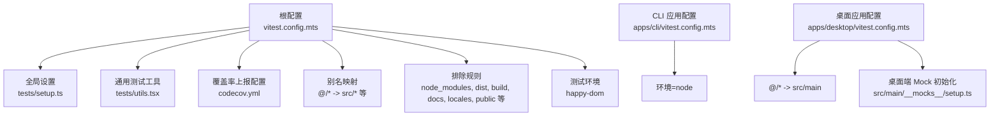
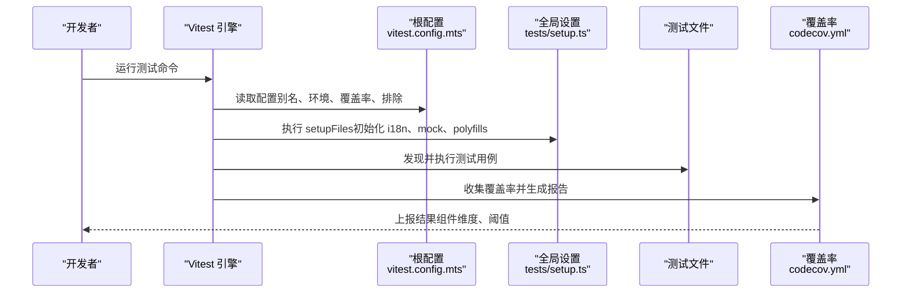
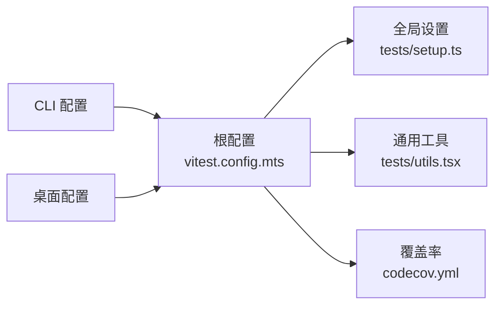

# 单元测试

<cite>
**本文引用的文件**
- [vitest.config.mts（根配置）](file://vitest.config.mts)
- [tests/setup.ts（全局测试设置）](file://tests/setup.ts)
- [tests/utils.tsx（通用测试工具与服务类测试宏）](file://tests/utils.tsx)
- [apps/cli/vitest.config.mts（CLI 应用测试配置）](file://apps/cli/vitest.config.mts)
- [apps/desktop/vitest.config.mts（桌面应用测试配置）](file://apps/desktop/vitest.config.mts)
- [codecov.yml（覆盖率上报与分组件配置）](file://codecov.yml)
- [__mocks__/zustand/traditional.ts（Zustand Mock 示例）](file://__mocks__/zustand/traditional.ts)
- [tests/mocks/lru_map.ts（LRU Map Mock 示例）](file://tests/mocks/lru_map.ts)
</cite>

## 目录
1. [简介](#简介)
2. [项目结构](#项目结构)
3. [核心组件](#核心组件)
4. [架构总览](#架构总览)
5. [详细组件分析](#详细组件分析)
6. [依赖关系分析](#依赖关系分析)
7. [性能考量](#性能考量)
8. [故障排查指南](#故障排查指南)
9. [结论](#结论)
10. [附录](#附录)

## 简介
本文件面向 LobeHub 项目的单元测试体系，系统性阐述 Vitest 测试框架的配置与使用方法，覆盖测试环境设置、别名配置、覆盖率报告、测试设计原则与规范、Mock 数据策略、组件/工具函数/服务层测试示例、异步测试处理、断言方法、覆盖率要求与报告生成与分析等内容。目标是帮助开发者在不同应用与包之间统一测试实践，提升可维护性与质量。

## 项目结构
LobeHub 采用多包工作区（pnpm workspace）组织，测试配置分布在根目录与各应用/包的独立配置文件中：
- 根级 Vitest 配置集中定义别名、覆盖率、环境、排除规则与全局初始化脚本
- 各应用（如 CLI、桌面端）与部分包拥有独立的测试配置以满足特定需求（如 Node 环境、别名替换）
- 通用测试工具与全局设置位于 tests 目录，提供跨模块复用能力

图表来源
- [vitest.config.mts（根配置）](file://vitest.config.mts#L41-L112)
- [apps/cli/vitest.config.mts（CLI 应用测试配置）](file://apps/cli/vitest.config.mts#L1-L24)
- [apps/desktop/vitest.config.mts（桌面应用测试配置）](file://apps/desktop/vitest.config.mts#L1-L20)

章节来源
- [vitest.config.mts（根配置）](file://vitest.config.mts#L1-L113)
- [apps/cli/vitest.config.mts（CLI 应用测试配置）](file://apps/cli/vitest.config.mts#L1-L24)
- [apps/desktop/vitest.config.mts（桌面应用测试配置）](file://apps/desktop/vitest.config.mts#L1-L20)

## 核心组件
- 根级 Vitest 配置：统一别名、覆盖率、环境、排除、服务器依赖内联与全局初始化脚本
- 全局设置：启用 i18n、模拟 IndexedDB、注入 React 全局、polyfill crypto、禁用 Ant Design Hash、mock 分析与认证模块
- 通用测试工具：提供服务类测试宏，校验方法签名、箭头函数与可选异步特性，并支持自定义扩展检查
- 应用/包级配置：按需调整环境（happy-dom vs node）、别名、覆盖率输出与控制台日志行为
- 覆盖率上报：通过 codecov.yml 对项目关键模块进行组件化标记与阈值控制

章节来源
- [vitest.config.mts（根配置）](file://vitest.config.mts#L41-L112)
- [tests/setup.ts（全局测试设置）](file://tests/setup.ts#L1-L76)
- [tests/utils.tsx（通用测试工具与服务类测试宏）](file://tests/utils.tsx#L1-L58)
- [apps/cli/vitest.config.mts（CLI 应用测试配置）](file://apps/cli/vitest.config.mts#L1-L24)
- [apps/desktop/vitest.config.mts（桌面应用测试配置）](file://apps/desktop/vitest.config.mts#L1-L20)
- [codecov.yml（覆盖率上报与分组件配置）](file://codecov.yml#L1-L40)

## 架构总览
下图展示了测试运行时的关键交互：Vitest 加载根配置与全局设置，解析别名，执行测试文件，收集覆盖率并生成报告；应用/包级配置在必要时覆盖默认行为。

图表来源
- [vitest.config.mts（根配置）](file://vitest.config.mts#L41-L112)
- [tests/setup.ts（全局测试设置）](file://tests/setup.ts#L1-L76)
- [codecov.yml（覆盖率上报与分组件配置）](file://codecov.yml#L25-L40)

## 详细组件分析

### 根级 Vitest 配置（别名、覆盖率、环境与排除）
- 别名映射：将 @/、~/test-utils、lru_map 等路径映射到实际源码或 mocks，便于跨模块测试
- 覆盖率：v8 提供商，输出文本、JSON、LCOV 与摘要；报告目录为 coverage/app；排除 migrations、废弃包与临时文件
- 环境：happy-dom，适合浏览器 API 的 DOM/事件/Storage 等场景
- 排除：忽略 node_modules、构建产物、文档、国际化资源、公共目录、以及各应用与 e2e 目录
- 全局：开启 globals；setupFiles 指向 tests/setup.ts
- 服务器依赖内联：将 canvas、UI 组件库与 LRU 等依赖内联，避免解析问题

章节来源
- [vitest.config.mts（根配置）](file://vitest.config.mts#L41-L112)

### 全局测试设置（tests/setup.ts）
- 依赖注入：@testing-library/jest-dom、fake-indexeddb/auto、i18next、Immer Map/Set 支持
- 全局 mock：
  - @lobehub/analytics/react：mock useAnalytics 返回空会话跟踪
  - @/auth：mock 认证模块的 getSession，返回空会话
- Node 环境 polyfill：为 crypto 注入 WebCrypto 实现
- UI 环境：禁用 Ant Design 的 CSS Hash，确保选择器稳定
- i18n 初始化：加载常用命名空间资源，避免模块级 mock 干扰
- React 全局：注入 React，减少重复导入

章节来源
- [tests/setup.ts（全局测试设置）](file://tests/setup.ts#L1-L76)

### 通用测试工具（tests/utils.tsx）
- SWR Provider 包装：提供内存 Map 的 SWR 配置，便于无网络依赖的缓存测试
- 服务类测试宏 testService：
  - 校验实例方法均为函数且为箭头函数
  - 可选校验异步声明（以 async 开头）
  - 支持跳过特定属性（如 userId），并允许传入额外检查回调
  - 适用于服务层接口一致性与实现风格的自动化校验

章节来源
- [tests/utils.tsx（通用测试工具与服务类测试宏）](file://tests/utils.tsx#L1-L58)

### 应用/包级测试配置

#### CLI 应用配置（apps/cli/vitest.config.mts）
- 别名：将 @lobechat/device-gateway-client 指向本地包源码，便于联调
- 环境：node
- 覆盖率：输出文本、JSON、LCOV、摘要
- 控制台日志：抑制未处理拒绝警告（由命令行异步动作与进程退出模拟引起）

章节来源
- [apps/cli/vitest.config.mts（CLI 应用测试配置）](file://apps/cli/vitest.config.mts#L1-L24)

#### 桌面应用配置（apps/desktop/vitest.config.mts）
- 别名：@ 指向 src/main，~common 指向 common
- 环境：node
- 覆盖率：v8 提供商，输出文本、JSON、LCOV、摘要，报告目录 coverage/app
- 全局设置：指向桌面端专用 __mocks__/setup.ts

章节来源
- [apps/desktop/vitest.config.mts（桌面应用测试配置）](file://apps/desktop/vitest.config.mts#L1-L20)

### 覆盖率与报告（codecov.yml）
- 组件管理：对 Store、Services、Server、Libs、Utils 等关键模块建立组件标识，便于 PR 评论与差异展示
- 覆盖率状态：项目整体默认关闭，数据库与应用分别通过 flags 标记；阈值为 0.5
- 报告内容：在 PR 中展示组件信息、差异、标志位与组件覆盖率

章节来源
- [codecov.yml（覆盖率上报与分组件配置）](file://codecov.yml#L1-L40)

### Mock 数据与策略
- Zustand Mock：通过 __mocks__/zustand/traditional.ts 提供传统模式下的 store 行为模拟，便于隔离 UI 与状态逻辑
- LRU Map Mock：tests/mocks/lru_map.ts 提供 LRU 缓存行为的最小化实现，用于不希望引入真实依赖的场景
- 全局 Mock：在 tests/setup.ts 中对第三方库与认证模块进行全局替换，保证测试稳定性与确定性

章节来源
- [__mocks__/zustand/traditional.ts（Zustand Mock 示例）](file://__mocks__/zustand/traditional.ts)
- [tests/mocks/lru_map.ts（LRU Map Mock 示例）](file://tests/mocks/lru_map.ts)
- [tests/setup.ts（全局测试设置）](file://tests/setup.ts#L21-L39)

### 测试设计原则与规范
- 命名规范：测试文件以 .test.ts/.test.tsx 结尾，描述性命名清晰表达被测功能
- 断言风格：优先使用 @testing-library/jest-dom 与 Vitest expect，保持断言简洁明确
- 异步测试：使用 async/await 或 Promise 显式等待；对定时器与延迟使用 vitest.useFakeTimers/vi.advanceTimersByTime
- 独立性：每个测试用例应自包含，避免共享状态；必要时使用 beforeEach/afterEach 清理
- Mock 策略：尽量使用局部 mock 或在 setUp 中集中 mock，避免跨用例污染
- 覆盖率导向：关注关键路径与边界条件，结合 codecov 组件标记定位薄弱模块

### 测试类型与示例指引
- 组件测试：使用 @testing-library/react，渲染组件并断言 DOM 属性、事件触发与无障碍标签
- 工具函数测试：针对纯函数输入输出进行参数化与边界值测试
- 服务层测试：利用 testService 宏快速校验服务类方法签名与实现风格；对异步流程使用超时与重试策略
- 异步测试：对定时任务、轮询、防抖节流等场景使用虚拟时钟；对外部请求使用 http 拦截或服务层 mock
- 状态管理：对 store 初始化、订阅与更新进行单元验证；结合 Zustand Mock 降低耦合

### 断言方法与最佳实践
- 基础断言：toBe、toEqual、toBeTruthy、toBeFalsy、toHaveLength、toContain
- DOM 断言：toBeInTheDocument、toHaveAttribute、toHaveClass、toBeVisible
- 异步断言：expect(asyncFn).resolves/ rejects；配合超时与重试
- Mock 断言：expect(mockFn).toHaveBeenCalledWith、toHaveBeenCalledTimes、toBeCalledTimes

### 覆盖率要求与分析
- 覆盖率提供商：v8
- 报告格式：文本、JSON、LCOV、摘要
- 排除范围：临时文件、迁移脚本、包级源码、文档与国际化资源
- 组件化分析：通过 codecov.yml 的 flags 与组件 ID，区分 Store/Services/Server/Libs/Utils 的覆盖率贡献

章节来源
- [vitest.config.mts（根配置）](file://vitest.config.mts#L63-L79)
- [codecov.yml（覆盖率上报与分组件配置）](file://codecov.yml#L1-L40)

## 依赖关系分析
- 根配置依赖全局设置与通用工具，形成统一入口
- 应用/包级配置在根配置之上进行局部覆盖
- 覆盖率配置与 CI/PR 评论联动，形成闭环反馈

图表来源
- [vitest.config.mts（根配置）](file://vitest.config.mts#L41-L112)
- [apps/cli/vitest.config.mts（CLI 应用测试配置）](file://apps/cli/vitest.config.mts#L1-L24)
- [apps/desktop/vitest.config.mts（桌面应用测试配置）](file://apps/desktop/vitest.config.mts#L1-L20)
- [codecov.yml（覆盖率上报与分组件配置）](file://codecov.yml#L1-L40)

## 性能考量
- 依赖内联：通过 server.deps.inline 减少解析与打包开销
- 环境选择：happy-dom 适合前端组件与工具函数；node 环境适合 CLI/桌面后端逻辑
- 排除策略：排除构建产物与非测试目录，缩短扫描时间
- 虚拟时钟：对定时器密集型逻辑使用 fake timers，避免真实等待

## 故障排查指南
- 别名解析失败：确认 vitest.config.mts 中 alias 是否正确映射至实际路径
- 环境 API 缺失：在 happy-dom 环境下缺少的浏览器 API 可通过 @testing-library/jest-dom 与 setup.ts 中的 polyfills 解决
- 第三方库 ESM 解析问题：在 setup.ts 中进行全局 mock，或将相关依赖加入 server.deps.inline
- 覆盖率异常：检查 exclude 列表与 provider/reporter 配置；确认 CI 环境已上传 LCOV 报告
- 控制台噪音：CLI 配置中可通过 onConsoleLog 抑制特定警告

章节来源
- [vitest.config.mts（根配置）](file://vitest.config.mts#L41-L112)
- [apps/cli/vitest.config.mts（CLI 应用测试配置）](file://apps/cli/vitest.config.mts#L14-L22)
- [tests/setup.ts（全局测试设置）](file://tests/setup.ts#L21-L39)

## 结论
通过统一的根级 Vitest 配置、完善的全局设置与通用测试工具，LobeHub 在多应用与多包环境下实现了可复用、可维护的单元测试体系。结合应用/包级配置与覆盖率上报，团队可以持续提升代码质量与可测试性，同时借助服务类测试宏与 Mock 策略降低测试复杂度。

## 附录
- 快速开始
  - 在项目根目录运行测试命令，自动加载根配置与全局设置
  - 如需覆盖默认行为，在对应应用/包目录添加 vitest.config.mts
- 常用命令
  - 运行所有测试：vitest
  - 运行指定文件：vitest 文件路径
  - 仅运行变更相关测试：vitest --run --passWithNoTests
  - 生成覆盖率报告：vitest --coverage
- 建议
  - 为每个服务类使用 testService 宏进行一致性校验
  - 对异步逻辑使用虚拟时钟与明确超时
  - 使用 SWR 内存 Map 进行缓存相关测试
  - 在 CI 中上传 LCOV 报告并与 codecov 集成