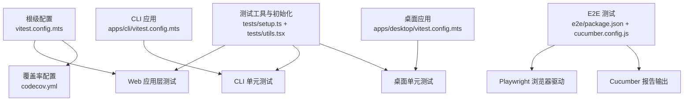
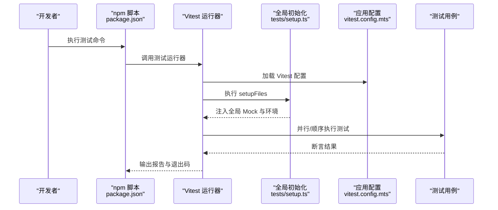
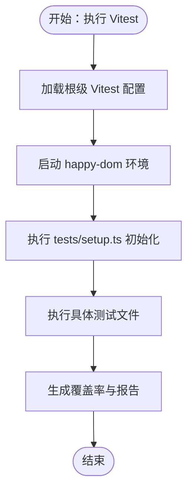
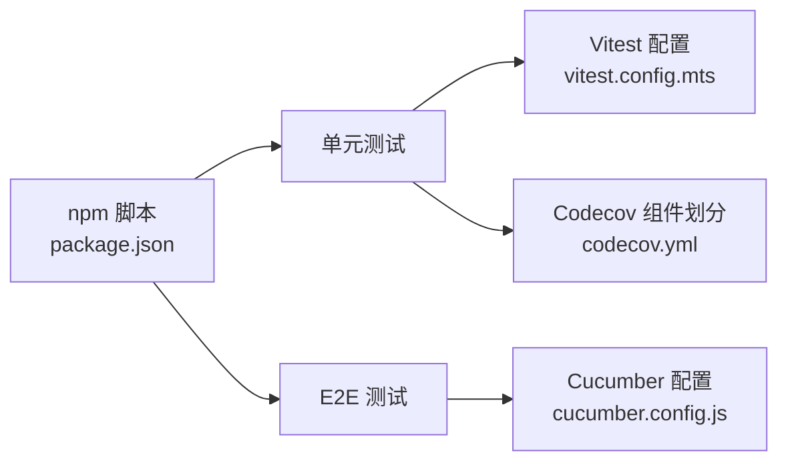

# 测试策略

<cite>
**本文引用的文件**
- [vitest.config.mts](file://vitest.config.mts)
- [apps/cli/vitest.config.mts](file://apps/cli/vitest.config.mts)
- [apps/desktop/vitest.config.mts](file://apps/desktop/vitest.config.mts)
- [package.json](file://package.json)
- [codecov.yml](file://codecov.yml)
- [tests/setup.ts](file://tests/setup.ts)
- [tests/utils.tsx](file://tests/utils.tsx)
- [e2e/package.json](file://e2e/package.json)
- [e2e/cucumber.config.js](file://e2e/cucumber.config.js)
- [apps/cli/src/commands/agent.test.ts](file://apps/cli/src/commands/agent.test.ts)
- [apps/desktop/src/main/__mocks__/setup.ts](file://apps/desktop/src/main/__mocks__/setup.ts)
- [__mocks__/zustand/traditional.ts](file://__mocks__/zustand/traditional.ts)
</cite>

## 目录

1. [引言](#引言)
2. [项目结构](#项目结构)
3. [核心组件](#核心组件)
4. [架构总览](#架构总览)
5. [详细组件分析](#详细组件分析)
6. [依赖分析](#依赖分析)
7. [性能考虑](#性能考虑)
8. [故障排查指南](#故障排查指南)
9. [结论](#结论)
10. [附录](#附录)

## 引言

本测试策略文档面向 LobeHub 项目，系统化阐述单元测试、集成测试与端到端测试（E2E）的实施方法与最佳实践。文档覆盖测试框架选择与配置、测试用例设计原则、覆盖率要求、测试数据管理、Mock 策略、异步测试处理、测试自动化与持续集成（CI）、测试报告生成、专项测试（性能、安全、兼容性）等内容，并提供可直接参考的配置文件路径与示例测试文件位置，帮助团队建立稳定高效的测试体系。

## 项目结构

LobeHub 采用多包工作区（monorepo）结构，测试相关配置分布在根级与各应用 / 包目录中：

- 根级 Vitest 配置用于 Web 应用层测试，设置别名、覆盖率、环境与排除规则。
- CLI 与桌面应用分别有独立的 Vitest 配置，适配 Node 环境与本地模块 Mock。
- E2E 使用 Cucumber + Playwright，通过独立包管理测试脚本与报告格式。
- 测试工具与全局初始化位于 tests 目录，提供 i18n、IndexedDB、WebCrypto 等通用 Mock 与辅助工具。

图表来源

- [vitest.config.mts](file://vitest.config.mts#L1-L113)
- [apps/cli/vitest.config.mts](file://apps/cli/vitest.config.mts#L1-L24)
- [apps/desktop/vitest.config.mts](file://apps/desktop/vitest.config.mts#L1-L20)
- [e2e/package.json](file://e2e/package.json#L1-L30)
- [e2e/cucumber.config.js](file://e2e/cucumber.config.js#L1-L22)
- [tests/setup.ts](file://tests/setup.ts#L1-L76)
- [tests/utils.tsx](file://tests/utils.tsx#L1-L58)

章节来源

- [vitest.config.mts](file://vitest.config.mts#L1-L113)
- [apps/cli/vitest.config.mts](file://apps/cli/vitest.config.mts#L1-L24)
- [apps/desktop/vitest.config.mts](file://apps/desktop/vitest.config.mts#L1-L20)
- [e2e/package.json](file://e2e/package.json#L1-L30)
- [e2e/cucumber.config.js](file://e2e/cucumber.config.js#L1-L22)
- [tests/setup.ts](file://tests/setup.ts#L1-L76)
- [tests/utils.tsx](file://tests/utils.tsx#L1-L58)

## 核心组件

- 测试框架与运行时
  - Vitest：作为主要测试运行器，支持快照、覆盖率、异步测试与 Mock。
  - Happy DOM：浏览器 DOM 环境，满足前端组件与工具函数测试。
  - Node 环境：CLI 与桌面应用使用 Node 环境进行命令行与原生模块测试。
- 覆盖率与报告
  - v8 提供者，支持文本、JSON、LCOV 报告；根级配置指定报告目录与排除规则。
  - Codecov 组件化分组与阈值控制，便于按模块维度评估覆盖率。
- 测试工具与初始化
  - tests/setup.ts：全局 Mock（Analytics、认证）、i18n 初始化、IndexedDB、WebCrypto、Ant Design 样式哈希关闭。
  - tests/utils.tsx：服务类一致性测试工具（箭头函数、async 规范、可选自定义检查）。
- E2E 框架
  - Cucumber + Playwright：Feature/Step 定义与 TS 步骤实现，HTML/JSON 报告输出，支持标签筛选与重试策略。

章节来源

- [vitest.config.mts](file://vitest.config.mts#L41-L112)
- [codecov.yml](file://codecov.yml#L1-L40)
- [tests/setup.ts](file://tests/setup.ts#L1-L76)
- [tests/utils.tsx](file://tests/utils.tsx#L1-L58)
- [e2e/package.json](file://e2e/package.json#L1-L30)
- [e2e/cucumber.config.js](file://e2e/cucumber.config.js#L1-L22)

## 架构总览

下图展示测试执行链路：开发者触发测试脚本 → Vitest/Cucumber 执行 → 各应用配置加载 → 全局初始化与 Mock 注入 → 执行用例并生成报告。

图表来源

- [package.json](file://package.json#L36-L123)
- [vitest.config.mts](file://vitest.config.mts#L110-L112)
- [tests/setup.ts](file://tests/setup.ts#L1-L76)

章节来源

- [package.json](file://package.json#L36-L123)
- [vitest.config.mts](file://vitest.config.mts#L1-L113)
- [tests/setup.ts](file://tests/setup.ts#L1-L76)

## 详细组件分析

### 单元测试（Web 应用层）

- 配置要点
  - 环境：happy-dom，模拟浏览器 DOM。
  - 别名：映射 @/、@/utils、@/types 等，确保路径解析一致。
  - 覆盖率：v8 提供者，报告格式 text、json、lcov、text-summary，排除 migrations 与 docs/locales/public/packages 等。
  - 排除：大量非测试目录，避免误扫描。
  - 服务器依赖内联：canvas、UI 组件库等，提升渲染与样式测试稳定性。
  - 全局：启用 i18n、IndexedDB、WebCrypto、Ant Design 样式哈希关闭。
- 最佳实践
  - 使用 describe/it 分层组织用例，聚焦单一职责。
  - 对外部依赖统一 Mock，避免真实网络或数据库调用。
  - 使用测试工具函数验证服务类一致性（箭头函数、async 规范）。
- 示例参考
  - CLI 命令测试：覆盖 list/view/create/edit/delete/duplicate/run/status 等子命令行为与错误分支。

图表来源

- [vitest.config.mts](file://vitest.config.mts#L41-L112)
- [tests/setup.ts](file://tests/setup.ts#L1-L76)

章节来源

- [vitest.config.mts](file://vitest.config.mts#L41-L112)
- [tests/setup.ts](file://tests/setup.ts#L1-L76)
- [tests/utils.tsx](file://tests/utils.tsx#L1-L58)
- [apps/cli/src/commands/agent.test.ts](file://apps/cli/src/commands/agent.test.ts#L1-L398)

### 单元测试（CLI 应用）

- 配置要点
  - 环境：Node。
  - 别名：将设备网关客户端指向本地源码，便于测试集成。
  - 覆盖率：开启文本 / JSON/LCOV 报告。
  - 控制台日志抑制：避免命令行异步动作中的未处理拒绝警告干扰测试。
- 最佳实践
  - 使用 hoisted vi.mock 预先注入依赖，减少模块加载时的副作用。
  - 对外部 API（HTTP/TRPC）进行集中 Mock，断言参数与调用次数。
  - 使用 exitOverride 与进程退出 spy，验证错误路径与退出码。

章节来源

- [apps/cli/vitest.config.mts](file://apps/cli/vitest.config.mts#L1-L24)
- [apps/cli/src/commands/agent.test.ts](file://apps/cli/src/commands/agent.test.ts#L1-L398)

### 单元测试（桌面应用）

- 配置要点
  - 环境：Node。
  - 别名：@/ 指向主进程源码，\~common 指向公共模块。
  - 覆盖率：v8 提供者与 LCOV 报告。
  - 本地 Mock 初始化：在 setup 文件中对原生模块进行 Mock，避免打包期依赖问题。
- 最佳实践
  - 在 beforeEach 中重置 Mock 状态，确保用例隔离。
  - 对 Electron IPC、系统权限等原生能力进行抽象与 Mock。

章节来源

- [apps/desktop/vitest.config.mts](file://apps/desktop/vitest.config.mts#L1-L20)
- [apps/desktop/src/main/**mocks**/setup.ts](file://apps/desktop/src/main/__mocks__/setup.ts#L1-L8)

### 测试工具与通用 Mock

- 全局初始化
  - i18n 内存资源初始化，避免模块级 Mock 干扰。
  - IndexedDB Fake 自动化，适配 Dexie。
  - WebCrypto Polyfill，保证 Node 环境下的加密 API 可用。
  - Ant Design 样式哈希关闭，避免快照差异。
  - Analytics 与认证模块 Mock，消除外部依赖。
- 服务类一致性测试工具
  - 自动遍历实例方法，断言为箭头函数与 async 规范，支持跳过方法与自定义检查回调。

章节来源

- [tests/setup.ts](file://tests/setup.ts#L1-L76)
- [tests/utils.tsx](file://tests/utils.tsx#L1-L58)
- [**mocks**/zustand/traditional.ts](file://__mocks__/zustand/traditional.ts#L1-L26)

### 端到端测试（E2E）

- 框架与配置
  - Cucumber：Feature/Step 驱动，支持标签筛选（如 smoke、routes）。
  - Playwright：跨浏览器与平台的自动化测试。
  - 报告：HTML 与 JSON，便于 CI 展示与归档。
- 脚本与流程
  - 支持 headed/headless、社区特性、路由专项等不同场景。
  - CI 场景可先构建再测试，确保产物一致性。
- 最佳实践
  - 将页面交互拆分为 Given/When/Then，保持步骤可复用。
  - 使用稳定的元素选择器与等待策略，避免竞态条件。
  - 结合标签策略进行冒烟测试与回归测试组合。

章节来源

- [e2e/package.json](file://e2e/package.json#L1-L30)
- [e2e/cucumber.config.js](file://e2e/cucumber.config.js#L1-L22)

## 依赖分析

- 测试运行与脚本
  - 根级 package.json 提供统一测试入口：test、test-app、test-app:coverage、test:e2e 等。
  - 工作区包含 e2e 与桌面主进程，便于跨包测试。
- 覆盖率与组件划分
  - codecov.yml 按 Store/Services/Server/Libs/Utils 组件维度统计覆盖率，支持阈值与 PR 评论展示。

图表来源

- [package.json](file://package.json#L36-L123)
- [vitest.config.mts](file://vitest.config.mts#L63-L79)
- [codecov.yml](file://codecov.yml#L1-L40)
- [e2e/cucumber.config.js](file://e2e/cucumber.config.js#L1-L22)

章节来源

- [package.json](file://package.json#L36-L123)
- [vitest.config.mts](file://vitest.config.mts#L63-L79)
- [codecov.yml](file://codecov.yml#L1-L40)
- [e2e/cucumber.config.js](file://e2e/cucumber.config.js#L1-L22)

## 性能考虑

- 测试执行性能
  - 使用 happy-dom 减少真实浏览器开销；对 Canvas、UI 组件库进行内联以提升渲染稳定性。
  - 合理拆分测试文件，避免单文件过大导致串行执行时间过长。
- 覆盖率与性能平衡
  - 通过排除 migrations、docs、locales、public 等目录降低覆盖率计算成本。
  - 使用组件化覆盖率（flags/components）在保证关键模块覆盖率的同时控制整体成本。
- E2E 性能
  - 使用标签策略区分 smoke/routes 与完整套件，CI 中优先运行快速失败用例。
  - 复用构建产物，避免重复编译。

章节来源

- [vitest.config.mts](file://vitest.config.mts#L75-L96)
- [codecov.yml](file://codecov.yml#L25-L40)
- [e2e/cucumber.config.js](file://e2e/cucumber.config.js#L13-L21)

## 故障排查指南

- 常见问题与定位
  - 浏览器相关 API 缺失：确认已启用 happy-dom 环境与全局初始化。
  - i18n 未初始化：检查 tests/setup.ts 的 i18n.init 调用与命名空间配置。
  - IndexedDB/Dexie 报错：确认 fake-indexeddb/auto 已被加载。
  - WebCrypto 不可用：确认 @peculiar/webcrypto 已注入到全局 crypto。
  - 原生模块导入失败：桌面应用需在 setup 文件中对原生模块进行 Mock。
- 调试建议
  - 使用 --inspect-brk 或 Vitest 的调试选项进行断点调试。
  - 逐步缩小用例范围，定位具体依赖或 Mock 问题。
  - 查看覆盖率报告中的缺失分支，补充边界用例。

章节来源

- [tests/setup.ts](file://tests/setup.ts#L1-L76)
- [apps/desktop/src/main/**mocks**/setup.ts](file://apps/desktop/src/main/__mocks__/setup.ts#L1-L8)

## 结论

本测试策略以 Vitest 为核心，结合 CLI / 桌面 / Web 应用的不同环境需求，建立了覆盖单元与 E2E 的测试体系。通过全局初始化与 Mock 策略、组件化覆盖率与报告输出、以及标签化的 E2E 流程，能够在保证质量的前提下提升测试效率与可维护性。建议持续完善用例覆盖面与边界场景，配合 CI 实现自动化与可视化反馈。

## 附录

- 测试用例设计原则
  - 单一职责：每个用例只验证一个功能点或分支。
  - 可重复性：用例之间无状态耦合，依赖 Mock 与隔离。
  - 可读性：使用清晰的描述与断言，便于他人理解与维护。
- 覆盖率要求
  - 关键模块（Store/Services/Server）应达到较高覆盖率；通过 codecov 组件维度与阈值控制持续改进。
- 测试数据管理
  - 使用 Mock 数据与内存存储，避免真实数据库 / 网络依赖；必要时使用轻量级替代方案（如 fake-indexeddb）。
- 异步测试处理
  - 使用 async/await 与合理的超时设置；对定时器与事件流进行可控 Mock。
- 专项测试
  - 性能：结合基准测试与慢查询检测，关注关键路径耗时。
  - 安全：输入校验、权限控制与敏感信息处理的测试覆盖。
  - 兼容性：多浏览器 / 平台的 E2E 验证，关注 UI 与交互一致性。
