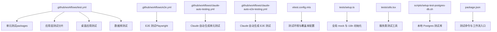
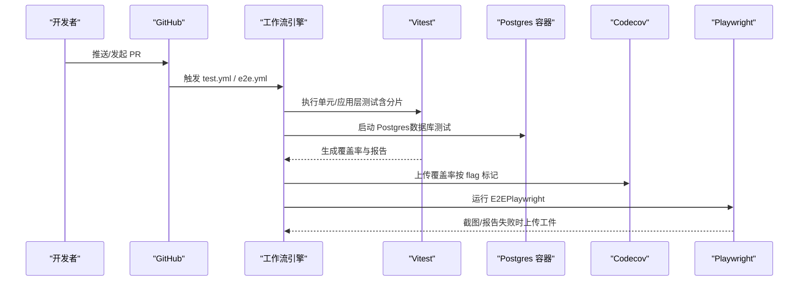
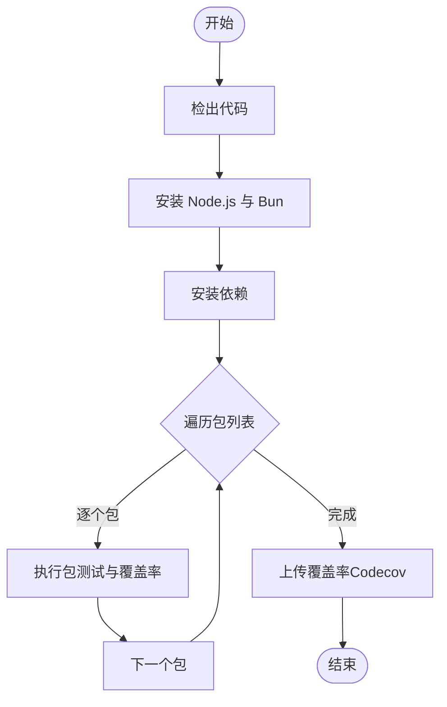
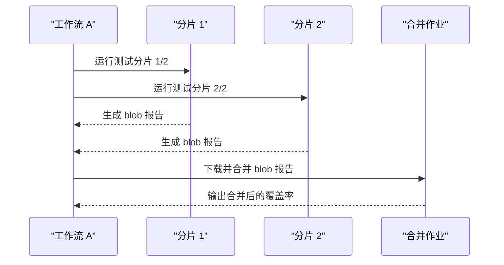
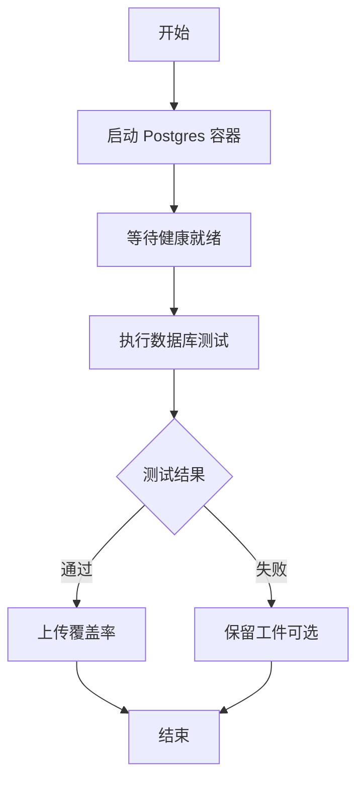
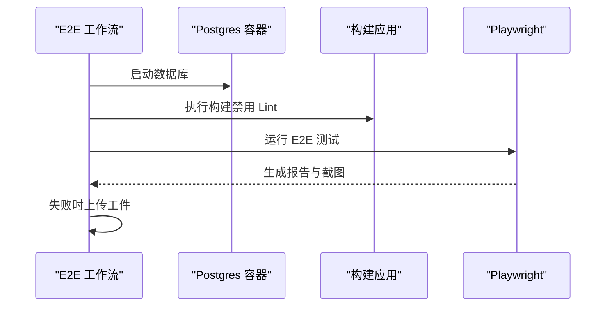
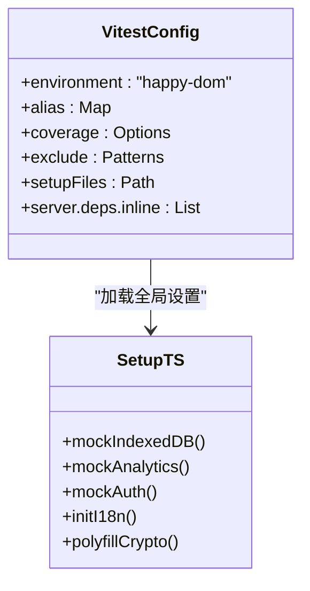
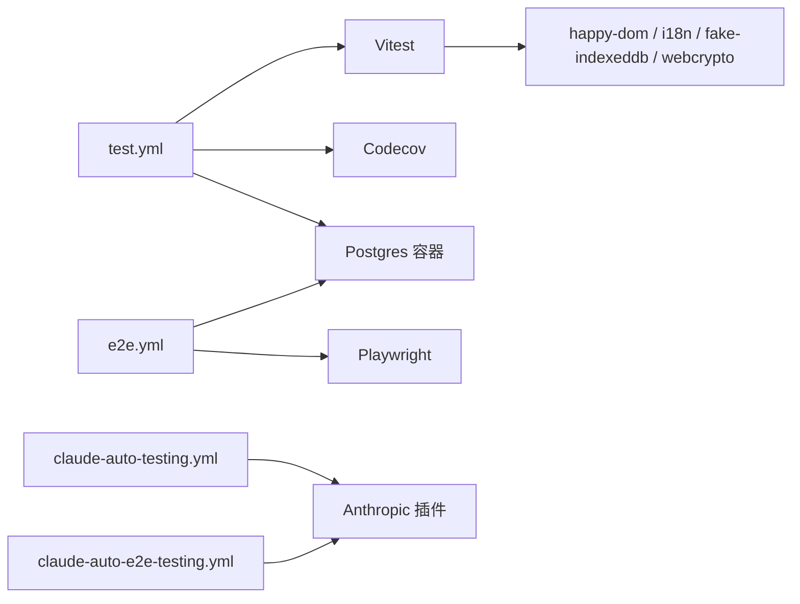

# 测试自动化

<cite>
**本文引用的文件**
- [.github/workflows/test.yml](file://.github/workflows/test.yml)
- [.github/workflows/e2e.yml](file://.github/workflows/e2e.yml)
- [.github/workflows/claude-auto-testing.yml](file://.github/workflows/claude-auto-testing.yml)
- [.github/workflows/claude-auto-e2e-testing.yml](file://.github/workflows/claude-auto-e2e-testing.yml)
- [vitest.config.mts](file://vitest.config.mts)
- [package.json](file://package.json)
- [codecov.yml](file://codecov.yml)
- [scripts/setup-test-postgres-db.sh](file://scripts/setup-test-postgres-db.sh)
- [tests/setup.ts](file://tests/setup.ts)
- [tests/utils.tsx](file://tests/utils.tsx)
</cite>

## 目录
1. [简介](#简介)
2. [项目结构](#项目结构)
3. [核心组件](#核心组件)
4. [架构总览](#架构总览)
5. [详细组件分析](#详细组件分析)
6. [依赖关系分析](#依赖关系分析)
7. [性能考量](#性能考量)
8. [故障排查指南](#故障排查指南)
9. [结论](#结论)
10. [附录](#附录)

## 简介
本文件系统化梳理 LobeHub 项目的测试自动化体系，覆盖单元测试、应用层测试、数据库测试与端到端测试（E2E）的 CI/CD 流程。内容包括：
- GitHub Actions 工作流配置与任务调度
- 测试环境自动搭建（含 Postgres 容器）
- 测试数据与依赖准备（i18n、IndexedDB、WebCrypto 等）
- 测试报告与覆盖率上传（Codecov）
- 并行与分片执行策略
- 缓存优化与重试机制
- 安全性、隔离性与可重复性保障

## 项目结构
围绕测试自动化，仓库中关键位置如下：
- 工作流：.github/workflows 下包含多条流水线，分别负责单元测试、应用层测试、数据库测试、E2E 测试以及基于 Claude 的自动化测试生成。
- 测试框架：Vitest 配置集中于根目录的 vitest.config.mts，统一环境、别名、覆盖率与排除规则。
- 脚本与工具：本地开发与测试辅助脚本位于 scripts/；测试初始化与通用工具位于 tests/。
- 包管理与脚本：package.json 提供 test、test-app、test:coverage 等命令，支撑工作流调用。

图表来源
- [.github/workflows/test.yml](file://.github/workflows/test.yml#L1-L268)
- [.github/workflows/e2e.yml](file://.github/workflows/e2e.yml#L1-L95)
- [.github/workflows/claude-auto-testing.yml](file://.github/workflows/claude-auto-testing.yml#L1-L75)
- [.github/workflows/claude-auto-e2e-testing.yml](file://.github/workflows/claude-auto-e2e-testing.yml#L1-L131)
- [vitest.config.mts](file://vitest.config.mts#L1-L113)
- [tests/setup.ts](file://tests/setup.ts#L1-L76)
- [tests/utils.tsx](file://tests/utils.tsx#L1-L58)
- [scripts/setup-test-postgres-db.sh](file://scripts/setup-test-postgres-db.sh#L1-L22)
- [package.json](file://package.json#L36-L123)

章节来源
- [.github/workflows/test.yml](file://.github/workflows/test.yml#L1-L268)
- [.github/workflows/e2e.yml](file://.github/workflows/e2e.yml#L1-L95)
- [.github/workflows/claude-auto-testing.yml](file://.github/workflows/claude-auto-testing.yml#L1-L75)
- [.github/workflows/claude-auto-e2e-testing.yml](file://.github/workflows/claude-auto-e2e-testing.yml#L1-L131)
- [vitest.config.mts](file://vitest.config.mts#L1-L113)
- [tests/setup.ts](file://tests/setup.ts#L1-L76)
- [tests/utils.tsx](file://tests/utils.tsx#L1-L58)
- [scripts/setup-test-postgres-db.sh](file://scripts/setup-test-postgres-db.sh#L1-L22)
- [package.json](file://package.json#L36-L123)

## 核心组件
- 单元测试（Packages）：对 packages/* 子包进行逐包测试并上传覆盖率，使用 Codecov 令牌与分支信息进行标记上传。
- 应用层测试（App）：采用 Vitest 分片执行，将测试任务拆分为两个 shard，分别生成 blob 报告后合并上传。
- 数据库测试：通过 GitHub Services 在 Ubuntu Runner 内拉起 Postgres 容器，执行数据库相关测试并上传覆盖率。
- 桌面应用测试：在独立工作流中使用 pnpm 安装依赖，执行类型检查与测试，并上传覆盖率。
- E2E 测试：使用 Playwright 在构建后的应用上运行，支持失败时上传截图与报告作为工件。
- Claude 自动化测试：定时或手动触发，基于提示词自动为指定模块补充单元测试或 E2E 测试。

章节来源
- [.github/workflows/test.yml](file://.github/workflows/test.yml#L28-L101)
- [.github/workflows/test.yml](file://.github/workflows/test.yml#L102-L173)
- [.github/workflows/test.yml](file://.github/workflows/test.yml#L174-L215)
- [.github/workflows/test.yml](file://.github/workflows/test.yml#L216-L268)
- [.github/workflows/e2e.yml](file://.github/workflows/e2e.yml#L40-L95)
- [.github/workflows/claude-auto-testing.yml](file://.github/workflows/claude-auto-testing.yml#L19-L75)
- [.github/workflows/claude-auto-e2e-testing.yml](file://.github/workflows/claude-auto-e2e-testing.yml#L30-L131)

## 架构总览
下图展示了从代码提交到测试完成的关键路径与集成点：

图表来源
- [.github/workflows/test.yml](file://.github/workflows/test.yml#L1-L268)
- [.github/workflows/e2e.yml](file://.github/workflows/e2e.yml#L1-L95)
- [codecov.yml](file://codecov.yml#L25-L40)

## 详细组件分析

### 单元测试（Packages）工作流
- 任务目标：对一组 packages 执行测试并生成覆盖率，随后上传至 Codecov。
- 关键点：
  - 使用环境变量批量传递包列表。
  - 逐包执行测试，便于并行与失败隔离。
  - 上传阶段根据 PR 信息与仓库差异动态设置参数，支持 fork 场景。
- 覆盖率上传策略：按包名生成 flag，便于在 PR 中区分各子包贡献。

图表来源
- [.github/workflows/test.yml](file://.github/workflows/test.yml#L28-L101)

章节来源
- [.github/workflows/test.yml](file://.github/workflows/test.yml#L28-L101)
- [codecov.yml](file://codecov.yml#L25-L40)

### 应用层测试（App）与分片合并
- 任务目标：对应用层测试进行分片执行，避免单次运行时间过长，并在完成后合并报告。
- 关键点：
  - 使用矩阵策略将测试分为两片，分别生成 blob 报告。
  - 合并阶段下载所有 blob 报告并合并，最终上传覆盖率。
- 并行策略：通过 shard 参数控制分片数量，提升吞吐。

图表来源
- [.github/workflows/test.yml](file://.github/workflows/test.yml#L102-L173)

章节来源
- [.github/workflows/test.yml](file://.github/workflows/test.yml#L102-L173)

### 数据库测试（Postgres 容器）
- 任务目标：在受控环境中运行数据库相关测试，确保依赖外部服务的一致性。
- 关键点：
  - 使用 GitHub Services 启动 Postgres 容器，暴露端口并健康检查。
  - 通过环境变量注入连接串与驱动选择，保证测试一致性。
- 失败处理：如需本地复现，可使用脚本一键启动测试数据库。

图表来源
- [.github/workflows/test.yml](file://.github/workflows/test.yml#L216-L268)
- [scripts/setup-test-postgres-db.sh](file://scripts/setup-test-postgres-db.sh#L1-L22)

章节来源
- [.github/workflows/test.yml](file://.github/workflows/test.yml#L216-L268)
- [scripts/setup-test-postgres-db.sh](file://scripts/setup-test-postgres-db.sh#L1-L22)

### 桌面应用测试（独立工作流）
- 任务目标：在独立工作流中对桌面应用执行类型检查与测试，并上传覆盖率。
- 关键点：
  - 使用 pnpm 并设置内存上限以避免 OOM。
  - 限定工作目录，避免污染主仓库环境。

章节来源
- [.github/workflows/test.yml](file://.github/workflows/test.yml#L174-L215)

### E2E 测试（Playwright）
- 任务目标：在构建后的应用上运行端到端测试，支持失败时上传截图与报告。
- 关键点：
  - 使用 Playwright 安装 Chromium 依赖。
  - 运行数据库迁移与构建步骤，确保测试环境一致。
  - 失败时自动上传 e2e/reports 与 e2e/screenshots 作为工件。

图表来源
- [.github/workflows/e2e.yml](file://.github/workflows/e2e.yml#L40-L95)

章节来源
- [.github/workflows/e2e.yml](file://.github/workflows/e2e.yml#L1-L95)

### Claude 自动化测试（定时/手动）
- 单元测试自动生成：每日定时运行，或手动触发，针对目标模块自动生成单元测试。
- E2E 测试自动生成：每日定时运行，或手动触发，基于参考指南自动生成 E2E 测试。
- 关键点：
  - 使用 Claude Code Action 插件，配合安全规则与提示词模板。
  - 支持自动创建 Pull Request，推动覆盖率提升。

章节来源
- [.github/workflows/claude-auto-testing.yml](file://.github/workflows/claude-auto-testing.yml#L1-L75)
- [.github/workflows/claude-auto-e2e-testing.yml](file://.github/workflows/claude-auto-e2e-testing.yml#L1-L131)

### Vitest 配置与测试环境
- 环境与别名：统一使用 happy-dom 环境，配置大量别名映射，便于跨包测试。
- 覆盖率：启用 v8 提供程序，输出文本、JSON、LCOV，目录位于 coverage/app。
- 排除规则：忽略 migrations、packages、docs、locales、public 等路径。
- 依赖内联：将常用依赖内联，减少冷启动开销。
- 全局设置：通过 setupFiles 注入 tests/setup.ts，统一初始化。

图表来源
- [vitest.config.mts](file://vitest.config.mts#L41-L112)
- [tests/setup.ts](file://tests/setup.ts#L1-L76)

章节来源
- [vitest.config.mts](file://vitest.config.mts#L1-L113)
- [tests/setup.ts](file://tests/setup.ts#L1-L76)

### 测试工具与断言
- withSWR：为非 React 组件提供 SWR 内存存储，避免真实网络请求。
- testService：用于校验服务类实现规范（箭头函数、异步约定、自定义检查），提升测试一致性。

章节来源
- [tests/utils.tsx](file://tests/utils.tsx#L1-L58)

## 依赖关系分析
- 工作流依赖：
  - test.yml 依赖 Vitest、Codecov、Postgres 容器与 Bun/pnpm。
  - e2e.yml 依赖 Playwright、Postgres 容器与构建产物。
  - Claude 工作流依赖 Anthropic 插件与提示词模板。
- 测试框架依赖：
  - Vitest 配置依赖 happy-dom、i18n、fake-indexeddb、@peculiar/webcrypto 等。
- 覆盖率与报告：
  - codecov.yml 定义组件与标志位，test.yml/e2e.yml 分别上传对应覆盖率文件。

图表来源
- [.github/workflows/test.yml](file://.github/workflows/test.yml#L1-L268)
- [.github/workflows/e2e.yml](file://.github/workflows/e2e.yml#L1-L95)
- [.github/workflows/claude-auto-testing.yml](file://.github/workflows/claude-auto-testing.yml#L1-L75)
- [.github/workflows/claude-auto-e2e-testing.yml](file://.github/workflows/claude-auto-e2e-testing.yml#L1-L131)
- [codecov.yml](file://codecov.yml#L1-L40)
- [vitest.config.mts](file://vitest.config.mts#L1-L113)

章节来源
- [.github/workflows/test.yml](file://.github/workflows/test.yml#L1-L268)
- [.github/workflows/e2e.yml](file://.github/workflows/e2e.yml#L1-L95)
- [.github/workflows/claude-auto-testing.yml](file://.github/workflows/claude-auto-testing.yml#L1-L75)
- [.github/workflows/claude-auto-e2e-testing.yml](file://.github/workflows/claude-auto-e2e-testing.yml#L1-L131)
- [codecov.yml](file://codecov.yml#L1-L40)
- [vitest.config.mts](file://vitest.config.mts#L1-L113)

## 性能考量
- 并行与分片
  - 应用层测试采用分片策略，降低单次运行时间，提高吞吐。
  - packages 测试逐包执行，便于并行调度与失败定位。
- 依赖内联与缓存
  - Vitest server.deps.inline 列表减少解析与打包成本。
  - GitHub Actions 使用 Bun/pnpm 缓存策略，缩短依赖安装时间。
- 覆盖率与报告
  - 使用 LCOV 与 blob 报告，合并后再上传，减少网络传输与重复计算。
- 内存与稳定性
  - 桌面应用测试设置 NODE_OPTIONS，避免大内存场景下的 OOM。
- 本地复现
  - 提供脚本一键启动 Postgres 容器，便于本地调试与问题复现。

章节来源
- [.github/workflows/test.yml](file://.github/workflows/test.yml#L102-L173)
- [.github/workflows/test.yml](file://.github/workflows/test.yml#L174-L215)
- [scripts/setup-test-postgres-db.sh](file://scripts/setup-test-postgres-db.sh#L1-L22)
- [vitest.config.mts](file://vitest.config.mts#L98-L109)

## 故障排查指南
- 测试失败但无报告
  - 检查工作流是否正确上传 blob 报告与覆盖率文件。
  - 确认合并作业是否成功下载并合并报告。
- E2E 截图缺失
  - 确认失败时的工件上传步骤是否执行，检查 e2e/reports 与 e2e/screenshots 路径。
- Postgres 连接失败
  - 检查容器健康检查与端口映射，确认 DATABASE_URL 环境变量正确。
  - 如需本地复现，使用脚本启动容器并验证连接串。
- Vitest 环境异常
  - 确认 tests/setup.ts 中的全局 mock 是否生效，尤其是 IndexedDB、i18n、WebCrypto。
  - 检查 Vitest 别名与环境配置，避免模块解析错误。
- 覆盖率未显示或不准确
  - 确认 codecov.yml 中的 flags 与上传文件路径一致。
  - 检查覆盖率输出目录与报告格式（LCOV）。

章节来源
- [.github/workflows/test.yml](file://.github/workflows/test.yml#L140-L173)
- [.github/workflows/e2e.yml](file://.github/workflows/e2e.yml#L86-L95)
- [tests/setup.ts](file://tests/setup.ts#L1-L76)
- [codecov.yml](file://codecov.yml#L25-L40)

## 结论
本测试自动化体系通过多条 GitHub Actions 工作流覆盖从单元到端到端的完整测试链路，并结合 Vitest 配置、覆盖率与报告上传、Postgres 容器化测试环境，形成稳定高效的 CI/CD 测试闭环。同时，Claude 自动化测试工作流进一步提升了测试覆盖面与效率。建议持续完善测试隔离与可重复性，优化分片策略与缓存命中率，以获得更佳的测试性能与质量。

## 附录
- 常用命令与入口
  - 单元测试：npm scripts 中的 test-app、test-app:coverage、test 与 test:e2e。
  - E2E：package.json 中的 e2e 脚本与 e2e:install。
- 质量度量
  - codecov.yml 定义了组件与 flags，便于在 PR 中查看覆盖率与差异。

章节来源
- [package.json](file://package.json#L36-L123)
- [codecov.yml](file://codecov.yml#L1-L40)