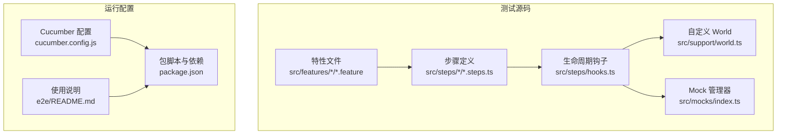
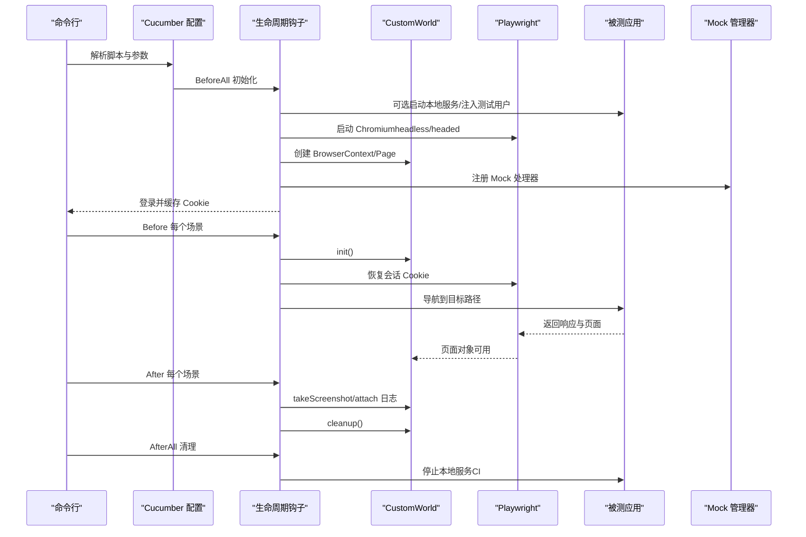
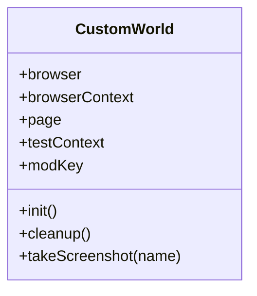
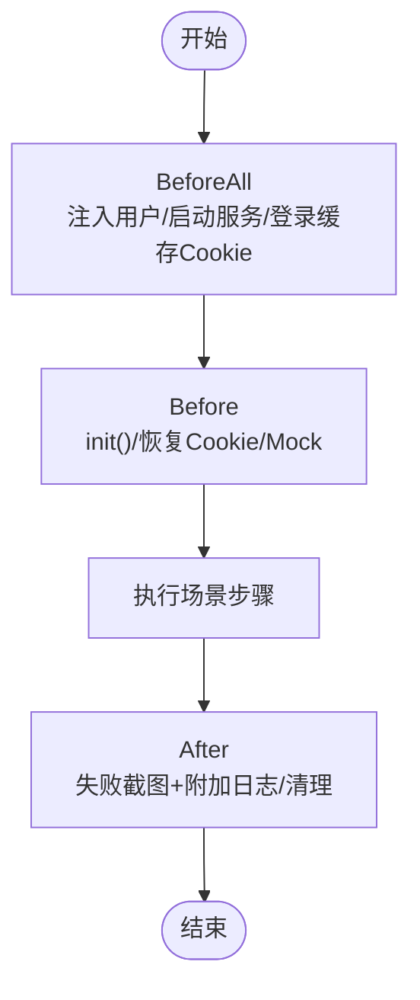
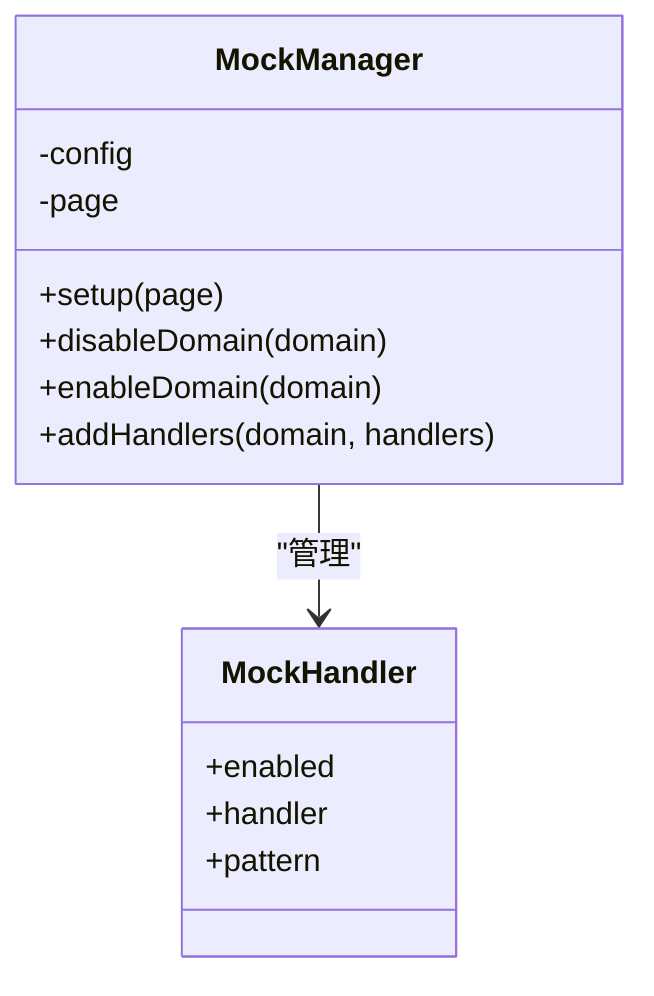
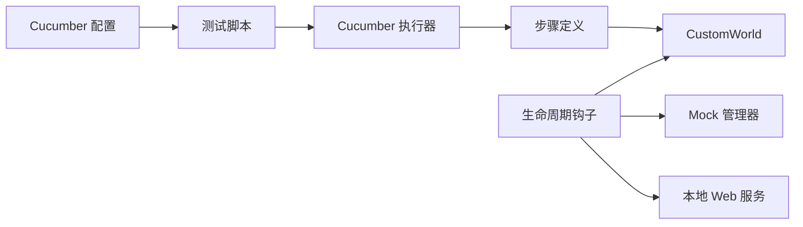

# 端到端测试

<cite>
**本文引用的文件**
- [e2e/README.md](file://e2e/README.md)
- [e2e/cucumber.config.js](file://e2e/cucumber.config.js)
- [e2e/package.json](file://e2e/package.json)
- [e2e/src/support/world.ts](file://e2e/src/support/world.ts)
- [e2e/src/steps/hooks.ts](file://e2e/src/steps/hooks.ts)
- [e2e/src/features/community/smoke.feature](file://e2e/src/features/community/smoke.feature)
- [e2e/src/steps/common/navigation.steps.ts](file://e2e/src/steps/common/navigation.steps.ts)
- [e2e/src/features/routes/core-routes.feature](file://e2e/src/features/routes/core-routes.feature)
- [e2e/src/steps/routes/routes.steps.ts](file://e2e/src/steps/routes/routes.steps.ts)
- [e2e/src/mocks/index.ts](file://e2e/src/mocks/index.ts)
- [e2e/docs/testing-tips.md](file://e2e/docs/testing-tips.md)
</cite>

## 目录
1. [简介](#简介)
2. [项目结构](#项目结构)
3. [核心组件](#核心组件)
4. [架构总览](#架构总览)
5. [组件详解](#组件详解)
6. [依赖关系分析](#依赖关系分析)
7. [性能与稳定性](#性能与稳定性)
8. [故障排查指南](#故障排查指南)
9. [结论](#结论)
10. [附录](#附录)

## 简介
本文件面向 LobeHub 的端到端测试体系，系统化介绍基于 Cucumber BDD 与 Playwright 的 E2E 测试架构与实践。内容涵盖：测试场景编写（Gherkin）、步骤定义、页面对象与 World 设计、测试环境与浏览器自动化、测试数据与 API Mock、截图与报告生成、稳定性保障与错误重试、以及回归与功能验证的实际应用。

## 项目结构
e2e 目录采用“特性文件 + 步骤定义 + 支撑工具”的分层组织：
- 特性文件：位于 src/features 下，按模块划分（如 community、home、journeys/agent、page、routes）。
- 步骤定义：位于 src/steps 下，按领域拆分（common、community、home、agent、page、routes），并统一通过 hooks.ts 管理生命周期。
- 支撑工具：位于 src/support 下，包含自定义 World、测试用户注入、Web 服务启动/停止等。
- Mock 框架：位于 src/mocks，提供统一的 API Mock 管理器，支持 tRPC/REST 请求拦截与动态启用/禁用。
- 配置与运行：cucumber.config.js 定义格式化输出、并行度、超时、标签过滤；package.json 提供多类测试脚本；README 提供安装与运行指引。

图表来源
- [e2e/src/features/community/smoke.feature](file://e2e/src/features/community/smoke.feature#L1-L45)
- [e2e/src/steps/common/navigation.steps.ts](file://e2e/src/steps/common/navigation.steps.ts#L1-L37)
- [e2e/src/steps/hooks.ts](file://e2e/src/steps/hooks.ts#L1-L162)
- [e2e/src/support/world.ts](file://e2e/src/support/world.ts#L1-L101)
- [e2e/src/mocks/index.ts](file://e2e/src/mocks/index.ts#L1-L159)
- [e2e/cucumber.config.js](file://e2e/cucumber.config.js#L1-L22)
- [e2e/package.json](file://e2e/package.json#L1-L30)
- [e2e/README.md](file://e2e/README.md#L1-L144)

章节来源
- [e2e/README.md](file://e2e/README.md#L1-L144)
- [e2e/package.json](file://e2e/package.json#L1-L30)

## 核心组件
- 自定义 World（CustomWorld）
  - 负责浏览器实例、上下文、页面初始化与清理。
  - 统一设置默认超时、平台修饰键（Cmd/Ctrl）、页面错误与控制台错误收集。
  - 提供截图能力，自动保存至 e2e/screenshots 并返回 Buffer。
- 生命周期钩子（hooks.ts）
  - BeforeAll：注入测试用户、可选启动本地 Web 服务器、一次性登录并缓存会话 Cookie。
  - Before/After：初始化/清理 World；失败时自动截图、附加页面 HTML 与 JS 错误日志。
  - AfterAll：在 CI 场景下停止本地服务器。
- Mock 管理器（MockManager）
  - 基于 Playwright route 拦截，按域注册 tRPC/REST Mock 处理器。
  - 支持全局开关、按域启停、动态追加处理器。
- 配置与脚本
  - cucumber.config.js：定义报告输出、并行度、标签过滤、超时、require 路径。
  - package.json：提供 smoke、routes、headed 等多类测试脚本。

章节来源
- [e2e/src/support/world.ts](file://e2e/src/support/world.ts#L1-L101)
- [e2e/src/steps/hooks.ts](file://e2e/src/steps/hooks.ts#L1-L162)
- [e2e/src/mocks/index.ts](file://e2e/src/mocks/index.ts#L1-L159)
- [e2e/cucumber.config.js](file://e2e/cucumber.config.js#L1-L22)
- [e2e/package.json](file://e2e/package.json#L1-L30)

## 架构总览
整体测试执行流如下：

图表来源
- [e2e/src/steps/hooks.ts](file://e2e/src/steps/hooks.ts#L16-L94)
- [e2e/src/support/world.ts](file://e2e/src/support/world.ts#L45-L82)
- [e2e/src/mocks/index.ts](file://e2e/src/mocks/index.ts#L60-L85)
- [e2e/cucumber.config.js](file://e2e/cucumber.config.js#L4-L21)

## 组件详解

### 自定义 World 与页面对象设计
- 初始化与清理
  - 启动浏览器、创建上下文（含 baseURL、viewport）、设置默认超时。
  - 监听页面错误与控制台错误，记录到 testContext。
  - 提供 takeScreenshot，自动保存 PNG 并返回 Buffer。
- 平台兼容
  - 通过 process.platform 判断修饰键（macOS 使用 Meta，其他使用 Control）。
- 适用场景
  - 所有步骤通过 this.page、this.browserContext、this.browser 访问 Playwright 能力。
  - 通过 this.testContext 统一收集页面异常信息，便于 After 阶段附加到报告。

图表来源
- [e2e/src/support/world.ts](file://e2e/src/support/world.ts#L19-L101)

章节来源
- [e2e/src/support/world.ts](file://e2e/src/support/world.ts#L1-L101)

### 生命周期钩子与会话管理
- BeforeAll
  - 设置 E2E 环境变量。
  - 注入测试用户、可选启动本地 Next 服务。
  - 一次性登录，缓存 Cookie，用于后续场景快速鉴权。
- Before/After
  - Before：初始化 World、恢复会话 Cookie、可选设置 Mock。
  - After：若失败则截图、附加页面 HTML 与 JS 错误；无论成功与否均清理资源。
- AfterAll
  - 在 CI 场景下停止本地服务。

图表来源
- [e2e/src/steps/hooks.ts](file://e2e/src/steps/hooks.ts#L16-L161)

章节来源
- [e2e/src/steps/hooks.ts](file://e2e/src/steps/hooks.ts#L1-L162)

### 测试场景与步骤定义

#### 场景示例：社区模块冒烟测试
- 特性文件：覆盖社区首页、助手列表、模型列表、Provider 列表、MCP 列表等关键路径。
- 关键断言：页面无错误、可见 body、存在搜索/分类/分页/排序等关键 UI。

章节来源
- [e2e/src/features/community/smoke.feature](file://e2e/src/features/community/smoke.feature#L1-L45)

#### 步骤定义：导航与基础断言
- Given：导航到指定路径，等待 commit 并在 domcontentloaded 后继续。
- Then：断言页面无 JS 错误、未跳转到 404/error 页面、标题不含 error/not found。
- Then：断言 body 可见。

章节来源
- [e2e/src/steps/common/navigation.steps.ts](file://e2e/src/steps/common/navigation.steps.ts#L1-L37)

#### 场景示例：核心路由可达性
- 特性文件：校验根路径、聊天、发现、设置子页等路由响应码与页面健康状态。
- 关键断言：响应码小于 400、页面加载无错误、标题不包含错误关键词。

章节来源
- [e2e/src/features/routes/core-routes.feature](file://e2e/src/features/routes/core-routes.feature#L1-L41)

#### 步骤定义：路由与标题断言
- Given：访问根路径，存储响应对象。
- Then：断言响应状态小于阈值。
- Then：断言页面标题不包含指定错误词。

章节来源
- [e2e/src/steps/routes/routes.steps.ts](file://e2e/src/steps/routes/routes.steps.ts#L1-L42)

### API Mock 与测试数据管理
- Mock 管理器
  - 通过 page.route 注册处理器，按域聚合（如 community）。
  - 支持启用/禁用某域、动态追加处理器。
  - 提供 createTrpcResponse/createTrpcError/createJsonResponse 辅助函数。
- 使用建议
  - 在 Before 钩子中调用 mockManager.setup(page)，在需要时通过 disableDomain/enableDomain 控制。
  - 将真实后端替换为稳定 Mock，提升测试稳定性与可重复性。

图表来源
- [e2e/src/mocks/index.ts](file://e2e/src/mocks/index.ts#L49-L118)

章节来源
- [e2e/src/mocks/index.ts](file://e2e/src/mocks/index.ts#L1-L159)

### 测试报告与产物
- 报告生成
  - 进度条、HTML、JSON 输出由 cucumber.config.js 配置。
  - HTML 报告与 JSON 报告分别输出到 reports/cucumber-report.html 与 reports/cucumber-report.json。
- 截图与日志
  - 失败时自动截图并附加到报告；同时附加页面 HTML 与 JS 错误日志，便于定位问题。

章节来源
- [e2e/cucumber.config.js](file://e2e/cucumber.config.js#L5-L9)
- [e2e/src/steps/hooks.ts](file://e2e/src/steps/hooks.ts#L131-L141)

## 依赖关系分析
- 组件耦合
  - 步骤定义依赖 CustomWorld 提供的页面与上下文。
  - 钩子负责生命周期编排，串联 World、Mock、Web 服务。
  - Mock 管理器独立于步骤，通过 page.route 与应用交互。
- 外部依赖
  - Playwright 提供浏览器自动化与路由拦截。
  - Cucumber 提供 BDD 场景解析与执行。
- 标签与并行
  - 通过标签筛选（如 @smoke、@routes）控制执行范围。
  - 当前配置并行度为 1，便于调试与稳定性。

图表来源
- [e2e/src/steps/hooks.ts](file://e2e/src/steps/hooks.ts#L1-L162)
- [e2e/src/support/world.ts](file://e2e/src/support/world.ts#L1-L101)
- [e2e/src/mocks/index.ts](file://e2e/src/mocks/index.ts#L1-L159)
- [e2e/cucumber.config.js](file://e2e/cucumber.config.js#L1-L22)
- [e2e/package.json](file://e2e/package.json#L6-L15)

章节来源
- [e2e/cucumber.config.js](file://e2e/cucumber.config.js#L1-L22)
- [e2e/package.json](file://e2e/package.json#L1-L30)

## 性能与稳定性
- 等待策略
  - 避免使用 networkidle，改用对具体元素的可见性断言或明确的 waitForTimeout。
  - 为关键断言设置合理超时，结合 EXPECT_TIMEOUT 与 WAIT_TIMEOUT。
- 超时配置
  - Cucumber 默认超时可在 hooks.ts 中集中设置。
  - Playwright 默认超时在 CustomWorld 中统一设定。
- 并发与重试
  - 当前并行度为 1，有助于减少资源竞争。
  - 重试次数为 0，建议在 CI 中通过外部重试策略配合（例如 GitHub Actions 的 job 重试）。
- 稳定性保障
  - 使用 Mock 管理器隔离外部依赖，确保测试可重复。
  - 通过会话 Cookie 缓存减少登录开销，提升执行效率。
  - 失败自动截图与日志附加，降低定位成本。

章节来源
- [e2e/docs/testing-tips.md](file://e2e/docs/testing-tips.md#L65-L125)
- [e2e/src/steps/hooks.ts](file://e2e/src/steps/hooks.ts#L9-L10)
- [e2e/src/support/world.ts](file://e2e/src/support/world.ts#L58-L76)
- [e2e/cucumber.config.js](file://e2e/cucumber.config.js#L18-L21)

## 故障排查指南
- 浏览器缺失
  - 执行 npx playwright install chromium 安装浏览器。
- 端口占用
  - 确保本地服务运行在期望端口，或通过 PORT/BASE_URL 调整。
- 网络空闲等待超时
  - 避免使用 networkidle；优先等待具体元素可见。
- 功能超时
  - 检查选择器、增加超时或添加显式等待。
- 严格模式冲突
  - 使用 .first()/.nth(n) 或基于 boundingBox 过滤可见元素。
- 富文本编辑器输入无效
  - 先点击容器获取焦点，再使用 keyboard.type 输入。

章节来源
- [e2e/README.md](file://e2e/README.md#L123-L144)
- [e2e/docs/testing-tips.md](file://e2e/docs/testing-tips.md#L65-L125)

## 结论
该 E2E 测试体系以 Cucumber + Playwright 为核心，结合自定义 World、Mock 管理器与生命周期钩子，实现了高可维护性的 BDD 测试框架。通过标签化执行、会话缓存、自动截图与日志附加，既满足冒烟与路由可达性等回归需求，也兼顾了调试与稳定性。建议在 CI 中引入外部重试与并行策略，进一步提升吞吐与鲁棒性。

## 附录

### 快速开始与常用命令
- 安装依赖与浏览器
  - 在 e2e 目录执行依赖安装与浏览器安装。
- 运行全部测试
  - 使用 npm test 或对应脚本。
- 以有头模式运行
  - 设置 HEADLESS=false 并执行相应脚本。
- 仅运行冒烟测试/路由测试
  - 使用带标签的脚本，按需筛选场景。

章节来源
- [e2e/README.md](file://e2e/README.md#L27-L80)
- [e2e/package.json](file://e2e/package.json#L6-L15)