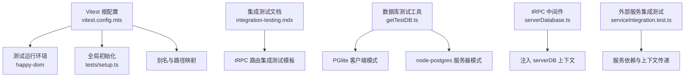
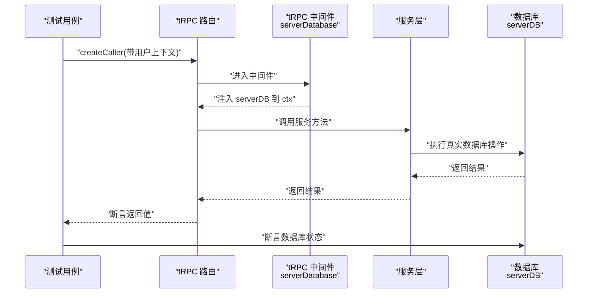
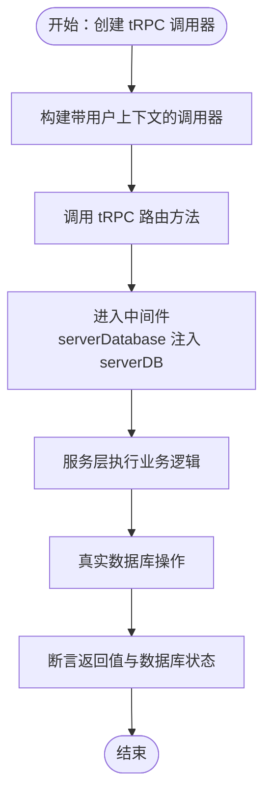
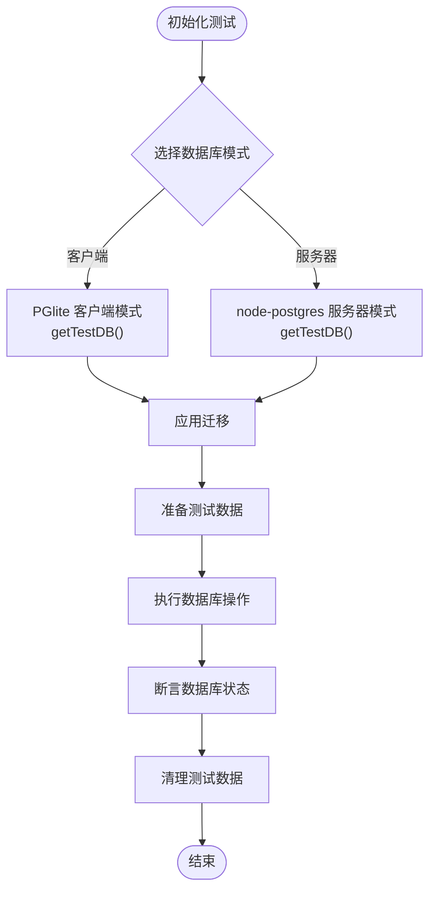
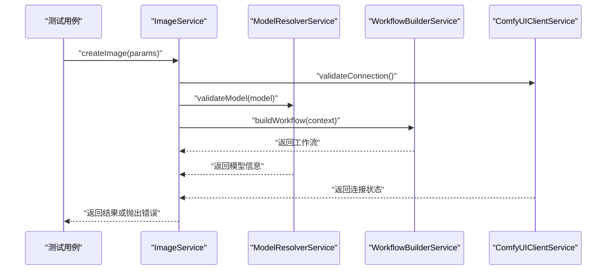
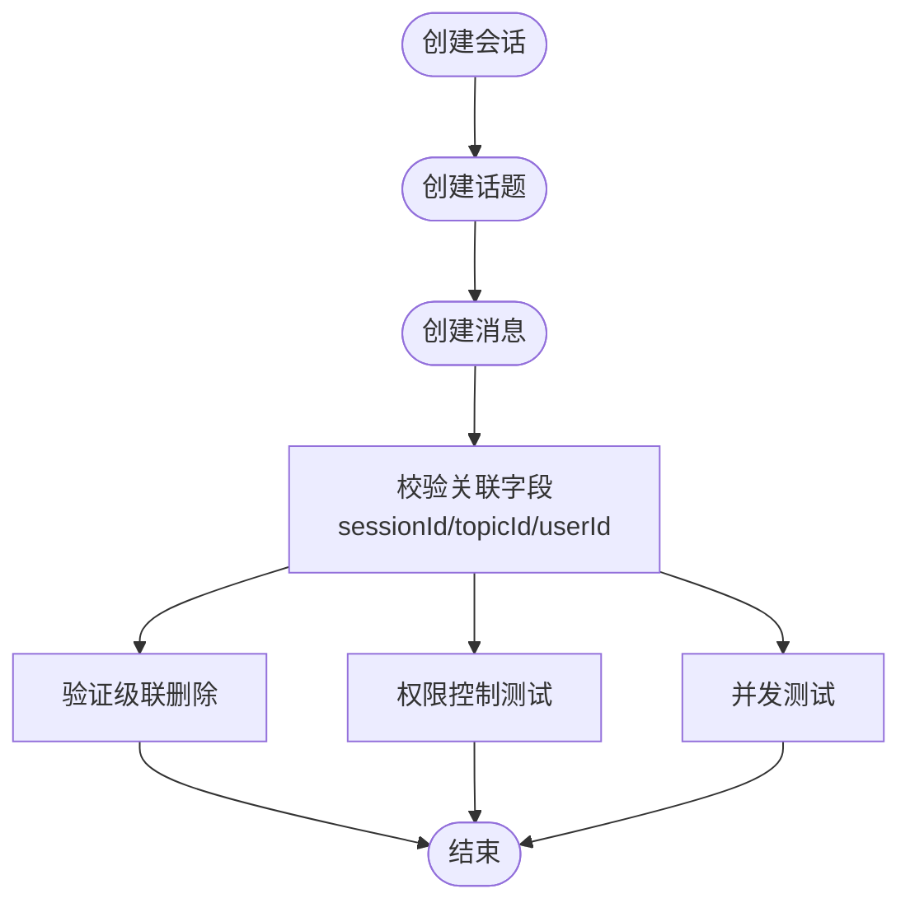
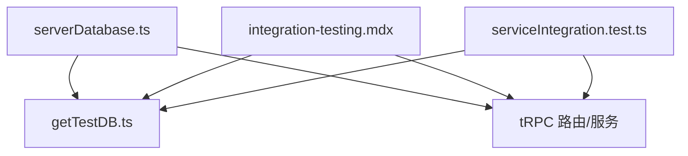

# 集成测试

<cite>
**本文引用的文件**
- [vitest.config.mts](file://vitest.config.mts)
- [integration-testing.mdx](file://docs/development/tests/integration-testing.mdx)
- [integration-testing.zh-CN.mdx](file://docs/development/tests/integration-testing.zh-CN.mdx)
- [getTestDB.ts](file://packages/database/src/core/getTestDB.ts)
- [serviceIntegration.test.ts](file://src/server/services/comfyui/__tests__/integration/serviceIntegration.test.ts)
- [setup.ts](file://tests/setup.ts)
- [userAuth.ts](file://src/libs/trpc/middleware/userAuth.ts)
- [serverDatabase.ts](file://src/libs/trpc/lambda/middleware/serverDatabase.ts)
- [message.integration.test.ts](file://src/server/routers/lambda/__tests__/integration/message.integration.test.ts)
- [agent-runtime-e2e.md](file://.agents/skills/testing/references/agent-runtime-e2e.md)
- [db-model-test.md](file://.agents/skills/testing/references/db-model-test.md)
</cite>

## 目录
1. [引言](#引言)
2. [项目结构](#项目结构)
3. [核心组件](#核心组件)
4. [架构总览](#架构总览)
5. [详细组件分析](#详细组件分析)
6. [依赖关系分析](#依赖关系分析)
7. [性能考量](#性能考量)
8. [故障排查指南](#故障排查指南)
9. [结论](#结论)
10. [附录](#附录)

## 引言
本文件面向 LobeHub 的集成测试体系，系统性阐述服务层集成测试、数据库集成测试与 API 接口集成测试的实施方法与最佳实践。内容覆盖 tRPC 服务测试、数据库连接测试、外部服务集成测试、测试环境隔离、测试数据清理、依赖服务模拟、测试数据库管理、事务回滚、并发测试等高级主题，并通过图示与示例路径帮助读者快速落地。

## 项目结构
- 集成测试文档与规范：位于开发文档目录，提供测试目标、运行方式、命名约定、调试技巧与常见问题解答。
- 测试运行配置：根级 Vitest 配置集中定义环境、别名、覆盖率、排除范围与全局初始化脚本。
- 数据库测试工具：提供测试数据库客户端（PGlite）与服务器端（node-postgres）两种模式，自动迁移与兼容性处理。
- tRPC 集成测试：通过中间件注入数据库上下文，结合测试上下文创建 tRPC 调用器进行端到端验证。
- 外部服务集成测试：以具体服务模块为例，展示服务间依赖、上下文传递与错误传播的集成验证。

**图表来源**
- [vitest.config.mts](file://vitest.config.mts#L41-L111)
- [integration-testing.mdx](file://docs/development/tests/integration-testing.mdx#L53-L80)
- [getTestDB.ts](file://packages/database/src/core/getTestDB.ts#L24-L78)
- [serverDatabase.ts](file://src/libs/trpc/lambda/middleware/serverDatabase.ts#L5-L11)
- [serviceIntegration.test.ts](file://src/server/services/comfyui/__tests__/integration/serviceIntegration.test.ts#L12-L32)

**章节来源**
- [vitest.config.mts](file://vitest.config.mts#L41-L111)
- [integration-testing.mdx](file://docs/development/tests/integration-testing.mdx#L53-L80)

## 核心组件
- 测试运行与环境
  - Vitest 根配置定义测试环境为 happy-dom，设置别名、覆盖率策略、排除范围与全局初始化脚本，确保测试在稳定环境中运行。
- 数据库测试工具
  - 提供 getTestDB 工具函数，支持客户端（PGlite）与服务器端（node-postgres）两种模式；自动迁移并在 PGlite 模式下跳过不兼容的 SQL 片段。
- tRPC 集成测试支撑
  - 通过 serverDatabase 中间件将 serverDB 注入到 tRPC 上下文中，便于在路由层集成测试中直接访问真实数据库。
- 外部服务集成测试
  - 以具体服务模块为例，验证服务间的依赖关系、上下文传递与错误传播，确保模块协作符合预期。

**章节来源**
- [vitest.config.mts](file://vitest.config.mts#L41-L111)
- [getTestDB.ts](file://packages/database/src/core/getTestDB.ts#L24-L78)
- [serverDatabase.ts](file://src/libs/trpc/lambda/middleware/serverDatabase.ts#L5-L11)
- [serviceIntegration.test.ts](file://src/server/services/comfyui/__tests__/integration/serviceIntegration.test.ts#L12-L32)

## 架构总览
下图展示了从 tRPC 路由到服务层再到数据库的真实调用链路，以及测试环境中的断言点（数据库验证）与外部服务集成验证。

**图表来源**
- [serverDatabase.ts](file://src/libs/trpc/lambda/middleware/serverDatabase.ts#L5-L11)
- [message.integration.test.ts](file://src/server/routers/lambda/__tests__/integration/message.integration.test.ts#L118-L136)

## 详细组件分析

### tRPC 服务测试
- 测试目标：验证 tRPC 路由层到服务层再到数据库的完整调用链，确保参数传递、权限控制与数据一致性。
- 关键步骤：
  - 使用 createCallerFactory 创建带用户上下文的调用器。
  - 在服务层执行业务逻辑，直接对数据库进行读写。
  - 断言返回值与数据库最终状态一致。
- 权限与上下文：
  - 通过 userAuth 中间件确保仅在存在 userId 时放行请求，否则抛出未授权错误。
  - serverDatabase 中间件将 serverDB 注入到 ctx，便于在服务层直接使用真实数据库。

**图表来源**
- [userAuth.ts](file://src/libs/trpc/middleware/userAuth.ts#L5-L16)
- [serverDatabase.ts](file://src/libs/trpc/lambda/middleware/serverDatabase.ts#L5-L11)
- [message.integration.test.ts](file://src/server/routers/lambda/__tests__/integration/message.integration.test.ts#L118-L136)

**章节来源**
- [userAuth.ts](file://src/libs/trpc/middleware/userAuth.ts#L5-L16)
- [serverDatabase.ts](file://src/libs/trpc/lambda/middleware/serverDatabase.ts#L5-L11)
- [message.integration.test.ts](file://src/server/routers/lambda/__tests__/integration/message.integration.test.ts#L118-L136)

### 数据库集成测试
- 测试目标：验证数据库约束、级联删除、跨表关联与权限控制等真实场景。
- 数据库模式：
  - 客户端模式：使用 PGlite，适合轻量与快速测试，自动跳过不兼容 SQL。
  - 服务器模式：使用 node-postgres，适合更贴近生产环境的测试。
- 最佳实践：
  - 使用 getTestDB 获取测试数据库实例，确保每次测试前后的迁移与清理。
  - 在 beforeEach 中创建最小化测试数据，在 afterEach 中彻底清理，避免测试间互相污染。
  - 对于外键约束与权限控制，编写针对性用例验证异常路径。

**图表来源**
- [getTestDB.ts](file://packages/database/src/core/getTestDB.ts#L24-L78)
- [integration-testing.mdx](file://docs/development/tests/integration-testing.mdx#L265-L280)

**章节来源**
- [getTestDB.ts](file://packages/database/src/core/getTestDB.ts#L24-L78)
- [integration-testing.mdx](file://docs/development/tests/integration-testing.mdx#L265-L280)
- [db-model-test.md](file://.agents/skills/testing/references/db-model-test.md#L88-L121)

### 外部服务集成测试
- 测试目标：验证多个服务之间的协作、上下文传递与错误传播，确保模块边界清晰且行为可预测。
- 实施要点：
  - 使用统一的 mock 设置，保证测试环境的一致性。
  - 验证服务依赖关系与调用顺序，确保上游失败能正确传递到下游。
  - 在 mock 环境中进行集成验证，减少对外部系统的依赖。

**图表来源**
- [serviceIntegration.test.ts](file://src/server/services/comfyui/__tests__/integration/serviceIntegration.test.ts#L35-L68)

**章节来源**
- [serviceIntegration.test.ts](file://src/server/services/comfyui/__tests__/integration/serviceIntegration.test.ts#L12-L32)
- [serviceIntegration.test.ts](file://src/server/services/comfyui/__tests__/integration/serviceIntegration.test.ts#L35-L68)
- [serviceIntegration.test.ts](file://src/server/services/comfyui/__tests__/integration/serviceIntegration.test.ts#L87-L116)
- [serviceIntegration.test.ts](file://src/server/services/comfyui/__tests__/integration/serviceIntegration.test.ts#L118-L132)
- [serviceIntegration.test.ts](file://src/server/services/comfyui/__tests__/integration/serviceIntegration.test.ts#L134-L159)

### API 接口集成测试（基于 tRPC）
- 测试目标：验证端到端业务流程，包括会话、话题与消息的完整链路。
- 典型流程：
  - 创建会话 -> 创建话题 -> 创建消息 -> 校验关联字段与级联删除。
- 错误处理：
  - 跨用户访问应被拒绝，验证权限控制。
  - 并发场景下应保证唯一性与原子性。

**图表来源**
- [integration-testing.mdx](file://docs/development/tests/integration-testing.mdx#L190-L219)
- [integration-testing.mdx](file://docs/development/tests/integration-testing.mdx#L221-L241)
- [integration-testing.mdx](file://docs/development/tests/integration-testing.mdx#L243-L263)

**章节来源**
- [integration-testing.mdx](file://docs/development/tests/integration-testing.mdx#L190-L219)
- [integration-testing.mdx](file://docs/development/tests/integration-testing.mdx#L221-L241)
- [integration-testing.mdx](file://docs/development/tests/integration-testing.mdx#L243-L263)

## 依赖关系分析
- 组件耦合与内聚
  - tRPC 中间件与数据库工具紧密耦合，确保服务层可直接访问真实数据库。
  - 集成测试文档与测试实现强内聚，形成“模板 + 规范”的测试体系。
- 外部依赖与集成点
  - PGlite 与 node-postgres 提供两种数据库后端，满足不同测试需求。
  - 统一的 mock 设置降低外部服务依赖，提升测试稳定性。
- 循环依赖
  - 当前结构未发现循环依赖迹象，各模块职责清晰。

**图表来源**
- [serverDatabase.ts](file://src/libs/trpc/lambda/middleware/serverDatabase.ts#L5-L11)
- [getTestDB.ts](file://packages/database/src/core/getTestDB.ts#L24-L78)
- [integration-testing.mdx](file://docs/development/tests/integration-testing.mdx#L84-L138)
- [serviceIntegration.test.ts](file://src/server/services/comfyui/__tests__/integration/serviceIntegration.test.ts#L12-L32)

**章节来源**
- [serverDatabase.ts](file://src/libs/trpc/lambda/middleware/serverDatabase.ts#L5-L11)
- [getTestDB.ts](file://packages/database/src/core/getTestDB.ts#L24-L78)
- [integration-testing.mdx](file://docs/development/tests/integration-testing.mdx#L84-L138)
- [serviceIntegration.test.ts](file://src/server/services/comfyui/__tests__/integration/serviceIntegration.test.ts#L12-L32)

## 性能考量
- 关注关键路径，避免过度测试。
- 使用 test.concurrent 并行执行独立测试，缩短整体耗时。
- 优化测试数据准备，避免重复创建与迁移。
- 在服务器模式下进行重负载测试，评估真实数据库性能瓶颈。

[本节为通用指导，无需列出章节来源]

## 故障排查指南
- 集成测试缓慢
  - 优先测试关键路径；使用 test.concurrent 并行独立测试；优化数据准备。
- 测试互相干扰
  - 确保每个测试使用唯一 userId；在 afterEach 彻底清理数据；必要时使用事务隔离。
- 认证 API 测试
  - 使用 createTestContext(userId) 创建带认证信息的上下文，再通过 createCallerFactory 创建调用器。
- 调试数据库状态
  - 在测试中打印数据库状态或使用 Drizzle Studio 查看测试数据库。
- 保留测试数据
  - 临时注释清理逻辑以便调试，但需在问题定位后恢复清理。

**章节来源**
- [integration-testing.mdx](file://docs/development/tests/integration-testing.mdx#L375-L410)
- [integration-testing.zh-CN.mdx](file://docs/development/tests/integration-testing.zh-CN.mdx#L374-L409)

## 结论
通过明确的测试目标、规范化的测试模板与完善的工具链，LobeHub 的集成测试能够有效覆盖 tRPC 路由、服务层与数据库的真实交互，保障业务流程完整性、数据一致性与权限控制正确性。配合数据库模式切换、统一 mock 与并发测试能力，可在保证质量的同时兼顾效率与可维护性。

[本节为总结性内容，无需列出章节来源]

## 附录
- 测试运行命令与文档索引
  - 运行全部集成测试、指定文件、监听模式与生成覆盖率报告的命令与文档位置参见集成测试指南。
- 测试数据管理与安全
  - 使用最小化测试数据与显式时间戳，避免依赖插入顺序；针对跨用户更新进行安全测试。
- 外部服务测试策略
  - 采用统一 mock 与 spy 技术，确保测试隔离与灵活返回值配置。

**章节来源**
- [integration-testing.mdx](file://docs/development/tests/integration-testing.mdx#L53-L67)
- [db-model-test.md](file://.agents/skills/testing/references/db-model-test.md#L69-L86)
- [agent-runtime-e2e.md](file://.agents/skills/testing/references/agent-runtime-e2e.md#L1-L48)