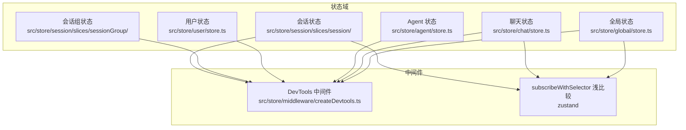
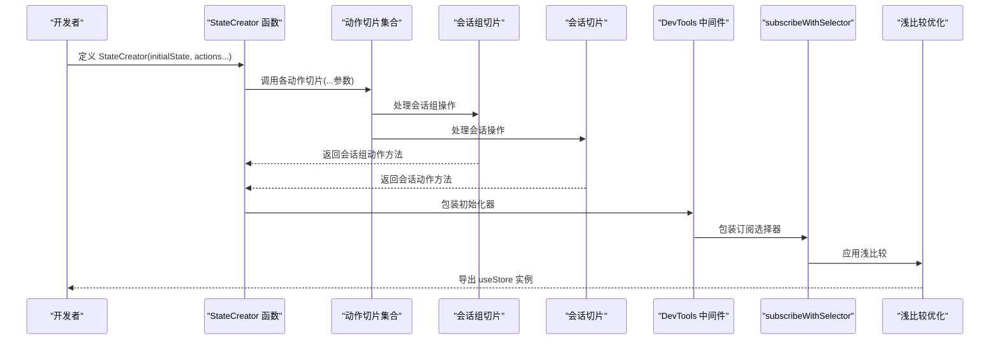
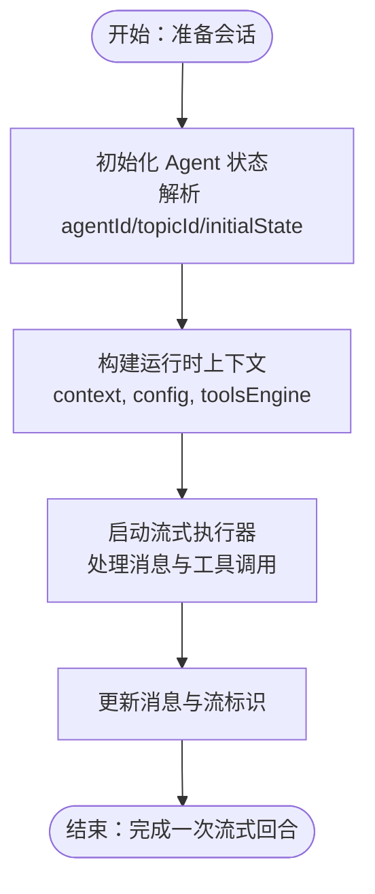
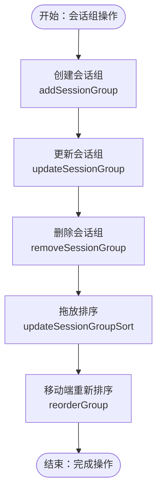
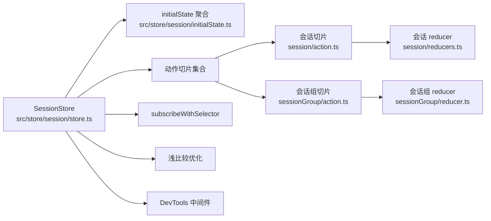

# 状态管理

<cite>
**本文引用的文件**
- [src/store/global/store.ts](file://src/store/global/store.ts)
- [src/store/global/initialState.ts](file://src/store/global/initialState.ts)
- [src/store/chat/store.ts](file://src/store/chat/store.ts)
- [src/store/chat/initialState.ts](file://src/store/chat/initialState.ts)
- [src/store/chat/slices/aiChat/initialState.ts](file://src/store/chat/slices/aiChat/initialState.ts)
- [src/store/agent/store.ts](file://src/store/agent/store.ts)
- [src/store/agent/initialState.ts](file://src/store/agent/initialState.ts)
- [src/store/agent/slices/agent/initialState.ts](file://src/store/agent/slices/agent/initialState.ts)
- [src/store/user/store.ts](file://src/store/user/store.ts)
- [src/store/user/initialState.ts](file://src/store/user/initialState.ts)
- [src/store/user/slices/auth/initialState.ts](file://src/store/user/slices/auth/initialState.ts)
- [src/store/middleware/createDevtools.ts](file://src/store/middleware/createDevtools.ts)
- [src/store/utils/flattenActions.ts](file://src/store/utils/flattenActions.ts)
- [src/store/agentGroup/store.ts](file://src/store/agentGroup/store.ts)
- [src/store/chat/slices/aiChat/actions/streamingExecutor.ts](file://src/store/chat/slices/aiChat/actions/streamingExecutor.ts)
- [src/store/session/store.ts](file://src/store/session/store.ts)
- [src/store/session/initialState.ts](file://src/store/session/initialState.ts)
- [src/store/session/slices/session/action.ts](file://src/store/session/slices/session/action.ts)
- [src/store/session/slices/session/initialState.ts](file://src/store/session/slices/session/initialState.ts)
- [src/store/session/slices/sessionGroup/action.ts](file://src/store/session/slices/sessionGroup/action.ts)
- [src/store/session/slices/sessionGroup/reducer.ts](file://src/store/session/slices/sessionGroup/reducer.ts)
- [src/store/session/slices/sessionGroup/initialState.ts](file://src/store/session/slices/sessionGroup/initialState.ts)
- [src/store/session/slices/sessionGroup/selectors.ts](file://src/store/session/slices/sessionGroup/selectors.ts)
- [apps/mobile/src/store/session.ts](file://apps/mobile/src/store/session.ts)
- [apps/mobile/src/store/sessionGroup.ts](file://apps/mobile/src/store/sessionGroup.ts)
- [packages/database/src/models/sessionGroup.ts](file://packages/database/src/models/sessionGroup.ts)
- [src/server/routers/lambda/sessionGroup.ts](file://src/server/routers/lambda/sessionGroup.ts)
</cite>

## 更新摘要

**所做更改**

- 新增会话和会话组状态管理模块的详细说明
- 扩展状态切片组织，包括会话切片和会话组切片
- 新增拖放重新排序和批量删除操作的实现细节
- 更新状态管理架构图，反映新的会话组功能
- 增加移动端和桌面端状态管理的对比分析

## 目录

1. [引言](#引言)
2. [项目结构](#项目结构)
3. [核心组件](#核心组件)
4. [架构总览](#架构总览)
5. [详细组件分析](#详细组件分析)
6. [依赖关系分析](#依赖关系分析)
7. [性能考量](#性能考量)
8. [故障排查指南](#故障排查指南)
9. [结论](#结论)
10. [附录](#附录)

## 引言

本文件系统性梳理 LobeHub 基于 Zustand 的状态管理架构，覆盖分层状态设计、状态切片组织、状态聚合与导出、中间件与调试工具、以及与组件系统的集成方式。文档重点解释以下状态域：全局状态（Global）、聊天状态（Chat）、Agent 状态（Agent）、用户状态（User）、会话状态（Session）和会话组状态（SessionGroup），并给出最佳实践、性能优化建议与常见陷阱规避方法。

## 项目结构

LobeHub 的状态管理采用 "多 Store + 切片聚合" 的分层架构：

- 每个功能域拥有独立的 Store 文件与 initialState 聚合入口，便于按域隔离与维护。
- 各 Store 通过统一的 StateCreator 组合多个 Action 切片，并使用中间件增强开发体验与性能。
- 全局 Store（如 Global）还引入订阅选择器与浅比较优化，降低无关重渲染。
- **新增** 会话和会话组状态管理，支持拖放重新排序和批量删除操作。

**图表来源**

- [src/store/global/store.ts:1-41](file://src/store/global/store.ts#L1-L41)
- [src/store/chat/store.ts:1-84](file://src/store/chat/store.ts#L1-L84)
- [src/store/agent/store.ts:1-62](file://src/store/agent/store.ts#L1-L62)
- [src/store/user/store.ts:1-59](file://src/store/user/store.ts#L1-L59)
- [src/store/session/slices/sessionGroup/action.ts:1-73](file://src/store/session/slices/sessionGroup/action.ts#L1-L73)
- [src/store/session/slices/session/action.ts:1-326](file://src/store/session/slices/session/action.ts#L1-L326)
- [src/store/middleware/createDevtools.ts:1-24](file://src/store/middleware/createDevtools.ts#L1-L24)

**章节来源**

- [src/store/global/store.ts:1-41](file://src/store/global/store.ts#L1-L41)
- [src/store/chat/store.ts:1-84](file://src/store/chat/store.ts#L1-L84)
- [src/store/agent/store.ts:1-62](file://src/store/agent/store.ts#L1-L62)
- [src/store/user/store.ts:1-59](file://src/store/user/store.ts#L1-L59)
- [src/store/session/store.ts:1-53](file://src/store/session/store.ts#L1-L53)

## 核心组件

- Store 聚合器：每个域的 store.ts 使用 StateCreator 将 initialState 与多个 Action 切片合并，形成完整的 Store 类型与实例。
- 动作扁平化：通过工具函数将多个 Action 切片合并为单一对象，避免命名冲突与重复键。
- 中间件链路：DevTools 条件启用（根据 URL 参数与环境变量），subscribeWithSelector 提升订阅效率，shallow 降低重渲染。
- 状态切片：各域的 initialState.ts 负责声明域内状态结构与默认值；Action 切片负责状态变更逻辑。
- **新增** 会话组切片：专门处理会话分组、拖放排序和批量管理操作。

**章节来源**

- [src/store/global/store.ts:1-41](file://src/store/global/store.ts#L1-L41)
- [src/store/chat/store.ts:1-84](file://src/store/chat/store.ts#L1-L84)
- [src/store/agent/store.ts:1-62](file://src/store/agent/store.ts#L1-L62)
- [src/store/user/store.ts:1-59](file://src/store/user/store.ts#L1-L59)
- [src/store/utils/flattenActions.ts](file://src/store/utils/flattenActions.ts)
- [src/store/session/slices/sessionGroup/action.ts:1-73](file://src/store/session/slices/sessionGroup/action.ts#L1-L73)

## 架构总览

下图展示了 Zustand Store 的构建流程与关键依赖，包括新增的会话组功能：

**图表来源**

- [src/store/session/store.ts:28-38](file://src/store/session/store.ts#L28-L38)
- [src/store/session/slices/session/action.ts:40-41](file://src/store/session/slices/session/action.ts#L40-L41)
- [src/store/session/slices/sessionGroup/action.ts:13-14](file://src/store/session/slices/sessionGroup/action.ts#L13-L14)
- [src/store/global/store.ts:23-40](file://src/store/global/store.ts#L23-L40)
- [src/store/agent/store.ts:41-59](file://src/store/agent/store.ts#L41-L59)
- [src/store/user/store.ts:36-56](file://src/store/user/store.ts#L36-L56)
- [src/store/middleware/createDevtools.ts:6-23](file://src/store/middleware/createDevtools.ts#L6-L23)

## 详细组件分析

### 全局状态（Global）

- 职责：承载系统级 UI 状态、导航控制、客户端数据库初始化状态、版本信息与用户偏好等。
- 关键点：
  - 使用 subscribeWithSelector 与 shallow 优化订阅与渲染。
  - initialState 定义了系统状态的默认值与存储介质（AsyncLocalStorage）。
  - 动作切片通过 flattenActions 聚合，支持工作区面板与通用系统行为。
- 典型操作路径：
  - 读取系统状态：useGlobalStore (state => state.status.xxx)
  - 更新系统状态：useGlobalStore.getState ().xxxAction (params)
  - 开发调试：在 URL 添加 debug=global 并在浏览器中打开 DevTools 面板。

**章节来源**

- [src/store/global/store.ts:1-41](file://src/store/global/store.ts#L1-L41)
- [src/store/global/initialState.ts:1-267](file://src/store/global/initialState.ts#L1-L267)

### 聊天状态（Chat）

- 职责：管理消息、主题、线程、AI 对话、内置工具、插件、翻译、TTS、门户与操作等。
- 结构特征：
  - initialState 聚合多个切片状态，形成 ChatStoreState。
  - 动作切片覆盖消息、线程、话题、AI 聊天、内置工具、插件、翻译、TTS、门户与操作。
  - 支持流式执行器（StreamingExecutor）以处理 AI 推理与工具调用的增量更新。
- 典型操作路径：
  - 读取消息列表：useChatStore (state => state.messages)
  - 发送消息：useChatStore.getState ().createMessage (params)
  - 流式响应：通过 StreamingExecutor 内部状态推进与工具调用流标识管理。

**图表来源**

- [src/store/chat/slices/aiChat/actions/streamingExecutor.ts:58-103](file://src/store/chat/slices/aiChat/actions/streamingExecutor.ts#L58-L103)

**章节来源**

- [src/store/chat/store.ts:1-84](file://src/store/chat/store.ts#L1-L84)
- [src/store/chat/initialState.ts:1-40](file://src/store/chat/initialState.ts#L1-L40)
- [src/store/chat/slices/aiChat/initialState.ts:1-23](file://src/store/chat/slices/aiChat/initialState.ts#L1-L23)
- [src/store/chat/slices/aiChat/actions/streamingExecutor.ts:58-103](file://src/store/chat/slices/aiChat/actions/streamingExecutor.ts#L58-L103)

### Agent 状态（Agent）

- 职责：管理 Agent 列表、当前激活 Agent、配置元数据、保存状态、系统角色流式更新等。
- 结构特征：
  - initialState 聚合 Agent 与内置 Agent 切片。
  - 提供加载状态与保存状态字段，用于 UI 反馈与并发控制。
- 典型操作路径：
  - 设置当前 Agent：useAgentStore.getState ().setActiveAgent (agentId)
  - 更新元数据：useAgentStore.getState ().updateAgentMeta (meta)
  - 观察保存状态：useAgentStore (state => state.saveStatus)

**章节来源**

- [src/store/agent/store.ts:1-62](file://src/store/agent/store.ts#L1-L62)
- [src/store/agent/initialState.ts:1-12](file://src/store/agent/initialState.ts#L1-L12)
- [src/store/agent/slices/agent/initialState.ts:1-60](file://src/store/agent/slices/agent/initialState.ts#L1-L60)

### 用户状态（User）

- 职责：管理用户认证、偏好设置、引导流程、通用状态与设置。
- 结构特征：
  - initialState 聚合设置、偏好、认证、通用与引导切片。
  - 认证状态支持 OAuth 与密码账户判断。
- 典型操作路径：
  - 登录 / 登出：useUserStore.getState ().signin ()/signout ()
  - 更新偏好：useUserStore.getState ().updatePreference (prefs)
  - 查询登录态：useUserStore (state => state.auth.isSignedIn)

**章节来源**

- [src/store/user/store.ts:1-59](file://src/store/user/store.ts#L1-L59)
- [src/store/user/initialState.ts:1-25](file://src/store/user/initialState.ts#L1-L25)
- [src/store/user/slices/auth/initialState.ts:1-20](file://src/store/user/slices/auth/initialState.ts#L1-L20)

### 会话状态（Session）

- 职责：管理聊天会话列表、活动会话、会话分组、固定会话等功能。
- 结构特征：
  - initialState 聚合会话、会话组、最近会话和主页输入切片。
  - 提供会话创建、删除、重命名、固定 / 取消固定等操作。
  - 支持会话与会话组的关联管理。
- 典型操作路径：
  - 创建会话：useSessionStore.getState ().createSession (params)
  - 删除会话：useSessionStore.getState ().removeSession (id)
  - 切换会话：useSessionStore.getState ().switchSession (id)
  - 固定会话：useSessionStore.getState ().pinSession (id, true/false)

**章节来源**

- [src/store/session/store.ts:1-53](file://src/store/session/store.ts#L1-L53)
- [src/store/session/initialState.ts:1-19](file://src/store/session/initialState.ts#L1-L19)
- [src/store/session/slices/session/action.ts:1-326](file://src/store/session/slices/session/action.ts#L1-L326)
- [src/store/session/slices/session/initialState.ts:1-54](file://src/store/session/slices/session/initialState.ts#L1-L54)

### 会话组状态（SessionGroup）

- 职责：管理会话分组、拖放重新排序、批量删除等操作。
- 结构特征：
  - 采用 Redux 风格的 reducer 模式处理会话组状态变更。
  - 支持添加、删除、更新会话组以及更新排序。
  - 与会话切片协同工作，实现会话与分组的双向关联。
- 典型操作路径：
  - 创建会话组：useSessionStore.getState ().addSessionGroup (name)
  - 删除会话组：useSessionStore.getState ().removeSessionGroup (id)
  - 更新排序：useSessionStore.getState ().updateSessionGroupSort (items)
  - 重新排序（移动端）：useSessionGroupStore.getState ().reorderGroup (id, direction)

**图表来源**

- [src/store/session/slices/sessionGroup/action.ts:25-64](file://src/store/session/slices/sessionGroup/action.ts#L25-L64)
- [apps/mobile/src/store/sessionGroup.ts:95-112](file://apps/mobile/src/store/sessionGroup.ts#L95-L112)

**章节来源**

- [src/store/session/slices/sessionGroup/action.ts:1-73](file://src/store/session/slices/sessionGroup/action.ts#L1-L73)
- [src/store/session/slices/sessionGroup/reducer.ts:1-57](file://src/store/session/slices/sessionGroup/reducer.ts#L1-L57)
- [src/store/session/slices/sessionGroup/initialState.ts:1-20](file://src/store/session/slices/sessionGroup/initialState.ts#L1-L20)
- [src/store/session/slices/sessionGroup/selectors.ts:1-12](file://src/store/session/slices/sessionGroup/selectors.ts#L1-L12)
- [apps/mobile/src/store/sessionGroup.ts:1-114](file://apps/mobile/src/store/sessionGroup.ts#L1-L114)

### 移动端状态管理（Mobile）

- 职责：提供移动端专用的会话和会话组状态管理，支持本地存储和错误处理。
- 结构特征：
  - 使用 AsyncStorage 存储活动会话 ID 和本地设置。
  - 提供乐观更新机制，先本地更新再后台同步。
  - 包含完整的错误处理和用户反馈机制。
- 典型操作路径：
  - 获取会话列表：useSessionStore.getState ().fetchSessions ()
  - 创建会话：useSessionStore.getState ().createSession (title)
  - 重新排序：useSessionGroupStore.getState ().reorderGroup (id, direction)

**章节来源**

- [apps/mobile/src/store/session.ts:1-210](file://apps/mobile/src/store/session.ts#L1-L210)
- [apps/mobile/src/store/sessionGroup.ts:1-114](file://apps/mobile/src/store/sessionGroup.ts#L1-L114)

## 依赖关系分析

- Store 聚合依赖：
  - 各域 Store 依赖 initialState 聚合与动作切片工厂。
  - flattenActions 工具确保动作方法无冲突地合并到 Store。
- 中间件依赖：
  - DevTools 条件启用，依据 URL 参数与环境变量决定是否开启。
  - subscribeWithSelector 与 shallow 由 Zustand 提供，减少不必要订阅与渲染。
- 运行时依赖：
  - StreamingExecutor 在聊天域内作为内部执行器，协调消息与工具调用的流式更新。
  - **新增** 会话组 reducer 协同会话切片，处理分组状态变更和排序更新。

**图表来源**

- [src/store/session/store.ts:1-53](file://src/store/session/store.ts#L1-L53)
- [src/store/session/initialState.ts:1-19](file://src/store/session/initialState.ts#L1-L19)
- [src/store/session/slices/session/action.ts:1-326](file://src/store/session/slices/session/action.ts#L1-L326)
- [src/store/session/slices/sessionGroup/action.ts:1-73](file://src/store/session/slices/sessionGroup/action.ts#L1-L73)
- [src/store/session/slices/sessionGroup/reducer.ts:1-57](file://src/store/session/slices/sessionGroup/reducer.ts#L1-L57)
- [src/store/middleware/createDevtools.ts:1-24](file://src/store/middleware/createDevtools.ts#L1-L24)

**章节来源**

- [src/store/session/store.ts:1-53](file://src/store/session/store.ts#L1-L53)
- [src/store/session/initialState.ts:1-19](file://src/store/session/initialState.ts#L1-L19)
- [src/store/middleware/createDevtools.ts:1-24](file://src/store/middleware/createDevtools.ts#L1-L24)

## 性能考量

- 订阅选择器与浅比较
  - 在全局与聊天 Store 中使用 subscribeWithSelector 与 shallow，可显著降低无关重渲染与订阅开销。
  - **新增** 会话 Store 也采用浅比较优化，减少会话列表的不必要重渲染。
- 动作扁平化
  - 通过 flattenActions 将多个切片的动作合并为单一对象，避免键冲突与重复包装。
- DevTools 条件启用
  - 仅在 URL 参数包含对应域名且处于开发环境时启用，避免生产环境性能损耗。
- 流式更新与工具调用标识
  - 聊天域通过工具调用流标识记录与消息增量更新，减少全量重绘。
- **新增** 乐观更新机制
  - 会话和会话组操作采用乐观更新，先本地更新状态再异步同步到服务器，提升用户体验。

**章节来源**

- [src/store/global/store.ts:1-41](file://src/store/global/store.ts#L1-L41)
- [src/store/chat/store.ts:1-84](file://src/store/chat/store.ts#L1-L84)
- [src/store/session/store.ts:1-53](file://src/store/session/store.ts#L1-L53)
- [src/store/utils/flattenActions.ts](file://src/store/utils/flattenActions.ts)
- [src/store/middleware/createDevtools.ts:1-24](file://src/store/middleware/createDevtools.ts#L1-L24)

## 故障排查指南

- DevTools 未显示
  - 确认 URL 参数包含 debug=storeName（如 debug=chat、debug=global、debug=session），并在开发环境运行。
- 订阅过多导致卡顿
  - 检查是否对大对象进行全量订阅，优先使用 subscribeWithSelector 的选择器写法。
- 状态更新无效
  - 确认使用 getState ().action (params) 或 useStore.getState ().action (params) 的正确调用方式。
- 流式响应异常
  - 检查工具调用流标识与消息状态是否同步更新，避免并发覆盖。
- **新增** 会话组操作失败
  - 检查网络请求是否成功，确认服务器端会话组服务正常运行。
  - 验证拖放排序操作的 sortMap 数据格式是否正确。
  - 查看移动端重新排序的错误处理日志。

**章节来源**

- [src/store/middleware/createDevtools.ts:6-23](file://src/store/middleware/createDevtools.ts#L6-L23)
- [src/store/chat/slices/aiChat/actions/streamingExecutor.ts:58-103](file://src/store/chat/slices/aiChat/actions/streamingExecutor.ts#L58-L103)

## 结论

LobeHub 的 Zustand 状态管理以 "域 Store + 切片聚合" 为核心，辅以中间件与优化策略，实现了清晰的职责划分与良好的性能表现。通过 subscribeWithSelector、浅比较与条件 DevTools，系统在开发体验与运行效率之间取得平衡。**新增的会话和会话组状态管理功能进一步完善了应用的数据管理能力，支持拖放重新排序和批量删除操作，提升了用户体验。** 遵循本文的最佳实践与排错建议，可有效提升状态管理的稳定性与可维护性。

## 附录

- 状态读取与更新示例（路径）
  - 读取全局状态：[useGlobalStore 读取状态：37-40](file://src/store/global/store.ts#L37-L40)
  - 更新全局状态：[全局动作切片：23-31](file://src/store/global/store.ts#L23-L31)
  - 读取聊天状态：[useChatStore 读取状态：74-77](file://src/store/chat/store.ts#L74-L77)
  - 发送消息（动作示例）：[聊天动作切片：55-67](file://src/store/chat/store.ts#L55-L67)
  - 读取 Agent 状态：[useAgentStore 读取状态](file://src/store/agent/store.ts#L59)
  - 更新 Agent 状态：[Agent 切片动作：41-53](file://src/store/agent/store.ts#L41-L53)
  - 读取用户状态：[useUserStore 读取状态：53-56](file://src/store/user/store.ts#L53-L56)
  - 更新用户状态：[用户切片动作：36-47](file://src/store/user/store.ts#L36-L47)
  - 群组状态操作：[AgentGroup Store:22-25](file://src/store/agentGroup/store.ts#L22-L25)
  - **新增** 会话操作：[会话动作切片：62-100](file://src/store/session/slices/session/action.ts#L62-L100)
  - **新增** 会话组操作：[会话组动作切片：25-46](file://src/store/session/slices/sessionGroup/action.ts#L25-L46)
  - **新增** 移动端会话操作：[移动端会话 Store:87-129](file://apps/mobile/src/store/session.ts#L87-L129)
  - **新增** 移动端会话组操作：[移动端会话组 Store:95-112](file://apps/mobile/src/store/sessionGroup.ts#L95-L112)
