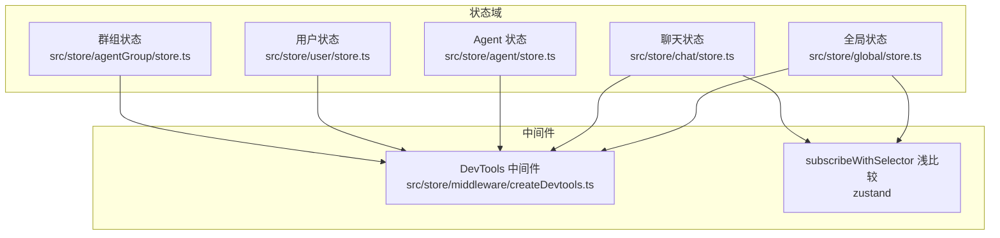
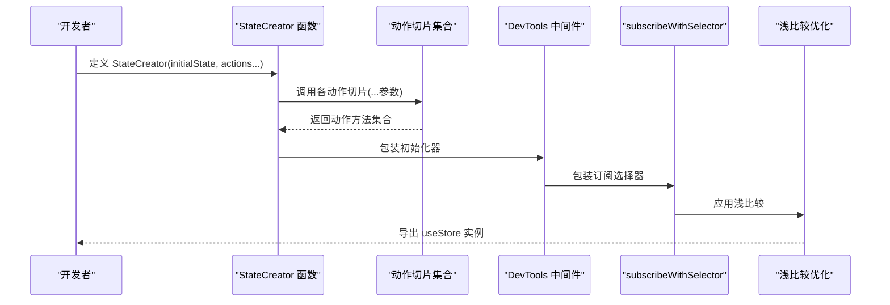
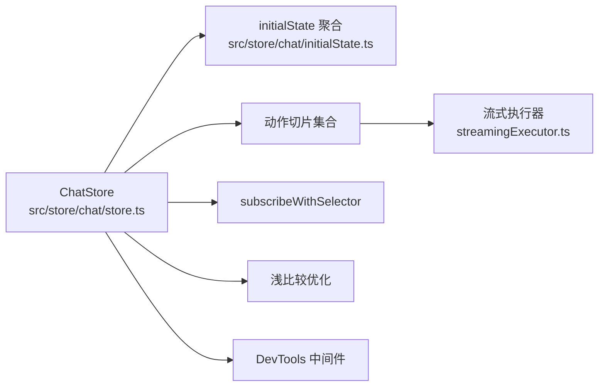

# 状态管理

<cite>
**本文引用的文件**
- [src/store/global/store.ts](file://src/store/global/store.ts)
- [src/store/global/initialState.ts](file://src/store/global/initialState.ts)
- [src/store/chat/store.ts](file://src/store/chat/store.ts)
- [src/store/chat/initialState.ts](file://src/store/chat/initialState.ts)
- [src/store/chat/slices/aiChat/initialState.ts](file://src/store/chat/slices/aiChat/initialState.ts)
- [src/store/agent/store.ts](file://src/store/agent/store.ts)
- [src/store/agent/initialState.ts](file://src/store/agent/initialState.ts)
- [src/store/agent/slices/agent/initialState.ts](file://src/store/agent/slices/agent/initialState.ts)
- [src/store/user/store.ts](file://src/store/user/store.ts)
- [src/store/user/initialState.ts](file://src/store/user/initialState.ts)
- [src/store/user/slices/auth/initialState.ts](file://src/store/user/slices/auth/initialState.ts)
- [src/store/middleware/createDevtools.ts](file://src/store/middleware/createDevtools.ts)
- [src/store/utils/flattenActions.ts](file://src/store/utils/flattenActions.ts)
- [src/store/agentGroup/store.ts](file://src/store/agentGroup/store.ts)
- [src/store/chat/slices/aiChat/actions/streamingExecutor.ts](file://src/store/chat/slices/aiChat/actions/streamingExecutor.ts)
</cite>

## 目录

1. [引言](#引言)
2. [项目结构](#项目结构)
3. [核心组件](#核心组件)
4. [架构总览](#架构总览)
5. [详细组件分析](#详细组件分析)
6. [依赖关系分析](#依赖关系分析)
7. [性能考量](#性能考量)
8. [故障排查指南](#故障排查指南)
9. [结论](#结论)
10. [附录](#附录)

## 引言

本文件系统性梳理 LobeHub 基于 Zustand 的状态管理架构，覆盖分层状态设计、状态切片组织、状态聚合与导出、中间件与调试工具、以及与组件系统的集成方式。文档重点解释以下状态域：全局状态（Global）、聊天状态（Chat）、Agent 状态（Agent）、用户状态（User），并给出最佳实践、性能优化建议与常见陷阱规避方法。

## 项目结构

LobeHub 的状态管理采用 “多 Store + 切片聚合” 的分层架构：

- 每个功能域拥有独立的 Store 文件与 initialState 聚合入口，便于按域隔离与维护。
- 各 Store 通过统一的 StateCreator 组合多个 Action 切片，并使用中间件增强开发体验与性能。
- 全局 Store（如 Global）还引入订阅选择器与浅比较优化，降低无关重渲染。

图表来源

- [src/store/global/store.ts](file://src/store/global/store.ts#L1-L41)
- [src/store/chat/store.ts](file://src/store/chat/store.ts#L1-L84)
- [src/store/agent/store.ts](file://src/store/agent/store.ts#L1-L62)
- [src/store/user/store.ts](file://src/store/user/store.ts#L1-L59)
- [src/store/agentGroup/store.ts](file://src/store/agentGroup/store.ts#L1-L27)
- [src/store/middleware/createDevtools.ts](file://src/store/middleware/createDevtools.ts#L1-L24)

章节来源

- [src/store/global/store.ts](file://src/store/global/store.ts#L1-L41)
- [src/store/chat/store.ts](file://src/store/chat/store.ts#L1-L84)
- [src/store/agent/store.ts](file://src/store/agent/store.ts#L1-L62)
- [src/store/user/store.ts](file://src/store/user/store.ts#L1-L59)
- [src/store/agentGroup/store.ts](file://src/store/agentGroup/store.ts#L1-L27)

## 核心组件

- Store 聚合器：每个域的 store.ts 使用 StateCreator 将 initialState 与多个 Action 切片合并，形成完整的 Store 类型与实例。
- 动作扁平化：通过工具函数将多个 Action 切片合并为单一对象，避免命名冲突与重复键。
- 中间件链路：DevTools 条件启用（根据 URL 参数与环境变量），subscribeWithSelector 提升订阅效率，shallow 降低重渲染。
- 状态切片：各域的 initialState.ts 负责声明域内状态结构与默认值；Action 切片负责状态变更逻辑。

章节来源

- [src/store/global/store.ts](file://src/store/global/store.ts#L1-L41)
- [src/store/chat/store.ts](file://src/store/chat/store.ts#L1-L84)
- [src/store/agent/store.ts](file://src/store/agent/store.ts#L1-L62)
- [src/store/user/store.ts](file://src/store/user/store.ts#L1-L59)
- [src/store/utils/flattenActions.ts](file://src/store/utils/flattenActions.ts)

## 架构总览

下图展示了 Zustand Store 的构建流程与关键依赖：

图表来源

- [src/store/chat/store.ts](file://src/store/chat/store.ts#L50-L77)
- [src/store/global/store.ts](file://src/store/global/store.ts#L23-L40)
- [src/store/agent/store.ts](file://src/store/agent/store.ts#L41-L59)
- [src/store/user/store.ts](file://src/store/user/store.ts#L36-L56)
- [src/store/middleware/createDevtools.ts](file://src/store/middleware/createDevtools.ts#L6-L23)

## 详细组件分析

### 全局状态（Global）

- 职责：承载系统级 UI 状态、导航控制、客户端数据库初始化状态、版本信息与用户偏好等。
- 关键点：
  - 使用 subscribeWithSelector 与 shallow 优化订阅与渲染。
  - initialState 定义了系统状态的默认值与存储介质（AsyncLocalStorage）。
  - 动作切片通过 flattenActions 聚合，支持工作区面板与通用系统行为。
- 典型操作路径：
  - 读取系统状态：useGlobalStore (state => state.status.xxx)
  - 更新系统状态：useGlobalStore.getState ().xxxAction (params)
  - 开发调试：在 URL 添加 debug=global 并在浏览器中打开 DevTools 面板。

章节来源

- [src/store/global/store.ts](file://src/store/global/store.ts#L1-L41)
- [src/store/global/initialState.ts](file://src/store/global/initialState.ts#L1-L267)

### 聊天状态（Chat）

- 职责：管理消息、主题、线程、AI 对话、内置工具、插件、翻译、TTS、门户与操作等。
- 结构特征：
  - initialState 聚合多个切片状态，形成 ChatStoreState。
  - 动作切片覆盖消息、线程、话题、AI 聊天、内置工具、插件、翻译、TTS、门户与操作。
  - 支持流式执行器（StreamingExecutor）以处理 AI 推理与工具调用的增量更新。
- 典型操作路径：
  - 读取消息列表：useChatStore (state => state.messages)
  - 发送消息：useChatStore.getState ().createMessage (params)
  - 流式响应：通过 StreamingExecutor 内部状态推进与工具调用流标识管理。

图表来源

- [src/store/chat/slices/aiChat/actions/streamingExecutor.ts](file://src/store/chat/slices/aiChat/actions/streamingExecutor.ts#L58-L103)

章节来源

- [src/store/chat/store.ts](file://src/store/chat/store.ts#L1-L84)
- [src/store/chat/initialState.ts](file://src/store/chat/initialState.ts#L1-L40)
- [src/store/chat/slices/aiChat/initialState.ts](file://src/store/chat/slices/aiChat/initialState.ts#L1-L23)
- [src/store/chat/slices/aiChat/actions/streamingExecutor.ts](file://src/store/chat/slices/aiChat/actions/streamingExecutor.ts#L58-L103)

### Agent 状态（Agent）

- 职责：管理 Agent 列表、当前激活 Agent、配置元数据、保存状态、系统角色流式更新等。
- 结构特征：
  - initialState 聚合 Agent 与内置 Agent 切片。
  - 提供加载状态与保存状态字段，用于 UI 反馈与并发控制。
- 典型操作路径：
  - 设置当前 Agent：useAgentStore.getState ().setActiveAgent (agentId)
  - 更新元数据：useAgentStore.getState ().updateAgentMeta (meta)
  - 观察保存状态：useAgentStore (state => state.saveStatus)

章节来源

- [src/store/agent/store.ts](file://src/store/agent/store.ts#L1-L62)
- [src/store/agent/initialState.ts](file://src/store/agent/initialState.ts#L1-L12)
- [src/store/agent/slices/agent/initialState.ts](file://src/store/agent/slices/agent/initialState.ts#L1-L60)

### 用户状态（User）

- 职责：管理用户认证、偏好设置、引导流程、通用状态与设置。
- 结构特征：
  - initialState 聚合设置、偏好、认证、通用与引导切片。
  - 认证状态支持 OAuth 与密码账户判断。
- 典型操作路径：
  - 登录 / 登出：useUserStore.getState ().signin ()/signout ()
  - 更新偏好：useUserStore.getState ().updatePreference (prefs)
  - 查询登录态：useUserStore (state => state.auth.isSignedIn)

章节来源

- [src/store/user/store.ts](file://src/store/user/store.ts#L1-L59)
- [src/store/user/initialState.ts](file://src/store/user/initialState.ts#L1-L25)
- [src/store/user/slices/auth/initialState.ts](file://src/store/user/slices/auth/initialState.ts#L1-L20)

### 群组状态（AgentGroup）

- 职责：管理群组生命周期、成员管理、CURD 等。
- 结构特征：
  - 采用传统创建器与浅比较优化，结合 DevTools 中间件。
- 典型操作路径：
  - 创建群组：useAgentGroupStore.getState ().createGroup (params)
  - 更新成员：useAgentGroupStore.getState ().updateMember (groupId, members)

章节来源

- [src/store/agentGroup/store.ts](file://src/store/agentGroup/store.ts#L1-L27)

## 依赖关系分析

- Store 聚合依赖：
  - 各域 Store 依赖 initialState 聚合与动作切片工厂。
  - flattenActions 工具确保动作方法无冲突地合并到 Store。
- 中间件依赖：
  - DevTools 条件启用，依据 URL 参数与环境变量决定是否开启。
  - subscribeWithSelector 与 shallow 由 Zustand 提供，减少不必要订阅与渲染。
- 运行时依赖：
  - StreamingExecutor 在聊天域内作为内部执行器，协调消息与工具调用的流式更新。

图表来源

- [src/store/chat/store.ts](file://src/store/chat/store.ts#L1-L84)
- [src/store/chat/initialState.ts](file://src/store/chat/initialState.ts#L1-L40)
- [src/store/chat/slices/aiChat/actions/streamingExecutor.ts](file://src/store/chat/slices/aiChat/actions/streamingExecutor.ts#L58-L103)
- [src/store/middleware/createDevtools.ts](file://src/store/middleware/createDevtools.ts#L1-L24)

章节来源

- [src/store/chat/store.ts](file://src/store/chat/store.ts#L1-L84)
- [src/store/chat/initialState.ts](file://src/store/chat/initialState.ts#L1-L40)
- [src/store/middleware/createDevtools.ts](file://src/store/middleware/createDevtools.ts#L1-L24)

## 性能考量

- 订阅选择器与浅比较
  - 在全局与聊天 Store 中使用 subscribeWithSelector 与 shallow，可显著降低无关重渲染与订阅开销。
- 动作扁平化
  - 通过 flattenActions 将多个切片的动作合并为单一对象，避免键冲突与重复包装。
- DevTools 条件启用
  - 仅在 URL 参数包含对应域名且处于开发环境时启用，避免生产环境性能损耗。
- 流式更新与工具调用标识
  - 聊天域通过工具调用流标识记录与消息增量更新，减少全量重绘。

章节来源

- [src/store/global/store.ts](file://src/store/global/store.ts#L1-L41)
- [src/store/chat/store.ts](file://src/store/chat/store.ts#L1-L84)
- [src/store/utils/flattenActions.ts](file://src/store/utils/flattenActions.ts)
- [src/store/middleware/createDevtools.ts](file://src/store/middleware/createDevtools.ts#L1-L24)

## 故障排查指南

- DevTools 未显示
  - 确认 URL 参数包含 debug=storeName（如 debug=chat、debug=global），并在开发环境运行。
- 订阅过多导致卡顿
  - 检查是否对大对象进行全量订阅，优先使用 subscribeWithSelector 的选择器写法。
- 状态更新无效
  - 确认使用 getState ().action (params) 或 useStore.getState ().action (params) 的正确调用方式。
- 流式响应异常
  - 检查工具调用流标识与消息状态是否同步更新，避免并发覆盖。

章节来源

- [src/store/middleware/createDevtools.ts](file://src/store/middleware/createDevtools.ts#L6-L23)
- [src/store/chat/slices/aiChat/actions/streamingExecutor.ts](file://src/store/chat/slices/aiChat/actions/streamingExecutor.ts#L58-L103)

## 结论

LobeHub 的 Zustand 状态管理以 “域 Store + 切片聚合” 为核心，辅以中间件与优化策略，实现了清晰的职责划分与良好的性能表现。通过 subscribeWithSelector、浅比较与条件 DevTools，系统在开发体验与运行效率之间取得平衡。遵循本文的最佳实践与排错建议，可有效提升状态管理的稳定性与可维护性。

## 附录

- 状态读取与更新示例（路径）
  - 读取全局状态：[useGlobalStore 读取状态](file://src/store/global/store.ts#L37-L40)
  - 更新全局状态：[全局动作切片](file://src/store/global/store.ts#L23-L31)
  - 读取聊天状态：[useChatStore 读取状态](file://src/store/chat/store.ts#L74-L77)
  - 发送消息（动作示例）：[聊天动作切片](file://src/store/chat/store.ts#L55-L67)
  - 读取 Agent 状态：[useAgentStore 读取状态](file://src/store/agent/store.ts#L59)
  - 更新 Agent 状态：[Agent 切片动作](file://src/store/agent/store.ts#L41-L53)
  - 读取用户状态：[useUserStore 读取状态](file://src/store/user/store.ts#L53-L56)
  - 更新用户状态：[用户切片动作](file://src/store/user/store.ts#L36-L47)
  - 群组状态操作：[AgentGroup Store](file://src/store/agentGroup/store.ts#L22-L25)
