# 移动端状态管理

<cite>
**本文档引用的文件**
- [apps/mobile/package.json](file://apps/mobile/package.json)
- [apps/mobile/App.tsx](file://apps/mobile/App.tsx)
- [apps/mobile/src/navigation/index.tsx](file://apps/mobile/src/navigation/index.tsx)
- [apps/mobile/src/store/chat.ts](file://apps/mobile/src/store/chat.ts)
- [apps/mobile/src/store/session.ts](file://apps/mobile/src/store/session.ts)
- [apps/mobile/src/store/model.ts](file://apps/mobile/src/store/model.ts)
- [apps/mobile/src/store/connection.ts](file://apps/mobile/src/store/connection.ts)
- [apps/mobile/src/store/user.ts](file://apps/mobile/src/store/user.ts)
- [apps/mobile/src/store/file.ts](file://apps/mobile/src/store/file.ts)
- [apps/mobile/src/store/discover.ts](file://apps/mobile/src/store/discover.ts)
- [apps/mobile/src/store/topic.ts](file://apps/mobile/src/store/topic.ts)
- [apps/mobile/src/store/sessionGroup.ts](file://apps/mobile/src/store/sessionGroup.ts)
- [apps/mobile/src/store/theme.ts](file://apps/mobile/src/store/theme.ts)
- [apps/mobile/src/store/agent.ts](file://apps/mobile/src/store/agent.ts)
- [apps/mobile/src/store/agentConfig.ts](file://apps/mobile/src/store/agentConfig.ts)
- [apps/mobile/src/store/artwork.ts](file://apps/mobile/src/store/artwork.ts)
- [apps/mobile/src/theme/index.ts](file://apps/mobile/src/theme/index.ts)
</cite>

## 更新摘要
**所做更改**
- 新增主题状态管理模块（Theme Store）
- 新增智能体状态管理模块（Agent Store）
- 新增智能体配置缓存模块（Agent Config Store）
- 新增艺术作品历史管理模块（Artwork Store）
- 更新应用启动流程以支持多store架构
- 增强状态管理的模块化设计和依赖关系

## 目录
1. [简介](#简介)
2. [项目结构](#项目结构)
3. [核心组件](#核心组件)
4. [架构概览](#架构概览)
5. [详细组件分析](#详细组件分析)
6. [新增模块详解](#新增模块详解)
7. [依赖关系分析](#依赖关系分析)
8. [性能考虑](#性能考虑)
9. [故障排除指南](#故障排除指南)
10. [结论](#结论)

## 简介

本文件详细分析了 LobeHub 移动端应用的状态管理系统。该应用采用 Zustand 作为状态管理解决方案，实现了完整的聊天、会话、模型选择、连接状态、主题管理等核心功能的状态管理。系统通过模块化的 store 设计，提供了高效、可维护的状态管理架构。

**更新** 本次更新反映了应用的重大架构变更，包括新增的主题状态管理、智能体管理、配置缓存和艺术作品历史等功能模块。

## 项目结构

移动端应用采用清晰的分层架构，主要包含以下关键目录：

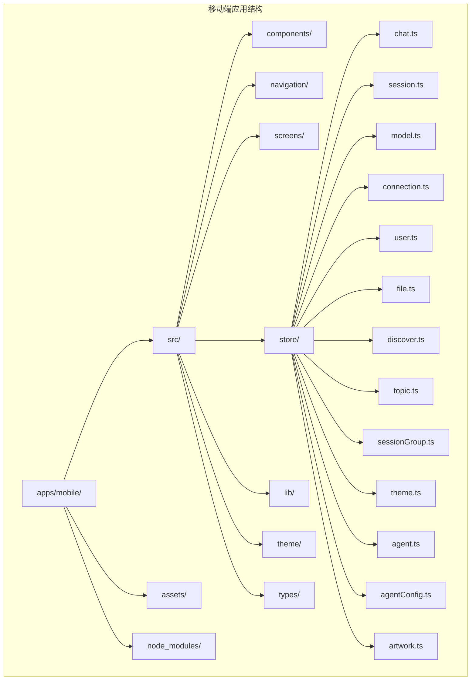

**图表来源**
- [apps/mobile/package.json:1-50](file://apps/mobile/package.json#L1-L50)
- [apps/mobile/src/store/chat.ts:1-835](file://apps/mobile/src/store/chat.ts#L1-L835)

**章节来源**
- [apps/mobile/package.json:1-50](file://apps/mobile/package.json#L1-L50)
- [apps/mobile/src/store/chat.ts:1-835](file://apps/mobile/src/store/chat.ts#L1-L835)

## 核心组件

移动端状态管理系统基于 Zustand 库构建，包含以下核心 store 组件：

### 主要依赖组件

| 组件名称 | 功能描述 | 依赖包 |
|---------|----------|--------|
| Zustand | 状态管理库 | zustand@5.0.11 |
| AsyncStorage | 本地存储 | @react-native-async-storage/async-storage@2.2.0 |
| React Navigation | 导航管理 | @react-navigation/native-stack@7.14.4 |
| Expo | 跨平台框架 | expo~55.0.5 |

### 状态管理架构

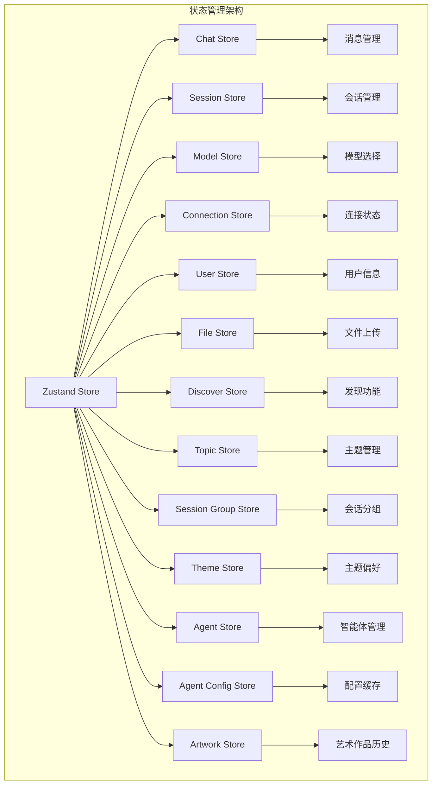

**图表来源**
- [apps/mobile/src/store/chat.ts:183-538](file://apps/mobile/src/store/chat.ts#L183-L538)
- [apps/mobile/src/store/session.ts:41-253](file://apps/mobile/src/store/session.ts#L41-L253)

**章节来源**
- [apps/mobile/package.json:12-42](file://apps/mobile/package.json#L12-L42)
- [apps/mobile/src/store/chat.ts:183-538](file://apps/mobile/src/store/chat.ts#L183-L538)

## 架构概览

移动端状态管理系统采用模块化设计，每个 store 都专注于特定的功能领域：

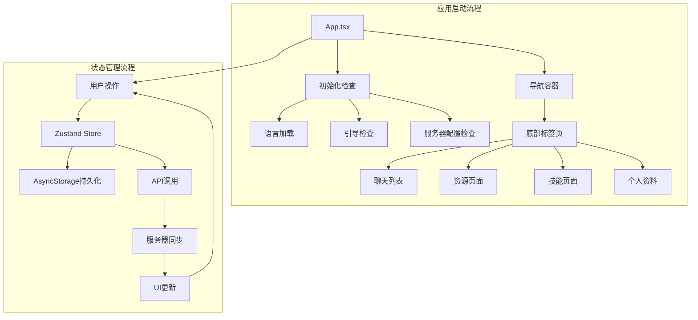

**图表来源**
- [apps/mobile/App.tsx:35-93](file://apps/mobile/App.tsx#L35-L93)
- [apps/mobile/src/navigation/index.tsx:73-168](file://apps/mobile/src/navigation/index.tsx#L73-L168)

**章节来源**
- [apps/mobile/App.tsx:35-112](file://apps/mobile/App.tsx#L35-L112)
- [apps/mobile/src/navigation/index.tsx:174-318](file://apps/mobile/src/navigation/index.tsx#L174-L318)

## 详细组件分析

### 聊天状态管理 (Chat Store)

聊天状态管理是移动端最复杂的状态管理模块，负责处理消息流、AI 交互和实时更新：

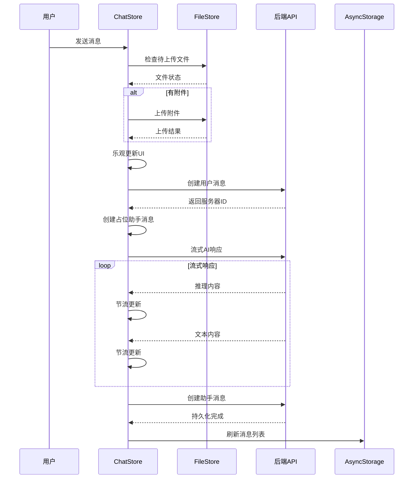

**图表来源**
- [apps/mobile/src/store/chat.ts:222-538](file://apps/mobile/src/store/chat.ts#L222-L538)
- [apps/mobile/src/store/file.ts:26-95](file://apps/mobile/src/store/file.ts#L26-L95)

#### 关键特性

1. **流式响应处理**: 支持 AI 生成的实时流式响应
2. **节流优化**: 使用 100ms 节流避免过度重渲染
3. **乐观更新**: 先更新本地状态再同步到服务器
4. **错误处理**: 完善的错误捕获和用户反馈机制

**章节来源**
- [apps/mobile/src/store/chat.ts:145-538](file://apps/mobile/src/store/chat.ts#L145-L538)

### 会话状态管理 (Session Store)

会话状态管理负责聊天会话的生命周期管理：

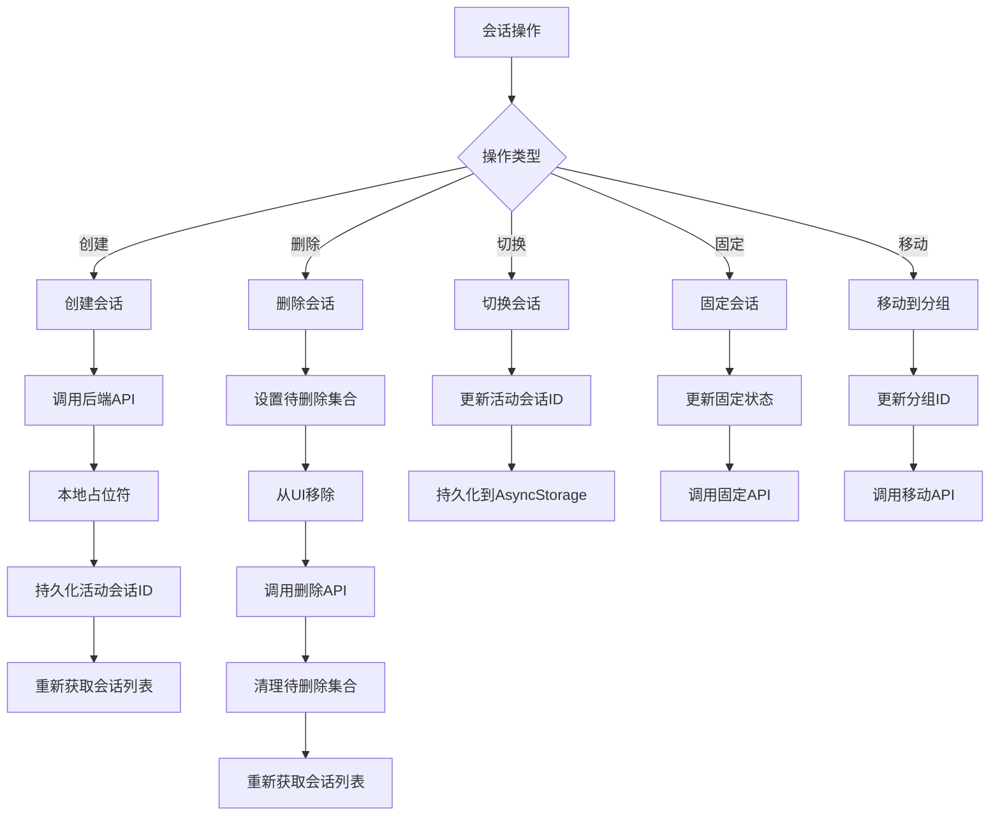

**图表来源**
- [apps/mobile/src/store/session.ts:48-253](file://apps/mobile/src/store/session.ts#L48-L253)

**章节来源**
- [apps/mobile/src/store/session.ts:18-253](file://apps/mobile/src/store/session.ts#L18-L253)

### 模型选择状态管理 (Model Store)

模型选择状态管理提供 AI 模型和提供商的选择功能：

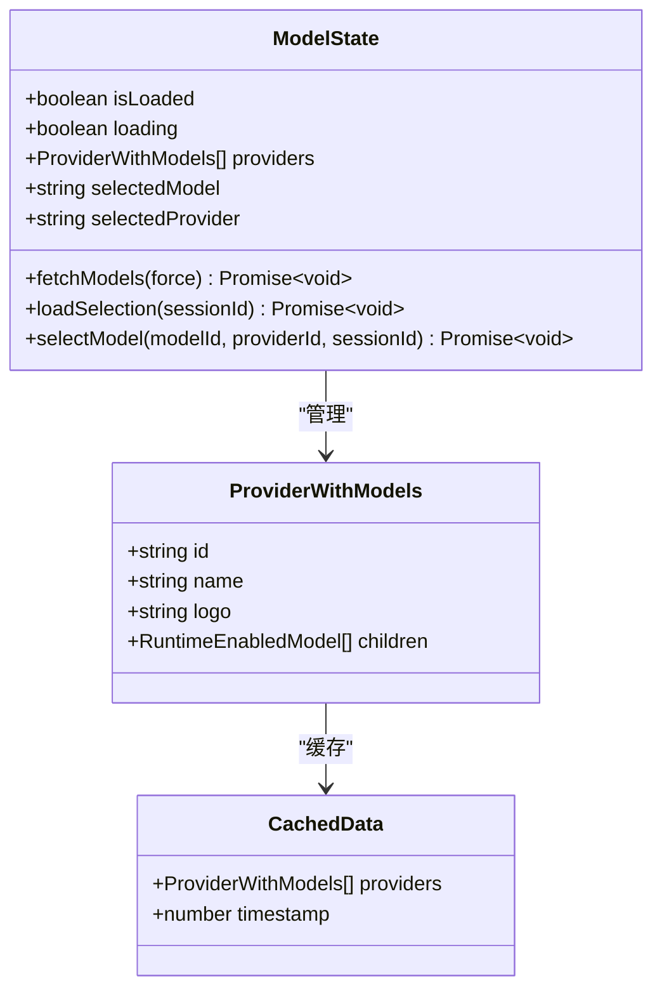

**图表来源**
- [apps/mobile/src/store/model.ts:42-188](file://apps/mobile/src/store/model.ts#L42-L188)

**章节来源**
- [apps/mobile/src/store/model.ts:1-189](file://apps/mobile/src/store/model.ts#L1-L189)

### 连接状态管理 (Connection Store)

连接状态管理监控服务器连接状态：

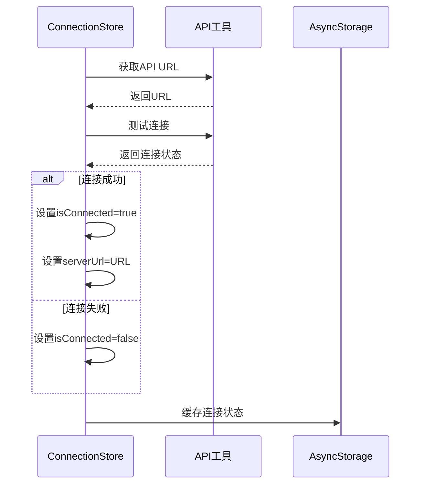

**图表来源**
- [apps/mobile/src/store/connection.ts:23-38](file://apps/mobile/src/store/connection.ts#L23-L38)

**章节来源**
- [apps/mobile/src/store/connection.ts:1-39](file://apps/mobile/src/store/connection.ts#L1-L39)

### 用户状态管理 (User Store)

用户状态管理处理用户个人信息：

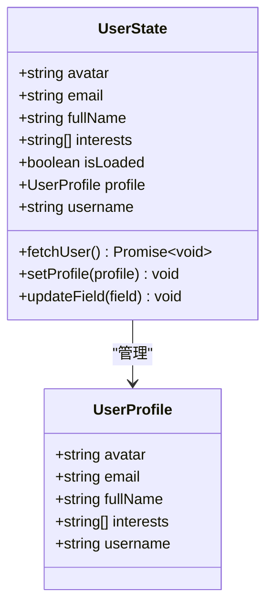

**图表来源**
- [apps/mobile/src/store/user.ts:6-73](file://apps/mobile/src/store/user.ts#L6-L73)

**章节来源**
- [apps/mobile/src/store/user.ts:1-73](file://apps/mobile/src/store/user.ts#L1-L73)

## 新增模块详解

### 主题状态管理 (Theme Store)

**更新** 新增主题状态管理模块，提供完整的主题偏好和颜色方案管理功能。

主题状态管理支持三种主题偏好模式：浅色、深色和系统跟随，并提供颜色方案选择功能：

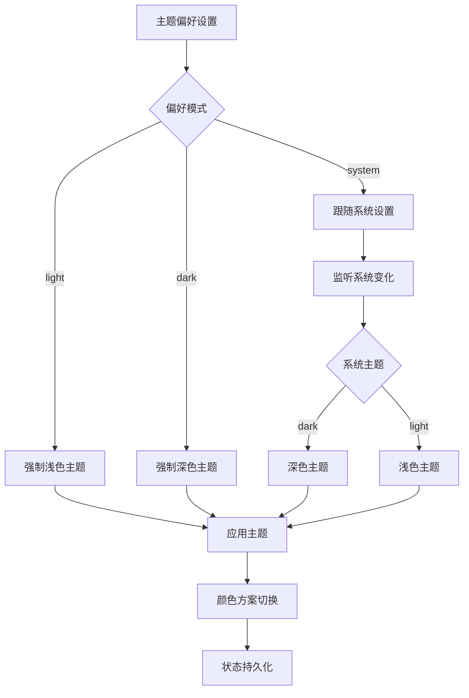

**图表来源**
- [apps/mobile/src/store/theme.ts:17-56](file://apps/mobile/src/store/theme.ts#L17-L56)

#### 核心功能

1. **多模式主题支持**: 支持 light、dark、system 三种主题模式
2. **系统主题跟随**: 自动监听系统主题变化并同步
3. **颜色方案管理**: 支持多种预设颜色方案
4. **状态持久化**: 使用 AsyncStorage 保存用户偏好设置

**章节来源**
- [apps/mobile/src/store/theme.ts:1-81](file://apps/mobile/src/store/theme.ts#L1-L81)

### 智能体状态管理 (Agent Store)

**更新** 新增智能体状态管理模块，提供智能体的完整生命周期管理。

智能体状态管理支持智能体的创建、更新、删除、关联会话等操作：

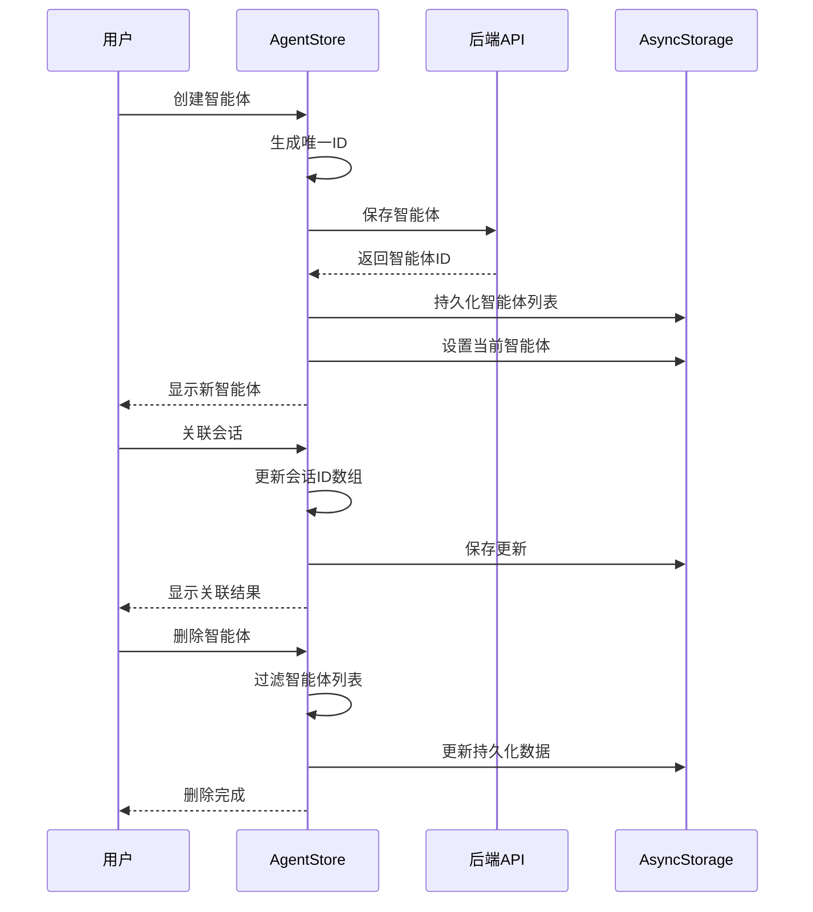

**图表来源**
- [apps/mobile/src/store/agent.ts:63-162](file://apps/mobile/src/store/agent.ts#L63-L162)

#### 核心功能

1. **智能体生命周期管理**: 支持创建、更新、删除智能体
2. **当前智能体管理**: 维护用户当前使用的智能体状态
3. **会话关联管理**: 支持智能体与聊天会话的关联和分离
4. **数据持久化**: 使用 AsyncStorage 保存智能体数据

**章节来源**
- [apps/mobile/src/store/agent.ts:1-163](file://apps/mobile/src/store/agent.ts#L1-L163)

### 智能体配置缓存 (Agent Config Store)

**更新** 新增智能体配置缓存模块，提供会话级别的配置缓存功能。

智能体配置缓存模块提供配置的获取、缓存和失效管理：

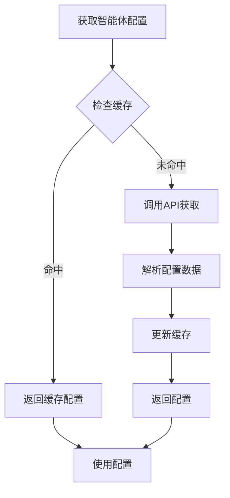

**图表来源**
- [apps/mobile/src/store/agentConfig.ts:41-74](file://apps/mobile/src/store/agentConfig.ts#L41-L74)

#### 核心功能

1. **配置缓存管理**: 缓存会话级别的智能体配置
2. **API集成**: 与后端智能体配置API集成
3. **缓存失效**: 支持手动失效和自动更新
4. **乐观更新**: 支持配置修改后的乐观更新

**章节来源**
- [apps/mobile/src/store/agentConfig.ts:1-90](file://apps/mobile/src/store/agentConfig.ts#L1-L90)

### 艺术作品历史管理 (Artwork Store)

**更新** 新增艺术作品历史管理模块，提供图像生成历史的本地存储功能。

艺术作品历史管理模块专门用于管理图像生成的历史记录：

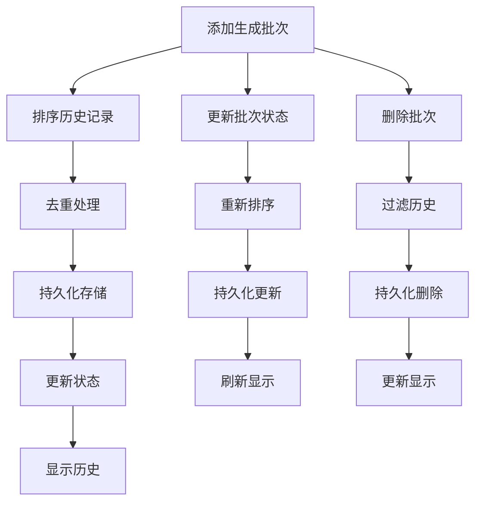

**图表来源**
- [apps/mobile/src/store/artwork.ts:56-83](file://apps/mobile/src/store/artwork.ts#L56-L83)

#### 核心功能

1. **生成历史管理**: 本地存储图像生成历史
2. **批次管理**: 支持批次的添加、更新、删除
3. **时间排序**: 按创建或更新时间排序显示
4. **最佳努力持久化**: 即使存储失败也不影响主要功能

**章节来源**
- [apps/mobile/src/store/artwork.ts:1-85](file://apps/mobile/src/store/artwork.ts#L1-L85)

## 依赖关系分析

**更新** 状态管理系统现已扩展为包含多个新增模块的完整架构。

移动端状态管理系统具有清晰的依赖层次结构：

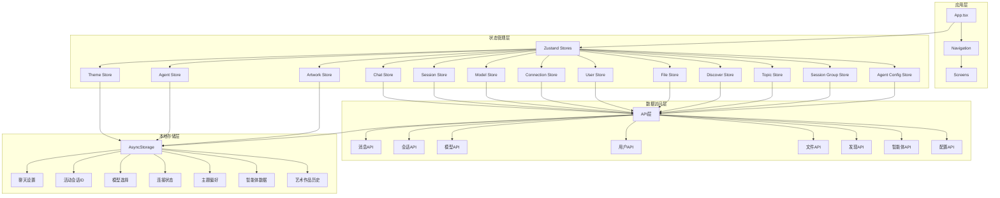

**图表来源**
- [apps/mobile/App.tsx:1-112](file://apps/mobile/App.tsx#L1-L112)
- [apps/mobile/src/store/chat.ts:9-18](file://apps/mobile/src/store/chat.ts#L9-L18)

**章节来源**
- [apps/mobile/App.tsx:1-112](file://apps/mobile/App.tsx#L1-L112)
- [apps/mobile/src/store/chat.ts:9-18](file://apps/mobile/src/store/chat.ts#L9-L18)

## 性能考虑

**更新** 新增模块带来了更多的性能优化需求和考虑因素。

移动端状态管理系统在性能方面采用了多项优化策略：

### 状态更新优化

1. **节流机制**: 聊天消息流使用 100ms 节流，避免过度重渲染
2. **乐观更新**: 先更新本地状态，提升用户体验
3. **批量操作**: 使用对象展开运算符进行状态更新
4. **缓存策略**: 智能体配置和模型数据使用缓存机制

### 存储优化

1. **缓存策略**: 模型数据缓存 10 分钟，智能体配置按需缓存
2. **增量更新**: 只更新变化的部分状态
3. **异步操作**: 所有网络请求都是异步执行
4. **最佳努力持久化**: 艺术作品历史即使失败也不影响主流程

### 内存管理

1. **及时清理**: 流式响应结束后清理临时状态
2. **条件更新**: 只在必要时触发状态更新
3. **资源释放**: 及时释放 AbortController 和定时器
4. **缓存清理**: 定期清理过期的缓存数据

### 新增模块的性能考虑

1. **主题切换优化**: 主题状态使用系统监听器，避免频繁状态更新
2. **智能体数据管理**: 使用 AsyncStorage 进行本地持久化，减少网络请求
3. **配置缓存策略**: 智能体配置使用内存缓存和API双重保障
4. **历史数据管理**: 艺术作品历史使用排序算法优化显示性能

## 故障排除指南

**更新** 新增模块带来了更多可能的故障场景和解决方案。

### 常见问题及解决方案

#### 连接问题

| 问题症状 | 可能原因 | 解决方案 |
|----------|----------|----------|
| 无法连接服务器 | 网络配置错误 | 检查服务器URL配置 |
| 连接不稳定 | 网络波动 | 实施重连机制 |
| 离线模式异常 | AsyncStorage损坏 | 清除应用缓存 |

#### 聊天功能问题

| 问题症状 | 可能原因 | 解决方案 |
|----------|----------|----------|
| 消息发送失败 | 网络中断 | 检查网络连接状态 |
| 流式响应卡顿 | 网络延迟 | 实施超时机制 |
| 附件上传失败 | 存储权限问题 | 检查文件权限设置 |

#### 状态同步问题

| 问题症状 | 可能原因 | 解决方案 |
|----------|----------|----------|
| 状态不同步 | 异步操作竞态 | 使用状态锁机制 |
| 数据丢失 | AsyncStorage异常 | 实施数据恢复机制 |
| UI不更新 | Zustand订阅失效 | 检查Zustand订阅 |

#### 新增模块问题

| 问题症状 | 可能原因 | 解决方案 |
|----------|----------|----------|
| 主题切换异常 | 系统监听器失效 | 重启应用或检查系统设置 |
| 智能体数据丢失 | AsyncStorage损坏 | 清除应用缓存或检查存储权限 |
| 配置缓存错误 | API响应异常 | 清除缓存或检查网络连接 |
| 艺术作品历史异常 | 存储格式错误 | 清理历史数据或检查数据完整性 |

**章节来源**
- [apps/mobile/src/store/chat.ts:514-538](file://apps/mobile/src/store/chat.ts#L514-L538)
- [apps/mobile/src/store/connection.ts:28-37](file://apps/mobile/src/store/connection.ts#L28-L37)

## 结论

**更新** LobeHub 移动端状态管理系统经过重大重构，现已发展为功能完整、模块化的状态管理架构。

LobeHub 移动端状态管理系统展现了现代 React Native 应用的最佳实践：

### 主要优势

1. **模块化设计**: 每个 store 专注于单一职责，便于维护和测试
2. **性能优化**: 采用多种优化策略确保流畅的用户体验
3. **错误处理**: 完善的错误捕获和用户反馈机制
4. **扩展性**: 清晰的架构为未来功能扩展奠定基础
5. **主题管理**: 完整的主题系统支持用户个性化设置
6. **智能体管理**: 专业的智能体生命周期管理功能
7. **配置缓存**: 高效的配置缓存和同步机制
8. **历史管理**: 专门的艺术作品历史管理功能

### 技术亮点

- **Zustand 的简洁性**: 相比 Redux 更加轻量级和易用
- **AsyncStorage 集成**: 有效的本地数据持久化策略
- **流式响应处理**: 优雅的实时通信实现
- **乐观更新**: 提升用户交互体验
- **主题系统**: 完整的浅色/深色主题支持
- **智能体架构**: 专业化的智能体管理功能
- **缓存策略**: 多层次的数据缓存机制
- **历史记录**: 专门的生成历史管理

### 改进建议

1. **类型安全**: 可以进一步增强 TypeScript 类型定义
2. **测试覆盖**: 增加单元测试和集成测试
3. **性能监控**: 添加性能指标监控
4. **状态快照**: 实现状态备份和恢复功能
5. **模块间通信**: 建立更清晰的模块间通信机制
6. **错误边界**: 增强错误处理和恢复能力

该状态管理系统为移动端应用提供了坚实的基础，通过合理的架构设计和性能优化，确保了良好的用户体验和系统的可维护性。新增的主题管理、智能体管理和配置缓存等功能模块进一步增强了应用的专业性和用户体验。