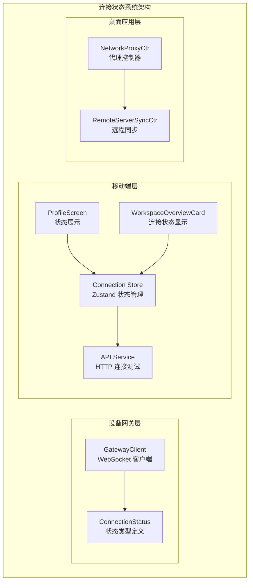
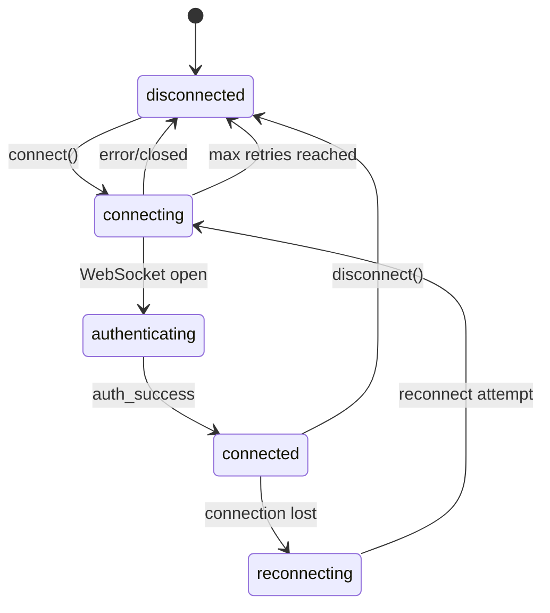
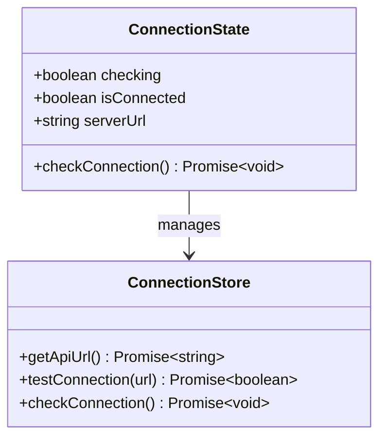
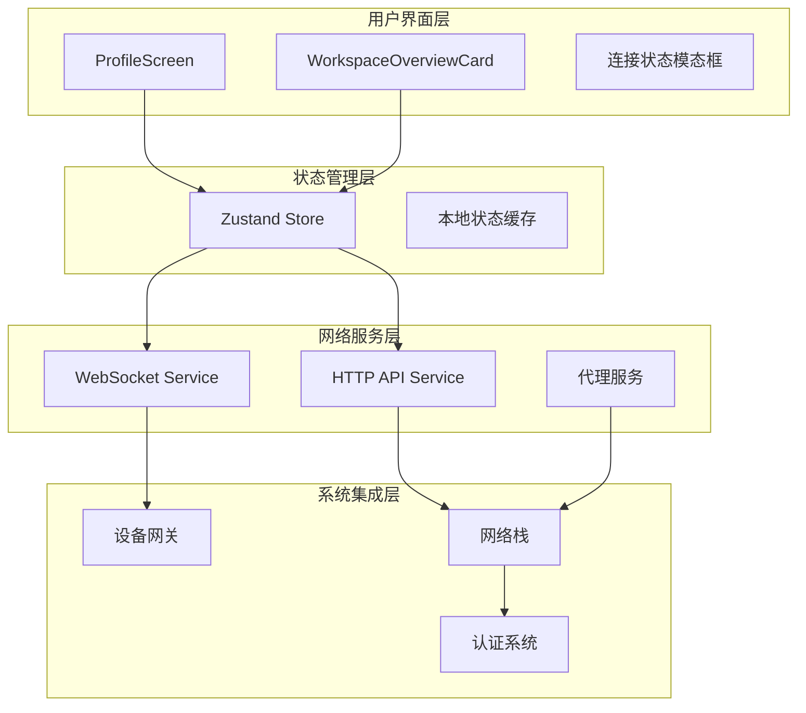
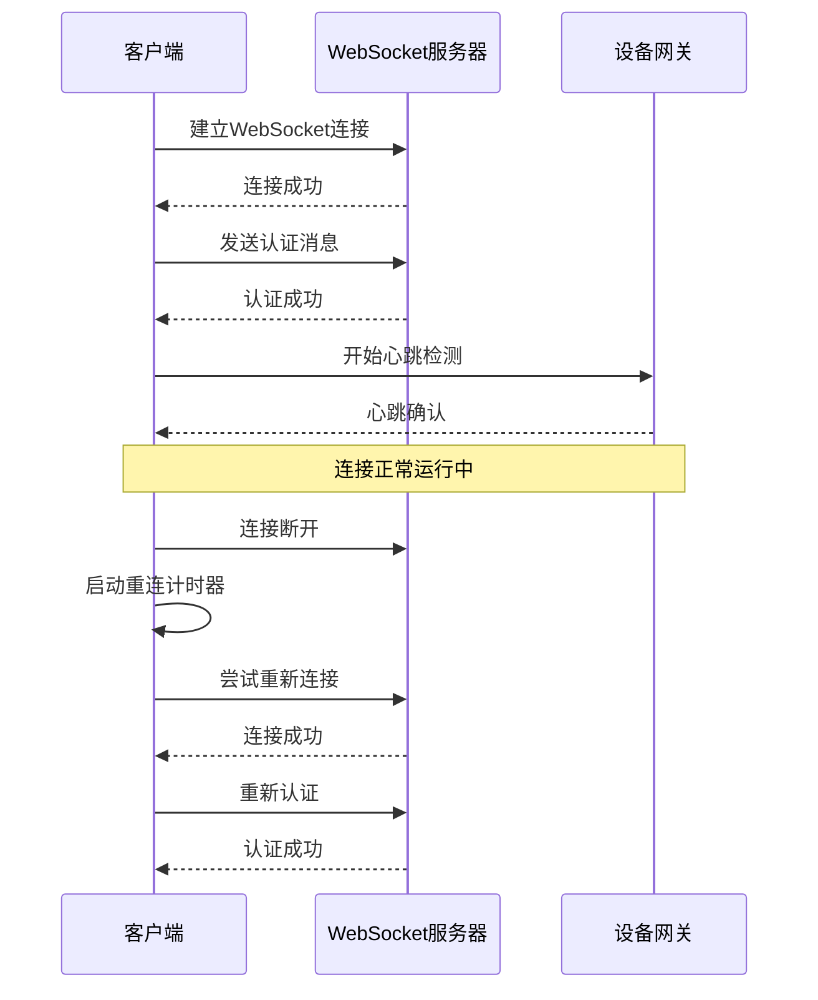
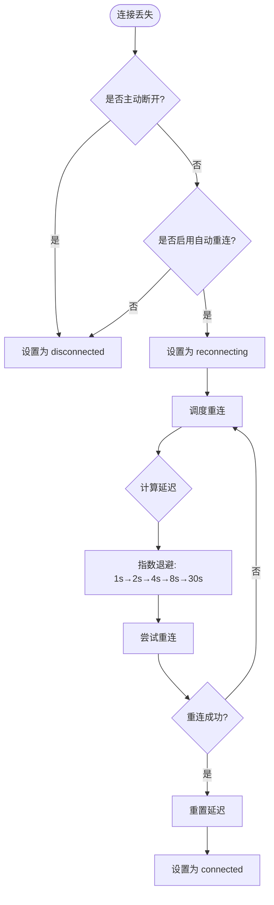
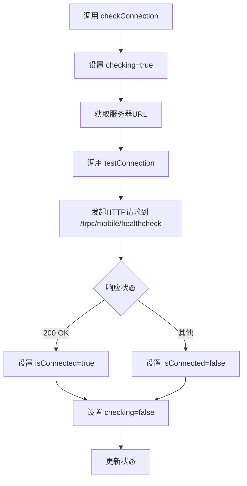
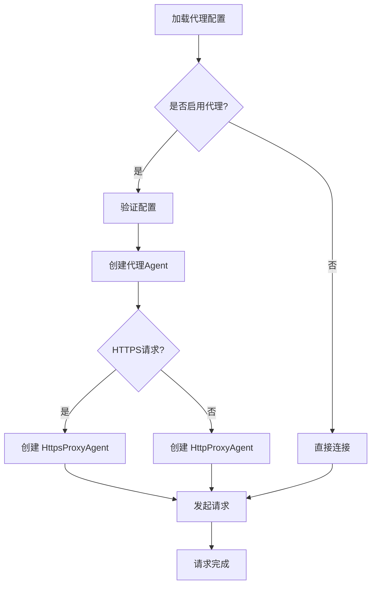

# 连接状态系统

<cite>
**本文档引用的文件**
- [packages/device-gateway-client/src/client.ts](file://packages/device-gateway-client/src/client.ts)
- [packages/device-gateway-client/src/types.ts](file://packages/device-gateway-client/src/types.ts)
- [apps/mobile/src/store/connection.ts](file://apps/mobile/src/store/connection.ts)
- [apps/mobile/src/lib/api.ts](file://apps/mobile/src/lib/api.ts)
- [apps/mobile/src/screens/ProfileScreen.tsx](file://apps/mobile/src/screens/ProfileScreen.tsx)
- [apps/mobile/src/components/ui/WorkspaceOverviewCard.tsx](file://apps/mobile/src/components/ui/WorkspaceOverviewCard.tsx)
- [apps/desktop/src/main/controllers/RemoteServerSyncCtr.ts](file://apps/desktop/src/main/controllers/RemoteServerSyncCtr.ts)
</cite>

## 目录
1. [简介](#简介)
2. [项目结构](#项目结构)
3. [核心组件](#核心组件)
4. [架构概览](#架构概览)
5. [详细组件分析](#详细组件分析)
6. [依赖关系分析](#依赖关系分析)
7. [性能考虑](#性能考虑)
8. [故障排除指南](#故障排除指南)
9. [结论](#结论)

## 简介

连接状态系统是 LobeHub 项目中的关键基础设施，负责管理和监控设备与服务器之间的连接状态。该系统提供了实时的连接状态跟踪、自动重连机制、心跳检测以及用户界面的状态反馈。

系统主要包含三个核心部分：
- **设备网关客户端**：负责 WebSocket 连接管理和状态维护
- **移动应用连接存储**：提供服务器可达性检查功能
- **桌面应用网络代理**：处理复杂的网络连接配置

## 项目结构

连接状态系统在项目中的组织结构如下：



**图表来源**
- [packages/device-gateway-client/src/client.ts:51-332](file://packages/device-gateway-client/src/client.ts#L51-L332)
- [apps/mobile/src/store/connection.ts:1-39](file://apps/mobile/src/store/connection.ts#L1-L39)

**章节来源**
- [packages/device-gateway-client/src/client.ts:1-332](file://packages/device-gateway-client/src/client.ts#L1-L332)
- [apps/mobile/src/store/connection.ts:1-39](file://apps/mobile/src/store/connection.ts#L1-L39)

## 核心组件

### 设备网关客户端 (GatewayClient)

GatewayClient 是连接状态系统的核心组件，负责管理 WebSocket 连接的完整生命周期。

**主要特性：**
- **五种连接状态**：connecting、connected、authenticating、disconnected、reconnecting
- **自动重连机制**：指数退避算法，最大延迟 30 秒
- **心跳检测**：每 30 秒发送一次心跳包
- **事件驱动架构**：通过 EventEmitter 提供丰富的事件回调

**状态转换流程：**



**图表来源**
- [packages/device-gateway-client/src/client.ts:298-305](file://packages/device-gateway-client/src/client.ts#L298-L305)
- [packages/device-gateway-client/src/types.ts:104-109](file://packages/device-gateway-client/src/types.ts#L104-L109)

### 移动应用连接存储

移动应用使用 Zustand 状态管理库实现连接状态存储，提供实时的服务器可达性检查。

**核心功能：**
- **异步连接检查**：通过 HTTP 请求测试服务器可达性
- **状态持久化**：跟踪连接状态和服务器 URL
- **并发控制**：防止重复的连接检查请求

**状态管理结构：**



**图表来源**
- [apps/mobile/src/store/connection.ts:12-21](file://apps/mobile/src/store/connection.ts#L12-L21)

**章节来源**
- [apps/mobile/src/store/connection.ts:1-39](file://apps/mobile/src/store/connection.ts#L1-L39)
- [apps/mobile/src/lib/api.ts:66-77](file://apps/mobile/src/lib/api.ts#L66-L77)

## 架构概览

连接状态系统的整体架构采用分层设计，确保各组件职责清晰且松耦合。



**图表来源**
- [apps/mobile/src/screens/ProfileScreen.tsx:30-68](file://apps/mobile/src/screens/ProfileScreen.tsx#L30-L68)
- [apps/desktop/src/main/controllers/RemoteServerSyncCtr.ts:200-223](file://apps/desktop/src/main/controllers/RemoteServerSyncCtr.ts#L200-L223)

## 详细组件分析

### 设备网关客户端详细分析

GatewayClient 实现了完整的 WebSocket 连接生命周期管理，包括连接建立、认证、心跳维护和自动重连。

**连接流程序列图：**



**图表来源**
- [packages/device-gateway-client/src/client.ts:99-156](file://packages/device-gateway-client/src/client.ts#L99-L156)
- [packages/device-gateway-client/src/client.ts:177-249](file://packages/device-gateway-client/src/client.ts#L177-L249)

**重连机制实现：**



**图表来源**
- [packages/device-gateway-client/src/client.ts:272-289](file://packages/device-gateway-client/src/client.ts#L272-L289)

**章节来源**
- [packages/device-gateway-client/src/client.ts:256-296](file://packages/device-gateway-client/src/client.ts#L256-L296)
- [packages/device-gateway-client/src/types.ts:104-122](file://packages/device-gateway-client/src/types.ts#L104-L122)

### 移动应用连接状态管理

移动应用的连接状态管理基于 Zustand 实现，提供简洁高效的响应式状态更新。

**连接检查流程：**



**图表来源**
- [apps/mobile/src/store/connection.ts:28-37](file://apps/mobile/src/store/connection.ts#L28-L37)

**用户界面集成：**

移动应用通过多个组件展示连接状态信息：

1. **ProfileScreen**：在屏幕获得焦点时自动检查连接状态
2. **WorkspaceOverviewCard**：显示连接状态指示器和文本
3. **ProviderDetailScreen**：提供手动检查连接的功能

**章节来源**
- [apps/mobile/src/store/connection.ts:1-39](file://apps/mobile/src/store/connection.ts#L1-L39)
- [apps/mobile/src/screens/ProfileScreen.tsx:63-68](file://apps/mobile/src/screens/ProfileScreen.tsx#L63-L68)
- [apps/mobile/src/components/ui/WorkspaceOverviewCard.tsx:64-71](file://apps/mobile/src/components/ui/WorkspaceOverviewCard.tsx#L64-L71)

### 桌面应用网络代理集成

桌面应用实现了复杂的网络代理配置，支持多种代理协议和认证方式。

**代理配置流程：**



**图表来源**
- [apps/desktop/src/main/controllers/RemoteServerSyncCtr.ts:200-223](file://apps/desktop/src/main/controllers/RemoteServerSyncCtr.ts#L200-L223)

**章节来源**
- [apps/desktop/src/main/controllers/RemoteServerSyncCtr.ts:1-225](file://apps/desktop/src/main/controllers/RemoteServerSyncCtr.ts#L1-L225)

## 依赖关系分析

连接状态系统的依赖关系体现了清晰的分层架构和模块化设计。

```mermaid
graph TB
subgraph "外部依赖"
WebSocket[ws 模块]
EventEmitter[node:events]
AsyncStorage[@react-native-async-storage]
Zustand[zustand]
end
subgraph "内部模块"
GatewayClient[GatewayClient]
ConnectionStore[Connection Store]
APIService[API Service]
WorkspaceCard[Workspace Card]
end
subgraph "类型定义"
ConnectionStatus[ConnectionStatus 类型]
GatewayClientEvents[事件类型]
ClientMessage[客户端消息]
ServerMessage[服务器消息]
end
GatewayClient --> WebSocket
GatewayClient --> EventEmitter
ConnectionStore --> AsyncStorage
ConnectionStore --> Zustand
APIService --> AsyncStorage
WorkspaceCard --> ConnectionStore
GatewayClient --> ConnectionStatus
GatewayClient --> GatewayClientEvents
GatewayClient --> ClientMessage
GatewayClient --> ServerMessage
```

**图表来源**
- [packages/device-gateway-client/src/client.ts:1-16](file://packages/device-gateway-client/src/client.ts#L1-L16)
- [packages/device-gateway-client/src/types.ts:1-123](file://packages/device-gateway-client/src/types.ts#L1-L123)

**依赖特点：**
- **最小外部依赖**：仅依赖必要的 Node.js 内置模块和轻量级第三方库
- **类型安全**：完整的 TypeScript 类型定义确保编译时安全性
- **模块化设计**：各组件职责明确，便于测试和维护

**章节来源**
- [packages/device-gateway-client/src/client.ts:1-73](file://packages/device-gateway-client/src/client.ts#L1-L73)
- [packages/device-gateway-client/src/types.ts:1-123](file://packages/device-gateway-client/src/types.ts#L1-L123)

## 性能考虑

连接状态系统在设计时充分考虑了性能优化和资源管理。

**性能优化策略：**

1. **内存管理**
   - 及时清理定时器和事件监听器
   - 使用弱引用避免循环引用
   - 合理的垃圾回收策略

2. **网络优化**
   - 指数退避重连算法减少服务器压力
   - 心跳检测间隔优化为 30 秒
   - 连接池复用和连接复用

3. **状态更新优化**
   - 使用浅比较避免不必要的渲染
   - 批量状态更新减少重绘次数
   - 异步操作的并发控制

4. **资源限制**
   - 最大重连延迟限制为 30 秒
   - 连接超时时间合理设置
   - 内存使用监控和告警

## 故障排除指南

### 常见问题及解决方案

**连接状态异常**
- **症状**：连接状态长时间停留在 connecting 或 reconnecting
- **原因**：网络配置错误、认证失败、服务器不可达
- **解决**：检查网络代理设置、验证认证令牌、确认服务器状态

**心跳检测失败**
- **症状**：频繁的心跳超时和重连
- **原因**：网络不稳定、防火墙阻断、服务器负载过高
- **解决**：优化网络环境、调整防火墙规则、扩容服务器资源

**状态更新延迟**
- **症状**：UI 状态与实际连接状态不一致
- **原因**：异步操作竞态条件、状态更新频率过高
- **解决**：添加状态锁机制、优化状态更新策略

**章节来源**
- [packages/device-gateway-client/src/client.ts:251-254](file://packages/device-gateway-client/src/client.ts#L251-L254)
- [packages/device-gateway-client/src/client.ts:466-481](file://packages/device-gateway-client/src/client.ts#L466-L481)

### 调试工具和方法

1. **日志记录**：详细的连接状态变更日志
2. **状态监控**：实时监控连接状态和性能指标
3. **网络诊断**：内置的网络连通性测试工具
4. **错误追踪**：完整的错误堆栈和上下文信息

## 结论

连接状态系统通过精心设计的架构和实现，为 LobeHub 项目提供了可靠、高效的连接管理能力。系统的主要优势包括：

1. **可靠性**：完善的错误处理和自动重连机制
2. **可扩展性**：模块化的架构设计支持功能扩展
3. **用户体验**：实时的状态反馈和直观的用户界面
4. **性能优化**：合理的资源管理和性能优化策略

该系统不仅满足了当前的功能需求，还为未来的功能扩展和技术演进奠定了坚实的基础。通过持续的优化和完善，连接状态系统将继续为用户提供稳定可靠的连接体验。