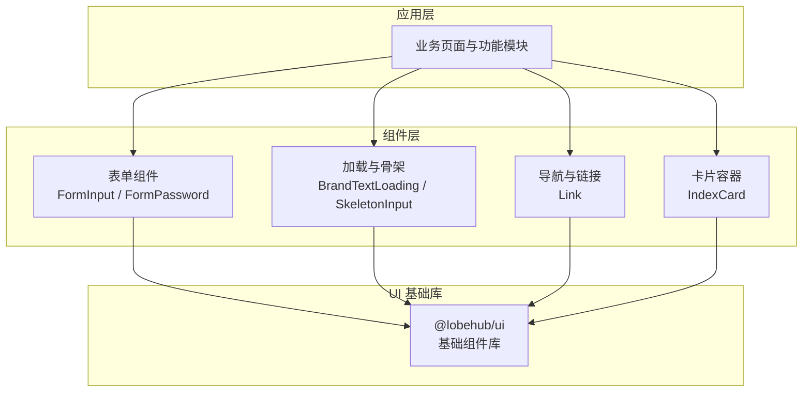
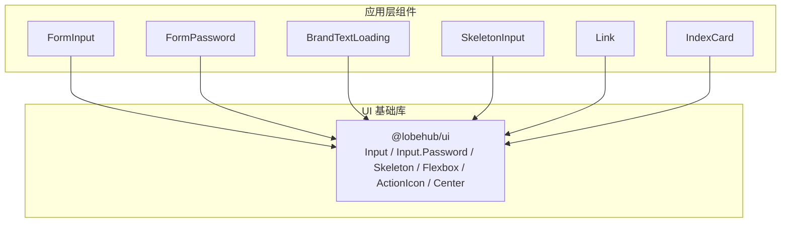
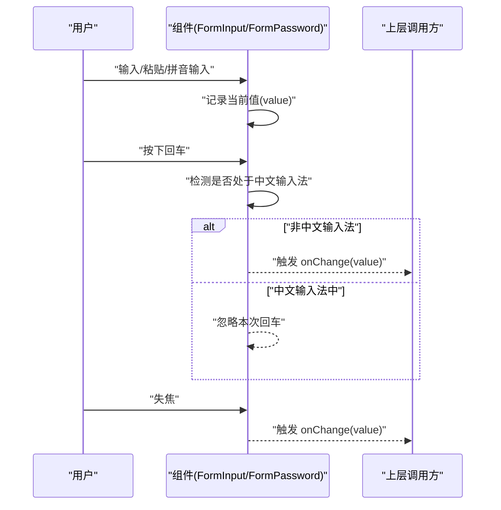
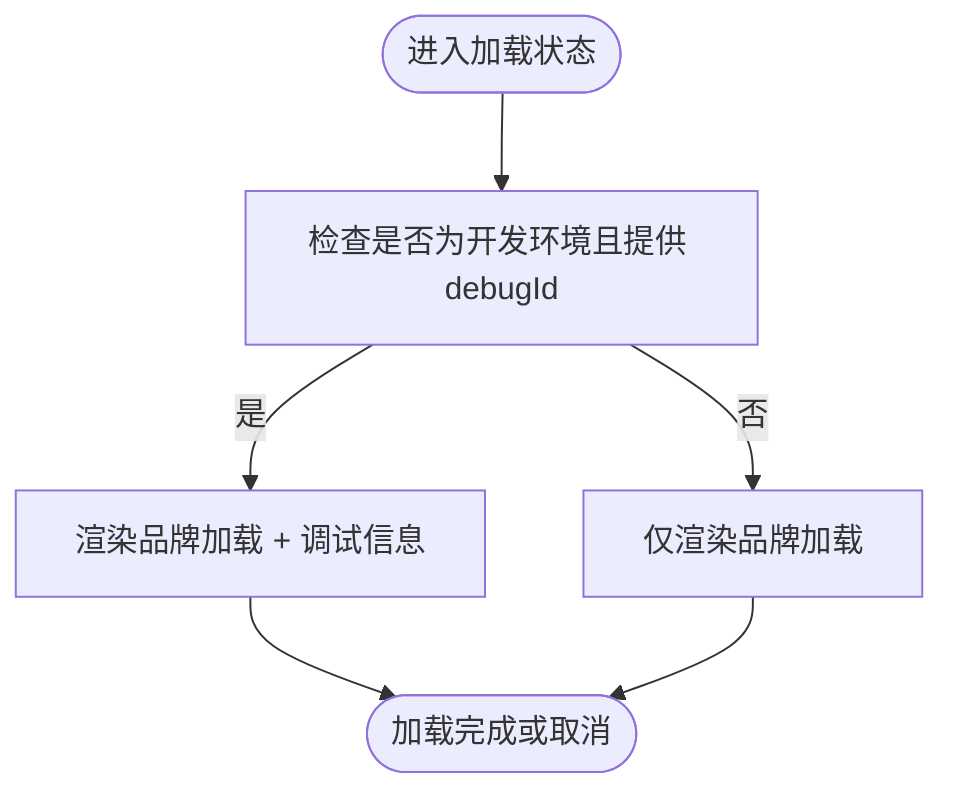
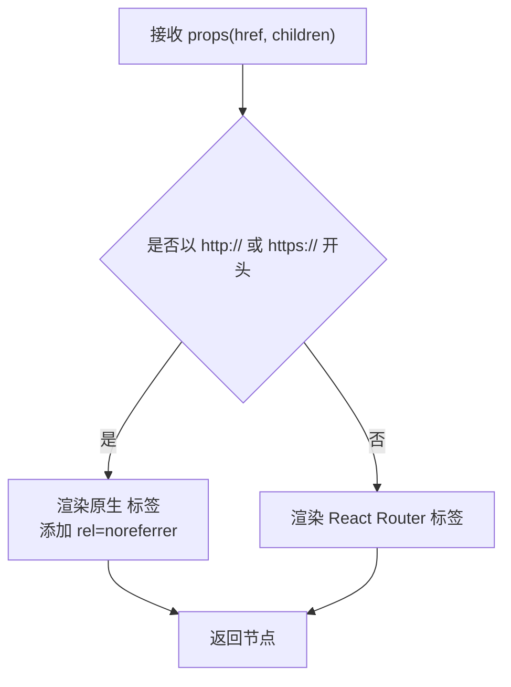
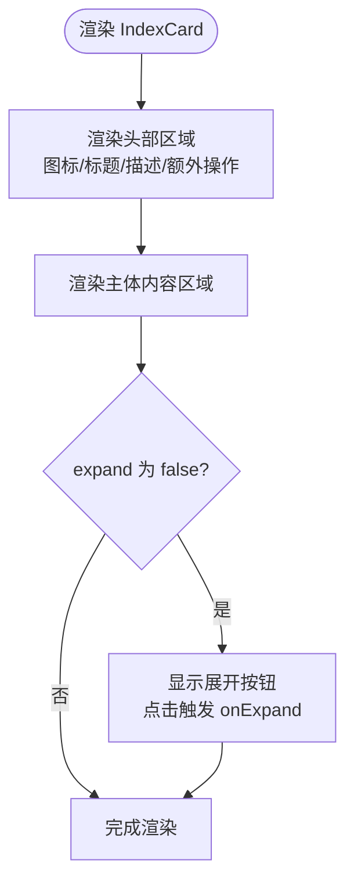
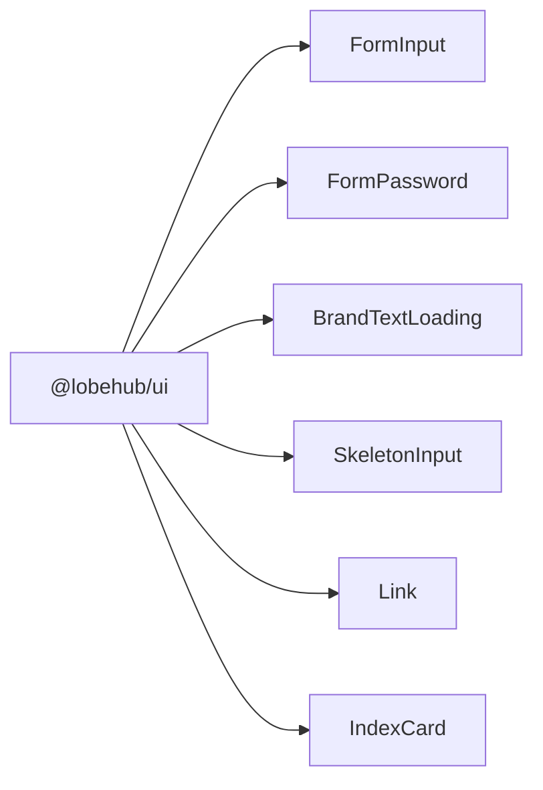

# UI 基础组件

<cite>
**本文引用的文件**
- [FormInput.tsx](file://src/components/FormInput/FormInput.tsx)
- [FormPassword.tsx](file://src/components/FormInput/FormPassword.tsx)
- [FormInput/index.ts](file://src/components/FormInput/index.ts)
- [BrandTextLoading/index.tsx](file://src/components/Loading/BrandTextLoading/index.tsx)
- [SkeletonInput.tsx](file://src/components/Skeleton/SkeletonInput.tsx)
- [Link.tsx](file://src/components/Link.tsx)
- [IndexCard/index.tsx](file://src/components/IndexCard/index.tsx)
- [package.json](file://package.json)
</cite>

## 目录
1. [简介](#简介)
2. [项目结构](#项目结构)
3. [核心组件](#核心组件)
4. [架构总览](#架构总览)
5. [组件详解](#组件详解)
6. [依赖分析](#依赖分析)
7. [性能考量](#性能考量)
8. [故障排查指南](#故障排查指南)
9. [结论](#结论)
10. [附录](#附录)

## 简介
本文件面向 LobeHub 项目的前端开发者与产品设计师，系统化梳理并说明仓库内可复用的基础 UI 组件库与通用 UI 模式，涵盖输入类（表单输入、密码输入）、加载与骨架屏、链接导航、卡片容器等常用组件。文档重点阐述：
- 设计理念与实现细节
- 属性配置、事件处理、样式定制与主题集成
- 使用场景与最佳实践
- 无障碍访问、跨浏览器兼容性与性能优化建议
- 组件间组合模式、状态管理与生命周期要点

## 项目结构
LobeHub 在应用层通过统一的 UI 能力来源（@lobehub/ui）与内部封装组件协同工作。基础组件主要位于 src/components 下，按功能域分组组织；同时通过 package.json 引入 @lobehub/ui 作为基础 UI 能力来源。

图表来源
- [package.json](file://package.json#L247-L247)
- [FormInput.tsx](file://src/components/FormInput/FormInput.tsx#L1-L2)
- [FormPassword.tsx](file://src/components/FormInput/FormPassword.tsx#L1-L2)
- [BrandTextLoading/index.tsx](file://src/components/Loading/BrandTextLoading/index.tsx#L1-L3)
- [SkeletonInput.tsx](file://src/components/Skeleton/SkeletonInput.tsx#L1-L5)
- [Link.tsx](file://src/components/Link.tsx#L1-L3)
- [IndexCard/index.tsx](file://src/components/IndexCard/index.tsx#L1-L5)

章节来源
- [package.json](file://package.json#L158-L403)

## 核心组件
本节对基础 UI 组件进行概览，说明其职责边界与典型用法。

- 表单输入组件
  - FormInput：受控输入，支持回车提交、中文输入法状态处理、失焦回调。
  - FormPassword：受控密码输入，行为与 FormInput 类似，用于安全输入场景。
- 加载与骨架
  - BrandTextLoading：品牌文本加载动画，开发环境可显示调试信息。
  - SkeletonInput：基于 @lobehub/ui 的骨架按钮，常用于占位加载。
- 导航与链接
  - Link：智能链接组件，自动区分内外链，分别使用原生 a 或路由 Link。
- 卡片容器
  - IndexCard：带标题、描述、更多操作与展开/收起控制的卡片容器，支持扩展与自定义样式。

章节来源
- [FormInput.tsx](file://src/components/FormInput/FormInput.tsx#L1-L48)
- [FormPassword.tsx](file://src/components/FormInput/FormPassword.tsx#L1-L48)
- [BrandTextLoading/index.tsx](file://src/components/Loading/BrandTextLoading/index.tsx#L1-L37)
- [SkeletonInput.tsx](file://src/components/Skeleton/SkeletonInput.tsx#L1-L6)
- [Link.tsx](file://src/components/Link.tsx#L1-L34)
- [IndexCard/index.tsx](file://src/components/IndexCard/index.tsx#L1-L146)

## 架构总览
下图展示应用层组件如何依赖 @lobehub/ui 并通过内部封装增强体验。

图表来源
- [FormInput.tsx](file://src/components/FormInput/FormInput.tsx#L1-L2)
- [FormPassword.tsx](file://src/components/FormInput/FormPassword.tsx#L1-L2)
- [BrandTextLoading/index.tsx](file://src/components/Loading/BrandTextLoading/index.tsx#L1-L3)
- [SkeletonInput.tsx](file://src/components/Skeleton/SkeletonInput.tsx#L1-L5)
- [Link.tsx](file://src/components/Link.tsx#L1-L3)
- [IndexCard/index.tsx](file://src/components/IndexCard/index.tsx#L1-L5)
- [package.json](file://package.json#L247-L247)

## 组件详解

### 表单输入组件：FormInput 与 FormPassword
- 设计理念
  - 受控组件：通过内部状态维护当前值，避免非受控输入导致的状态漂移。
  - 输入法友好：监听 composition 事件，避免中文输入过程中的误触发。
  - 提交策略：支持回车键提交（中文输入法结束时除外），以及失焦提交。
- 关键属性与事件
  - onChange：值变更回调（受控组件更新后触发）。
  - 其他透传自 @lobehub/ui 的 Input/Password 组件属性（如 size、placeholder、disabled 等）。
- 样式与主题
  - 通过 @lobehub/ui 的主题变量与 antd-style 实现一致的主题风格。
- 使用场景
  - 表单编辑、设置项修改、搜索输入等需要即时反馈与校验的场景。
- 最佳实践
  - 优先使用受控模式，避免直接操作 DOM。
  - 对于长文本或多行输入，考虑使用 TextArea 或专用编辑器。
  - 配合表单校验库（如 zod、formik）统一处理错误提示与重置逻辑。

图表来源
- [FormInput.tsx](file://src/components/FormInput/FormInput.tsx#L20-L42)
- [FormPassword.tsx](file://src/components/FormInput/FormPassword.tsx#L20-L42)

章节来源
- [FormInput.tsx](file://src/components/FormInput/FormInput.tsx#L1-L48)
- [FormPassword.tsx](file://src/components/FormInput/FormPassword.tsx#L1-L48)
- [FormInput/index.ts](file://src/components/FormInput/index.ts#L1-L4)

### 加载与骨架：BrandTextLoading 与 SkeletonInput
- 设计理念
  - BrandTextLoading：品牌化加载文案与图标，开发环境可显示调试标识，便于定位问题。
  - SkeletonInput：基于 @lobehub/ui 的骨架能力，快速渲染占位元素，提升感知性能。
- 关键属性与事件
  - BrandTextLoading：接收 debugId，在开发环境展示调试信息。
  - SkeletonInput：透传 @lobehub/ui Skeleton 的属性，如 active、block 等。
- 使用场景
  - 页面首屏加载、异步数据请求中、列表项懒加载等。
- 最佳实践
  - 合理选择骨架形状与尺寸，避免过度占用视觉资源。
  - 开发阶段开启调试标识，便于联调与性能分析。

图表来源
- [BrandTextLoading/index.tsx](file://src/components/Loading/BrandTextLoading/index.tsx#L9-L34)

章节来源
- [BrandTextLoading/index.tsx](file://src/components/Loading/BrandTextLoading/index.tsx#L1-L37)
- [SkeletonInput.tsx](file://src/components/Skeleton/SkeletonInput.tsx#L1-L6)

### 导航与链接：Link
- 设计理念
  - 智能路由：根据链接前缀自动判断外链与内链，分别使用原生 a 或 React Router Link。
  - 安全与语义：对外链添加 noreferrer，对内链使用路由跳转，保持 SPA 体验。
- 关键属性与事件
  - href：目标地址。
  - children：内容节点。
  - 其他透传自 HTML anchor 属性（如 target、rel 等）。
- 使用场景
  - 页内导航、外部站点跳转、富文本中的超链接等。
- 最佳实践
  - 外链一律使用 https 协议，确保安全。
  - 内链使用相对路径或路由参数，避免硬编码绝对 URL。

图表来源
- [Link.tsx](file://src/components/Link.tsx#L15-L31)

章节来源
- [Link.tsx](file://src/components/Link.tsx#L1-L34)

### 卡片容器：IndexCard
- 设计理念
  - 结构清晰：头部区域包含图标、标题、描述与额外操作，主体区域承载子内容。
  - 交互丰富：支持展开/收起、更多按钮、工具提示等。
  - 主题一致：通过 antd-style 的静态样式与主题变量实现统一风格。
- 关键属性与事件
  - expand：初始展开状态。
  - onExpand/onMoreClick：展开/更多按钮点击回调。
  - icon/title/desc/extra：头部内容配置。
  - 其他透传至布局容器（如 Flexbox）的属性。
- 使用场景
  - 设置面板、配置卡片、功能入口卡片等需要分组与折叠的场景。
- 最佳实践
  - 将复杂交互拆分为多个小卡片，避免单卡片过载。
  - 使用 moreTooltip 提供上下文帮助，提升可用性。

图表来源
- [IndexCard/index.tsx](file://src/components/IndexCard/index.tsx#L66-L141)

章节来源
- [IndexCard/index.tsx](file://src/components/IndexCard/index.tsx#L1-L146)

## 依赖分析
- 组件与 UI 基础库的关系
  - 所有组件均通过 @lobehub/ui 获取基础 UI 能力（如 Input、Input.Password、Skeleton、Flexbox、ActionIcon、Center 等）。
- 主题与样式
  - 通过 antd-style 的 createStaticStyles 与主题变量实现一致的视觉风格。
- 依赖来源
  - @lobehub/ui 由 package.json 中的 dependencies 字段声明。

图表来源
- [package.json](file://package.json#L247-L247)
- [FormInput.tsx](file://src/components/FormInput/FormInput.tsx#L1-L2)
- [FormPassword.tsx](file://src/components/FormInput/FormPassword.tsx#L1-L2)
- [BrandTextLoading/index.tsx](file://src/components/Loading/BrandTextLoading/index.tsx#L1-L3)
- [SkeletonInput.tsx](file://src/components/Skeleton/SkeletonInput.tsx#L1-L5)
- [Link.tsx](file://src/components/Link.tsx#L1-L3)
- [IndexCard/index.tsx](file://src/components/IndexCard/index.tsx#L1-L5)

章节来源
- [package.json](file://package.json#L158-L403)

## 性能考量
- 受控输入的节流与防抖
  - 对高频输入（如搜索）建议在上层调用处增加防抖，减少渲染压力。
- 骨架屏的合理使用
  - 骨架屏应与真实内容的尺寸匹配，避免过大造成视觉割裂。
- 图标与品牌资源
  - 品牌图片与图标建议缓存与懒加载，降低首屏阻塞。
- 渲染优化
  - 使用 memo 包裹无状态组件，避免不必要的重渲染。
  - 对长列表采用虚拟化或分页策略，减少一次性渲染量。

## 故障排查指南
- 输入法相关问题
  - 症状：中文输入过程中频繁触发 onChange。
  - 处理：确认组件已正确监听 composition 事件并在结束时更新值。
- 回车提交异常
  - 症状：回车未触发或提前触发。
  - 处理：检查输入法状态判断逻辑，确保仅在非输入法状态下触发。
- 外链安全警告
  - 症状：浏览器控制台出现安全警告。
  - 处理：确保外链使用 https，并正确添加 rel=noreferrer。
- 骨架屏不生效
  - 症状：骨架屏未显示或样式错乱。
  - 处理：检查 @lobehub/ui 版本与 antd-style 主题变量是否正确注入。

章节来源
- [FormInput.tsx](file://src/components/FormInput/FormInput.tsx#L26-L38)
- [FormPassword.tsx](file://src/components/FormInput/FormPassword.tsx#L26-L38)
- [Link.tsx](file://src/components/Link.tsx#L17-L23)

## 结论
本组件库以 @lobehub/ui 为基础，结合内部封装，提供了输入、加载、导航与卡片等高频 UI 能力。通过受控组件、输入法适配、智能路由与主题一致化，既保证了开发效率，也提升了用户体验。建议在实际业务中遵循受控模式、合理使用骨架屏、注意外链安全与性能优化，以获得稳定可靠的界面表现。

## 附录
- 组件导出与索引
  - FormInput 与 FormPassword 通过 FormInput/index.ts 统一导出，便于集中引入与维护。
- 版本与生态
  - @lobehub/ui 作为统一 UI 基础库，版本号在 package.json 中声明，升级时需关注破坏性变更与迁移指南。

章节来源
- [FormInput/index.ts](file://src/components/FormInput/index.ts#L1-L4)
- [package.json](file://package.json#L247-L247)