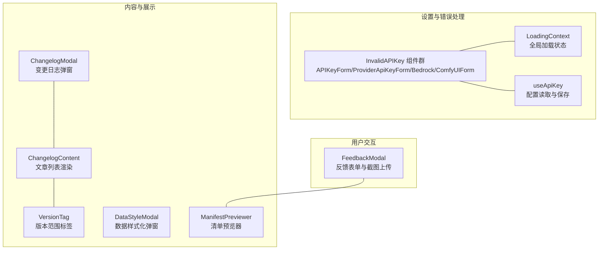
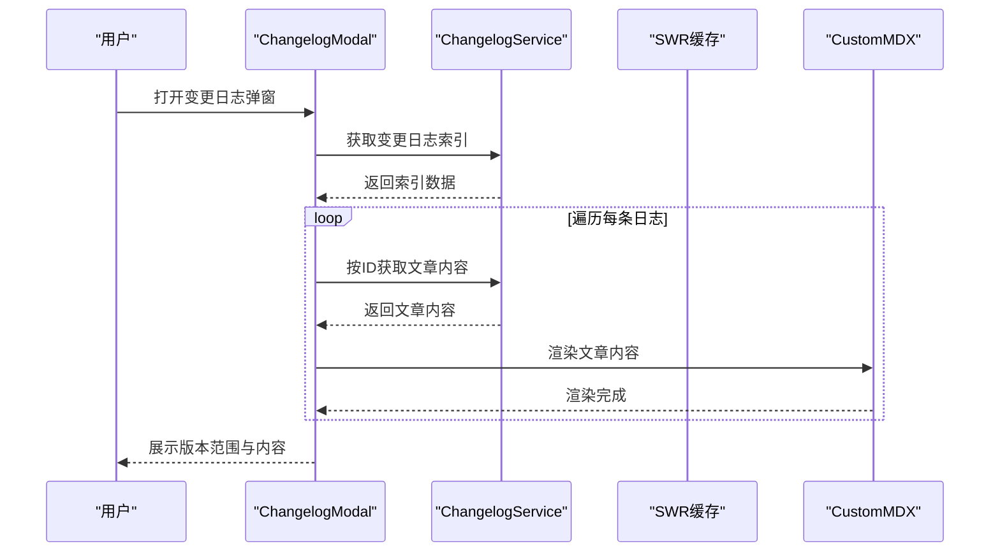
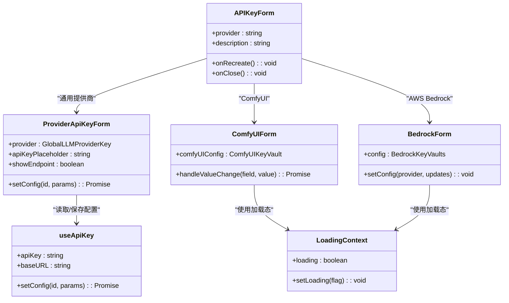
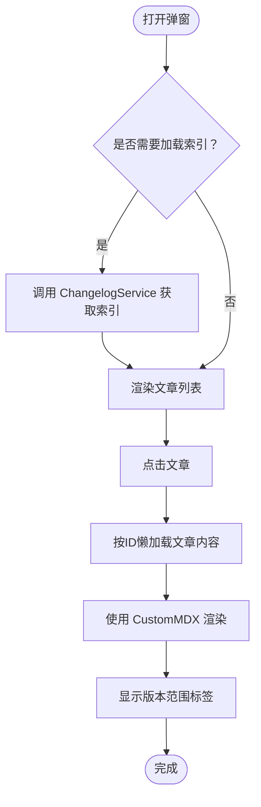
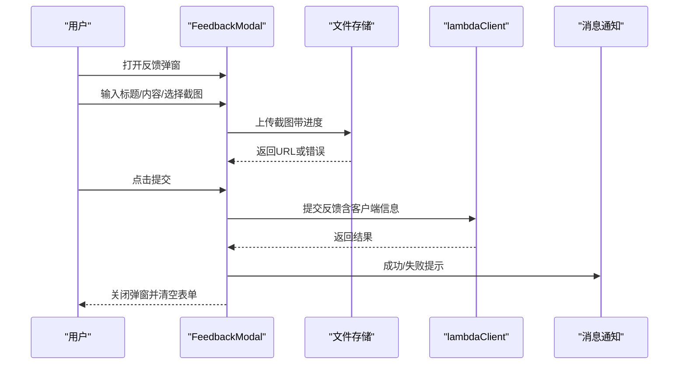
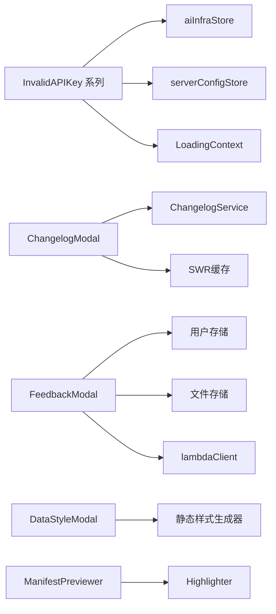

# 专用组件

<cite>
**本文引用的文件**
- [src/components/InvalidAPIKey/index.tsx](file://src/components/InvalidAPIKey/index.tsx)
- [src/components/InvalidAPIKey/ProviderApiKeyForm.tsx](file://src/components/InvalidAPIKey/ProviderApiKeyForm.tsx)
- [src/components/InvalidAPIKey/Bedrock.tsx](file://src/components/InvalidAPIKey/Bedrock.tsx)
- [src/components/InvalidAPIKey/ComfyUIForm.tsx](file://src/components/InvalidAPIKey/ComfyUIForm.tsx)
- [src/components/InvalidAPIKey/useApiKey.ts](file://src/components/InvalidAPIKey/useApiKey.ts)
- [src/components/InvalidAPIKey/LoadingContext.ts](file://src/components/InvalidAPIKey/LoadingContext.ts)
- [src/components/ChangelogModal/index.tsx](file://src/components/ChangelogModal/index.tsx)
- [src/components/ChangelogModal/ChangelogContent.tsx](file://src/components/ChangelogModal/ChangelogContent.tsx)
- [src/components/ChangelogModal/VersionTag.tsx](file://src/components/ChangelogModal/VersionTag.tsx)
- [src/components/FeedbackModal/index.tsx](file://src/components/FeedbackModal/index.tsx)
- [src/components/DataStyleModal/index.tsx](file://src/components/DataStyleModal/index.tsx)
- [src/components/ManifestPreviewer/index.tsx](file://src/components/ManifestPreviewer/index.tsx)
</cite>

## 目录
1. [引言](#引言)
2. [项目结构](#项目结构)
3. [核心组件](#核心组件)
4. [架构总览](#架构总览)
5. [详细组件分析](#详细组件分析)
6. [依赖关系分析](#依赖关系分析)
7. [性能考量](#性能考量)
8. [故障排查指南](#故障排查指南)
9. [结论](#结论)
10. [附录](#附录)

## 引言
本文件聚焦于 LobeHub 项目中具备特殊功能与业务价值的“专用组件”，涵盖以下主题：
- API 密钥验证与多提供商适配（含 Bedrock、ComfyUI 等）
- 变更日志弹窗与内容渲染
- 用户反馈收集与截图上传
- 数据样式化弹窗（Modal）封装
- 清单（Manifest）预览器

文档将从系统架构、组件职责、数据流、处理逻辑、集成方式、错误处理、性能与安全等方面进行深入解析，并提供可直接参考的使用路径与最佳实践。

## 项目结构
这些专用组件主要位于前端组件目录下，围绕“设置页”“对话错误提示”“内容展示”“市场反馈”等场景构建，形成高内聚、低耦合的功能模块。

图示来源
- [src/components/InvalidAPIKey/index.tsx](file://src/components/InvalidAPIKey/index.tsx#L1-L117)
- [src/components/InvalidAPIKey/ProviderApiKeyForm.tsx](file://src/components/InvalidAPIKey/ProviderApiKeyForm.tsx#L1-L79)
- [src/components/InvalidAPIKey/Bedrock.tsx](file://src/components/InvalidAPIKey/Bedrock.tsx#L1-L97)
- [src/components/InvalidAPIKey/ComfyUIForm.tsx](file://src/components/InvalidAPIKey/ComfyUIForm.tsx#L1-L249)
- [src/components/ChangelogModal/index.tsx](file://src/components/ChangelogModal/index.tsx#L1-L81)
- [src/components/ChangelogModal/ChangelogContent.tsx](file://src/components/ChangelogModal/ChangelogContent.tsx#L1-L81)
- [src/components/ChangelogModal/VersionTag.tsx](file://src/components/ChangelogModal/VersionTag.tsx#L1-L25)
- [src/components/DataStyleModal/index.tsx](file://src/components/DataStyleModal/index.tsx#L1-L86)
- [src/components/ManifestPreviewer/index.tsx](file://src/components/ManifestPreviewer/index.tsx#L1-L32)
- [src/components/FeedbackModal/index.tsx](file://src/components/FeedbackModal/index.tsx#L1-L204)

章节来源
- [src/components/InvalidAPIKey/index.tsx](file://src/components/InvalidAPIKey/index.tsx#L1-L117)
- [src/components/ChangelogModal/index.tsx](file://src/components/ChangelogModal/index.tsx#L1-L81)
- [src/components/FeedbackModal/index.tsx](file://src/components/FeedbackModal/index.tsx#L1-L204)
- [src/components/DataStyleModal/index.tsx](file://src/components/DataStyleModal/index.tsx#L1-L86)
- [src/components/ManifestPreviewer/index.tsx](file://src/components/ManifestPreviewer/index.tsx#L1-L32)

## 核心组件
- API 密钥验证组件群：统一入口负责根据提供商类型渲染不同表单，支持实时保存、加载态反馈、端点配置等。
- 变更日志弹窗：集中加载并渲染变更日志索引与文章内容，支持懒加载与版本范围标记。
- 反馈收集弹窗：提供标题、描述、截图上传与客户端信息采集，对接后端提交接口。
- 数据样式化弹窗：封装 Modal 头部样式与尺寸控制，便于数据卡片类展示。
- 清单预览器：以弹出层高亮显示 JSON 清单内容，便于调试与校验。

章节来源
- [src/components/InvalidAPIKey/index.tsx](file://src/components/InvalidAPIKey/index.tsx#L1-L117)
- [src/components/ChangelogModal/index.tsx](file://src/components/ChangelogModal/index.tsx#L1-L81)
- [src/components/FeedbackModal/index.tsx](file://src/components/FeedbackModal/index.tsx#L1-L204)
- [src/components/DataStyleModal/index.tsx](file://src/components/DataStyleModal/index.tsx#L1-L86)
- [src/components/ManifestPreviewer/index.tsx](file://src/components/ManifestPreviewer/index.tsx#L1-L32)

## 架构总览
专用组件围绕“状态管理（aiInfraStore/serverConfig）、国际化（i18n）、网络请求（SWR/lambdaClient）”协同工作，形成清晰的职责边界与调用链路。

图示来源
- [src/components/ChangelogModal/index.tsx](file://src/components/ChangelogModal/index.tsx#L18-L76)
- [src/components/ChangelogModal/ChangelogContent.tsx](file://src/components/ChangelogModal/ChangelogContent.tsx#L26-L62)

## 详细组件分析

### API 密钥验证组件群（InvalidAPIKey）
- 设计目标：在对话或运行时检测到无效/缺失 API 密钥时，弹出统一入口，按提供商类型渲染专属表单，支持端点与代理地址切换、ComfyUI 多认证模式与自定义头编辑。
- 关键特性：
  - Provider 适配：根据提供商渲染对应表单（通用 API Key、AWS Bedrock、ComfyUI）。
  - 实时保存：通过 useApiKey 与 aiInfraStore 实现配置写入与运行时状态刷新。
  - 加载态反馈：LoadingContext 提供统一 loading 状态，避免重复提交。
  - 端点与代理：在特定开关开启时显示“添加代理地址”按钮，支持 OpenAI 兼容端点。
- 使用场景：
  - 对话报错提示时触发，引导用户补全密钥或端点。
  - 设置页中作为“重新配置”的入口。
- 配置项与集成要点：
  - ProviderApiKeyForm：支持 apiKey、baseURL 的输入与保存；在启用代理开关时显示端点输入框。
  - BedrockForm：支持 accessKeyId、secretAccessKey、可选 sessionToken、区域选择。
  - ComfyUIForm：支持多种认证类型（无、Basic、Bearer、Custom），并提供自定义头部编辑器。
- 错误处理与安全：
  - 表单字段变更时进行基础校验，空 baseURL 不立即保存。
  - 保存过程通过 LoadingContext 控制 UI 状态，异常时记录日志。
  - 密码类字段使用受控输入，避免明文泄露。
- 性能影响：
  - 使用 SWC memo 包裹，减少重渲染。
  - 实时保存采用防抖式更新，避免频繁写入。

图示来源
- [src/components/InvalidAPIKey/index.tsx](file://src/components/InvalidAPIKey/index.tsx#L14-L114)
- [src/components/InvalidAPIKey/ProviderApiKeyForm.tsx](file://src/components/InvalidAPIKey/ProviderApiKeyForm.tsx#L16-L78)
- [src/components/InvalidAPIKey/Bedrock.tsx](file://src/components/InvalidAPIKey/Bedrock.tsx#L12-L96)
- [src/components/InvalidAPIKey/ComfyUIForm.tsx](file://src/components/InvalidAPIKey/ComfyUIForm.tsx#L43-L248)
- [src/components/InvalidAPIKey/useApiKey.ts](file://src/components/InvalidAPIKey/useApiKey.ts#L8-L27)
- [src/components/InvalidAPIKey/LoadingContext.ts](file://src/components/InvalidAPIKey/LoadingContext.ts#L3-L11)

章节来源
- [src/components/InvalidAPIKey/index.tsx](file://src/components/InvalidAPIKey/index.tsx#L1-L117)
- [src/components/InvalidAPIKey/ProviderApiKeyForm.tsx](file://src/components/InvalidAPIKey/ProviderApiKeyForm.tsx#L1-L79)
- [src/components/InvalidAPIKey/Bedrock.tsx](file://src/components/InvalidAPIKey/Bedrock.tsx#L1-L97)
- [src/components/InvalidAPIKey/ComfyUIForm.tsx](file://src/components/InvalidAPIKey/ComfyUIForm.tsx#L1-L249)
- [src/components/InvalidAPIKey/useApiKey.ts](file://src/components/InvalidAPIKey/useApiKey.ts#L1-L28)
- [src/components/InvalidAPIKey/LoadingContext.ts](file://src/components/InvalidAPIKey/LoadingContext.ts#L1-L12)

### 变更日志弹窗（ChangelogModal）
- 设计目标：在应用启动或用户主动打开时，展示最新变更日志，支持分页/滚动懒加载与版本范围标注。
- 关键特性：
  - 懒加载：仅在首次打开且未加载时拉取索引；文章内容按需请求。
  - 版本范围：通过 VersionTag 展示适用版本区间。
  - 内容渲染：使用 CustomMDX 渲染 Markdown 文章，支持图片与链接跳转。
- 使用场景：
  - 首次启动提示、设置页“查看更新”入口、公告弹窗。
- 集成方式：
  - 在页面中传入 open/shouldLoad/onClose，由组件内部控制加载与渲染。
- 错误处理：
  - 索引与文章加载失败时记录错误并保持 UI 友好提示。
- 性能影响：
  - 使用 SWR 缓存文章内容，避免重复请求。
  - Modal 容器设置最大高度与滚动，提升长内容阅读体验。

图示来源
- [src/components/ChangelogModal/index.tsx](file://src/components/ChangelogModal/index.tsx#L18-L76)
- [src/components/ChangelogModal/ChangelogContent.tsx](file://src/components/ChangelogModal/ChangelogContent.tsx#L26-L62)
- [src/components/ChangelogModal/VersionTag.tsx](file://src/components/ChangelogModal/VersionTag.tsx#L20-L24)

章节来源
- [src/components/ChangelogModal/index.tsx](file://src/components/ChangelogModal/index.tsx#L1-L81)
- [src/components/ChangelogModal/ChangelogContent.tsx](file://src/components/ChangelogModal/ChangelogContent.tsx#L1-L81)
- [src/components/ChangelogModal/VersionTag.tsx](file://src/components/ChangelogModal/VersionTag.tsx#L1-L25)

### 反馈收集弹窗（FeedbackModal）
- 设计目标：提供简洁的反馈表单，支持截图上传与客户端信息采集，一键提交至后端。
- 关键特性：
  - 表单校验：标题与内容必填，长度限制。
  - 截图上传：限制大小、进度上传、移除操作。
  - 客户端信息：自动采集语言、时区、URL、UA 等。
  - 成功/失败提示：统一消息通知。
- 使用场景：
  - 帮助中心、设置页“意见反馈”入口、问题复现引导。
- 集成方式：
  - 传入 open/initialValues/onClose；提交通过 lambdaClient 调用后端接口。
- 错误处理：
  - 上传失败与提交失败均记录日志并提示用户。
- 性能影响：
  - 上传采用进度回调，避免阻塞 UI。
  - 表单字段使用受控组件，降低重渲染。

图示来源
- [src/components/FeedbackModal/index.tsx](file://src/components/FeedbackModal/index.tsx#L32-L107)

章节来源
- [src/components/FeedbackModal/index.tsx](file://src/components/FeedbackModal/index.tsx#L1-L204)

### 数据样式化弹窗（DataStyleModal）
- 设计目标：为数据卡片、配置面板等场景提供统一的 Modal 样式包装，支持暗/亮主题下的头部背景与尺寸控制。
- 关键特性：
  - 主题适配：根据深色/浅色模式动态应用不同的头部背景样式。
  - 尺寸控制：支持自定义宽度与高度。
  - 结构化标题：支持图标+标题组合。
- 使用场景：
  - 数据导出/导入预览、配置项详情弹窗、插件参数展示。
- 集成方式：
  - 传入 open/title/icon/children 以及可选的宽高与回调。
- 性能影响：
  - 通过静态样式生成减少运行时计算，提升首屏渲染效率。

章节来源
- [src/components/DataStyleModal/index.tsx](file://src/components/DataStyleModal/index.tsx#L1-L86)

### 清单预览器（ManifestPreviewer）
- 设计目标：在开发/调试场景中，快速预览插件/应用清单（JSON）内容，便于核对字段与格式。
- 关键特性：
  - 弹出层高亮显示 JSON，支持滚动与固定宽度。
  - 支持 hover/click 触发。
- 使用场景：
  - 插件开发工具栏、应用清单校验、发布前检查。
- 集成方式：
  - 传入 manifest 与触发方式，包裹目标元素即可。
- 性能影响：
  - 仅在打开时渲染高亮组件，关闭即释放。

章节来源
- [src/components/ManifestPreviewer/index.tsx](file://src/components/ManifestPreviewer/index.tsx#L1-L32)

## 依赖关系分析
- 状态管理：
  - InvalidAPIKey 系列依赖 aiInfraStore 读取/更新提供商配置；useApiKey 封装了配置合并与去抖保存。
  - FeedbackModal 依赖用户存储（邮箱）、文件存储（上传）、trpc 客户端（提交）。
- 国际化：
  - 各组件通过 useTranslation 获取文案，确保多语言一致性。
- 网络与缓存：
  - ChangelogModal 使用 SWR 缓存文章内容，减少重复请求。
- UI 与样式：
  - DataStyleModal 通过静态样式生成器注入主题样式，避免运行时样式计算。

图示来源
- [src/components/InvalidAPIKey/index.tsx](file://src/components/InvalidAPIKey/index.tsx#L1-L117)
- [src/components/ChangelogModal/index.tsx](file://src/components/ChangelogModal/index.tsx#L1-L81)
- [src/components/FeedbackModal/index.tsx](file://src/components/FeedbackModal/index.tsx#L1-L204)
- [src/components/DataStyleModal/index.tsx](file://src/components/DataStyleModal/index.tsx#L1-L86)
- [src/components/ManifestPreviewer/index.tsx](file://src/components/ManifestPreviewer/index.tsx#L1-L32)

章节来源
- [src/components/InvalidAPIKey/index.tsx](file://src/components/InvalidAPIKey/index.tsx#L1-L117)
- [src/components/ChangelogModal/index.tsx](file://src/components/ChangelogModal/index.tsx#L1-L81)
- [src/components/FeedbackModal/index.tsx](file://src/components/FeedbackModal/index.tsx#L1-L204)
- [src/components/DataStyleModal/index.tsx](file://src/components/DataStyleModal/index.tsx#L1-L86)
- [src/components/ManifestPreviewer/index.tsx](file://src/components/ManifestPreviewer/index.tsx#L1-L32)

## 性能考量
- 懒加载与缓存：变更日志使用 SWR 缓存，避免重复请求；弹窗仅在打开时渲染高亮组件。
- 减少重渲染：大量使用 memo 包裹组件，合理拆分状态，避免不必要的 props 下钻。
- 上传与保存：截图上传采用进度回调，配置保存采用防抖/去抖策略，降低网络压力。
- 主题样式：静态样式生成器在构建期注入，运行时无需额外计算。

## 故障排查指南
- API 密钥保存失败
  - 检查 LoadingContext 是否被正确提供；确认 setConfig 调用链路未被中断。
  - 查看 aiInfraStore 的更新函数返回值与运行时状态刷新是否成功。
- Bedrock/ComfyUI 表单无法保存
  - 确认字段校验逻辑（如空 baseURL 不保存）是否导致提前返回。
  - 检查自定义头部编辑器的键值对是否合法。
- 变更日志不显示
  - 确认 shouldLoad 为 true 且索引已成功拉取；检查文章 ID 是否存在。
  - 若文章内容为空，检查 ChangelogService 的 getPostById 接口。
- 反馈提交失败
  - 检查 lambdaClient 的网络连通性与权限；查看消息通知中的错误提示。
  - 确认截图大小限制与上传进度回调是否正常执行。

章节来源
- [src/components/InvalidAPIKey/useApiKey.ts](file://src/components/InvalidAPIKey/useApiKey.ts#L8-L27)
- [src/components/ChangelogModal/ChangelogContent.tsx](file://src/components/ChangelogModal/ChangelogContent.tsx#L26-L30)
- [src/components/FeedbackModal/index.tsx](file://src/components/FeedbackModal/index.tsx#L73-L101)

## 结论
上述专用组件围绕“配置安全、内容展示、用户反馈、样式统一、清单校验”五大方向构建，既满足复杂业务场景的可用性需求，又兼顾性能与可维护性。通过统一的状态管理、国际化与网络层抽象，组件可在不同页面与流程中稳定复用，并为后续扩展提供清晰的接口与约束。

## 附录
- 最佳实践
  - 在对话错误场景中优先使用 InvalidAPIKey 组件群，确保用户能快速补齐密钥或端点。
  - 变更日志建议在应用启动时异步加载索引，文章内容按需懒加载。
  - 反馈弹窗应限制截图大小并提供清晰的上传进度提示。
  - 数据样式化弹窗用于强调型展示，避免滥用导致视觉噪音。
  - 清单预览器仅在开发/调试阶段使用，避免暴露给普通用户。