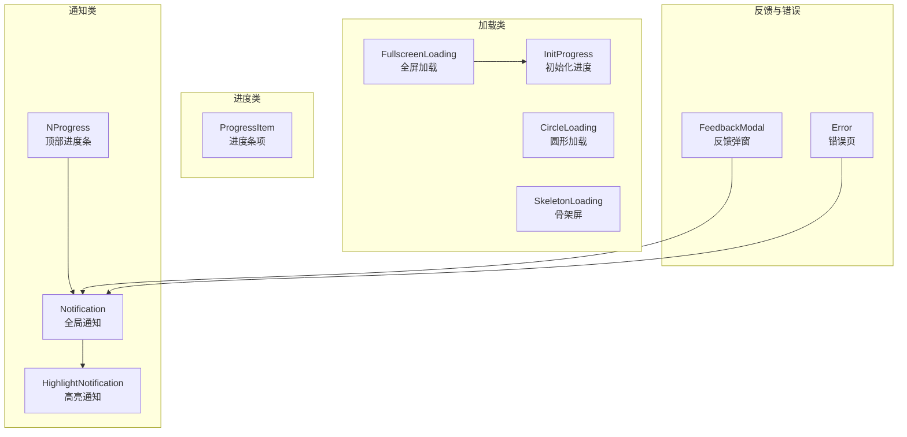
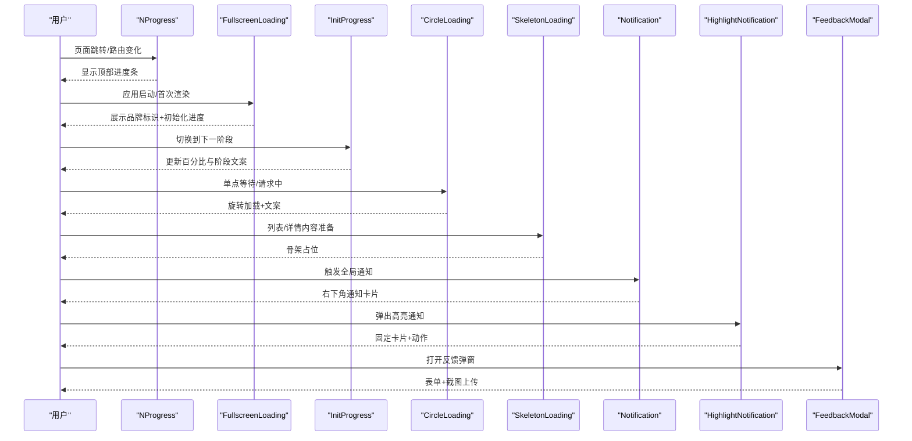
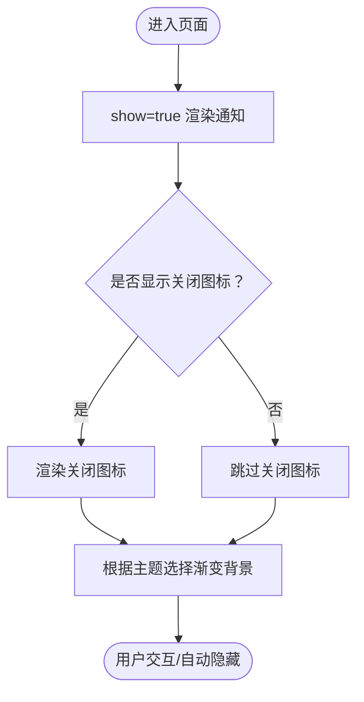
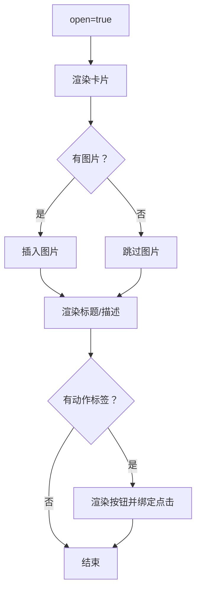
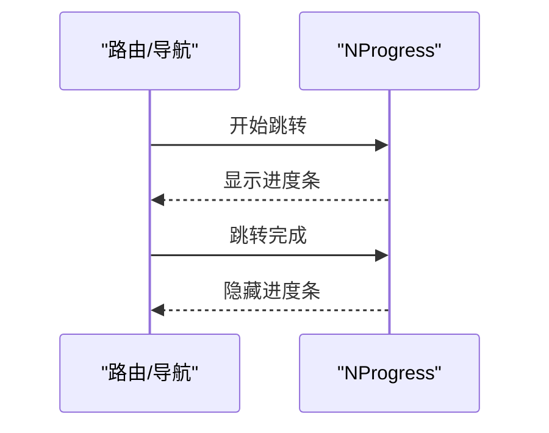
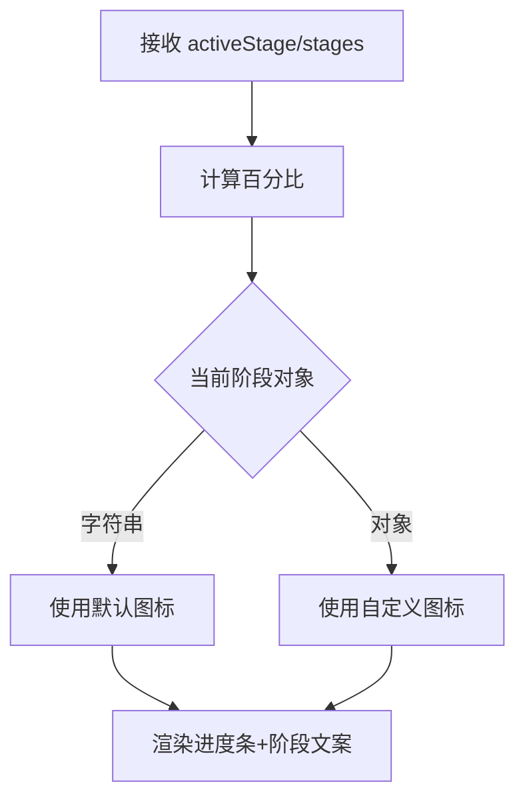
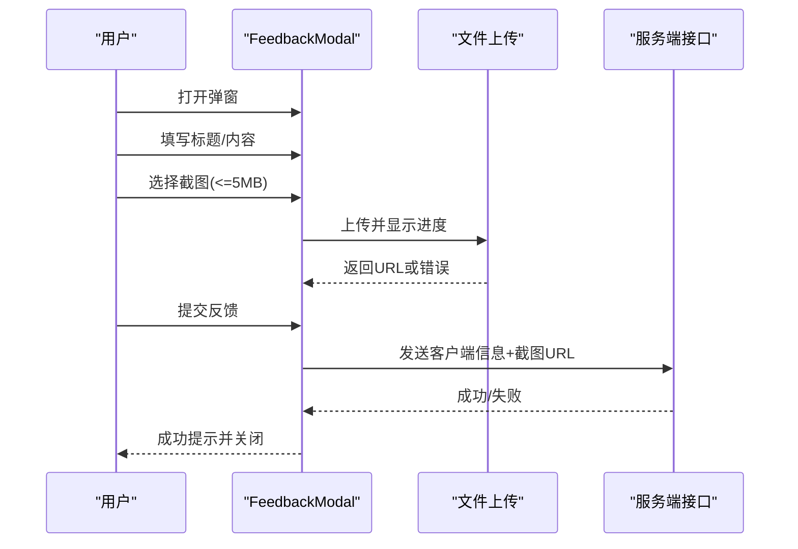
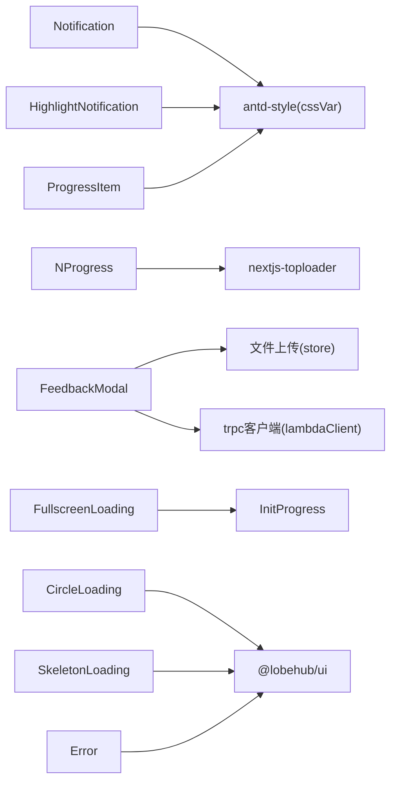

# 反馈组件

<cite>
**本文引用的文件**
- [src/components/Notification/index.tsx](file://src/components/Notification/index.tsx)
- [src/components/Error/index.tsx](file://src/components/Error/index.tsx)
- [src/components/FeedbackModal/index.tsx](file://src/components/FeedbackModal/index.tsx)
- [src/components/HighlightNotification/index.tsx](file://src/components/HighlightNotification/index.tsx)
- [src/components/NProgress/index.tsx](file://src/components/NProgress/index.tsx)
- [src/components/Loading/FullscreenLoading/index.tsx](file://src/components/Loading/FullscreenLoading/index.tsx)
- [src/components/Loading/CircleLoading/index.tsx](file://src/components/Loading/CircleLoading/index.tsx)
- [src/components/Loading/SkeletonLoading/index.tsx](file://src/components/Loading/SkeletonLoading/index.tsx)
- [src/components/InitProgress/index.tsx](file://src/components/InitProgress/index.tsx)
- [src/components/ProgressItem/index.tsx](file://src/components/ProgressItem/index.tsx)
</cite>

## 目录
1. [简介](#简介)
2. [项目结构](#项目结构)
3. [核心组件](#核心组件)
4. [架构总览](#架构总览)
5. [组件详解](#组件详解)
6. [依赖关系分析](#依赖关系分析)
7. [性能与体验](#性能与体验)
8. [故障排查指南](#故障排查指南)
9. [结论](#结论)
10. [附录：最佳实践与无障碍建议](#附录最佳实践与无障碍建议)

## 简介
本文件系统化梳理 LobeHub 中的“反馈组件”体系，覆盖加载动画、通知消息、错误提示、进度条与初始化进度等，帮助开发者与设计师理解各组件的使用时机、样式配置、交互行为与可访问性支持，并提供统一的设计语言、主题适配、动画效果与性能优化建议。

## 项目结构
反馈组件主要集中在 src/components 下，按功能域划分如下：
- 加载类：全屏加载、圆形加载、骨架屏、初始化进度
- 进度类：通用进度条项
- 通知类：全局通知、高亮通知、顶部进度条
- 反馈收集：反馈弹窗（含截图上传）
- 错误捕获：错误页与错误边界式展示

**图表来源**
- [src/components/Loading/FullscreenLoading/index.tsx](file://src/components/Loading/FullscreenLoading/index.tsx#L15-L24)
- [src/components/Loading/CircleLoading/index.tsx](file://src/components/Loading/CircleLoading/index.tsx#L7-L21)
- [src/components/Loading/SkeletonLoading/index.tsx](file://src/components/Loading/SkeletonLoading/index.tsx#L16-L29)
- [src/components/InitProgress/index.tsx](file://src/components/InitProgress/index.tsx#L19-L38)
- [src/components/ProgressItem/index.tsx](file://src/components/ProgressItem/index.tsx#L35-L72)
- [src/components/Notification/index.tsx](file://src/components/Notification/index.tsx#L63-L106)
- [src/components/HighlightNotification/index.tsx](file://src/components/HighlightNotification/index.tsx#L65-L95)
- [src/components/NProgress/index.tsx](file://src/components/NProgress/index.tsx#L9-L21)
- [src/components/FeedbackModal/index.tsx](file://src/components/FeedbackModal/index.tsx#L32-L199)
- [src/components/Error/index.tsx](file://src/components/Error/index.tsx#L15-L67)

**章节来源**
- [src/components/Loading/FullscreenLoading/index.tsx](file://src/components/Loading/FullscreenLoading/index.tsx#L1-L27)
- [src/components/Loading/CircleLoading/index.tsx](file://src/components/Loading/CircleLoading/index.tsx#L1-L24)
- [src/components/Loading/SkeletonLoading/index.tsx](file://src/components/Loading/SkeletonLoading/index.tsx#L1-L32)
- [src/components/InitProgress/index.tsx](file://src/components/InitProgress/index.tsx#L1-L41)
- [src/components/ProgressItem/index.tsx](file://src/components/ProgressItem/index.tsx#L1-L76)
- [src/components/Notification/index.tsx](file://src/components/Notification/index.tsx#L1-L109)
- [src/components/HighlightNotification/index.tsx](file://src/components/HighlightNotification/index.tsx#L1-L100)
- [src/components/NProgress/index.tsx](file://src/components/NProgress/index.tsx#L1-L24)
- [src/components/FeedbackModal/index.tsx](file://src/components/FeedbackModal/index.tsx#L1-L204)
- [src/components/Error/index.tsx](file://src/components/Error/index.tsx#L1-L70)

## 核心组件
- 全局通知 Notification：右下角浮动通知容器，支持关闭图标、深浅色渐变背景、移动端适配。
- 高亮通知 HighlightNotification：固定卡片式通知，支持标题/描述/图片/动作按钮。
- 顶部进度条 NProgress：基于 nextjs-toploader 的轻量顶部进度条，桌面端禁用。
- 初始化进度 InitProgress：带百分比与阶段文案的进度指示器，常与全屏加载配合。
- 圆形加载 CircleLoading：居中旋转加载与“加载中”文案。
- 骨架屏 SkeletonLoading：占位骨架，提升感知性能。
- 进度条项 ProgressItem：资源使用型进度展示，含标题/描述/用量/百分比。
- 反馈弹窗 FeedbackModal：表单收集反馈，支持截图上传与客户端信息采集。
- 错误页 Error：错误捕获后的友好展示与重试/返回首页入口。

**章节来源**
- [src/components/Notification/index.tsx](file://src/components/Notification/index.tsx#L53-L106)
- [src/components/HighlightNotification/index.tsx](file://src/components/HighlightNotification/index.tsx#L10-L95)
- [src/components/NProgress/index.tsx](file://src/components/NProgress/index.tsx#L9-L21)
- [src/components/InitProgress/index.tsx](file://src/components/InitProgress/index.tsx#L14-L38)
- [src/components/Loading/CircleLoading/index.tsx](file://src/components/Loading/CircleLoading/index.tsx#L7-L21)
- [src/components/Loading/SkeletonLoading/index.tsx](file://src/components/Loading/SkeletonLoading/index.tsx#L16-L29)
- [src/components/ProgressItem/index.tsx](file://src/components/ProgressItem/index.tsx#L21-L72)
- [src/components/FeedbackModal/index.tsx](file://src/components/FeedbackModal/index.tsx#L32-L199)
- [src/components/Error/index.tsx](file://src/components/Error/index.tsx#L15-L67)

## 架构总览
反馈组件围绕“状态可视化”与“用户引导”两大目标协作：
- 加载与进度：在异步任务开始时提供即时反馈，避免用户困惑。
- 通知与反馈：在关键事件发生时进行确认或引导，支持进一步操作。
- 错误处理：在异常时提供可恢复路径与可读信息。

**图表来源**
- [src/components/NProgress/index.tsx](file://src/components/NProgress/index.tsx#L9-L21)
- [src/components/Loading/FullscreenLoading/index.tsx](file://src/components/Loading/FullscreenLoading/index.tsx#L15-L24)
- [src/components/InitProgress/index.tsx](file://src/components/InitProgress/index.tsx#L19-L38)
- [src/components/Loading/CircleLoading/index.tsx](file://src/components/Loading/CircleLoading/index.tsx#L7-L21)
- [src/components/Loading/SkeletonLoading/index.tsx](file://src/components/Loading/SkeletonLoading/index.tsx#L16-L29)
- [src/components/Notification/index.tsx](file://src/components/Notification/index.tsx#L63-L106)
- [src/components/HighlightNotification/index.tsx](file://src/components/HighlightNotification/index.tsx#L65-L95)
- [src/components/FeedbackModal/index.tsx](file://src/components/FeedbackModal/index.tsx#L32-L199)

## 组件详解

### 全局通知 Notification
- 使用时机：页面内需要向用户传达非阻塞信息，如设置变更、任务完成等。
- 样式配置：容器圆角、边框、阴影；深浅主题渐变背景；移动端定位调整。
- 交互行为：可选关闭图标，点击回调；支持自定义宽度/高度与子布局属性。
- 可访问性：通过语义化布局与键盘可达性保障；建议在关闭后焦点回退至最近交互元素。

**图表来源**
- [src/components/Notification/index.tsx](file://src/components/Notification/index.tsx#L63-L106)

**章节来源**
- [src/components/Notification/index.tsx](file://src/components/Notification/index.tsx#L1-L109)

### 高亮通知 HighlightNotification
- 使用时机：需要突出重要信息或引导用户执行特定动作（如前往新功能）。
- 样式配置：固定卡片、阴影、边框与圆角；标题/描述/图片区域分层。
- 交互行为：支持关闭、动作按钮点击回调、外链打开（带安全属性）。
- 可访问性：确保按钮可键盘聚焦；图片无替代文本时提供空 alt；避免遮挡关键内容。

**图表来源**
- [src/components/HighlightNotification/index.tsx](file://src/components/HighlightNotification/index.tsx#L65-L95)

**章节来源**
- [src/components/HighlightNotification/index.tsx](file://src/components/HighlightNotification/index.tsx#L1-L100)

### 顶部进度条 NProgress
- 使用时机：页面跳转/路由变化时提供轻量进度反馈，桌面端默认禁用。
- 样式配置：颜色继承文本变量、细条高度、无阴影与加载圈。
- 交互行为：由路由/导航库触发，无需手动控制。
- 可访问性：对屏幕阅读器透明；避免与闪烁动画冲突。

**图表来源**
- [src/components/NProgress/index.tsx](file://src/components/NProgress/index.tsx#L9-L21)

**章节来源**
- [src/components/NProgress/index.tsx](file://src/components/NProgress/index.tsx#L1-L24)

### 初始化进度 InitProgress
- 使用时机：应用启动/初始化流程中，分阶段展示当前步骤与整体进度。
- 样式配置：进度条无数值显示、阶段图标/文案随阶段切换。
- 交互行为：根据 activeStage 计算百分比，动态更新。
- 可访问性：阶段文案应简洁明确；图标需有替代文本或通过标题说明。

**图表来源**
- [src/components/InitProgress/index.tsx](file://src/components/InitProgress/index.tsx#L19-L38)

**章节来源**
- [src/components/InitProgress/index.tsx](file://src/components/InitProgress/index.tsx#L1-L41)

### 圆形加载 CircleLoading
- 使用时机：单点等待、请求中、页面局部加载。
- 样式配置：居中布局、旋转图标、次级文案。
- 交互行为：无交互，仅视觉反馈。
- 可访问性：对屏幕阅读器透明；避免长时间旋转导致不适。

**章节来源**
- [src/components/Loading/CircleLoading/index.tsx](file://src/components/Loading/CircleLoading/index.tsx#L1-L24)

### 骨架屏 SkeletonLoading
- 使用时机：数据未就绪前的占位，降低感知延迟。
- 样式配置：段落数、活跃动画、响应式内边距。
- 交互行为：无交互，仅占位。
- 可访问性：保持对比度；避免过度动画。

**章节来源**
- [src/components/Loading/SkeletonLoading/index.tsx](file://src/components/Loading/SkeletonLoading/index.tsx#L1-L32)

### 全屏加载 FullscreenLoading
- 使用时机：应用启动/首次渲染时的整体加载。
- 样式配置：品牌标识、阶段进度或自定义内容渲染。
- 交互行为：无交互，承载初始化流程。
- 可访问性：保证首屏可读性；避免长时间全屏加载。

**章节来源**
- [src/components/Loading/FullscreenLoading/index.tsx](file://src/components/Loading/FullscreenLoading/index.tsx#L1-L27)

### 进度条项 ProgressItem
- 使用时机：资源使用情况展示（如配额/存储/调用次数）。
- 样式配置：标题/描述/用量/百分比组合，小尺寸进度条。
- 交互行为：无交互，仅展示。
- 可访问性：用量文案清晰；百分比与用量一致。

**章节来源**
- [src/components/ProgressItem/index.tsx](file://src/components/ProgressItem/index.tsx#L1-L76)

### 反馈弹窗 FeedbackModal
- 使用时机：收集用户反馈、问题报告、截图辅助定位。
- 样式配置：模态框宽度、表单项布局、上传区样式。
- 交互行为：表单校验、截图上传（含大小限制）、提交成功/失败提示、关闭后重置。
- 可访问性：表单项具备标签；上传按钮具备可读文案；错误提示可读。

**图表来源**
- [src/components/FeedbackModal/index.tsx](file://src/components/FeedbackModal/index.tsx#L32-L199)

**章节来源**
- [src/components/FeedbackModal/index.tsx](file://src/components/FeedbackModal/index.tsx#L1-L204)

### 错误页 Error
- 使用时机：运行时错误捕获后的用户可见界面。
- 样式配置：居中布局、模糊背景文字、表情符号、折叠栈信息。
- 交互行为：重试与返回首页按钮；可选展开堆栈查看。
- 可访问性：提供可读标题/描述；堆栈信息可折叠；按钮具备键盘可达性。

**章节来源**
- [src/components/Error/index.tsx](file://src/components/Error/index.tsx#L1-L70)

## 依赖关系分析
- 主题与样式：多数组件使用 antd-style 的 cssVar 注入主题变量，确保深浅色一致。
- UI 基础：统一依赖 @lobehub/ui 与 antd 组件库，保证一致性与可维护性。
- 路由与导航：NProgress 依赖 nextjs-toploader，桌面端条件渲染。
- 文件上传：FeedbackModal 依赖文件上传能力与 trpc 客户端。

**图表来源**
- [src/components/Notification/index.tsx](file://src/components/Notification/index.tsx#L1-L10)
- [src/components/HighlightNotification/index.tsx](file://src/components/HighlightNotification/index.tsx#L1-L8)
- [src/components/NProgress/index.tsx](file://src/components/NProgress/index.tsx#L1-L5)
- [src/components/FeedbackModal/index.tsx](file://src/components/FeedbackModal/index.tsx#L1-L15)
- [src/components/Loading/FullscreenLoading/index.tsx](file://src/components/Loading/FullscreenLoading/index.tsx#L1-L8)
- [src/components/Loading/CircleLoading/index.tsx](file://src/components/Loading/CircleLoading/index.tsx#L1-L6)
- [src/components/Loading/SkeletonLoading/index.tsx](file://src/components/Loading/SkeletonLoading/index.tsx#L1-L6)
- [src/components/ProgressItem/index.tsx](file://src/components/ProgressItem/index.tsx#L1-L5)
- [src/components/Error/index.tsx](file://src/components/Error/index.tsx#L1-L4)

**章节来源**
- [src/components/Notification/index.tsx](file://src/components/Notification/index.tsx#L1-L10)
- [src/components/HighlightNotification/index.tsx](file://src/components/HighlightNotification/index.tsx#L1-L8)
- [src/components/NProgress/index.tsx](file://src/components/NProgress/index.tsx#L1-L5)
- [src/components/FeedbackModal/index.tsx](file://src/components/FeedbackModal/index.tsx#L1-L15)
- [src/components/Loading/FullscreenLoading/index.tsx](file://src/components/Loading/FullscreenLoading/index.tsx#L1-L8)
- [src/components/Loading/CircleLoading/index.tsx](file://src/components/Loading/CircleLoading/index.tsx#L1-L6)
- [src/components/Loading/SkeletonLoading/index.tsx](file://src/components/Loading/SkeletonLoading/index.tsx#L1-L6)
- [src/components/ProgressItem/index.tsx](file://src/components/ProgressItem/index.tsx#L1-L5)
- [src/components/Error/index.tsx](file://src/components/Error/index.tsx#L1-L4)

## 性能与体验
- 渐进式反馈：优先使用骨架屏与轻量加载，减少白屏时间。
- 轻量化顶部进度：移动端启用，桌面端禁用，避免冗余。
- 主题一致性：统一使用 cssVar，减少重绘与样式抖动。
- 动画节制：避免长时间旋转与闪烁，必要时提供可关闭选项。
- 可访问性：为所有交互元素提供键盘可达性与语义化标签；错误提示可读且可关闭。

[本节为通用指导，不直接分析具体文件]

## 故障排查指南
- 通知不显示
  - 检查 show 参数与容器层级；确认移动端定位样式未被覆盖。
  - 参考：[src/components/Notification/index.tsx](file://src/components/Notification/index.tsx#L75-L104)
- 高亮通知不出现
  - 确认 open=true；检查固定定位与 z-index。
  - 参考：[src/components/HighlightNotification/index.tsx](file://src/components/HighlightNotification/index.tsx#L65-L70)
- 顶部进度条无效
  - 检查是否在桌面端被禁用；确认路由变化触发。
  - 参考：[src/components/NProgress/index.tsx](file://src/components/NProgress/index.tsx#L9-L21)
- 初始化进度百分比异常
  - 检查 activeStage 是否越界；确认 stages 数组长度。
  - 参考：[src/components/InitProgress/index.tsx](file://src/components/InitProgress/index.tsx#L19-L38)
- 圆形加载/骨架屏卡住
  - 确认外部状态已更新；避免重复渲染。
  - 参考：[src/components/Loading/CircleLoading/index.tsx](file://src/components/Loading/CircleLoading/index.tsx#L7-L21)、[src/components/Loading/SkeletonLoading/index.tsx](file://src/components/Loading/SkeletonLoading/index.tsx#L16-L29)
- 反馈弹窗提交失败
  - 查看控制台错误日志；确认网络与权限；检查表单校验与上传状态。
  - 参考：[src/components/FeedbackModal/index.tsx](file://src/components/FeedbackModal/index.tsx#L73-L101)
- 错误页无法重试
  - 检查 reset 回调是否正确绑定；确认路由/状态可恢复。
  - 参考：[src/components/Error/index.tsx](file://src/components/Error/index.tsx#L15-L67)

**章节来源**
- [src/components/Notification/index.tsx](file://src/components/Notification/index.tsx#L63-L106)
- [src/components/HighlightNotification/index.tsx](file://src/components/HighlightNotification/index.tsx#L65-L95)
- [src/components/NProgress/index.tsx](file://src/components/NProgress/index.tsx#L9-L21)
- [src/components/InitProgress/index.tsx](file://src/components/InitProgress/index.tsx#L19-L38)
- [src/components/Loading/CircleLoading/index.tsx](file://src/components/Loading/CircleLoading/index.tsx#L7-L21)
- [src/components/Loading/SkeletonLoading/index.tsx](file://src/components/Loading/SkeletonLoading/index.tsx#L16-L29)
- [src/components/FeedbackModal/index.tsx](file://src/components/FeedbackModal/index.tsx#L73-L101)
- [src/components/Error/index.tsx](file://src/components/Error/index.tsx#L15-L67)

## 结论
LobeHub 的反馈组件体系以“即时、清晰、可恢复”为核心，结合加载、进度、通知与错误处理形成闭环。通过统一的主题变量与 UI 基础库，确保跨平台一致性；通过可访问性与性能优化建议，提升用户体验与可维护性。建议在实际业务中遵循“最小必要反馈”原则，避免信息过载，并在关键路径上提供明确的反馈与回退机制。

[本节为总结性内容，不直接分析具体文件]

## 附录：最佳实践与无障碍建议
- 最佳实践
  - 在长列表/大图加载前使用骨架屏；在路由切换时使用顶部进度条。
  - 将全局通知作为“确认型”反馈，避免频繁弹出；将高亮通知用于“引导型”反馈。
  - 反馈弹窗仅在必要时出现，提供简明表单与清晰提示。
- 无障碍建议
  - 为所有按钮与链接提供可读标签；确保键盘可达性。
  - 错误提示具备可读文案与关闭选项；避免纯图标表达。
  - 控制动画时长与频率，尊重用户的敏感设置。

[本节为通用指导，不直接分析具体文件]