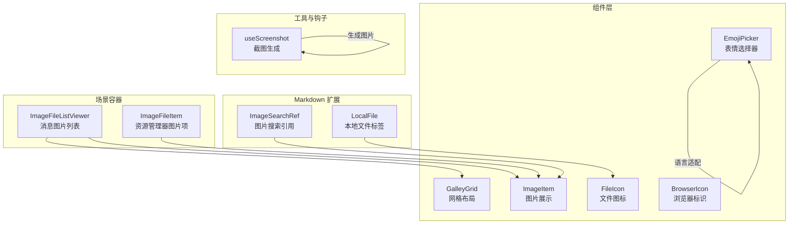
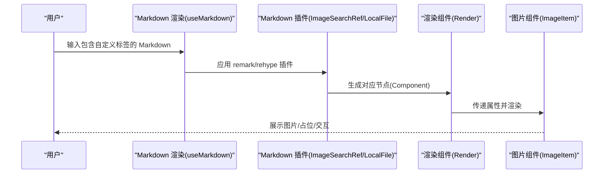
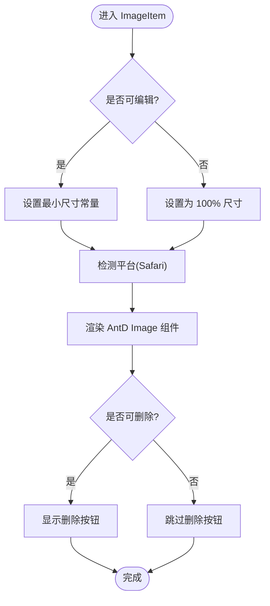
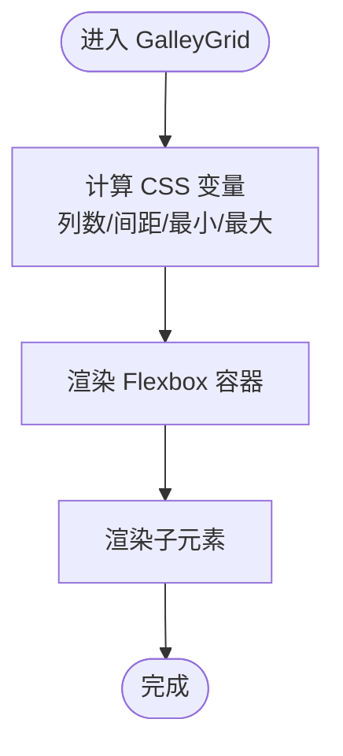
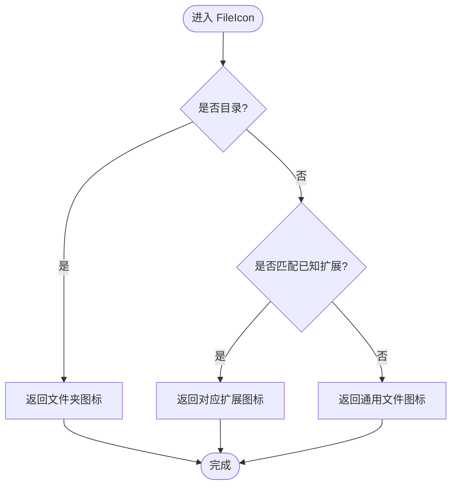
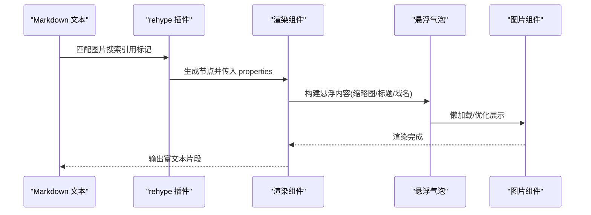
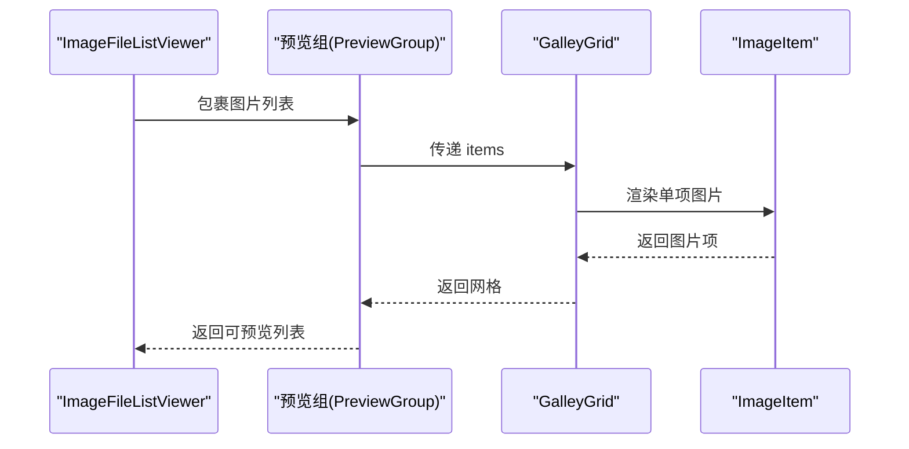
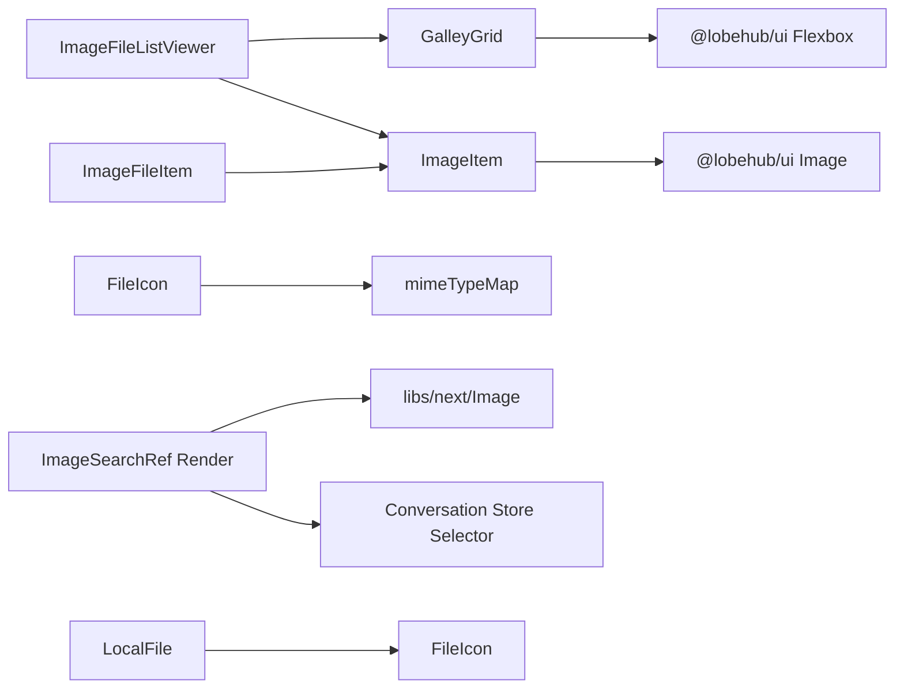

# 媒体组件

<cite>
**本文引用的文件**
- [src/components/ImageItem/index.tsx](file://src/components/ImageItem/index.tsx)
- [src/components/ImageItem/style.ts](file://src/components/ImageItem/style.ts)
- [src/components/FileIcon/index.tsx](file://src/components/FileIcon/index.tsx)
- [src/components/FileIcon/config.ts](file://src/components/FileIcon/config.ts)
- [src/components/BrowserIcon/index.tsx](file://src/components/BrowserIcon/index.tsx)
- [src/components/EmojiPicker/index.tsx](file://src/components/EmojiPicker/index.tsx)
- [src/features/Conversation/Messages/components/ImageFileListViewer.tsx](file://src/features/Conversation/Messages/components/ImageFileListViewer.tsx)
- [src/features/Conversation/Messages/User/components/ImageFileListViewer.tsx](file://src/features/Conversation/Messages/User/components/ImageFileListViewer.tsx)
- [src/features/Conversation/Markdown/plugins/ImageSearchRef/Render.tsx](file://src/features/Conversation/Markdown/plugins/ImageSearchRef/Render.tsx)
- [src/features/Conversation/Markdown/plugins/ImageSearchRef/index.ts](file://src/features/Conversation/Markdown/plugins/ImageSearchRef/index.ts)
- [src/features/Conversation/Markdown/plugins/LocalFile/index.ts](file://src/features/Conversation/Markdown/plugins/LocalFile/index.ts)
- [src/features/Conversation/Markdown/plugins/LocalFile/Render.tsx](file://src/features/Conversation/Markdown/plugins/LocalFile/Render.tsx)
- [src/features/Conversation/Markdown/plugins/type.ts](file://src/features/Conversation/Markdown/plugins/type.ts)
- [src/features/Conversation/Messages/User/useMarkdown.tsx](file://src/features/Conversation/Messages/User/useMarkdown.tsx)
- [src/features/ResourceManager/components/Explorer/MasonryView/MasonryItem/ImageFileItem.tsx](file://src/features/ResourceManager/components/Explorer/MasonryView/MasonryItem/ImageFileItem.tsx)
- [src/components/GalleyGrid/Grid.tsx](file://src/components/GalleyGrid/Grid.tsx)
- [src/components/GalleyGrid/style.ts](file://src/components/GalleyGrid/style.ts)
- [src/hooks/useScreenshot.ts](file://src/hooks/useScreenshot.ts)
</cite>

## 目录

1. [简介](#简介)
2. [项目结构](#项目结构)
3. [核心组件](#核心组件)
4. [架构总览](#架构总览)
5. [详细组件分析](#详细组件分析)
6. [依赖关系分析](#依赖关系分析)
7. [性能考量](#性能考量)
8. [故障排查指南](#故障排查指南)
9. [结论](#结论)
10. [附录](#附录)

## 简介

本文件系统化梳理 LobeHub 中与 “媒体” 相关的组件与能力，覆盖图片展示、文件图标、浏览器标识、表情选择器、Markdown 渲染扩展（含图片搜索引用、本地文件标签）等。文档从架构、数据流、处理逻辑、交互行为、性能优化、可访问性与跨平台兼容性等方面进行深入说明，并提供可直接定位到源码路径的示例，帮助开发者在不同场景下正确使用与扩展媒体组件。

## 项目结构

媒体相关能力主要分布在以下模块：

- 组件层：图片展示、网格布局、文件图标、浏览器图标、表情选择器
- Markdown 扩展：图片搜索引用、本地文件标签
- 场景化容器：消息中的图片列表查看、资源管理器中的图片项
- 工具与钩子：截图生成工具

图表来源

- [src/components/ImageItem/index.tsx](file://src/components/ImageItem/index.tsx#L1-L87)
- [src/components/GalleyGrid/Grid.tsx](file://src/components/GalleyGrid/Grid.tsx#L1-L54)
- [src/components/FileIcon/index.tsx](file://src/components/FileIcon/index.tsx#L1-L35)
- [src/components/BrowserIcon/index.tsx](file://src/components/BrowserIcon/index.tsx#L1-L38)
- [src/components/EmojiPicker/index.tsx](file://src/components/EmojiPicker/index.tsx#L1-L15)
- [src/features/Conversation/Markdown/plugins/ImageSearchRef/Render.tsx](file://src/features/Conversation/Markdown/plugins/ImageSearchRef/Render.tsx#L1-L179)
- [src/features/Conversation/Markdown/plugins/LocalFile/index.ts](file://src/features/Conversation/Markdown/plugins/LocalFile/index.ts#L1-L18)
- [src/features/Conversation/Messages/components/ImageFileListViewer.tsx](file://src/features/Conversation/Messages/components/ImageFileListViewer.tsx#L1-L27)
- [src/features/ResourceManager/components/Explorer/MasonryView/MasonryItem/ImageFileItem.tsx](file://src/features/ResourceManager/components/Explorer/MasonryView/MasonryItem/ImageFileItem.tsx#L143-L187)
- [src/hooks/useScreenshot.ts](file://src/hooks/useScreenshot.ts#L1-L56)

章节来源

- [src/components/ImageItem/index.tsx](file://src/components/ImageItem/index.tsx#L1-L87)
- [src/components/GalleyGrid/Grid.tsx](file://src/components/GalleyGrid/Grid.tsx#L1-L54)
- [src/components/FileIcon/index.tsx](file://src/components/FileIcon/index.tsx#L1-L35)
- [src/components/BrowserIcon/index.tsx](file://src/components/BrowserIcon/index.tsx#L1-L38)
- [src/components/EmojiPicker/index.tsx](file://src/components/EmojiPicker/index.tsx#L1-L15)
- [src/features/Conversation/Markdown/plugins/ImageSearchRef/Render.tsx](file://src/features/Conversation/Markdown/plugins/ImageSearchRef/Render.tsx#L1-L179)
- [src/features/Conversation/Markdown/plugins/LocalFile/index.ts](file://src/features/Conversation/Markdown/plugins/LocalFile/index.ts#L1-L18)
- [src/features/Conversation/Messages/components/ImageFileListViewer.tsx](file://src/features/Conversation/Messages/components/ImageFileListViewer.tsx#L1-L27)
- [src/features/ResourceManager/components/Explorer/MasonryView/MasonryItem/ImageFileItem.tsx](file://src/features/ResourceManager/components/Explorer/MasonryView/MasonryItem/ImageFileItem.tsx#L143-L187)
- [src/hooks/useScreenshot.ts](file://src/hooks/useScreenshot.ts#L1-L56)

## 核心组件

- 图片展示组件：负责单图展示、预览、删除、尺寸控制与平台差异适配
- 文件图标组件：根据文件名或 MIME 映射显示对应图标，支持目录与未知类型降级
- 浏览器标识组件：基于浏览器名称映射到对应品牌图标
- 表情选择器：基于全局语言状态动态设置语言
- Markdown 扩展：图片搜索引用与本地文件标签，增强富文本渲染
- 网格布局：统一的图片网格容器，支持列数、间距、最小 / 最大尺寸
- 截图工具：支持多种输出格式的 DOM 截图生成

章节来源

- [src/components/ImageItem/index.tsx](file://src/components/ImageItem/index.tsx#L1-L87)
- [src/components/FileIcon/index.tsx](file://src/components/FileIcon/index.tsx#L1-L35)
- [src/components/BrowserIcon/index.tsx](file://src/components/BrowserIcon/index.tsx#L1-L38)
- [src/components/EmojiPicker/index.tsx](file://src/components/EmojiPicker/index.tsx#L1-L15)
- [src/features/Conversation/Markdown/plugins/ImageSearchRef/Render.tsx](file://src/features/Conversation/Markdown/plugins/ImageSearchRef/Render.tsx#L1-L179)
- [src/features/Conversation/Markdown/plugins/LocalFile/index.ts](file://src/features/Conversation/Markdown/plugins/LocalFile/index.ts#L1-L18)
- [src/components/GalleyGrid/Grid.tsx](file://src/components/GalleyGrid/Grid.tsx#L1-L54)
- [src/hooks/useScreenshot.ts](file://src/hooks/useScreenshot.ts#L1-L56)

## 架构总览

媒体组件围绕 “展示 + 渲染 + 交互” 的主线展开：

- 展示层：ImageItem、GalleyGrid、FileIcon、BrowserIcon、EmojiPicker
- 渲染层：Markdown 插件将特定标签转换为组件，结合 useMarkdown 配置
- 场景层：消息图片列表查看、资源管理器图片项、截图生成

图表来源

- [src/features/Conversation/Messages/User/useMarkdown.tsx](file://src/features/Conversation/Messages/User/useMarkdown.tsx#L1-L49)
- [src/features/Conversation/Markdown/plugins/ImageSearchRef/index.ts](file://src/features/Conversation/Markdown/plugins/ImageSearchRef/index.ts#L1-L14)
- [src/features/Conversation/Markdown/plugins/LocalFile/index.ts](file://src/features/Conversation/Markdown/plugins/LocalFile/index.ts#L1-L18)
- [src/features/Conversation/Markdown/plugins/ImageSearchRef/Render.tsx](file://src/features/Conversation/Markdown/plugins/ImageSearchRef/Render.tsx#L1-L179)
- [src/components/ImageItem/index.tsx](file://src/components/ImageItem/index.tsx#L1-L87)

## 详细组件分析

### 图片展示组件（ImageItem）

- 功能要点
  - 支持预览、删除、加载态、尺寸控制
  - 针对 Safari 的高度适配
  - 可选可编辑模式，控制最小尺寸
- 关键属性
  - url、alt、loading、preview、editable、onRemove、alwaysShowClose、className、style
- 平台差异
  - 使用平台检测在 Safari 下调整高度与容器行为
- 交互行为
  - 删除按钮点击阻止事件冒泡，避免误触父级点击
- 复杂度与性能
  - 单组件渲染开销低；通过外部传入 preview 与 lazy 加载减少首屏压力

图表来源

- [src/components/ImageItem/index.tsx](file://src/components/ImageItem/index.tsx#L1-L87)
- [src/components/ImageItem/style.ts](file://src/components/ImageItem/style.ts#L1-L2)

章节来源

- [src/components/ImageItem/index.tsx](file://src/components/ImageItem/index.tsx#L1-L87)
- [src/components/ImageItem/style.ts](file://src/components/ImageItem/style.ts#L1-L2)

### 图片网格布局（GalleyGrid）

- 功能要点
  - 基于 CSS Grid 的响应式网格，支持列数、间距、最小 / 最大尺寸
  - 通过 CSS 变量控制布局参数，便于主题化
- 关键属性
  - col、gap、min、max、className、style
- 性能特性
  - 通过 CSS 变量与计算属性实现布局，避免 JS 计算开销

图表来源

- [src/components/GalleyGrid/Grid.tsx](file://src/components/GalleyGrid/Grid.tsx#L1-L54)
- [src/components/GalleyGrid/style.ts](file://src/components/GalleyGrid/style.ts#L1-L29)

章节来源

- [src/components/GalleyGrid/Grid.tsx](file://src/components/GalleyGrid/Grid.tsx#L1-L54)
- [src/components/GalleyGrid/style.ts](file://src/components/GalleyGrid/style.ts#L1-L29)

### 文件图标（FileIcon）

- 功能要点
  - 目录：使用彩色文件夹图标
  - 已知扩展：按扩展映射颜色与图标
  - 未知类型：使用通用文件图标
- 关键属性
  - fileName、fileType、isDirectory、size、variant
- 支持的扩展映射
  - CSV、DOC/DOCX、PDF、PPT/PPTX、TEXT/TXT、XLS/XLSX

图表来源

- [src/components/FileIcon/index.tsx](file://src/components/FileIcon/index.tsx#L1-L35)
- [src/components/FileIcon/config.ts](file://src/components/FileIcon/config.ts#L1-L13)

章节来源

- [src/components/FileIcon/index.tsx](file://src/components/FileIcon/index.tsx#L1-L35)
- [src/components/FileIcon/config.ts](file://src/components/FileIcon/config.ts#L1-L13)

### 浏览器标识（BrowserIcon）

- 功能要点
  - 将浏览器名称映射到对应品牌图标
  - 不支持的浏览器返回空
- 关键属性
  - browser、className、size、style

章节来源

- [src/components/BrowserIcon/index.tsx](file://src/components/BrowserIcon/index.tsx#L1-L38)

### 表情选择器（EmojiPicker）

- 功能要点
  - 基于全局语言状态设置语言
  - 支持形状参数
- 关键属性
  - shape、...rest（透传给底层组件）

章节来源

- [src/components/EmojiPicker/index.tsx](file://src/components/EmojiPicker/index.tsx#L1-L15)

### Markdown 渲染扩展

#### 图片搜索引用（ImageSearchRef）

- 功能要点
  - 在 Markdown 文本中识别图片搜索引用标记，渲染为带缩略图与信息的链接卡片
  - 支持悬浮气泡展示完整信息
- 关键流程
  - 插件注册：在插件集合中注册 rehype 插件与渲染组件
  - 渲染：读取消息中的图片结果，构建缩略图与域名图标，支持悬浮预览

图表来源

- [src/features/Conversation/Markdown/plugins/ImageSearchRef/index.ts](file://src/features/Conversation/Markdown/plugins/ImageSearchRef/index.ts#L1-L14)
- [src/features/Conversation/Markdown/plugins/ImageSearchRef/Render.tsx](file://src/features/Conversation/Markdown/plugins/ImageSearchRef/Render.tsx#L1-L179)

章节来源

- [src/features/Conversation/Markdown/plugins/ImageSearchRef/index.ts](file://src/features/Conversation/Markdown/plugins/ImageSearchRef/index.ts#L1-L14)
- [src/features/Conversation/Markdown/plugins/ImageSearchRef/Render.tsx](file://src/features/Conversation/Markdown/plugins/ImageSearchRef/Render.tsx#L1-L179)

#### 本地文件标签（LocalFile）

- 功能要点
  - 自闭合标签形式插入本地文件引用，支持 name/path/isDirectory 等属性
  - 在 Markdown 渲染时转换为对应的渲染组件
- 关键流程
  - remark 插件解析自闭合标签
  - 渲染组件根据属性展示文件信息

章节来源

- [src/features/Conversation/Markdown/plugins/LocalFile/index.ts](file://src/features/Conversation/Markdown/plugins/LocalFile/index.ts#L1-L18)
- [src/features/Conversation/Markdown/plugins/LocalFile/Render.tsx](file://src/features/Conversation/Markdown/plugins/LocalFile/Render.tsx)

### 场景化容器

#### 消息中的图片列表查看（ImageFileListViewer）

- 功能要点
  - 将多张图片以预览组形式展示，支持网格布局
  - 适用于用户与助手发送的图片集合

图表来源

- [src/features/Conversation/Messages/components/ImageFileListViewer.tsx](file://src/features/Conversation/Messages/components/ImageFileListViewer.tsx#L1-L27)
- [src/features/Conversation/Messages/User/components/ImageFileListViewer.tsx](file://src/features/Conversation/Messages/User/components/ImageFileListViewer.tsx#L1-L27)
- [src/components/GalleyGrid/Grid.tsx](file://src/components/GalleyGrid/Grid.tsx#L1-L54)
- [src/components/ImageItem/index.tsx](file://src/components/ImageItem/index.tsx#L1-L87)

章节来源

- [src/features/Conversation/Messages/components/ImageFileListViewer.tsx](file://src/features/Conversation/Messages/components/ImageFileListViewer.tsx#L1-L27)
- [src/features/Conversation/Messages/User/components/ImageFileListViewer.tsx](file://src/features/Conversation/Messages/User/components/ImageFileListViewer.tsx#L1-L27)
- [src/components/GalleyGrid/Grid.tsx](file://src/components/GalleyGrid/Grid.tsx#L1-L54)
- [src/components/ImageItem/index.tsx](file://src/components/ImageItem/index.tsx#L1-L87)

#### 资源管理器图片项（ImageFileItem）

- 功能要点
  - 懒加载图片，未加载完成前显示文件图标与文件名 / 大小占位
  - 进入视口后才真正渲染图片，提升首屏性能

章节来源

- [src/features/ResourceManager/components/Explorer/MasonryView/MasonryItem/ImageFileItem.tsx](file://src/features/ResourceManager/components/Explorer/MasonryView/MasonryItem/ImageFileItem.tsx#L143-L187)
- [src/components/FileIcon/index.tsx](file://src/components/FileIcon/index.tsx#L1-L35)

### 截图生成（useScreenshot）

- 功能要点
  - 支持 JPG/PNG/SVG/WEBP 四种输出格式
  - 可指定宽度与缩放比例，克隆 DOM 以保证截图一致性
- 典型用途
  - 富文本 / 画布截图导出

章节来源

- [src/hooks/useScreenshot.ts](file://src/hooks/useScreenshot.ts#L1-L56)

## 依赖关系分析

- 组件耦合
  - ImageItem 依赖平台检测钩子与 UI 库组件
  - GalleyGrid 依赖样式常量与 UI Flexbox
  - FileIcon 依赖扩展映射表
  - Markdown 插件依赖渲染组件与 store 数据选择器
- 外部依赖
  - UI 组件库（AntD、@lobehub/ui）
  - 图标库（react-simple-icons）
  - Next 图片组件（用于外链图标）

图表来源

- [src/components/ImageItem/index.tsx](file://src/components/ImageItem/index.tsx#L1-L87)
- [src/components/GalleyGrid/Grid.tsx](file://src/components/GalleyGrid/Grid.tsx#L1-L54)
- [src/components/FileIcon/index.tsx](file://src/components/FileIcon/index.tsx#L1-L35)
- [src/features/Conversation/Markdown/plugins/ImageSearchRef/Render.tsx](file://src/features/Conversation/Markdown/plugins/ImageSearchRef/Render.tsx#L1-L179)
- [src/features/Conversation/Markdown/plugins/LocalFile/index.ts](file://src/features/Conversation/Markdown/plugins/LocalFile/index.ts#L1-L18)
- [src/features/Conversation/Messages/components/ImageFileListViewer.tsx](file://src/features/Conversation/Messages/components/ImageFileListViewer.tsx#L1-L27)
- [src/features/ResourceManager/components/Explorer/MasonryView/MasonryItem/ImageFileItem.tsx](file://src/features/ResourceManager/components/Explorer/MasonryView/MasonryItem/ImageFileItem.tsx#L143-L187)

## 性能考量

- 懒加载与占位
  - 资源管理器图片项在进入视口后再渲染图片，减少初始渲染压力
  - 未加载完成时使用文件图标与文件名 / 大小占位，改善感知性能
- 预览与尺寸
  - 图片预览组与网格布局统一尺寸策略，避免频繁重排
  - 可编辑模式下固定最小尺寸，保证交互一致性
- 截图优化
  - 截图前克隆 DOM 并设置宽度，避免高 DPI 或缩放导致的模糊
- 平台适配
  - Safari 下的高度与容器适配，避免溢出与错位

章节来源

- [src/features/ResourceManager/components/Explorer/MasonryView/MasonryItem/ImageFileItem.tsx](file://src/features/ResourceManager/components/Explorer/MasonryView/MasonryItem/ImageFileItem.tsx#L143-L187)
- [src/components/ImageItem/index.tsx](file://src/components/ImageItem/index.tsx#L1-L87)
- [src/components/GalleyGrid/Grid.tsx](file://src/components/GalleyGrid/Grid.tsx#L1-L54)
- [src/hooks/useScreenshot.ts](file://src/hooks/useScreenshot.ts#L1-L56)

## 故障排查指南

- 图片不显示或闪烁
  - 检查图片 URL 是否有效，确认懒加载触发条件
  - 确认预览组包裹与容器尺寸设置
- Safari 下图片变形或溢出
  - 确认是否使用了平台检测逻辑，检查高度与容器样式
- 文件图标不正确
  - 检查文件名扩展是否在映射表中，未知类型会回退到通用图标
- Markdown 插件未生效
  - 确认插件已在渲染配置中启用，且节点属性与插件期望一致
- 截图质量差
  - 调整宽度与缩放比例，确保 DOM 克隆后样式一致

章节来源

- [src/components/ImageItem/index.tsx](file://src/components/ImageItem/index.tsx#L1-L87)
- [src/components/FileIcon/index.tsx](file://src/components/FileIcon/index.tsx#L1-L35)
- [src/features/Conversation/Messages/User/useMarkdown.tsx](file://src/features/Conversation/Messages/User/useMarkdown.tsx#L1-L49)
- [src/hooks/useScreenshot.ts](file://src/hooks/useScreenshot.ts#L1-L56)

## 结论

LobeHub 的媒体组件体系以 “可复用 + 可扩展 + 可优化” 为核心设计原则：通过统一的图片展示与网格布局组件，配合丰富的 Markdown 渲染扩展与场景化容器，满足从富文本到资源管理的多样化媒体需求。在性能方面，采用懒加载、占位与平台适配等策略，兼顾体验与效率。建议在实际业务中遵循组件职责边界与渲染配置规范，确保跨平台一致性与可维护性。

## 附录

- 使用场景参考
  - 图片预览：在消息容器中使用图片列表查看器，内部通过网格与图片项组件组合
  - 文件上传：结合文件图标与本地文件标签，在富文本中展示上传文件信息
  - 跨平台兼容：在 Safari 环境下注意高度与容器适配
  - 截图导出：使用截图工具生成高质量图片，支持多种格式
