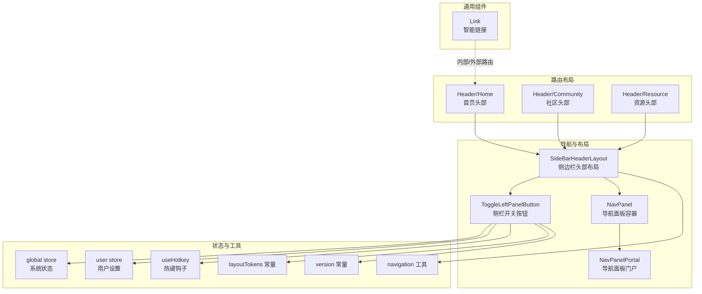
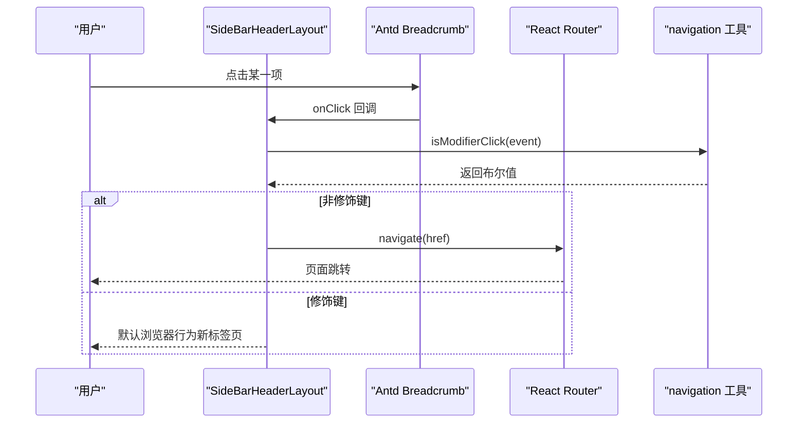
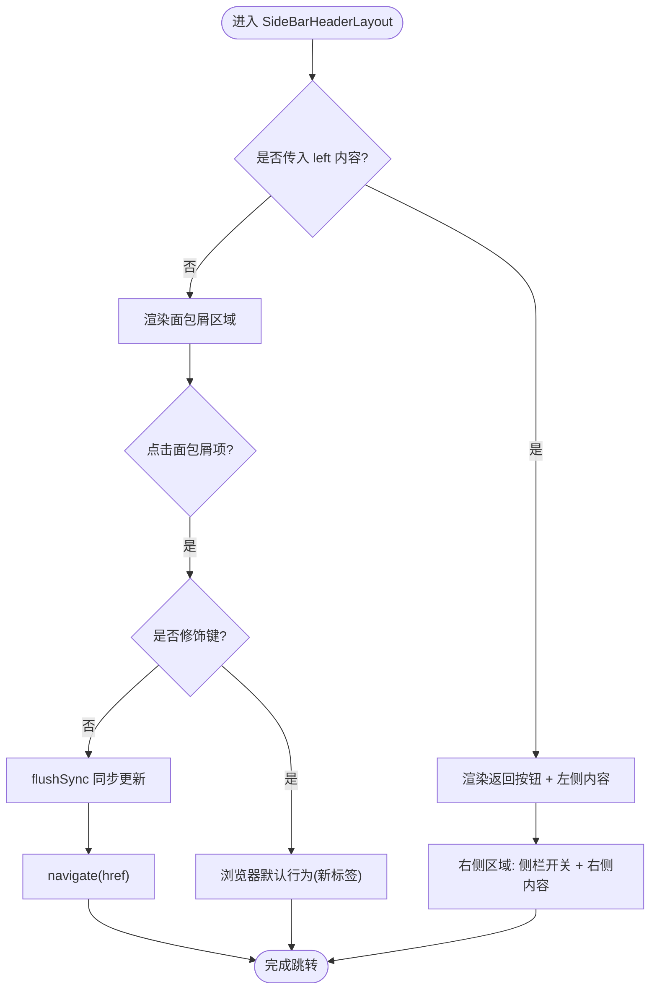
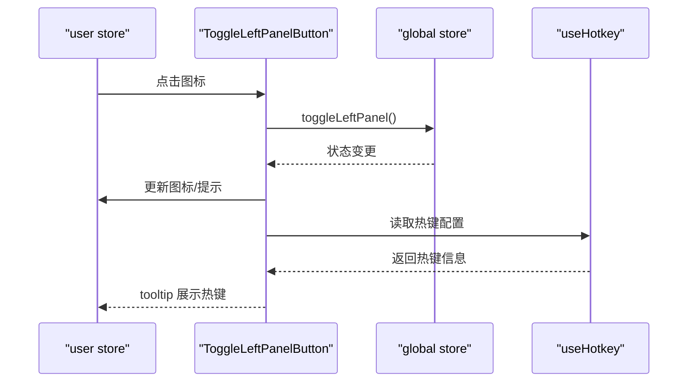
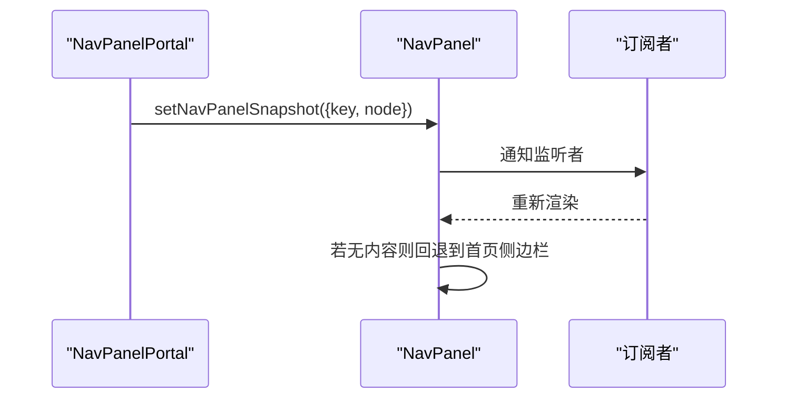
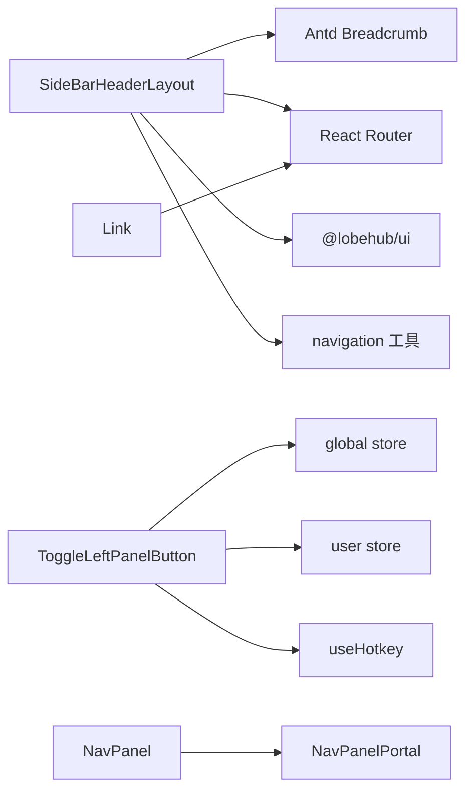

# 导航组件

<cite>
**本文引用的文件**
- [src/features/NavPanel/SideBarHeaderLayout.tsx](file://src/features/NavPanel/SideBarHeaderLayout.tsx)
- [src/routes/(main)/home/_layout/Header/index.tsx](file://src/routes/(main)/home/_layout/Header/index.tsx)
- [src/routes/(main)/community/_layout/Sidebar/Header/index.tsx](file://src/routes/(main)/community/_layout/Sidebar/Header/index.tsx)
- [src/routes/(main)/resource/(home)/_layout/Header/index.tsx](file://src/routes/(main)/resource/(home)/_layout/Header/index.tsx)
- [src/features/NavPanel/ToggleLeftPanelButton.tsx](file://src/features/NavPanel/ToggleLeftPanelButton.tsx)
- [src/features/NavPanel/index.tsx](file://src/features/NavPanel/index.tsx)
- [src/components/Link.tsx](file://src/components/Link.tsx)
- [src/utils/navigation.ts](file://src/utils/navigation.ts)
- [src/store/global/index.ts](file://src/store/global/index.ts)
- [src/store/user/index.ts](file://src/store/user/index.ts)
- [src/const/layoutTokens.ts](file://src/const/layoutTokens.ts)
- [src/const/version.ts](file://src/const/version.ts)
- [src/hooks/useHotkey.ts](file://src/hooks/useHotkey.ts)
- [src/types/hotkey.ts](file://src/types/hotkey.ts)
</cite>

## 目录

1. [简介](#简介)
2. [项目结构](#项目结构)
3. [核心组件](#核心组件)
4. [架构总览](#架构总览)
5. [详细组件分析](#详细组件分析)
6. [依赖分析](#依赖分析)
7. [性能考虑](#性能考虑)
8. [故障排查指南](#故障排查指南)
9. [结论](#结论)
10. [附录](#附录)

## 简介

本文件系统性梳理 LobeHub 的导航体系，覆盖页面导航与路径指示的关键组件：侧边栏头部布局（面包屑 / 返回按钮 / 侧栏开关）、顶部导航、侧边菜单、通用链接组件以及全局导航面板容器。文档将从架构、数据流、交互行为、可访问性与 SEO 角度进行深入解析，并提供多场景使用范式与最佳实践。

## 项目结构

导航相关代码主要分布在以下位置：

- 侧边栏头部布局与面包屑：features/NavPanel/SideBarHeaderLayout.tsx 及其在各路由布局中的使用
- 顶部导航与面包屑：routes/(main)/.../\_layout/Header 下的 Header 组件
- 侧栏开关按钮：features/NavPanel/ToggleLeftPanelButton.tsx
- 全局导航面板容器与门户：features/NavPanel/index.tsx
- 通用链接组件：components/Link.tsx
- 路由与导航工具：utils/navigation.ts
- 状态与热键：store/global、store/user、hooks/useHotkey.ts、types/hotkey.ts
- 布局常量：const/layoutTokens.ts、const/version.ts

图表来源

- [src/features/NavPanel/SideBarHeaderLayout.tsx](file://src/features/NavPanel/SideBarHeaderLayout.tsx#L1-L149)
- [src/features/NavPanel/ToggleLeftPanelButton.tsx](file://src/features/NavPanel/ToggleLeftPanelButton.tsx#L1-L54)
- [src/features/NavPanel/index.tsx](file://src/features/NavPanel/index.tsx#L1-L80)
- [src/routes/(main)/home/\_layout/Header/index.tsx](<file://src/routes/(main)/home/_layout/Header/index.tsx#L1-L20>)
- [src/routes/(main)/community/\_layout/Sidebar/Header/index.tsx](<file://src/routes/(main)/community/_layout/Sidebar/Header/index.tsx#L1-L28>)
- [src/routes/(main)/resource/(home)/\_layout/Header/index.tsx](<file://src/routes/(main)/resource/(home)/_layout/Header/index.tsx#L1-L28>)
- [src/components/Link.tsx](file://src/components/Link.tsx#L1-L34)
- [src/utils/navigation.ts](file://src/utils/navigation.ts)

章节来源

- [src/features/NavPanel/SideBarHeaderLayout.tsx](file://src/features/NavPanel/SideBarHeaderLayout.tsx#L1-L149)
- [src/features/NavPanel/ToggleLeftPanelButton.tsx](file://src/features/NavPanel/ToggleLeftPanelButton.tsx#L1-L54)
- [src/features/NavPanel/index.tsx](file://src/features/NavPanel/index.tsx#L1-L80)
- [src/routes/(main)/home/\_layout/Header/index.tsx](<file://src/routes/(main)/home/_layout/Header/index.tsx#L1-L20>)
- [src/routes/(main)/community/\_layout/Sidebar/Header/index.tsx](<file://src/routes/(main)/community/_layout/Sidebar/Header/index.tsx#L1-L28>)
- [src/routes/(main)/resource/(home)/\_layout/Header/index.tsx](<file://src/routes/(main)/resource/(home)/_layout/Header/index.tsx#L1-L28>)
- [src/components/Link.tsx](file://src/components/Link.tsx#L1-L34)

## 核心组件

- 侧边栏头部布局（SideBarHeaderLayout）
  - 功能：统一承载面包屑、返回按钮、右侧操作区与侧栏开关；支持自定义左侧内容或自动渲染面包屑。
  - 关键点：内置面包屑点击拦截与路由跳转；支持条件显示返回按钮与侧栏开关；桌面端样式差异处理。
- 侧栏开关按钮（ToggleLeftPanelButton）
  - 功能：切换左侧导航面板展开 / 收起；支持热键提示与图标状态切换。
  - 关键点：读取系统状态与用户热键配置；通过全局 store 切换面板。
- 导航面板容器（NavPanel）与门户（NavPanelPortal）
  - 功能：提供可插拔的右侧抽屉式导航面板；通过门户注入任意内容并触发过渡动画。
  - 关键点：基于 useSyncExternalStore 订阅快照；默认回退到首页侧边栏。
- 智能链接（Link）
  - 功能：区分内外链，自动选择原生 a 标签或 React Router Link。
  - 关键点：外部链接添加 noreferrer；内部路由使用 RouterLink。

章节来源

- [src/features/NavPanel/SideBarHeaderLayout.tsx](file://src/features/NavPanel/SideBarHeaderLayout.tsx#L47-L149)
- [src/features/NavPanel/ToggleLeftPanelButton.tsx](file://src/features/NavPanel/ToggleLeftPanelButton.tsx#L19-L54)
- [src/features/NavPanel/index.tsx](file://src/features/NavPanel/index.tsx#L10-L80)
- [src/components/Link.tsx](file://src/components/Link.tsx#L5-L34)

## 架构总览

导航体系采用 “布局组件 + 状态管理 + 工具函数” 的分层设计：

- 布局层：SideBarHeaderLayout、Header 路由布局、NavPanel 容器
- 状态层：global store（系统状态）、user store（用户设置 / 热键）
- 工具层：navigation 工具（修饰键判断）、useHotkey 钩子、常量（尺寸 / 平台）

图表来源

- [src/features/NavPanel/SideBarHeaderLayout.tsx](file://src/features/NavPanel/SideBarHeaderLayout.tsx#L104-L116)
- [src/utils/navigation.ts](file://src/utils/navigation.ts)

章节来源

- [src/features/NavPanel/SideBarHeaderLayout.tsx](file://src/features/NavPanel/SideBarHeaderLayout.tsx#L64-L119)
- [src/utils/navigation.ts](file://src/utils/navigation.ts)

## 详细组件分析

### 侧边栏头部布局（SideBarHeaderLayout）

- 层级关系
  - 顶层容器：水平布局，左右分区，右侧包含侧栏开关与自定义右侧内容
  - 左侧区域：可选返回按钮与左侧内容（字符串标题或自定义节点）
  - 面包屑区域：默认首页入口 + 自定义项；点击事件被拦截以执行客户端路由跳转
- 激活状态
  - 面包屑项本身不直接维护 “激活态”，但可通过路由状态与样式在上层逻辑中体现
- 路由集成
  - 使用 React Router 的 useNavigate 执行跳转；面包屑项的 href 字段作为目标路径
  - 通过 isModifierClick 判断是否使用浏览器默认行为（如 Cmd/Ctrl 点击在新标签打开）
- 交互行为
  - 面包屑点击：阻止默认事件，flushSync 同步更新，再执行 navigate
  - 返回按钮：根据 backTo 参数决定返回路径
  - 侧栏开关：右侧操作区条件渲染 ToggleLeftPanelButton
- 可访问性与 SEO
  - 面包屑使用语义化 ol/li 结构；为面包屑项提供 title 与 href，利于 SEO
  - 修饰键点击支持在新标签打开，提升可访问性
- 性能特性
  - 使用 memo 包裹减少重渲染
  - flushSync 在必要时同步更新，避免异步导致的闪烁

图表来源

- [src/features/NavPanel/SideBarHeaderLayout.tsx](file://src/features/NavPanel/SideBarHeaderLayout.tsx#L64-L144)

章节来源

- [src/features/NavPanel/SideBarHeaderLayout.tsx](file://src/features/NavPanel/SideBarHeaderLayout.tsx#L47-L149)

### 侧栏开关按钮（ToggleLeftPanelButton）

- 层级关系
  - 依赖 global store 获取当前面板展开状态
  - 依赖 user store 获取热键配置
  - 通过 ActionIcon 渲染图标与提示
- 激活状态
  - 图标随展开 / 收起状态切换；active 属性可显式控制高亮
- 路由集成
  - 通过 global store 的 toggleLeftPanel 方法切换状态
- 交互行为
  - 点击切换面板；tooltip 显示热键提示
- 可访问性
  - 提供 title 与 tooltip；结合 useHotkey 钩子实现键盘快捷键

图表来源

- [src/features/NavPanel/ToggleLeftPanelButton.tsx](file://src/features/NavPanel/ToggleLeftPanelButton.tsx#L27-L49)
- [src/store/global/index.ts](file://src/store/global/index.ts)
- [src/store/user/index.ts](file://src/store/user/index.ts)
- [src/hooks/useHotkey.ts](file://src/hooks/useHotkey.ts)
- [src/types/hotkey.ts](file://src/types/hotkey.ts)

章节来源

- [src/features/NavPanel/ToggleLeftPanelButton.tsx](file://src/features/NavPanel/ToggleLeftPanelButton.tsx#L19-L54)

### 导航面板容器与门户（NavPanel / NavPanelPortal）

- 层级关系
  - NavPanel：订阅外部快照，渲染当前活动内容；默认回退到首页侧边栏
  - NavPanelPortal：在布局中注入任意内容并触发过渡动画
- 激活状态
  - 通过 navKey 控制内容切换时的过渡效果
- 路由集成
  - 与路由布局配合，按需注入侧边栏或其它导航内容
- 交互行为
  - useLayoutEffect 在 children 变化时更新快照；保持旧内容直到新内容挂载完成

图表来源

- [src/features/NavPanel/index.tsx](file://src/features/NavPanel/index.tsx#L26-L79)

章节来源

- [src/features/NavPanel/index.tsx](file://src/features/NavPanel/index.tsx#L10-L80)

### 顶部导航与面包屑（Header 组件）

- 首页头部（Header/Home）
  - 使用 SideBarHeaderLayout，左侧为用户信息，右侧为添加按钮，关闭返回按钮
- 社区头部（Header/Community）
  - 传入面包屑项指向社区 tab
- 资源头部（Header/Resource）
  - 传入面包屑项指向资源 tab，并在下方渲染分类菜单

章节来源

- [src/routes/(main)/home/\_layout/Header/index.tsx](<file://src/routes/(main)/home/_layout/Header/index.tsx#L11-L18>)
- [src/routes/(main)/community/\_layout/Sidebar/Header/index.tsx](<file://src/routes/(main)/community/_layout/Sidebar/Header/index.tsx#L11-L26>)
- [src/routes/(main)/resource/(home)/\_layout/Header/index.tsx](<file://src/routes/(main)/resource/(home)/_layout/Header/index.tsx#L10-L26>)

### 智能链接（Link）

- 设计要点
  - 外链：使用原生 a 标签并添加 noreferrer
  - 内链：使用 React Router Link，确保 SPA 跳转
- 使用建议
  - 统一通过 Link 组件渲染所有可点击链接，保证一致性与可维护性

章节来源

- [src/components/Link.tsx](file://src/components/Link.tsx#L5-L34)

## 依赖分析

- 组件耦合
  - SideBarHeaderLayout 依赖 Ant Design 面包屑、@lobehub/ui 的 Flexbox/Icon/Text、React Router 的 useNavigate 与 flushSync
  - ToggleLeftPanelButton 依赖 global store 与 user store 的状态与热键配置
  - NavPanel 依赖 useSyncExternalStore 与 Portal 注入机制
- 外部依赖
  - Antd Breadcrumb、Lucide Icons、React Router
- 潜在循环依赖
  - 当前文件未见直接循环导入；注意在路由布局中对 NavPanel 的引用应避免反向依赖

图表来源

- [src/features/NavPanel/SideBarHeaderLayout.tsx](file://src/features/NavPanel/SideBarHeaderLayout.tsx#L1-L149)
- [src/features/NavPanel/ToggleLeftPanelButton.tsx](file://src/features/NavPanel/ToggleLeftPanelButton.tsx#L1-L54)
- [src/features/NavPanel/index.tsx](file://src/features/NavPanel/index.tsx#L1-L80)
- [src/components/Link.tsx](file://src/components/Link.tsx#L1-L34)

章节来源

- [src/features/NavPanel/SideBarHeaderLayout.tsx](file://src/features/NavPanel/SideBarHeaderLayout.tsx#L1-L149)
- [src/features/NavPanel/ToggleLeftPanelButton.tsx](file://src/features/NavPanel/ToggleLeftPanelButton.tsx#L1-L54)
- [src/features/NavPanel/index.tsx](file://src/features/NavPanel/index.tsx#L1-L80)
- [src/components/Link.tsx](file://src/components/Link.tsx#L1-L34)

## 性能考虑

- 渲染优化
  - 使用 memo 包裹高频组件（如 SideBarHeaderLayout、ToggleLeftPanelButton），减少不必要的重渲染
- 路由跳转
  - 面包屑点击使用 flushSync 同步更新，避免异步导致的闪烁；仅在必要时使用
- 状态订阅
  - NavPanel 使用 useSyncExternalStore 订阅快照，确保状态变化时及时响应
- 图标与样式
  - 使用静态样式与图标库，避免运行时计算开销

## 故障排查指南

- 面包屑点击无效
  - 检查面包屑项是否提供 href；确认 isModifierClick 判断逻辑未误拦截
  - 确认 flushSync 是否正确包裹 navigate 调用
- 新标签页打开异常
  - 确认修饰键判断逻辑；检查浏览器默认行为是否被阻止
- 侧栏开关不生效
  - 检查 global store 的 toggleLeftPanel 方法是否被调用
  - 确认用户热键配置是否正确加载
- 导航面板不显示内容
  - 检查 NavPanelPortal 是否正确注入内容与 navKey
  - 确认默认回退逻辑是否按预期工作

章节来源

- [src/features/NavPanel/SideBarHeaderLayout.tsx](file://src/features/NavPanel/SideBarHeaderLayout.tsx#L104-L116)
- [src/features/NavPanel/ToggleLeftPanelButton.tsx](file://src/features/NavPanel/ToggleLeftPanelButton.tsx#L27-L49)
- [src/features/NavPanel/index.tsx](file://src/features/NavPanel/index.tsx#L67-L79)

## 结论

LobeHub 的导航体系以 SideBarHeaderLayout 为核心，结合面包屑、返回按钮与侧栏开关，形成统一的页面路径指示与导航入口。通过 Link 组件实现内外链分流，NavPanel 提供灵活的内容注入能力。整体设计强调一致性、可访问性与性能，适合在多路由布局中复用。

## 附录

- 使用示例（路径与职责）
  - 首页头部：在 Header/Home 中组合 SideBarHeaderLayout 与顶部导航
  - 社区头部：在 Header/Community 中传入面包屑项
  - 资源头部：在 Header/Resource 中传入面包屑项并附加分类菜单
- 无障碍与 SEO 建议
  - 面包屑使用语义化结构；为关键链接提供 title 与描述
  - 支持修饰键在新标签打开，提升可访问性
  - Link 组件统一内外链处理，减少错误跳转
- 路由集成策略
  - 面包屑项使用 href 进行客户端路由跳转；避免服务端刷新
  - 通过 NavPanelPortal 实现按需注入导航内容，降低耦合
