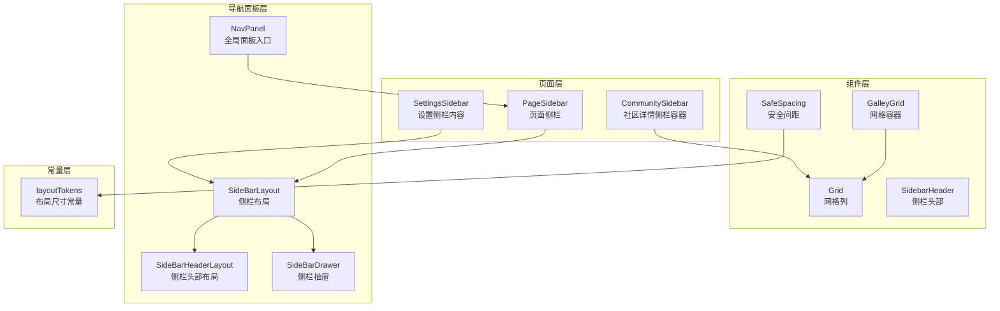
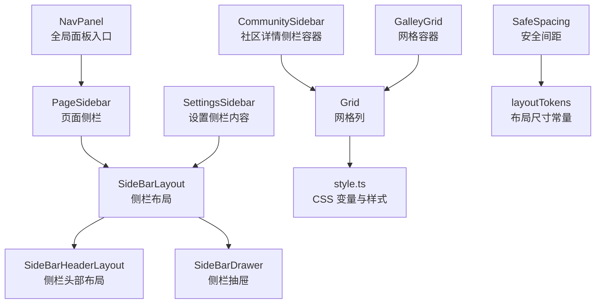
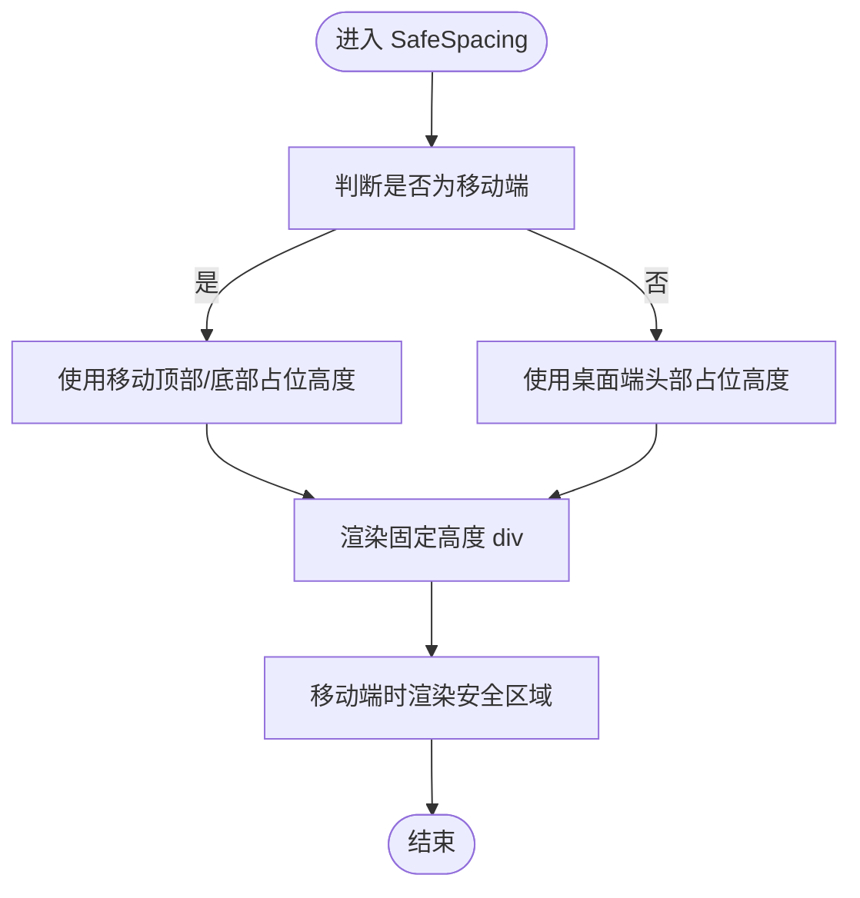
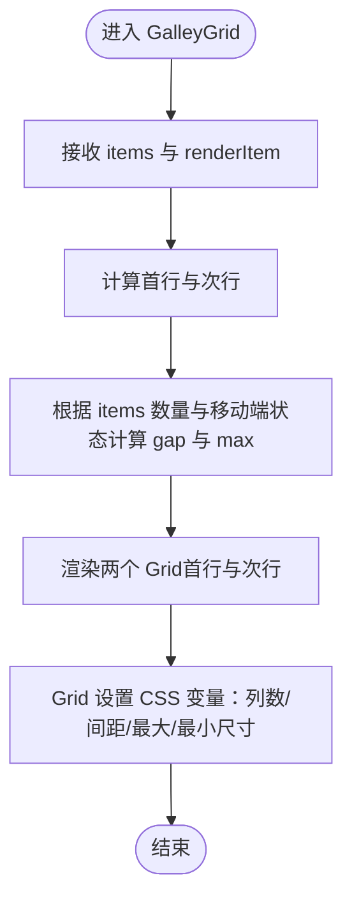
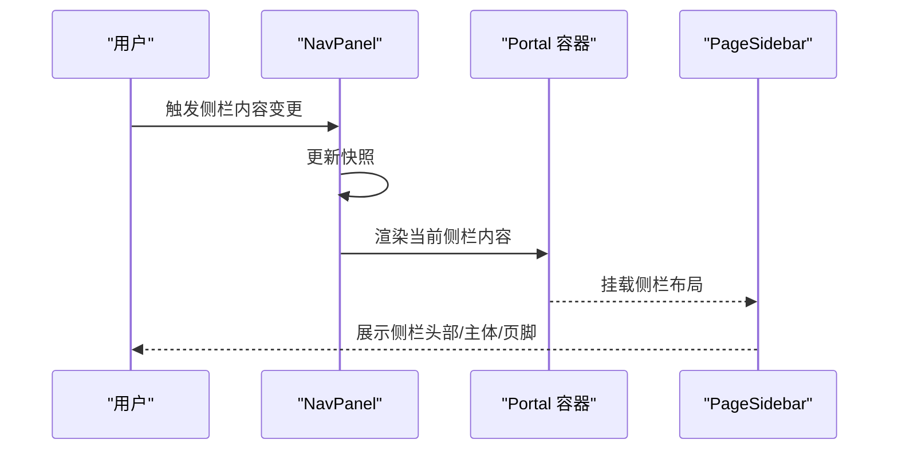
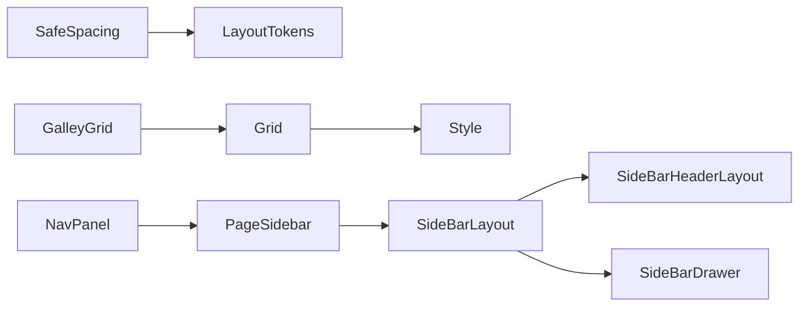

# 布局组件

<cite>
**本文引用的文件**
- [src/components/SafeSpacing/index.tsx](file://src/components/SafeSpacing/index.tsx)
- [packages/const/src/layoutTokens.ts](file://packages/const/src/layoutTokens.ts)
- [src/components/GalleyGrid/index.tsx](file://src/components/GalleyGrid/index.tsx)
- [src/components/GalleyGrid/Grid.tsx](file://src/components/GalleyGrid/Grid.tsx)
- [src/components/GalleyGrid/style.ts](file://src/components/GalleyGrid/style.ts)
- [src/components/SidebarHeader/index.tsx](file://src/components/SidebarHeader/index.tsx)
- [src/features/NavPanel/SideBarLayout.tsx](file://src/features/NavPanel/SideBarLayout.tsx)
- [src/features/NavPanel/SideBarHeaderLayout.tsx](file://src/features/NavPanel/SideBarHeaderLayout.tsx)
- [src/features/NavPanel/SideBarDrawer.tsx](file://src/features/NavPanel/SideBarDrawer.tsx)
- [src/features/NavPanel/index.tsx](file://src/features/NavPanel/index.tsx)
- [src/features/Pages/PageLayout/Sidebar.tsx](file://src/features/Pages/PageLayout/Sidebar.tsx)
- [src/routes/(main)/settings/_layout/SidebarContent.tsx](file://src/routes/(main)/settings/_layout/SidebarContent.tsx)
- [src/routes/(main)/community/(detail)/features/SidebarContainer.tsx](file://src/routes/(main)/community/(detail)/features/SidebarContainer.tsx)
</cite>

## 目录

1. [简介](#简介)
2. [项目结构](#项目结构)
3. [核心组件](#核心组件)
4. [架构总览](#架构总览)
5. [详细组件分析](#详细组件分析)
6. [依赖关系分析](#依赖关系分析)
7. [性能考量](#性能考量)
8. [故障排查指南](#故障排查指南)
9. [结论](#结论)
10. [附录](#附录)

## 简介

本文件聚焦于 LobeHub 的布局组件体系，系统性梳理页面布局与结构组织的关键能力，涵盖：

- 间距控制：安全区域与头部 / 底部占位
- 栅格系统：自适应网格容器与子项尺寸计算
- 导航头部：面包屑、返回按钮、侧栏开关等
- 侧边栏与抽屉：可拖拽侧栏面板、右侧抽屉容器
- 响应式行为：移动端与桌面端断点适配
- 主题与样式：基于 antd-style 的静态样式与 CSS 变量
- 性能与可维护性：Suspense 预加载骨架屏、滚动阴影、轻量状态管理

## 项目结构

围绕布局相关的核心目录与文件如下：

- 组件层：间距控制、网格系统、侧栏头部
- 导航面板层：侧栏布局、头部布局、抽屉容器、全局面板入口
- 页面层：页面侧栏挂载与路由侧栏内容
- 常量层：统一的布局尺寸与断点常量

图表来源

- [src/components/SafeSpacing/index.tsx](file://src/components/SafeSpacing/index.tsx#L1-L29)
- [src/components/GalleyGrid/index.tsx](file://src/components/GalleyGrid/index.tsx#L1-L63)
- [src/components/GalleyGrid/Grid.tsx](file://src/components/GalleyGrid/Grid.tsx#L1-L55)
- [src/components/SidebarHeader/index.tsx](file://src/components/SidebarHeader/index.tsx#L1-L43)
- [src/features/NavPanel/SideBarLayout.tsx](file://src/features/NavPanel/SideBarLayout.tsx#L1-L29)
- [src/features/NavPanel/SideBarHeaderLayout.tsx](file://src/features/NavPanel/SideBarHeaderLayout.tsx#L1-L149)
- [src/features/NavPanel/SideBarDrawer.tsx](file://src/features/NavPanel/SideBarDrawer.tsx#L1-L107)
- [src/features/NavPanel/index.tsx](file://src/features/NavPanel/index.tsx#L1-L80)
- [src/features/Pages/PageLayout/Sidebar.tsx](file://src/features/Pages/PageLayout/Sidebar.tsx#L1-L21)
- [src/routes/(main)/settings/\_layout/SidebarContent.tsx](<file://src/routes/(main)/settings/_layout/SidebarContent.tsx#L1-L12>)
- [src/routes/(main)/community/(detail)/features/SidebarContainer.tsx](<file://src/routes/(main)/community/(detail)/features/SidebarContainer.tsx#L1-L20>)
- [packages/const/src/layoutTokens.ts](file://packages/const/src/layoutTokens.ts#L1-L28)

章节来源

- [src/components/SafeSpacing/index.tsx](file://src/components/SafeSpacing/index.tsx#L1-L29)
- [src/components/GalleyGrid/index.tsx](file://src/components/GalleyGrid/index.tsx#L1-L63)
- [src/components/GalleyGrid/Grid.tsx](file://src/components/GalleyGrid/Grid.tsx#L1-L55)
- [src/components/GalleyGrid/style.ts](file://src/components/GalleyGrid/style.ts#L1-L30)
- [src/components/SidebarHeader/index.tsx](file://src/components/SidebarHeader/index.tsx#L1-L43)
- [src/features/NavPanel/SideBarLayout.tsx](file://src/features/NavPanel/SideBarLayout.tsx#L1-L29)
- [src/features/NavPanel/SideBarHeaderLayout.tsx](file://src/features/NavPanel/SideBarHeaderLayout.tsx#L1-L149)
- [src/features/NavPanel/SideBarDrawer.tsx](file://src/features/NavPanel/SideBarDrawer.tsx#L1-L107)
- [src/features/NavPanel/index.tsx](file://src/features/NavPanel/index.tsx#L1-L80)
- [src/features/Pages/PageLayout/Sidebar.tsx](file://src/features/Pages/PageLayout/Sidebar.tsx#L1-L21)
- [src/routes/(main)/settings/\_layout/SidebarContent.tsx](<file://src/routes/(main)/settings/_layout/SidebarContent.tsx#L1-L12>)
- [src/routes/(main)/community/(detail)/features/SidebarContainer.tsx](<file://src/routes/(main)/community/(detail)/features/SidebarContainer.tsx#L1-L20>)
- [packages/const/src/layoutTokens.ts](file://packages/const/src/layoutTokens.ts#L1-L28)

## 核心组件

- 安全间距 SafeSpacing：根据设备类型自动注入顶部或底部占位高度，并在移动设备上叠加安全区域，确保内容不被系统栏遮挡。
- 网格系统 GalleyGrid/Grid：基于 CSS Grid 的响应式网格容器，支持动态列数、间距与最大 / 最小单元尺寸，自动计算首行与次行布局。
- 侧栏头部 SidebarHeader：水平排列的标题与操作区，提供点击回调与内边距控制，适配侧栏头部交互。
- 侧栏布局 SideBarLayout：将头部、主体滚动区与页脚组合，使用滚动阴影与提示组包裹，提供骨架屏回退。
- 侧栏头部布局 SideBarHeaderLayout：面包屑导航、返回按钮、侧栏开关按钮与右侧操作区的统一布局。
- 侧栏抽屉 SideBarDrawer：右侧抽屉容器，承载侧栏内容并提供关闭动作与子头部区域。
- 全局面板 NavPanel：通过 Portal 将侧栏内容挂载到指定容器，支持动画过渡与拖拽交互。

章节来源

- [src/components/SafeSpacing/index.tsx](file://src/components/SafeSpacing/index.tsx#L1-L29)
- [src/components/GalleyGrid/index.tsx](file://src/components/GalleyGrid/index.tsx#L1-L63)
- [src/components/GalleyGrid/Grid.tsx](file://src/components/GalleyGrid/Grid.tsx#L1-L55)
- [src/components/SidebarHeader/index.tsx](file://src/components/SidebarHeader/index.tsx#L1-L43)
- [src/features/NavPanel/SideBarLayout.tsx](file://src/features/NavPanel/SideBarLayout.tsx#L1-L29)
- [src/features/NavPanel/SideBarHeaderLayout.tsx](file://src/features/NavPanel/SideBarHeaderLayout.tsx#L1-L149)
- [src/features/NavPanel/SideBarDrawer.tsx](file://src/features/NavPanel/SideBarDrawer.tsx#L1-L107)
- [src/features/NavPanel/index.tsx](file://src/features/NavPanel/index.tsx#L1-L80)

## 架构总览

下图展示了从页面到导航面板的整体布局架构，以及各组件之间的依赖关系与数据流。

图表来源

- [src/features/Pages/PageLayout/Sidebar.tsx](file://src/features/Pages/PageLayout/Sidebar.tsx#L1-L21)
- [src/routes/(main)/settings/\_layout/SidebarContent.tsx](<file://src/routes/(main)/settings/_layout/SidebarContent.tsx#L1-L12>)
- [src/routes/(main)/community/(detail)/features/SidebarContainer.tsx](<file://src/routes/(main)/community/(detail)/features/SidebarContainer.tsx#L1-L20>)
- [src/features/NavPanel/SideBarLayout.tsx](file://src/features/NavPanel/SideBarLayout.tsx#L1-L29)
- [src/features/NavPanel/SideBarHeaderLayout.tsx](file://src/features/NavPanel/SideBarHeaderLayout.tsx#L1-L149)
- [src/features/NavPanel/SideBarDrawer.tsx](file://src/features/NavPanel/SideBarDrawer.tsx#L1-L107)
- [src/features/NavPanel/index.tsx](file://src/features/NavPanel/index.tsx#L1-L80)
- [src/components/SafeSpacing/index.tsx](file://src/components/SafeSpacing/index.tsx#L1-L29)
- [packages/const/src/layoutTokens.ts](file://packages/const/src/layoutTokens.ts#L1-L28)
- [src/components/GalleyGrid/index.tsx](file://src/components/GalleyGrid/index.tsx#L1-L63)
- [src/components/GalleyGrid/Grid.tsx](file://src/components/GalleyGrid/Grid.tsx#L1-L55)
- [src/components/GalleyGrid/style.ts](file://src/components/GalleyGrid/style.ts#L1-L30)

## 详细组件分析

### 安全间距 SafeSpacing

- 功能：根据是否为移动端自动选择顶部或底部占位高度；在移动端叠加安全区域，避免内容被系统栏遮挡。
- 关键点：
  - 支持 position 参数（顶部 / 底部）与 mobile 开关
  - 默认高度来自统一布局常量
  - 在移动设备上渲染安全区域组件
- 响应式行为：通过传入的 mobile 判断，自动切换顶部或底部占位高度
- 主题集成：与 antd-style 的变量体系配合，保证背景与边框一致

图表来源

- [src/components/SafeSpacing/index.tsx](file://src/components/SafeSpacing/index.tsx#L1-L29)
- [packages/const/src/layoutTokens.ts](file://packages/const/src/layoutTokens.ts#L1-L28)

章节来源

- [src/components/SafeSpacing/index.tsx](file://src/components/SafeSpacing/index.tsx#L1-L29)
- [packages/const/src/layoutTokens.ts](file://packages/const/src/layoutTokens.ts#L1-L28)

### 网格系统 GalleyGrid 与 Grid

- 功能：响应式网格容器，支持动态列数、间距与单元尺寸，自动拆分首行与次行，计算最大 / 最小单元尺寸。
- 关键点：
  - GalleyGrid 负责整体布局与行拆分逻辑
  - Grid 使用 CSS 变量控制列数、间距、最大 / 最小尺寸
  - 样式通过 createStaticStyles 生成，确保性能与一致性
- 响应式行为：移动端与桌面端的最大 / 最小单元尺寸不同，间距也按断点调整
- 嵌套规则：Grid 内部为 CSS Grid，子项宽度与高度由 CSS 变量与重复列数共同决定

图表来源

- [src/components/GalleyGrid/index.tsx](file://src/components/GalleyGrid/index.tsx#L1-L63)
- [src/components/GalleyGrid/Grid.tsx](file://src/components/GalleyGrid/Grid.tsx#L1-L55)
- [src/components/GalleyGrid/style.ts](file://src/components/GalleyGrid/style.ts#L1-L30)

章节来源

- [src/components/GalleyGrid/index.tsx](file://src/components/GalleyGrid/index.tsx#L1-L63)
- [src/components/GalleyGrid/Grid.tsx](file://src/components/GalleyGrid/Grid.tsx#L1-L55)
- [src/components/GalleyGrid/style.ts](file://src/components/GalleyGrid/style.ts#L1-L30)

### 侧栏头部 SidebarHeader

- 功能：水平排列的标题与操作区，支持点击回调与内边距控制，适配侧栏头部交互。
- 关键点：
  - 使用 Flexbox 水平布局，两端分布
  - 提供 actions 区域与 onClick 回调
  - 内置默认内边距与对齐方式，便于复用

章节来源

- [src/components/SidebarHeader/index.tsx](file://src/components/SidebarHeader/index.tsx#L1-L43)

### 侧栏布局 SideBarLayout

- 功能：将头部、主体滚动区与页脚组合，提供骨架屏回退与滚动阴影。
- 关键点：
  - 头部与页脚使用 Suspense 加载骨架屏
  - 主体使用 ScrollShadow 实现滚动阴影
  - TooltipGroup 包裹主体，提升交互体验

章节来源

- [src/features/NavPanel/SideBarLayout.tsx](file://src/features/NavPanel/SideBarLayout.tsx#L1-L29)

### 侧栏头部布局 SideBarHeaderLayout

- 功能：面包屑导航、返回按钮、侧栏开关按钮与右侧操作区的统一布局。
- 关键点：
  - 支持自定义面包屑与返回路径
  - 左侧支持字符串标题与节点两种形式
  - 右侧支持返回按钮与自定义操作区

章节来源

- [src/features/NavPanel/SideBarHeaderLayout.tsx](file://src/features/NavPanel/SideBarHeaderLayout.tsx#L1-L149)

### 侧栏抽屉 SideBarDrawer

- 功能：右侧抽屉容器，承载侧栏内容并提供关闭动作与子头部区域。
- 关键点：
  - 使用 Ant Design Drawer，左侧面板
  - 通过 Portal 容器挂载，绝对定位与阴影效果
  - 标题区集成侧栏头部布局与关闭按钮

章节来源

- [src/features/NavPanel/SideBarDrawer.tsx](file://src/features/NavPanel/SideBarDrawer.tsx#L1-L107)

### 全局面板 NavPanel 与页面侧栏

- 功能：NavPanel 作为全局入口，通过 Portal 将侧栏内容挂载到指定容器；页面侧栏负责在路由中渲染侧栏布局。
- 关键点：
  - NavPanel 使用 useSyncExternalStore 订阅快照，支持动画过渡
  - PageSidebar 与 SettingsSidebar 分别在不同页面挂载侧栏布局
  - CommunitySidebar 提供社区详情的侧栏容器

图表来源

- [src/features/NavPanel/index.tsx](file://src/features/NavPanel/index.tsx#L1-L80)
- [src/features/Pages/PageLayout/Sidebar.tsx](file://src/features/Pages/PageLayout/Sidebar.tsx#L1-L21)
- [src/routes/(main)/settings/\_layout/SidebarContent.tsx](<file://src/routes/(main)/settings/_layout/SidebarContent.tsx#L1-L12>)
- [src/routes/(main)/community/(detail)/features/SidebarContainer.tsx](<file://src/routes/(main)/community/(detail)/features/SidebarContainer.tsx#L1-L20>)

章节来源

- [src/features/NavPanel/index.tsx](file://src/features/NavPanel/index.tsx#L1-L80)
- [src/features/Pages/PageLayout/Sidebar.tsx](file://src/features/Pages/PageLayout/Sidebar.tsx#L1-L21)
- [src/routes/(main)/settings/\_layout/SidebarContent.tsx](<file://src/routes/(main)/settings/_layout/SidebarContent.tsx#L1-L12>)
- [src/routes/(main)/community/(detail)/features/SidebarContainer.tsx](<file://src/routes/(main)/community/(detail)/features/SidebarContainer.tsx#L1-L20>)

## 依赖关系分析

- 组件耦合与内聚：
  - SafeSpacing 与 layoutTokens 强耦合，确保跨平台一致的高度策略
  - GalleyGrid 与 Grid 通过 CSS 变量解耦，便于样式与布局分离
  - 侧栏系列组件通过 NavPanel 进行统一入口管理，降低页面级重复逻辑
- 外部依赖：
  - @lobehub/ui 提供 Flexbox、ScrollShadow、TooltipGroup 等基础布局能力
  - antd-style 提供 createStaticStyles 与 cssVar，支撑主题与样式系统
  - Ant Design Drawer 提供抽屉容器
- 潜在循环依赖：
  - 侧栏布局与头部布局相互协作，但未见直接循环导入
  - NavPanel 通过 Portal 间接依赖页面侧栏，无循环

图表来源

- [src/components/SafeSpacing/index.tsx](file://src/components/SafeSpacing/index.tsx#L1-L29)
- [packages/const/src/layoutTokens.ts](file://packages/const/src/layoutTokens.ts#L1-L28)
- [src/components/GalleyGrid/index.tsx](file://src/components/GalleyGrid/index.tsx#L1-L63)
- [src/components/GalleyGrid/Grid.tsx](file://src/components/GalleyGrid/Grid.tsx#L1-L55)
- [src/components/GalleyGrid/style.ts](file://src/components/GalleyGrid/style.ts#L1-L30)
- [src/features/NavPanel/SideBarLayout.tsx](file://src/features/NavPanel/SideBarLayout.tsx#L1-L29)
- [src/features/NavPanel/SideBarHeaderLayout.tsx](file://src/features/NavPanel/SideBarHeaderLayout.tsx#L1-L149)
- [src/features/NavPanel/SideBarDrawer.tsx](file://src/features/NavPanel/SideBarDrawer.tsx#L1-L107)
- [src/features/NavPanel/index.tsx](file://src/features/NavPanel/index.tsx#L1-L80)
- [src/features/Pages/PageLayout/Sidebar.tsx](file://src/features/Pages/PageLayout/Sidebar.tsx#L1-L21)

章节来源

- [src/components/SafeSpacing/index.tsx](file://src/components/SafeSpacing/index.tsx#L1-L29)
- [src/components/GalleyGrid/index.tsx](file://src/components/GalleyGrid/index.tsx#L1-L63)
- [src/components/GalleyGrid/Grid.tsx](file://src/components/GalleyGrid/Grid.tsx#L1-L55)
- [src/components/GalleyGrid/style.ts](file://src/components/GalleyGrid/style.ts#L1-L30)
- [src/features/NavPanel/SideBarLayout.tsx](file://src/features/NavPanel/SideBarLayout.tsx#L1-L29)
- [src/features/NavPanel/SideBarHeaderLayout.tsx](file://src/features/NavPanel/SideBarHeaderLayout.tsx#L1-L149)
- [src/features/NavPanel/SideBarDrawer.tsx](file://src/features/NavPanel/SideBarDrawer.tsx#L1-L107)
- [src/features/NavPanel/index.tsx](file://src/features/NavPanel/index.tsx#L1-L80)
- [src/features/Pages/PageLayout/Sidebar.tsx](file://src/features/Pages/PageLayout/Sidebar.tsx#L1-L21)

## 性能考量

- 骨架屏与懒加载：侧栏布局使用 Suspense 对头部、主体与页脚进行回退，减少白屏时间，提升感知性能。
- 滚动阴影：主体区域使用 ScrollShadow，仅在滚动时显示阴影，避免不必要的重绘。
- 样式优化：Grid 使用 CSS 变量与静态样式，减少运行时样式计算，提高渲染效率。
- 移动端适配：SafeSpacing 自动区分顶部 / 底部占位，避免额外的条件判断与重排。
- 抽屉挂载：SideBarDrawer 通过 Portal 挂载到指定容器，减少 DOM 层级，降低布局抖动。

## 故障排查指南

- 侧栏内容不显示
  - 检查 NavPanel 是否正确订阅快照并渲染 Portal 容器
  - 确认页面侧栏是否已挂载到 NavPanel
- 抽屉无法关闭或位置异常
  - 检查 SideBarDrawer 的容器 ID 与 getContainer 配置
  - 确认 rootStyle 与 styles 中的定位与阴影配置
- 移动端内容被系统栏遮挡
  - 检查 SafeSpacing 的 mobile 参数与 position
  - 确认移动端占位高度与安全区域是否生效
- 网格布局错乱
  - 检查 GalleyGrid 的 items 数量与行拆分逻辑
  - 确认 Grid 的 CSS 变量是否正确传递（列数、间距、最大 / 最小尺寸）

章节来源

- [src/features/NavPanel/index.tsx](file://src/features/NavPanel/index.tsx#L1-L80)
- [src/features/NavPanel/SideBarDrawer.tsx](file://src/features/NavPanel/SideBarDrawer.tsx#L1-L107)
- [src/components/SafeSpacing/index.tsx](file://src/components/SafeSpacing/index.tsx#L1-L29)
- [src/components/GalleyGrid/index.tsx](file://src/components/GalleyGrid/index.tsx#L1-L63)
- [src/components/GalleyGrid/Grid.tsx](file://src/components/GalleyGrid/Grid.tsx#L1-L55)

## 结论

LobeHub 的布局组件以 “统一常量 + 组件化 + 抽象容器” 的方式构建，兼顾了响应式、主题与性能需求。通过 SafeSpacing、GalleyGrid、SidebarHeader、SideBarLayout、SideBarHeaderLayout、SideBarDrawer 与 NavPanel 的协同，实现了从页面到导航面板的一致布局体验。建议在扩展新布局场景时遵循现有模式：以常量驱动尺寸、以 Flexbox 与 CSS Grid 组织结构、以 Suspense 提升用户体验、以 Portal 解耦挂载点。

## 附录

- 设计原则
  - 以统一布局常量驱动尺寸与断点，确保跨端一致性
  - 使用 Flexbox 与 CSS Grid 组织结构，优先语义化容器
  - 通过 Suspense 与骨架屏提升感知性能
  - 通过 Portal 与状态订阅实现可复用的面板容器
- 响应式最佳实践
  - 移动端优先：优先考虑小屏与安全区域
  - 间距与留白：使用统一的间距常量，避免硬编码
  - 图片与卡片：使用网格系统自动计算列数与单元尺寸
  - 滚动与阴影：仅在必要时启用，避免过度重绘
- 主题集成要点
  - 使用 antd-style 的 cssVar 获取主题变量
  - 静态样式与 CSS 变量结合，确保主题切换时的稳定性
