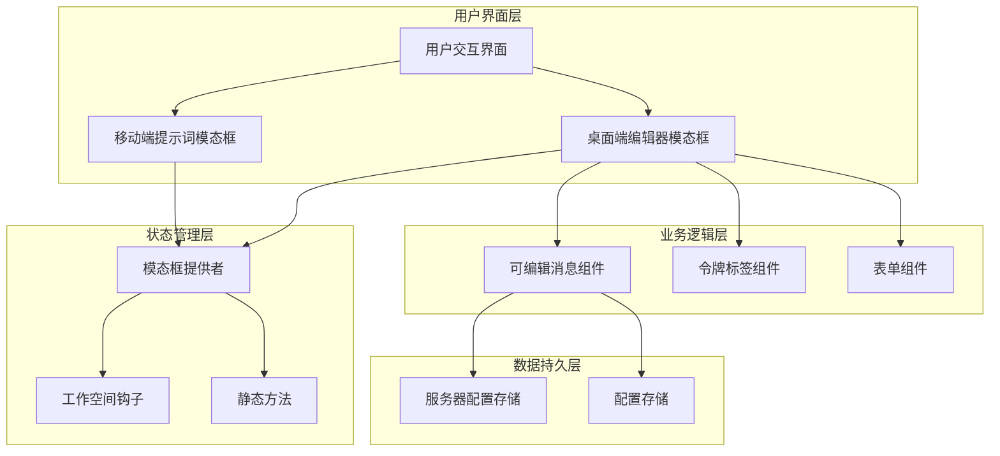
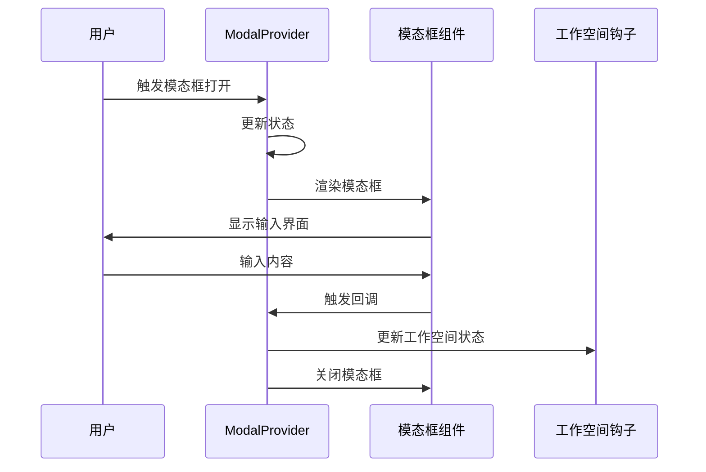
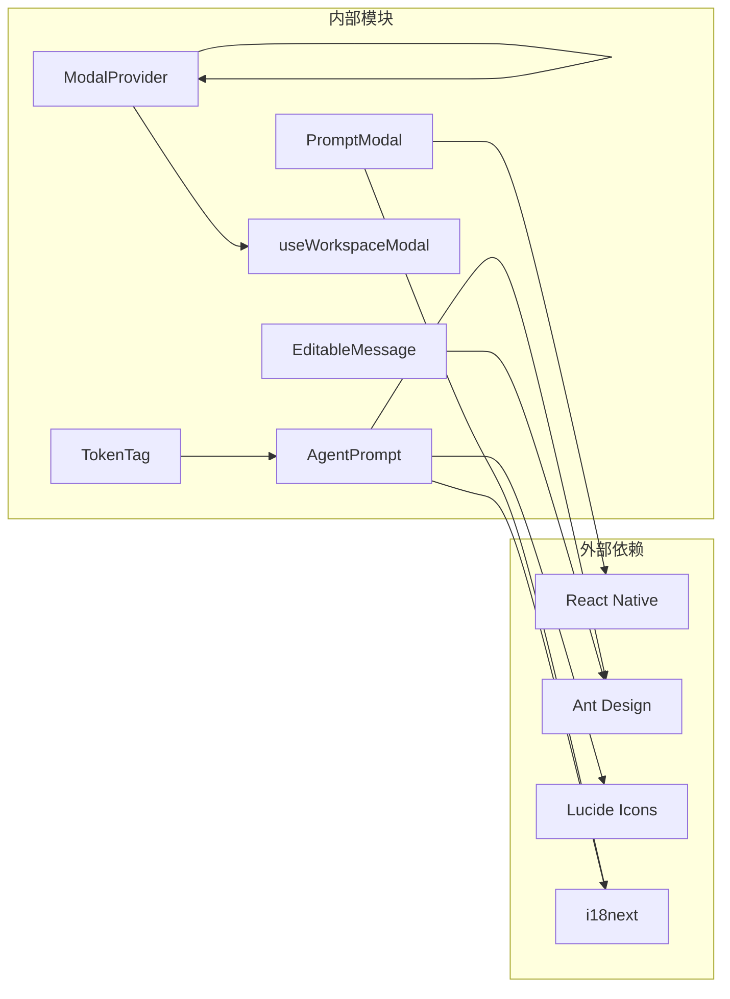

# 提示词模态框组件

<cite>
**本文档引用的文件**
- [PromptModal.tsx](file://apps/mobile/src/components/ui/PromptModal.tsx)
- [AgentPrompt/index.tsx](file://src/features/AgentSetting/AgentPrompt/index.tsx)
- [ModalProvider.tsx](file://src/routes/(main)/home/_layout/Body/Agent/ModalProvider.tsx)
- [SKILL.md](file://.agents/skills/modal/SKILL.md)
- [AntdStaticMethods/index.tsx](file://src/components/AntdStaticMethods/index.tsx)
- [useWorkspaceModal.tsx](file://src/hooks/useWorkspaceModal.tsx)
</cite>

## 目录
1. [简介](#简介)
2. [项目结构](#项目结构)
3. [核心组件](#核心组件)
4. [架构概览](#架构概览)
5. [详细组件分析](#详细组件分析)
6. [依赖关系分析](#依赖关系分析)
7. [性能考虑](#性能考虑)
8. [故障排除指南](#故障排除指南)
9. [结论](#结论)

## 简介

提示词模态框组件是 LobeHub 项目中的一个重要功能模块，主要用于处理用户输入的提示词或配置信息。该组件提供了两种主要实现方式：移动端的原生 PromptModal 和桌面端的编辑器模态框。

该组件支持多种输入类型，包括文本输入、数字输入等，并提供了完整的国际化支持和响应式设计。组件采用现代化的 React Hooks 架构，确保了良好的用户体验和可维护性。

## 项目结构

提示词模态框组件在项目中的组织结构如下：

```mermaid
graph TB
subgraph "移动端"
MobilePrompt[apps/mobile/src/components/ui/PromptModal.tsx]
end
subgraph "桌面端"
AgentPrompt[src/features/AgentSetting/AgentPrompt/index.tsx]
ModalProvider[src/routes/(main)/home/_layout/Body/Agent/ModalProvider.tsx]
end
subgraph "通用工具"
AntdStatic[src/components/AntdStaticMethods/index.tsx]
WorkspaceHook[src/hooks/useWorkspaceModal.tsx]
ModalSkill[.agents/skills/modal/SKILL.md]
end
MobilePrompt --> AntdStatic
AgentPrompt --> ModalProvider
ModalProvider --> AntdStatic
WorkspaceHook --> ModalProvider
ModalSkill --> AgentPrompt
```

**图表来源**
- [PromptModal.tsx:1-91](file://apps/mobile/src/components/ui/PromptModal.tsx#L1-L91)
- [AgentPrompt/index.tsx:1-79](file://src/features/AgentSetting/AgentPrompt/index.tsx#L1-L79)
- [ModalProvider.tsx](file://src/routes/(main)/home/_layout/Body/Agent/ModalProvider.tsx#L1-L148)

**章节来源**
- [PromptModal.tsx:1-91](file://apps/mobile/src/components/ui/PromptModal.tsx#L1-L91)
- [AgentPrompt/index.tsx:1-79](file://src/features/AgentSetting/AgentPrompt/index.tsx#L1-L79)
- [ModalProvider.tsx](file://src/routes/(main)/home/_layout/Body/Agent/ModalProvider.tsx#L1-L148)

## 核心组件

### 移动端提示词模态框 (PromptModal)

移动端的 PromptModal 是一个专门用于处理用户输入的模态框组件，具有以下特点：

- **原生 React Native 实现**：使用原生组件构建，提供最佳的移动体验
- **多键盘类型支持**：支持默认、数字、小数等多种键盘布局
- **自动焦点管理**：模态框打开时自动聚焦到输入框
- **完整的样式系统**：使用 Tailwind CSS 类名进行样式控制

### 桌面端编辑器模态框 (AgentPrompt)

桌面端的 AgentPrompt 组件集成了高级编辑功能：

- **可编辑消息组件**：支持 Markdown 编辑和预览
- **令牌标签系统**：显示和管理系统角色令牌
- **响应式设计**：适配不同屏幕尺寸
- **国际化支持**：完整的多语言支持

**章节来源**
- [PromptModal.tsx:18-91](file://apps/mobile/src/components/ui/PromptModal.tsx#L18-L91)
- [AgentPrompt/index.tsx:15-79](file://src/features/AgentSetting/AgentPrompt/index.tsx#L15-L79)

## 架构概览

提示词模态框组件的整体架构采用分层设计，确保了组件间的松耦合和高内聚：



**图表来源**
- [ModalProvider.tsx](file://src/routes/(main)/home/_layout/Body/Agent/ModalProvider.tsx#L51-L147)
- [AgentPrompt/index.tsx:15-79](file://src/features/AgentSetting/AgentPrompt/index.tsx#L15-L79)
- [AntdStaticMethods/index.tsx:15-23](file://src/components/AntdStaticMethods/index.tsx#L15-L23)

## 详细组件分析

### PromptModal 组件分析

PromptModal 是移动端的核心组件，采用了函数式组件的设计模式：

```mermaid
classDiagram
class PromptModal {
+boolean visible
+string title
+string placeholder
+string defaultValue
+string submitLabel
+string keyboardType
+function onCancel
+function onSubmit
+useState value
+useRef inputRef
+useEffect setupFocus
+handleSubmit() void
}
class PromptModalProps {
+boolean visible
+string title
+string placeholder
+string defaultValue
+string submitLabel
+string keyboardType
+function onCancel
+function onSubmit
}
PromptModal --> PromptModalProps : "接收参数"
PromptModal --> "React Native" : "使用"
```

**图表来源**
- [PromptModal.tsx:7-27](file://apps/mobile/src/components/ui/PromptModal.tsx#L7-L27)

#### 核心功能特性

1. **状态管理**：使用 useState 管理输入值状态
2. **生命周期处理**：通过 useEffect 处理模态框打开时的焦点设置
3. **事件处理**：提供取消和提交回调函数
4. **输入验证**：确保提交的值不为空

**章节来源**
- [PromptModal.tsx:18-91](file://apps/mobile/src/components/ui/PromptModal.tsx#L18-L91)

### AgentPrompt 组件分析

AgentPrompt 是桌面端的高级组件，集成了多个复杂的功能：

```mermaid
classDiagram
class AgentPrompt {
+boolean editing
+string systemRole
+useTranslation t
+useServerConfigStore isMobile
+useState editing
+updateConfig() void
+setEditing() void
}
class EditableMessage {
+boolean editing
+string value
+string placeholder
+object markdownProps
+onChange() void
+onEditingChange() void
}
class TokenTag {
+string value
+renderTokens() JSX
}
AgentPrompt --> EditableMessage : "包含"
AgentPrompt --> TokenTag : "包含"
EditableMessage --> "Markdown 编辑器" : "使用"
```

**图表来源**
- [AgentPrompt/index.tsx:15-79](file://src/features/AgentSetting/AgentPrompt/index.tsx#L15-L79)

#### 高级功能特性

1. **可编辑消息**：支持实时编辑和预览
2. **令牌系统**：动态解析和显示系统角色令牌
3. **响应式布局**：根据设备类型调整界面布局
4. **国际化集成**：完整的多语言支持

**章节来源**
- [AgentPrompt/index.tsx:15-79](file://src/features/AgentSetting/AgentPrompt/index.tsx#L15-L79)

### 模态框提供者分析

ModalProvider 负责管理所有模态框的状态和生命周期：



**图表来源**
- [ModalProvider.tsx](file://src/routes/(main)/home/_layout/Body/Agent/ModalProvider.tsx#L69-L97)

**章节来源**
- [ModalProvider.tsx](file://src/routes/(main)/home/_layout/Body/Agent/ModalProvider.tsx#L51-L147)

## 依赖关系分析

提示词模态框组件之间的依赖关系如下：



**图表来源**
- [PromptModal.tsx:1-6](file://apps/mobile/src/components/ui/PromptModal.tsx#L1-L6)
- [AgentPrompt/index.tsx:3-7](file://src/features/AgentSetting/AgentPrompt/index.tsx#L3-L7)

### 关键依赖说明

1. **React Native**：移动端的基础框架
2. **Ant Design**：桌面端的 UI 组件库
3. **i18next**：国际化解决方案
4. **Lucide Icons**：图标库
5. **自定义钩子**：状态管理和业务逻辑

**章节来源**
- [AntdStaticMethods/index.tsx:1-23](file://src/components/AntdStaticMethods/index.tsx#L1-L23)
- [useWorkspaceModal.tsx:1-27](file://src/hooks/useWorkspaceModal.tsx#L1-L27)

## 性能考虑

提示词模态框组件在设计时充分考虑了性能优化：

### 内存管理
- 使用 React.memo 优化组件重渲染
- 合理的 useState 使用避免不必要的状态更新
- useRef 优化 DOM 访问性能

### 渲染优化
- 条件渲染减少不必要的组件创建
- 动态导入优化初始加载时间
- 响应式设计减少重复计算

### 用户体验优化
- 自动焦点管理提升交互效率
- 平滑的动画过渡效果
- 错误处理和状态反馈

## 故障排除指南

### 常见问题及解决方案

#### 模态框无法关闭
**问题描述**：模态框打开后无法通过点击外部区域关闭
**解决方案**：
1. 检查 onRequestClose 回调函数是否正确设置
2. 验证 visible 状态的双向绑定
3. 确认父组件的事件处理逻辑

#### 输入框焦点问题
**问题描述**：模态框打开时输入框没有自动聚焦
**解决方案**：
1. 检查 useEffect 中的定时器设置
2. 验证 ref 的正确使用
3. 确认组件挂载顺序

#### 国际化显示异常
**问题描述**：模态框中的文本没有正确翻译
**解决方案**：
1. 检查 i18n 配置文件
2. 验证命名空间的正确使用
3. 确认翻译键的存在

**章节来源**
- [PromptModal.tsx:33-38](file://apps/mobile/src/components/ui/PromptModal.tsx#L33-L38)
- [AgentPrompt/index.tsx:16-17](file://src/features/AgentSetting/AgentPrompt/index.tsx#L16-L17)

## 结论

提示词模态框组件展现了现代前端开发的最佳实践，通过精心设计的架构和丰富的功能特性，为用户提供了优秀的交互体验。

### 主要优势

1. **跨平台兼容性**：同时支持移动端和桌面端
2. **高度可定制**：灵活的配置选项满足不同需求
3. **性能优化**：经过优化的渲染和状态管理
4. **国际化支持**：完整的多语言解决方案
5. **可维护性**：清晰的代码结构和文档

### 技术亮点

- 函数式组件设计模式
- Hooks 状态管理
- 组件化架构
- 响应式设计
- 类型安全

该组件为 LobeHub 项目提供了强大的提示词管理能力，是整个应用生态系统中不可或缺的重要组成部分。