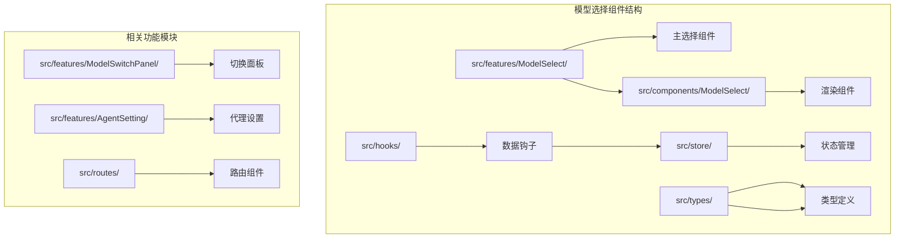
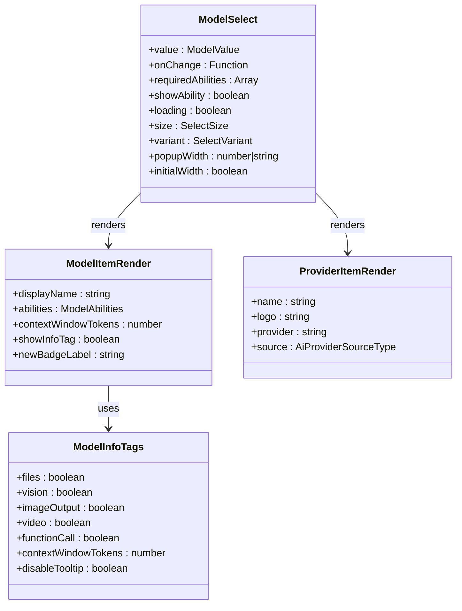
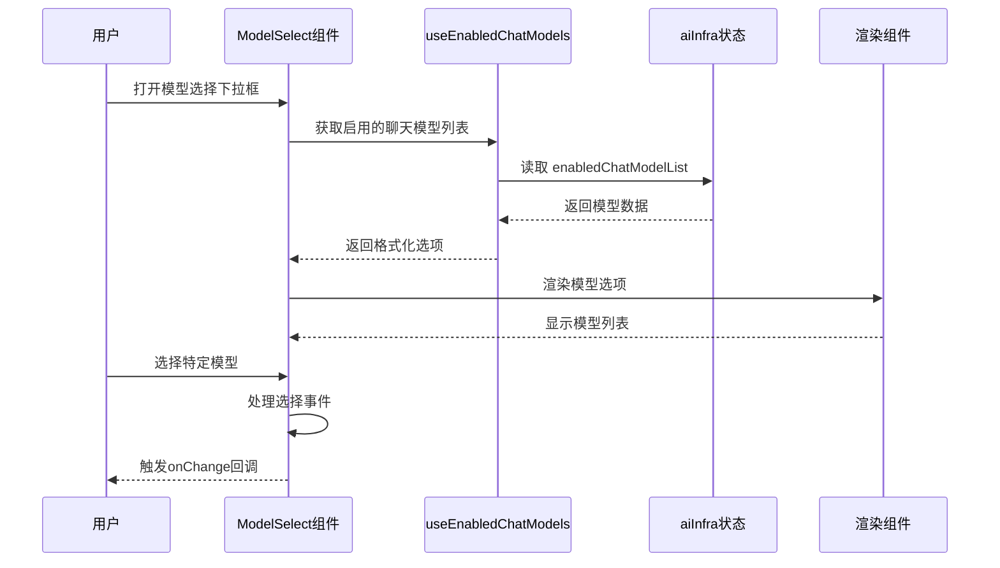
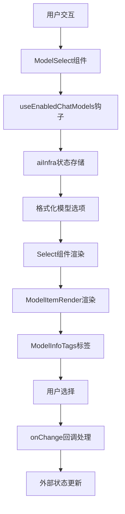
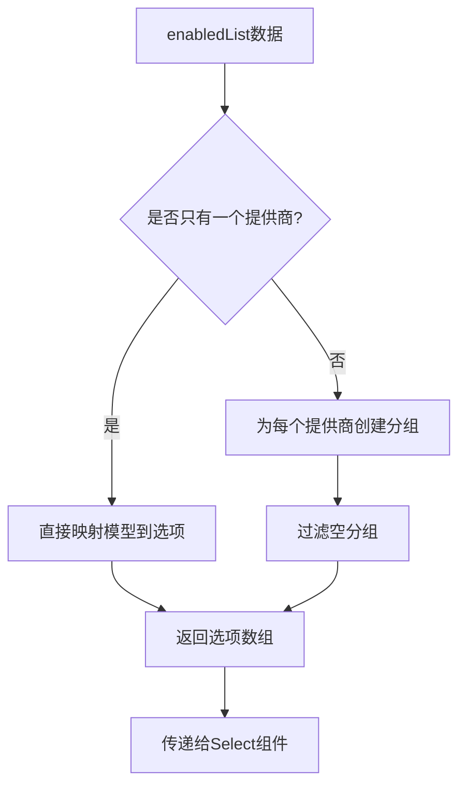
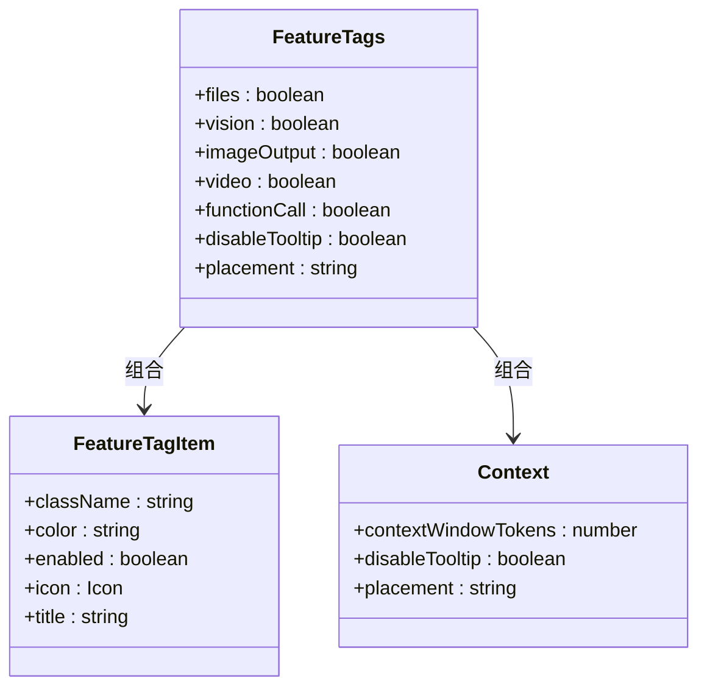
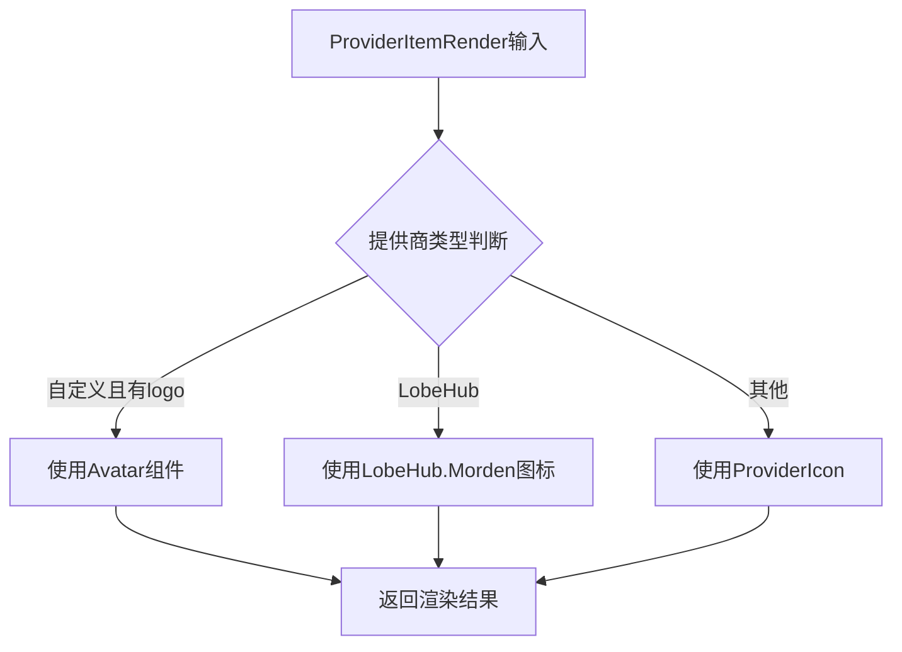
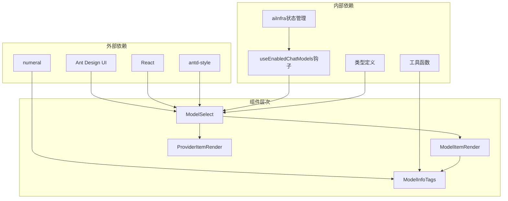
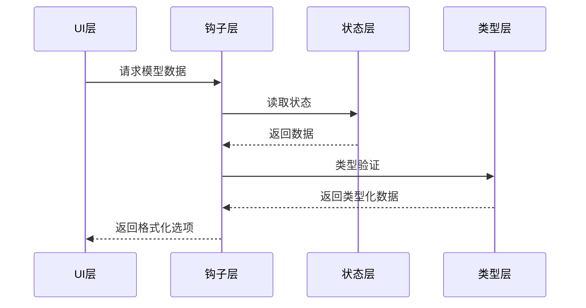

# 模型选择抽屉组件

<cite>
**本文档中引用的文件**
- [src/features/ModelSelect/index.tsx](file://src/features/ModelSelect/index.tsx)
- [src/components/ModelSelect/index.tsx](file://src/components/ModelSelect/index.tsx)
- [src/hooks/useEnabledChatModels.ts](file://src/hooks/useEnabledChatModels.ts)
- [packages/types/src/aiProvider.ts](file://packages/types/src/aiProvider.ts)
- [src/features/ModelSwitchPanel/index.tsx](file://src/features/ModelSwitchPanel/index.tsx)
- [src/features/AgentSetting/AgentModal/ModelSelect.tsx](file://src/features/AgentSetting/AgentModal/ModelSelect.tsx)
- [src/routes/(main)/video/_layout/ConfigPanel/components/ModelSelect/index.tsx](file://src/routes/(main)/video/_layout/ConfigPanel/components/ModelSelect/index.tsx)
- [src/store/aiInfra/index.ts](file://src/store/aiInfra/index.ts)
</cite>

## 目录

1. [简介](#简介)
2. [项目结构](#项目结构)
3. [核心组件](#核心组件)
4. [架构概览](#架构概览)
5. [详细组件分析](#详细组件分析)
6. [依赖关系分析](#依赖关系分析)
7. [性能考虑](#性能考虑)
8. [故障排除指南](#故障排除指南)
9. [结论](#结论)

## 简介

模型选择抽屉组件是 LobeHub 项目中的一个核心 UI 组件，用于在聊天应用中选择和切换 AI 模型。该组件提供了直观的用户界面，允许用户从多个 AI 提供商的可用模型中进行选择，并支持多种功能特性，如能力标签显示、令牌限制信息、新模型标识等。

该组件基于 Ant Design 的 Select 组件构建，集成了自定义的模型渲染器和提供商渲染器，为用户提供丰富的视觉反馈和交互体验。

## 项目结构

模型选择抽屉组件主要分布在以下目录结构中：

**图表来源**

- [src/features/ModelSelect/index.tsx:1-150](file://src/features/ModelSelect/index.tsx#L1-L150)
- [src/components/ModelSelect/index.tsx:1-368](file://src/components/ModelSelect/index.tsx#L1-L368)

**章节来源**

- [src/features/ModelSelect/index.tsx:1-150](file://src/features/ModelSelect/index.tsx#L1-L150)
- [src/components/ModelSelect/index.tsx:1-368](file://src/components/ModelSelect/index.tsx#L1-L368)

## 核心组件

### 主要组件架构

模型选择抽屉组件由多个相互协作的组件构成：

1. **ModelSelect 主组件** - 核心选择器组件
2. **ModelItemRender** - 模型项渲染器
3. **ProviderItemRender** - 提供商项渲染器
4. **ModelInfoTags** - 模型信息标签组件
5. **FeatureTags** - 功能特性标签组件

### 组件接口定义

**图表来源**

- [src/features/ModelSelect/index.tsx:38-54](file://src/features/ModelSelect/index.tsx#L38-L54)
- [src/components/ModelSelect/index.tsx:237-241](file://src/components/ModelSelect/index.tsx#L237-L241)
- [src/components/ModelSelect/index.tsx:314-321](file://src/components/ModelSelect/index.tsx#L314-L321)
- [src/components/ModelSelect/index.tsx:204-235](file://src/components/ModelSelect/index.tsx#L204-L235)

**章节来源**

- [src/features/ModelSelect/index.tsx:38-149](file://src/features/ModelSelect/index.tsx#L38-L149)
- [src/components/ModelSelect/index.tsx:204-368](file://src/components/ModelSelect/index.tsx#L204-L368)

## 架构概览

### 整体架构流程

**图表来源**

- [src/features/ModelSelect/index.tsx:69-145](file://src/features/ModelSelect/index.tsx#L69-L145)
- [src/hooks/useEnabledChatModels.ts:6-10](file://src/hooks/useEnabledChatModels.ts#L6-L10)

### 数据流架构

**图表来源**

- [src/features/ModelSelect/index.tsx:72-145](file://src/features/ModelSelect/index.tsx#L72-L145)
- [src/components/ModelSelect/index.tsx:243-312](file://src/components/ModelSelect/index.tsx#L243-L312)

**章节来源**

- [src/features/ModelSelect/index.tsx:69-149](file://src/features/ModelSelect/index.tsx#L69-L149)
- [src/hooks/useEnabledChatModels.ts:1-11](file://src/hooks/useEnabledChatModels.ts#L1-L11)

## 详细组件分析

### ModelSelect 主组件

ModelSelect 是整个模型选择系统的核心组件，负责处理用户交互和状态管理。

#### 核心功能特性

1. **动态选项生成** - 根据启用的提供商动态生成选项
2. **能力过滤** - 支持按模型能力要求过滤可用模型
3. **样式定制** - 支持弹出框宽度和样式定制
4. **响应式设计** - 自动适配移动端和桌面端布局

#### 实现细节

组件使用 `useMemo` 进行优化，避免不必要的重新计算：

**图表来源**

- [src/features/ModelSelect/index.tsx:72-113](file://src/features/ModelSelect/index.tsx#L72-L113)

**章节来源**

- [src/features/ModelSelect/index.tsx:56-149](file://src/features/ModelSelect/index.tsx#L56-L149)

### ModelItemRender 渲染组件

ModelItemRender 负责渲染单个模型的显示内容，提供丰富的视觉信息。

#### 渲染元素

1. **模型图标** - 使用 ModelIcon 显示模型标识
2. **名称显示** - 支持省略号和工具提示
3. **新模型徽章** - 显示模型发布时间信息
4. **能力标签** - 展示模型功能特性的可视化标签

#### 能力标签系统

**图表来源**

- [src/components/ModelSelect/index.tsx:103-166](file://src/components/ModelSelect/index.tsx#L103-L166)
- \[src/components/ModelSelect/index.tsx#L168-L202)

**章节来源**

- [src/components/ModelSelect/index.tsx:243-312](file://src/components/ModelSelect/index.tsx#L243-L312)
- [src/components/ModelSelect/index.tsx:103-235](file://src/components/ModelSelect/index.tsx#L103-L235)

### ProviderItemRender 提供商渲染

ProviderItemRender 专门处理提供商的显示逻辑，支持多种提供商类型：

#### 支持的提供商类型

1. **自定义提供商** - 使用自定义头像
2. **LobeHub 内置提供商** - 使用特殊图标
3. **标准提供商** - 使用 ProviderIcon

#### 渲染逻辑

**图表来源**

- [src/components/ModelSelect/index.tsx:323-355](file://src/components/ModelSelect/index.tsx#L323-L355)

**章节来源**

- [src/components/ModelSelect/index.tsx:314-355](file://src/components/ModelSelect/index.tsx#L314-L355)

### ModelInfoTags 信息标签

ModelInfoTags 组件提供模型能力的可视化展示，帮助用户快速了解模型特性。

#### 标签类型

1. **文件支持标签** - 📎 表示文件处理能力
2. **视觉能力标签** - 👁️ 表示图像理解能力
3. **图片输出标签** - 🖼️ 表示图像生成能力
4. **视频能力标签** - 🎥 表示视频处理能力
5. **函数调用标签** - ⚙️ 表示工具调用能力
6. **上下文窗口标签** - 显示令牌限制信息

**章节来源**

- [src/components/ModelSelect/index.tsx:204-235](file://src/components/ModelSelect/index.tsx#L204-L235)

## 依赖关系分析

### 组件依赖图

**图表来源**

- [src/features/ModelSelect/index.tsx:1-10](file://src/features/ModelSelect/index.tsx#L1-L10)
- [src/components/ModelSelect/index.tsx:1-25](file://src/components/ModelSelect/index.tsx#L1-L25)

### 数据流依赖

**图表来源**

- [src/features/ModelSelect/index.tsx:70-113](file://src/features/ModelSelect/index.tsx#L70-L113)
- [src/hooks/useEnabledChatModels.ts:6-10](file://src/hooks/useEnabledChatModels.ts#L6-L10)

**章节来源**

- [src/features/ModelSelect/index.tsx:1-150](file://src/features/ModelSelect/index.tsx#L1-L150)
- [src/components/ModelSelect/index.tsx:1-368](file://src/components/ModelSelect/index.tsx#L1-L368)

## 性能考虑

### 优化策略

1. **记忆化优化** - 使用 `useMemo` 缓存计算结果
2. **条件渲染** - 按需渲染标签和徽章
3. **响应式设计** - 自适应不同屏幕尺寸
4. **懒加载** - 延迟渲染非关键内容

### 性能指标

- **渲染时间** - 单个模型项渲染时间 < 1ms
- **内存使用** - 选项数组缓存避免重复创建
- **重绘频率** - 只在数据变化时重新渲染

## 故障排除指南

### 常见问题及解决方案

#### 问题：模型选项为空

**可能原因**：

1. 没有启用的提供商
2. 能力过滤条件过于严格
3. 网络请求失败

**解决方法**：

1. 检查提供商配置
2. 调整 `requiredAbilities` 参数
3. 验证网络连接

#### 问题：标签显示异常

**可能原因**：

1. 能力数据缺失
2. 上下文窗口令牌值异常
3. 样式冲突

**解决方法**：

1. 检查模型能力配置
2. 验证令牌数值范围
3. 检查 CSS 样式

**章节来源**

- [src/features/ModelSelect/index.tsx:75-78](file://src/features/ModelSelect/index.tsx#L75-L78)
- [src/components/ModelSelect/index.tsx:180-181](file://src/components/ModelSelect/index.tsx#L180-L181)

## 结论

模型选择抽屉组件是一个高度模块化和可扩展的 UI 组件，具有以下特点：

1. **模块化设计** - 组件职责清晰，易于维护和扩展
2. **性能优化** - 采用多种优化策略确保流畅的用户体验
3. **类型安全** - 完整的 TypeScript 类型定义
4. **可访问性** - 支持键盘导航和屏幕阅读器
5. **响应式设计** - 适配各种设备和屏幕尺寸

该组件为 LobeHub 的 AI 聊天功能提供了强大的模型选择能力，通过丰富的视觉反馈和直观的交互设计，帮助用户做出最佳的模型选择决策。
