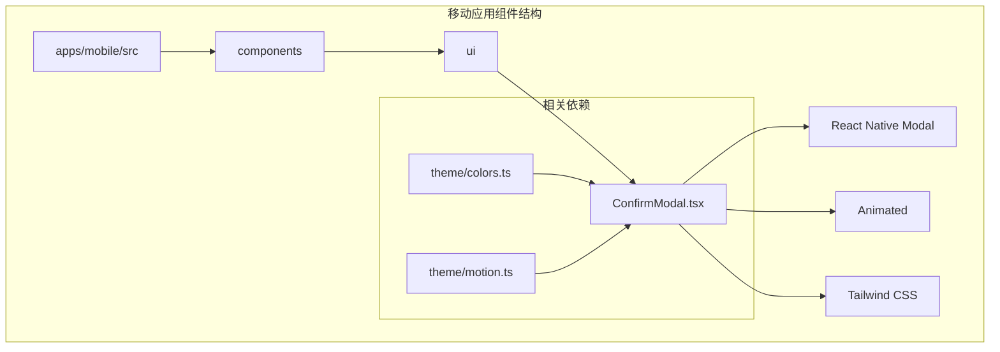
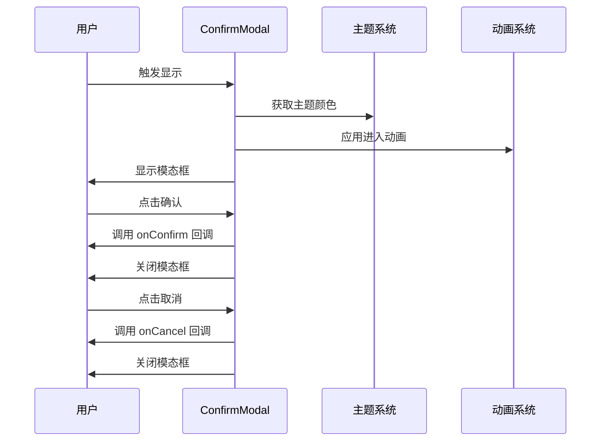
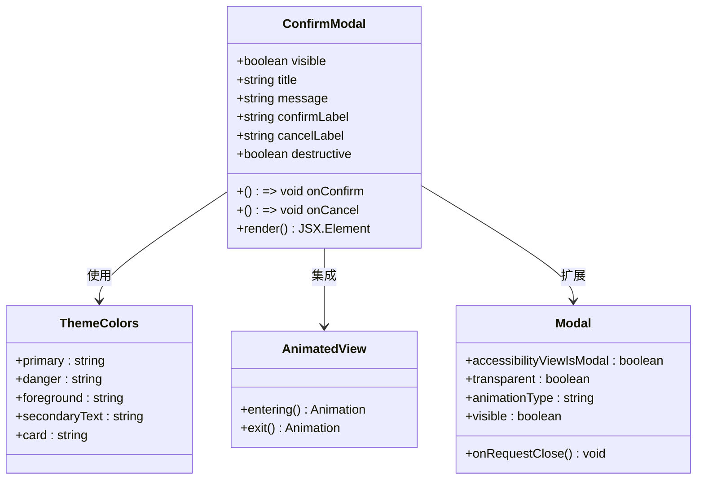
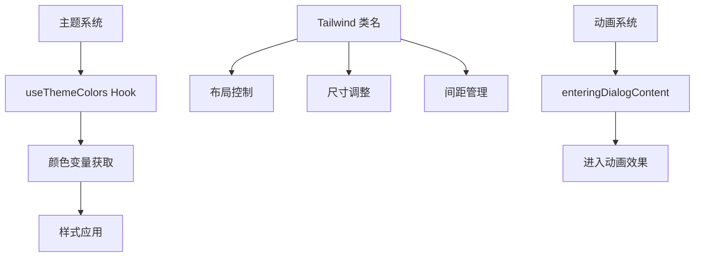
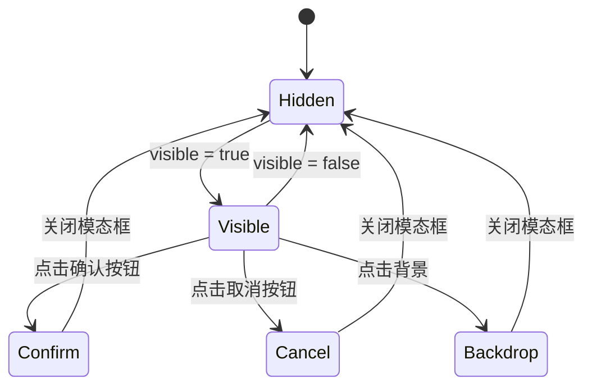
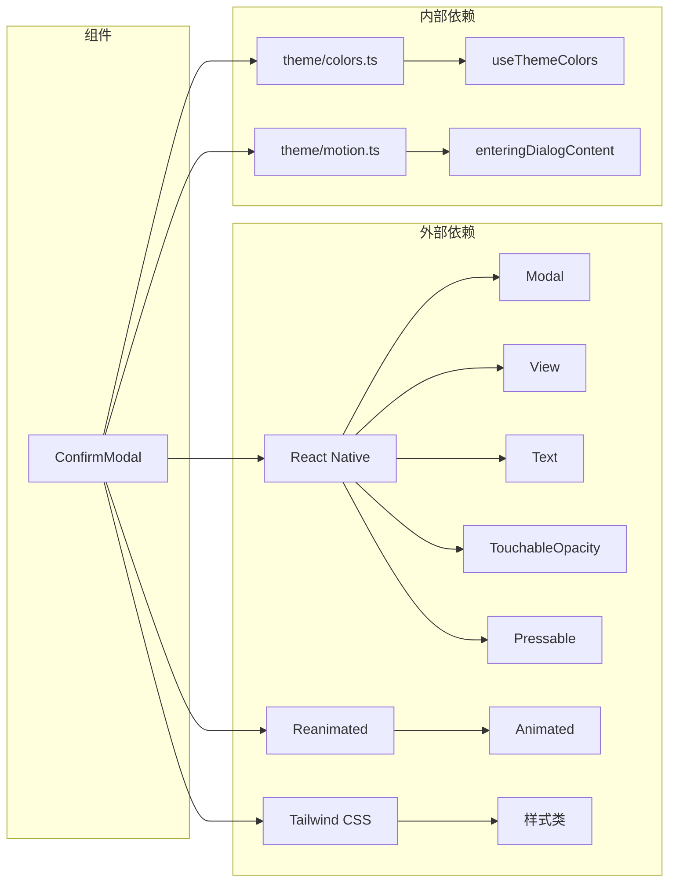

# 确认模态框组件

<cite>
**本文档引用的文件**
- [ConfirmModal.tsx](file://apps/mobile/src/components/ui/ConfirmModal.tsx)
</cite>

## 目录
1. [简介](#简介)
2. [项目结构](#项目结构)
3. [核心组件](#核心组件)
4. [架构概览](#架构概览)
5. [详细组件分析](#详细组件分析)
6. [依赖关系分析](#依赖关系分析)
7. [性能考虑](#性能考虑)
8. [故障排除指南](#故障排除指南)
9. [结论](#结论)

## 简介

确认模态框组件是一个基于 React Native Modal 构建的确认对话框组件，专门用于在应用中提供用户确认操作的功能。该组件设计用于解决在现有模态框或 Sheet 内部使用系统 Alert 时可能出现的 "Tried to show an alert while not attached to an Activity" 错误问题。

该组件提供了简洁而直观的用户界面，包含标题、消息内容和两个操作按钮（取消和确认），支持破坏性操作样式，并集成了动画效果和主题颜色系统。

## 项目结构

确认模态框组件位于移动应用的 UI 组件目录中，采用模块化的设计方式：

**图表来源**
- [ConfirmModal.tsx:1-85](file://apps/mobile/src/components/ui/ConfirmModal.tsx#L1-L85)

**章节来源**
- [ConfirmModal.tsx:1-85](file://apps/mobile/src/components/ui/ConfirmModal.tsx#L1-L85)

## 核心组件

确认模态框组件的核心功能包括：

### 主要特性
- **模态框展示**：基于 React Native Modal 实现，支持透明背景和淡入动画
- **响应式布局**：使用 Tailwind CSS 类名实现自适应布局
- **主题集成**：自动适配应用主题颜色系统
- **动画效果**：集成 Reanimated 动画库提供流畅的进入动画
- **无障碍支持**：设置 accessibilityViewIsModal 属性确保可访问性

### 接口定义
组件通过 TypeScript 接口定义了完整的属性配置：

| 属性名 | 类型 | 必需 | 默认值 | 描述 |
|--------|------|------|--------|------|
| visible | boolean | 是 | - | 控制模态框的显示状态 |
| title | string | 是 | - | 模态框标题文本 |
| message | string | 是 | - | 提示消息内容 |
| confirmLabel | string | 否 | "确认" | 确认按钮标签 |
| cancelLabel | string | 否 | "取消" | 取消按钮标签 |
| destructive | boolean | 否 | false | 是否为破坏性操作样式 |
| onConfirm | () => void | 是 | - | 确认按钮点击回调 |
| onCancel | () => void | 是 | - | 取消按钮点击回调 |

**章节来源**
- [ConfirmModal.tsx:13-33](file://apps/mobile/src/components/ui/ConfirmModal.tsx#L13-L33)

## 架构概览

确认模态框组件采用了分层架构设计，确保了良好的可维护性和扩展性：

**图表来源**
- [ConfirmModal.tsx:24-83](file://apps/mobile/src/components/ui/ConfirmModal.tsx#L24-L83)

### 组件层次结构

**图表来源**
- [ConfirmModal.tsx:6-11](file://apps/mobile/src/components/ui/ConfirmModal.tsx#L6-L11)

## 详细组件分析

### 组件实现细节

确认模态框组件采用了现代化的 React Native 开发实践：

#### 布局结构
组件使用嵌套的 View 组件构建了清晰的层次结构：
- 外层 Modal 容器处理整体模态框行为
- 中间 Pressable 容器处理背景点击事件
- 内层 Animated.View 容器应用进入动画效果
- 内部 Pressable 容器阻止事件冒泡
- 内容区域包含标题、消息和按钮区域

#### 样式系统
组件深度集成了 Tailwind CSS 和主题系统：

**图表来源**
- [ConfirmModal.tsx:34-83](file://apps/mobile/src/components/ui/ConfirmModal.tsx#L34-L83)

#### 交互逻辑

**图表来源**
- [ConfirmModal.tsx:44-82](file://apps/mobile/src/components/ui/ConfirmModal.tsx#L44-L82)

**章节来源**
- [ConfirmModal.tsx:24-83](file://apps/mobile/src/components/ui/ConfirmModal.tsx#L24-L83)

### 性能优化策略

确认模态框组件在设计时考虑了多种性能优化：

#### 渲染优化
- 使用 React.memo 包装组件以避免不必要的重新渲染
- 仅在 visible 状态变化时重新计算样式
- 使用 Animated.View 进行硬件加速的动画渲染

#### 内存管理
- 在组件卸载时自动清理动画资源
- 避免在 props 中传递大型对象
- 使用函数式组件减少内存占用

## 依赖关系分析

确认模态框组件的依赖关系相对简单但功能完整：

**图表来源**
- [ConfirmModal.tsx:6-11](file://apps/mobile/src/components/ui/ConfirmModal.tsx#L6-L11)

### 第三方库集成

组件集成了多个第三方库来增强功能：

| 库名称 | 版本 | 用途 | 依赖类型 |
|--------|------|------|----------|
| react-native | 最新 | 核心框架 | 运行时依赖 |
| react-native-reanimated | 最新 | 动画系统 | 运行时依赖 |
| tailwindcss | 最新 | 样式系统 | 开发依赖 |

**章节来源**
- [ConfirmModal.tsx:6-11](file://apps/mobile/src/components/ui/ConfirmModal.tsx#L6-L11)

## 性能考虑

确认模态框组件在性能方面采用了多项优化措施：

### 渲染性能
- **虚拟化支持**：组件本身不涉及大量数据渲染，因此不需要虚拟化
- **批量更新**：使用 React 的批处理机制减少重渲染
- **懒加载**：组件按需加载，不会影响初始页面性能

### 内存管理
- **生命周期管理**：正确处理组件挂载和卸载时的资源清理
- **事件监听器**：避免内存泄漏的事件监听器管理
- **样式缓存**：主题颜色和样式计算结果的缓存机制

### 动画性能
- **硬件加速**：使用 transform 和 opacity 属性启用 GPU 加速
- **动画预渲染**：Reanimated 提供的原生动画性能优势
- **帧率优化**：避免在动画期间进行昂贵的计算

## 故障排除指南

### 常见问题及解决方案

#### 模态框无法关闭
**症状**：用户点击确认或取消按钮后模态框仍然显示
**解决方案**：
1. 检查 visible 属性是否正确绑定到父组件状态
2. 确认 onConfirm 和 onCancel 回调函数是否正确执行
3. 验证 onRequestClose 处理函数是否被调用

#### 样式显示异常
**症状**：模态框样式不符合预期或主题颜色不正确
**解决方案**：
1. 确认 theme/colors.ts 文件中的颜色定义是否正确
2. 检查 Tailwind CSS 配置是否正确加载
3. 验证组件中的样式类名拼写是否正确

#### 动画不流畅
**症状**：模态框动画出现卡顿或延迟
**解决方案**：
1. 检查 Reanimated 配置是否正确
2. 确认设备性能是否满足动画要求
3. 考虑简化动画效果或使用更简单的过渡效果

#### 无障碍性问题
**症状**：屏幕阅读器无法正确读取模态框内容
**解决方案**：
1. 确认 accessibilityViewIsModal 属性已正确设置
2. 检查标题和描述文本是否足够清晰
3. 验证键盘导航是否正常工作

**章节来源**
- [ConfirmModal.tsx:37-43](file://apps/mobile/src/components/ui/ConfirmModal.tsx#L37-L43)

## 结论

确认模态框组件是一个设计精良、功能完整的 UI 组件，它成功解决了移动应用中模态框确认对话框的核心需求。组件具有以下显著特点：

### 技术优势
- **架构清晰**：采用分层设计，职责分离明确
- **性能优秀**：集成了多种性能优化技术
- **可维护性强**：代码结构清晰，易于理解和修改
- **扩展性好**：接口设计灵活，便于功能扩展

### 设计亮点
- **用户体验**：提供直观的操作反馈和视觉效果
- **主题集成**：无缝集成到应用的整体设计系统
- **无障碍支持**：充分考虑了可访问性需求
- **跨平台兼容**：基于 React Native，支持多平台部署

该组件为移动应用开发提供了一个可靠的确认对话框解决方案，可以作为其他类似组件的参考实现。通过持续的优化和改进，该组件将继续为开发者提供高质量的用户体验。