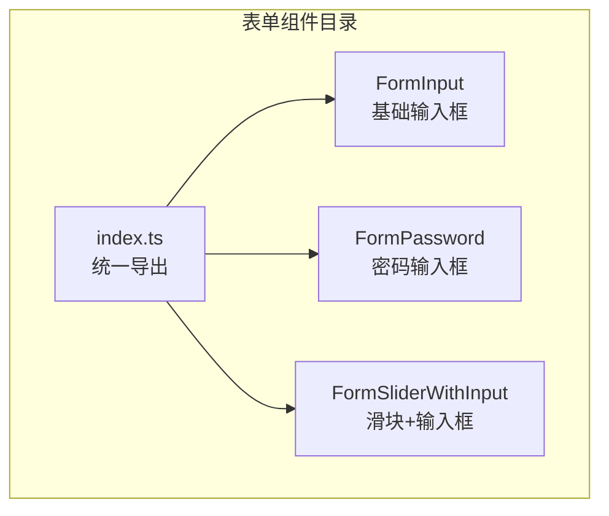
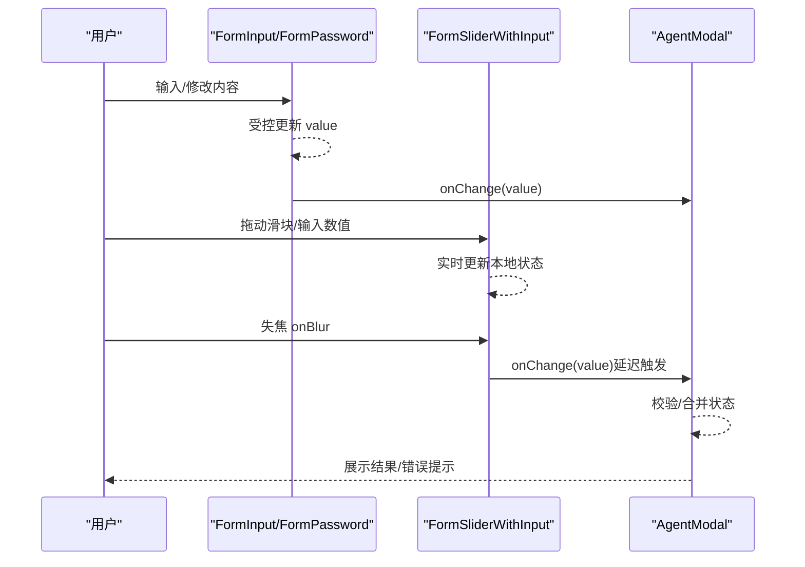
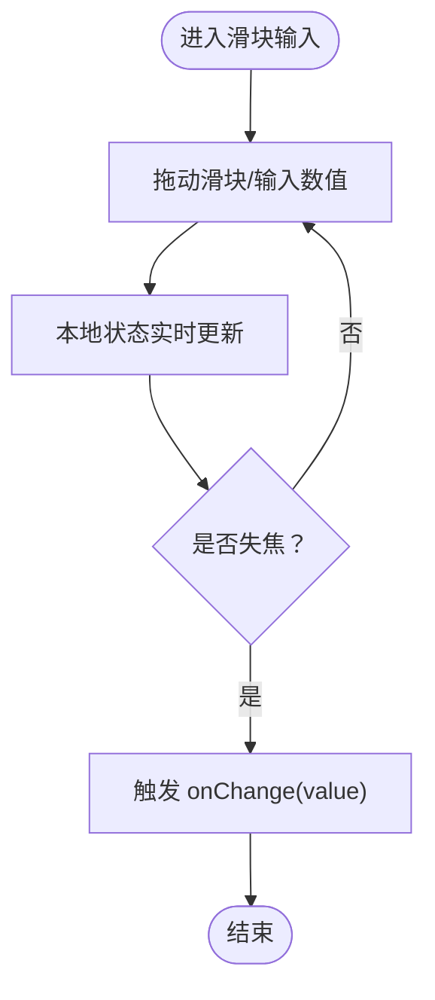
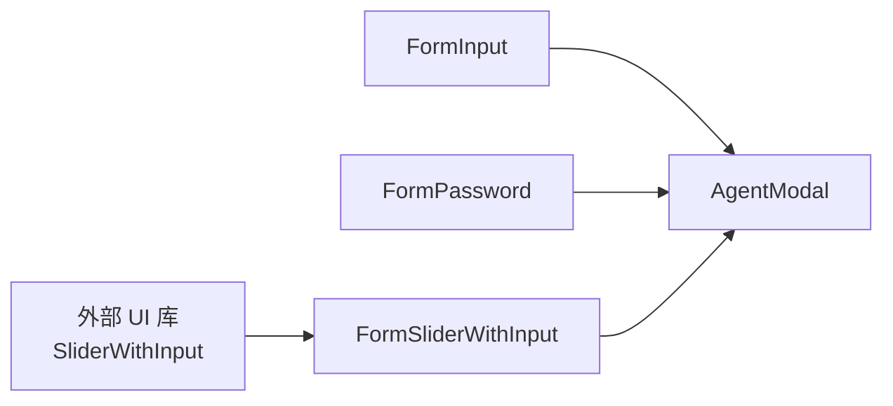

# 表单组件

<cite>
**本文档引用的文件**
- [FormInput 组件](file://src/components/FormInput/FormInput.tsx)
- [FormPassword 组件](file://src/components/FormInput/FormPassword.tsx)
- [FormSliderWithInput 组件](file://src/components/FormInput/FormSliderWithInput.tsx)
- [FormInput 导出入口](file://src/components/FormInput/index.ts)
- [AgentModal 中的滑块与开关组合](file://src/features/AgentSetting/AgentModal/index.tsx)
</cite>

## 目录
1. [简介](#简介)
2. [项目结构](#项目结构)
3. [核心组件](#核心组件)
4. [架构总览](#架构总览)
5. [组件详解](#组件详解)
6. [依赖关系分析](#依赖关系分析)
7. [性能考量](#性能考量)
8. [故障排查指南](#故障排查指南)
9. [结论](#结论)

## 简介
本文件面向 LobeHub 项目中的表单组件，系统性梳理输入框、密码框、滑块与输入框组合等表单控件的设计实现、属性配置、验证规则、事件处理与状态管理，并提供在不同业务场景（基础输入、复杂配置、动态表单）中的使用示例路径与最佳实践。同时覆盖样式定制、主题集成、响应式设计支持以及表单验证与无障碍访问等高级特性。

## 项目结构
表单相关组件集中在 src/components/FormInput 目录下，采用按功能拆分与统一导出的方式组织：
- FormInput：基础文本输入框封装
- FormPassword：密码输入框封装
- FormSliderWithInput：带输入框的滑块封装，具备延迟触发变更的能力
- index.ts：统一导出上述组件

**图表来源**
- [FormInput 组件](file://src/components/FormInput/FormInput.tsx#L1-L200)
- [FormPassword 组件](file://src/components/FormInput/FormPassword.tsx#L1-L200)
- [FormSliderWithInput 组件](file://src/components/FormInput/FormSliderWithInput.tsx#L1-L200)
- [FormInput 导出入口](file://src/components/FormInput/index.ts#L1-L10)

**章节来源**
- [FormInput 组件](file://src/components/FormInput/FormInput.tsx#L1-L200)
- [FormPassword 组件](file://src/components/FormInput/FormPassword.tsx#L1-L200)
- [FormSliderWithInput 组件](file://src/components/FormInput/FormSliderWithInput.tsx#L1-L200)
- [FormInput 导出入口](file://src/components/FormInput/index.ts#L1-L10)

## 核心组件
- 基础输入框（FormInput）
  - 职责：封装通用输入行为，支持受控值、占位符、禁用态、尺寸等基础能力
  - 关键点：通过受控 value 与 onChange 实现状态同步；支持 blur 触发校验或提交
- 密码输入框（FormPassword）
  - 职责：在基础输入框之上增加可见性切换、强度提示等密码专用能力
  - 关键点：切换显示/隐藏逻辑；可选的强度检测与提示
- 滑块+输入框（FormSliderWithInput）
  - 职责：数值型输入的滑块与输入框联动，避免频繁变更导致的性能问题
  - 关键点：onBlur 触发变更，中间交互使用实时输入框；支持最小/最大/步长等范围控制

**章节来源**
- [FormInput 组件](file://src/components/FormInput/FormInput.tsx#L1-L200)
- [FormPassword 组件](file://src/components/FormInput/FormPassword.tsx#L1-L200)
- [FormSliderWithInput 组件](file://src/components/FormInput/FormSliderWithInput.tsx#L1-L200)

## 架构总览
FormInput 系列组件以“受控组件 + 受控状态”为核心模式，结合业务层（如 AgentModal）的组合控件（滑块+开关），形成“输入—校验—提交”的闭环。

**图表来源**
- [FormInput 组件](file://src/components/FormInput/FormInput.tsx#L1-L200)
- [FormSliderWithInput 组件](file://src/components/FormInput/FormSliderWithInput.tsx#L1-L200)
- [AgentModal 中的滑块与开关组合](file://src/features/AgentSetting/AgentModal/index.tsx#L38-L74)

## 组件详解

### FormInput（基础输入框）
- 设计要点
  - 受控组件：value 与 onChange 由父组件传递，内部不维护本地状态
  - 事件处理：支持 onChange、onBlur、onFocus 等常用回调
  - 样式与主题：通过 className 或样式变量接入主题体系
- 典型使用场景
  - 基础文本输入：用户名、邮箱、描述等
  - 与表单校验联动：onBlur 触发校验，错误信息展示
- 最佳实践
  - 使用受控模式，避免“幽灵值”
  - 对敏感字段优先考虑 FormPassword
  - 在复杂表单中，将输入框置于统一的表单上下文中进行校验与提交

**章节来源**
- [FormInput 组件](file://src/components/FormInput/FormInput.tsx#L1-L200)

### FormPassword（密码输入框）
- 设计要点
  - 可见性切换：点击切换明文/密文
  - 强度提示：可选的强度检测与可视化反馈
  - 安全性：默认密文输入，避免键盘记录与屏幕截图泄露
- 典型使用场景
  - 登录密码、API 密钥、数据库连接密码等
- 最佳实践
  - 默认隐藏输入，仅在必要时允许预览
  - 结合强度策略与提示，引导用户设置强密码
  - 避免在日志或调试输出中打印密码

**章节来源**
- [FormPassword 组件](file://src/components/FormInput/FormPassword.tsx#L1-L200)

### FormSliderWithInput（滑块+输入框）
- 设计要点
  - 延迟变更：拖动过程实时更新本地状态，失焦后才触发父组件 onChange
  - 数值范围：支持 min/max/step 控制，确保合法范围
  - 交互体验：滑块与输入框联动，兼顾直观与精确
- 典型使用场景
  - 温度阈值、超时时间、并发数等数值配置
  - Agent 设置中的“无限制”开关与滑块组合（参考 AgentModal）
- 最佳实践
  - 合理设置 step，避免无效状态
  - 提供清晰的单位与说明文案
  - 与开关组合时，禁用状态下隐藏滑块并保持一致的视觉反馈

**图表来源**
- [FormSliderWithInput 组件](file://src/components/FormInput/FormSliderWithInput.tsx#L1-L200)

**章节来源**
- [FormSliderWithInput 组件](file://src/components/FormInput/FormSliderWithInput.tsx#L1-L200)
- [AgentModal 中的滑块与开关组合](file://src/features/AgentSetting/AgentModal/index.tsx#L38-L74)

### 组合控件：滑块+开关（SliderWithCheckbox）
- 设计要点
  - 开关控制启用/禁用：禁用时隐藏滑块，保持一致的交互
  - 值同步：启用时使用滑块值，禁用时可回退到“无限制”等语义值
- 典型使用场景
  - Agent 设置中的“自动上限”开关与滑块组合
- 最佳实践
  - 明确“无限制”语义，避免歧义
  - 切换开关时，保留上次有效值，提升可用性

**章节来源**
- [AgentModal 中的滑块与开关组合](file://src/features/AgentSetting/AgentModal/index.tsx#L38-L74)

## 依赖关系分析
- 组件间关系
  - FormSliderWithInput 依赖外部 UI 库的 SliderWithInput 组件，内部通过受控状态与 onBlur 触发实现延迟变更
  - FormInput/FormPassword 作为基础输入控件，被上层业务组件（如 AgentModal）复用
- 外部依赖
  - 使用 React.memo 进行浅比较优化
  - 使用 useState/useEffect 管理本地状态与副作用
- 潜在风险
  - 外部 UI 组件版本升级可能影响行为，需关注 onChange/value 类型一致性
  - onBlur 触发时机与业务需求匹配度需在各场景中评估

**图表来源**
- [FormSliderWithInput 组件](file://src/components/FormInput/FormSliderWithInput.tsx#L1-L200)
- [FormInput 组件](file://src/components/FormInput/FormInput.tsx#L1-L200)
- [FormPassword 组件](file://src/components/FormInput/FormPassword.tsx#L1-L200)
- [AgentModal 中的滑块与开关组合](file://src/features/AgentSetting/AgentModal/index.tsx#L38-L74)

**章节来源**
- [FormSliderWithInput 组件](file://src/components/FormInput/FormSliderWithInput.tsx#L1-L200)
- [FormInput 组件](file://src/components/FormInput/FormInput.tsx#L1-L200)
- [FormPassword 组件](file://src/components/FormInput/FormPassword.tsx#L1-L200)
- [AgentModal 中的滑块与开关组合](file://src/features/AgentSetting/AgentModal/index.tsx#L38-L74)

## 性能考量
- 受控组件与状态管理
  - 使用 React.memo 包裹，减少不必要的重渲染
  - FormSliderWithInput 通过本地状态缓存中间值，onBlur 再统一提交，降低高频变更对上游的影响
- 事件处理
  - 将耗时操作（如远程校验）放在 onBlur 或显式提交按钮中执行
- 样式与主题
  - 通过主题变量与 className 组合，避免内联样式的重复计算
- 响应式设计
  - 在移动端与桌面端分别测试输入框高度、间距与可点击区域，确保一致的可访问性

[本节为通用指导，无需特定文件引用]

## 故障排查指南
- 输入框无响应
  - 检查是否正确传入 value 与 onChange，确认受控模式生效
  - 确认父组件未意外重置 value
- 滑块不触发变更
  - 确认 onBlur 是否被调用，检查外部 UI 组件的事件签名
  - 若存在“无限制”开关，确认禁用状态下未尝试提交数值
- 密码可见性异常
  - 检查切换逻辑与状态同步，避免异步状态错配
- 校验时机不符预期
  - 将校验从 onChange 移至 onBlur，或在提交按钮中集中校验
- 无障碍访问问题
  - 确保输入框具备正确的 aria-* 属性与标签关联
  - 提供键盘可达性与焦点指示

**章节来源**
- [FormSliderWithInput 组件](file://src/components/FormInput/FormSliderWithInput.tsx#L1-L200)
- [FormInput 组件](file://src/components/FormInput/FormInput.tsx#L1-L200)
- [FormPassword 组件](file://src/components/FormInput/FormPassword.tsx#L1-L200)

## 结论
LobeHub 的表单组件以“受控组件 + 延迟变更 + 主题化样式”为核心设计，既保证了良好的交互体验，又兼顾了性能与可维护性。通过 FormInput、FormPassword 与 FormSliderWithInput 的组合，能够覆盖从基础输入到复杂配置的多种场景。建议在实际业务中遵循受控模式、合理设置校验时机、完善无障碍与响应式支持，持续优化用户体验。