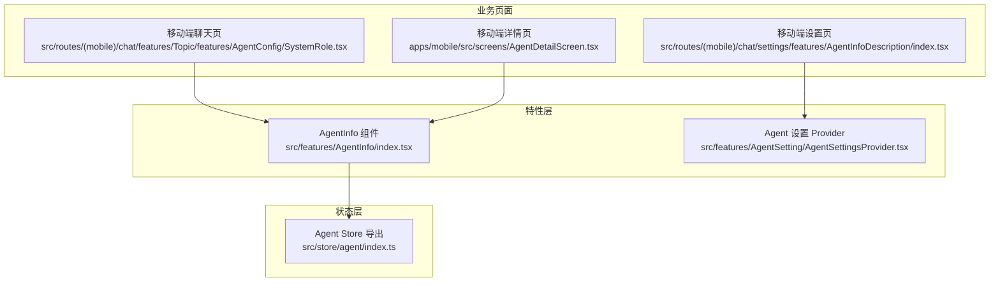
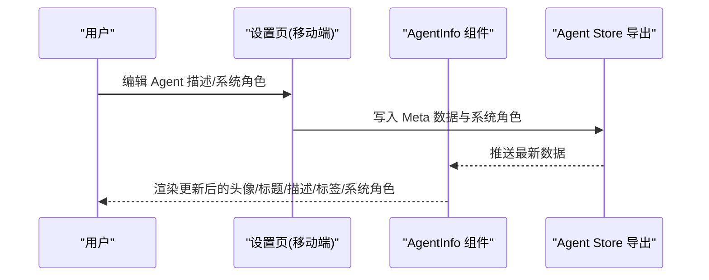
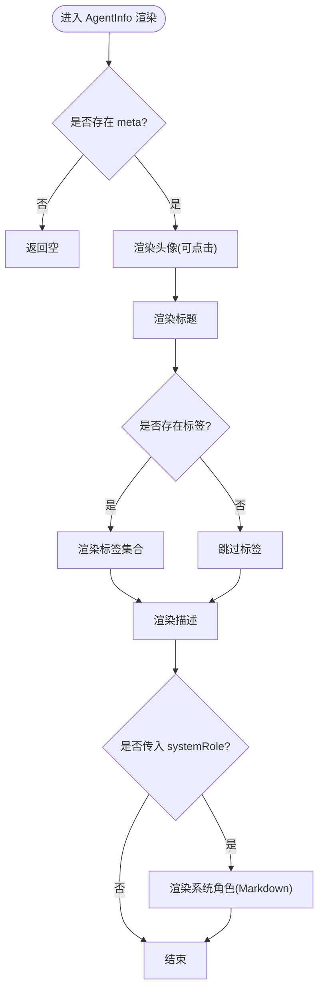
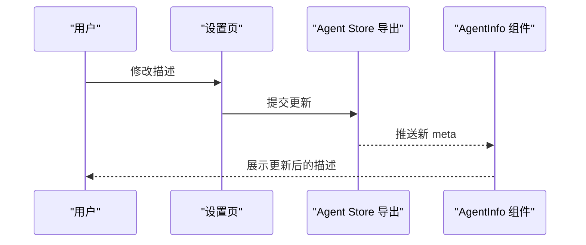
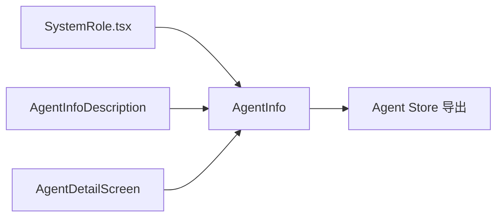
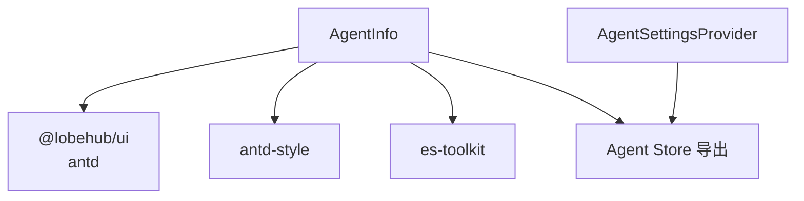

# Agent 信息组件

<cite>
**本文引用的文件**
- [src/features/AgentInfo/index.tsx](file://src/features/AgentInfo/index.tsx)
- [src/routes/(mobile)/chat/settings/features/AgentInfoDescription/index.tsx](file://src/routes/(mobile)/chat/settings/features/AgentInfoDescription/index.tsx)
- [src/routes/(mobile)/chat/features/Topic/features/AgentConfig/SystemRole.tsx](file://src/routes/(mobile)/chat/features/Topic/features/AgentConfig/SystemRole.tsx)
- [apps/mobile/src/screens/AgentDetailScreen.tsx](file://apps/mobile/src/screens/AgentDetailScreen.tsx)
- [src/features/AgentSetting/AgentSettingsProvider.tsx](file://src/features/AgentSetting/AgentSettingsProvider.tsx)
- [src/store/agent/index.ts](file://src/store/agent/index.ts)
</cite>

## 目录
1. [简介](#简介)
2. [项目结构](#项目结构)
3. [核心组件](#核心组件)
4. [架构总览](#架构总览)
5. [详细组件分析](#详细组件分析)
6. [依赖关系分析](#依赖关系分析)
7. [性能考虑](#性能考虑)
8. [故障排除指南](#故障排除指南)
9. [结论](#结论)
10. [附录](#附录)

## 简介
本文件为 Agent 信息组件的详细技术文档，聚焦于 AgentInfo 组件的实现与使用，涵盖以下方面：
- Agent 基本信息展示：头像、标题、描述、标签等
- 头像管理：点击交互、背景色配置
- 描述编辑：移动端设置页中的描述编辑入口
- 标签系统：标签渲染与显示格式
- 数据来源与缓存策略：Meta 数据与系统角色信息的来源
- 实时更新机制：组件对 props 变化的响应
- 展示格式与编辑模式：桌面端与移动端的差异化展示
- 权限控制与访问限制：基于路由与用户态的访问约束
- 集成方式：与业务组件（聊天、设置、详情页）的协作
- 响应式设计、国际化支持与无障碍访问

## 项目结构
Agent 信息组件位于前端特性层，围绕 Meta 数据与系统角色进行展示，并与设置页、详情页、聊天页等业务模块集成。

图表来源
- [src/features/AgentInfo/index.tsx](file://src/features/AgentInfo/index.tsx#L1-L70)
- [src/features/AgentSetting/AgentSettingsProvider.tsx](file://src/features/AgentSetting/AgentSettingsProvider.tsx#L1-L19)
- [src/routes/(mobile)/chat/settings/features/AgentInfoDescription/index.tsx](file://src/routes/(mobile)/chat/settings/features/AgentInfoDescription/index.tsx#L30-L57)
- [src/routes/(mobile)/chat/features/Topic/features/AgentConfig/SystemRole.tsx](file://src/routes/(mobile)/chat/features/Topic/features/AgentConfig/SystemRole.tsx#L9-L76)
- [apps/mobile/src/screens/AgentDetailScreen.tsx](file://apps/mobile/src/screens/AgentDetailScreen.tsx#L58-L76)
- [src/store/agent/index.ts](file://src/store/agent/index.ts#L1-L2)

章节来源
- [src/features/AgentInfo/index.tsx](file://src/features/AgentInfo/index.tsx#L1-L70)
- [src/features/AgentSetting/AgentSettingsProvider.tsx](file://src/features/AgentSetting/AgentSettingsProvider.tsx#L1-L19)
- [src/routes/(mobile)/chat/settings/features/AgentInfoDescription/index.tsx](file://src/routes/(mobile)/chat/settings/features/AgentInfoDescription/index.tsx#L30-L57)
- [src/routes/(mobile)/chat/features/Topic/features/AgentConfig/SystemRole.tsx](file://src/routes/(mobile)/chat/features/Topic/features/AgentConfig/SystemRole.tsx#L9-L76)
- [apps/mobile/src/screens/AgentDetailScreen.tsx](file://apps/mobile/src/screens/AgentDetailScreen.tsx#L58-L76)
- [src/store/agent/index.ts](file://src/store/agent/index.ts#L1-L2)

## 核心组件
- AgentInfo 组件：负责渲染 Agent 的头像、标题、描述、标签与系统角色（可选）。支持头像点击回调、样式透传与响应式布局。
- 移动端描述编辑：通过设置页提供描述编辑入口，编辑后更新 Agent 的 Meta 数据。
- 聊天页系统角色展示：在聊天配置中展示 Agent 的系统角色内容。
- 详情页信息展示：在移动端详情页中以卡片形式展示头像、标题、作者与标签。

章节来源
- [src/features/AgentInfo/index.tsx](file://src/features/AgentInfo/index.tsx#L25-L67)
- [src/routes/(mobile)/chat/settings/features/AgentInfoDescription/index.tsx](file://src/routes/(mobile)/chat/settings/features/AgentInfoDescription/index.tsx#L30-L57)
- [src/routes/(mobile)/chat/features/Topic/features/AgentConfig/SystemRole.tsx](file://src/routes/(mobile)/chat/features/Topic/features/AgentConfig/SystemRole.tsx#L9-L76)
- [apps/mobile/src/screens/AgentDetailScreen.tsx](file://apps/mobile/src/screens/AgentDetailScreen.tsx#L58-L76)

## 架构总览
AgentInfo 组件作为纯展示层，依赖 Meta 数据与系统角色字符串进行渲染；描述编辑与系统角色编辑由设置页完成，最终通过状态层或服务层持久化并驱动 UI 更新。

图表来源
- [src/routes/(mobile)/chat/settings/features/AgentInfoDescription/index.tsx](file://src/routes/(mobile)/chat/settings/features/AgentInfoDescription/index.tsx#L30-L57)
- [src/features/AgentInfo/index.tsx](file://src/features/AgentInfo/index.tsx#L32-L67)
- [src/store/agent/index.ts](file://src/store/agent/index.ts#L1-L2)

## 详细组件分析

### AgentInfo 组件
- 输入参数
  - meta：包含头像、标题、描述、标签、背景色等字段
  - systemRole：可选的系统角色文本
  - onAvatarClick：头像点击回调
  - style：根容器样式透传
- 渲染逻辑
  - 当存在 meta.avatar 时渲染方形头像，支持点击回调与背景色
  - 当存在 meta.title 时渲染居中标题
  - 当存在 meta.tags 且非空时渲染标签集合
  - 当存在 meta.description 时渲染描述文本
  - 当传入 systemRole 时在分隔线后渲染 Markdown 内容
- 性能与交互
  - 使用 memo 包装，避免无谓重渲染
  - 头像点击事件通过 onAvatarClick 回调交由上层处理
  - 标签渲染采用 wrap 自适应换行，适配小屏设备

图表来源
- [src/features/AgentInfo/index.tsx](file://src/features/AgentInfo/index.tsx#L32-L67)

章节来源
- [src/features/AgentInfo/index.tsx](file://src/features/AgentInfo/index.tsx#L25-L67)

### 头像管理
- 头像渲染：使用方形头像组件，尺寸固定，支持背景色与动画效果
- 点击交互：通过 onAvatarClick 将点击事件交由上层处理，便于打开编辑器或预览大图
- 默认行为：若未提供头像，则不渲染头像区域

章节来源
- [src/features/AgentInfo/index.tsx](file://src/features/AgentInfo/index.tsx#L37-L47)

### 描述编辑
- 编辑入口：移动端设置页提供描述编辑功能
- 数据写入：编辑完成后更新 Agent 的 Meta 数据
- 影响范围：AgentInfo 组件接收最新 meta 后自动刷新展示

图表来源
- [src/routes/(mobile)/chat/settings/features/AgentInfoDescription/index.tsx](file://src/routes/(mobile)/chat/settings/features/AgentInfoDescription/index.tsx#L30-L57)
- [src/features/AgentInfo/index.tsx](file://src/features/AgentInfo/index.tsx#L58-L64)
- [src/store/agent/index.ts](file://src/store/agent/index.ts#L1-L2)

章节来源
- [src/routes/(mobile)/chat/settings/features/AgentInfoDescription/index.tsx](file://src/routes/(mobile)/chat/settings/features/AgentInfoDescription/index.tsx#L30-L57)
- [src/features/AgentInfo/index.tsx](file://src/features/AgentInfo/index.tsx#L58-L64)
- [src/store/agent/index.ts](file://src/store/agent/index.ts#L1-L2)

### 标签系统
- 渲染规则：当 meta.tags 存在且长度大于 0 时，逐项渲染为标签
- 显示格式：每个标签使用首字母大写风格，去除多余空白
- 布局：标签容器支持换行，适配窄屏与多标签场景

章节来源
- [src/features/AgentInfo/index.tsx](file://src/features/AgentInfo/index.tsx#L49-L57)

### 系统角色展示
- 渲染条件：仅在传入 systemRole 时显示
- 内容类型：以 Markdown 形式渲染，适合富文本描述
- 位置：位于描述下方与分隔线之后

章节来源
- [src/features/AgentInfo/index.tsx](file://src/features/AgentInfo/index.tsx#L59-L64)
- [src/routes/(mobile)/chat/features/Topic/features/AgentConfig/SystemRole.tsx](file://src/routes/(mobile)/chat/features/Topic/features/AgentConfig/SystemRole.tsx#L9-L76)

### 与业务组件的集成
- 聊天页系统角色：在 Topic 的 AgentConfig 中直接复用 AgentInfo 进行展示
- 移动端详情页：在详情页中以卡片形式展示头像、标题、作者与标签
- 设置页：提供描述编辑入口，编辑后驱动 AgentInfo 刷新

图表来源
- [src/routes/(mobile)/chat/features/Topic/features/AgentConfig/SystemRole.tsx](file://src/routes/(mobile)/chat/features/Topic/features/AgentConfig/SystemRole.tsx#L9-L76)
- [src/routes/(mobile)/chat/settings/features/AgentInfoDescription/index.tsx](file://src/routes/(mobile)/chat/settings/features/AgentInfoDescription/index.tsx#L30-L57)
- [apps/mobile/src/screens/AgentDetailScreen.tsx](file://apps/mobile/src/screens/AgentDetailScreen.tsx#L58-L76)
- [src/features/AgentInfo/index.tsx](file://src/features/AgentInfo/index.tsx#L32-L67)
- [src/store/agent/index.ts](file://src/store/agent/index.ts#L1-L2)

章节来源
- [src/routes/(mobile)/chat/features/Topic/features/AgentConfig/SystemRole.tsx](file://src/routes/(mobile)/chat/features/Topic/features/AgentConfig/SystemRole.tsx#L9-L76)
- [src/routes/(mobile)/chat/settings/features/AgentInfoDescription/index.tsx](file://src/routes/(mobile)/chat/settings/features/AgentInfoDescription/index.tsx#L30-L57)
- [apps/mobile/src/screens/AgentDetailScreen.tsx](file://apps/mobile/src/screens/AgentDetailScreen.tsx#L58-L76)
- [src/features/AgentInfo/index.tsx](file://src/features/AgentInfo/index.tsx#L32-L67)
- [src/store/agent/index.ts](file://src/store/agent/index.ts#L1-L2)

## 依赖关系分析
- 组件依赖
  - UI 基础：Avatar、Tag、Markdown、Divider 等
  - 样式：antd-style 提供静态样式与变量
  - 工具：es-toolkit 的首字母大写工具
- 数据依赖
  - Meta 数据：来自 Agent Store 或页面传入
  - 系统角色：来自页面传入或设置页更新
- 外部集成
  - 设置 Provider：为 Agent 设置页提供状态容器
  - 移动端页面：详情页与设置页作为数据来源与目标

图表来源
- [src/features/AgentInfo/index.tsx](file://src/features/AgentInfo/index.tsx#L1-L6)
- [src/features/AgentSetting/AgentSettingsProvider.tsx](file://src/features/AgentSetting/AgentSettingsProvider.tsx#L1-L19)
- [src/store/agent/index.ts](file://src/store/agent/index.ts#L1-L2)

章节来源
- [src/features/AgentInfo/index.tsx](file://src/features/AgentInfo/index.tsx#L1-L6)
- [src/features/AgentSetting/AgentSettingsProvider.tsx](file://src/features/AgentSetting/AgentSettingsProvider.tsx#L1-L19)
- [src/store/agent/index.ts](file://src/store/agent/index.ts#L1-L2)

## 性能考虑
- 渲染优化：使用 memo 包装，减少 props 未变化时的重渲染
- 条件渲染：仅在存在对应字段时渲染对应区块，避免空 DOM
- 标签换行：容器支持换行，避免长列表导致布局异常
- 头像尺寸与背景：固定尺寸与背景色计算，降低布局抖动

## 故障排除指南
- 头像不显示
  - 检查 meta.avatar 是否存在；若为空则不会渲染头像区域
  - 检查 onAvatarClick 是否正确传入，确保点击回调可用
- 标签不显示
  - 确认 meta.tags 存在且为非空数组
  - 确认标签内容非空字符串
- 描述不更新
  - 确认设置页已提交更新并推送至 Agent Store
  - 确认 AgentInfo 接收到了新的 meta
- 系统角色不显示
  - 确认传入了 systemRole 参数
  - 确认 Markdown 渲染环境正常

章节来源
- [src/features/AgentInfo/index.tsx](file://src/features/AgentInfo/index.tsx#L37-L64)
- [src/routes/(mobile)/chat/settings/features/AgentInfoDescription/index.tsx](file://src/routes/(mobile)/chat/settings/features/AgentInfoDescription/index.tsx#L30-L57)

## 结论
AgentInfo 组件以简洁的结构实现了 Agent 基本信息的统一展示，配合设置页与详情页形成“编辑—持久化—展示”的闭环。其条件渲染与响应式布局使其在桌面端与移动端均具备良好的可维护性与扩展性。未来可在权限控制、国际化与无障碍方面进一步增强。

## 附录

### 使用示例（路径指引）
- 在聊天页系统角色展示中使用
  - 参考路径：[src/routes/(mobile)/chat/features/Topic/features/AgentConfig/SystemRole.tsx](file://src/routes/(mobile)/chat/features/Topic/features/AgentConfig/SystemRole.tsx#L9-L76)
- 在移动端设置页编辑描述
  - 参考路径：[src/routes/(mobile)/chat/settings/features/AgentInfoDescription/index.tsx](file://src/routes/(mobile)/chat/settings/features/AgentInfoDescription/index.tsx#L30-L57)
- 在移动端详情页展示信息
  - 参考路径：[apps/mobile/src/screens/AgentDetailScreen.tsx](file://apps/mobile/src/screens/AgentDetailScreen.tsx#L58-L76)

### 数据流与状态同步
- 设置页编辑 → 写入 Agent Store → AgentInfo 接收新 meta → 重新渲染
- 系统角色编辑 → 传入 AgentInfo 的 systemRole → 渲染 Markdown

章节来源
- [src/routes/(mobile)/chat/settings/features/AgentInfoDescription/index.tsx](file://src/routes/(mobile)/chat/settings/features/AgentInfoDescription/index.tsx#L30-L57)
- [src/features/AgentInfo/index.tsx](file://src/features/AgentInfo/index.tsx#L32-L67)
- [src/store/agent/index.ts](file://src/store/agent/index.ts#L1-L2)