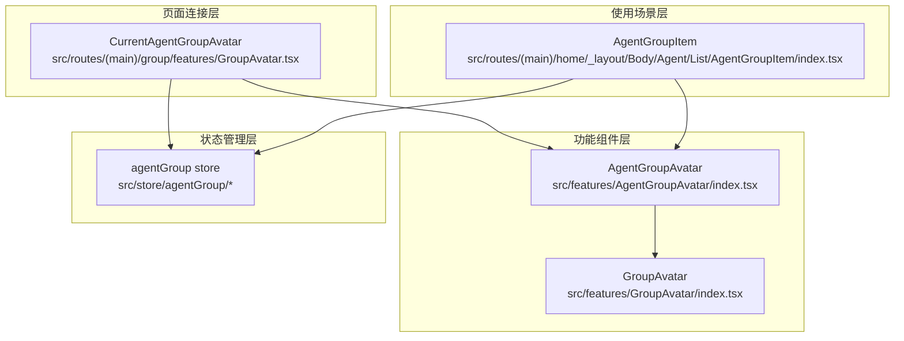
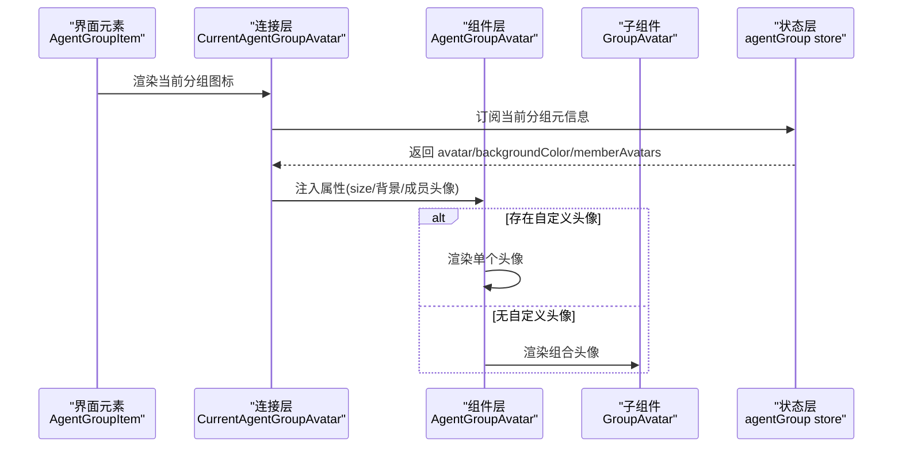
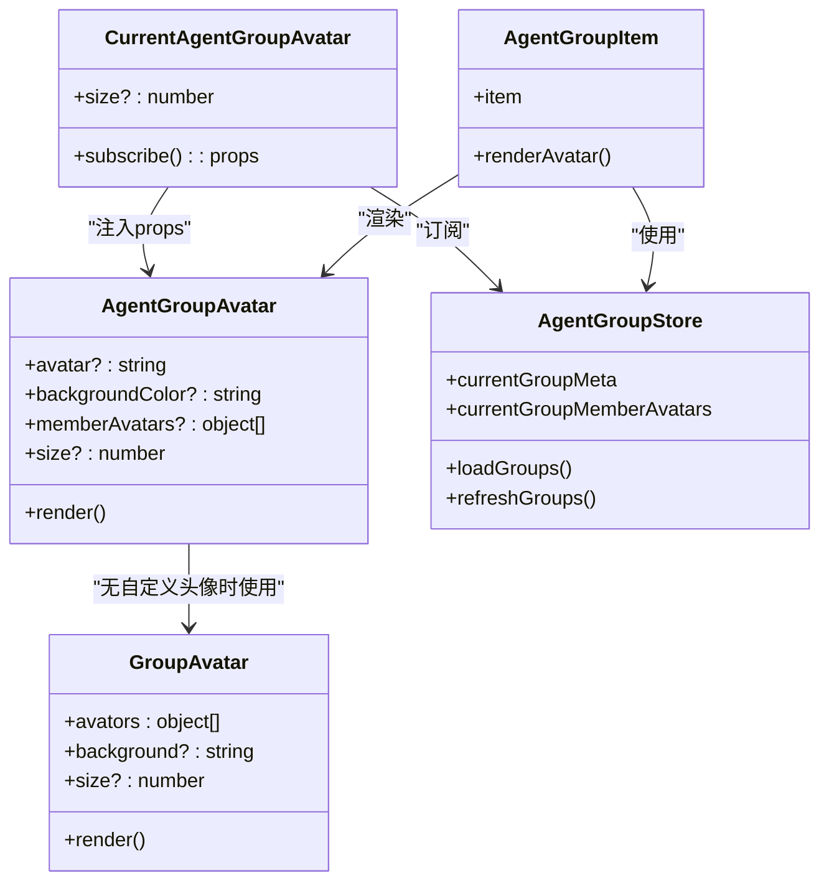

# Agent 分组图标组件

<cite>
**本文引用的文件**
- [src/features/AgentGroupAvatar/index.tsx](file://src/features/AgentGroupAvatar/index.tsx)
- [src/features/GroupAvatar/index.tsx](file://src/features/GroupAvatar/index.tsx)
- [src/routes/(main)/group/features/GroupAvatar.tsx](file://src/routes/(main)/group/features/GroupAvatar.tsx)
- [src/routes/(main)/home/_layout/Body/Agent/List/AgentGroupItem/index.tsx](file://src/routes/(main)/home/_layout/Body/Agent/List/AgentGroupItem/index.tsx)
- [src/store/agentGroup/action.ts](file://src/store/agentGroup/action.ts)
- [src/store/agentGroup/initialState.ts](file://src/store/agentGroup/initialState.ts)
- [src/store/agentGroup/reducers.ts](file://src/store/agentGroup/reducers.ts)
- [src/features/EditingPopover/GroupContent.tsx](file://src/features/EditingPopover/GroupContent.tsx)
</cite>

## 目录

1. [简介](#简介)
2. [项目结构](#项目结构)
3. [核心组件](#核心组件)
4. [架构总览](#架构总览)
5. [组件详解](#组件详解)
6. [依赖关系分析](#依赖关系分析)
7. [性能与优化](#性能与优化)
8. [故障排查指南](#故障排查指南)
9. [结论](#结论)
10. [附录：使用示例与最佳实践](#附录使用示例与最佳实践)

## 简介

本文件围绕 Agent 分组图标组件进行系统化技术文档整理，重点覆盖以下方面：

- 分组图标的生成、自定义、上传与管理流程
- 显示逻辑、尺寸适配、样式定制与交互行为
- 存储机制、缓存策略与性能优化
- 与分组管理系统（Zustand Store）的集成、数据同步与状态更新
- 响应式设计、主题适配与用户体验优化

通过代码级分析与可视化图示，帮助开发者快速理解并实现美观、稳定、高性能的分组图标系统。

## 项目结构

Agent 分组图标相关代码分布在以下位置：

- 功能组件层：AgentGroupAvatar 与 GroupAvatar
- 页面连接层：CurrentAgentGroupAvatar（从 store 读取当前分组元信息）
- 使用场景层：侧边栏分组项中直接渲染
- 状态管理层：agentGroup store（加载、刷新、合并、更新）

图表来源

- [src/features/AgentGroupAvatar/index.tsx](file://src/features/AgentGroupAvatar/index.tsx#L1-L47)
- [src/features/GroupAvatar/index.tsx](file://src/features/GroupAvatar/index.tsx#L1-L67)
- [src/routes/(main)/group/features/GroupAvatar.tsx](<file://src/routes/(main)/group/features/GroupAvatar.tsx#L1-L28>)
- [src/routes/(main)/home/\_layout/Body/Agent/List/AgentGroupItem/index.tsx](<file://src/routes/(main)/home/_layout/Body/Agent/List/AgentGroupItem/index.tsx#L1-L126>)
- [src/store/agentGroup/action.ts](file://src/store/agentGroup/action.ts#L1-L278)

章节来源

- [src/features/AgentGroupAvatar/index.tsx](file://src/features/AgentGroupAvatar/index.tsx#L1-L47)
- [src/features/GroupAvatar/index.tsx](file://src/features/GroupAvatar/index.tsx#L1-L67)
- [src/routes/(main)/group/features/GroupAvatar.tsx](<file://src/routes/(main)/group/features/GroupAvatar.tsx#L1-L28>)
- [src/routes/(main)/home/\_layout/Body/Agent/List/AgentGroupItem/index.tsx](<file://src/routes/(main)/home/_layout/Body/Agent/List/AgentGroupItem/index.tsx#L1-L126>)
- [src/store/agentGroup/action.ts](file://src/store/agentGroup/action.ts#L1-L278)

## 核心组件

- AgentGroupAvatar：根据是否配置自定义头像决定展示单个头像或成员组合头像
- GroupAvatar：@lobehub/ui 提供的组合头像组件封装，支持背景色、圆角等样式定制
- CurrentAgentGroupAvatar：从 agentGroup store 中订阅当前分组元信息并注入到 AgentGroupAvatar
- AgentGroupItem：在侧边栏分组列表中渲染分组图标，并处理拖拽、双击等交互

章节来源

- [src/features/AgentGroupAvatar/index.tsx](file://src/features/AgentGroupAvatar/index.tsx#L8-L46)
- [src/features/GroupAvatar/index.tsx](file://src/features/GroupAvatar/index.tsx#L12-L66)
- [src/routes/(main)/group/features/GroupAvatar.tsx](<file://src/routes/(main)/group/features/GroupAvatar.tsx#L10-L27>)
- [src/routes/(main)/home/\_layout/Body/Agent/List/AgentGroupItem/index.tsx](<file://src/routes/(main)/home/_layout/Body/Agent/List/AgentGroupItem/index.tsx#L70-L89>)

## 架构总览

Agent 分组图标系统采用 “组件 + 连接层 + 状态层” 的分层架构：

- 组件层负责 UI 展示与交互
- 连接层将组件与全局状态绑定，自动获取当前分组元信息
- 状态层负责数据加载、合并、刷新与跨模块同步

图表来源

- [src/routes/(main)/home/\_layout/Body/Agent/List/AgentGroupItem/index.tsx](<file://src/routes/(main)/home/_layout/Body/Agent/List/AgentGroupItem/index.tsx#L70-L89>)
- [src/routes/(main)/group/features/GroupAvatar.tsx](<file://src/routes/(main)/group/features/GroupAvatar.tsx#L13-L25>)
- [src/features/AgentGroupAvatar/index.tsx](file://src/features/AgentGroupAvatar/index.tsx#L27-L44)
- [src/features/GroupAvatar/index.tsx](file://src/features/GroupAvatar/index.tsx#L45-L62)
- [src/store/agentGroup/action.ts](file://src/store/agentGroup/action.ts#L133-L152)

## 组件详解

### AgentGroupAvatar 组件

职责与行为：

- 当传入 avatar 时，渲染单个头像（支持 emoji 或图片 URL），并应用背景色与方形形状
- 当未传入 avatar 时，渲染组合头像（GroupAvatar），成员头像来自 memberAvatars
- 支持 size 参数控制尺寸，默认 28

显示逻辑与样式：

- 自定义头像优先：avatar 存在则走 Avatar 路径
- 组合头像路径：调用 GroupAvatar 并传入 avatars、backgroundColor、size
- 头像形状统一为方形，便于视觉对齐与一致性

交互与尺寸适配：

- 通过 size 控制整体尺寸，适配不同容器密度
- 在侧边栏等场景中，通常使用较小尺寸（如 22）

章节来源

- [src/features/AgentGroupAvatar/index.tsx](file://src/features/AgentGroupAvatar/index.tsx#L8-L46)

### GroupAvatar 组件（内部封装）

职责与行为：

- 接收 avatars 数组，若为空则默认添加一个占位头像
- 自动拼接当前用户头像 / 昵称 / 用户名作为第一个头像，增强归属感
- 支持 background 参数设置背景色，必要时应用圆角样式
- 提供 loading 占位骨架

尺寸与样式：

- 固定方形头像与方形转角，保证组合头像的整齐性
- 支持传入额外样式（如背景色圆角）以满足主题需求

章节来源

- [src/features/GroupAvatar/index.tsx](file://src/features/GroupAvatar/index.tsx#L12-L66)

### CurrentAgentGroupAvatar（store 连接）

职责与行为：

- 从 agentGroup store 中订阅当前分组的元信息与成员头像
- 将元信息注入到 AgentGroupAvatar，形成 “受控组件”
- 使用深比较（fast-deep-equal）避免不必要重渲染

章节来源

- [src/routes/(main)/group/features/GroupAvatar.tsx](<file://src/routes/(main)/group/features/GroupAvatar.tsx#L10-L27>)

### AgentGroupItem（使用场景）

职责与行为：

- 在侧边栏分组列表中渲染分组图标
- 根据 avatar 类型判断是自定义头像还是成员头像数组
- 支持更新中的加载态、拖拽、双击打开新窗口等交互

章节来源

- [src/routes/(main)/home/\_layout/Body/Agent/List/AgentGroupItem/index.tsx](<file://src/routes/(main)/home/_layout/Body/Agent/List/AgentGroupItem/index.tsx#L70-L89>)

### 编辑弹窗中的分组图标（上传与管理）

职责与行为：

- 在编辑弹窗中提供 Emoji 选择器与上传能力
- 支持背景色选择与预览
- 当未设置自定义头像时，预览区域显示组合头像

章节来源

- [src/features/EditingPopover/GroupContent.tsx](file://src/features/EditingPopover/GroupContent.tsx#L125-L210)

## 依赖关系分析

图表来源

- [src/features/AgentGroupAvatar/index.tsx](file://src/features/AgentGroupAvatar/index.tsx#L27-L44)
- [src/features/GroupAvatar/index.tsx](file://src/features/GroupAvatar/index.tsx#L17-L63)
- [src/routes/(main)/group/features/GroupAvatar.tsx](<file://src/routes/(main)/group/features/GroupAvatar.tsx#L13-L25>)
- [src/routes/(main)/home/\_layout/Body/Agent/List/AgentGroupItem/index.tsx](<file://src/routes/(main)/home/_layout/Body/Agent/List/AgentGroupItem/index.tsx#L70-L89>)
- [src/store/agentGroup/action.ts](file://src/store/agentGroup/action.ts#L133-L152)

章节来源

- [src/features/AgentGroupAvatar/index.tsx](file://src/features/AgentGroupAvatar/index.tsx#L1-L47)
- [src/features/GroupAvatar/index.tsx](file://src/features/GroupAvatar/index.tsx#L1-L67)
- [src/routes/(main)/group/features/GroupAvatar.tsx](<file://src/routes/(main)/group/features/GroupAvatar.tsx#L1-L28>)
- [src/routes/(main)/home/\_layout/Body/Agent/List/AgentGroupItem/index.tsx](<file://src/routes/(main)/home/_layout/Body/Agent/List/AgentGroupItem/index.tsx#L1-L126>)
- [src/store/agentGroup/action.ts](file://src/store/agentGroup/action.ts#L1-L278)

## 性能与优化

- 组件级优化
  - 使用 memo 包装，减少不必要的重渲染
  - 深比较订阅（fast-deep-equal），避免因对象浅相等导致的重复渲染
- 数据流优化
  - 通过 useAgentGroupStore 的 selector 订阅最小化数据片段，降低订阅粒度
  - 合并更新策略：在加载与刷新时，保留已有 agents 数据，避免覆盖
- 渲染优化
  - 组合头像在空数组时自动填充默认头像，避免空渲染
  - 占位骨架 loading 模式，提升弱网体验
- 状态同步
  - SWR 钩子用于拉取与刷新，结合 mutate 实现强一致刷新
  - 跨模块同步：分组详情变更后同步至 agentStore，确保模型解析正确

章节来源

- [src/routes/(main)/group/features/GroupAvatar.tsx](<file://src/routes/(main)/group/features/GroupAvatar.tsx#L13-L15>)
- [src/store/agentGroup/action.ts](file://src/store/agentGroup/action.ts#L91-L131)
- [src/features/GroupAvatar/index.tsx](file://src/features/GroupAvatar/index.tsx#L25-L41)

## 故障排查指南

- 自定义头像不显示
  - 检查 avatar 是否为字符串（emoji 或 URL），否则组件会回退到组合头像
  - 确认 backgroundColor 是否正确传入
- 组合头像为空
  - 确保 memberAvatars 传入有效数组；若为空，组件会自动填充默认头像
- 更新后图标未刷新
  - 使用刷新接口触发重新拉取分组详情
  - 确认 SWR 钩子已正确接收新数据并更新 groupMap
- 主题背景色不生效
  - 确认 background 传入值非透明，组件仅对非透明背景启用圆角样式
- 侧边栏图标闪烁或错位
  - 检查 size 传参是否一致，避免不同容器混用不同尺寸
  - 确认 loading 状态与正常状态切换逻辑

章节来源

- [src/features/AgentGroupAvatar/index.tsx](file://src/features/AgentGroupAvatar/index.tsx#L27-L44)
- [src/features/GroupAvatar/index.tsx](file://src/features/GroupAvatar/index.tsx#L45-L62)
- [src/store/agentGroup/action.ts](file://src/store/agentGroup/action.ts#L138-L144)

## 结论

Agent 分组图标组件通过清晰的分层设计与完善的 store 集成，实现了从数据到 UI 的完整闭环。其具备良好的可扩展性与性能表现，能够满足多端、多场景下的展示与交互需求。建议在实际业务中遵循本文档的使用规范与优化建议，确保系统稳定与用户体验一致。

## 附录：使用示例与最佳实践

### 基础用法

- 自定义头像：传入 avatar 字符串（emoji 或 URL），可选 backgroundColor
- 组合头像：传入 memberAvatars 数组，组件自动渲染组合头像
- 尺寸控制：通过 size 参数统一适配不同容器

章节来源

- [src/features/AgentGroupAvatar/index.tsx](file://src/features/AgentGroupAvatar/index.tsx#L27-L44)

### 与分组管理系统的集成

- 在页面中使用 CurrentAgentGroupAvatar 直接渲染当前分组图标
- 在侧边栏等场景中，使用 AgentGroupItem 渲染图标并处理交互
- 通过 agentGroup store 的加载与刷新方法保持数据最新

章节来源

- [src/routes/(main)/group/features/GroupAvatar.tsx](<file://src/routes/(main)/group/features/GroupAvatar.tsx#L13-L25>)
- [src/routes/(main)/home/\_layout/Body/Agent/List/AgentGroupItem/index.tsx](<file://src/routes/(main)/home/_layout/Body/Agent/List/AgentGroupItem/index.tsx#L70-L89>)
- [src/store/agentGroup/action.ts](file://src/store/agentGroup/action.ts#L133-L152)

### 上传与管理流程

- 在编辑弹窗中使用 Emoji 选择器与上传能力设置自定义头像
- 支持背景色选择与预览，未设置时预览组合头像
- 更新后通过刷新接口确保前端与服务端一致

章节来源

- [src/features/EditingPopover/GroupContent.tsx](file://src/features/EditingPopover/GroupContent.tsx#L125-L210)
- [src/store/agentGroup/action.ts](file://src/store/agentGroup/action.ts#L138-L144)

### 响应式与主题适配

- 统一方形头像与转角，保证在不同尺寸下的一致性
- 支持背景色与圆角样式，适配深浅主题
- 在弱网或加载中使用骨架屏，提升感知性能

章节来源

- [src/features/GroupAvatar/index.tsx](file://src/features/GroupAvatar/index.tsx#L45-L62)
