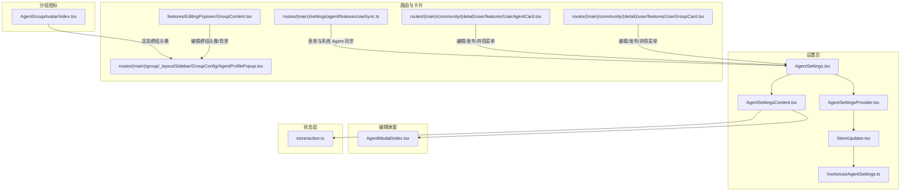
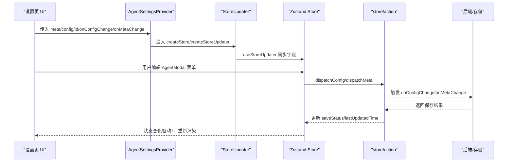
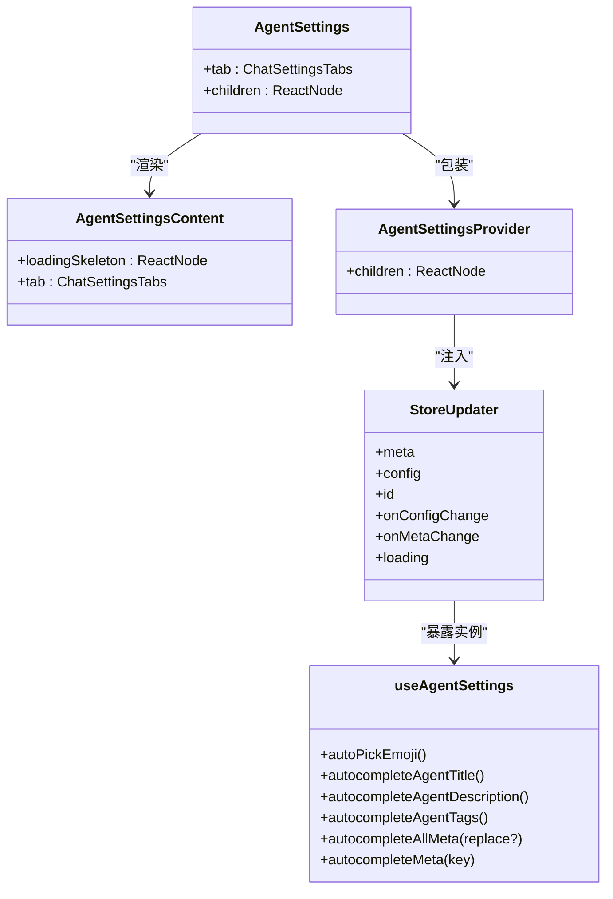
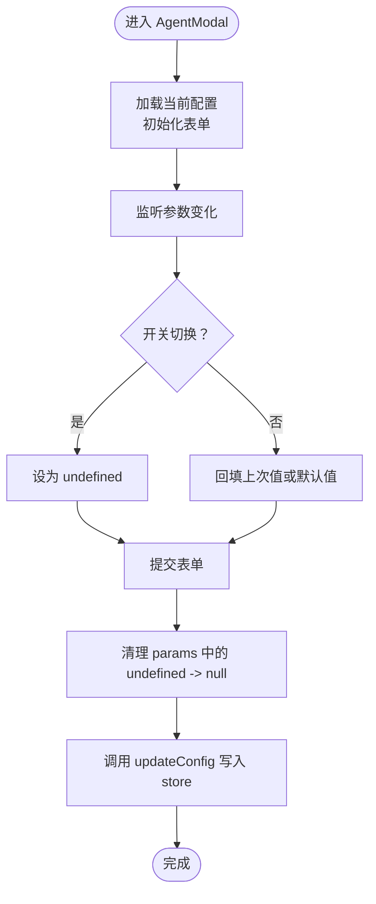
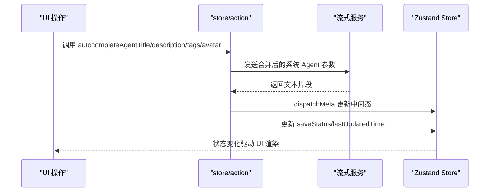
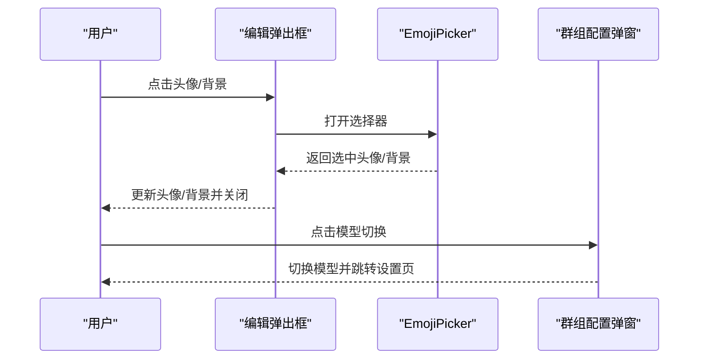
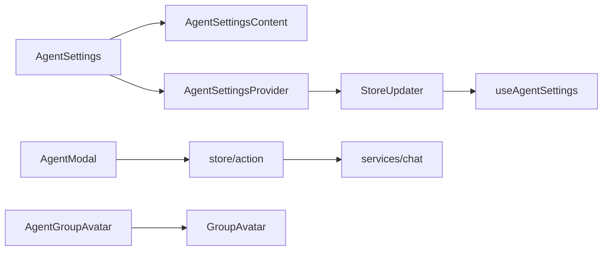

# Agent 管理组件

<cite>
**本文引用的文件**
- [src/features/AgentSetting/index.tsx](file://src/features/AgentSetting/index.tsx)
- [src/features/AgentSetting/AgentSettings.tsx](file://src/features/AgentSetting/AgentSettings.tsx)
- [src/features/AgentSetting/AgentSettingsProvider.tsx](file://src/features/AgentSetting/AgentSettingsProvider.tsx)
- [src/features/AgentSetting/AgentSettingsContent.tsx](file://src/features/AgentSetting/AgentSettingsContent.tsx)
- [src/features/AgentSetting/StoreUpdater.tsx](file://src/features/AgentSetting/StoreUpdater.tsx)
- [src/features/AgentSetting/hooks/useAgentSettings.ts](file://src/features/AgentSetting/hooks/useAgentSettings.ts)
- [src/features/AgentSetting/AgentModal/index.tsx](file://src/features/AgentSetting/AgentModal/index.tsx)
- [src/features/AgentSetting/store/action.ts](file://src/features/AgentSetting/store/action.ts)
- [src/features/AgentGroupAvatar/index.tsx](file://src/features/AgentGroupAvatar/index.tsx)
- [src/routes/(main)/group/_layout/Sidebar/AddGroupMemberModal/store.ts](file://src/routes/(main)/group/_layout/Sidebar/AddGroupMemberModal/store.ts)
- [src/routes/(main)/group/_layout/Sidebar/GroupConfig/AgentProfilePopup.tsx](file://src/routes/(main)/group/_layout/Sidebar/GroupConfig/AgentProfilePopup.tsx)
- [src/features/EditingPopover/GroupContent.tsx](file://src/features/EditingPopover/GroupContent.tsx)
- [src/routes/(main)/community/(detail)/user/features/UserAgentCard.tsx](file://src/routes/(main)/community/(detail)/user/features/UserAgentCard.tsx)
- [src/routes/(main)/community/(detail)/user/features/UserGroupCard.tsx](file://src/routes/(main)/community/(detail)/user/features/UserGroupCard.tsx)
- [src/routes/(main)/settings/agent/features/useSync.ts](file://src/routes/(main)/settings/agent/features/useSync.ts)
</cite>

## 目录

1. [简介](#简介)
2. [项目结构](#项目结构)
3. [核心组件](#核心组件)
4. [架构总览](#架构总览)
5. [组件详解](#组件详解)
6. [依赖关系分析](#依赖关系分析)
7. [性能考量](#性能考量)
8. [故障排查指南](#故障排查指南)
9. [结论](#结论)
10. [附录：使用示例与最佳实践](#附录使用示例与最佳实践)

## 简介

本文件系统性梳理 LobeHub 的 Agent 管理组件体系，覆盖 Agent 设置组件、Agent 信息组件、Agent 分组图标组件以及编辑弹出框组件等核心模块。重点阐述以下方面：

- 配置管理与状态编辑：基于 Zustand 的状态模型、分发器与 reducer，支持元数据与对话参数的实时编辑与持久化。
- 用户界面交互：Ant Design 表单与 @lobehub/ui 组件组合，提供滑条 + 开关、下拉 + 开关等参数控制，支持流式生成与自动补全。
- 数据持久化机制：通过 onConfigChange/onMetaChange 回调将变更写回后端或全局存储；保存状态与错误处理。
- 实时预览与验证：参数切换时即时生效，流式更新在 UI 上逐步呈现；禁用参数以 null 标记确保后端正确识别。
- 批量操作与配置导入导出：通过 store 内部动作与外部回调扩展，可对接批量更新与导入导出流程。
- 组件间通信与状态同步：Provider 注入、StoreUpdater 同步、useAgentSettings 暴露公共方法，确保多处编辑的一致性。

## 项目结构

Agent 管理相关代码主要集中在 features/AgentSetting 与 routes 中的设置页、群组侧边栏、社区卡片等位置，配合 store 层完成状态管理与持久化。



**图表来源**

- [src/features/AgentSetting/AgentSettings.tsx](file://src/features/AgentSetting/AgentSettings.tsx#L1-L31)
- [src/features/AgentSetting/AgentSettingsContent.tsx](file://src/features/AgentSetting/AgentSettingsContent.tsx#L1-L34)
- [src/features/AgentSetting/AgentSettingsProvider.tsx](file://src/features/AgentSetting/AgentSettingsProvider.tsx#L1-L20)
- [src/features/AgentSetting/StoreUpdater.tsx](file://src/features/AgentSetting/StoreUpdater.tsx#L1-L38)
- [src/features/AgentSetting/hooks/useAgentSettings.ts](file://src/features/AgentSetting/hooks/useAgentSettings.ts#L1-L32)
- [src/features/AgentSetting/AgentModal/index.tsx](file://src/features/AgentSetting/AgentModal/index.tsx#L1-L365)
- [src/features/AgentSetting/store/action.ts](file://src/features/AgentSetting/store/action.ts#L1-L388)
- [src/features/AgentGroupAvatar/index.tsx](file://src/features/AgentGroupAvatar/index.tsx#L1-L46)
- [src/routes/(main)/settings/agent/features/useSync.ts](<file://src/routes/(main)/settings/agent/features/useSync.ts#L1-L23>)
- [src/routes/(main)/group/\_layout/Sidebar/GroupConfig/AgentProfilePopup.tsx](<file://src/routes/(main)/group/_layout/Sidebar/GroupConfig/AgentProfilePopup.tsx#L90-L126>)
- [src/features/EditingPopover/GroupContent.tsx](file://src/features/EditingPopover/GroupContent.tsx#L125-L163)
- [src/routes/(main)/community/(detail)/user/features/UserAgentCard.tsx](<file://src/routes/(main)/community/(detail)/user/features/UserAgentCard.tsx#L208-L248>)
- [src/routes/(main)/community/(detail)/user/features/UserGroupCard.tsx](<file://src/routes/(main)/community/(detail)/user/features/UserGroupCard.tsx#L157-L184>)

**章节来源**

- [src/features/AgentSetting/index.tsx](file://src/features/AgentSetting/index.tsx#L1-L5)
- [src/features/AgentSetting/AgentSettings.tsx](file://src/features/AgentSetting/AgentSettings.tsx#L1-L31)
- [src/features/AgentSetting/AgentSettingsContent.tsx](file://src/features/AgentSetting/AgentSettingsContent.tsx#L1-L34)
- [src/features/AgentSetting/AgentSettingsProvider.tsx](file://src/features/AgentSetting/AgentSettingsProvider.tsx#L1-L20)
- [src/features/AgentSetting/StoreUpdater.tsx](file://src/features/AgentSetting/StoreUpdater.tsx#L1-L38)
- [src/features/AgentSetting/hooks/useAgentSettings.ts](file://src/features/AgentSetting/hooks/useAgentSettings.ts#L1-L32)
- [src/features/AgentSetting/AgentModal/index.tsx](file://src/features/AgentSetting/AgentModal/index.tsx#L1-L365)
- [src/features/AgentSetting/store/action.ts](file://src/features/AgentSetting/store/action.ts#L1-L388)
- [src/features/AgentGroupAvatar/index.tsx](file://src/features/AgentGroupAvatar/index.tsx#L1-L46)
- [src/routes/(main)/settings/agent/features/useSync.ts](<file://src/routes/(main)/settings/agent/features/useSync.ts#L1-L23>)
- [src/routes/(main)/group/\_layout/Sidebar/GroupConfig/AgentProfilePopup.tsx](<file://src/routes/(main)/group/_layout/Sidebar/GroupConfig/AgentProfilePopup.tsx#L90-L126>)
- [src/features/EditingPopover/GroupContent.tsx](file://src/features/EditingPopover/GroupContent.tsx#L125-L163)
- [src/routes/(main)/community/(detail)/user/features/UserAgentCard.tsx](<file://src/routes/(main)/community/(detail)/user/features/UserAgentCard.tsx#L208-L248>)
- [src/routes/(main)/community/(detail)/user/features/UserGroupCard.tsx](<file://src/routes/(main)/community/(detail)/user/features/UserGroupCard.tsx#L157-L184>)

## 核心组件

- AgentSettings：设置页容器，负责根据 tab 渲染不同子面板，并提供加载骨架屏。
- AgentSettingsContent：根据当前 Agent 加载状态决定是否显示骨架屏，按标签页切换渲染具体面板（元数据、开场白、聊天、弹窗）。
- AgentSettingsProvider：Zustand Provider 包装，注入 store 并挂载 StoreUpdater。
- StoreUpdater：将外部传入的 meta/config/id/onConfigChange/onMetaChange 等属性同步到 store，并暴露 useAgentSettings 实例。
- useAgentSettings：从 store API 提取公共动作（如自动补全、标题 / 描述 / 标签 / 头像生成），供上层组件直接调用。
- AgentModal：对话参数编辑弹窗，支持温度、采样比例、惩罚项、最大令牌数、推理强度等参数的开关式滑条 / 下拉选择，提交时清理 undefined/null 参数并调用更新函数。
- store/action：定义公共动作与内部动作，包括自动补全、流式更新、重置、保存状态跟踪、插件开关等。

**章节来源**

- [src/features/AgentSetting/AgentSettings.tsx](file://src/features/AgentSetting/AgentSettings.tsx#L1-L31)
- [src/features/AgentSetting/AgentSettingsContent.tsx](file://src/features/AgentSetting/AgentSettingsContent.tsx#L1-L34)
- [src/features/AgentSetting/AgentSettingsProvider.tsx](file://src/features/AgentSetting/AgentSettingsProvider.tsx#L1-L20)
- [src/features/AgentSetting/StoreUpdater.tsx](file://src/features/AgentSetting/StoreUpdater.tsx#L1-L38)
- [src/features/AgentSetting/hooks/useAgentSettings.ts](file://src/features/AgentSetting/hooks/useAgentSettings.ts#L1-L32)
- [src/features/AgentSetting/AgentModal/index.tsx](file://src/features/AgentSetting/AgentModal/index.tsx#L1-L365)
- [src/features/AgentSetting/store/action.ts](file://src/features/AgentSetting/store/action.ts#L1-L388)

## 架构总览

Agent 管理采用 “容器组件 + Provider + StoreUpdater + 动作层” 的分层架构：

- 容器层：AgentSettings/AgentSettingsContent 负责页面级布局与 tab 切换。
- 状态层：Zustand store 提供状态与动作，action.ts 定义公共 API。
- 编辑层：AgentModal 等表单组件负责参数编辑与提交。
- 同步层：StoreUpdater 将外部 props 同步至 store，并通过 useImperativeHandle 暴露实例。
- 交互层：自动补全、流式更新、保存状态反馈、插件开关等。



**图表来源**

- [src/features/AgentSetting/AgentSettingsProvider.tsx](file://src/features/AgentSetting/AgentSettingsProvider.tsx#L12-L19)
- [src/features/AgentSetting/StoreUpdater.tsx](file://src/features/AgentSetting/StoreUpdater.tsx#L18-L34)
- [src/features/AgentSetting/store/action.ts](file://src/features/AgentSetting/store/action.ts#L249-L288)

**章节来源**

- [src/features/AgentSetting/AgentSettingsProvider.tsx](file://src/features/AgentSetting/AgentSettingsProvider.tsx#L1-L20)
- [src/features/AgentSetting/StoreUpdater.tsx](file://src/features/AgentSetting/StoreUpdater.tsx#L1-L38)
- [src/features/AgentSetting/store/action.ts](file://src/features/AgentSetting/store/action.ts#L1-L388)

## 组件详解

### Agent 设置容器与内容面板

- AgentSettings：根据服务端配置判断移动端样式，包裹 AgentSettingsContent，并提供加载骨架屏。
- AgentSettingsContent：依据 Agent 加载状态与 tab 值渲染对应面板（元数据、开场白、聊天、弹窗）。
- AgentSettingsProvider：以 Provider 包裹子树，注入 createStore 并挂载 StoreUpdater。
- StoreUpdater：将外部传入的 meta/config/id/onConfigChange/onMetaChange 等同步到 store，并通过 useImperativeHandle 暴露 useAgentSettings 实例。
- useAgentSettings：封装对 store 的访问，返回公共动作集合，便于上层直接调用。



**图表来源**

- [src/features/AgentSetting/AgentSettings.tsx](file://src/features/AgentSetting/AgentSettings.tsx#L11-L28)
- [src/features/AgentSetting/AgentSettingsContent.tsx](file://src/features/AgentSetting/AgentSettingsContent.tsx#L13-L31)
- [src/features/AgentSetting/AgentSettingsProvider.tsx](file://src/features/AgentSetting/AgentSettingsProvider.tsx#L8-L19)
- [src/features/AgentSetting/StoreUpdater.tsx](file://src/features/AgentSetting/StoreUpdater.tsx#L12-L34)
- [src/features/AgentSetting/hooks/useAgentSettings.ts](file://src/features/AgentSetting/hooks/useAgentSettings.ts#L8-L31)

**章节来源**

- [src/features/AgentSetting/AgentSettings.tsx](file://src/features/AgentSetting/AgentSettings.tsx#L1-L31)
- [src/features/AgentSetting/AgentSettingsContent.tsx](file://src/features/AgentSetting/AgentSettingsContent.tsx#L1-L34)
- [src/features/AgentSetting/AgentSettingsProvider.tsx](file://src/features/AgentSetting/AgentSettingsProvider.tsx#L1-L20)
- [src/features/AgentSetting/StoreUpdater.tsx](file://src/features/AgentSetting/StoreUpdater.tsx#L1-L38)
- [src/features/AgentSetting/hooks/useAgentSettings.ts](file://src/features/AgentSetting/hooks/useAgentSettings.ts#L1-L32)

### Agent 对话参数编辑弹窗（AgentModal）

- 表单结构：包含 “启用流式输出” 开关与多个参数项（温度、采样比例、惩罚项、最大令牌数、推理强度），均支持 “开关 + 控件” 组合。
- 参数控制逻辑：
  - 开关关闭时，将对应字段设为 undefined；开启时回填上次值或默认值。
  - 最大令牌数与推理强度提供 “无限制输入” 能力。
- 提交流程：清理 params 中的 undefined 为 null（以便后端识别禁用），随后调用 updateConfig 写入 store。
- 实时预览：参数变更即刻反映到表单初始值与控件状态。



**图表来源**

- [src/features/AgentSetting/AgentModal/index.tsx](file://src/features/AgentSetting/AgentModal/index.tsx#L146-L362)

**章节来源**

- [src/features/AgentSetting/AgentModal/index.tsx](file://src/features/AgentSetting/AgentModal/index.tsx#L1-L365)

### 自动补全与流式更新（store/action）

- 自动补全：支持标题、描述、标签、头像（表情包）的自动生成，内部通过系统 Agent 参数与提示链组合，触发后端流式响应。
- 流式更新：提供字符串与数组两类流式更新器，逐步拼接文本并更新 store，同时维护 loadingState。
- 保存状态：在执行 onConfigChange/onMetaChange 前后更新 saveStatus，异常时回退状态或保持 idle。
- 插件开关：支持按插件 ID 切换启用状态。



**图表来源**

- [src/features/AgentSetting/store/action.ts](file://src/features/AgentSetting/store/action.ts#L112-L199)
- [src/features/AgentSetting/store/action.ts](file://src/features/AgentSetting/store/action.ts#L341-L363)
- [src/features/AgentSetting/store/action.ts](file://src/features/AgentSetting/store/action.ts#L269-L288)

**章节来源**

- [src/features/AgentSetting/store/action.ts](file://src/features/AgentSetting/store/action.ts#L1-L388)

### Agent 分组图标组件（AgentGroupAvatar）

- 当存在自定义头像时，直接展示该头像与背景色；否则组合成员头像形成网格。
- 支持方形头像与圆角背景样式，尺寸可配置。

```mermaid
classDiagram
class AgentGroupAvatar {
+avatar? : string
+backgroundColor? : string
+memberAvatars? : {avatar?, background?}[]
+size? : number
+render()
}
AgentGroupAvatar : "有自定义头像则展示<br/>否则组合成员头像"
```

**图表来源**

- [src/features/AgentGroupAvatar/index.tsx](file://src/features/AgentGroupAvatar/index.tsx#L8-L44)

**章节来源**

- [src/features/AgentGroupAvatar/index.tsx](file://src/features/AgentGroupAvatar/index.tsx#L1-L46)

### 编辑弹出框与群组配置（编辑弹出框组件）

- 编辑弹出框内容中提供 EmojiPicker，支持上传 / 删除头像与背景色选择，点击头像区域阻止事件冒泡，避免误触关闭。
- 群组配置弹窗中提供模型切换与 “设置” 入口，便于快速进入 Agent 配置页。



**图表来源**

- [src/features/EditingPopover/GroupContent.tsx](file://src/features/EditingPopover/GroupContent.tsx#L125-L163)
- [src/routes/(main)/group/\_layout/Sidebar/GroupConfig/AgentProfilePopup.tsx](<file://src/routes/(main)/group/_layout/Sidebar/GroupConfig/AgentProfilePopup.tsx#L90-L126>)

**章节来源**

- [src/features/EditingPopover/GroupContent.tsx](file://src/features/EditingPopover/GroupContent.tsx#L125-L163)
- [src/routes/(main)/group/\_layout/Sidebar/GroupConfig/AgentProfilePopup.tsx](<file://src/routes/(main)/group/_layout/Sidebar/GroupConfig/AgentProfilePopup.tsx#L90-L126>)

### 社区卡片中的编辑与状态操作

- 用户卡片与群组卡片提供 “编辑 / 查看详情 / 发布 / 取消发布 / 弃用” 菜单项，点击后触发 onStatusChange 或导航到详情页。
- 这些操作与 Agent 设置页协同工作，保证状态一致性。

**章节来源**

- [src/routes/(main)/community/(detail)/user/features/UserAgentCard.tsx](<file://src/routes/(main)/community/(detail)/user/features/UserAgentCard.tsx#L208-L248>)
- [src/routes/(main)/community/(detail)/user/features/UserGroupCard.tsx](<file://src/routes/(main)/community/(detail)/user/features/UserGroupCard.tsx#L157-L184>)

### 设置页与系统 Agent 的同步

- useSync 将系统 Agent 设置与表单进行双向同步，首次设置初始值并在 store 变更时更新表单，离开时取消订阅。

**章节来源**

- [src/routes/(main)/settings/agent/features/useSync.ts](<file://src/routes/(main)/settings/agent/features/useSync.ts#L1-L23>)

## 依赖关系分析

- 组件耦合与内聚：
  - AgentSettings 与 AgentSettingsContent 低耦合，通过 tab 切换实现高内聚的功能面板。
  - AgentSettingsProvider 与 StoreUpdater 通过 createStore/createStoreUpdater 解耦，便于复用。
  - AgentModal 与 store/action 通过 updateConfig/dispatchConfig 解耦，便于扩展其他编辑器。
- 外部依赖：
  - @lobehub/ui/AntdForm 提供表单与控件。
  - chatService 提供自动补全与流式更新能力。
  - fast-deep-equal 用于浅比较优化渲染。
- 潜在循环依赖：
  - store/action 依赖 store/reducers 与 services/chat，需注意避免相互引用导致的循环。



**图表来源**

- [src/features/AgentSetting/AgentSettings.tsx](file://src/features/AgentSetting/AgentSettings.tsx#L1-L31)
- [src/features/AgentSetting/AgentSettingsContent.tsx](file://src/features/AgentSetting/AgentSettingsContent.tsx#L1-L34)
- [src/features/AgentSetting/AgentSettingsProvider.tsx](file://src/features/AgentSetting/AgentSettingsProvider.tsx#L1-L20)
- [src/features/AgentSetting/StoreUpdater.tsx](file://src/features/AgentSetting/StoreUpdater.tsx#L1-L38)
- [src/features/AgentSetting/hooks/useAgentSettings.ts](file://src/features/AgentSetting/hooks/useAgentSettings.ts#L1-L32)
- [src/features/AgentSetting/AgentModal/index.tsx](file://src/features/AgentSetting/AgentModal/index.tsx#L1-L365)
- [src/features/AgentSetting/store/action.ts](file://src/features/AgentSetting/store/action.ts#L1-L388)
- [src/features/AgentGroupAvatar/index.tsx](file://src/features/AgentGroupAvatar/index.tsx#L1-L46)

**章节来源**

- [src/features/AgentSetting/AgentSettings.tsx](file://src/features/AgentSetting/AgentSettings.tsx#L1-L31)
- [src/features/AgentSetting/AgentSettingsContent.tsx](file://src/features/AgentSetting/AgentSettingsContent.tsx#L1-L34)
- [src/features/AgentSetting/AgentSettingsProvider.tsx](file://src/features/AgentSetting/AgentSettingsProvider.tsx#L1-L20)
- [src/features/AgentSetting/StoreUpdater.tsx](file://src/features/AgentSetting/StoreUpdater.tsx#L1-L38)
- [src/features/AgentSetting/hooks/useAgentSettings.ts](file://src/features/AgentSetting/hooks/useAgentSettings.ts#L1-L32)
- [src/features/AgentSetting/AgentModal/index.tsx](file://src/features/AgentSetting/AgentModal/index.tsx#L1-L365)
- [src/features/AgentSetting/store/action.ts](file://src/features/AgentSetting/store/action.ts#L1-L388)
- [src/features/AgentGroupAvatar/index.tsx](file://src/features/AgentGroupAvatar/index.tsx#L1-L46)

## 性能考量

- 渲染优化：
  - 使用 Suspense 与骨架屏减少首屏等待与闪烁。
  - StoreUpdater 使用 createStoreUpdater 仅在必要字段变化时更新，降低重渲染。
  - AgentGroupAvatar 使用 memo 与浅比较，避免不必要的重渲染。
- 状态更新：
  - 流式更新采用增量拼接，避免一次性大对象更新。
  - 保存状态 idle/saving/saved 三态，减少无效请求。
- 表单处理：
  - 提交前清理 undefined 为 null，减少无效字段传输。
  - 参数开关与默认值策略，避免频繁回填。

\[本节为通用指导，不直接分析具体文件]

## 故障排查指南

- 自动补全失败：
  - 检查系统 Agent 参数是否正确合并；确认 chatService 请求是否抛出 AbortError；观察 saveStatus 是否回到 idle。
- 流式更新未显示：
  - 确认 streamUpdateMetaString/streamUpdateMetaArray 的回调已注册；检查后端 SSE 是否正常推送。
- 表单提交无效：
  - 确认 updateConfig 已被调用；检查 params 中 undefined 是否已被清理为 null；核对 onConfigChange/onMetaChange 回调是否成功写入。
- 状态未同步：
  - 确认 StoreUpdater 已同步 meta/config/id/onConfigChange/onMetaChange；检查 useImperativeHandle 是否正确暴露实例。

**章节来源**

- [src/features/AgentSetting/store/action.ts](file://src/features/AgentSetting/store/action.ts#L249-L288)
- [src/features/AgentSetting/store/action.ts](file://src/features/AgentSetting/store/action.ts#L341-L363)
- [src/features/AgentSetting/AgentModal/index.tsx](file://src/features/AgentSetting/AgentModal/index.tsx#L343-L361)
- [src/features/AgentSetting/StoreUpdater.tsx](file://src/features/AgentSetting/StoreUpdater.tsx#L18-L34)

## 结论

本组件体系以 Zustand 为核心，结合 Provider/StoreUpdater 实现状态注入与同步，通过 AgentModal 等表单组件提供直观的参数编辑体验，并借助自动补全与流式更新提升交互效率。整体架构清晰、职责分离明确，易于扩展批量操作、导入导出与多 Agent 管理场景。

\[本节为总结性内容，不直接分析具体文件]

## 附录：使用示例与最佳实践

- 在设置页中引入 AgentSettings，并传入 meta/config/id/onConfigChange/onMetaChange，即可获得完整的 Agent 配置编辑能力。
- 使用 useAgentSettings 暴露的动作实现 “一键生成标题 / 描述 / 标签 / 头像”，并结合 saveStatus 做 UI 反馈。
- 在群组侧边栏或编辑弹出框中使用 AgentGroupAvatar 展示分组头像，必要时通过 EmojiPicker 与背景色选择器进行个性化定制。
- 对于批量操作与导入导出，可在 onConfigChange/onMetaChange 中接入批量接口，先在本地合并后再统一提交，减少网络往返。

\[本节为通用指导，不直接分析具体文件]
