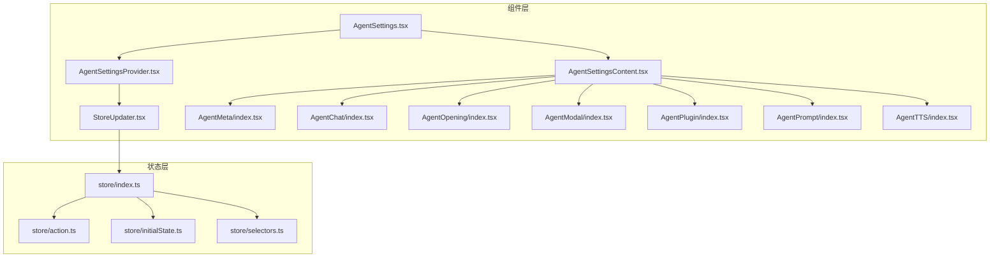
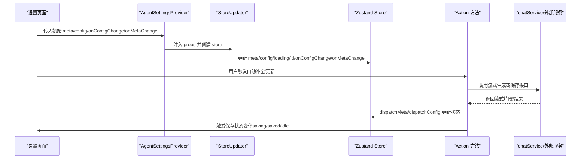
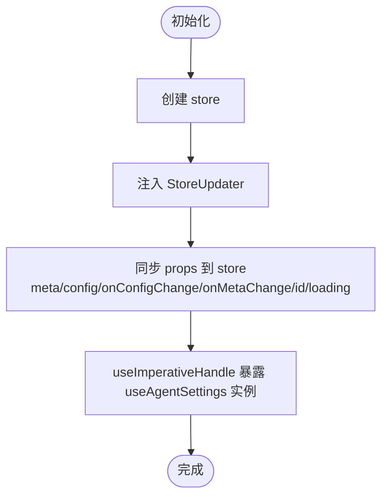
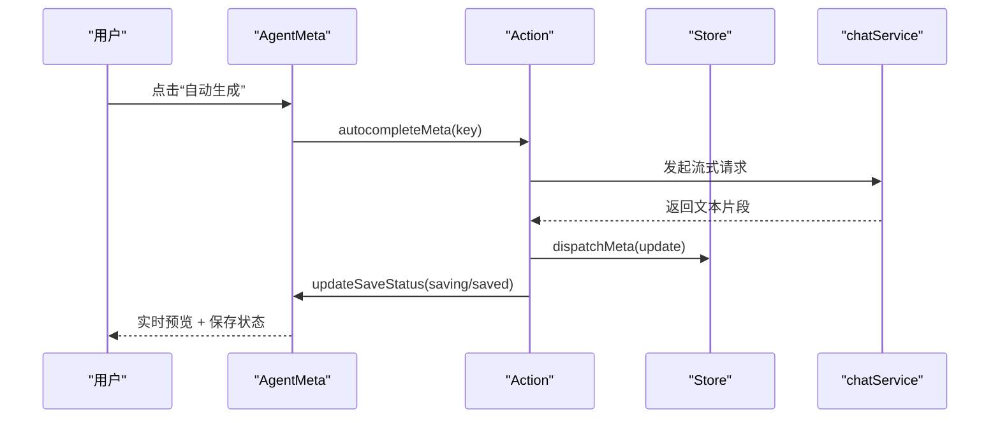
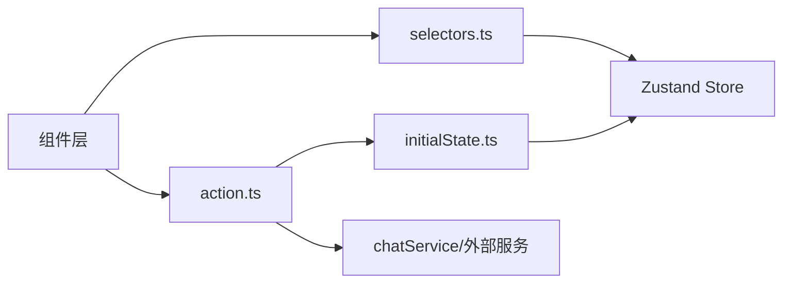

# Agent 设置组件

<cite>
**本文引用的文件**
- [src/features/AgentSetting/AgentSettings.tsx](file://src/features/AgentSetting/AgentSettings.tsx)
- [src/features/AgentSetting/AgentSettingsContent.tsx](file://src/features/AgentSetting/AgentSettingsContent.tsx)
- [src/features/AgentSetting/AgentSettingsProvider.tsx](file://src/features/AgentSetting/AgentSettingsProvider.tsx)
- [src/features/AgentSetting/StoreUpdater.tsx](file://src/features/AgentSetting/StoreUpdater.tsx)
- [src/features/AgentSetting/hooks/useAgentSettings.ts](file://src/features/AgentSetting/hooks/useAgentSettings.ts)
- [src/features/AgentSetting/store/index.ts](file://src/features/AgentSetting/store/index.ts)
- [src/features/AgentSetting/store/action.ts](file://src/features/AgentSetting/store/action.ts)
- [src/features/AgentSetting/store/initialState.ts](file://src/features/AgentSetting/store/initialState.ts)
- [src/features/AgentSetting/store/selectors.ts](file://src/features/AgentSetting/store/selectors.ts)
- [src/features/AgentSetting/AgentMeta/index.tsx](file://src/features/AgentSetting/AgentMeta/index.tsx)
- [src/features/AgentSetting/AgentChat/index.tsx](file://src/features/AgentSetting/AgentChat/index.tsx)
- [src/features/AgentSetting/AgentOpening/index.tsx](file://src/features/AgentSetting/AgentOpening/index.tsx)
- [src/features/AgentSetting/AgentModal/index.tsx](file://src/features/AgentSetting/AgentModal/index.tsx)
- [src/features/AgentSetting/AgentPlugin/index.tsx](file://src/features/AgentSetting/AgentPlugin/index.tsx)
- [src/features/AgentSetting/AgentPrompt/index.tsx](file://src/features/AgentSetting/AgentPrompt/index.tsx)
- [src/features/AgentSetting/AgentTTS/index.tsx](file://src/features/AgentSetting/AgentTTS/index.tsx)
</cite>

## 目录
1. [简介](#简介)
2. [项目结构](#项目结构)
3. [核心组件](#核心组件)
4. [架构总览](#架构总览)
5. [组件详解](#组件详解)
6. [依赖关系分析](#依赖关系分析)
7. [性能考量](#性能考量)
8. [故障排查指南](#故障排查指南)
9. [结论](#结论)
10. [附录：配置示例与最佳实践](#附录配置示例与最佳实践)

## 简介
本文件系统性梳理 Agent 设置组件的实现，覆盖 AgentSettings、AgentSettingsContent、AgentSettingsProvider 等核心组件，并深入解析其背后的状态管理、数据流、自动补全与保存机制。内容涵盖基础设置（元数据）、高级设置（对话参数、TTS、插件等）、提示词模板、表单数据绑定与校验、实时预览与保存流程、持久化与版本管理、导入导出、以及与全局状态系统的集成与冲突处理。

## 项目结构
Agent 设置相关代码位于 features/AgentSetting 目录下，采用按功能域分层组织：
- 组件层：AgentSettings、AgentSettingsContent、各 Tab 子组件（AgentMeta、AgentChat、AgentOpening、AgentModal、AgentPlugin、AgentPrompt、AgentTTS）
- 状态层：store（包含 initialState、action、selectors、index）
- 工具层：StoreUpdater、hooks/useAgentSettings

图表来源
- [src/features/AgentSetting/AgentSettings.tsx](file://src/features/AgentSetting/AgentSettings.tsx#L1-L31)
- [src/features/AgentSetting/AgentSettingsContent.tsx](file://src/features/AgentSetting/AgentSettingsContent.tsx#L1-L34)
- [src/features/AgentSetting/AgentSettingsProvider.tsx](file://src/features/AgentSetting/AgentSettingsProvider.tsx#L1-L20)
- [src/features/AgentSetting/StoreUpdater.tsx](file://src/features/AgentSetting/StoreUpdater.tsx#L1-L38)
- [src/features/AgentSetting/store/index.ts](file://src/features/AgentSetting/store/index.ts#L1-L19)
- [src/features/AgentSetting/store/action.ts](file://src/features/AgentSetting/store/action.ts#L1-L388)
- [src/features/AgentSetting/store/initialState.ts](file://src/features/AgentSetting/store/initialState.ts#L1-L35)
- [src/features/AgentSetting/store/selectors.ts](file://src/features/AgentSetting/store/selectors.ts#L1-L33)

章节来源
- [src/features/AgentSetting/AgentSettings.tsx](file://src/features/AgentSetting/AgentSettings.tsx#L1-L31)
- [src/features/AgentSetting/AgentSettingsContent.tsx](file://src/features/AgentSetting/AgentSettingsContent.tsx#L1-L34)
- [src/features/AgentSetting/AgentSettingsProvider.tsx](file://src/features/AgentSetting/AgentSettingsProvider.tsx#L1-L20)
- [src/features/AgentSetting/StoreUpdater.tsx](file://src/features/AgentSetting/StoreUpdater.tsx#L1-L38)
- [src/features/AgentSetting/store/index.ts](file://src/features/AgentSetting/store/index.ts#L1-L19)

## 核心组件
- AgentSettings：设置页容器，负责根据当前 Tab 渲染对应内容，并在加载态使用骨架屏。
- AgentSettingsContent：根据当前 Tab 渲染具体设置面板（Meta、Opening、Chat、Modal）。
- AgentSettingsProvider：提供 Zustand store 上下文与 StoreUpdater，注入外部传入的配置变更回调与初始值。
- StoreUpdater：将外部 props（如 meta、config、onConfigChange、onMetaChange、id、loading）更新到 store，并暴露 useAgentSettings 实例。
- useAgentSettings：从 store 中抽取公共操作（如自动补全、元数据更新等），供上层调用。

章节来源
- [src/features/AgentSetting/AgentSettings.tsx](file://src/features/AgentSetting/AgentSettings.tsx#L11-L28)
- [src/features/AgentSetting/AgentSettingsContent.tsx](file://src/features/AgentSetting/AgentSettingsContent.tsx#L13-L31)
- [src/features/AgentSetting/AgentSettingsProvider.tsx](file://src/features/AgentSetting/AgentSettingsProvider.tsx#L8-L19)
- [src/features/AgentSetting/StoreUpdater.tsx](file://src/features/AgentSetting/StoreUpdater.tsx#L12-L34)
- [src/features/AgentSetting/hooks/useAgentSettings.ts](file://src/features/AgentSetting/hooks/useAgentSettings.ts#L6-L31)

## 架构总览
Agent 设置采用“组件 + Zustand 状态”的分层架构：
- 组件层仅负责渲染与交互，不直接持有业务逻辑。
- 状态层集中管理 Agent 的配置与元数据，提供统一的派发器与选择器。
- StoreUpdater 将外部输入与回调注入 store，形成“外部输入 → store → 外部回调”的闭环。
- 各 Tab 子组件通过 selectors 读取合并后的配置，避免重复合并逻辑。

图表来源
- [src/features/AgentSetting/AgentSettingsProvider.tsx](file://src/features/AgentSetting/AgentSettingsProvider.tsx#L12-L19)
- [src/features/AgentSetting/StoreUpdater.tsx](file://src/features/AgentSetting/StoreUpdater.tsx#L18-L34)
- [src/features/AgentSetting/store/action.ts](file://src/features/AgentSetting/store/action.ts#L91-L387)

## 组件详解

### AgentSettingsProvider 与 StoreUpdater
- AgentSettingsProvider 使用 createContext 包裹 Provider，并注入 StoreUpdater，确保子树可访问 store。
- StoreUpdater 将外部传入的 meta/config/onConfigChange/onMetaChange/id/loading 同步到 store，并通过 useImperativeHandle 暴露 useAgentSettings 实例给父组件。

图表来源
- [src/features/AgentSetting/AgentSettingsProvider.tsx](file://src/features/AgentSetting/AgentSettingsProvider.tsx#L12-L19)
- [src/features/AgentSetting/StoreUpdater.tsx](file://src/features/AgentSetting/StoreUpdater.tsx#L18-L34)

章节来源
- [src/features/AgentSetting/AgentSettingsProvider.tsx](file://src/features/AgentSetting/AgentSettingsProvider.tsx#L1-L20)
- [src/features/AgentSetting/StoreUpdater.tsx](file://src/features/AgentSetting/StoreUpdater.tsx#L1-L38)

### AgentSettings 与 AgentSettingsContent
- AgentSettings 根据 tab 渲染对应内容，并在加载时显示骨架屏。
- AgentSettingsContent 根据 loading 状态决定是否渲染骨架屏；否则按 Tab 渲染不同设置面板。

章节来源
- [src/features/AgentSetting/AgentSettings.tsx](file://src/features/AgentSetting/AgentSettings.tsx#L15-L28)
- [src/features/AgentSetting/AgentSettingsContent.tsx](file://src/features/AgentSetting/AgentSettingsContent.tsx#L18-L31)

### 元数据设置（AgentMeta）
- 表单字段：头像、背景色、名称、描述、标签。
- 自动补全：基于 systemRole 是否存在决定可用性；支持单项与一键全部自动补全。
- 实时预览：通过 loadingState 显示生成中状态；流式更新使用 streamUpdateMetaString/streamUpdateMetaArray。
- 保存与追踪：提交后触发 onMetaChange 回调并上报埋点。

图表来源
- [src/features/AgentSetting/AgentMeta/index.tsx](file://src/features/AgentSetting/AgentMeta/index.tsx#L21-L148)
- [src/features/AgentSetting/store/action.ts](file://src/features/AgentSetting/store/action.ts#L112-L199)
- [src/features/AgentSetting/store/action.ts](file://src/features/AgentSetting/store/action.ts#L341-L363)

章节来源
- [src/features/AgentSetting/AgentMeta/index.tsx](file://src/features/AgentSetting/AgentMeta/index.tsx#L21-L151)
- [src/features/AgentSetting/store/action.ts](file://src/features/AgentSetting/store/action.ts#L93-L111)
- [src/features/AgentSetting/store/action.ts](file://src/features/AgentSetting/store/action.ts#L112-L199)
- [src/features/AgentSetting/store/action.ts](file://src/features/AgentSetting/store/action.ts#L341-L363)

### 对话设置（AgentChat）
- 提供聊天相关配置入口，通常由 selectors.currentChatConfig 合并默认值后提供给表单。
- 通过 setChatConfig 或 setAgentConfig 更新 store，并触发 onConfigChange。

章节来源
- [src/features/AgentSetting/AgentChat/index.tsx](file://src/features/AgentSetting/AgentChat/index.tsx)
- [src/features/AgentSetting/store/selectors.ts](file://src/features/AgentSetting/store/selectors.ts#L12-L17)
- [src/features/AgentSetting/store/action.ts](file://src/features/AgentSetting/store/action.ts#L337-L339)

### 开场消息与问题（AgentOpening）
- 支持开场消息与开场问题的编辑，使用 selectors.openingMessage 与 selectors.openingQuestions 读取当前值。
- 修改后通过 dispatchConfig 触发保存回调。

章节来源
- [src/features/AgentSetting/AgentOpening/index.tsx](file://src/features/AgentSetting/AgentOpening/index.tsx)
- [src/features/AgentSetting/store/selectors.ts](file://src/features/AgentSetting/store/selectors.ts#L30-L31)
- [src/features/AgentSetting/store/action.ts](file://src/features/AgentSetting/store/action.ts#L249-L268)

### 模型选择（AgentModal）
- 提供模型选择入口，通常通过 config.model 进行读写，最终走 dispatchConfig 流程。

章节来源
- [src/features/AgentSetting/AgentModal/index.tsx](file://src/features/AgentSetting/AgentModal/index.tsx)
- [src/features/AgentSetting/store/action.ts](file://src/features/AgentSetting/store/action.ts#L249-L268)

### 插件配置（AgentPlugin）
- 提供插件列表与开关控制，toggleAgentPlugin 通过 dispatchConfig 更新插件状态。
- 支持本地插件与添加按钮等子组件。

章节来源
- [src/features/AgentSetting/AgentPlugin/index.tsx](file://src/features/AgentSetting/AgentPlugin/index.tsx)
- [src/features/AgentSetting/store/action.ts](file://src/features/AgentSetting/store/action.ts#L365-L367)

### 提示词模板（AgentPrompt）
- 提供提示词模板入口，结合系统角色与语言环境进行智能生成与预览。

章节来源
- [src/features/AgentSetting/AgentPrompt/index.tsx](file://src/features/AgentSetting/AgentPrompt/index.tsx)

### TTS 设置（AgentTTS）
- 提供语音合成相关配置，通过 selectors.currentTtsConfig 合并默认值。
- 支持预览与选项配置。

章节来源
- [src/features/AgentSetting/AgentTTS/index.tsx](file://src/features/AgentSetting/AgentTTS/index.tsx)
- [src/features/AgentSetting/store/selectors.ts](file://src/features/AgentSetting/store/selectors.ts#L21)

## 依赖关系分析
- 组件与 store 的耦合度低：组件仅通过 selectors 读取状态，通过 action 触发更新。
- StoreUpdater 作为桥接层，将外部 props 注入 store，避免组件直接依赖外部回调。
- action.ts 聚合了所有业务动作：自动补全、保存、流式更新、加载状态与保存状态管理。
- selectors.ts 提供统一的合并策略，避免各组件重复合并默认值。

图表来源
- [src/features/AgentSetting/store/selectors.ts](file://src/features/AgentSetting/store/selectors.ts#L12-L32)
- [src/features/AgentSetting/store/action.ts](file://src/features/AgentSetting/store/action.ts#L91-L387)
- [src/features/AgentSetting/store/initialState.ts](file://src/features/AgentSetting/store/initialState.ts#L21-L34)

章节来源
- [src/features/AgentSetting/store/index.ts](file://src/features/AgentSetting/store/index.ts#L14-L16)
- [src/features/AgentSetting/store/selectors.ts](file://src/features/AgentSetting/store/selectors.ts#L1-L33)
- [src/features/AgentSetting/store/action.ts](file://src/features/AgentSetting/store/action.ts#L1-L388)

## 性能考量
- 状态订阅优化：使用 subscribeWithSelector 与 shallow 比较，减少不必要的重渲染。
- 流式更新：对字符串与数组分别提供流式更新函数，避免大对象频繁深拷贝。
- 加载状态：通过 loadingState 精细化控制每个字段的加载指示，提升交互体验。
- 骨架屏：在 AgentSettings 中对整体内容使用骨架屏，缩短感知等待时间。

章节来源
- [src/features/AgentSetting/store/index.ts](file://src/features/AgentSetting/store/index.ts#L4-L6)
- [src/features/AgentSetting/store/action.ts](file://src/features/AgentSetting/store/action.ts#L341-L363)
- [src/features/AgentSetting/AgentSettings.tsx](file://src/features/AgentSetting/AgentSettings.tsx#L17-L19)

## 故障排查指南
- 保存失败处理：当 onConfigChange/onMetaChange 抛出异常时，保存状态会回到 idle；若为 AbortError 或包含 aborted，则保持 idle 不回滚。
- 生成失败回退：自动补全过程中若失败，会回滚到之前的值，保证数据一致性。
- 加载状态异常：检查 loadingState 中对应键值是否被正确更新；确认流式回调是否被正确传递。
- 埋点失败：setAgentMeta 内部的 analytics.track 在异常时会静默警告，不影响主流程。

章节来源
- [src/features/AgentSetting/store/action.ts](file://src/features/AgentSetting/store/action.ts#L249-L268)
- [src/features/AgentSetting/store/action.ts](file://src/features/AgentSetting/store/action.ts#L269-L288)
- [src/features/AgentSetting/store/action.ts](file://src/features/AgentSetting/store/action.ts#L112-L138)
- [src/features/AgentSetting/store/action.ts](file://src/features/AgentSetting/store/action.ts#L139-L169)
- [src/features/AgentSetting/store/action.ts](file://src/features/AgentSetting/store/action.ts#L309-L335)

## 结论
Agent 设置组件通过清晰的分层设计与强大的 Zustand 状态管理，实现了高内聚、低耦合的配置体系。组件层专注于 UI 与交互，状态层集中处理业务逻辑与持久化，StoreUpdater 作为桥接层确保外部输入与内部状态的一致性。自动补全、流式更新、保存状态与加载状态的协同，提供了良好的用户体验与可维护性。

## 附录：配置示例与最佳实践
- 基础设置（元数据）
  - 使用 AgentMeta 表单填写名称、描述、标签与头像；开启系统角色后可启用自动补全。
  - 通过 autocompleteAllMeta 一键生成全部元数据，或使用单项自动补全。
- 高级设置（对话参数）
  - 通过 AgentChat 与 AgentModal 配置模型与对话参数；修改后触发 onConfigChange。
- 插件配置
  - 在 AgentPlugin 中启用/禁用插件；toggleAgentPlugin 会更新 store 并触发保存。
- 提示词模板
  - 在 AgentPrompt 中配置提示词模板，结合系统角色与语言环境生成。
- TTS 配置
  - 在 AgentTTS 中配置语音合成参数并进行预览。
- 持久化与版本管理
  - 通过 onConfigChange/onMetaChange 回调实现配置持久化；保存状态（idle/saving/saved）用于 UI 反馈。
- 导入导出与冲突处理
  - 建议在 onConfigChange/onMetaChange 中实现版本号与校验逻辑；若检测到冲突，优先保留用户最新修改并提示合并。

章节来源
- [src/features/AgentSetting/AgentMeta/index.tsx](file://src/features/AgentSetting/AgentMeta/index.tsx#L41-L133)
- [src/features/AgentSetting/AgentChat/index.tsx](file://src/features/AgentSetting/AgentChat/index.tsx)
- [src/features/AgentSetting/AgentOpening/index.tsx](file://src/features/AgentSetting/AgentOpening/index.tsx)
- [src/features/AgentSetting/AgentModal/index.tsx](file://src/features/AgentSetting/AgentModal/index.tsx)
- [src/features/AgentSetting/AgentPlugin/index.tsx](file://src/features/AgentSetting/AgentPlugin/index.tsx)
- [src/features/AgentSetting/AgentPrompt/index.tsx](file://src/features/AgentSetting/AgentPrompt/index.tsx)
- [src/features/AgentSetting/AgentTTS/index.tsx](file://src/features/AgentSetting/AgentTTS/index.tsx)
- [src/features/AgentSetting/store/action.ts](file://src/features/AgentSetting/store/action.ts#L249-L268)
- [src/features/AgentSetting/store/action.ts](file://src/features/AgentSetting/store/action.ts#L269-L288)