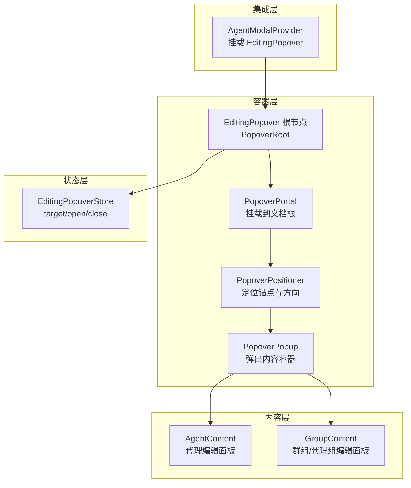
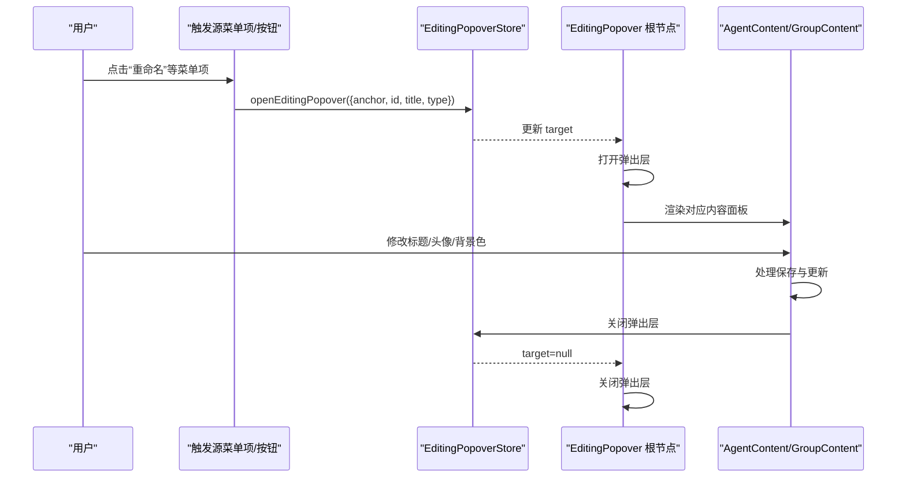
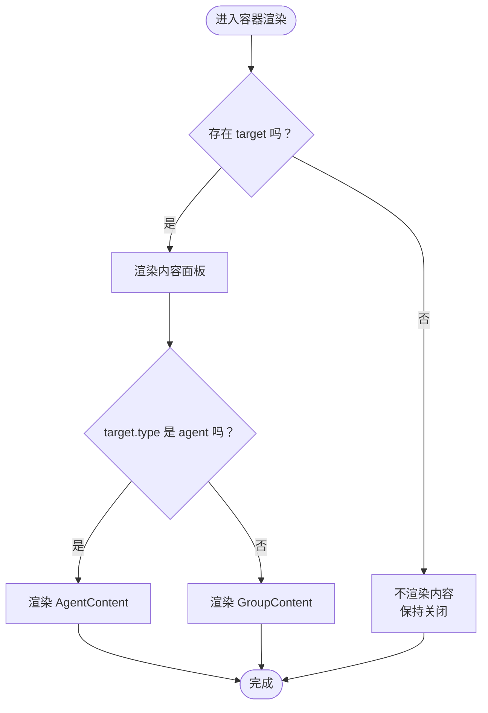
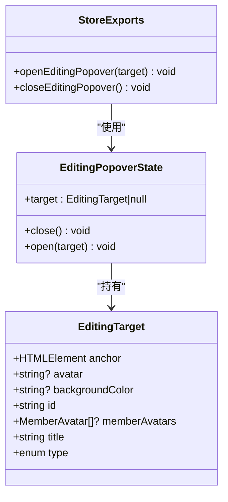
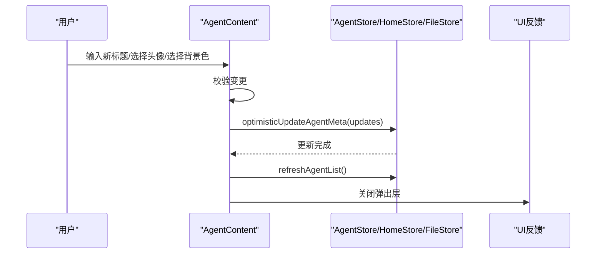
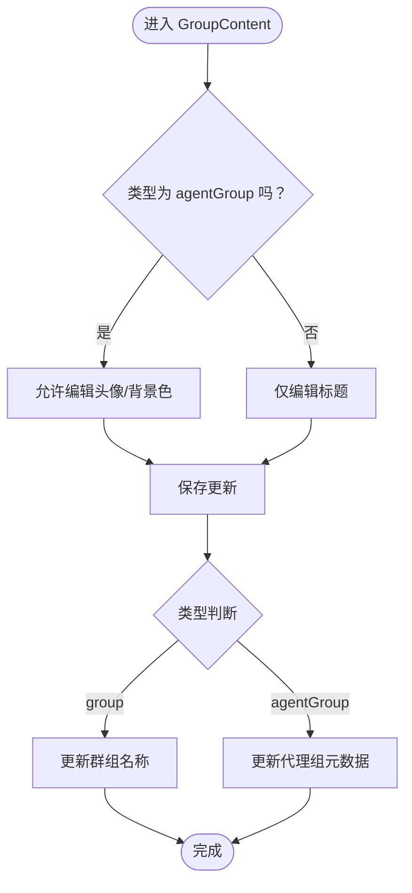
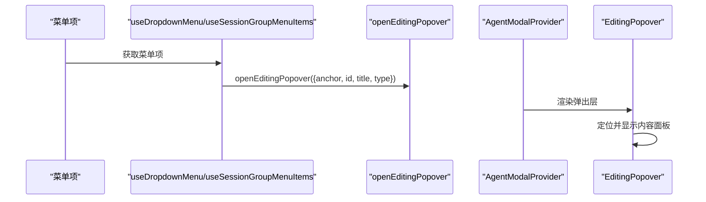
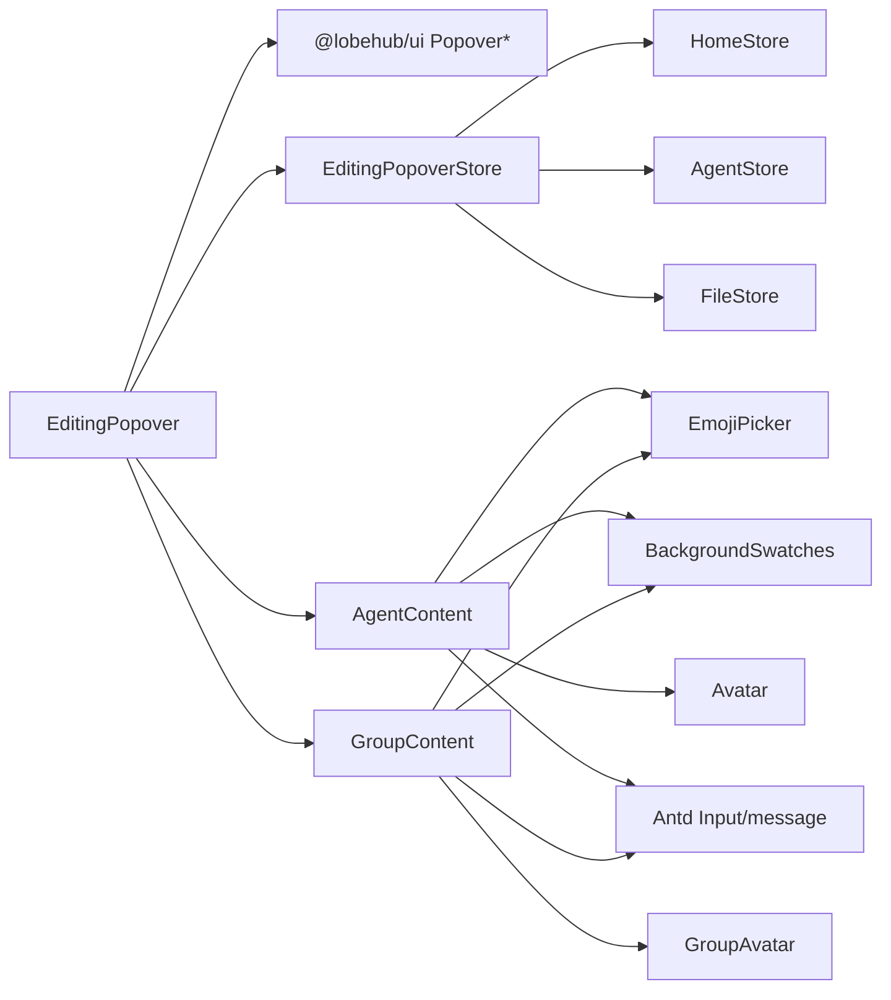

# 编辑弹出框组件

<cite>
**本文档引用的文件**
- [src/features/EditingPopover/index.tsx](file://src/features/EditingPopover/index.tsx)
- [src/features/EditingPopover/store.ts](file://src/features/EditingPopover/store.ts)
- [src/features/EditingPopover/AgentContent.tsx](file://src/features/EditingPopover/AgentContent.tsx)
- [src/features/EditingPopover/GroupContent.tsx](file://src/features/EditingPopover/GroupContent.tsx)
- [src/routes/(main)/home/_layout/Body/Agent/ModalProvider.tsx](file://src/routes/(main)/home/_layout/Body/Agent/ModalProvider.tsx)
- [src/routes/(main)/home/_layout/Body/Agent/List/AgentItem/useDropdownMenu.tsx](file://src/routes/(main)/home/_layout/Body/Agent/List/AgentItem/useDropdownMenu.tsx)
- [src/routes/(main)/home/_layout/hooks/useSessionGroupMenuItems.tsx](file://src/routes/(main)/home/_layout/hooks/useSessionGroupMenuItems.tsx)
- [src/routes/(main)/group/_layout/Sidebar/Topic/List/Item/Editing.tsx](file://src/routes/(main)/group/_layout/Sidebar/Topic/List/Item/Editing.tsx)
- [src/components/InlineRename/index.tsx](file://src/components/InlineRename/index.tsx)
</cite>

## 目录
1. [简介](#简介)
2. [项目结构](#项目结构)
3. [核心组件](#核心组件)
4. [架构总览](#架构总览)
5. [详细组件分析](#详细组件分析)
6. [依赖关系分析](#依赖关系分析)
7. [性能考虑](#性能考虑)
8. [故障排除指南](#故障排除指南)
9. [结论](#结论)
10. [附录：使用示例](#附录使用示例)

## 简介
本文件系统性地解析编辑弹出框组件（EditingPopover）的设计与实现，覆盖触发机制、定位算法、内容渲染、交互逻辑、生命周期管理、状态控制、事件处理与数据绑定等。同时阐述布局设计、动画效果、键盘导航与焦点管理，并提供完整使用示例，解释与父组件的通信机制、数据传递与回调处理，以及可访问性支持、响应式适配与跨浏览器兼容性建议。

## 项目结构
编辑弹出框组件由一个全局弹出层容器与两类内容面板组成：
- 容器层：负责弹出层根节点、门户挂载、定位器与内容渲染的统一调度
- 内容层：按类型区分的编辑面板，分别处理代理（Agent）与群组（Group/AgentGroup）的编辑需求
- 状态层：基于 Zustand 的全局状态存储，承载目标对象与打开/关闭动作
- 集成层：在页面顶层 Provider 中挂载，供菜单项或按钮触发

图表来源
- [src/features/EditingPopover/index.tsx](file://src/features/EditingPopover/index.tsx#L9-L45)
- [src/features/EditingPopover/store.ts](file://src/features/EditingPopover/store.ts#L19-L23)
- [src/features/EditingPopover/AgentContent.tsx](file://src/features/EditingPopover/AgentContent.tsx#L36-L181)
- [src/features/EditingPopover/GroupContent.tsx](file://src/features/EditingPopover/GroupContent.tsx#L37-L210)
- [src/routes/(main)/home/_layout/Body/Agent/ModalProvider.tsx](file://src/routes/(main)/home/_layout/Body/Agent/ModalProvider.tsx#L143-L144)

章节来源
- [src/features/EditingPopover/index.tsx](file://src/features/EditingPopover/index.tsx#L1-L49)
- [src/features/EditingPopover/store.ts](file://src/features/EditingPopover/store.ts#L1-L29)
- [src/routes/(main)/home/_layout/Body/Agent/ModalProvider.tsx](file://src/routes/(main)/home/_layout/Body/Agent/ModalProvider.tsx#L1-L148)

## 核心组件
- EditingPopover 容器：根据当前目标类型渲染对应内容面板，负责弹出层的打开/关闭与定位
- AgentContent：代理编辑面板，支持头像上传/删除、背景色选择、标题修改与保存
- GroupContent：群组/代理组编辑面板，支持头像上传/删除、背景色选择、标题修改与保存
- EditingPopoverStore：Zustand 全局状态，维护当前编辑目标与打开/关闭操作

章节来源
- [src/features/EditingPopover/index.tsx](file://src/features/EditingPopover/index.tsx#L9-L45)
- [src/features/EditingPopover/AgentContent.tsx](file://src/features/EditingPopover/AgentContent.tsx#L29-L181)
- [src/features/EditingPopover/GroupContent.tsx](file://src/features/EditingPopover/GroupContent.tsx#L27-L210)
- [src/features/EditingPopover/store.ts](file://src/features/EditingPopover/store.ts#L3-L28)

## 架构总览
编辑弹出框采用“容器 + 内容 + 状态 + 集成”的分层架构：
- 触发层：菜单项或按钮点击时调用 openEditingPopover，传入包含锚点元素与目标信息的对象
- 容器层：根据状态决定是否渲染，通过 Portal 将内容挂载到文档根部，使用 Positioner 基于锚点进行定位
- 内容层：根据目标类型渲染 AgentContent 或 GroupContent，内部封装输入、上传、颜色选择与保存逻辑
- 状态层：Zustand Store 提供 open/close 与 target 管理，便于跨组件共享与统一控制

图表来源
- [src/routes/(main)/home/_layout/Body/Agent/List/AgentItem/useDropdownMenu.tsx](file://src/routes/(main)/home/_layout/Body/Agent/List/AgentItem/useDropdownMenu.tsx#L72-L76)
- [src/features/EditingPopover/store.ts](file://src/features/EditingPopover/store.ts#L25-L28)
- [src/features/EditingPopover/index.tsx](file://src/features/EditingPopover/index.tsx#L14-L18)
- [src/features/EditingPopover/AgentContent.tsx](file://src/features/EditingPopover/AgentContent.tsx#L49-L70)
- [src/features/EditingPopover/GroupContent.tsx](file://src/features/EditingPopover/GroupContent.tsx#L51-L88)

## 详细组件分析

### 容器组件：EditingPopover
- 职责：根据当前目标是否存在决定是否打开；通过 Portal 挂载到文档根部；使用 Positioner 基于 anchor 进行定位；根据目标类型渲染 AgentContent 或 GroupContent
- 生命周期：openChange 回调用于在关闭时清理状态；onOpenChange 为 false 时调用 close
- 定位算法：使用 bottomLeft 方向，Anchor 来自 target.anchor，若无则回退到 document.body
- 数据绑定：从 Store 读取 target 与 close 方法，将必要属性透传给内容面板

图表来源
- [src/features/EditingPopover/index.tsx](file://src/features/EditingPopover/index.tsx#L9-L45)

章节来源
- [src/features/EditingPopover/index.tsx](file://src/features/EditingPopover/index.tsx#L9-L45)

### 状态存储：EditingPopoverStore
- 目标接口：包含锚点元素、头像、背景色、id、成员头像列表、标题与类型
- 状态接口：target、open(target)、close()
- 工具方法：openEditingPopover、closeEditingPopover

图表来源
- [src/features/EditingPopover/store.ts](file://src/features/EditingPopover/store.ts#L3-L28)

章节来源
- [src/features/EditingPopover/store.ts](file://src/features/EditingPopover/store.ts#L1-L29)

### 内容组件：AgentContent
- 功能：代理编辑面板，支持头像上传/删除、背景色选择、标题修改与保存
- 交互：输入框自动聚焦；回车或点击保存按钮触发更新；上传前校验大小；更新成功后刷新代理列表
- 数据流：从 AgentStore 读取元数据，乐观更新后刷新；更新期间设置更新中标识

图表来源
- [src/features/EditingPopover/AgentContent.tsx](file://src/features/EditingPopover/AgentContent.tsx#L49-L70)
- [src/features/EditingPopover/AgentContent.tsx](file://src/features/EditingPopover/AgentContent.tsx#L96-L105)

章节来源
- [src/features/EditingPopover/AgentContent.tsx](file://src/features/EditingPopover/AgentContent.tsx#L29-L181)

### 内容组件：GroupContent
- 功能：群组/代理组编辑面板，支持头像上传/删除、背景色选择、标题修改与保存
- 区别：当类型为 group 时仅更新标题；当类型为 agentGroup 时可更新头像与背景色
- 交互：输入框自动聚焦；回车或点击保存按钮触发更新；上传前校验大小；更新成功后刷新列表

图表来源
- [src/features/EditingPopover/GroupContent.tsx](file://src/features/EditingPopover/GroupContent.tsx#L44-L88)

章节来源
- [src/features/EditingPopover/GroupContent.tsx](file://src/features/EditingPopover/GroupContent.tsx#L27-L210)

### 触发与集成：菜单项与 Provider
- 菜单项：在点击“重命名”时调用 openEditingPopover，传入锚点元素与目标信息
- Provider：在页面顶层挂载 EditingPopover，确保全局可用

图表来源
- [src/routes/(main)/home/_layout/Body/Agent/List/AgentItem/useDropdownMenu.tsx](file://src/routes/(main)/home/_layout/Body/Agent/List/AgentItem/useDropdownMenu.tsx#L72-L76)
- [src/routes/(main)/home/_layout/hooks/useSessionGroupMenuItems.tsx](file://src/routes/(main)/home/_layout/hooks/useSessionGroupMenuItems.tsx#L48-L54)
- [src/routes/(main)/home/_layout/Body/Agent/ModalProvider.tsx](file://src/routes/(main)/home/_layout/Body/Agent/ModalProvider.tsx#L143-L144)

章节来源
- [src/routes/(main)/home/_layout/Body/Agent/List/AgentItem/useDropdownMenu.tsx](file://src/routes/(main)/home/_layout/Body/Agent/List/AgentItem/useDropdownMenu.tsx#L35-L159)
- [src/routes/(main)/home/_layout/hooks/useSessionGroupMenuItems.tsx](file://src/routes/(main)/home/_layout/hooks/useSessionGroupMenuItems.tsx#L26-L57)
- [src/routes/(main)/home/_layout/Body/Agent/ModalProvider.tsx](file://src/routes/(main)/home/_layout/Body/Agent/ModalProvider.tsx#L1-L148)

## 依赖关系分析
- 容器依赖：@lobehub/ui 的 Popover 组件体系（Root/Portal/Positioner/Popup）
- 内容依赖：EmojiPicker、BackgroundSwatches、Avatar、GroupAvatar、Ant Design 的 Input 与消息提示
- 状态依赖：Zustand Store 与 HomeStore、AgentStore、FileStore 的协作
- 集成依赖：AgentModalProvider 在应用顶层挂载，保证弹出层始终可见

图表来源
- [src/features/EditingPopover/index.tsx](file://src/features/EditingPopover/index.tsx#L3-L7)
- [src/features/EditingPopover/AgentContent.tsx](file://src/features/EditingPopover/AgentContent.tsx#L1-L25)
- [src/features/EditingPopover/GroupContent.tsx](file://src/features/EditingPopover/GroupContent.tsx#L1-L23)

章节来源
- [src/features/EditingPopover/index.tsx](file://src/features/EditingPopover/index.tsx#L1-L49)
- [src/features/EditingPopover/AgentContent.tsx](file://src/features/EditingPopover/AgentContent.tsx#L1-L182)
- [src/features/EditingPopover/GroupContent.tsx](file://src/features/EditingPopover/GroupContent.tsx#L1-L211)

## 性能考虑
- 渲染优化：容器层仅在 target 存在时渲染内容面板，避免不必要的 DOM 开销
- 状态粒度：使用 Zustand 精准管理 target，减少无关组件重渲染
- 上传与更新：在更新过程中设置更新中标识，避免重复提交与闪烁
- 自动聚焦：使用 requestAnimationFrame 两次调度确保输入框获得焦点，提升交互体验

## 故障排除指南
- 弹出层不出现
  - 检查是否正确调用 openEditingPopover 并传入有效的 anchor 元素
  - 确认 Provider 已在应用顶层挂载
- 锚点定位异常
  - 确保 anchor 元素已挂载且可见；如无 anchor，容器会回退到 document.body
- 保存失败或未生效
  - 检查更新流程中的错误处理与 finally 分支，确保最终关闭弹出层
  - 确认 HomeStore/AgentStore 的更新方法返回 Promise 并正确处理
- 上传失败
  - 检查文件大小限制与上传进度回调是否正常执行
  - 查看 Antd message 是否显示错误提示

章节来源
- [src/features/EditingPopover/index.tsx](file://src/features/EditingPopover/index.tsx#L21-L21)
- [src/features/EditingPopover/AgentContent.tsx](file://src/features/EditingPopover/AgentContent.tsx#L72-L90)
- [src/features/EditingPopover/GroupContent.tsx](file://src/features/EditingPopover/GroupContent.tsx#L90-L108)

## 结论
编辑弹出框组件通过清晰的分层设计与全局状态管理，实现了稳定、可扩展的编辑体验。其触发机制灵活、定位算法可靠、内容面板可定制、交互逻辑完善，并具备良好的可访问性与可维护性。结合 Provider 的顶层挂载与菜单项的统一触发，组件可在不同场景下一致地提供流畅的编辑能力。

## 附录：使用示例
以下示例展示如何在菜单项中触发编辑弹出框并实现保存逻辑：

- 在代理列表菜单中触发编辑弹出框
  - 参考路径：[src/routes/(main)/home/_layout/Body/Agent/List/AgentItem/useDropdownMenu.tsx](file://src/routes/(main)/home/_layout/Body/Agent/List/AgentItem/useDropdownMenu.tsx#L72-L76)
  - 关键点：点击“重命名”时调用 openEditingPopover，传入 anchor、id、title、type: 'agent'

- 在会话分组菜单中触发编辑弹出框
  - 参考路径：[src/routes/(main)/home/_layout/hooks/useSessionGroupMenuItems.tsx](file://src/routes/(main)/home/_layout/hooks/useSessionGroupMenuItems.tsx#L48-L54)
  - 关键点：点击“重命名”时调用 openEditingPopover，传入 anchor、id、title、type: 'group'

- 在主题列表条目中内联编辑
  - 参考路径：[src/routes/(main)/group/_layout/Sidebar/Topic/List/Item/Editing.tsx](file://src/routes/(main)/group/_layout/Sidebar/Topic/List/Item/Editing.tsx#L47-L81)
  - 关键点：使用 Popover 包裹 Input，支持回车与失焦保存

- 全局挂载与渲染
  - 参考路径：[src/routes/(main)/home/_layout/Body/Agent/ModalProvider.tsx](file://src/routes/(main)/home/_layout/Body/Agent/ModalProvider.tsx#L143-L144)
  - 关键点：在 Provider 中渲染 EditingPopover，确保全局可用

- 内联重命名组件（对比参考）
  - 参考路径：[src/components/InlineRename/index.tsx](file://src/components/InlineRename/index.tsx#L88-L123)
  - 关键点：支持 Esc 取消、回车保存、失焦保存与键盘事件处理

章节来源
- [src/routes/(main)/home/_layout/Body/Agent/List/AgentItem/useDropdownMenu.tsx](file://src/routes/(main)/home/_layout/Body/Agent/List/AgentItem/useDropdownMenu.tsx#L72-L76)
- [src/routes/(main)/home/_layout/hooks/useSessionGroupMenuItems.tsx](file://src/routes/(main)/home/_layout/hooks/useSessionGroupMenuItems.tsx#L48-L54)
- [src/routes/(main)/group/_layout/Sidebar/Topic/List/Item/Editing.tsx](file://src/routes/(main)/group/_layout/Sidebar/Topic/List/Item/Editing.tsx#L47-L81)
- [src/routes/(main)/home/_layout/Body/Agent/ModalProvider.tsx](file://src/routes/(main)/home/_layout/Body/Agent/ModalProvider.tsx#L143-L144)
- [src/components/InlineRename/index.tsx](file://src/components/InlineRename/index.tsx#L88-L123)