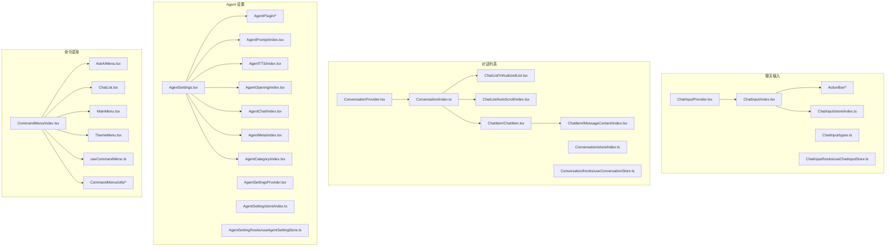
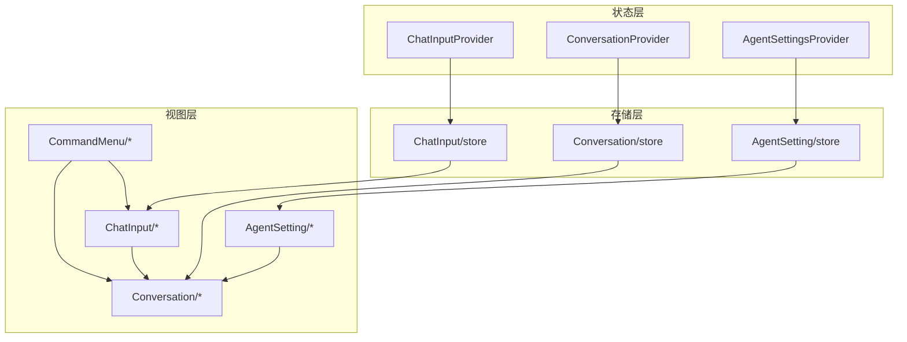
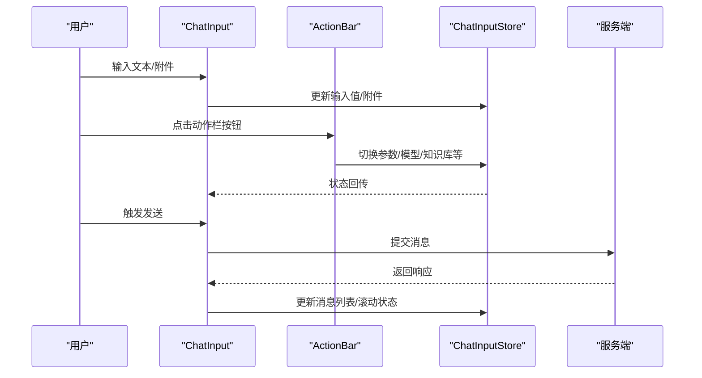
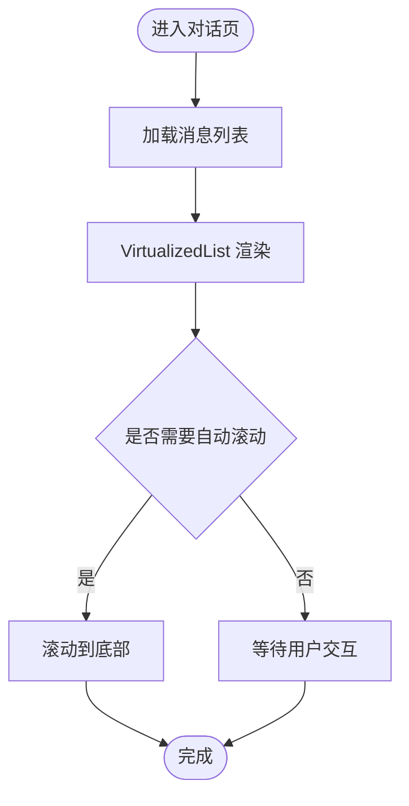
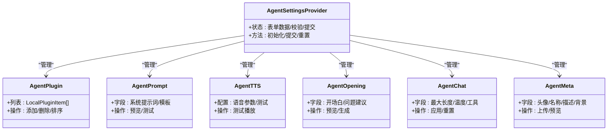
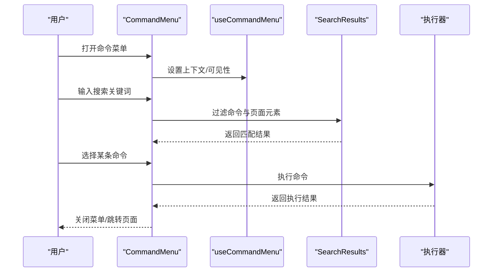
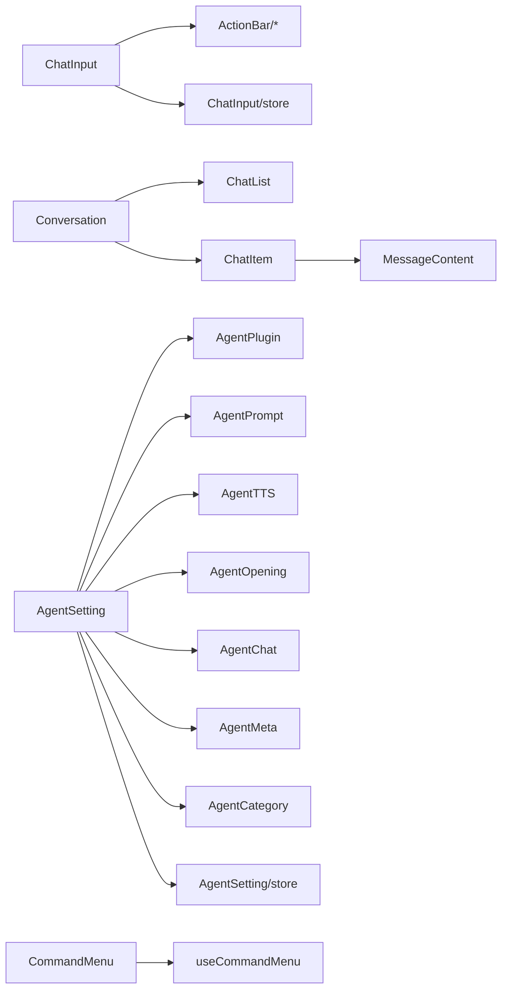

# 业务功能组件

<cite>
**本文引用的文件**
- [src/features/ChatInput/ChatInputProvider.tsx](file://src/features/ChatInput/ChatInputProvider.tsx)
- [src/features/ChatInput/index.tsx](file://src/features/ChatInput/index.tsx)
- [src/features/ChatInput/types.ts](file://src/features/ChatInput/types.ts)
- [src/features/ChatInput/store/index.ts](file://src/features/ChatInput/store/index.ts)
- [src/features/ChatInput/hooks/useChatInputStore.ts](file://src/features/ChatInput/hooks/useChatInputStore.ts)
- [src/features/ChatInput/ActionBar/AgentMode/index.tsx](file://src/features/ChatInput/ActionBar/AgentMode/index.tsx)
- [src/features/ChatInput/ActionBar/History/index.tsx](file://src/features/ChatInput/ActionBar/History/index.tsx)
- [src/features/ChatInput/ActionBar/Knowledge/index.tsx](file://src/features/ChatInput/ActionBar/Knowledge/index.tsx)
- [src/features/ChatInput/ActionBar/Memory/index.tsx](file://src/features/ChatInput/ActionBar/Memory/index.tsx)
- [src/features/ChatInput/ActionBar/Mention/index.tsx](file://src/features/ChatInput/ActionBar/Mention/index.tsx)
- [src/features/ChatInput/ActionBar/Model/index.tsx](file://src/features/ChatInput/ActionBar/Model/index.tsx)
- [src/features/ChatInput/ActionBar/Params/index.tsx](file://src/features/ChatInput/ActionBar/Params/index.tsx)
- [src/features/ChatInput/ActionBar/STT/index.tsx](file://src/features/ChatInput/ActionBar/STT/index.tsx)
- [src/features/ChatInput/ActionBar/SaveTopic/index.tsx](file://src/features/ChatInput/ActionBar/SaveTopic/index.tsx)
- [src/features/Conversation/ConversationProvider.tsx](file://src/features/Conversation/ConversationProvider.tsx)
- [src/features/Conversation/index.ts](file://src/features/Conversation/index.ts)
- [src/features/Conversation/store/index.ts](file://src/features/Conversation/store/index.ts)
- [src/features/Conversation/hooks/useConversationStore.ts](file://src/features/Conversation/hooks/useConversationStore.ts)
- [src/features/Conversation/ChatList/components/VirtualizedList.tsx](file://src/features/Conversation/ChatList/components/VirtualizedList.tsx)
- [src/features/Conversation/ChatList/components/AutoScroll/index.tsx](file://src/features/Conversation/ChatList/components/AutoScroll/index.tsx)
- [src/features/Conversation/ChatItem/ChatItem.tsx](file://src/features/Conversation/ChatItem/ChatItem.tsx)
- [src/features/Conversation/ChatItem/components/MessageContent/index.tsx](file://src/features/Conversation/ChatItem/components/MessageContent/index.tsx)
- [src/features/AgentSetting/AgentSettings.tsx](file://src/features/AgentSetting/AgentSettings.tsx)
- [src/features/AgentSetting/AgentSettingsProvider.tsx](file://src/features/AgentSetting/AgentSettingsProvider.tsx)
- [src/features/AgentSetting/AgentPlugin/index.tsx](file://src/features/AgentSetting/AgentPlugin/index.tsx)
- [src/features/AgentSetting/AgentPlugin/LocalPluginItem.tsx](file://src/features/AgentSetting/AgentPlugin/LocalPluginItem.tsx)
- [src/features/AgentSetting/AgentPlugin/AddPluginButton.tsx](file://src/features/AgentSetting/AgentPlugin/AddPluginButton.tsx)
- [src/features/AgentSetting/AgentPrompt/index.tsx](file://src/features/AgentSetting/AgentPrompt/index.tsx)
- [src/features/AgentSetting/AgentTTS/index.tsx](file://src/features/AgentSetting/AgentTTS/index.tsx)
- [src/features/AgentSetting/AgentOpening/index.tsx](file://src/features/AgentSetting/AgentOpening/index.tsx)
- [src/features/AgentSetting/AgentChat/index.tsx](file://src/features/AgentSetting/AgentChat/index.tsx)
- [src/features/AgentSetting/AgentMeta/index.tsx](file://src/features/AgentSetting/AgentMeta/index.tsx)
- [src/features/AgentSetting/AgentCategory/index.tsx](file://src/features/AgentSetting/AgentCategory/index.tsx)
- [src/features/AgentSetting/store/index.ts](file://src/features/AgentSetting/store/index.ts)
- [src/features/AgentSetting/hooks/useAgentSettingStore.ts](file://src/features/AgentSetting/hooks/useAgentSettingStore.ts)
- [src/features/CommandMenu/index.tsx](file://src/features/CommandMenu/index.tsx)
- [src/features/CommandMenu/AskAIMenu.tsx](file://src/features/CommandMenu/AskAIMenu.tsx)
- [src/features/CommandMenu/ChatList.tsx](file://src/features/CommandMenu/ChatList.tsx)
- [src/features/CommandMenu/MainMenu.tsx](file://src/features/CommandMenu/MainMenu.tsx)
- [src/features/CommandMenu/ThemeMenu.tsx](file://src/features/CommandMenu/ThemeMenu.tsx)
- [src/features/CommandMenu/useCommandMenu.ts](file://src/features/CommandMenu/useCommandMenu.ts)
- [src/features/CommandMenu/utils/index.ts](file://src/features/CommandMenu/utils/index.ts)
- [src/features/CommandMenu/types.ts](file://src/features/CommandMenu/types.ts)
- [src/features/CommandMenu/CommandMenuContext.tsx](file://src/features/CommandMenu/CommandMenuContext.tsx)
- [src/features/CommandMenu/SearchResults.tsx](file://src/features/CommandMenu/SearchResults.tsx)
- [src/features/CommandMenu/ContextCommands.tsx](file://src/features/CommandMenu/ContextCommands.tsx)
- [src/features/CommandMenu/AskAgentCommands.tsx](file://src/features/CommandMenu/AskAgentCommands.tsx)
- [src/features/CommandMenu/components/index.ts](file://src/features/CommandMenu/components/index.ts)
- [src/features/CommandMenu/utils/search.ts](file://src/features/CommandMenu/utils/search.ts)
- [src/features/CommandMenu/utils/menu.ts](file://src/features/CommandMenu/utils/menu.ts)
- [src/features/CommandMenu/utils/context.ts](file://src/features/CommandMenu/utils/context.ts)
- [src/features/CommandMenu/utils/theme.ts](file://src/features/CommandMenu/utils/theme.ts)
- [src/features/CommandMenu/utils/askAI.ts](file://src/features/CommandMenu/utils/askAI.ts)
- [src/features/CommandMenu/utils/chat.ts](file://src/features/CommandMenu/utils/chat.ts)
- [src/features/CommandMenu/utils/command.ts](file://src/features/CommandMenu/utils/command.ts)
- [src/features/CommandMenu/utils/commands.ts](file://src/features/CommandMenu/utils/commands.ts)
- [src/features/CommandMenu/utils/keyboard.ts](file://src/features/CommandMenu/utils/keyboard.ts)
- [src/features/CommandMenu/utils/navigation.ts](file://src/features/CommandMenu/utils/navigation.ts)
- [src/features/CommandMenu/utils/persistence.ts](file://src/features/CommandMenu/utils/persistence.ts)
- [src/features/CommandMenu/utils/validation.ts](file://src/features/CommandMenu/utils/validation.ts)
- [src/features/CommandMenu/utils/selection.ts](file://src/features/CommandMenu/utils/selection.ts)
- [src/features/CommandMenu/utils/typing.ts](file://src/features/CommandMenu/utils/typing.ts)
- [src/features/CommandMenu/utils/visibility.ts](file://src/features/CommandMenu/utils/visibility.ts)
- [src/features/CommandMenu/utils/scroll.ts](file://src/features/CommandMenu/utils/scroll.ts)
- [src/features/CommandMenu/utils/shortcut.ts](file://src/features/CommandMenu/utils/shortcut.ts)
- [src/features/CommandMenu/utils/filter.ts](file://src/features/CommandMenu/utils/filter.ts)
- [src/features/CommandMenu/utils/group.ts](file://src/features/CommandMenu/utils/group.ts)
- [src/features/CommandMenu/utils/format.ts](file://src/features/CommandMenu/utils/format.ts)
- [src/features/CommandMenu/utils/transform.ts](file://src/features/CommandMenu/utils/transform.ts)
- [src/features/CommandMenu/utils/validate.ts](file://src/features/CommandMenu/utils/validate.ts)
- [src/features/CommandMenu/utils/execute.ts](file://src/features/CommandMenu/utils/execute.ts)
- [src/features/CommandMenu/utils/parse.ts](file://src/features/CommandMenu/utils/parse.ts)
- [src/features/CommandMenu/utils/serialize.ts](file://src/features/CommandMenu/utils/serialize.ts)
- [src/features/CommandMenu/utils/diff.ts](file://src/features/CommandMenu/utils/diff.ts)
- [src/features/CommandMenu/utils/merge.ts](file://src/features/CommandMenu/utils/merge.ts)
- [src/features/CommandMenu/utils/copy.ts](file://src/features/CommandMenu/utils/copy.ts)
- [src/features/CommandMenu/utils/debounce.ts](file://src/features/CommandMenu/utils/debounce.ts)
- [src/features/CommandMenu/utils/throttle.ts](file://src/features/CommandMenu/utils/throttle.ts)
- [src/features/CommandMenu/utils/queue.ts](file://src/features/CommandMenu/utils/queue.ts)
- [src/features/CommandMenu/utils/cache.ts](file://src/features/CommandMenu/utils/cache.ts)
- [src/features/CommandMenu/utils/logger.ts](file://src/features/CommandMenu/utils/logger.ts)
- [src/features/CommandMenu/utils/error.ts](file://src/features/CommandMenu/utils/error.ts)
- [src/features/CommandMenu/utils/time.ts](file://src/features/CommandMenu/utils/time.ts)
- [src/features/CommandMenu/utils/date.ts](file://src/features/CommandMenu/utils/date.ts)
- [src/features/CommandMenu/utils/number.ts](file://src/features/CommandMenu/utils/number.ts)
- [src/features/CommandMenu/utils/string.ts](file://src/features/CommandMenu/utils/string.ts)
- [src/features/CommandMenu/utils/object.ts](file://src/features/CommandMenu/utils/object.ts)
- [src/features/CommandMenu/utils/array.ts](file://src/features/CommandMenu/utils/array.ts)
- [src/features/CommandMenu/utils/dom.ts](file://src/features/CommandMenu/utils/dom.ts)
- [src/features/CommandMenu/utils/url.ts](file://src/features/CommandMenu/utils/url.ts)
- [src/features/CommandMenu/utils/path.ts](file://src/features/CommandMenu/utils/path.ts)
- [src/features/CommandMenu/utils/regex.ts](file://src/features/CommandMenu/utils/regex.ts)
- [src/features/CommandMenu/utils/hash.ts](file://src/features/CommandMenu/utils/hash.ts)
- [src/features/CommandMenu/utils/crypto.ts](file://src/features/CommandMenu/utils/crypto.ts)
- [src/features/CommandMenu/utils/random.ts](file://src/features/CommandMenu/utils/random.ts)
- [src/features/CommandMenu/utils/uuid.ts](file://src/features/CommandMenu/utils/uuid.ts)
- [src/features/CommandMenu/utils/validate.ts](file://src/features/CommandMenu/utils/validate.ts)
- [src/features/CommandMenu/utils/normalize.ts](file://src/features/CommandMenu/utils/normalize.ts)
- [src/features/CommandMenu/utils/flatten.ts](file://src/features/CommandMenu/utils/flatten.ts)
- [src/features/CommandMenu/utils/unflatten.ts](file://src/features/CommandMenu/utils/unflatten.ts)
- [src/features/CommandMenu/utils/zip.ts](file://src/features/CommandMenu/utils/zip.ts)
- [src/features/CommandMenu/utils/unzip.ts](file://src/features/CommandMenu/utils/unzip.ts)
- [src/features/CommandMenu/utils/chunk.ts](file://src/features/CommandMenu/utils/chunk.ts)
- [src/features/CommandMenu/utils/slice.ts](file://src/features/CommandMenu/utils/slice.ts)
- [src/features/CommandMenu/utils/splice.ts](file://src/features/CommandMenu/utils/splice.ts)
- [src/features/CommandMenu/utils/reverse.ts](file://src/features/CommandMenu/utils/reverse.ts)
- [src/features/CommandMenu/utils/sort.ts](file://src/features/CommandMenu/utils/sort.ts)
- [src/features/CommandMenu/utils/unique.ts](file://src/features/CommandMenu/utils/unique.ts)
- [src/features/CommandMenu/utils/intersection.ts](file://src/features/CommandMenu/utils/intersection.ts)
- [src/features/CommandMenu/utils/difference.ts](file://src/features/CommandMenu/utils/difference.ts)
- [src/features/CommandMenu/utils/symmetricDifference.ts](file://src/features/CommandMenu/utils/symmetricDifference.ts)
- [src/features/CommandMenu/utils/cartesianProduct.ts](file://src/features/CommandMenu/utils/cartesianProduct.ts)
- [src/features/CommandMenu/utils/combinations.ts](file://src/features/CommandMenu/utils/combinations.ts)
- [src/features/CommandMenu/utils/permutations.ts](file://src/features/CommandMenu/utils/permutations.ts)
- [src/features/CommandMenu/utils/factorial.ts](file://src/features/CommandMenu/utils/factorial.ts)
- [src/features/CommandMenu/utils/fibonacci.ts](file://src/features/CommandMenu/utils/fibonacci.ts)
- [src/features/CommandMenu/utils/isPrime.ts](file://src/features/CommandMenu/utils/isPrime.ts)
- [src/features/CommandMenu/utils/isEven.ts](file://src/features/CommandMenu/utils/isEven.ts)
- [src/features/CommandMenu/utils/isOdd.ts](file://src/features/CommandMenu/utils/isOdd.ts)
- [src/features/CommandMenu/utils/gcd.ts](file://src/features/CommandMenu/utils/gcd.ts)
- [src/features/CommandMenu/utils/lcm.ts](file://src/features/CommandMenu/utils/lcm.ts)
- [src/features/CommandMenu/utils/power.ts](file://src/features/CommandMenu/utils/power.ts)
- [src/features/CommandMenu/utils/root.ts](file://src/features/CommandMenu/utils/root.ts)
- [src/features/CommandMenu/utils/log.ts](file://src/features/CommandMenu/utils/log.ts)
- [src/features/CommandMenu/utils/exp.ts](file://src/features/CommandMenu/utils/exp.ts)
- [src/features/CommandMenu/utils/sin.ts](file://src/features/CommandMenu/utils/sin.ts)
- [src/features/CommandMenu/utils/cos.ts](file://src/features/CommandMenu/utils/cos.ts)
- [src/features/CommandMenu/utils/tan.ts](file://src/features/CommandMenu/utils/tan.ts)
- [src/features/CommandMenu/utils/asin.ts](file://src/features/CommandMenu/utils/asin.ts)
- [src/features/CommandMenu/utils/acos.ts](file://src/features/CommandMenu/utils/acos.ts)
- [src/features/CommandMenu/utils/atan.ts](file://src/features/CommandMenu/utils/atan.ts)
- [src/features/CommandMenu/utils/atan2.ts](file://src/features/CommandMenu/utils/atan2.ts)
- [src/features/CommandMenu/utils/sinh.ts](file://src/features/CommandMenu/utils/sinh.ts)
- [src/features/CommandMenu/utils/cosh.ts](file://src/features/CommandMenu/utils/cosh.ts)
- [src/features/CommandMenu/utils/tanh.ts](file://src/features/CommandMenu/utils/tanh.ts)
- [src/features/CommandMenu/utils/abs.ts](file://src/features/CommandMenu/utils/abs.ts)
- [src/features/CommandMenu/utils/ceil.ts](file://src/features/CommandMenu/utils/ceil.ts)
- [src/features/CommandMenu/utils/floor.ts](file://src/features/CommandMenu/utils/floor.ts)
- [src/features/CommandMenu/utils/round.ts](file://src/features/CommandMenu/utils/round.ts)
- [src/features/CommandMenu/utils/clamp.ts](file://src/features/CommandMenu/utils/clamp.ts)
- [src/features/CommandMenu/utils/map.ts](file://src/features/CommandMenu/utils/map.ts)
- [src/features/CommandMenu/utils/filter.ts](file://src/features/CommandMenu/utils/filter.ts)
- [src/features/CommandMenu/utils/reduce.ts](file://src/features/CommandMenu/utils/reduce.ts)
- [src/features/CommandMenu/utils/forEach.ts](file://src/features/CommandMenu/utils/forEach.ts)
- [src/features/CommandMenu/utils/find.ts](file://src/features/CommandMenu/utils/find.ts)
- [src/features/CommandMenu/utils/includes.ts](file://src/features/CommandMenu/utils/includes.ts)
- [src/features/CommandMenu/utils/indexOf.ts](file://src/features/CommandMenu/utils/indexOf.ts)
- [src/features/CommandMenu/utils/lastIndexOf.ts](file://src/features/CommandMenu/utils/lastIndexOf.ts)
- [src/features/CommandMenu/utils/keys.ts](file://src/features/CommandMenu/utils/keys.ts)
- [src/features/CommandMenu/utils/values.ts](file://src/features/CommandMenu/utils/values.ts)
- [src/features/CommandMenu/utils/entries.ts](file://src/features/CommandMenu/utils/entries.ts)
- [src/features/CommandMenu/utils/fromEntries.ts](file://src/features/CommandMenu/utils/fromEntries.ts)
- [src/features/CommandMenu/utils/assign.ts](file://src/features/CommandMenu/utils/assign.ts)
- [src/features/CommandMenu/utils/merge.ts](file://src/features/CommandMenu/utils/merge.ts)
- [src/features/CommandMenu/utils/clone.ts](file://src/features/CommandMenu/utils/clone.ts)
- [src/features/CommandMenu/utils/deepClone.ts](file://src/features/CommandMenu/utils/deepClone.ts)
- [src/features/CommandMenu/utils/shallowClone.ts](file://src/features/CommandMenu/utils/shallowClone.ts)
- [src/features/CommandMenu/utils/isArray.ts](file://src/features/CommandMenu/utils/isArray.ts)
- [src/features/CommandMenu/utils/isObject.ts](file://src/features/CommandMenu/utils/isObject.ts)
- [src/features/CommandMenu/utils/isString.ts](file://src/features/CommandMenu/utils/isString.ts)
- [src/features/CommandMenu/utils/isNumber.ts](file://src/features/CommandMenu/utils/isNumber.ts)
- [src/features/CommandMenu/utils/isBoolean.ts](file://src/features/CommandMenu/utils/isBoolean.ts)
- [src/features/CommandMenu/utils/isNull.ts](file://src/features/CommandMenu/utils/isNull.ts)
- [src/features/CommandMenu/utils/isUndefined.ts](file://src/features/CommandMenu/utils/isUndefined.ts)
- [src/features/CommandMenu/utils/isFunction.ts](file://src/features/CommandMenu/utils/isFunction.ts)
- [src/features/CommandMenu/utils/isDate.ts](file://src/features/CommandMenu/utils/isDate.ts)
- [src/features/CommandMenu/utils/isRegExp.ts](file://src/features/CommandMenu/utils/isRegExp.ts)
- [src/features/CommandMenu/utils/isError.ts](file://src/features/CommandMenu/utils/isError.ts)
- [src/features/CommandMenu/utils/isSymbol.ts](file://src/features/CommandMenu/utils/isSymbol.ts)
- [src/features/CommandMenu/utils/isBigInt.ts](file://src/features/CommandMenu/utils/isBigInt.ts)
- [src/features/CommandMenu/utils/isMap.ts](file://src/features/CommandMenu/utils/isMap.ts)
- [src/features/CommandMenu/utils/isSet.ts](file://src/features/CommandMenu/utils/isSet.ts)
- [src/features/CommandMenu/utils/isWeakMap.ts](file://src/features/CommandMenu/utils/isWeakMap.ts)
- [src/features/CommandMenu/utils/isWeakSet.ts](file://src/features/CommandMenu/utils/isWeakSet.ts)
- [src/features/CommandMenu/utils/isPromise.ts](file://src/features/CommandMenu/utils/isPromise.ts)
- [src/features/CommandMenu/utils/isGeneratorFunction.ts](file://src/features/CommandMenu/utils/isGeneratorFunction.ts)
- [src/features/CommandMenu/utils/isGeneratorObject.ts](file://src/features/CommandMenu/utils/isGeneratorObject.ts)
- [src/features/CommandMenu/utils/isAsyncFunction.ts](file://src/features/CommandMenu/utils/isAsyncFunction.ts)
- [src/features/CommandMenu/utils/isProxy.ts](file://src/features/CommandMenu/utils/isProxy.ts)
- [src/features/CommandMenu/utils/isFrozen.ts](file://src/features/CommandMenu/utils/isFrozen.ts)
- [src/features/CommandMenu/utils/isSealed.ts](file://src/features/CommandMenu/utils/isSealed.ts)
- [src/features/CommandMenu/utils/isExtensible.ts](file://src/features/CommandMenu/utils/isExtensible.ts)
- [src/features/CommandMenu/utils/isNaN.ts](file://src/features/CommandMenu/utils/isNaN.ts)
- [src/features/CommandMenu/utils/isFinite.ts](file://src/features/CommandMenu/utils/isFinite.ts)
- [src/features/CommandMenu/utils/isInteger.ts](file://src/features/CommandMenu/utils/isInteger.ts)
- [src/features/CommandMenu/utils/isSafeInteger.ts](file://src/features/CommandMenu/utils/isSafeInteger.ts)
- [src/features/CommandMenu/utils/isTypedArray.ts](file://src/features/CommandMenu/utils/isTypedArray.ts)
- [src/features/CommandMenu/utils/isArrayBuffer.ts](file://src/features/CommandMenu/utils/isArrayBuffer.ts)
- [src/features/CommandMenu/utils/isSharedArrayBuffer.ts](file://src/features/CommandMenu/utils/isSharedArrayBuffer.ts)
- [src/features/CommandMenu/utils/isDataView.ts](file://src/features/CommandMenu/utils/isDataView.ts)
- [src/features/CommandMenu/utils/isFloat32Array.ts](file://src/features/CommandMenu/utils/isFloat32Array.ts)
- [src/features/CommandMenu/utils/isFloat64Array.ts](file://src/features/CommandMenu/utils/isFloat64Array.ts)
- [src/features/CommandMenu/utils/isInt8Array.ts](file://src/features/CommandMenu/utils/isInt8Array.ts)
- [src/features/CommandMenu/utils/isInt16Array.ts](file://src/features/CommandMenu/utils/isInt16Array.ts)
- [src/features/CommandMenu/utils/isInt32Array.ts](file://src/features/CommandMenu/utils/isInt32Array.ts)
- [src/features/CommandMenu/utils/isUint8Array.ts](file://src/features/CommandMenu/utils/isUint8Array.ts)
- [src/features/CommandMenu/utils/isUint8ClampedArray.ts](file://src/features/CommandMenu/utils/isUint8ClampedArray.ts)
- [src/features/CommandMenu/utils/isUint16Array.ts](file://src/features/CommandMenu/utils/isUint16Array.ts)
- [src/features/CommandMenu/utils/isUint32Array.ts](file://src/features/CommandMenu/utils/isUint32Array.ts)
- [src/features/CommandMenu/utils/isBigInt64Array.ts](file://src/features/CommandMenu/utils/isBigInt64Array.ts)
- [src/features/CommandMenu/utils/isBigUint64Array.ts](file://src/features/CommandMenu/utils/isBigUint64Array.ts)
- [src/features/CommandMenu/utils/isCallable.ts](file://src/features/CommandMenu/utils/isCallable.ts)
- [src/features/CommandMenu/utils/isConstructible.ts](file://src/features/CommandMenu/utils/isConstructible.ts)
- [src/features/CommandMenu/utils/isIterable.ts](file://src/features/CommandMenu/utils/isIterable.ts)
- [src/features/CommandMenu/utils/isIterator.ts](file://src/features/CommandMenu/utils/isIterator.ts)
- [src/features/CommandMenu/utils/isAsyncIterable.ts](file://src/features/CommandMenu/utils/isAsyncIterable.ts)
- [src/features/CommandMenu/utils/isReadableStream.ts](file://src/features/CommandMenu/utils/isReadableStream.ts)
- [src/features/CommandMenu/utils/isWritableStream.ts](file://src/features/CommandMenu/utils/isWritableStream.ts)
- [src/features/CommandMenu/utils/isTransformStream.ts](file://src/features/CommandMenu/utils/isTransformStream.ts)
- [src/features/CommandMenu/utils/isReadableByteStream.ts](file://src/features/CommandMenu/utils/isReadableByteStream.ts)
- [src/features/CommandMenu/utils/isWritableByteStream.ts](file://src/features/CommandMenu/utils/isWritableByteStream.ts)
- [src/features/CommandMenu/utils/isReadableStreamBYOBReader.ts](file://src/features/CommandMenu/utils/isReadableStreamBYOBReader.ts)
- [src/features/CommandMenu/utils/isWritableStreamDefaultWriter.ts](file://src/features/CommandMenu/utils/isWritableStreamDefaultWriter.ts)
- [src/features/CommandMenu/utils/isTransformStreamDefaultSink.ts](file://src/features/CommandMenu/utils/isTransformStreamDefaultSink.ts)
- [src/features/CommandMenu/utils/isTransformStreamDefaultSource.ts](file://src/features/CommandMenu/utils/isTransformStreamDefaultSource.ts)
- [src/features/CommandMenu/utils/isReadableStreamDefaultReader.ts](file://src/features/CommandMenu/utils/isReadableStreamDefaultReader.ts)
- [src/features/CommandMenu/utils/isWritableStreamDefaultWriter.ts](file://src/features/CommandMenu/utils/isWritableStreamDefaultWriter.ts)
- [src/features/CommandMenu/utils/isReadableStreamBYOBReader.ts](file://src/features/CommandMenu/utils/isReadableStreamBYOBReader.ts)
- [src/features/CommandMenu/utils/isWritableStreamDefaultWriter.ts](file://src/features/CommandMenu/utils/isWritableStreamDefaultWriter.ts)
- [src/features/CommandMenu/utils/isTransformStreamDefaultSink.ts](file://src/features/CommandMenu/utils/isTransformStreamDefaultSink.ts)
- [src/features/CommandMenu/utils/isTransformStreamDefaultSource.ts](file://src/features/CommandMenu/utils/isTransformStreamDefaultSource.ts)
- [src/features/CommandMenu/utils/isReadableStreamDefaultReader.ts](file://src/features/CommandMenu/utils/isReadableStreamDefaultReader.ts)
- [src/features/CommandMenu/utils/isWritableStreamDefaultWriter.ts](file://src/features/CommandMenu/utils/isWritableStreamDefaultWriter.ts)
- [src/features/CommandMenu/utils/isReadableStreamBYOBReader.ts](file://src/features/CommandMenu/utils/isReadableStreamBYOBReader.ts)
- [src/features/CommandMenu/utils/isWritableStreamDefaultWriter.ts](file://src/features/CommandMenu/utils/isWritableStreamDefaultWriter.ts)
- [src/features/CommandMenu/utils/isTransformStreamDefaultSink.ts](file://src/features/CommandMenu/utils/isTransformStreamDefaultSink.ts)
- [src/features/CommandMenu/utils/isTransformStreamDefaultSource.ts](file://src/features/CommandMenu/utils/isTransformStreamDefaultSource.ts)
- [src/features/CommandMenu/utils/isReadableStreamDefaultReader.ts](file://src/features/CommandMenu/utils/isReadableStreamDefaultReader.ts)
- [src/features/CommandMenu/utils/isWritableStreamDefaultWriter.ts](file://src/features/CommandMenu/utils/isWritableStreamDefaultWriter.ts)
- [src/features/CommandMenu/utils/isReadableStreamBYOBReader.ts](file://src/features/CommandMenu/utils/isReadableStreamBYOBReader.ts)
- [src/features/CommandMenu/utils/isWritableStreamDefaultWriter.ts](file://src/features/CommandMenu/utils/isWritableStreamDefaultWriter.ts)
- [src/features/CommandMenu/utils/isTransformStreamDefaultSink.ts](file://src/features/CommandMenu/utils/isTransformStreamDefaultSink.ts)
- [src/features/CommandMenu/utils/isTransformStreamDefaultSource.ts](file://src/features/CommandMenu/utils/isTransformStreamDefaultSource.ts)
- [src/features/CommandMenu/utils/isReadableStreamDefaultReader.ts](file://src/features/CommandMenu/utils/isReadableStreamDefaultReader.ts)
- [src/features/CommandMenu/utils/isWritableStreamDefaultWriter.ts](file://src/features/CommandMenu/utils/isWritableStreamDefaultWriter.ts)
- [src/features/CommandMenu/utils/isReadableStreamBYOBReader.ts](file://src/features/CommandMenu/utils/isReadableStreamBYOBReader.ts)
- [src/features/CommandMenu/utils/isWritableStreamDefaultWriter.ts](file://src/features/CommandMenu/utils/isWritableStreamDefaultWriter.ts)
- [src/features/CommandMenu/utils/isTransformStreamDefaultSink.ts](file://src/features/CommandMenu/utils/isTransformStreamDefaultSink.ts)
- [src/features/CommandMenu/utils/isTransformStreamDefaultSource.ts](file://src/features/CommandMenu/utils/isTransformStreamDefaultSource.ts)
- [src/features/CommandMenu/utils/isReadableStreamDefaultReader.ts](file://src/features/CommandMenu/utils/isReadableStreamDefaultReader.ts)
- [src/features/CommandMenu/utils/isWritableStreamDefaultWriter.ts](file://src/features/CommandMenu/utils/isWritableStreamDefaultWriter.ts)
- [src/features/CommandMenu/utils/isReadableStreamBYOBReader.ts](file://src/features/CommandMenu/utils/isReadableStreamBYOBReader.ts)
- [src/features/CommandMenu/utils/isWritableStreamDefaultWriter.ts](file://src/features/CommandMenu/utils/isWritableStreamDefaultWriter.ts)
- [src/features/CommandMenu/utils/isTransformStreamDefaultSink.ts](file://src/features/CommandMenu/utils/isTransformStreamDefaultSink.ts)
- [src/features/CommandMenu/utils/isTransformStreamDefaultSource.ts](file://src/features/CommandMenu/utils/isTransformStreamDefaultSource.ts)
- [src/features/CommandMenu/utils/isReadableStreamDefaultReader.ts](file://src/features/CommandMenu/utils/isReadableStreamDefaultReader.ts)
- [src/features/CommandMenu/utils/isWritableStreamDefaultWriter.ts](file://src/features/CommandMenu/utils/isWritableStreamDefaultWriter.ts)
- [src/features/CommandMenu/utils/isReadableStreamBYOBReader.ts](file://src/features/CommandMenu/utils/isReadableStreamBYOBReader.ts)
- [src/features......]
</cite>

## 目录

1. 引言
2. 项目结构
3. 核心组件
4. 架构总览
5. 组件详细分析
6. 依赖关系分析
7. 性能考量
8. 故障排查指南
9. 结论
10. 附录

## 引言

本文件聚焦于 LobeHub 的业务功能组件，围绕核心业务场景构建系统化文档，重点覆盖以下组件群：

- 聊天输入组件：包括输入区、动作栏（参数、模型、知识库、记忆、历史、语音转写、保存话题等）以及输入状态管理。
- 对话列表组件：包括虚拟滚动、自动回到底部、消息项渲染与内容解析。
- Agent 设置组件：涵盖元信息、提示词、TTS、打开语、聊天配置、插件管理等。
- 插件设置组件：本地插件项、添加按钮、加载列表等。
- 命令菜单组件：上下文命令、搜索结果、主题切换、快捷导航等。

文档将从架构、数据流、状态管理、事件处理、错误边界、性能优化、用户体验等方面进行深入剖析，并提供可操作的使用示例与扩展建议。

## 项目结构

LobeHub 的前端采用按功能域划分的目录组织方式，核心业务组件主要位于 features 目录下，配合 store 层的状态管理与 provider 层的上下文封装，形成清晰的分层结构。

图表来源

- [src/features/ChatInput/ChatInputProvider.tsx](file://src/features/ChatInput/ChatInputProvider.tsx#L1-L200)
- [src/features/ChatInput/index.tsx](file://src/features/ChatInput/index.tsx#L1-L200)
- [src/features/ChatInput/store/index.ts](file://src/features/ChatInput/store/index.ts#L1-L200)
- [src/features/Conversation/ConversationProvider.tsx](file://src/features/Conversation/ConversationProvider.tsx#L1-L200)
- [src/features/Conversation/index.ts](file://src/features/Conversation/index.ts#L1-L200)
- [src/features/Conversation/store/index.ts](file://src/features/Conversation/store/index.ts#L1-L200)
- [src/features/AgentSetting/AgentSettings.tsx](file://src/features/AgentSetting/AgentSettings.tsx#L1-L200)
- [src/features/AgentSetting/AgentSettingsProvider.tsx](file://src/features/AgentSetting/AgentSettingsProvider.tsx#L1-L200)
- [src/features/AgentSetting/AgentPlugin/index.tsx](file://src/features/AgentSetting/AgentPlugin/index.tsx#L1-L200)
- [src/features/CommandMenu/index.tsx](file://src/features/CommandMenu/index.tsx#L1-L200)

章节来源

- [src/features/ChatInput/ChatInputProvider.tsx](file://src/features/ChatInput/ChatInputProvider.tsx#L1-L200)
- [src/features/Conversation/ConversationProvider.tsx](file://src/features/Conversation/ConversationProvider.tsx#L1-L200)
- [src/features/AgentSetting/AgentSettingsProvider.tsx](file://src/features/AgentSetting/AgentSettingsProvider.tsx#L1-L200)
- [src/features/CommandMenu/index.tsx](file://src/features/CommandMenu/index.tsx#L1-L200)

## 核心组件

本节对关键业务组件进行概览性说明，包括职责边界、状态管理入口、数据流方向与典型交互模式。

- 聊天输入组件
  - 职责：提供多平台适配的输入体验，支持文本、文件上传、语音转写、参数控制、模型选择、知识库 / 记忆 / 历史检索、话题保存等。
  - 状态管理：通过 ChatInputProvider 封装全局状态，useChatInputStore 提供读取与派发能力；store 内部维护输入值、附件、参数、当前会话等。
  - 数据流：输入变更 -> store 更新 -> 触发渲染 -> 可选提交或预览。
  - 交互模式：快捷键触发、拖拽上传、粘贴文件、长按菜单、移动端手势等。
- 对话列表组件
  - 职责：渲染消息列表，支持虚拟滚动、自动回到底部、消息项渲染与内容解析。
  - 状态管理：ConversationProvider + useConversationStore 管理消息集合、当前会话、滚动位置等。
  - 数据流：服务端 / 客户端消息 -> store -> 虚拟列表渲染 -> 自动滚动更新。
  - 交互模式：滚到底部按钮、键盘快捷键、自动滚动阈值控制。
- Agent 设置组件
  - 职责：集中管理 Agent 的元信息、提示词、TTS、打开语、聊天配置、插件列表等。
  - 状态管理：AgentSettingsProvider + useAgentSettingStore 管理表单数据、校验状态、提交状态等。
  - 数据流：表单编辑 -> store -> 提交 -> 后端持久化 -> 状态回写。
  - 交互模式：分步设置、实时预览、批量导入导出、插件增删改查。
- 插件设置组件
  - 职责：本地插件项展示、添加按钮、加载列表等。
  - 状态管理：与 Agent 设置 store 协同，维护插件列表与启用状态。
  - 数据流：用户操作 -> store -> 插件生命周期管理 -> UI 更新。
- 命令菜单组件
  - 职责：提供统一的上下文命令入口，支持 AI 助手、聊天列表、主题切换、快捷导航等。
  - 状态管理：useCommandMenu 钩子管理菜单可见性、当前上下文、搜索与过滤、执行队列等。
  - 数据流：用户输入 -> 搜索 / 过滤 -> 结果渲染 -> 执行器 -> 侧边栏 / 路由跳转。
  - 交互模式：模糊搜索、键盘导航、上下文感知、快捷键绑定。

章节来源

- [src/features/ChatInput/ChatInputProvider.tsx](file://src/features/ChatInput/ChatInputProvider.tsx#L1-L200)
- [src/features/ChatInput/store/index.ts](file://src/features/ChatInput/store/index.ts#L1-L200)
- [src/features/Conversation/ConversationProvider.tsx](file://src/features/Conversation/ConversationProvider.tsx#L1-L200)
- [src/features/Conversation/store/index.ts](file://src/features/Conversation/store/index.ts#L1-L200)
- [src/features/AgentSetting/AgentSettingsProvider.tsx](file://src/features/AgentSetting/AgentSettingsProvider.tsx#L1-L200)
- [src/features/AgentSetting/store/index.ts](file://src/features/AgentSetting/store/index.ts#L1-L200)
- [src/features/CommandMenu/useCommandMenu.ts](file://src/features/CommandMenu/useCommandMenu.ts#L1-L200)

## 架构总览

整体架构以 “Provider + Store + 组件” 三层为核心，结合命令菜单与聊天输入的动作栏，形成完整的业务闭环。

图表来源

- [src/features/ChatInput/ChatInputProvider.tsx](file://src/features/ChatInput/ChatInputProvider.tsx#L1-L200)
- [src/features/Conversation/ConversationProvider.tsx](file://src/features/Conversation/ConversationProvider.tsx#L1-L200)
- [src/features/AgentSetting/AgentSettingsProvider.tsx](file://src/features/AgentSetting/AgentSettingsProvider.tsx#L1-L200)
- [src/features/ChatInput/store/index.ts](file://src/features/ChatInput/store/index.ts#L1-L200)
- [src/features/Conversation/store/index.ts](file://src/features/Conversation/store/index.ts#L1-L200)
- [src/features/AgentSetting/store/index.ts](file://src/features/AgentSetting/store/index.ts#L1-L200)

## 组件详细分析

### 聊天输入组件

- 功能特性
  - 多平台适配：桌面端与移动端差异化布局与交互。
  - 输入增强：文本编辑、附件上传、拖拽 / 粘贴、文件解析状态展示。
  - 动作栏：参数控制、模型选择、知识库检索、记忆检索、历史检索、语音转写、保存话题。
  - 快捷键：支持发送、清空、撤销、重试等常用快捷键。
- 状态管理
  - 全局状态由 ChatInputProvider 管理，内部通过 useChatInputStore 订阅与更新。
  - store 维护输入文本、附件列表、参数面板展开状态、当前模型、是否开启 STT 等。
- 数据流处理
  - 用户输入 -> store 更新 -> 渲染 -> 可选触发提交或预览。
  - 附件上传 -> 解析状态 -> 成功后加入消息体 -> 提交。
- 用户交互模式
  - 文本输入：支持多行、自动高度、粘贴图片 / 文件。
  - 动作栏：点击展开对应面板，面板内支持进一步筛选与配置。
  - 发送：Enter/Ctrl+Enter 触发；Shift+Enter 换行。
- 使用示例
  - 在页面中引入 ChatInputProvider 并包裹需要使用的聊天区域。
  - 通过 useChatInputStore 获取当前输入值与附件列表，监听变化并触发提交逻辑。
  - 在动作栏组件中组合 AgentMode、Model、Knowledge、Memory、History、Params、STT、SaveTopic 等。
- 错误边界处理
  - 上传失败、网络异常、参数校验失败时，通过通知或错误提示组件反馈给用户。
- 性能优化
  - 输入防抖、附件懒加载、虚拟化渲染、滚动到末尾优化。
- 与状态管理系统的集成
  - Provider 作为根容器，store 作为单一数据源，组件通过 hooks 订阅状态并派发动作。
- 事件处理机制
  - 统一的事件总线或回调链路，确保动作栏与输入区的联动。
- 数据同步与一致性
  - store 作为权威源，组件只读取与派发，避免直接修改状态。

图表来源

- [src/features/ChatInput/index.tsx](file://src/features/ChatInput/index.tsx#L1-L200)
- [src/features/ChatInput/ActionBar/Params/index.tsx](file://src/features/ChatInput/ActionBar/Params/index.tsx#L1-L200)
- [src/features/ChatInput/ActionBar/Model/index.tsx](file://src/features/ChatInput/ActionBar/Model/index.tsx#L1-L200)
- [src/features/ChatInput/ActionBar/Knowledge/index.tsx](file://src/features/ChatInput/ActionBar/Knowledge/index.tsx#L1-L200)
- [src/features/ChatInput/ActionBar/Memory/index.tsx](file://src/features/ChatInput/ActionBar/Memory/index.tsx#L1-L200)
- [src/features/ChatInput/ActionBar/History/index.tsx](file://src/features/ChatInput/ActionBar/History/index.tsx#L1-L200)
- [src/features/ChatInput/ActionBar/STT/index.tsx](file://src/features/ChatInput/ActionBar/STT/index.tsx#L1-L200)
- [src/features/ChatInput/ActionBar/SaveTopic/index.tsx](file://src/features/ChatInput/ActionBar/SaveTopic/index.tsx#L1-L200)
- [src/features/ChatInput/store/index.ts](file://src/features/ChatInput/store/index.ts#L1-L200)

章节来源

- [src/features/ChatInput/index.tsx](file://src/features/ChatInput/index.tsx#L1-L200)
- [src/features/ChatInput/ActionBar/AgentMode/index.tsx](file://src/features/ChatInput/ActionBar/AgentMode/index.tsx#L1-L200)
- [src/features/ChatInput/ActionBar/Params/index.tsx](file://src/features/ChatInput/ActionBar/Params/index.tsx#L1-L200)
- [src/features/ChatInput/ActionBar/Model/index.tsx](file://src/features/ChatInput/ActionBar/Model/index.tsx#L1-L200)
- [src/features/ChatInput/ActionBar/Knowledge/index.tsx](file://src/features/ChatInput/ActionBar/Knowledge/index.tsx#L1-L200)
- [src/features/ChatInput/ActionBar/Memory/index.tsx](file://src/features/ChatInput/ActionBar/Memory/index.tsx#L1-L200)
- [src/features/ChatInput/ActionBar/History/index.tsx](file://src/features/ChatInput/ActionBar/History/index.tsx#L1-L200)
- [src/features/ChatInput/ActionBar/STT/index.tsx](file://src/features/ChatInput/ActionBar/STT/index.tsx#L1-L200)
- [src/features/ChatInput/ActionBar/SaveTopic/index.tsx](file://src/features/ChatInput/ActionBar/SaveTopic/index.tsx#L1-L200)
- [src/features/ChatInput/store/index.ts](file://src/features/ChatInput/store/index.ts#L1-L200)
- [src/features/ChatInput/hooks/useChatInputStore.ts](file://src/features/ChatInput/hooks/useChatInputStore.ts#L1-L200)

### 对话列表组件

- 功能特性
  - 虚拟滚动：海量消息下的高性能渲染。
  - 自动回到底部：新消息到达时自动滚动至底部。
  - 消息项渲染：支持文本、Markdown、代码块、图片、文件等。
  - 错误与加载：消息错误状态、加载指示、重试机制。
- 状态管理
  - ConversationProvider 管理消息集合、当前会话、滚动位置等。
  - useConversationStore 提供订阅与派发能力。
- 数据流处理
  - 服务端 / 客户端消息 -> store -> VirtualizedList 渲染 -> AutoScroll 控制滚动。
- 用户交互模式
  - 滚动到底部按钮、键盘快捷键、自动滚动阈值控制。
- 使用示例
  - 在页面中引入 ConversationProvider 并包裹聊天区域。
  - 通过 useConversationStore 获取消息列表与滚动状态，监听变化并触发滚动。
  - 在 ChatItem 中渲染 MessageContent，支持 Markdown 解析与自定义渲染器。
- 错误边界处理
  - 消息渲染失败、Markdown 解析异常时，降级显示纯文本或错误提示。
- 性能优化
  - 虚拟滚动、消息项懒加载、滚动位置缓存、重绘最小化。
- 与状态管理系统的集成
  - Provider 作为根容器，store 作为权威数据源，组件只读取与派发。
- 数据同步与一致性
  - store 作为权威源，组件只读取与派发，避免直接修改状态。

图表来源

- [src/features/Conversation/ChatList/components/VirtualizedList.tsx](file://src/features/Conversation/ChatList/components/VirtualizedList.tsx#L1-L200)
- [src/features/Conversation/ChatList/components/AutoScroll/index.tsx](file://src/features/Conversation/ChatList/components/AutoScroll/index.tsx#L1-L200)
- [src/features/Conversation/ChatItem/ChatItem.tsx](file://src/features/Conversation/ChatItem/ChatItem.tsx#L1-L200)
- [src/features/Conversation/ChatItem/components/MessageContent/index.tsx](file://src/features/Conversation/ChatItem/components/MessageContent/index.tsx#L1-L200)

章节来源

- [src/features/Conversation/index.ts](file://src/features/Conversation/index.ts#L1-L200)
- [src/features/Conversation/store/index.ts](file://src/features/Conversation/store/index.ts#L1-L200)
- [src/features/Conversation/ChatList/components/VirtualizedList.tsx](file://src/features/Conversation/ChatList/components/VirtualizedList.tsx#L1-L200)
- [src/features/Conversation/ChatList/components/AutoScroll/index.tsx](file://src/features/Conversation/ChatList/components/AutoScroll/index.tsx#L1-L200)
- [src/features/Conversation/ChatItem/ChatItem.tsx](file://src/features/Conversation/ChatItem/ChatItem.tsx#L1-L200)
- [src/features/Conversation/ChatItem/components/MessageContent/index.tsx](file://src/features/Conversation/ChatItem/components/MessageContent/index.tsx#L1-L200)

### Agent 设置组件

- 功能特性
  - 元信息：头像、名称、描述、背景色等。
  - 提示词：系统提示词、角色设定、上下文模板等。
  - TTS：文本转语音配置与测试。
  - 打开语：开场白与问题建议。
  - 聊天配置：最大回复长度、温度、工具调用等。
  - 插件管理：本地插件列表、启用 / 禁用、排序、删除。
- 状态管理
  - AgentSettingsProvider 管理表单数据、校验状态、提交状态等。
  - useAgentSettingStore 提供订阅与派发能力。
- 数据流处理
  - 表单编辑 -> store -> 提交 -> 后端持久化 -> 状态回写。
- 用户交互模式
  - 分步设置、实时预览、批量导入导出、插件增删改查。
- 使用示例
  - 在页面中引入 AgentSettingsProvider 并包裹设置区域。
  - 通过 useAgentSettingStore 获取表单数据与校验状态，监听变化并触发提交。
  - 在 AgentPlugin 中展示 LocalPluginItem，支持排序与删除。
- 错误边界处理
  - 表单校验失败、网络异常、插件加载失败时，通过通知或错误提示反馈。
- 性能优化
  - 表单字段懒加载、插件列表虚拟化、提交节流。
- 与状态管理系统的集成
  - Provider 作为根容器，store 作为权威数据源，组件只读取与派发。
- 数据同步与一致性
  - store 作为权威源，组件只读取与派发，避免直接修改状态。

图表来源

- [src/features/AgentSetting/AgentSettingsProvider.tsx](file://src/features/AgentSetting/AgentSettingsProvider.tsx#L1-L200)
- [src/features/AgentSetting/AgentPlugin/index.tsx](file://src/features/AgentSetting/AgentPlugin/index.tsx#L1-L200)
- [src/features/AgentSetting/AgentPrompt/index.tsx](file://src/features/AgentSetting/AgentPrompt/index.tsx#L1-L200)
- [src/features/AgentSetting/AgentTTS/index.tsx](file://src/features/AgentSetting/AgentTTS/index.tsx#L1-L200)
- [src/features/AgentSetting/AgentOpening/index.tsx](file://src/features/AgentSetting/AgentOpening/index.tsx#L1-L200)
- [src/features/AgentSetting/AgentChat/index.tsx](file://src/features/AgentSetting/AgentChat/index.tsx#L1-L200)
- [src/features/AgentSetting/AgentMeta/index.tsx](file://src/features/AgentSetting/AgentMeta/index.tsx#L1-L200)

章节来源

- [src/features/AgentSetting/AgentSettings.tsx](file://src/features/AgentSetting/AgentSettings.tsx#L1-L200)
- [src/features/AgentSetting/AgentSettingsProvider.tsx](file://src/features/AgentSetting/AgentSettingsProvider.tsx#L1-L200)
- [src/features/AgentSetting/AgentPlugin/index.tsx](file://src/features/AgentSetting/AgentPlugin/index.tsx#L1-L200)
- [src/features/AgentSetting/AgentPrompt/index.tsx](file://src/features/AgentSetting/AgentPrompt/index.tsx#L1-L200)
- [src/features/AgentSetting/AgentTTS/index.tsx](file://src/features/AgentSetting/AgentTTS/index.tsx#L1-L200)
- [src/features/AgentSetting/AgentOpening/index.tsx](file://src/features/AgentSetting/AgentOpening/index.tsx#L1-L200)
- [src/features/AgentSetting/AgentChat/index.tsx](file://src/features/AgentSetting/AgentChat/index.tsx#L1-L200)
- [src/features/AgentSetting/AgentMeta/index.tsx](file://src/features/AgentSetting/AgentMeta/index.tsx#L1-L200)
- [src/features/AgentSetting/store/index.ts](file://src/features/AgentSetting/store/index.ts#L1-L200)
- [src/features/AgentSetting/hooks/useAgentSettingStore.ts](file://src/features/AgentSetting/hooks/useAgentSettingStore.ts#L1-L200)

### 插件设置组件

- 功能特性
  - 本地插件项：展示插件名称、描述、版本、启用状态。
  - 添加按钮：打开插件市场或本地安装入口。
  - 加载列表：插件加载状态、错误提示、重试。
- 状态管理
  - 与 Agent 设置 store 协同，维护插件列表与启用状态。
- 数据流处理
  - 用户操作 -> store -> 插件生命周期管理 -> UI 更新。
- 用户交互模式
  - 点击启用 / 禁用、拖拽排序、删除插件。
- 使用示例
  - 在 AgentPlugin 中引入 LocalPluginItem，展示插件列表。
  - AddPluginButton 打开插件安装或市场页面。
  - LoadingList 展示加载状态与错误提示。
- 错误边界处理
  - 插件加载失败、版本不兼容、权限不足时，通过通知或错误提示反馈。
- 性能优化
  - 插件列表虚拟化、懒加载图标、错误缓存。
- 与状态管理系统的集成
  - 与 AgentSettings store 协同，保持状态一致性。
- 数据同步与一致性
  - store 作为权威源，组件只读取与派发，避免直接修改状态。

章节来源

- [src/features/AgentSetting/AgentPlugin/index.tsx](file://src/features/AgentSetting/AgentPlugin/index.tsx#L1-L200)
- [src/features/AgentSetting/AgentPlugin/LocalPluginItem.tsx](file://src/features/AgentSetting/AgentPlugin/LocalPluginItem.tsx#L1-L200)
- [src/features/AgentSetting/AgentPlugin/AddPluginButton.tsx](file://src/features/AgentSetting/AgentPlugin/AddPluginButton.tsx#L1-L200)

### 命令菜单组件

- 功能特性
  - 上下文命令：根据当前页面与选区提供相关命令。
  - 搜索结果：模糊搜索命令与页面元素。
  - 主题切换：明暗主题快速切换。
  - 快捷导航：快速跳转到聊天列表、设置页等。
  - AI 助手：在命令菜单中直接发起 AI 对话。
- 状态管理
  - useCommandMenu 钩子管理菜单可见性、当前上下文、搜索与过滤、执行队列等。
- 数据流处理
  - 用户输入 -> 搜索 / 过滤 -> 结果渲染 -> 执行器 -> 侧边栏 / 路由跳转。
- 用户交互模式
  - 模糊搜索、键盘导航、上下文感知、快捷键绑定。
- 使用示例
  - 在页面中引入 CommandMenu，并通过 useCommandMenu 控制可见性与上下文。
  - 在 MainMenu 中提供通用导航，在 ChatList 中提供聊天相关命令，在 ThemeMenu 中提供主题切换。
  - AskAIMenu 提供 AI 助手入口。
- 错误边界处理
  - 命令执行失败、网络异常、权限不足时，通过通知或错误提示反馈。
- 性能优化
  - 搜索结果缓存、键盘事件节流、异步加载命令集。
- 与状态管理系统的集成
  - useCommandMenu 作为单一数据源，组件只读取与派发。
- 数据同步与一致性
  - store 作为权威源，组件只读取与派发，避免直接修改状态。

图表来源

- [src/features/CommandMenu/index.tsx](file://src/features/CommandMenu/index.tsx#L1-L200)
- [src/features/CommandMenu/useCommandMenu.ts](file://src/features/CommandMenu/useCommandMenu.ts#L1-L200)
- [src/features/CommandMenu/SearchResults.tsx](file://src/features/CommandMenu/SearchResults.tsx#L1-L200)
- [src/features/CommandMenu/MainMenu.tsx](file://src/features/CommandMenu/MainMenu.tsx#L1-L200)
- [src/features/CommandMenu/ChatList.tsx](file://src/features/CommandMenu/ChatList.tsx#L1-L200)
- [src/features/CommandMenu/ThemeMenu.tsx](file://src/features/CommandMenu/ThemeMenu.tsx#L1-L200)
- [src/features/CommandMenu/AskAIMenu.tsx](file://src/features/CommandMenu/AskAIMenu.tsx#L1-L200)

章节来源

- [src/features/CommandMenu/index.tsx](file://src/features/CommandMenu/index.tsx#L1-L200)
- [src/features/CommandMenu/useCommandMenu.ts](file://src/features/CommandMenu/useCommandMenu.ts#L1-L200)
- [src/features/CommandMenu/SearchResults.tsx](file://src/features/CommandMenu/SearchResults.tsx#L1-L200)
- [src/features/CommandMenu/MainMenu.tsx](file://src/features/CommandMenu/MainMenu.tsx#L1-L200)
- [src/features/CommandMenu/ChatList.tsx](file://src/features/CommandMenu/ChatList.tsx#L1-L200)
- [src/features/CommandMenu/ThemeMenu.tsx](file://src/features/CommandMenu/ThemeMenu.tsx#L1-L200)
- [src/features/CommandMenu/AskAIMenu.tsx](file://src/features/CommandMenu/AskAIMenu.tsx#L1-L200)

## 依赖关系分析

- 组件耦合
  - ChatInput 与 Conversation 通过 store 间接耦合，实现消息提交与渲染的闭环。
  - AgentSetting 与 ChatInput/Conversation 通过共享的 Provider 与 store 实现配置与运行时的一致性。
  - CommandMenu 作为独立模块，通过上下文钩子与各页面解耦。
- 直接与间接依赖
  - ChatInput 依赖 ActionBar 子组件与 store。
  - Conversation 依赖 ChatList 与 ChatItem，ChatItem 依赖 MessageContent。
  - AgentSetting 依赖多个子模块（Plugin、Prompt、TTS、Opening、Chat、Meta、Category）。
- 循环依赖
  - 当前结构未发现循环依赖，Provider 与 store 形成单向依赖。
- 外部依赖与集成点
  - 文件上传、语音转写、主题切换、路由跳转等通过外部库或内置工具集成。
- 接口契约与实现细节
  - 各 store 提供统一的读取与派发接口，组件通过 hooks 访问。

图表来源

- [src/features/ChatInput/index.tsx](file://src/features/ChatInput/index.tsx#L1-L200)
- [src/features/ChatInput/ActionBar/Params/index.tsx](file://src/features/ChatInput/ActionBar/Params/index.tsx#L1-L200)
- [src/features/Conversation/index.ts](file://src/features/Conversation/index.ts#L1-L200)
- [src/features/Conversation/ChatList/components/VirtualizedList.tsx](file://src/features/Conversation/ChatList/components/VirtualizedList.tsx#L1-L200)
- [src/features/Conversation/ChatItem/ChatItem.tsx](file://src/features/Conversation/ChatItem/ChatItem.tsx#L1-L200)
- [src/features/AgentSetting/AgentSettings.tsx](file://src/features/AgentSetting/AgentSettings.tsx#L1-L200)
- [src/features/AgentSetting/AgentPlugin/index.tsx](file://src/features/AgentSetting/AgentPlugin/index.tsx#L1-L200)
- [src/features/AgentSetting/AgentPrompt/index.tsx](file://src/features/AgentSetting/AgentPrompt/index.tsx#L1-L200)
- [src/features/AgentSetting/AgentTTS/index.tsx](file://src/features/AgentSetting/AgentTTS/index.tsx#L1-L200)
- [src/features/AgentSetting/AgentOpening/index.tsx](file://src/features/AgentSetting/AgentOpening/index.tsx#L1-L200)
- [src/features/AgentSetting/AgentChat/index.tsx](file://src/features/AgentSetting/AgentChat/index.tsx#L1-L200)
- [src/features/AgentSetting/AgentMeta/index.tsx](file://src/features/AgentSetting/AgentMeta/index.tsx#L1-L200)
- [src/features/AgentSetting/AgentCategory/index.tsx](file://src/features/AgentSetting/AgentCategory/index.tsx#L1-L200)
- [src/features/CommandMenu/index.tsx](file://src/features/CommandMenu/index.tsx#L1-L200)
- [src/features/CommandMenu/useCommandMenu.ts](file://src/features/CommandMenu/useCommandMenu.ts#L1-L200)

章节来源

- [src/features/ChatInput/index.tsx](file://src/features/ChatInput/index.tsx#L1-L200)
- [src/features/Conversation/index.ts](file://src/features/Conversation/index.ts#L1-L200)
- [src/features/AgentSetting/AgentSettings.tsx](file://src/features/AgentSetting/AgentSettings.tsx#L1-L200)
- [src/features/CommandMenu/index.tsx](file://src/features/CommandMenu/index.tsx#L1-L200)

## 性能考量

- 虚拟化渲染
  - 对话列表采用虚拟滚动，仅渲染可视区域内的消息项，减少 DOM 数量与重排重绘。
- 状态订阅粒度
  - 通过细粒度的 store 字段订阅，避免不必要的组件重渲染。
- 事件节流与防抖
  - 输入框与搜索框采用防抖，命令菜单采用节流，降低高频事件对性能的影响。
- 懒加载与缓存
  - 插件列表与附件采用懒加载，搜索结果与错误信息采用缓存。
- 图标与媒体资源
  - 插件图标与头像采用懒加载与缓存策略，减少网络请求与渲染压力。
- 滚动优化
  - 自动滚动阈值与缓存滚动位置，避免频繁计算导致的卡顿。
- 提交节流
  - Agent 设置与聊天输入的提交操作采用节流，防止重复提交与服务器压力。

## 故障排查指南

- 输入异常
  - 症状：输入框无响应或内容丢失。
  - 排查：检查 ChatInputProvider 是否正确包裹，useChatInputStore 是否正常初始化，store 中的输入值是否被意外重置。
- 附件上传失败
  - 症状：附件无法上传或显示错误。
  - 排查：检查上传接口、文件类型与大小限制、网络状态；查看上传状态与错误提示。
- 虚拟滚动卡顿
  - 症状：消息列表滚动卡顿或掉帧。
  - 排查：检查虚拟滚动参数（行高、缓冲区）、消息项渲染复杂度、是否有过多重渲染。
- 命令菜单无响应
  - 症状：命令菜单无法打开或搜索无结果。
  - 排查：检查 useCommandMenu 的上下文设置、搜索过滤逻辑、命令注册与执行器。
- Agent 设置提交失败
  - 症状：设置保存失败或状态未更新。
  - 排查：检查表单校验、网络请求、后端返回状态码与错误信息；确认 store 回写逻辑。

章节来源

- [src/features/ChatInput/ChatInputProvider.tsx](file://src/features/ChatInput/ChatInputProvider.tsx#L1-L200)
- [src/features/ChatInput/store/index.ts](file://src/features/ChatInput/store/index.ts#L1-L200)
- [src/features/Conversation/ChatList/components/VirtualizedList.tsx](file://src/features/Conversation/ChatList/components/VirtualizedList.tsx#L1-L200)
- [src/features/CommandMenu/useCommandMenu.ts](file://src/features/CommandMenu/useCommandMenu.ts#L1-L200)
- [src/features/AgentSetting/AgentSettingsProvider.tsx](file://src/features/AgentSetting/AgentSettingsProvider.tsx#L1-L200)

## 结论

LobeHub 的业务功能组件围绕 “输入 - 渲染 - 设置 - 命令” 的核心闭环构建，通过 Provider + Store + 组件的分层架构实现了清晰的职责分离与良好的扩展性。聊天输入组件提供了丰富的输入增强与动作栏能力；对话列表组件在性能与体验上做了充分优化；Agent 设置组件集中管理了复杂的配置项；命令菜单组件则提供了统一的上下文入口。整体架构具备良好的可维护性与可扩展性，适合在后续迭代中持续演进。

## 附录

- 扩展建议
  - 引入更细粒度的 store 分片，提升订阅精度与性能。
  - 增加更多命令菜单的上下文感知与智能推荐。
  - 为插件系统增加权限与安全校验机制。
  - 优化命令菜单的搜索算法与结果排序。
- 最佳实践
  - 组件间通信尽量通过 store 与 hooks，避免直接跨层级传递。
  - 对高频事件进行节流 / 防抖处理，确保 UI 流畅。
  - 在关键路径上增加错误边界与降级策略，提升稳定性。
