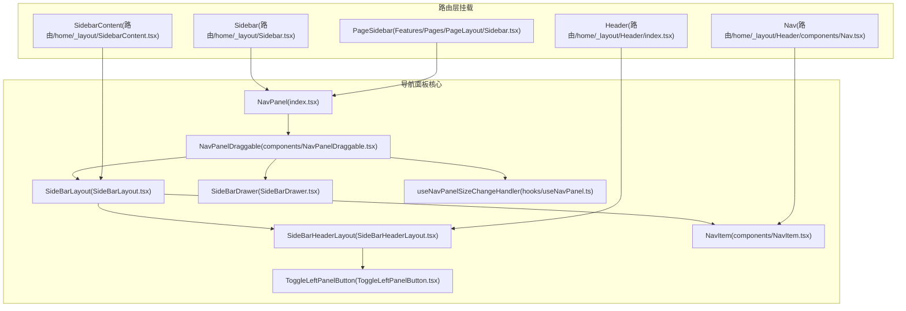
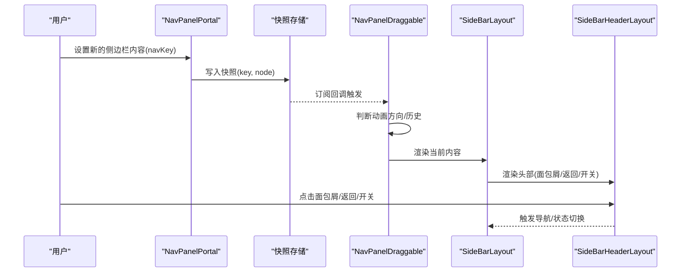
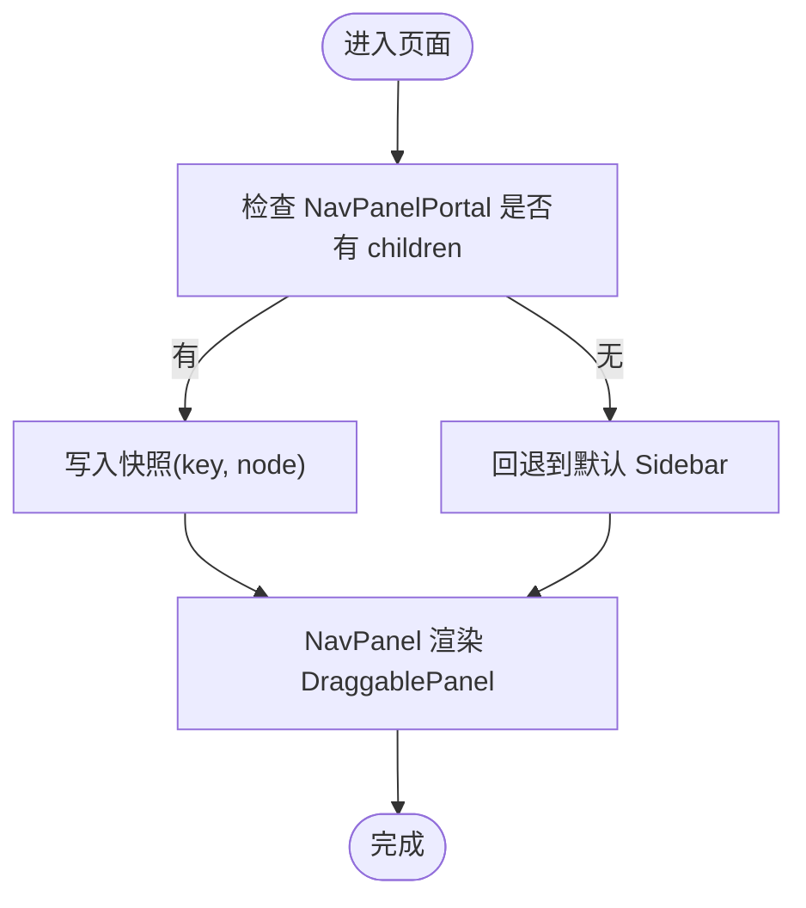
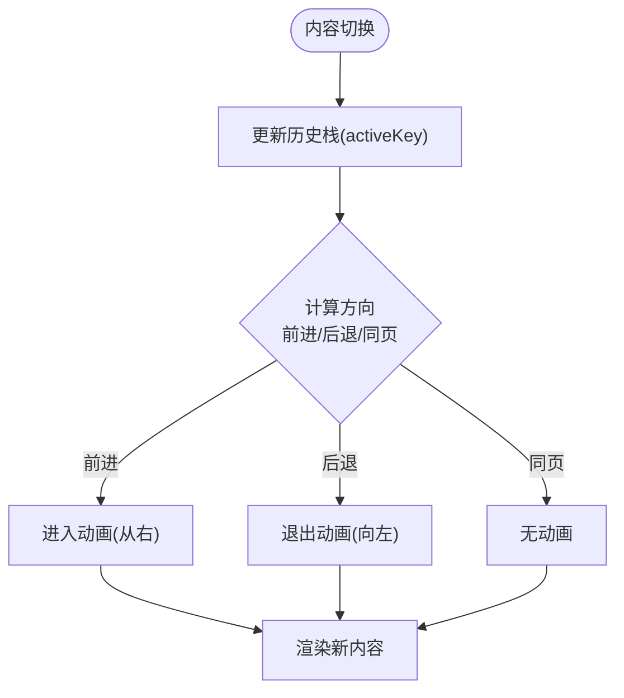
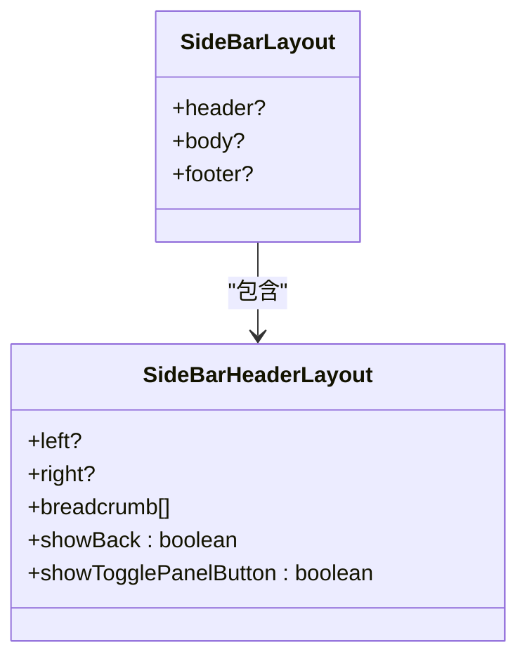
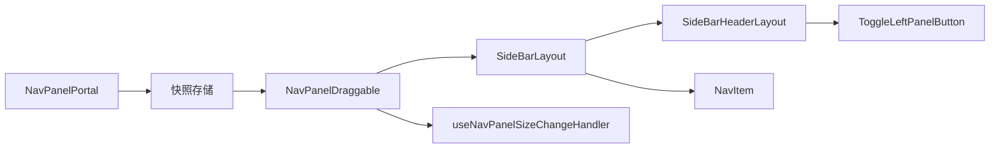

# 主导航面板

<cite>
**本文引用的文件**
- [src/features/NavPanel/index.tsx](file://src/features/NavPanel/index.tsx)
- [src/features/NavPanel/SideBarLayout.tsx](file://src/features/NavPanel/SideBarLayout.tsx)
- [src/features/NavPanel/SideBarHeaderLayout.tsx](file://src/features/NavPanel/SideBarHeaderLayout.tsx)
- [src/features/NavPanel/SideBarDrawer.tsx](file://src/features/NavPanel/SideBarDrawer.tsx)
- [src/features/NavPanel/components/NavItem.tsx](file://src/features/NavPanel/components/NavItem.tsx)
- [src/features/NavPanel/components/NavPanelDraggable.tsx](file://src/features/NavPanel/components/NavPanelDraggable.tsx)
- [src/features/NavPanel/hooks/useNavPanel.ts](file://src/features/NavPanel/hooks/useNavPanel.ts)
- [src/features/NavPanel/ToggleLeftPanelButton.tsx](file://src/features/NavPanel/ToggleLeftPanelButton.tsx)
- [src/routes/(main)/home/_layout/Header/index.tsx](file://src/routes/(main)/home/_layout/Header/index.tsx)
- [src/routes/(main)/home/_layout/Header/components/Nav.tsx](file://src/routes/(main)/home/_layout/Header/components/Nav.tsx)
- [src/routes/(main)/home/_layout/Sidebar.tsx](file://src/routes/(main)/home/_layout/Sidebar.tsx)
- [src/routes/(main)/home/_layout/SidebarContent.tsx](file://src/routes/(main)/home/_layout/SidebarContent.tsx)
- [src/features/Pages/PageLayout/Sidebar.tsx](file://src/features/Pages/PageLayout/Sidebar.tsx)
</cite>

## 目录

1. [简介](#简介)
2. [项目结构](#项目结构)
3. [核心组件](#核心组件)
4. [架构总览](#架构总览)
5. [组件详解](#组件详解)
6. [依赖关系分析](#依赖关系分析)
7. [性能考量](#性能考量)
8. [故障排查指南](#故障排查指南)
9. [结论](#结论)
10. [附录：使用示例与最佳实践](#附录使用示例与最佳实践)

## 简介

本文件为主导航面板组件的权威技术文档，覆盖侧边栏导航、菜单项管理、导航状态控制、响应式布局、展开收起逻辑、动画过渡、手势支持、键盘导航、与路由系统集成、当前页面高亮、面包屑导航、状态持久化与尺寸调整等完整能力。文档面向不同层次读者，既提供高层架构视图，也包含代码级细节与可视化图表。

## 项目结构

主导航面板由 “可插拔内容门户 + 可拖拽容器 + 布局与头部 + 菜单项组件” 构成，并通过路由层的侧边栏入口挂载到页面中。关键目录与文件如下：



**图表来源**

- [src/features/NavPanel/index.tsx](file://src/features/NavPanel/index.tsx#L31-L55)
- [src/features/NavPanel/components/NavPanelDraggable.tsx](file://src/features/NavPanel/components/NavPanelDraggable.tsx#L153-L250)
- [src/features/NavPanel/SideBarLayout.tsx](file://src/features/NavPanel/SideBarLayout.tsx#L14-L28)
- [src/features/NavPanel/SideBarHeaderLayout.tsx](file://src/features/NavPanel/SideBarHeaderLayout.tsx#L56-L145)
- [src/features/NavPanel/components/NavItem.tsx](file://src/features/NavPanel/components/NavItem.tsx#L63-L171)
- [src/features/NavPanel/ToggleLeftPanelButton.tsx](file://src/features/NavPanel/ToggleLeftPanelButton.tsx#L26-L51)
- [src/features/NavPanel/SideBarDrawer.tsx](file://src/features/NavPanel/SideBarDrawer.tsx#L25-L103)
- [src/features/NavPanel/hooks/useNavPanel.ts](file://src/features/NavPanel/hooks/useNavPanel.ts#L10-L26)
- [src/routes/(main)/home/\_layout/Header/index.tsx](<file://src/routes/(main)/home/_layout/Header/index.tsx#L11-L18>)
- [src/routes/(main)/home/\_layout/Header/components/Nav.tsx](<file://src/routes/(main)/home/_layout/Header/components/Nav.tsx#L93-L135>)
- [src/routes/(main)/home/\_layout/Sidebar.tsx](<file://src/routes/(main)/home/_layout/Sidebar.tsx#L7-L13>)
- [src/routes/(main)/home/\_layout/SidebarContent.tsx](<file://src/routes/(main)/home/_layout/SidebarContent.tsx#L8-L10>)
- [src/features/Pages/PageLayout/Sidebar.tsx](file://src/features/Pages/PageLayout/Sidebar.tsx#L11-L17)

**章节来源**

- [src/features/NavPanel/index.tsx](file://src/features/NavPanel/index.tsx#L1-L80)
- [src/features/NavPanel/SideBarLayout.tsx](file://src/features/NavPanel/SideBarLayout.tsx#L1-L29)
- [src/features/NavPanel/SideBarHeaderLayout.tsx](file://src/features/NavPanel/SideBarHeaderLayout.tsx#L1-L149)
- [src/features/NavPanel/SideBarDrawer.tsx](file://src/features/NavPanel/SideBarDrawer.tsx#L1-L107)
- [src/features/NavPanel/components/NavItem.tsx](file://src/features/NavPanel/components/NavItem.tsx#L1-L174)
- [src/features/NavPanel/components/NavPanelDraggable.tsx](file://src/features/NavPanel/components/NavPanelDraggable.tsx#L1-L251)
- [src/features/NavPanel/hooks/useNavPanel.ts](file://src/features/NavPanel/hooks/useNavPanel.ts#L1-L27)
- [src/features/NavPanel/ToggleLeftPanelButton.tsx](file://src/features/NavPanel/ToggleLeftPanelButton.tsx#L1-L54)
- [src/routes/(main)/home/\_layout/Header/index.tsx](<file://src/routes/(main)/home/_layout/Header/index.tsx#L1-L20>)
- [src/routes/(main)/home/\_layout/Header/components/Nav.tsx](<file://src/routes/(main)/home/_layout/Header/components/Nav.tsx#L87-L137>)
- [src/routes/(main)/home/\_layout/Sidebar.tsx](<file://src/routes/(main)/home/_layout/Sidebar.tsx#L1-L15>)
- [src/routes/(main)/home/\_layout/SidebarContent.tsx](<file://src/routes/(main)/home/_layout/SidebarContent.tsx#L1-L12>)
- [src/features/Pages/PageLayout/Sidebar.tsx](file://src/features/Pages/PageLayout/Sidebar.tsx#L1-L21)

## 核心组件

- 导航面板门户与快照：通过外部快照订阅机制在全局共享当前激活的侧边栏内容，支持无闪烁切换与回退。
- 可拖拽容器：封装左侧可伸缩面板，支持宽度拖动、展开 / 收起、动画过渡与历史方向判断。
- 侧边栏布局：统一的 header/body/footer 结构，内置滚动阴影与骨架屏占位。
- 头部布局与面包屑：支持返回按钮、标题、面包屑导航、热键提示与修饰键点击行为。
- 菜单项组件：支持图标、文本、额外元素、动作区、上下文菜单、加载态与禁用态。
- 尺寸变更钩子：监听拖拽尺寸变化并写入全局偏好设置。
- 切换按钮：与热键绑定，支持悬停显隐与状态高亮。

**章节来源**

- [src/features/NavPanel/index.tsx](file://src/features/NavPanel/index.tsx#L31-L80)
- [src/features/NavPanel/components/NavPanelDraggable.tsx](file://src/features/NavPanel/components/NavPanelDraggable.tsx#L153-L250)
- [src/features/NavPanel/SideBarLayout.tsx](file://src/features/NavPanel/SideBarLayout.tsx#L14-L28)
- [src/features/NavPanel/SideBarHeaderLayout.tsx](file://src/features/NavPanel/SideBarHeaderLayout.tsx#L56-L145)
- [src/features/NavPanel/components/NavItem.tsx](file://src/features/NavPanel/components/NavItem.tsx#L63-L171)
- [src/features/NavPanel/hooks/useNavPanel.ts](file://src/features/NavPanel/hooks/useNavPanel.ts#L10-L26)
- [src/features/NavPanel/ToggleLeftPanelButton.tsx](file://src/features/NavPanel/ToggleLeftPanelButton.tsx#L26-L51)

## 架构总览

主导航面板采用 “门户 + 容器 + 布局” 的分层设计：

- 门户负责内容切换与快照存储，确保切换时旧内容保留直至新内容挂载完成。
- 容器负责面板的展开 / 收起、拖拽宽度、动画过渡与交互状态。
- 布局与头部负责结构化组织与用户交互（面包屑、返回、开关面板）。
- 菜单项组件提供一致的 UI 行为与可扩展的动作区。



**图表来源**

- [src/features/NavPanel/index.tsx](file://src/features/NavPanel/index.tsx#L67-L80)
- [src/features/NavPanel/components/NavPanelDraggable.tsx](file://src/features/NavPanel/components/NavPanelDraggable.tsx#L153-L250)
- [src/features/NavPanel/SideBarLayout.tsx](file://src/features/NavPanel/SideBarLayout.tsx#L14-L28)
- [src/features/NavPanel/SideBarHeaderLayout.tsx](file://src/features/NavPanel/SideBarHeaderLayout.tsx#L56-L145)

## 组件详解

### 门户与内容切换

- NavPanelPortal 接受 children 与 navKey，写入全局快照，触发 NavPanel 的渲染更新。
- NavPanel 使用 useSyncExternalStore 订阅快照，若无内容则回退到默认 home 侧边栏。
- 通过 id 定位的容器用于承载抽屉式侧边栏（右侧抽屉）。



**图表来源**

- [src/features/NavPanel/index.tsx](file://src/features/NavPanel/index.tsx#L31-L55)
- [src/features/NavPanel/index.tsx](file://src/features/NavPanel/index.tsx#L67-L80)

**章节来源**

- [src/features/NavPanel/index.tsx](file://src/features/NavPanel/index.tsx#L31-L80)

### 可拖拽容器与动画

- NavPanelDraggable 负责：
  - 展开 / 收起状态与最小 / 最大宽度约束。
  - 拖拽尺寸变化回调，写入全局偏好。
  - 动画方向根据历史记录推断，支持进入 / 返回 / 前进三种方向。
  - 在 macOS 桌面端透明背景与 hover 显隐按钮。
- 动画使用 motion/AnimatePresence，提供平滑的进出过渡。



**图表来源**

- [src/features/NavPanel/components/NavPanelDraggable.tsx](file://src/features/NavPanel/components/NavPanelDraggable.tsx#L182-L207)
- [src/features/NavPanel/components/NavPanelDraggable.tsx](file://src/features/NavPanel/components/NavPanelDraggable.tsx#L34-L48)
- [src/features/NavPanel/components/NavPanelDraggable.tsx](file://src/features/NavPanel/components/NavPanelDraggable.tsx#L227-L246)

**章节来源**

- [src/features/NavPanel/components/NavPanelDraggable.tsx](file://src/features/NavPanel/components/NavPanelDraggable.tsx#L153-L250)
- [src/features/NavPanel/hooks/useNavPanel.ts](file://src/features/NavPanel/hooks/useNavPanel.ts#L10-L26)

### 侧边栏布局与头部

- SideBarLayout 提供 header/body/footer 的结构化布局，body 区域具备滚动阴影与骨架屏占位。
- SideBarHeaderLayout 支持：
  - 面包屑导航（含首页与自定义项），点击支持修饰键打开新标签。
  - 返回按钮与开关面板按钮，热键提示与悬停显隐。
  - 左侧标题或自定义内容，右侧操作区。



**图表来源**

- [src/features/NavPanel/SideBarLayout.tsx](file://src/features/NavPanel/SideBarLayout.tsx#L8-L28)
- [src/features/NavPanel/SideBarHeaderLayout.tsx](file://src/features/NavPanel/SideBarHeaderLayout.tsx#L47-L145)

**章节来源**

- [src/features/NavPanel/SideBarLayout.tsx](file://src/features/NavPanel/SideBarLayout.tsx#L14-L28)
- [src/features/NavPanel/SideBarHeaderLayout.tsx](file://src/features/NavPanel/SideBarHeaderLayout.tsx#L56-L145)

### 菜单项组件与导航事件

- NavItem 支持：
  - 图标、标题、额外元素、动作区、上下文菜单。
  - 加载态与禁用态；点击阻止默认链接行为（除修饰键外）。
  - 文本省略与工具提示。
- 路由层的 Nav 组件将菜单项包装为 Link，处理修饰键点击、事件冒泡与导航跳转。

```mermaid
sequenceDiagram
participant User as "用户"
participant NavItem as "NavItem"
participant Link as "Link(路由)"
participant Router as "navigate()"
User->>NavItem : 点击菜单项
NavItem->>NavItem : 阻止默认行为(非修饰键)
NavItem->>Link : 触发 onClick 回调
Link->>Router : 跳转到 item.url
Router-->>User : 页面更新
```

**图表来源**

- [src/features/NavPanel/components/NavItem.tsx](file://src/features/NavPanel/components/NavItem.tsx#L104-L112)
- [src/routes/(main)/home/\_layout/Header/components/Nav.tsx](<file://src/routes/(main)/home/_layout/Header/components/Nav.tsx#L114-L121>)

**章节来源**

- [src/features/NavPanel/components/NavItem.tsx](file://src/features/NavPanel/components/NavItem.tsx#L63-L171)
- [src/routes/(main)/home/\_layout/Header/components/Nav.tsx](<file://src/routes/(main)/home/_layout/Header/components/Nav.tsx#L93-L137>)

### 抽屉式侧边栏与骨架屏

- SideBarDrawer 将侧边栏内容挂载到指定容器，支持标题、副标题、关闭按钮与骨架屏占位。
- 适合移动端或特定场景下的抽屉化展示。

**章节来源**

- [src/features/NavPanel/SideBarDrawer.tsx](file://src/features/NavPanel/SideBarDrawer.tsx#L25-L103)

### 切换按钮与热键

- ToggleLeftPanelButton 提供展开 / 收起按钮，支持热键提示与悬停显隐。
- 与全局状态联动，改变面板可见性。

**章节来源**

- [src/features/NavPanel/ToggleLeftPanelButton.tsx](file://src/features/NavPanel/ToggleLeftPanelButton.tsx#L26-L51)

## 依赖关系分析

- 组件耦合度低，通过门户与快照解耦内容与容器。
- NavPanelDraggable 依赖全局状态与用户设置，避免直接耦合业务数据。
- 路由层仅负责挂载与传参，不参与具体菜单逻辑，便于复用。



**图表来源**

- [src/features/NavPanel/index.tsx](file://src/features/NavPanel/index.tsx#L67-L80)
- [src/features/NavPanel/components/NavPanelDraggable.tsx](file://src/features/NavPanel/components/NavPanelDraggable.tsx#L153-L250)
- [src/features/NavPanel/SideBarLayout.tsx](file://src/features/NavPanel/SideBarLayout.tsx#L14-L28)
- [src/features/NavPanel/SideBarHeaderLayout.tsx](file://src/features/NavPanel/SideBarHeaderLayout.tsx#L56-L145)
- [src/features/NavPanel/ToggleLeftPanelButton.tsx](file://src/features/NavPanel/ToggleLeftPanelButton.tsx#L26-L51)
- [src/features/NavPanel/hooks/useNavPanel.ts](file://src/features/NavPanel/hooks/useNavPanel.ts#L10-L26)

**章节来源**

- [src/features/NavPanel/index.tsx](file://src/features/NavPanel/index.tsx#L31-L80)
- [src/features/NavPanel/components/NavPanelDraggable.tsx](file://src/features/NavPanel/components/NavPanelDraggable.tsx#L153-L250)

## 性能考量

- 动画与过渡：使用 motion/AnimatePresence 控制入场 / 出场，方向基于历史推断，避免不必要的重排。
- 骨架屏：在 Suspense 下对 header/body/footer 提供骨架屏占位，提升感知性能。
- 拖拽尺寸：仅在宽度变化超过阈值时写入偏好，减少频繁存储写入。
- 修饰键点击：阻止默认行为以避免多余导航，提升交互流畅度。

\[本节为通用性能建议，无需特定文件引用]

## 故障排查指南

- 内容未显示：确认 NavPanelPortal 是否传入了 children 且 navKey 正确。
- 面包屑点击无效：检查是否正确阻止默认行为与事件冒泡。
- 面板无法拖拽：确认 DraggablePanel 的 expandable / 最小 / 最大宽度设置。
- 动画异常：检查动画模式设置与历史栈方向推断逻辑。
- 热键不生效：确认热键配置与 ToggleLeftPanelButton 的 tooltipProps。

**章节来源**

- [src/features/NavPanel/index.tsx](file://src/features/NavPanel/index.tsx#L67-L80)
- [src/features/NavPanel/SideBarHeaderLayout.tsx](file://src/features/NavPanel/SideBarHeaderLayout.tsx#L106-L116)
- [src/features/NavPanel/components/NavPanelDraggable.tsx](file://src/features/NavPanel/components/NavPanelDraggable.tsx#L212-L224)
- [src/features/NavPanel/ToggleLeftPanelButton.tsx](file://src/features/NavPanel/ToggleLeftPanelButton.tsx#L43-L47)

## 结论

主导航面板通过 “门户 + 容器 + 布局 + 组件” 的分层设计，实现了高内聚、低耦合的可插拔侧边栏系统。其具备完善的动画过渡、响应式布局、热键支持与路由集成能力，能够满足复杂业务场景下的导航需求。配合骨架屏与尺寸持久化，兼顾了性能与体验。

\[本节为总结性内容，无需特定文件引用]

## 附录：使用示例与最佳实践

### 如何配置导航菜单

- 在路由层创建侧边栏内容组件，使用 SideBarLayout 组织 header/body/footer。
- 在 Nav 组件中渲染多个 NavItem，设置 icon、title、url、onClick 等属性。
- 对于需要新标签页打开的项，提供 href 并允许修饰键点击。

**章节来源**

- [src/routes/(main)/home/\_layout/SidebarContent.tsx](<file://src/routes/(main)/home/_layout/SidebarContent.tsx#L8-L10>)
- [src/routes/(main)/home/\_layout/Header/components/Nav.tsx](<file://src/routes/(main)/home/_layout/Header/components/Nav.tsx#L93-L137>)
- [src/features/NavPanel/components/NavItem.tsx](file://src/features/NavPanel/components/NavItem.tsx#L86-L92)

### 如何处理导航事件

- 在 NavItem 上统一处理点击事件，阻止默认行为（除修饰键外）。
- 通过 Link 组件包裹，结合 navigate 实现路由跳转。
- 对面包屑与返回按钮，使用 flushSync 保证同步导航。

**章节来源**

- [src/features/NavPanel/components/NavItem.tsx](file://src/features/NavPanel/components/NavItem.tsx#L104-L112)
- [src/routes/(main)/home/\_layout/Header/components/Nav.tsx](<file://src/routes/(main)/home/_layout/Header/components/Nav.tsx#L114-L121>)
- [src/features/NavPanel/SideBarHeaderLayout.tsx](file://src/features/NavPanel/SideBarHeaderLayout.tsx#L112-L116)

### 如何实现面包屑导航

- 在 SideBarHeaderLayout 中传入 breadcrumb 数组，自动渲染面包屑。
- 首页项固定为根路径，其余项可自定义 href 与标题。
- 点击事件支持修饰键打开新标签，普通点击执行 flushSync 导航。

**章节来源**

- [src/features/NavPanel/SideBarHeaderLayout.tsx](file://src/features/NavPanel/SideBarHeaderLayout.tsx#L95-L118)

### 如何集成路由系统与高亮当前页面

- Nav 组件根据当前路由状态 active 控制菜单高亮。
- 对于嵌套路由，使用前缀匹配策略实现 “当前页高亮”。

**章节来源**

- [src/routes/(main)/home/\_layout/Header/components/Nav.tsx](<file://src/routes/(main)/home/_layout/Header/components/Nav.tsx#L98-L100>)
- [src/routes/(main)/community/\_layout/Sidebar/Header/Nav.tsx](<file://src/routes/(main)/community/_layout/Sidebar/Header/Nav.tsx#L104-L105>)

### 如何实现抽屉式侧边栏

- 使用 SideBarDrawer 将内容挂载到指定容器，支持标题、副标题与关闭按钮。
- 适合移动端或特定场景下的侧边栏展示。

**章节来源**

- [src/features/NavPanel/SideBarDrawer.tsx](file://src/features/NavPanel/SideBarDrawer.tsx#L25-L103)

### 如何控制面板展开 / 收起与尺寸

- 通过 ToggleLeftPanelButton 切换面板可见性。
- 通过 useNavPanelSizeChangeHandler 监听拖拽尺寸变化并写入全局偏好。
- DraggablePanel 提供最小 / 最大宽度与展开状态控制。

**章节来源**

- [src/features/NavPanel/ToggleLeftPanelButton.tsx](file://src/features/NavPanel/ToggleLeftPanelButton.tsx#L26-L51)
- [src/features/NavPanel/hooks/useNavPanel.ts](file://src/features/NavPanel/hooks/useNavPanel.ts#L10-L26)
- [src/features/NavPanel/components/NavPanelDraggable.tsx](file://src/features/NavPanel/components/NavPanelDraggable.tsx#L212-L224)

### 动画过渡与手势支持

- 使用 motion/AnimatePresence 实现平滑过渡，方向由历史记录推断。
- 支持拖拽调整宽度、悬停显隐按钮、修饰键点击等交互。

**章节来源**

- [src/features/NavPanel/components/NavPanelDraggable.tsx](file://src/features/NavPanel/components/NavPanelDraggable.tsx#L34-L48)
- [src/features/NavPanel/components/NavPanelDraggable.tsx](file://src/features/NavPanel/components/NavPanelDraggable.tsx#L116-L127)

### 权限控制与动态菜单加载

- 可在 Nav 组件中根据权限状态隐藏或禁用菜单项。
- 动态菜单可通过异步加载后写入 NavPanelPortal，实现动态内容切换。

**章节来源**

- [src/features/NavPanel/components/NavItem.tsx](file://src/features/NavPanel/components/NavItem.tsx#L48-L50)
- [src/features/NavPanel/index.tsx](file://src/features/NavPanel/index.tsx#L67-L80)
