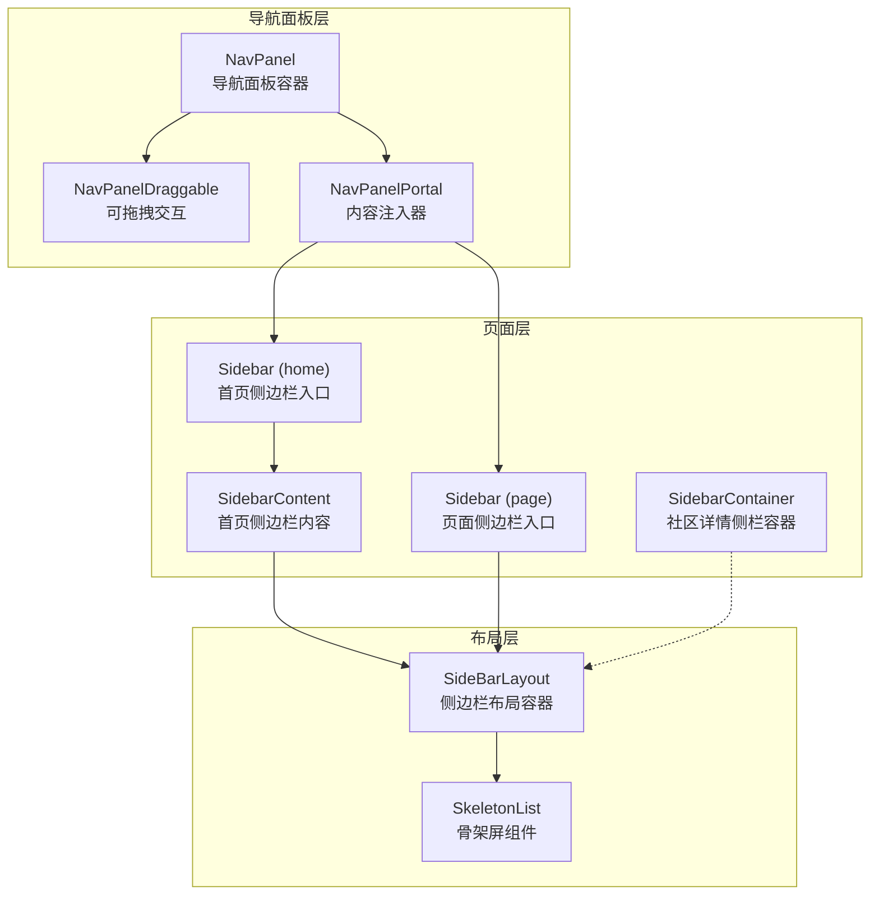
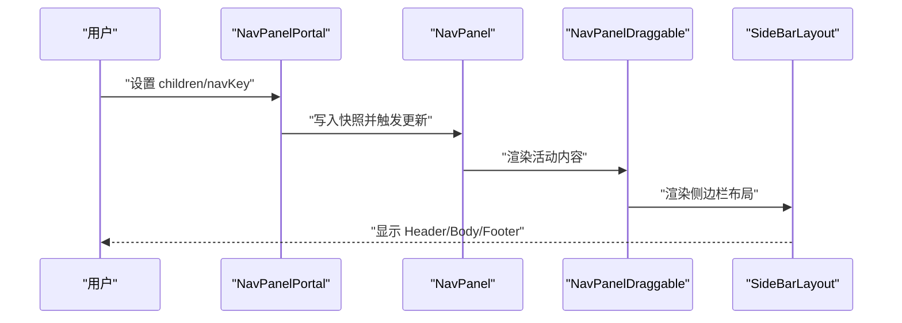
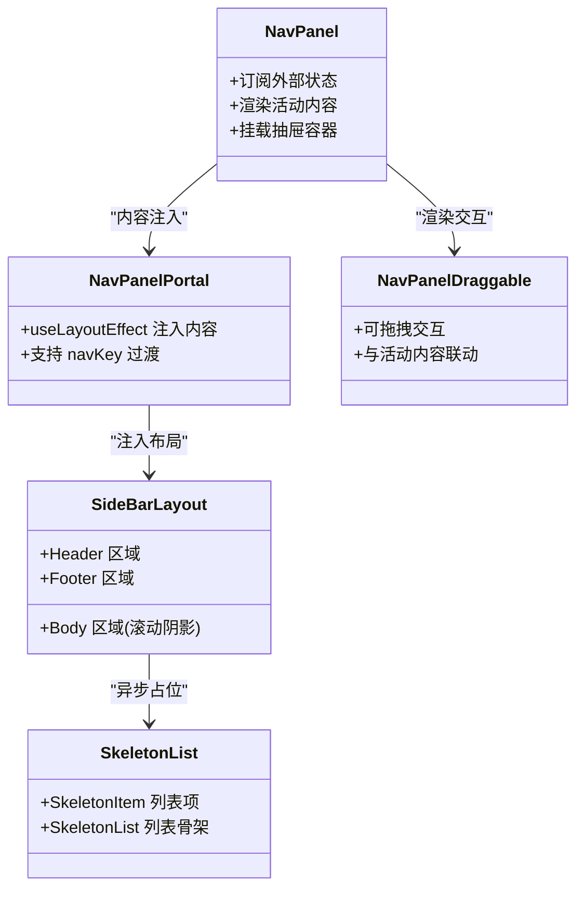
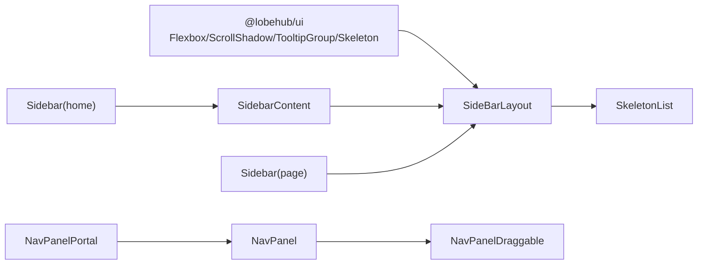

# 侧边栏布局

<cite>
**本文引用的文件**
- [src/features/NavPanel/index.tsx](file://src/features/NavPanel/index.tsx)
- [src/features/NavPanel/SideBarLayout.tsx](file://src/features/NavPanel/SideBarLayout.tsx)
- [src/features/NavPanel/components/SkeletonList.tsx](file://src/features/NavPanel/components/SkeletonList.tsx)
- [src/features/NavPanel/components/NavPanelDraggable.tsx](file://src/features/NavPanel/components/NavPanelDraggable.tsx)
- [src/routes/(main)/home/_layout/Sidebar.tsx](file://src/routes/(main)/home/_layout/Sidebar.tsx)
- [src/routes/(main)/home/_layout/SidebarContent.tsx](file://src/routes/(main)/home/_layout/SidebarContent.tsx)
- [src/features/Pages/PageLayout/Sidebar.tsx](file://src/features/Pages/PageLayout/Sidebar.tsx)
- [src/routes/(main)/community/(detail)/features/SidebarContainer.tsx](file://src/routes/(main)/community/(detail)/features/SidebarContainer.tsx)
- [src/components/Analytics/MainInterfaceTracker.tsx](file://src/components/Analytics/MainInterfaceTracker.tsx)
</cite>

## 目录
1. [简介](#简介)
2. [项目结构](#项目结构)
3. [核心组件](#核心组件)
4. [架构总览](#架构总览)
5. [详细组件分析](#详细组件分析)
6. [依赖关系分析](#依赖关系分析)
7. [性能考量](#性能考量)
8. [故障排查指南](#故障排查指南)
9. [结论](#结论)
10. [附录](#附录)

## 简介
本文件系统性梳理“侧边栏布局”组件的设计与实现，覆盖主容器布局、侧边栏区域、内容区域的划分与协同；响应式断点与折叠展开策略；内容区域自适应与骨架屏加载；与导航系统的集成、布局状态持久化与主题适配；以及动画、手势与键盘导航等交互体验优化，并给出性能与内存管理建议。

## 项目结构
侧边栏布局由“导航面板容器 + 布局容器 + 具体页面侧边栏”三层组成：
- 导航面板容器：负责内容切换与拖拽交互，统一挂载点与过渡动画触发
- 布局容器：定义侧边栏的头部、主体、页脚三段式结构，提供滚动阴影与提示组
- 页面侧边栏：按业务场景注入 Header/Body/Footer，通过 Portal 注入到导航面板

图表来源
- [src/features/NavPanel/index.tsx](file://src/features/NavPanel/index.tsx#L31-L55)
- [src/features/NavPanel/components/NavPanelDraggable.tsx](file://src/features/NavPanel/components/NavPanelDraggable.tsx#L1-L200)
- [src/features/NavPanel/index.tsx](file://src/features/NavPanel/index.tsx#L67-L79)
- [src/features/NavPanel/SideBarLayout.tsx](file://src/features/NavPanel/SideBarLayout.tsx#L14-L26)
- [src/features/NavPanel/components/SkeletonList.tsx](file://src/features/NavPanel/components/SkeletonList.tsx#L51-L61)
- [src/routes/(main)/home/_layout/Sidebar.tsx](file://src/routes/(main)/home/_layout/Sidebar.tsx#L7-L13)
- [src/routes/(main)/home/_layout/SidebarContent.tsx](file://src/routes/(main)/home/_layout/SidebarContent.tsx#L10-L16)
- [src/features/Pages/PageLayout/Sidebar.tsx](file://src/features/Pages/PageLayout/Sidebar.tsx#L11-L17)
- [src/routes/(main)/community/(detail)/features/SidebarContainer.tsx](file://src/routes/(main)/community/(detail)/features/SidebarContainer.tsx#L5-L18)

章节来源
- [src/features/NavPanel/index.tsx](file://src/features/NavPanel/index.tsx#L1-L80)
- [src/features/NavPanel/SideBarLayout.tsx](file://src/features/NavPanel/SideBarLayout.tsx#L1-L29)
- [src/features/NavPanel/components/SkeletonList.tsx](file://src/features/NavPanel/components/SkeletonList.tsx#L1-L64)
- [src/routes/(main)/home/_layout/Sidebar.tsx](file://src/routes/(main)/home/_layout/Sidebar.tsx#L1-L16)
- [src/routes/(main)/home/_layout/SidebarContent.tsx](file://src/routes/(main)/home/_layout/SidebarContent.tsx#L1-L19)
- [src/features/Pages/PageLayout/Sidebar.tsx](file://src/features/Pages/PageLayout/Sidebar.tsx#L1-L21)
- [src/routes/(main)/community/(detail)/features/SidebarContainer.tsx](file://src/routes/(main)/community/(detail)/features/SidebarContainer.tsx#L1-L20)

## 核心组件
- 导航面板容器（NavPanel）
  - 使用外部状态订阅机制维护当前侧边栏内容快照，支持无 children 时回退到默认首页侧边栏
  - 提供可拖拽交互区域，承载右侧抽屉挂载点
- 内容注入器（NavPanelPortal）
  - 通过 useLayoutEffect 将传入的子节点写入全局快照，触发过渡动画与渲染切换
  - 支持 navKey 变化驱动过渡
- 侧边栏布局容器（SideBarLayout）
  - 采用 Flexbox 布局，三段式结构：Header、ScrollShadow 包裹的 Body、Footer
  - 使用 Suspense 与骨架屏组件实现异步加载占位
- 骨架屏组件（SkeletonList/SkeletonItem）
  - 提供列表与单项骨架屏，提升首屏与异步渲染体验
- 页面侧边栏入口
  - 首页侧边栏入口：将 SidebarContent 注入到 NavPanelPortal
  - 页面侧边栏入口：直接注入 SideBarLayout 并传入 Header/Body
  - 社区详情侧栏容器：提供固定宽度与相对定位的 Flexbox 容器

章节来源
- [src/features/NavPanel/index.tsx](file://src/features/NavPanel/index.tsx#L31-L55)
- [src/features/NavPanel/index.tsx](file://src/features/NavPanel/index.tsx#L67-L79)
- [src/features/NavPanel/SideBarLayout.tsx](file://src/features/NavPanel/SideBarLayout.tsx#L8-L26)
- [src/features/NavPanel/components/SkeletonList.tsx](file://src/features/NavPanel/components/SkeletonList.tsx#L8-L49)
- [src/features/NavPanel/components/SkeletonList.tsx](file://src/features/NavPanel/components/SkeletonList.tsx#L51-L61)
- [src/routes/(main)/home/_layout/Sidebar.tsx](file://src/routes/(main)/home/_layout/Sidebar.tsx#L7-L13)
- [src/routes/(main)/home/_layout/SidebarContent.tsx](file://src/routes/(main)/home/_layout/SidebarContent.tsx#L10-L16)
- [src/features/Pages/PageLayout/Sidebar.tsx](file://src/features/Pages/PageLayout/Sidebar.tsx#L11-L17)
- [src/routes/(main)/community/(detail)/features/SidebarContainer.tsx](file://src/routes/(main)/community/(detail)/features/SidebarContainer.tsx#L5-L18)

## 架构总览
整体采用“容器 + 布局 + 页面”的分层设计：
- 容器层：NavPanel 统一调度，NavPanelPortal 负责内容注入与过渡
- 布局层：SideBarLayout 提供一致的三段式结构与滚动阴影
- 页面层：各业务侧边栏以 Header/Body/Footer 形式注入，形成可插拔布局

图表来源
- [src/features/NavPanel/index.tsx](file://src/features/NavPanel/index.tsx#L31-L55)
- [src/features/NavPanel/index.tsx](file://src/features/NavPanel/index.tsx#L67-L79)
- [src/features/NavPanel/components/NavPanelDraggable.tsx](file://src/features/NavPanel/components/NavPanelDraggable.tsx#L1-L200)
- [src/features/NavPanel/SideBarLayout.tsx](file://src/features/NavPanel/SideBarLayout.tsx#L14-L26)

## 详细组件分析

### 组件类图

图表来源
- [src/features/NavPanel/index.tsx](file://src/features/NavPanel/index.tsx#L31-L55)
- [src/features/NavPanel/index.tsx](file://src/features/NavPanel/index.tsx#L67-L79)
- [src/features/NavPanel/components/NavPanelDraggable.tsx](file://src/features/NavPanel/components/NavPanelDraggable.tsx#L1-L200)
- [src/features/NavPanel/SideBarLayout.tsx](file://src/features/NavPanel/SideBarLayout.tsx#L14-L26)
- [src/features/NavPanel/components/SkeletonList.tsx](file://src/features/NavPanel/components/SkeletonList.tsx#L51-L61)

章节来源
- [src/features/NavPanel/index.tsx](file://src/features/NavPanel/index.tsx#L1-L80)
- [src/features/NavPanel/SideBarLayout.tsx](file://src/features/NavPanel/SideBarLayout.tsx#L1-L29)
- [src/features/NavPanel/components/SkeletonList.tsx](file://src/features/NavPanel/components/SkeletonList.tsx#L1-L64)
- [src/features/NavPanel/components/NavPanelDraggable.tsx](file://src/features/NavPanel/components/NavPanelDraggable.tsx#L1-L200)

### 响应式设计与断点管理
- 布局容器采用 Flexbox 与 ScrollShadow，确保在不同窗口尺寸下内容区域自适应滚动
- 侧栏宽度与容器尺寸由具体页面侧边栏决定（如社区详情侧栏容器固定宽度），其他场景通过布局容器撑满剩余空间
- 骨架屏组件在异步加载时提供一致的视觉反馈，避免布局抖动

章节来源
- [src/features/NavPanel/SideBarLayout.tsx](file://src/features/NavPanel/SideBarLayout.tsx#L14-L26)
- [src/routes/(main)/community/(detail)/features/SidebarContainer.tsx](file://src/routes/(main)/community/(detail)/features/SidebarContainer.tsx#L5-L18)

### 侧边栏折叠展开与内容自适应
- 折叠展开通常通过外部状态控制（例如主题或布局配置），结合动画过渡实现平滑切换
- 通过 NavPanelPortal 的 navKey 变化驱动过渡，确保内容切换时的连贯性
- 布局容器内部使用 Suspense 与骨架屏，保证在数据未就绪时的稳定呈现

章节来源
- [src/features/NavPanel/index.tsx](file://src/features/NavPanel/index.tsx#L67-L79)
- [src/features/NavPanel/SideBarLayout.tsx](file://src/features/NavPanel/SideBarLayout.tsx#L14-L26)
- [src/features/NavPanel/components/SkeletonList.tsx](file://src/features/NavPanel/components/SkeletonList.tsx#L51-L61)

### 与导航系统的集成
- NavPanel 作为导航面板的根容器，统一管理内容切换与拖拽交互
- NavPanelPortal 用于将任意侧边栏内容注入到导航面板，支持多场景复用
- 通过全局快照与订阅机制，实现跨组件的状态同步与渲染更新

章节来源
- [src/features/NavPanel/index.tsx](file://src/features/NavPanel/index.tsx#L31-L55)
- [src/features/NavPanel/index.tsx](file://src/features/NavPanel/index.tsx#L67-L79)

### 布局状态持久化与主题适配
- 布局状态（如侧边栏展开/折叠）可通过外部状态存储并在应用启动时恢复
- 主题切换时，布局容器与骨架屏组件的颜色变量自动适配，保持视觉一致性

章节来源
- [src/components/Analytics/MainInterfaceTracker.tsx](file://src/components/Analytics/MainInterfaceTracker.tsx#L25-L25)

### 动画、手势与键盘导航
- 过渡动画：通过 NavPanelPortal 的 navKey 变化触发过渡，确保内容切换的流畅性
- 手势支持：NavPanelDraggable 提供可拖拽交互，便于用户调整侧边栏尺寸或触发面板展开
- 键盘导航：布局容器内使用 TooltipGroup 等组件，提升键盘可达性与可访问性

章节来源
- [src/features/NavPanel/index.tsx](file://src/features/NavPanel/index.tsx#L67-L79)
- [src/features/NavPanel/components/NavPanelDraggable.tsx](file://src/features/NavPanel/components/NavPanelDraggable.tsx#L1-L200)
- [src/features/NavPanel/SideBarLayout.tsx](file://src/features/NavPanel/SideBarLayout.tsx#L14-L26)

### 使用示例与最佳实践
- 在首页场景：通过 Sidebar 入口将 SidebarContent 注入到 NavPanelPortal，实现统一的三段式布局
- 在页面场景：直接使用 PageLayout 的 Sidebar，传入 Header/Body，快速构建侧边栏
- 在社区详情场景：使用 SidebarContainer 固定侧栏宽度，配合 Flexbox 实现稳定的布局

章节来源
- [src/routes/(main)/home/_layout/Sidebar.tsx](file://src/routes/(main)/home/_layout/Sidebar.tsx#L7-L13)
- [src/routes/(main)/home/_layout/SidebarContent.tsx](file://src/routes/(main)/home/_layout/SidebarContent.tsx#L10-L16)
- [src/features/Pages/PageLayout/Sidebar.tsx](file://src/features/Pages/PageLayout/Sidebar.tsx#L11-L17)
- [src/routes/(main)/community/(detail)/features/SidebarContainer.tsx](file://src/routes/(main)/community/(detail)/features/SidebarContainer.tsx#L5-L18)

## 依赖关系分析
- 组件耦合度低：NavPanel 仅依赖 NavPanelPortal 的注入接口，SideBarLayout 仅依赖 Header/Body/Footer 的可选注入
- 外部依赖：@lobehub/ui 的 Flexbox、ScrollShadow、TooltipGroup、Skeleton 等组件
- 潜在循环依赖：当前结构清晰，未发现循环依赖迹象

图表来源
- [src/features/NavPanel/SideBarLayout.tsx](file://src/features/NavPanel/SideBarLayout.tsx#L1-L3)
- [src/features/NavPanel/components/SkeletonList.tsx](file://src/features/NavPanel/components/SkeletonList.tsx#L1-L6)
- [src/features/NavPanel/index.tsx](file://src/features/NavPanel/index.tsx#L67-L79)
- [src/features/NavPanel/components/NavPanelDraggable.tsx](file://src/features/NavPanel/components/NavPanelDraggable.tsx#L1-L200)
- [src/routes/(main)/home/_layout/Sidebar.tsx](file://src/routes/(main)/home/_layout/Sidebar.tsx#L3-L13)
- [src/routes/(main)/home/_layout/SidebarContent.tsx](file://src/routes/(main)/home/_layout/SidebarContent.tsx#L3-L16)
- [src/features/Pages/PageLayout/Sidebar.tsx](file://src/features/Pages/PageLayout/Sidebar.tsx#L5-L17)

章节来源
- [src/features/NavPanel/SideBarLayout.tsx](file://src/features/NavPanel/SideBarLayout.tsx#L1-L29)
- [src/features/NavPanel/components/SkeletonList.tsx](file://src/features/NavPanel/components/SkeletonList.tsx#L1-L64)
- [src/features/NavPanel/index.tsx](file://src/features/NavPanel/index.tsx#L1-L80)
- [src/features/NavPanel/components/NavPanelDraggable.tsx](file://src/features/NavPanel/components/NavPanelDraggable.tsx#L1-L200)
- [src/routes/(main)/home/_layout/Sidebar.tsx](file://src/routes/(main)/home/_layout/Sidebar.tsx#L1-L16)
- [src/routes/(main)/home/_layout/SidebarContent.tsx](file://src/routes/(main)/home/_layout/SidebarContent.tsx#L1-L19)
- [src/features/Pages/PageLayout/Sidebar.tsx](file://src/features/Pages/PageLayout/Sidebar.tsx#L1-L21)
- [src/routes/(main)/community/(detail)/features/SidebarContainer.tsx](file://src/routes/(main)/community/(detail)/features/SidebarContainer.tsx#L1-L20)

## 性能考量
- 渲染优化
  - 使用 memo 对容器组件进行记忆化，减少不必要的重渲染
  - 使用 Suspense 与骨架屏，避免长列表或异步数据导致的布局抖动
- 内存管理
  - NavPanelPortal 在 children 为空时不写入快照，避免无效渲染
  - 布局容器高度固定为 100%，减少父级布局计算开销
- 动画与交互
  - 过渡动画基于 navKey 变化触发，避免频繁状态更新
  - 滚动阴影与 TooltipGroup 在内容区域使用，降低全局重绘范围

章节来源
- [src/features/NavPanel/index.tsx](file://src/features/NavPanel/index.tsx#L31-L55)
- [src/features/NavPanel/index.tsx](file://src/features/NavPanel/index.tsx#L67-L79)
- [src/features/NavPanel/SideBarLayout.tsx](file://src/features/NavPanel/SideBarLayout.tsx#L14-L26)
- [src/features/NavPanel/components/SkeletonList.tsx](file://src/features/NavPanel/components/SkeletonList.tsx#L51-L61)

## 故障排查指南
- 内容不显示
  - 检查 NavPanelPortal 是否正确传入 children 与 navKey
  - 确认 NavPanel 是否存在默认回退（无内容时回退到首页侧边栏）
- 布局异常
  - 检查 SideBarLayout 的高度与溢出设置是否正确
  - 确认 ScrollShadow 是否包裹了可滚动的 Body 区域
- 骨架屏不出现
  - 确保异步内容处于 Suspense 边界内
  - 检查 SkeletonList 的行数与样式参数

章节来源
- [src/features/NavPanel/index.tsx](file://src/features/NavPanel/index.tsx#L31-L55)
- [src/features/NavPanel/index.tsx](file://src/features/NavPanel/index.tsx#L67-L79)
- [src/features/NavPanel/SideBarLayout.tsx](file://src/features/NavPanel/SideBarLayout.tsx#L14-L26)
- [src/features/NavPanel/components/SkeletonList.tsx](file://src/features/NavPanel/components/SkeletonList.tsx#L51-L61)

## 结论
该侧边栏布局体系以“容器 + 布局 + 页面”分层设计为核心，通过 NavPanel 与 NavPanelPortal 实现内容注入与过渡，借助 SideBarLayout 提供一致的三段式结构与滚动阴影，结合骨架屏与 Suspense 提升异步加载体验。整体架构清晰、耦合度低、扩展性强，适合在多场景下复用与定制。

## 附录
- 术语
  - 导航面板：承载侧边栏内容的统一容器
  - 内容注入器：将侧边栏内容注入到导航面板的 Portal 组件
  - 布局容器：定义侧边栏头部、主体、页脚的三段式结构
  - 骨架屏：异步加载时的占位元素，提升用户体验