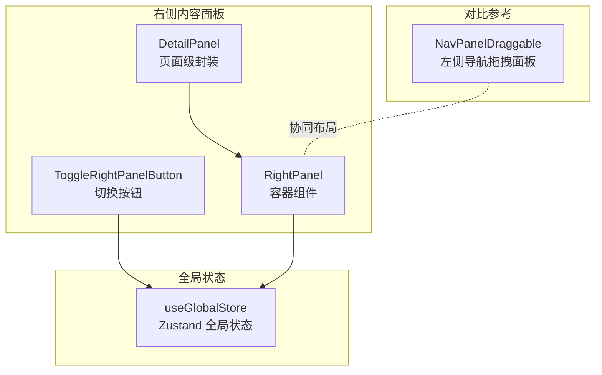
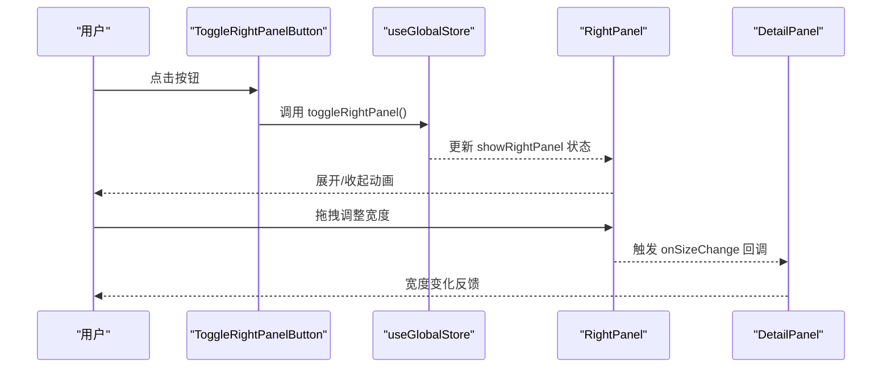
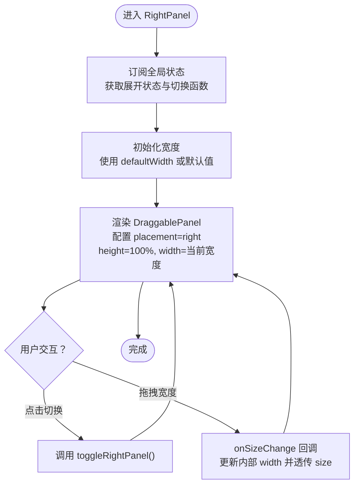
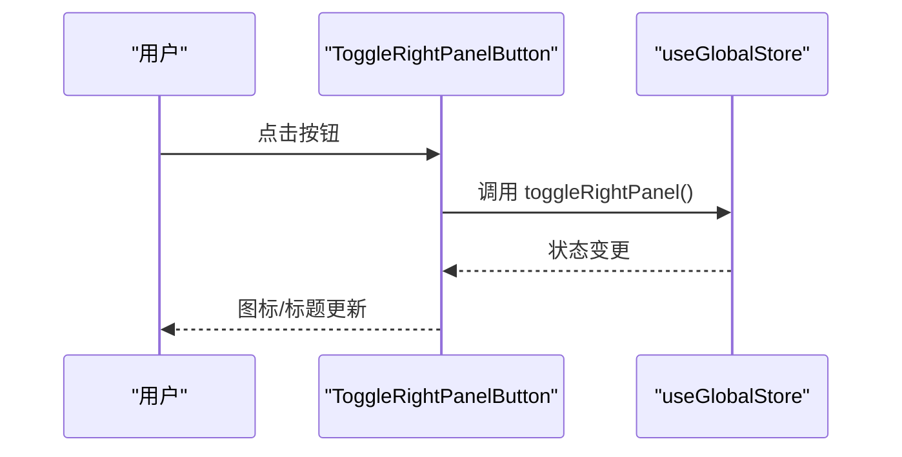
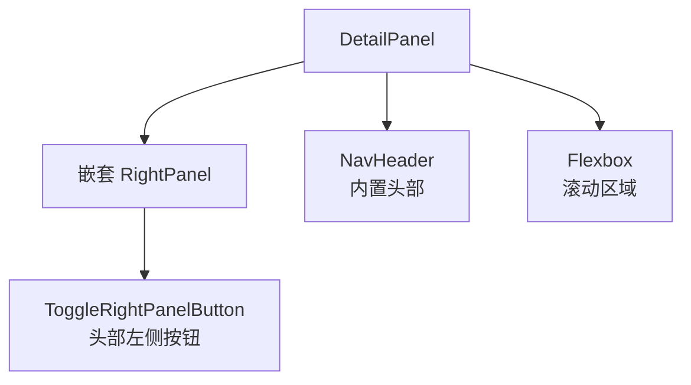
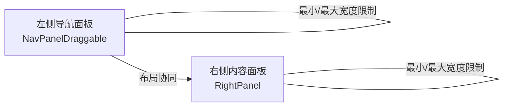
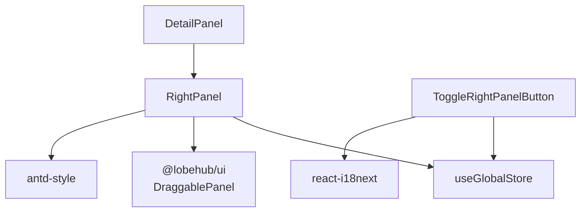

# 右侧内容面板

<cite>
**本文引用的文件**
- [src/features/RightPanel/index.tsx](file://src/features/RightPanel/index.tsx)
- [src/features/RightPanel/ToggleRightPanelButton.tsx](file://src/features/RightPanel/ToggleRightPanelButton.tsx)
- [src/routes/(main)/memory/features/DetailPanel.tsx](file://src/routes/(main)/memory/features/DetailPanel.tsx)
- [src/store/global/store.ts](file://src/store/global/store.ts)
- [src/features/NavPanel/components/NavPanelDraggable.tsx](file://src/features/NavPanel/components/NavPanelDraggable.tsx)
</cite>

## 目录

1. [简介](#简介)
2. [项目结构](#项目结构)
3. [核心组件](#核心组件)
4. [架构总览](#架构总览)
5. [组件详解](#组件详解)
6. [依赖关系分析](#依赖关系分析)
7. [性能与内存优化](#性能与内存优化)
8. [故障排查指南](#故障排查指南)
9. [结论](#结论)
10. [附录：使用示例与最佳实践](#附录使用示例与最佳实践)

## 简介

右侧内容面板是一个可拖拽、可展开 / 收起的容器组件，用于承载主内容区域之外的辅助信息、详情页或设置面板。它支持：

- 面板开关控制（通过全局状态与按钮）
- 内容区域布局与滚动行为
- 尺寸调整（最小 / 最大宽度限制）
- 响应式适配与动画过渡
- 动态内容加载与懒加载占位
- 快捷键与无障碍访问提示
- 与主内容区域的协调机制（如与左侧导航面板共存时的布局配合）

## 项目结构

右侧内容面板由以下关键文件组成：

- 组件入口：右侧内容面板容器与按钮
- 页面级封装：详情页容器，复用右侧面板并内置头部与滚动布局
- 全局状态：统一管理面板展开状态与切换动作
- 对比参考：左侧导航面板的拖拽实现，便于理解两侧面板的协同

**图表来源**

- [src/features/RightPanel/index.tsx](file://src/features/RightPanel/index.tsx#L23-L57)
- [src/features/RightPanel/ToggleRightPanelButton.tsx](file://src/features/RightPanel/ToggleRightPanelButton.tsx#L27-L52)
- [src/routes/(main)/memory/features/DetailPanel.tsx](<file://src/routes/(main)/memory/features/DetailPanel.tsx#L14-L44>)
- [src/store/global/store.ts](file://src/store/global/store.ts#L37-L40)
- [src/features/NavPanel/components/NavPanelDraggable.tsx](file://src/features/NavPanel/components/NavPanelDraggable.tsx#L212-L249)

**章节来源**

- [src/features/RightPanel/index.tsx](file://src/features/RightPanel/index.tsx#L1-L60)
- [src/features/RightPanel/ToggleRightPanelButton.tsx](file://src/features/RightPanel/ToggleRightPanelButton.tsx#L1-L56)
- [src/routes/(main)/memory/features/DetailPanel.tsx](<file://src/routes/(main)/memory/features/DetailPanel.tsx#L1-L46>)
- [src/store/global/store.ts](file://src/store/global/store.ts#L1-L41)
- [src/features/NavPanel/components/NavPanelDraggable.tsx](file://src/features/NavPanel/components/NavPanelDraggable.tsx#L31-L250)

## 核心组件

- 右侧面板容器（RightPanel）
  - 负责渲染右侧可拖拽面板，绑定全局展开状态，限制宽度范围，并将子元素作为内容区
  - 支持默认宽度、最小 / 最大宽度、尺寸变更回调
- 切换按钮（ToggleRightPanelButton）
  - 提供图标按钮，显示当前展开状态，支持快捷键提示与无障碍标题
- 页面级详情容器（DetailPanel）
  - 在右侧面板内封装导航头部与滚动区域，提供统一的详情页布局

**章节来源**

- [src/features/RightPanel/index.tsx](file://src/features/RightPanel/index.tsx#L10-L21)
- [src/features/RightPanel/ToggleRightPanelButton.tsx](file://src/features/RightPanel/ToggleRightPanelButton.tsx#L19-L25)
- [src/routes/(main)/memory/features/DetailPanel.tsx](<file://src/routes/(main)/memory/features/DetailPanel.tsx#L10-L12>)

## 架构总览

右侧内容面板与全局状态、按钮、页面容器之间的交互如下：

**图表来源**

- [src/features/RightPanel/ToggleRightPanelButton.tsx](file://src/features/RightPanel/ToggleRightPanelButton.tsx#L29-L51)
- [src/features/RightPanel/index.tsx](file://src/features/RightPanel/index.tsx#L25-L50)
- [src/routes/(main)/memory/features/DetailPanel.tsx](<file://src/routes/(main)/memory/features/DetailPanel.tsx#L16-L42>)
- [src/store/global/store.ts](file://src/store/global/store.ts#L37-L40)

## 组件详解

### 右侧面板容器（RightPanel）

- 关键能力
  - 展开 / 收起：受全局状态控制，不提供外部可拖拽展开
  - 尺寸管理：固定高度、可变宽度；支持最小 / 最大宽度限制
  - 动态内容：使用 Suspense 加载子组件，避免阻塞
  - 事件回调：暴露尺寸变更回调，便于上层记录或持久化
- 数据流
  - 从全局状态订阅面板展开状态
  - 记录当前宽度并在拖拽过程中更新
  - 将尺寸变更回传给上层

**图表来源**

- [src/features/RightPanel/index.tsx](file://src/features/RightPanel/index.tsx#L23-L57)

**章节来源**

- [src/features/RightPanel/index.tsx](file://src/features/RightPanel/index.tsx#L23-L57)

### 切换按钮（ToggleRightPanelButton）

- 关键能力
  - 根据展开状态切换图标（打开 / 关闭）
  - 支持隐藏 “已展开时显示” 的按钮
  - 支持快捷键提示与无障碍标题
- 交互流程
  - 点击按钮触发全局状态切换
  - 图标与标题根据状态动态更新

**图表来源**

- [src/features/RightPanel/ToggleRightPanelButton.tsx](file://src/features/RightPanel/ToggleRightPanelButton.tsx#L29-L51)

**章节来源**

- [src/features/RightPanel/ToggleRightPanelButton.tsx](file://src/features/RightPanel/ToggleRightPanelButton.tsx#L27-L52)

### 页面级详情容器（DetailPanel）

- 关键能力
  - 在右侧面板内提供统一的头部与滚动区域
  - 内置右侧面板切换按钮，便于在详情页内快速收起
  - 提供灵活的间距与滚动行为，保证内容溢出时的体验
- 使用建议
  - 在详情页中直接包裹内容，无需重复实现头部与滚动逻辑

**图表来源**

- [src/routes/(main)/memory/features/DetailPanel.tsx](<file://src/routes/(main)/memory/features/DetailPanel.tsx#L14-L44>)

**章节来源**

- [src/routes/(main)/memory/features/DetailPanel.tsx](<file://src/routes/(main)/memory/features/DetailPanel.tsx#L14-L44>)

### 与左侧导航面板的协同（对比参考）

- 左侧导航面板同样基于 DraggablePanel 实现，支持拖拽调整宽度与内容切换动画
- 两者可并存于同一页面，分别位于左右两侧，互不干扰
- 右侧面板的宽度范围与最小 / 最大宽度限制有助于在有限空间内保持良好布局

**图表来源**

- [src/features/NavPanel/components/NavPanelDraggable.tsx](file://src/features/NavPanel/components/NavPanelDraggable.tsx#L212-L249)
- [src/features/RightPanel/index.tsx](file://src/features/RightPanel/index.tsx#L37-L38)

**章节来源**

- [src/features/NavPanel/components/NavPanelDraggable.tsx](file://src/features/NavPanel/components/NavPanelDraggable.tsx#L31-L250)
- [src/features/RightPanel/index.tsx](file://src/features/RightPanel/index.tsx#L37-L38)

## 依赖关系分析

- 组件耦合
  - RightPanel 依赖全局状态（Zustand）以维持跨页面一致的展开状态
  - ToggleRightPanelButton 依赖全局状态与用户设置（快捷键）
  - DetailPanel 依赖 RightPanel 与 NavHeader，形成页面级封装
- 外部依赖
  - DraggablePanel：提供拖拽、展开 / 收起、尺寸控制等能力
  - antd-style：提供主题变量（背景色等）
  - react-i18next：提供国际化标题与提示
- 潜在风险
  - 全局状态与组件状态（宽度）分离，需确保 onSizeChange 的正确传递
  - Suspense 的使用需保证子组件具备合适的 fallback

**图表来源**

- [src/features/RightPanel/index.tsx](file://src/features/RightPanel/index.tsx#L1-L8)
- [src/features/RightPanel/ToggleRightPanelButton.tsx](file://src/features/RightPanel/ToggleRightPanelButton.tsx#L3-L15)
- [src/routes/(main)/memory/features/DetailPanel.tsx](<file://src/routes/(main)/memory/features/DetailPanel.tsx#L1-L8>)
- [src/store/global/store.ts](file://src/store/global/store.ts#L37-L40)

**章节来源**

- [src/features/RightPanel/index.tsx](file://src/features/RightPanel/index.tsx#L1-L8)
- [src/features/RightPanel/ToggleRightPanelButton.tsx](file://src/features/RightPanel/ToggleRightPanelButton.tsx#L3-L15)
- [src/routes/(main)/memory/features/DetailPanel.tsx](<file://src/routes/(main)/memory/features/DetailPanel.tsx#L1-L8>)
- [src/store/global/store.ts](file://src/store/global/store.ts#L37-L40)

## 性能与内存优化

- 渲染优化
  - 使用 memo 包裹组件，减少不必要的重渲染
  - 使用 Suspense 异步加载子组件，避免阻塞主线程
- 状态管理
  - Zustand 的浅比较与订阅选择器降低无关状态变更带来的重渲染
  - 将宽度状态保留在组件内部，避免全局状态频繁更新
- 动画与滚动
  - 合理设置最小 / 最大宽度，避免频繁布局抖动
  - 滚动区域采用自动滚动，避免内容溢出导致的布局异常
- 内存管理
  - 页面级容器（如 DetailPanel）在组件卸载时释放滚动位置与临时状态
  - 避免在 onSizeChange 中进行昂贵计算，必要时使用节流 / 防抖

\[本节为通用性能建议，不直接分析具体文件]

## 故障排查指南

- 面板无法展开 / 收起
  - 检查全局状态中的切换函数是否被正确调用
  - 确认按钮未被条件隐藏（例如 “已展开时隐藏”）
- 拖拽无效或宽度不生效
  - 确认 onSizeChange 是否被正确传递到上层
  - 检查最小 / 最大宽度设置是否合理
- 内容闪烁或加载缓慢
  - 确保子组件具备合适的 Suspense fallback
  - 避免在渲染阶段执行耗时任务
- 无障碍与快捷键
  - 确认快捷键已在用户设置中配置
  - 标题与提示文案需通过国际化资源提供

**章节来源**

- [src/features/RightPanel/ToggleRightPanelButton.tsx](file://src/features/RightPanel/ToggleRightPanelButton.tsx#L29-L51)
- [src/features/RightPanel/index.tsx](file://src/features/RightPanel/index.tsx#L45-L50)
- [src/routes/(main)/memory/features/DetailPanel.tsx](<file://src/routes/(main)/memory/features/DetailPanel.tsx#L26-L41>)

## 结论

右侧内容面板通过全局状态与按钮实现统一的展开 / 收起控制，结合 DraggablePanel 提供的拖拽与尺寸管理能力，能够满足多种页面场景下的内容承载需求。其与页面级容器（如详情页）的组合，进一步提升了开发效率与一致性。在实际使用中，建议关注状态同步、尺寸限制与异步加载的配合，以获得更佳的用户体验。

\[本节为总结性内容，不直接分析具体文件]

## 附录：使用示例与最佳实践

- 在页面中嵌入右侧内容面板
  - 直接使用 DetailPanel 包裹详情内容，即可获得统一的头部与滚动区域
  - 如需自定义宽度，可在 DetailPanel 外层再次封装 RightPanel 并设置 defaultWidth/minWidth/maxWidth
- 实现内容动态加载
  - 将异步组件置于 RightPanel 内部，利用 Suspense 的 fallback 提升首屏体验
- 处理面板状态变化
  - 通过 onSizeChange 记录宽度变化，以便在下次进入页面时恢复
  - 使用全局状态保持跨页面一致的展开状态
- 与主内容区域的协调
  - 当同时存在左侧导航面板时，合理设置两侧面板的最小 / 最大宽度，避免布局冲突
- 增强功能
  - 快捷键：在用户设置中配置 “切换右侧面板” 快捷键，按钮会自动显示提示
  - 无障碍：为按钮提供标题与提示，提升可访问性
  - 拖拽调整：通过拖拽手柄调整宽度，注意不要超出最小 / 最大范围

**章节来源**

- [src/routes/(main)/memory/features/DetailPanel.tsx](<file://src/routes/(main)/memory/features/DetailPanel.tsx#L14-L44>)
- [src/features/RightPanel/index.tsx](file://src/features/RightPanel/index.tsx#L23-L57)
- [src/features/RightPanel/ToggleRightPanelButton.tsx](file://src/features/RightPanel/ToggleRightPanelButton.tsx#L29-L51)
- [src/features/NavPanel/components/NavPanelDraggable.tsx](file://src/features/NavPanel/components/NavPanelDraggable.tsx#L212-L249)
