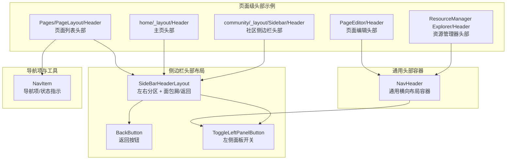
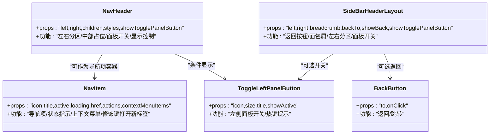
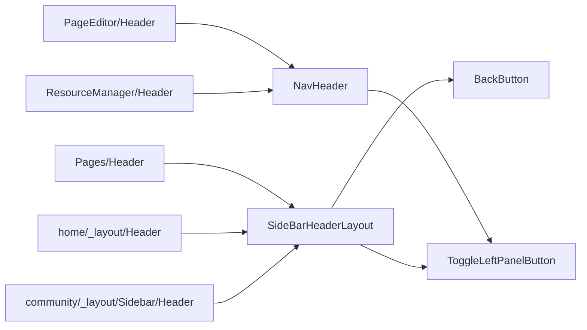

# 导航头部

<cite>
**本文引用的文件**
- [src/features/NavPanel/SideBarHeaderLayout.tsx](file://src/features/NavPanel/SideBarHeaderLayout.tsx)
- [src/features/NavHeader/index.tsx](file://src/features/NavHeader/index.tsx)
- [src/features/NavPanel/components/BackButton.tsx](file://src/features/NavPanel/components/BackButton.tsx)
- [src/features/NavPanel/ToggleLeftPanelButton.tsx](file://src/features/NavPanel/ToggleLeftPanelButton.tsx)
- [src/features/NavPanel/components/NavItem.tsx](file://src/features/NavPanel/components/NavItem.tsx)
- [src/features/Pages/PageLayout/Header/index.tsx](file://src/features/Pages/PageLayout/Header/index.tsx)
- [src/features/PageEditor/Header/index.tsx](file://src/features/PageEditor/Header/index.tsx)
- [src/features/ResourceManager/components/Explorer/Header/index.tsx](file://src/features/ResourceManager/components/Explorer/Header/index.tsx)
- [src/routes/(main)/home/_layout/Header/index.tsx](file://src/routes/(main)/home/_layout/Header/index.tsx)
- [src/routes/(main)/community/_layout/Sidebar/Header/index.tsx](file://src/routes/(main)/community/_layout/Sidebar/Header/index.tsx)
- [src/routes/(main)/settings/_layout/SidebarContent.tsx](file://src/routes/(main)/settings/_layout/SidebarContent.tsx)
- [src/routes/(mobile)/me/profile/layout.tsx](file://src/routes/(mobile)/me/profile/layout.tsx)
</cite>

## 目录

1. [简介](#简介)
2. [项目结构](#项目结构)
3. [核心组件](#核心组件)
4. [架构总览](#架构总览)
5. [详细组件分析](#详细组件分析)
6. [依赖关系分析](#依赖关系分析)
7. [性能考量](#性能考量)
8. [故障排查指南](#故障排查指南)
9. [结论](#结论)
10. [附录：使用示例与最佳实践](#附录使用示例与最佳实践)

## 简介

本章节系统化梳理导航头部组件的设计与实现，覆盖标题显示、面包屑导航、页面状态指示、用户操作区域等关键能力；并阐述与路由系统的集成方式、条件渲染策略、响应式布局、固定定位与滚动隐藏、主题适配、可定制性、国际化与无障碍访问等用户体验优化点。通过多场景用例（主页、社区页、设置侧边栏、资源管理器、页面编辑器）展示如何在不同页面中配置导航头部、实现动态标题更新与面包屑跳转。

## 项目结构

导航头部相关代码主要分布在以下模块：

- 通用导航头部容器：NavHeader
- 侧边栏头部布局：SideBarHeaderLayout
- 面包屑与返回按钮：BackButton、Breadcrumb（由 SideBarHeaderLayout 内部使用）
- 左侧面板开关：ToggleLeftPanelButton
- 导航项：NavItem
- 页面级头部示例：Pages/PageLayout/Header、PageEditor/Header、ResourceManager Explorer/Header
- 路由层头部封装：home/\_layout/Header、community/\_layout/Sidebar/Header

图表来源

- [src/features/NavHeader/index.tsx](file://src/features/NavHeader/index.tsx#L22-L67)
- [src/features/NavPanel/SideBarHeaderLayout.tsx](file://src/features/NavPanel/SideBarHeaderLayout.tsx#L56-L146)
- [src/features/NavPanel/components/BackButton.tsx](file://src/features/NavPanel/components/BackButton.tsx#L11-L23)
- [src/features/NavPanel/ToggleLeftPanelButton.tsx](file://src/features/NavPanel/ToggleLeftPanelButton.tsx#L26-L51)
- [src/features/NavPanel/components/NavItem.tsx](file://src/features/NavPanel/components/NavItem.tsx#L63-L171)
- [src/features/Pages/PageLayout/Header/index.tsx](file://src/features/Pages/PageLayout/Header/index.tsx#L14-L38)
- [src/features/PageEditor/Header/index.tsx](file://src/features/PageEditor/Header/index.tsx#L17-L70)
- [src/features/ResourceManager/components/Explorer/Header/index.tsx](file://src/features/ResourceManager/components/Explorer/Header/index.tsx#L24-L118)
- [src/routes/(main)/home/\_layout/Header/index.tsx](<file://src/routes/(main)/home/_layout/Header/index.tsx#L11-L18>)
- [src/routes/(main)/community/\_layout/Sidebar/Header/index.tsx](<file://src/routes/(main)/community/_layout/Sidebar/Header/index.tsx#L11-L26>)

章节来源

- [src/features/NavHeader/index.tsx](file://src/features/NavHeader/index.tsx#L1-L70)
- [src/features/NavPanel/SideBarHeaderLayout.tsx](file://src/features/NavPanel/SideBarHeaderLayout.tsx#L1-L149)
- [src/features/NavPanel/components/BackButton.tsx](file://src/features/NavPanel/components/BackButton.tsx#L1-L26)
- [src/features/NavPanel/ToggleLeftPanelButton.tsx](file://src/features/NavPanel/ToggleLeftPanelButton.tsx#L1-L54)
- [src/features/NavPanel/components/NavItem.tsx](file://src/features/NavPanel/components/NavItem.tsx#L1-L174)
- [src/features/Pages/PageLayout/Header/index.tsx](file://src/features/Pages/PageLayout/Header/index.tsx#L1-L41)
- [src/features/PageEditor/Header/index.tsx](file://src/features/PageEditor/Header/index.tsx#L1-L73)
- [src/features/ResourceManager/components/Explorer/Header/index.tsx](file://src/features/ResourceManager/components/Explorer/Header/index.tsx#L1-L121)
- [src/routes/(main)/home/\_layout/Header/index.tsx](<file://src/routes/(main)/home/_layout/Header/index.tsx#L1-L21>)
- [src/routes/(main)/community/\_layout/Sidebar/Header/index.tsx](<file://src/routes/(main)/community/_layout/Sidebar/Header/index.tsx#L1-L29>)

## 核心组件

- NavHeader：通用头部容器，支持左侧、中部、右侧分区，自动根据面板展开状态控制显示，提供统一的样式与交互基座。
- SideBarHeaderLayout：侧边栏专用头部布局，支持返回按钮、面包屑导航、左侧 / 右侧内容区、左侧面板开关按钮。
- BackButton：返回按钮，结合路由进行回退或跳转。
- ToggleLeftPanelButton：左侧面板开关，支持热键提示与状态高亮。
- NavItem：导航项组件，支持图标、标题、额外内容、上下文菜单、加载态与修饰键点击行为。

章节来源

- [src/features/NavHeader/index.tsx](file://src/features/NavHeader/index.tsx#L10-L67)
- [src/features/NavPanel/SideBarHeaderLayout.tsx](file://src/features/NavPanel/SideBarHeaderLayout.tsx#L47-L146)
- [src/features/NavPanel/components/BackButton.tsx](file://src/features/NavPanel/components/BackButton.tsx#L11-L23)
- [src/features/NavPanel/ToggleLeftPanelButton.tsx](file://src/features/NavPanel/ToggleLeftPanelButton.tsx#L19-L51)
- [src/features/NavPanel/components/NavItem.tsx](file://src/features/NavPanel/components/NavItem.tsx#L46-L171)

## 架构总览

导航头部体系采用 “容器 + 布局 + 功能按钮” 的分层设计：

- 容器层：NavHeader 提供统一的横向布局与显示控制。
- 布局层：SideBarHeaderLayout 在容器内实现左右分区、面包屑与返回按钮。
- 功能层：BackButton、ToggleLeftPanelButton、NavItem 等提供具体交互能力。
- 场景层：各页面头部（如 Pages、PageEditor、ResourceManager）基于上述容器与布局进行组合与定制。

图表来源

- [src/features/NavHeader/index.tsx](file://src/features/NavHeader/index.tsx#L22-L67)
- [src/features/NavPanel/SideBarHeaderLayout.tsx](file://src/features/NavPanel/SideBarHeaderLayout.tsx#L56-L146)
- [src/features/NavPanel/components/BackButton.tsx](file://src/features/NavPanel/components/BackButton.tsx#L11-L23)
- [src/features/NavPanel/ToggleLeftPanelButton.tsx](file://src/features/NavPanel/ToggleLeftPanelButton.tsx#L26-L51)
- [src/features/NavPanel/components/NavItem.tsx](file://src/features/NavPanel/components/NavItem.tsx#L63-L171)

## 详细组件分析

### NavHeader 通用头部容器

- 设计要点
  - 横向布局，三段式分区：左侧（left）、中部（children，可选）、右侧（right）。
  - 支持 showTogglePanelButton 控制是否显示左侧面板开关按钮。
  - 当无内容且左侧面板展开时，头部不渲染，避免重复与遮挡。
  - 统一高度与间距，便于在不同页面复用。
- 可定制性
  - styles.left/right/center 可分别注入样式。
  - 支持传入任意 ReactNode 作为 left/right/children。
- 无障碍与国际化
  - 使用 TooltipGroup 包裹，便于为子元素添加提示。
  - 结合 i18n 库在上层页面中进行文案翻译。

章节来源

- [src/features/NavHeader/index.tsx](file://src/features/NavHeader/index.tsx#L10-L67)

### SideBarHeaderLayout 侧边栏头部布局

- 设计要点
  - 左侧优先：若传入 left，则显示返回按钮（可选）与 left 内容；否则渲染面包屑导航。
  - 右侧：显示左侧面板开关按钮（可选）与 right 内容。
  - 面包屑：默认包含首页入口，支持自定义条目数组；点击事件中阻止默认行为并通过 flushSync 触发导航。
  - 返回按钮：支持自定义返回地址与尺寸。
- 交互细节
  - 修饰键点击（Cmd/Ctrl）支持在新标签页打开链接。
  - flushSync 同步刷新以确保导航切换即时生效。
- 响应式与主题
  - 通过 antd-style 注入样式，适配描述色、悬浮色等主题变量。
  - 移动端顶部留白处理（margin-block-start）。

章节来源

- [src/features/NavPanel/SideBarHeaderLayout.tsx](file://src/features/NavPanel/SideBarHeaderLayout.tsx#L47-L146)

### BackButton 返回按钮

- 行为特性
  - 基于 Link 实现，支持 to 与 onClick。
  - 尺寸与图标统一使用常量，保证视觉一致性。
- 使用建议
  - 在需要返回上级或回到首页的页面中启用 showBack。

章节来源

- [src/features/NavPanel/components/BackButton.tsx](file://src/features/NavPanel/components/BackButton.tsx#L11-L23)

### ToggleLeftPanelButton 左侧面板开关

- 行为特性
  - 读取全局状态决定当前展开 / 收起状态，并提供 active 标记。
  - 支持热键提示与 Tooltip。
  - 可通过 showActive 控制是否高亮。
- 与 NavHeader 的关系
  - NavHeader 中在未展开时显示该按钮，帮助用户快速打开左侧面板。

章节来源

- [src/features/NavPanel/ToggleLeftPanelButton.tsx](file://src/features/NavPanel/ToggleLeftPanelButton.tsx#L19-L51)

### NavItem 导航项

- 行为特性
  - 支持 active、loading、disabled 状态。
  - 支持 href 与修饰键点击在新标签页打开。
  - 支持 extra 与 actions 区域，悬停时动作区显隐。
  - 支持上下文菜单（ContextMenuTrigger）。
- 适用场景
  - 作为页面头部的搜索、排序、视图切换等工具按钮。

章节来源

- [src/features/NavPanel/components/NavItem.tsx](file://src/features/NavPanel/components/NavItem.tsx#L46-L171)

### 页面级头部示例

#### Pages/PageLayout/Header 页面列表头部

- 功能要点
  - 通过 SideBarHeaderLayout 展示 “页面” 面包屑与右侧添加按钮。
  - 在底部展示一个可点击的导航项，用于触发命令菜单（如搜索）。
- 国际化
  - 使用 useTranslation 获取 “页面 / 搜索” 等文案。

章节来源

- [src/features/Pages/PageLayout/Header/index.tsx](file://src/features/Pages/PageLayout/Header/index.tsx#L14-L38)

#### PageEditor/Header 页面编辑头部

- 功能要点
  - 使用 NavHeader 作为容器，左侧根据是否有父目录展示面包屑或标题与图标，右侧展示菜单与右侧面板开关。
  - 支持自动保存状态提示。
- 动态标题
  - 标题与图标来自编辑器状态，实现动态更新。

章节来源

- [src/features/PageEditor/Header/index.tsx](file://src/features/PageEditor/Header/index.tsx#L17-L70)

#### ResourceManager Explorer/Header 资源管理器头部

- 功能要点
  - 多选模式下显示批量操作按钮；单选或无库时显示分类名称或面包屑。
  - 右侧提供搜索、排序、批量操作、视图切换与添加按钮。
  - 底部带分隔线，增强视觉层次。
- 国际化
  - 多命名空间翻译（components/common/file/knowledgeBase）。

章节来源

- [src/features/ResourceManager/components/Explorer/Header/index.tsx](file://src/features/ResourceManager/components/Explorer/Header/index.tsx#L24-L118)

#### 路由层头部封装

- 主页头部
  - 使用 SideBarHeaderLayout 展示用户头像与添加按钮，下方渲染导航菜单。
- 社区侧边栏头部
  - 通过面包屑指向社区页，下方渲染导航菜单。
- 设置侧边栏
  - 通过 SidebarContent 将 Header 与 Body 组合到 SideBarLayout。
- 移动端个人资料页
  - 通过 MobileContentLayout 将 Header 注入移动端内容布局。

章节来源

- [src/routes/(main)/home/\_layout/Header/index.tsx](<file://src/routes/(main)/home/_layout/Header/index.tsx#L11-L18>)
- [src/routes/(main)/community/\_layout/Sidebar/Header/index.tsx](<file://src/routes/(main)/community/_layout/Sidebar/Header/index.tsx#L11-L26>)
- [src/routes/(main)/settings/\_layout/SidebarContent.tsx](<file://src/routes/(main)/settings/_layout/SidebarContent.tsx#L8-L11>)
- [src/routes/(mobile)/me/profile/layout.tsx](<file://src/routes/(mobile)/me/profile/layout.tsx#L8-L14>)

## 依赖关系分析

- 组件耦合
  - NavHeader 与 ToggleLeftPanelButton 弱耦合，仅在未展开时显示开关按钮。
  - SideBarHeaderLayout 依赖 BackButton 与面包屑组件，内部处理导航逻辑。
  - 各页面头部通过组合 NavHeader 或 SideBarHeaderLayout 实现差异化展示。
- 外部依赖
  - 路由：useNavigate、Link、flushSync。
  - 国际化：useTranslation。
  - 主题：antd-style 注入样式变量。
- 潜在循环依赖
  - 头部组件之间无直接循环导入，通过统一的容器与布局进行组合，耦合度低。

图表来源

- [src/features/NavHeader/index.tsx](file://src/features/NavHeader/index.tsx#L22-L67)
- [src/features/NavPanel/SideBarHeaderLayout.tsx](file://src/features/NavPanel/SideBarHeaderLayout.tsx#L56-L146)
- [src/features/NavPanel/components/BackButton.tsx](file://src/features/NavPanel/components/BackButton.tsx#L11-L23)
- [src/features/NavPanel/ToggleLeftPanelButton.tsx](file://src/features/NavPanel/ToggleLeftPanelButton.tsx#L26-L51)
- [src/features/Pages/PageLayout/Header/index.tsx](file://src/features/Pages/PageLayout/Header/index.tsx#L14-L38)
- [src/features/PageEditor/Header/index.tsx](file://src/features/PageEditor/Header/index.tsx#L17-L70)
- [src/features/ResourceManager/components/Explorer/Header/index.tsx](file://src/features/ResourceManager/components/Explorer/Header/index.tsx#L24-L118)
- [src/routes/(main)/home/\_layout/Header/index.tsx](<file://src/routes/(main)/home/_layout/Header/index.tsx#L11-L18>)
- [src/routes/(main)/community/\_layout/Sidebar/Header/index.tsx](<file://src/routes/(main)/community/_layout/Sidebar/Header/index.tsx#L11-L26>)

## 性能考量

- 渲染控制
  - NavHeader 在无内容且左侧面板展开时直接不渲染，减少 DOM 节点数量。
  - SideBarHeaderLayout 对面包屑与返回按钮采用条件渲染，避免不必要的计算。
- 导航同步
  - 使用 flushSync 同步导航，降低路由切换抖动。
- 图标与文本
  - NavItem 在 loading 状态使用轻量加载动画，避免重绘阻塞。
- 响应式
  - Flexbox 布局与 ellipsis 文本截断，保证在窄屏下的良好表现。

## 故障排查指南

- 面包屑点击无效
  - 检查是否正确传入 href；确认事件中阻止了默认行为并调用导航函数。
  - 若使用修饰键，需确保 isModifierClick 判断逻辑生效。
- 返回按钮不显示
  - 确认 showBack 为 true 且 left 未传入；若传入 left，将优先显示 left 内容而非面包屑。
- 左侧面板开关不出现
  - NavHeader 仅在未展开时显示开关按钮；若已展开则由 SideBarHeaderLayout 控制显示。
- 动态标题不更新
  - 确认状态变更后组件重新渲染；对于 NavHeader/NavHeader 子项，检查 key 或状态提升。
- 国际化文案缺失
  - 检查命名空间与词条键是否正确；确保 useTranslation 正确初始化。

章节来源

- [src/features/NavPanel/SideBarHeaderLayout.tsx](file://src/features/NavPanel/SideBarHeaderLayout.tsx#L104-L116)
- [src/features/NavHeader/index.tsx](file://src/features/NavHeader/index.tsx#L24-L28)
- [src/features/NavPanel/ToggleLeftPanelButton.tsx](file://src/features/NavPanel/ToggleLeftPanelButton.tsx#L36-L49)

## 结论

导航头部体系通过容器与布局的解耦设计，实现了跨页面的一致体验与灵活定制。借助面包屑、返回按钮、左侧面板开关与导航项组件，能够满足从主页到编辑器、资源管理器等复杂场景的需求。配合国际化与无障碍支持，可在多语言与多设备环境下提供稳定、高效、可访问的头部交互。

## 附录：使用示例与最佳实践

### 如何在不同页面中配置导航头部

- 主页头部
  - 使用 SideBarHeaderLayout，左侧放用户头像，右侧放添加按钮，下方渲染导航菜单。
  - 示例路径：[src/routes/(main)/home/\_layout/Header/index.tsx](<file://src/routes/(main)/home/_layout/Header/index.tsx#L11-L18>)
- 社区侧边栏头部
  - 通过面包屑指向社区页，下方渲染导航菜单。
  - 示例路径：[src/routes/(main)/community/\_layout/Sidebar/Header/index.tsx](<file://src/routes/(main)/community/_layout/Sidebar/Header/index.tsx#L11-L26>)
- 页面列表头部
  - 使用 SideBarHeaderLayout 展示 “页面” 面包屑与右侧添加按钮；底部可加入搜索导航项。
  - 示例路径：[src/features/Pages/PageLayout/Header/index.tsx](file://src/features/Pages/PageLayout/Header/index.tsx#L14-L38)
- 页面编辑头部
  - 使用 NavHeader，左侧根据是否有父目录展示面包屑或标题与图标，右侧展示菜单与右侧面板开关。
  - 示例路径：[src/features/PageEditor/Header/index.tsx](file://src/features/PageEditor/Header/index.tsx#L17-L70)
- 资源管理器头部
  - 根据选择状态与库信息动态展示批量操作、分类名称或面包屑；右侧提供搜索、排序、视图切换与添加按钮。
  - 示例路径：[src/features/ResourceManager/components/Explorer/Header/index.tsx](file://src/features/ResourceManager/components/Explorer/Header/index.tsx#L24-L118)

### 实现动态标题更新与面包屑跳转

- 动态标题
  - 通过状态管理（如编辑器 store）读取标题与图标，渲染到 NavHeader 左侧。
  - 示例路径：[src/features/PageEditor/Header/index.tsx](file://src/features/PageEditor/Header/index.tsx#L19-L25)
- 面包屑跳转
  - 在 SideBarHeaderLayout 中为每个面包屑项绑定点击事件，阻止默认行为并通过导航函数跳转。
  - 示例路径：[src/features/NavPanel/SideBarHeaderLayout.tsx](file://src/features/NavPanel/SideBarHeaderLayout.tsx#L104-L116)

### 与页面路由的集成方式

- 使用 useNavigate 进行程序化导航；在面包屑与返回按钮中统一处理。
- 修饰键点击支持在新标签页打开链接，提升多任务效率。
- 示例路径：
  - [src/features/NavPanel/SideBarHeaderLayout.tsx](file://src/features/NavPanel/SideBarHeaderLayout.tsx#L65-L116)
  - [src/features/NavPanel/components/BackButton.tsx](file://src/features/NavPanel/components/BackButton.tsx#L11-L23)

### 条件渲染与响应式布局

- NavHeader 在无内容且左侧面板展开时隐藏，避免遮挡。
- NavItem 支持 loading、disabled、active 状态，配合 ellipsis 文本截断与动作区显隐。
- 示例路径：
  - [src/features/NavHeader/index.tsx](file://src/features/NavHeader/index.tsx#L24-L28)
  - [src/features/NavPanel/components/NavItem.tsx](file://src/features/NavPanel/components/NavItem.tsx#L127-L166)

### 用户体验优化：固定定位、滚动隐藏、主题适配

- 固定定位与层级
  - NavHeader 与 SideBarHeaderLayout 通过 Flexbox 与容器层级控制，避免被内容遮挡。
- 滚动隐藏
  - NavHeader 在特定条件下不渲染，间接实现 “滚动隐藏” 效果（当左侧面板展开且无内容时）。
- 主题适配
  - 通过 antd-style 注入主题变量，适配文字颜色、悬浮色等。
- 示例路径：
  - [src/features/NavHeader/index.tsx](file://src/features/NavHeader/index.tsx#L31-L65)
  - [src/features/NavPanel/SideBarHeaderLayout.tsx](file://src/features/NavPanel/SideBarHeaderLayout.tsx#L21-L45)

### 可定制性、国际化与无障碍访问

- 可定制性
  - NavHeader 支持 styles.left/right/center 注入样式；NavItem 支持 slots、extra、actions 自定义。
- 国际化
  - 各页面头部通过 useTranslation 获取文案；ResourceManager 头部使用多命名空间。
- 无障碍访问
  - NavHeader 使用 TooltipGroup 包裹子元素，便于添加提示；NavHeader 与 NavItem 提供 active/tooltipProps 等属性以增强可访问性。
- 示例路径：
  - [src/features/NavHeader/index.tsx](file://src/features/NavHeader/index.tsx#L43-L63)
  - [src/features/NavPanel/ToggleLeftPanelButton.tsx](file://src/features/NavPanel/ToggleLeftPanelButton.tsx#L34-L46)
  - [src/features/ResourceManager/components/Explorer/Header/index.tsx](file://src/features/ResourceManager/components/Explorer/Header/index.tsx#L25)
