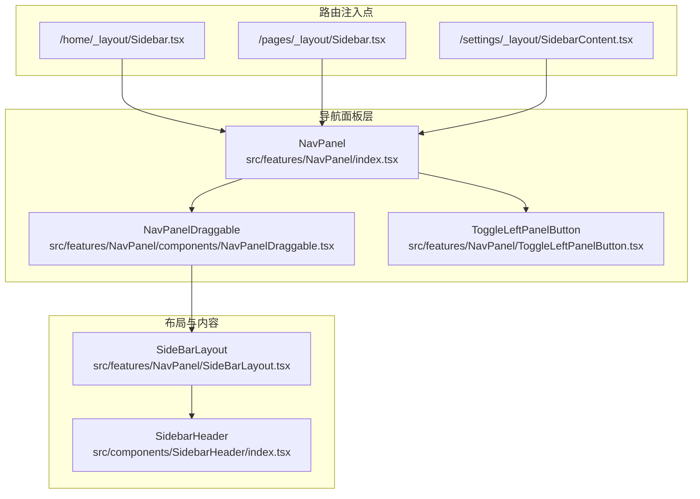
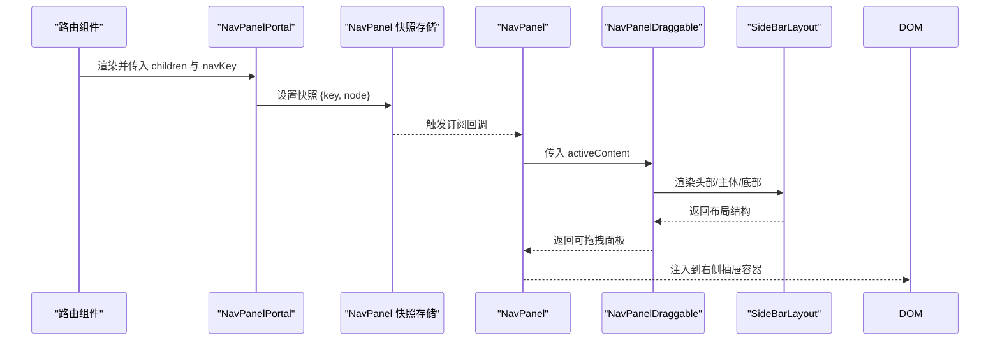
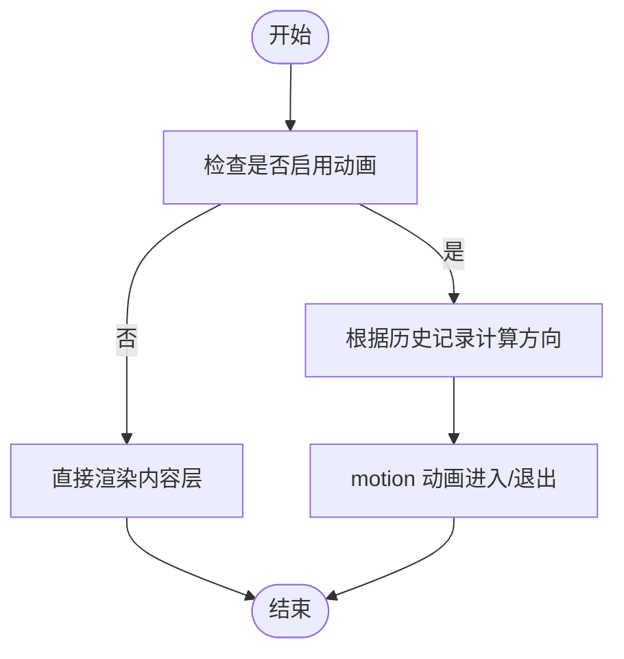
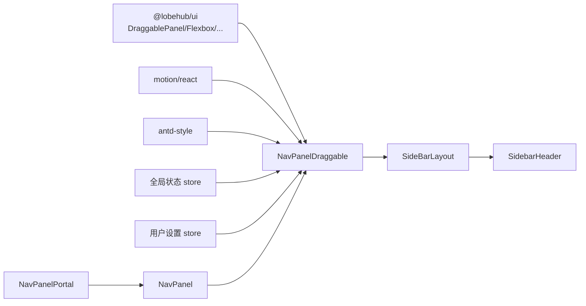
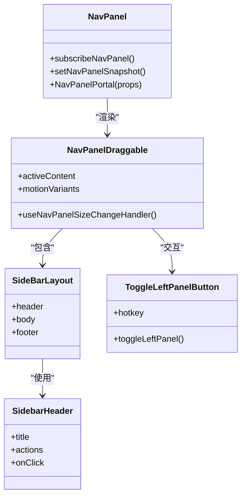

# 导航面板组件

<cite>
**本文档引用的文件**
- [src/features/NavPanel/index.tsx](file://src/features/NavPanel/index.tsx)
- [src/features/NavPanel/SideBarLayout.tsx](file://src/features/NavPanel/SideBarLayout.tsx)
- [src/features/NavPanel/components/NavPanelDraggable.tsx](file://src/features/NavPanel/components/NavPanelDraggable.tsx)
- [src/features/NavPanel/hooks/useNavPanel.ts](file://src/features/NavPanel/hooks/useNavPanel.ts)
- [src/features/NavPanel/ToggleLeftPanelButton.tsx](file://src/features/NavPanel/ToggleLeftPanelButton.tsx)
- [src/components/SidebarHeader/index.tsx](file://src/components/SidebarHeader/index.tsx)
- [src/routes/(main)/home/_layout/Sidebar.tsx](file://src/routes/(main)/home/_layout/Sidebar.tsx)
- [src/routes/(main)/home/_layout/SidebarContent.tsx](file://src/routes/(main)/home/_layout/SidebarContent.tsx)
- [src/features/Pages/PageLayout/Sidebar.tsx](file://src/features/Pages/PageLayout/Sidebar.tsx)
- [src/routes/(main)/settings/_layout/SidebarContent.tsx](file://src/routes/(main)/settings/_layout/SidebarContent.tsx)
</cite>

## 目录

1. [简介](#简介)
2. [项目结构](#项目结构)
3. [核心组件](#核心组件)
4. [架构总览](#架构总览)
5. [组件详解](#组件详解)
6. [依赖关系分析](#依赖关系分析)
7. [性能考量](#性能考量)
8. [故障排查指南](#故障排查指南)
9. [结论](#结论)
10. [附录](#附录)

## 简介

本文件系统性梳理 LobeHub 项目中的导航面板体系，重点覆盖以下能力：

- 左侧导航面板（NavPanel）：可拖拽、带过渡动画的内容容器，支持多路由场景下的内容切换与状态同步。
- 右侧面板（右侧抽屉）：用于承载右侧扩展内容或对话详情等。
- 导航头部组件（SidebarHeader）：统一的标题区与操作区布局，支持点击与动作按钮。
- 侧边栏布局组件（SideBarLayout）：封装头部、主体滚动区域与底部的通用布局结构。
- 路由集成与面包屑：通过 Portal 模式在不同路由下注入对应侧边栏内容。
- 动画与交互：基于 motion 的进入 / 退出动画、拖拽尺寸调整、悬停显示控制元素等。
- 无障碍与热键：提供可访问性提示与快捷键绑定。

## 项目结构

导航相关代码集中在 features/NavPanel 与 routes 下的布局文件中，并通过 Portal 将具体侧边栏内容注入到 NavPanel 中。

图表来源

- [src/features/NavPanel/index.tsx](file://src/features/NavPanel/index.tsx#L1-L80)
- [src/features/NavPanel/components/NavPanelDraggable.tsx](file://src/features/NavPanel/components/NavPanelDraggable.tsx#L1-L251)
- [src/features/NavPanel/SideBarLayout.tsx](file://src/features/NavPanel/SideBarLayout.tsx#L1-L29)
- [src/components/SidebarHeader/index.tsx](file://src/components/SidebarHeader/index.tsx#L1-L43)
- [src/routes/(main)/home/\_layout/Sidebar.tsx](<file://src/routes/(main)/home/_layout/Sidebar.tsx#L1-L15>)
- [src/features/Pages/PageLayout/Sidebar.tsx](file://src/features/Pages/PageLayout/Sidebar.tsx#L1-L21)
- [src/routes/(main)/settings/\_layout/SidebarContent.tsx](<file://src/routes/(main)/settings/_layout/SidebarContent.tsx#L1-L12>)

章节来源

- [src/features/NavPanel/index.tsx](file://src/features/NavPanel/index.tsx#L1-L80)
- [src/features/NavPanel/SideBarLayout.tsx](file://src/features/NavPanel/SideBarLayout.tsx#L1-L29)
- [src/components/SidebarHeader/index.tsx](file://src/components/SidebarHeader/index.tsx#L1-L43)
- [src/routes/(main)/home/\_layout/Sidebar.tsx](<file://src/routes/(main)/home/_layout/Sidebar.tsx#L1-L15>)
- [src/features/Pages/PageLayout/Sidebar.tsx](file://src/features/Pages/PageLayout/Sidebar.tsx#L1-L21)
- [src/routes/(main)/settings/\_layout/SidebarContent.tsx](<file://src/routes/(main)/settings/_layout/SidebarContent.tsx#L1-L12>)

## 核心组件

- NavPanel：全局导航面板容器，维护当前激活内容快照并通过 Portal 注入到 DOM 抽屉节点中；支持默认回退到首页侧边栏。
- NavPanelDraggable：可拖拽的左侧面板，负责内容层叠、动画过渡、尺寸调整与样式适配（含 macOS 透明背景处理）。
- SideBarLayout：侧边栏通用布局，包含头部、可滚动主体与底部，统一骨架屏与加载占位。
- SidebarHeader：侧边栏头部组件，支持标题与右侧动作区，具备点击回调与对齐布局。
- ToggleLeftPanelButton：左侧面板开关按钮，支持热键提示与图标切换。
- useNavPanelSizeChangeHandler：尺寸变更回调钩子，将宽度写回全局状态并持久化偏好设置。
- 路由注入：各路由通过 NavPanelPortal 将对应 SidebarContent 注入到 NavPanel。

章节来源

- [src/features/NavPanel/index.tsx](file://src/features/NavPanel/index.tsx#L1-L80)
- [src/features/NavPanel/components/NavPanelDraggable.tsx](file://src/features/NavPanel/components/NavPanelDraggable.tsx#L1-L251)
- [src/features/NavPanel/SideBarLayout.tsx](file://src/features/NavPanel/SideBarLayout.tsx#L1-L29)
- [src/components/SidebarHeader/index.tsx](file://src/components/SidebarHeader/index.tsx#L1-L43)
- [src/features/NavPanel/ToggleLeftPanelButton.tsx](file://src/features/NavPanel/ToggleLeftPanelButton.tsx#L1-L54)
- [src/features/NavPanel/hooks/useNavPanel.ts](file://src/features/NavPanel/hooks/useNavPanel.ts#L1-L27)

## 架构总览

NavPanel 采用 “订阅 - 快照” 模型管理当前激活内容，通过 useSyncExternalStore 订阅并在渲染时读取最新快照。内容通过 NavPanelPortal 注入，NavPanelDraggable 负责渲染与动画，SideBarLayout 提供统一布局。

图表来源

- [src/features/NavPanel/index.tsx](file://src/features/NavPanel/index.tsx#L31-L55)
- [src/features/NavPanel/index.tsx](file://src/features/NavPanel/index.tsx#L67-L79)
- [src/features/NavPanel/components/NavPanelDraggable.tsx](file://src/features/NavPanel/components/NavPanelDraggable.tsx#L153-L250)
- [src/features/NavPanel/SideBarLayout.tsx](file://src/features/NavPanel/SideBarLayout.tsx#L14-L26)

## 组件详解

### NavPanel（导航面板容器）

- 职责
  - 维护当前激活内容的快照（key 与 node），并提供订阅接口。
  - 当无内容时回退到首页侧边栏。
  - 在 DOM 中预留右侧抽屉容器，用于承载动态注入的面板内容。
- 关键点
  - 使用 useSyncExternalStore 保证与外部状态一致。
  - NavPanelPortal 负责设置快照并触发重渲染。
  - 支持通过 navKey 触发过渡动画方向计算。

章节来源

- [src/features/NavPanel/index.tsx](file://src/features/NavPanel/index.tsx#L1-L80)

### NavPanelDraggable（可拖拽面板）

- 职责
  - 基于 DraggablePanel 实现左侧可拖拽面板，限定最小 / 最大宽度。
  - 根据历史记录推断动画方向，实现进入 / 退出的滑动过渡。
  - 集成 motion 动画与 Freeze 冻结机制，确保过渡期间内容稳定。
  - 根据平台（桌面端、macOS）调整背景与交互细节。
- 动画与交互
  - 进入 / 退出使用不同偏移量与缓动曲线，方向由历史记录决定。
  - 悬停时动态显示 / 隐藏控制元素（如开关按钮、用户下拉图标）。
- 尺寸持久化
  - 通过 useNavPanelSizeChangeHandler 将宽度写回全局状态，避免无效更新。

图表来源

- [src/features/NavPanel/components/NavPanelDraggable.tsx](file://src/features/NavPanel/components/NavPanelDraggable.tsx#L27-L48)
- [src/features/NavPanel/components/NavPanelDraggable.tsx](file://src/features/NavPanel/components/NavPanelDraggable.tsx#L182-L207)

章节来源

- [src/features/NavPanel/components/NavPanelDraggable.tsx](file://src/features/NavPanel/components/NavPanelDraggable.tsx#L1-L251)
- [src/features/NavPanel/hooks/useNavPanel.ts](file://src/features/NavPanel/hooks/useNavPanel.ts#L1-L27)

### SideBarLayout（侧边栏布局）

- 职责
  - 统一布局：头部、可滚动主体、底部。
  - 头部与主体支持 Suspense 骨架屏占位，提升加载体验。
  - 主体包裹 TooltipGroup 以优化工具提示行为。
- 与 Footer 的关系
  - 若未显式传入 footer，则默认渲染 Footer 组件。

章节来源

- [src/features/NavPanel/SideBarLayout.tsx](file://src/features/NavPanel/SideBarLayout.tsx#L1-L29)

### SidebarHeader（导航头部）

- 职责
  - 提供标题区与右侧动作区的水平布局。
  - 支持点击回调、对齐与间距配置。
- 设计要点
  - 使用 Flexbox 实现两端对齐与居中对齐。
  - 通过静态样式提升层级与视觉一致性。

章节来源

- [src/components/SidebarHeader/index.tsx](file://src/components/SidebarHeader/index.tsx#L1-L43)

### ToggleLeftPanelButton（左侧面板开关按钮）

- 职责
  - 切换左侧面板展开 / 收起状态。
  - 支持热键提示与图标切换。
- 与全局状态联动
  - 通过全局 store 的 toggleLeftPanel 切换状态。
  - 读取用户设置中的热键配置。

章节来源

- [src/features/NavPanel/ToggleLeftPanelButton.tsx](file://src/features/NavPanel/ToggleLeftPanelButton.tsx#L1-L54)

### 路由集成与内容注入

- 入口
  - 各路由通过 NavPanelPortal 将对应 SidebarContent 注入到 NavPanel。
  - 默认回退到首页侧边栏（当无 Portal 内容时）。
- 示例
  - /home/\_layout/Sidebar.tsx：注入 Home 侧边栏内容。
  - /pages/\_layout/Sidebar.tsx：注入 Page 侧边栏内容。
  - /settings/\_layout/SidebarContent.tsx：注入 Settings 侧边栏内容。

章节来源

- [src/routes/(main)/home/\_layout/Sidebar.tsx](<file://src/routes/(main)/home/_layout/Sidebar.tsx#L1-L15>)
- [src/features/Pages/PageLayout/Sidebar.tsx](file://src/features/Pages/PageLayout/Sidebar.tsx#L1-L21)
- [src/routes/(main)/settings/\_layout/SidebarContent.tsx](<file://src/routes/(main)/settings/_layout/SidebarContent.tsx#L1-L12>)
- [src/features/NavPanel/index.tsx](file://src/features/NavPanel/index.tsx#L38-L39)

## 依赖关系分析

- 组件耦合
  - NavPanel 与 NavPanelPortal 通过快照共享实现低耦合解耦。
  - NavPanelDraggable 依赖全局状态与用户设置，但对外仅暴露 activeContent。
  - SideBarLayout 作为布局组件，不直接依赖业务逻辑，便于复用。
- 外部依赖
  - @lobehub/ui：提供 DraggablePanel、Flexbox、ScrollShadow、TooltipGroup 等基础能力。
  - motion/react：提供 AnimatePresence 与动画变体。
  - antd-style：提供静态样式与 CSS 变量。
- 潜在循环依赖
  - 通过 Portal 注入避免了组件间直接 import 循环，保持清晰的单向数据流。

图表来源

- [src/features/NavPanel/components/NavPanelDraggable.tsx](file://src/features/NavPanel/components/NavPanelDraggable.tsx#L1-L251)
- [src/features/NavPanel/SideBarLayout.tsx](file://src/features/NavPanel/SideBarLayout.tsx#L1-L29)
- [src/components/SidebarHeader/index.tsx](file://src/components/SidebarHeader/index.tsx#L1-L43)
- [src/features/NavPanel/index.tsx](file://src/features/NavPanel/index.tsx#L1-L80)

章节来源

- [src/features/NavPanel/components/NavPanelDraggable.tsx](file://src/features/NavPanel/components/NavPanelDraggable.tsx#L1-L251)
- [src/features/NavPanel/SideBarLayout.tsx](file://src/features/NavPanel/SideBarLayout.tsx#L1-L29)
- [src/components/SidebarHeader/index.tsx](file://src/components/SidebarHeader/index.tsx#L1-L43)
- [src/features/NavPanel/index.tsx](file://src/features/NavPanel/index.tsx#L1-L80)

## 性能考量

- 动画性能
  - 使用 motion 的 will-change 与缓动曲线，减少重绘与卡顿。
  - 通过 Freeze 冻结退出中的内容，避免布局抖动。
- 渲染优化
  - Suspense 骨架屏减少首屏等待感。
  - useSyncExternalStore 降低不必要的重渲染。
- 尺寸持久化
  - 仅在宽度变化超过阈值时写回全局状态，避免频繁更新。

章节来源

- [src/features/NavPanel/components/NavPanelDraggable.tsx](file://src/features/NavPanel/components/NavPanelDraggable.tsx#L72-L128)
- [src/features/NavPanel/hooks/useNavPanel.ts](file://src/features/NavPanel/hooks/useNavPanel.ts#L10-L26)

## 故障排查指南

- 内容未显示
  - 检查是否存在 NavPanelPortal 注入内容；若无则回退到首页侧边栏。
  - 确认 navKey 是否正确传递，避免 key 不变导致无法触发动画。
- 动画异常
  - 检查用户设置中的动画模式是否禁用。
  - 确认历史记录方向计算是否被意外重置。
- 尺寸不生效
  - 确认拖拽后宽度是否超过最小阈值。
  - 检查全局状态中 leftPanelWidth 是否被其他逻辑覆盖。
- 平台差异
  - macOS 桌面端背景透明需确认平台检测逻辑与样式条件。

章节来源

- [src/features/NavPanel/index.tsx](file://src/features/NavPanel/index.tsx#L38-L39)
- [src/features/NavPanel/components/NavPanelDraggable.tsx](file://src/features/NavPanel/components/NavPanelDraggable.tsx#L25-L48)
- [src/features/NavPanel/hooks/useNavPanel.ts](file://src/features/NavPanel/hooks/useNavPanel.ts#L13-L20)

## 结论

该导航体系通过 “容器 + 布局 + 注入” 的分层设计，实现了高内聚、低耦合的可扩展导航方案。NavPanel 以快照驱动内容切换，NavPanelDraggable 提供流畅的交互与动画，SideBarLayout 统一了布局结构，配合路由级的 Portal 注入，满足多场景下的灵活导航需求。同时，尺寸持久化、热键与无障碍提示进一步提升了可用性与可访问性。

## 附录

- 使用示例（路径指引）
  - 在任意路由中注入侧边栏内容：参考 [src/routes/(main)/home/\_layout/Sidebar.tsx](<file://src/routes/(main)/home/_layout/Sidebar.tsx#L1-L15>)
  - 定义侧边栏头部与主体：参考 [src/routes/(main)/home/\_layout/SidebarContent.tsx](<file://src/routes/(main)/home/_layout/SidebarContent.tsx#L1-L12>)
  - 页面级侧边栏注入：参考 [src/features/Pages/PageLayout/Sidebar.tsx](file://src/features/Pages/PageLayout/Sidebar.tsx#L1-L21)
  - 设置页侧边栏注入：参考 [src/routes/(main)/settings/\_layout/SidebarContent.tsx](<file://src/routes/(main)/settings/_layout/SidebarContent.tsx#L1-L12>)
- 组件类图（代码级）

图表来源

- [src/features/NavPanel/index.tsx](file://src/features/NavPanel/index.tsx#L1-L80)
- [src/features/NavPanel/components/NavPanelDraggable.tsx](file://src/features/NavPanel/components/NavPanelDraggable.tsx#L1-L251)
- [src/features/NavPanel/SideBarLayout.tsx](file://src/features/NavPanel/SideBarLayout.tsx#L1-L29)
- [src/components/SidebarHeader/index.tsx](file://src/components/SidebarHeader/index.tsx#L1-L43)
- [src/features/NavPanel/ToggleLeftPanelButton.tsx](file://src/features/NavPanel/ToggleLeftPanelButton.tsx#L1-L54)
