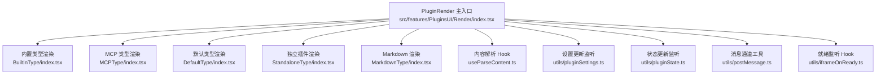
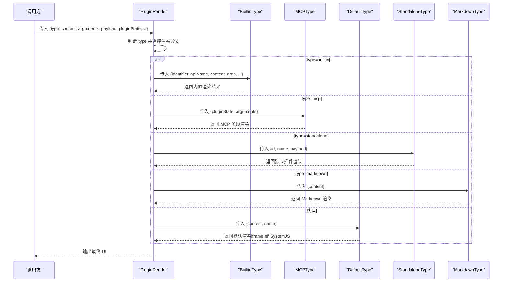
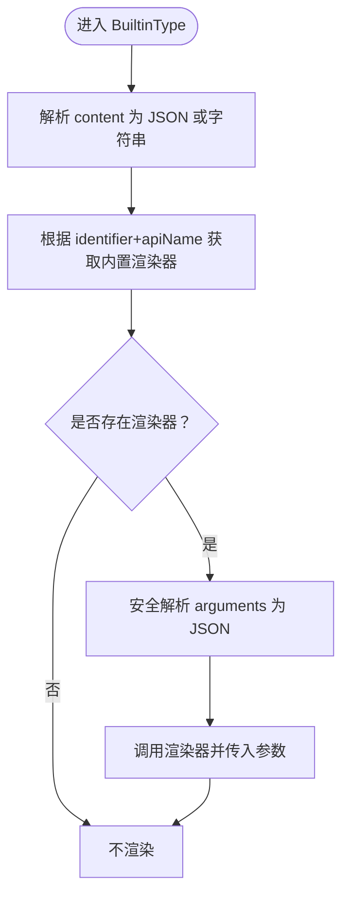
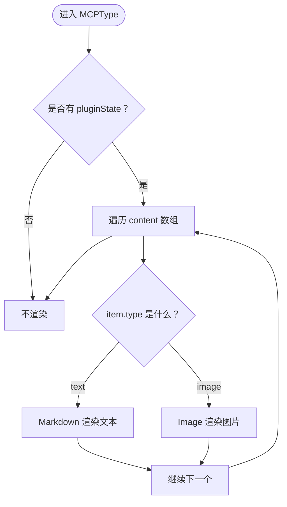
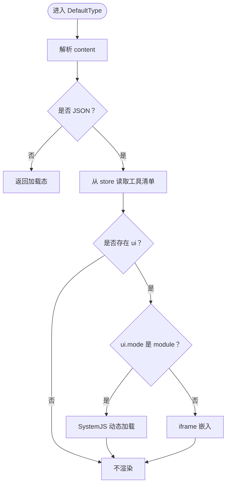
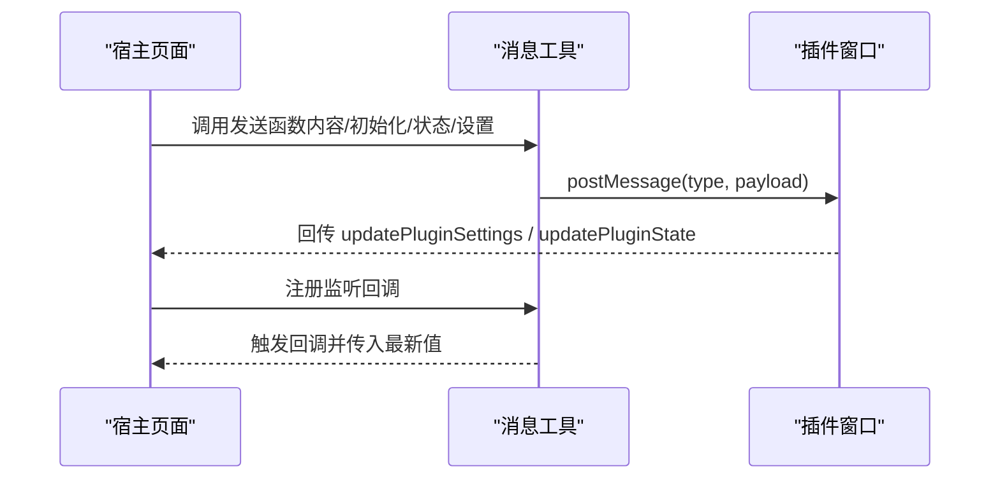
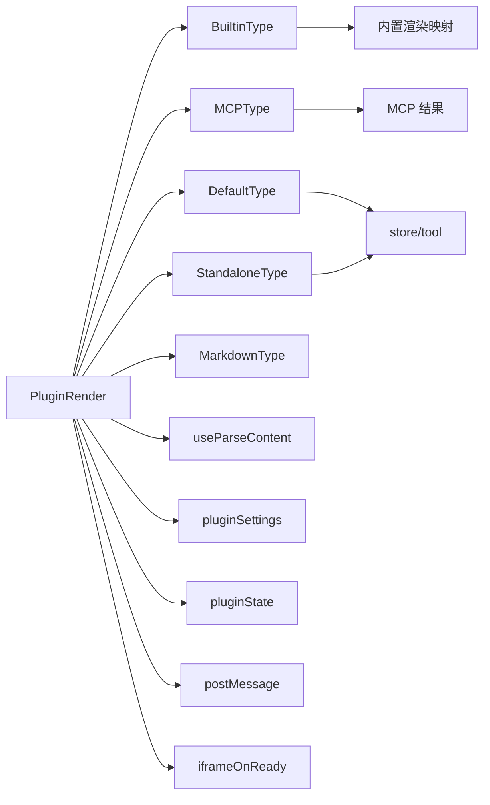

# 插件 UI 渲染

<cite>
**本文引用的文件**
- [src/features/PluginsUI/Render/index.tsx](file://src/features/PluginsUI/Render/index.tsx)
- [src/features/PluginsUI/Render/BuiltinType/index.tsx](file://src/features/PluginsUI/Render/BuiltinType/index.tsx)
- [src/features/PluginsUI/Render/MCPType/index.tsx](file://src/features/PluginsUI/Render/MCPType/index.tsx)
- [src/features/PluginsUI/Render/DefaultType/index.tsx](file://src/features/PluginsUI/Render/DefaultType/index.tsx)
- [src/features/PluginsUI/Render/StandaloneType/index.tsx](file://src/features/PluginsUI/Render/StandaloneType/index.tsx)
- [src/features/PluginsUI/Render/MarkdownType/index.tsx](file://src/features/PluginsUI/Render/MarkdownType/index.tsx)
- [src/features/PluginsUI/Render/useParseContent.ts](file://src/features/PluginsUI/Render/useParseContent.ts)
- [src/features/PluginsUI/Render/utils/pluginSettings.ts](file://src/features/PluginsUI/Render/utils/pluginSettings.ts)
- [src/features/PluginsUI/Render/utils/pluginState.ts](file://src/features/PluginsUI/Render/utils/pluginState.ts)
- [src/features/PluginsUI/Render/utils/postMessage.ts](file://src/features/PluginsUI/Render/utils/postMessage.ts)
- [src/features/PluginsUI/Render/utils/iframeOnReady.ts](file://src/features/PluginsUI/Render/utils/iframeOnReady.ts)
- [src/features/PluginsUI/Render/DefaultType/IFrameRender.tsx](file://src/features/PluginsUI/Render/DefaultType/IFrameRender.tsx)
- [src/features/PluginsUI/Render/DefaultType/SystemJsRender.tsx](file://src/features/PluginsUI/Render/DefaultType/SystemJsRender.tsx)
- [src/features/PluginsUI/Render/DefaultType/Loading.tsx](file://src/features/PluginsUI/Render/DefaultType/Loading.tsx)
- [src/features/PluginsUI/Render/Loading.tsx](file://src/features/PluginsUI/Render/Loading.tsx)
- [src/features/PluginsUI/Render/MarkdownType/Loading.tsx](file://src/features/PluginsUI/Render/MarkdownType/Loading.tsx)
- [src/features/PluginsUI/Render/BuiltinType/Loading.tsx](file://src/features/PluginsUI/Render/BuiltinType/Loading.tsx)
- [src/features/PluginsUI/Render/MCPType/Loading.tsx](file://src/features/PluginsUI/Render/MCPType/Loading.tsx)
- [src/features/PluginsUI/Render/StandaloneType/Loading.tsx](file://src/features/PluginsUI/Render/StandaloneType/Loading.tsx)
- [src/features/PluginsUI/Render/MarkdownType/Markdown.tsx](file://src/features/PluginsUI/Render/MarkdownType/Markdown.tsx)
- [src/features/PluginsUI/Render/MarkdownType/Image.tsx](file://src/features/PluginsUI/Render/MarkdownType/Image.tsx)
- [src/features/PluginsUI/Render/MarkdownType/Arguments.tsx](file://src/features/PluginsUI/Render/MarkdownType/Arguments.tsx)
- [src/features/PluginsUI/Render/BuiltinType/BuiltinRender.tsx](file://src/features/PluginsUI/Render/BuiltinType/BuiltinRender.tsx)
- [src/features/PluginsUI/Render/BuiltinType/BuiltinRenderMap.tsx](file://src/features/PluginsUI/Render/BuiltinType/BuiltinRenderMap.tsx)
- [src/features/PluginsUI/Render/BuiltinType/BuiltinRenderList.tsx](file://src/features/PluginsUI/Render/BuiltinType/BuiltinRenderList.tsx)
- [src/features/PluginsUI/Render/BuiltinType/BuiltinRenderDetail.tsx](file://src/features/PluginsUI/Render/BuiltinType/BuiltinRenderDetail.tsx)
- [src/features/PluginsUI/Render/BuiltinType/BuiltinRenderForm.tsx](file://src/features/PluginsUI/Render/BuiltinType/BuiltinRenderForm.tsx)
- [src/features/PluginsUI/Render/BuiltinType/BuiltinRenderTable.tsx](file://src/features/PluginsUI/Render/BuiltinType/BuiltinRenderTable.tsx)
- [src/features/PluginsUI/Render/BuiltinType/BuiltinRenderChart.tsx](file://src/features/PluginsUI/Render/BuiltinType/BuiltinRenderChart.tsx)
- [src/features/PluginsUI/Render/BuiltinType/BuiltinRenderMap.tsx](file://src/features/PluginsUI/Render/BuiltinType/BuiltinRenderMap.tsx)
- [src/features/PluginsUI/Render/BuiltinType/BuiltinRenderList.tsx](file://src/features/PluginsUI/Render/BuiltinType/BuiltinRenderList.tsx)
- [src/features/PluginsUI/Render/BuiltinType/BuiltinRenderDetail.tsx](file://src/features/PluginsUI/Render/BuiltinType/BuiltinRenderDetail.tsx)
- [src/features/PluginsUI/Render/BuiltinType/BuiltinRenderForm.tsx](file://src/features/PluginsUI/Render/BuiltinType/BuiltinRenderForm.tsx)
- [src/features/PluginsUI/Render/BuiltinType/BuiltinRenderTable.tsx](file://src/features/PluginsUI/Render/BuiltinType/BuiltinRenderTable.tsx)
- [src/features/PluginsUI/Render/BuiltinType/BuiltinRenderChart.tsx](file://src/features/PluginsUI/Render/BuiltinType/BuiltinRenderChart.tsx)
- [src/features/PluginsUI/Render/BuiltinType/BuiltinRenderMap.tsx](file://src/features/PluginsUI/Render/BuiltinType/BuiltinRenderMap.tsx)
- [src/features/PluginsUI/Render/BuiltinType/BuiltinRenderList.tsx](file://src/features/PluginsUI/Render/BuiltinType/BuiltinRenderList.tsx)
- [src/features/PluginsUI/Render/BuiltinType/BuiltinRenderDetail.tsx](file://src/features/PluginsUI/Render/BuiltinType/BuiltinRenderDetail.tsx)
- [src/features/PluginsUI/Render/BuiltinType/BuiltinRenderForm.tsx](file://src/features/PluginsUI/Render/BuiltinType/BuiltinRenderForm.tsx)
- [src/features/PluginsUI/Render/BuiltinType/BuiltinRenderTable.tsx](file://src/features/PluginsUI/Render/BuiltinType/BuiltinRenderTable.tsx)
- [src/features/PluginsUI/Render/BuiltinType/BuiltinRenderChart.tsx](file://src/features/PluginsUI/Render/BuiltinType/BuiltinRenderChart.tsx)
- [src/features/PluginsUI/Render/BuiltinType/BuiltinRenderMap.tsx](file://src/features/PluginsUI/Render/BuiltinType/BuiltinRenderMap.tsx)
- [src/features/PluginsUI/Render/BuiltinType/BuiltinRenderList.tsx](file://src/features/PluginsUI/Render/BuiltinType/BuiltinRenderList.tsx)
- [src/features/PluginsUI/Render/BuiltinType/BuiltinRenderDetail.tsx](file://src/features/PluginsUI/Render/BuiltinType/BuiltinRenderDetail.tsx)
- [src/features/PluginsUI/Render/BuiltinType/BuiltinRenderForm.tsx](file://src/features/PluginsUI/Render/BuiltinType/BuiltinRenderForm.tsx)
- [src/features/PluginsUI/Render/BuiltinType/BuiltinRenderTable.tsx](file://src/features/PluginsUI/Render/BuiltinType/BuiltinRenderTable.tsx)
- [src/features/PluginsUI/Render/BuiltinType/BuiltinRenderChart.tsx](file://src/features/PluginsUI/Render/BuiltinType/BuiltinRenderChart.tsx)
- [src/features/PluginsUI/Render/BuiltinType/BuiltinRenderMap.tsx](file://src/features/PluginsUI/Render/BuiltinType/BuiltinRenderMap.tsx)
- [src/features/PluginsUI/Render/BuiltinType/BuiltinRenderList.tsx](file://src/features/PluginsUI/Render/BuiltinType/BuiltinRenderList.tsx)
- [src/features/PluginsUI/Render/BuiltinType/BuiltinRenderDetail.tsx](file://src/features/PluginsUI/Render/BuiltinType/BuiltinRenderDetail.tsx)
- [src/features/PluginsUI/Render/BuiltinType/BuiltinRenderForm.tsx](file://src/features/PluginsUI/Render/BuiltinType/BuiltinRenderForm.tsx)
- [src/features/PluginsUI/Render/BuiltinType/BuiltinRenderTable.tsx](file://src/features/PluginsUI/Render/BuiltinType/BuiltinRenderTable.tsx)
- [src/features/PluginsUI/Render/BuiltinType/BuiltinRenderChart.tsx](file://src/features/PluginsUI/Render/BuiltinType/BuiltinRenderChart.tsx)
- [src/features/PluginsUI/Render/BuiltinType/BuiltinRenderMap.tsx](file://src/features/PluginsUI/Render/BuiltinType/BuiltinRenderMap.tsx)
- [src/features/PluginsUI/Render/BuiltinType/BuiltinRenderList.tsx](file://src/features/PluginsUI/Render/BuiltinType/BuiltinRenderList.tsx)
- [src/features/PluginsUI/Render/BuiltinType/BuiltinRenderDetail.tsx](file://src/features/PluginsUI/Render/BuiltinType/BuiltinRenderDetail.tsx)
- [src/features/PluginsUI/Render/BuiltinType/BuiltinRenderForm.tsx](file://src/features/PluginsUI/Render/BuiltinType/BuiltinRenderForm.tsx)
- [src/features/PluginsUI/Render/BuiltinType/BuiltinRenderTable.tsx](file://src/features/PluginsUI/Render/BuiltinType/BuiltinRenderTable.tsx)
- [src/features/PluginsUI/Render/BuiltinType/BuiltinRenderChart.tsx](file://src/features/PluginsUI/Render/BuiltinType/BuiltinRenderChart.tsx)
- [src/features/PluginsUI/Render/BuiltinType/BuiltinRenderMap.tsx](file://src/features/PluginsUI/Render/BuiltinType/BuiltinRenderMap.tsx)
- [src/features/PluginsUI/Render/BuiltinType/BuiltinRenderList.tsx](file://src/features/PluginsUI/Render/BuiltinType/BuiltinRenderList.tsx)
- [src/features/PluginsUI/Render/BuiltinType/BuiltinRenderDetail.tsx](file://src/features/PluginsUI/Render/BuiltinType/BuiltinRenderDetail.tsx)
- [src/features/PluginsUI/Render/BuiltinType/BuiltinRenderForm.tsx](file://src/features/PluginsUI/Render/BuiltinType/BuiltinRenderForm.tsx)
- [src/features/PluginsUI/Render/BuiltinType/BuiltinRenderTable.ts......
</cite>

## 目录
1. [简介](#简介)
2. [项目结构](#项目结构)
3. [核心组件](#核心组件)
4. [架构总览](#架构总览)
5. [详细组件分析](#详细组件分析)
6. [依赖关系分析](#依赖关系分析)
7. [性能考量](#性能考量)
8. [故障排查指南](#故障排查指南)
9. [结论](#结论)
10. [附录](#附录)

## 简介
本文件系统性梳理 LobeHub 插件 UI 渲染体系，覆盖内置类型渲染、MCP 类型渲染、默认类型渲染、独立插件（Standalone）渲染与 Markdown 渲染等策略。重点阐述渲染组件如何依据插件类型与配置动态生成用户界面，实现插件内容的可视化展示与交互；并给出渲染优化、缓存策略、错误边界、消息通道通信、主题适配等设计要点与最佳实践。

## 项目结构
插件 UI 渲染位于前端特性模块中，采用“按类型分层”的组织方式：主入口负责路由分发，各类型子组件负责具体渲染逻辑，工具模块负责消息通道与内容解析，加载态与错误边界分别在各自类型或公共位置实现。

图表来源
- [src/features/PluginsUI/Render/index.tsx](file://src/features/PluginsUI/Render/index.tsx#L1-L108)
- [src/features/PluginsUI/Render/BuiltinType/index.tsx](file://src/features/PluginsUI/Render/BuiltinType/index.tsx#L1-L60)
- [src/features/PluginsUI/Render/MCPType/index.tsx](file://src/features/PluginsUI/Render/MCPType/index.tsx#L1-L75)
- [src/features/PluginsUI/Render/DefaultType/index.tsx](file://src/features/PluginsUI/Render/DefaultType/index.tsx#L1-L54)
- [src/features/PluginsUI/Render/StandaloneType/index.tsx](file://src/features/PluginsUI/Render/StandaloneType/index.tsx#L1-L38)
- [src/features/PluginsUI/Render/MarkdownType/index.tsx](file://src/features/PluginsUI/Render/MarkdownType/index.tsx#L1-L26)
- [src/features/PluginsUI/Render/useParseContent.ts](file://src/features/PluginsUI/Render/useParseContent.ts#L1-L16)
- [src/features/PluginsUI/Render/utils/pluginSettings.ts](file://src/features/PluginsUI/Render/utils/pluginSettings.ts#L1-L18)
- [src/features/PluginsUI/Render/utils/pluginState.ts](file://src/features/PluginsUI/Render/utils/pluginState.ts#L1-L21)
- [src/features/PluginsUI/Render/utils/postMessage.ts](file://src/features/PluginsUI/Render/utils/postMessage.ts#L1-L29)
- [src/features/PluginsUI/Render/utils/iframeOnReady.ts](file://src/features/PluginsUI/Render/utils/iframeOnReady.ts#L1-L25)

章节来源
- [src/features/PluginsUI/Render/index.tsx](file://src/features/PluginsUI/Render/index.tsx#L1-L108)

## 核心组件
- 主渲染器 PluginRender：根据插件类型选择对应渲染分支，并包裹错误边界以提升稳定性。
- 内置类型 BuiltinType：基于标识符与 API 名称解析内置渲染器，支持参数与内容传递。
- MCP 类型 MCPType：针对 MCP 返回的内容进行多段渲染（文本、图片），并可显示调用参数。
- 默认类型 DefaultType：从工具清单读取 UI 配置，支持 iframe 与 SystemJS 模块两种模式。
- 独立插件 StandaloneType：用于独立运行的插件窗口，避免重复渲染临时 ID。
- MarkdownType：将纯文本内容渲染为 Markdown，支持字体大小等主题适配。
- 工具模块：消息通道（postMessage）、设置与状态监听、内容解析 Hook。

章节来源
- [src/features/PluginsUI/Render/index.tsx](file://src/features/PluginsUI/Render/index.tsx#L13-L108)
- [src/features/PluginsUI/Render/BuiltinType/index.tsx](file://src/features/PluginsUI/Render/BuiltinType/index.tsx#L7-L60)
- [src/features/PluginsUI/Render/MCPType/index.tsx](file://src/features/PluginsUI/Render/MCPType/index.tsx#L7-L75)
- [src/features/PluginsUI/Render/DefaultType/index.tsx](file://src/features/PluginsUI/Render/DefaultType/index.tsx#L14-L54)
- [src/features/PluginsUI/Render/StandaloneType/index.tsx](file://src/features/PluginsUI/Render/StandaloneType/index.tsx#L9-L38)
- [src/features/PluginsUI/Render/MarkdownType/index.tsx](file://src/features/PluginsUI/Render/MarkdownType/index.tsx#L9-L26)
- [src/features/PluginsUI/Render/useParseContent.ts](file://src/features/PluginsUI/Render/useParseContent.ts#L3-L16)
- [src/features/PluginsUI/Render/utils/pluginSettings.ts](file://src/features/PluginsUI/Render/utils/pluginSettings.ts#L4-L18)
- [src/features/PluginsUI/Render/utils/pluginState.ts](file://src/features/PluginsUI/Render/utils/pluginState.ts#L4-L21)
- [src/features/PluginsUI/Render/utils/postMessage.ts](file://src/features/PluginsUI/Render/utils/postMessage.ts#L3-L29)

## 架构总览
渲染系统通过主入口统一调度，结合工具清单与消息通道实现“声明式渲染 + 动态交互”。其关键流程如下：

图表来源
- [src/features/PluginsUI/Render/index.tsx](file://src/features/PluginsUI/Render/index.tsx#L44-L94)
- [src/features/PluginsUI/Render/BuiltinType/index.tsx](file://src/features/PluginsUI/Render/BuiltinType/index.tsx#L25-L56)
- [src/features/PluginsUI/Render/MCPType/index.tsx](file://src/features/PluginsUI/Render/MCPType/index.tsx#L25-L72)
- [src/features/PluginsUI/Render/DefaultType/index.tsx](file://src/features/PluginsUI/Render/DefaultType/index.tsx#L20-L51)
- [src/features/PluginsUI/Render/StandaloneType/index.tsx](file://src/features/PluginsUI/Render/StandaloneType/index.tsx#L15-L35)
- [src/features/PluginsUI/Render/MarkdownType/index.tsx](file://src/features/PluginsUI/Render/MarkdownType/index.tsx#L14-L23)

## 详细组件分析

### 主渲染器 PluginRender
- 职责：根据插件类型分派到对应渲染器；包裹错误边界；稳定 key 防止重渲染导致边界重置。
- 关键点：
  - 分支选择：standalone、builtin、mcp、markdown、default。
  - 错误边界：以 identifier、apiName、toolCallId 或 messageId 组合作为 key，确保稳定性。
  - 参数透传：content、arguments、payload、pluginState、messageId、toolCallId、identifier、type。

章节来源
- [src/features/PluginsUI/Render/index.tsx](file://src/features/PluginsUI/Render/index.tsx#L32-L105)

### 内置类型渲染 BuiltinType
- 职责：基于标识符与 API 名称获取内置渲染器，解析 content 与 arguments，传递给具体渲染组件。
- 关键点：
  - 使用内置渲染映射函数获取渲染器。
  - 安全解析 arguments 为 JSON 对象。
  - 将 content 解析为 JSON 或原始字符串，交由渲染器消费。

图表来源
- [src/features/PluginsUI/Render/BuiltinType/index.tsx](file://src/features/PluginsUI/Render/BuiltinType/index.tsx#L25-L56)
- [src/features/PluginsUI/Render/useParseContent.ts](file://src/features/PluginsUI/Render/useParseContent.ts#L3-L16)

章节来源
- [src/features/PluginsUI/Render/BuiltinType/index.tsx](file://src/features/PluginsUI/Render/BuiltinType/index.tsx#L25-L56)
- [src/features/PluginsUI/Render/useParseContent.ts](file://src/features/PluginsUI/Render/useParseContent.ts#L3-L16)

### MCP 类型渲染 MCPType
- 职责：渲染 MCP 返回的多段内容（文本、图片），并可选显示调用参数。
- 关键点：
  - 读取 pluginState.content 并遍历渲染。
  - 文本段落使用 Markdown 渲染；图片段落使用 Image 组件。
  - 若无图片，设置容器最大高度与滚动条，保证阅读体验。

图表来源
- [src/features/PluginsUI/Render/MCPType/index.tsx](file://src/features/PluginsUI/Render/MCPType/index.tsx#L25-L72)

章节来源
- [src/features/PluginsUI/Render/MCPType/index.tsx](file://src/features/PluginsUI/Render/MCPType/index.tsx#L25-L72)

### 默认类型渲染 DefaultType
- 职责：从工具清单读取 UI 配置，决定 iframe 或 SystemJS 模式渲染。
- 关键点：
  - 通过 store 读取工具清单中的 ui 字段（url、width、height、mode）。
  - 非 JSON 内容时返回加载态；JSON 内容且存在 ui.url 时进行渲染。
  - mode=module 使用 SystemJS 动态加载；否则使用 iframe 嵌入。

图表来源
- [src/features/PluginsUI/Render/DefaultType/index.tsx](file://src/features/PluginsUI/Render/DefaultType/index.tsx#L20-L51)

章节来源
- [src/features/PluginsUI/Render/DefaultType/index.tsx](file://src/features/PluginsUI/Render/DefaultType/index.tsx#L20-L51)

### 独立插件渲染 StandaloneType
- 觴责：独立运行插件，避免临时 ID 重复渲染。
- 关键点：
  - 从工具清单读取 ui 配置。
  - id 以 tmp 开头则直接返回，防止重复渲染。
  - 通过 iframe 嵌入执行插件。

章节来源
- [src/features/PluginsUI/Render/StandaloneType/index.tsx](file://src/features/PluginsUI/Render/StandaloneType/index.tsx#L15-L35)

### Markdown 渲染 MarkdownType
- 职责：将纯文本内容渲染为 Markdown，并适配用户字体大小。
- 关键点：
  - 从用户 store 读取通用字体大小。
  - loading 时返回加载态；否则使用 Markdown 组件渲染。

章节来源
- [src/features/PluginsUI/Render/MarkdownType/index.tsx](file://src/features/PluginsUI/Render/MarkdownType/index.tsx#L14-L23)

### 内容解析 Hook useParseContent
- 职责：判断 content 是否为 JSON，若是则解析为对象，否则保持字符串。
- 关键点：
  - 使用 useMemo 缓存解析结果，减少重复计算。
  - 返回 { data, isJSON } 供上层组件使用。

章节来源
- [src/features/PluginsUI/Render/useParseContent.ts](file://src/features/PluginsUI/Render/useParseContent.ts#L3-L16)

### 消息通道与交互
- 设置更新监听：监听来自插件的消息，回调接收最新设置。
- 状态更新监听：监听来自插件的状态变更，回调接收 key 与 value。
- 发送内容/初始化/状态/设置：向插件发送渲染所需的数据与指令。

图表来源
- [src/features/PluginsUI/Render/utils/postMessage.ts](file://src/features/PluginsUI/Render/utils/postMessage.ts#L3-L29)
- [src/features/PluginsUI/Render/utils/pluginSettings.ts](file://src/features/PluginsUI/Render/utils/pluginSettings.ts#L4-L18)
- [src/features/PluginsUI/Render/utils/pluginState.ts](file://src/features/PluginsUI/Render/utils/pluginState.ts#L4-L21)

章节来源
- [src/features/PluginsUI/Render/utils/postMessage.ts](file://src/features/PluginsUI/Render/utils/postMessage.ts#L3-L29)
- [src/features/PluginsUI/Render/utils/pluginSettings.ts](file://src/features/PluginsUI/Render/utils/pluginSettings.ts#L4-L18)
- [src/features/PluginsUI/Render/utils/pluginState.ts](file://src/features/PluginsUI/Render/utils/pluginState.ts#L4-L21)

### 插件就绪监听
- 职责：监听插件发送的就绪消息，触发后续交互（如发送初始数据）。
- 关键点：注册 message 事件监听，收到特定类型后回调 onReady。

章节来源
- [src/features/PluginsUI/Render/utils/iframeOnReady.ts](file://src/features/PluginsUI/Render/utils/iframeOnReady.ts#L4-L25)

## 依赖关系分析
- 组件耦合：
  - PluginRender 作为中枢，依赖各类型子组件与工具模块。
  - 各类型组件依赖 store（DefaultType、StandaloneType）、内置渲染映射（BuiltinType）、MCP 结果（MCPType）。
- 外部依赖：
  - 消息通道 SDK：@lobehub/chat-plugin-sdk/client。
  - UI 组件库：@lobehub/ui。
  - 动态导入：Next.js dynamic。
- 可能的循环依赖：
  - 当前结构以单向依赖为主，主入口仅向下分发，未见明显环路。

图表来源
- [src/features/PluginsUI/Render/index.tsx](file://src/features/PluginsUI/Render/index.tsx#L1-L12)
- [src/features/PluginsUI/Render/DefaultType/index.tsx](file://src/features/PluginsUI/Render/DefaultType/index.tsx#L1-L12)
- [src/features/PluginsUI/Render/StandaloneType/index.tsx](file://src/features/PluginsUI/Render/StandaloneType/index.tsx#L1-L7)
- [src/features/PluginsUI/Render/BuiltinType/index.tsx](file://src/features/PluginsUI/Render/BuiltinType/index.tsx#L1-L3)

章节来源
- [src/features/PluginsUI/Render/index.tsx](file://src/features/PluginsUI/Render/index.tsx#L1-L12)

## 性能考量
- 渲染稳定性：
  - 主渲染器使用稳定 key，避免父组件重渲染导致错误边界重置。
- 动态导入：
  - DefaultType 中对 SystemJS 渲染器使用动态导入，按需加载，降低首屏体积。
- 内容解析缓存：
  - useParseContent 使用 useMemo 缓存解析结果，减少重复解析开销。
- 条件渲染：
  - 非 JSON 内容时直接返回加载态，避免无效渲染。
- 图片滚动优化：
  - MCPType 在无图片时限制容器高度并启用滚动，避免长文本溢出。

章节来源
- [src/features/PluginsUI/Render/index.tsx](file://src/features/PluginsUI/Render/index.tsx#L96-L105)
- [src/features/PluginsUI/Render/DefaultType/index.tsx](file://src/features/PluginsUI/Render/DefaultType/index.tsx#L12-L12)
- [src/features/PluginsUI/Render/useParseContent.ts](file://src/features/PluginsUI/Render/useParseContent.ts#L12-L15)
- [src/features/PluginsUI/Render/DefaultType/index.tsx](file://src/features/PluginsUI/Render/DefaultType/index.tsx#L25-L27)
- [src/features/PluginsUI/Render/MCPType/index.tsx](file://src/features/PluginsUI/Render/MCPType/index.tsx#L32-L37)

## 故障排查指南
- 插件未渲染：
  - 检查 type 是否正确传入；确认 DefaultType/StandAlone 是否存在 ui.url。
  - 确认 store 中工具清单是否已加载。
- 内容非 JSON：
  - DefaultType 会返回加载态；检查 content 是否为合法 JSON。
- MCP 内容异常：
  - 确认 pluginState.content 结构是否符合预期；检查 item.type 是否为 text 或 image。
- 设置/状态未生效：
  - 确认插件是否正确发送 updatePluginSettings/updatePluginState；
  - 检查宿主是否注册了对应的监听回调。
- 插件重复渲染：
  - StandaloneType 会对以 tmp 开头的 id 直接返回；检查 id 生成规则。

章节来源
- [src/features/PluginsUI/Render/DefaultType/index.tsx](file://src/features/PluginsUI/Render/DefaultType/index.tsx#L25-L34)
- [src/features/PluginsUI/Render/StandaloneType/index.tsx](file://src/features/PluginsUI/Render/StandaloneType/index.tsx#L23-L24)
- [src/features/PluginsUI/Render/MCPType/index.tsx](file://src/features/PluginsUI/Render/MCPType/index.tsx#L25-L72)
- [src/features/PluginsUI/Render/utils/pluginSettings.ts](file://src/features/PluginsUI/Render/utils/pluginSettings.ts#L4-L18)
- [src/features/PluginsUI/Render/utils/pluginState.ts](file://src/features/PluginsUI/Render/utils/pluginState.ts#L4-L21)

## 结论
该插件 UI 渲染体系以“主入口分发 + 多类型渲染 + 工具链支撑”为核心，具备良好的扩展性与稳定性。通过消息通道实现宿主与插件的双向通信，借助 store 与内置映射实现灵活的渲染策略。建议在实际使用中关注内容解析缓存、动态导入与错误边界稳定性，以获得更佳的用户体验。

## 附录
- 使用示例（路径指引）：
  - 渲染内置插件：参考 [BuiltinType](file://src/features/PluginsUI/Render/BuiltinType/index.tsx#L25-L56)
  - 渲染 MCP 插件：参考 [MCPType](file://src/features/PluginsUI/Render/MCPType/index.tsx#L25-L72)
  - 渲染默认插件（iframe）：参考 [DefaultType](file://src/features/PluginsUI/Render/DefaultType/index.tsx#L42-L50)
  - 渲染默认插件（SystemJS）：参考 [DefaultType](file://src/features/PluginsUI/Render/DefaultType/index.tsx#L35-L40)
  - 独立插件渲染：参考 [StandaloneType](file://src/features/PluginsUI/Render/StandaloneType/index.tsx#L15-L35)
  - Markdown 渲染：参考 [MarkdownType](file://src/features/PluginsUI/Render/MarkdownType/index.tsx#L14-L23)
  - 监听设置更新：参考 [pluginSettings](file://src/features/PluginsUI/Render/utils/pluginSettings.ts#L4-L18)
  - 监听状态更新：参考 [pluginState](file://src/features/PluginsUI/Render/utils/pluginState.ts#L4-L21)
  - 发送消息到插件：参考 [postMessage](file://src/features/PluginsUI/Render/utils/postMessage.ts#L3-L29)
  - 插件就绪监听：参考 [iframeOnReady](file://src/features/PluginsUI/Render/utils/iframeOnReady.ts#L4-L25)