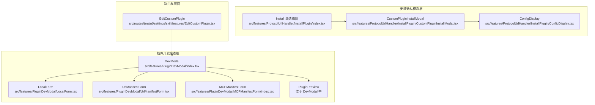
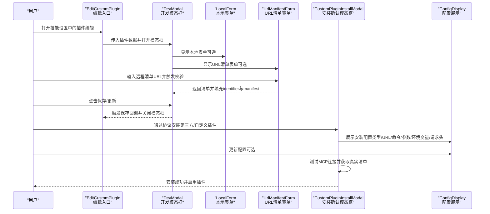
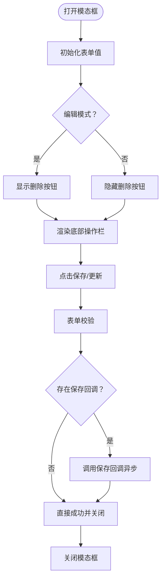
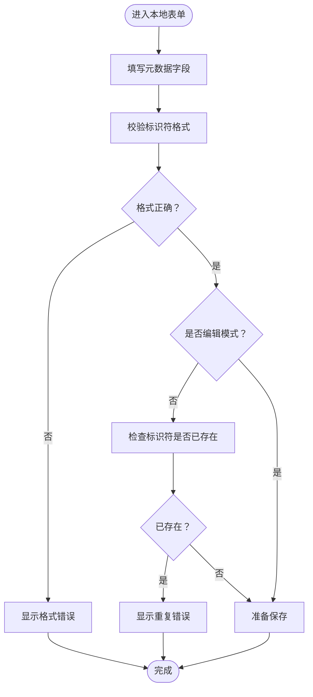
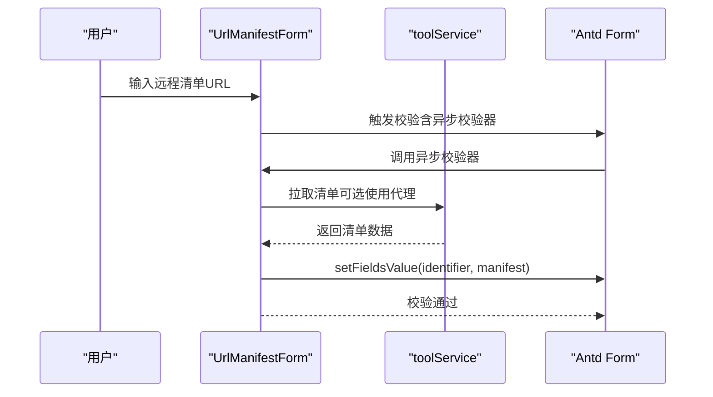
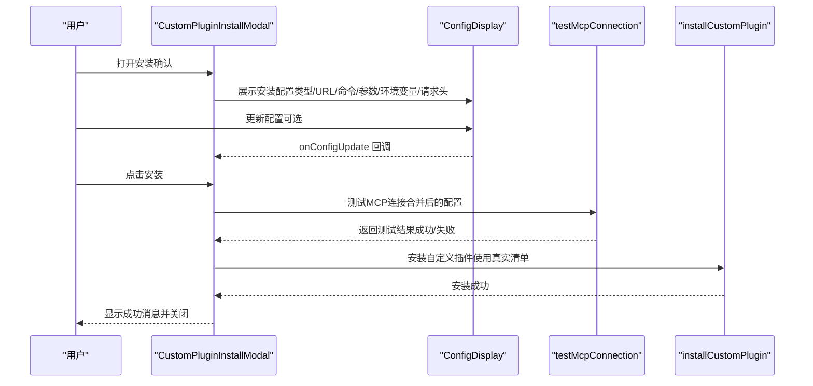
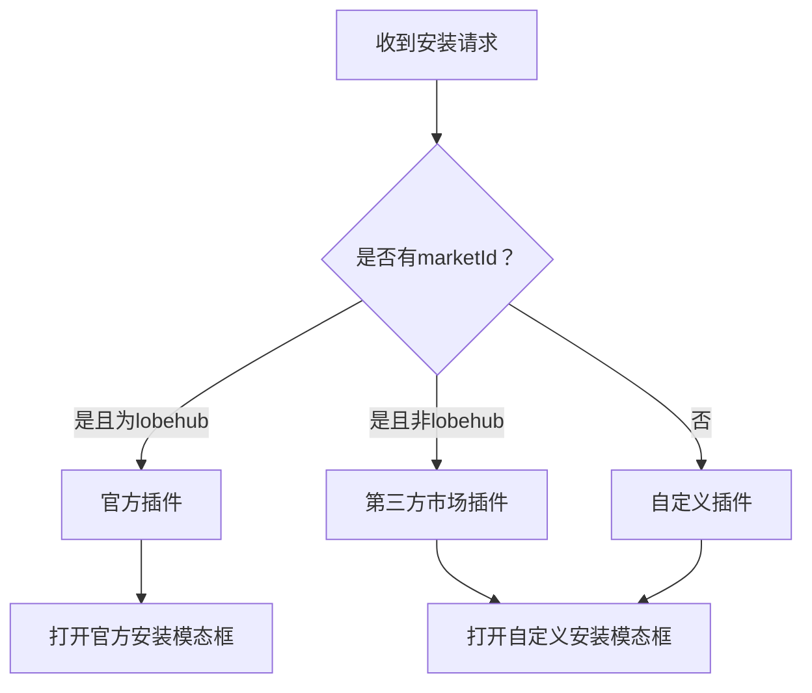
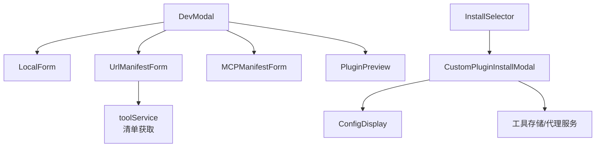

# 插件开发模态框

<cite>
**本文档引用的文件**
- [src/features/PluginDevModal/index.tsx](file://src/features/PluginDevModal/index.tsx)
- [src/features/PluginDevModal/LocalForm.tsx](file://src/features/PluginDevModal/LocalForm.tsx)
- [src/features/PluginDevModal/UrlManifestForm.tsx](file://src/features/PluginDevModal/UrlManifestForm.tsx)
- [src/features/ProtocolUrlHandler/InstallPlugin/CustomPluginInstallModal.tsx](file://src/features/ProtocolUrlHandler/InstallPlugin/CustomPluginInstallModal.tsx)
- [src/features/ProtocolUrlHandler/InstallPlugin/ConfigDisplay.tsx](file://src/features/ProtocolUrlHandler/InstallPlugin/ConfigDisplay.tsx)
- [src/features/ProtocolUrlHandler/InstallPlugin/index.tsx](file://src/features/ProtocolUrlHandler/InstallPlugin/index.tsx)
- [src/routes/(main)/settings/skill/features/EditCustomPlugin.tsx](file://src/routes/(main)/settings/skill/features/EditCustomPlugin.tsx)
</cite>

## 目录

1. [简介](#简介)
2. [项目结构](#项目结构)
3. [核心组件](#核心组件)
4. [架构总览](#架构总览)
5. [详细组件分析](#详细组件分析)
6. [依赖关系分析](#依赖关系分析)
7. [性能考虑](#性能考虑)
8. [故障排除指南](#故障排除指南)
9. [结论](#结论)
10. [附录](#附录)

## 简介

本文件面向 LobeHub 项目的插件开发与安装场景，系统化梳理 “插件开发模态框” 组件的设计与实现，覆盖以下能力：

- 本地插件表单：在本地直接编辑插件元数据与清单信息
- URL 清单表单：通过远程 URL 获取并校验清单，自动填充标识与清单内容
- MCP 清单表单：支持通过 MCP 协议连接测试并生成自定义插件
- 安装确认模态框：针对第三方市场或自定义 MCP 插件的安全安装确认与配置编辑
- 开发、调试、发布全流程：从创建、配置、预览到保存与启用

该文档将从架构、组件关系、数据流、处理逻辑、集成点、错误处理与性能特性等方面进行深入解析，并提供可视化图示与最佳实践建议。

## 项目结构

围绕插件开发与安装的关键文件组织如下：

- 插件开发模态框：统一入口与布局，承载本地表单、URL 表单、MCP 表单与预览
- 安装确认模态框：用于第三方市场与自定义 MCP 插件的安装前安全确认
- 路由与页面集成：在设置页中以弹窗形式打开编辑 / 创建插件

图表来源

- [src/features/PluginDevModal/index.tsx](file://src/features/PluginDevModal/index.tsx#L1-L158)
- [src/features/PluginDevModal/LocalForm.tsx](file://src/features/PluginDevModal/LocalForm.tsx#L1-L125)
- [src/features/PluginDevModal/UrlManifestForm.tsx](file://src/features/PluginDevModal/UrlManifestForm.tsx#L1-L136)
- [src/features/ProtocolUrlHandler/InstallPlugin/CustomPluginInstallModal.tsx](file://src/features/ProtocolUrlHandler/InstallPlugin/CustomPluginInstallModal.tsx#L1-L226)
- [src/features/ProtocolUrlHandler/InstallPlugin/ConfigDisplay.tsx](file://src/features/ProtocolUrlHandler/InstallPlugin/ConfigDisplay.tsx#L1-L210)
- [src/features/ProtocolUrlHandler/InstallPlugin/index.tsx](file://src/features/ProtocolUrlHandler/InstallPlugin/index.tsx#L1-L56)
- [src/routes/(main)/settings/skill/features/EditCustomPlugin.tsx](<file://src/routes/(main)/settings/skill/features/EditCustomPlugin.tsx#L1-L53>)

章节来源

- [src/features/PluginDevModal/index.tsx](file://src/features/PluginDevModal/index.tsx#L1-L158)
- [src/features/PluginDevModal/LocalForm.tsx](file://src/features/PluginDevModal/LocalForm.tsx#L1-L125)
- [src/features/PluginDevModal/UrlManifestForm.tsx](file://src/features/PluginDevModal/UrlManifestForm.tsx#L1-L136)
- [src/features/ProtocolUrlHandler/InstallPlugin/CustomPluginInstallModal.tsx](file://src/features/ProtocolUrlHandler/InstallPlugin/CustomPluginInstallModal.tsx#L1-L226)
- [src/features/ProtocolUrlHandler/InstallPlugin/ConfigDisplay.tsx](file://src/features/ProtocolUrlHandler/InstallPlugin/ConfigDisplay.tsx#L1-L210)
- [src/features/ProtocolUrlHandler/InstallPlugin/index.tsx](file://src/features/ProtocolUrlHandler/InstallPlugin/index.tsx#L1-L56)
- [src/routes/(main)/settings/skill/features/EditCustomPlugin.tsx](<file://src/routes/(main)/settings/skill/features/EditCustomPlugin.tsx#L1-L53>)

## 核心组件

- 插件开发模态框（DevModal）
  - 负责统一的底部抽屉式界面，承载表单区域与右侧插件预览
  - 支持创建与编辑两种模式，内置表单变更监听与保存回调
  - 在移动端适配横向布局与按钮样式
- 本地插件表单（LocalForm）
  - 提供插件元数据字段（标题、描述、作者、主页、头像等）
  - 对标识符进行格式校验与重复性校验（非编辑模式）
- URL 清单表单（UrlManifestForm）
  - 输入远程清单地址，支持代理开关
  - 异步拉取清单并自动填充 identifier 与 manifest 字段
  - 校验 URL 格式与唯一性（非编辑模式），并提供清单预览入口
- MCP 清单表单（MCPManifestForm）
  - 通过 MCP 连接测试获取真实清单，生成自定义插件
  - 支持环境变量与请求头配置，区分 STDIO 与 HTTP 类型
- 安装确认模态框（CustomPluginInstallModal）
  - 针对第三方市场与自定义 MCP 插件的安全安装确认
  - 展示插件信息与配置，支持用户更新配置后进行连接测试
- 配置展示与编辑（ConfigDisplay）
  - 展示当前安装配置类型（STDIO/HTTP）、命令参数或 URL
  - 提供键值编辑器以修改环境变量或请求头
- 安装源选择器（Install 源选择器）
  - 基于安装请求来源判断官方、第三方市场或自定义插件
  - 分发至对应安装模态框

章节来源

- [src/features/PluginDevModal/index.tsx](file://src/features/PluginDevModal/index.tsx#L1-L158)
- [src/features/PluginDevModal/LocalForm.tsx](file://src/features/PluginDevModal/LocalForm.tsx#L1-L125)
- [src/features/PluginDevModal/UrlManifestForm.tsx](file://src/features/PluginDevModal/UrlManifestForm.tsx#L1-L136)
- [src/features/ProtocolUrlHandler/InstallPlugin/CustomPluginInstallModal.tsx](file://src/features/ProtocolUrlHandler/InstallPlugin/CustomPluginInstallModal.tsx#L1-L226)
- [src/features/ProtocolUrlHandler/InstallPlugin/ConfigDisplay.tsx](file://src/features/ProtocolUrlHandler/InstallPlugin/ConfigDisplay.tsx#L1-L210)
- [src/features/ProtocolUrlHandler/InstallPlugin/index.tsx](file://src/features/ProtocolUrlHandler/InstallPlugin/index.tsx#L1-L56)

## 架构总览

下图展示了插件开发与安装的整体交互流程，包括本地开发、URL 清单获取、MCP 连接测试与安装确认等关键步骤。

图表来源

- [src/routes/(main)/settings/skill/features/EditCustomPlugin.tsx](<file://src/routes/(main)/settings/skill/features/EditCustomPlugin.tsx#L1-L53>)
- [src/features/PluginDevModal/index.tsx](file://src/features/PluginDevModal/index.tsx#L1-L158)
- [src/features/PluginDevModal/UrlManifestForm.tsx](file://src/features/PluginDevModal/UrlManifestForm.tsx#L1-L136)
- [src/features/ProtocolUrlHandler/InstallPlugin/CustomPluginInstallModal.tsx](file://src/features/ProtocolUrlHandler/InstallPlugin/CustomPluginInstallModal.tsx#L1-L226)
- [src/features/ProtocolUrlHandler/InstallPlugin/ConfigDisplay.tsx](file://src/features/ProtocolUrlHandler/InstallPlugin/ConfigDisplay.tsx#L1-L210)

## 详细组件分析

### 组件一：插件开发模态框（DevModal）

- 功能职责
  - 底部抽屉式界面，支持移动端与桌面端自适应
  - 左侧表单区：承载本地表单、URL 清单表单、MCP 清单表单
  - 右侧预览区：实时展示插件元数据与效果
  - 顶部操作栏：取消、删除（编辑模式）、保存 / 更新
  - 表单联动：Form.Provider 监听字段变化并回传给父组件
- 关键实现要点
  - 使用 Ant Design Form 管理表单状态与校验
  - 通过 onFormChange 将局部变更透传给上层 onValueChange
  - 通过 onFormFinish 统一处理保存逻辑，捕获异常并提示
  - 移动端按钮样式与布局优化
- 数据绑定与异步处理
  - 表单初始值通过 useEffect 设置
  - 保存时调用 onSave 回调，支持异步返回
  - 成功后关闭模态框；失败时显示错误消息

图表来源

- [src/features/PluginDevModal/index.tsx](file://src/features/PluginDevModal/index.tsx#L1-L158)

章节来源

- [src/features/PluginDevModal/index.tsx](file://src/features/PluginDevModal/index.tsx#L1-L158)

### 组件二：本地插件表单（LocalForm）

- 功能职责
  - 编辑插件元数据：标题、描述、作者、主页、头像等
  - 校验标识符格式与唯一性（非编辑模式）
- 关键实现要点
  - 使用 Ant Design Form 的 items 结构组织分组字段
  - 标识符规则：字母数字、下划线、连字符组合
  - 与全局语言环境联动，动态翻译文案
- 错误处理
  - 格式不合法与重复标识符均通过规则抛出错误提示

图表来源

- [src/features/PluginDevModal/LocalForm.tsx](file://src/features/PluginDevModal/LocalForm.tsx#L1-L125)

章节来源

- [src/features/PluginDevModal/LocalForm.tsx](file://src/features/PluginDevModal/LocalForm.tsx#L1-L125)

### 组件三：URL 清单表单（UrlManifestForm）

- 功能职责
  - 输入远程清单 URL，支持代理开关
  - 异步拉取清单并自动填充 identifier 与 manifest
  - 校验 URL 格式与唯一性（非编辑模式），并提供清单预览入口
- 关键实现要点
  - 自定义异步校验器：拉取清单、设置表单值、抛出错误
  - 代理开关：根据用户选择决定是否使用代理访问
  - 清单预览：通过 ManifestPreviewer 展示清单内容
- 错误处理
  - 服务端返回的错误消息通过翻译键映射为用户可读提示
  - 重复标识符检测仅在非编辑模式生效

图表来源

- [src/features/PluginDevModal/UrlManifestForm.tsx](file://src/features/PluginDevModal/UrlManifestForm.tsx#L1-L136)

章节来源

- [src/features/PluginDevModal/UrlManifestForm.tsx](file://src/features/PluginDevModal/UrlManifestForm.tsx#L1-L136)

### 组件四：安装确认模态框（CustomPluginInstallModal）

- 功能职责
  - 第三方市场与自定义 MCP 插件的安装前安全确认
  - 展示插件信息与配置，允许用户更新配置后进行连接测试
  - 成功后安装并启用插件
- 关键实现要点
  - 根据来源区分官方、可信市场与自定义插件，展示不同提示
  - 合并原始配置与用户更新后的配置（env、headers）
  - 先测试连接再安装，确保清单可用
- 数据绑定与异步处理
  - 通过 ConfigDisplay 的 onConfigUpdate 实时接收配置变更
  - 测试连接状态通过 store 查询，避免重复测试
  - 安装成功后自动启用插件

图表来源

- [src/features/ProtocolUrlHandler/InstallPlugin/CustomPluginInstallModal.tsx](file://src/features/ProtocolUrlHandler/InstallPlugin/CustomPluginInstallModal.tsx#L1-L226)
- [src/features/ProtocolUrlHandler/InstallPlugin/ConfigDisplay.tsx](file://src/features/ProtocolUrlHandler/InstallPlugin/ConfigDisplay.tsx#L1-L210)

章节来源

- [src/features/ProtocolUrlHandler/InstallPlugin/CustomPluginInstallModal.tsx](file://src/features/ProtocolUrlHandler/InstallPlugin/CustomPluginInstallModal.tsx#L1-L226)
- [src/features/ProtocolUrlHandler/InstallPlugin/ConfigDisplay.tsx](file://src/features/ProtocolUrlHandler/InstallPlugin/ConfigDisplay.tsx#L1-L210)

### 组件五：安装源选择器（Install 源选择器）

- 功能职责
  - 基于安装请求来源判断官方、第三方市场或自定义插件
  - 分发至对应安装模态框
- 关键实现要点
  - 通过 marketId 判断来源：'lobehub' 为官方，其他为第三方市场，无 marketId 为自定义
  - 统一入口组件，简化调用方逻辑

图表来源

- [src/features/ProtocolUrlHandler/InstallPlugin/index.tsx](file://src/features/ProtocolUrlHandler/InstallPlugin/index.tsx#L1-L56)

章节来源

- [src/features/ProtocolUrlHandler/InstallPlugin/index.tsx](file://src/features/ProtocolUrlHandler/InstallPlugin/index.tsx#L1-L56)

### 组件六：路由与页面集成（EditCustomPlugin）

- 功能职责
  - 在设置页中打开插件编辑 / 创建的模态框
  - 与工具存储交互，支持更新新开发插件、卸载插件与安装插件
- 关键实现要点
  - 通过 useToolStore 获取安装、更新、卸载方法
  - 以 children 包裹的方式保持事件冒泡控制
  - 传入 identifier 与 open 状态，支持外部控制

章节来源

- [src/routes/(main)/settings/skill/features/EditCustomPlugin.tsx](<file://src/routes/(main)/settings/skill/features/EditCustomPlugin.tsx#L1-L53>)

## 依赖关系分析

- 组件耦合与内聚
  - DevModal 作为容器，聚合多个表单组件，内聚度高但与具体表单耦合较弱
  - URL 清单表单与工具服务强耦合，负责网络请求与错误映射
  - 安装确认模态框与配置展示组件强耦合，共同完成配置编辑与测试
- 外部依赖
  - Ant Design Form 与 UI 组件库提供表单与展示能力
  - 工具存储与代理服务用于清单获取与连接测试
- 潜在循环依赖
  - 当前结构未见循环依赖，安装确认模态框与配置展示组件为单向依赖

图表来源

- [src/features/PluginDevModal/index.tsx](file://src/features/PluginDevModal/index.tsx#L1-L158)
- [src/features/PluginDevModal/UrlManifestForm.tsx](file://src/features/PluginDevModal/UrlManifestForm.tsx#L1-L136)
- [src/features/ProtocolUrlHandler/InstallPlugin/CustomPluginInstallModal.tsx](file://src/features/ProtocolUrlHandler/InstallPlugin/CustomPluginInstallModal.tsx#L1-L226)
- [src/features/ProtocolUrlHandler/InstallPlugin/ConfigDisplay.tsx](file://src/features/ProtocolUrlHandler/InstallPlugin/ConfigDisplay.tsx#L1-L210)
- [src/features/ProtocolUrlHandler/InstallPlugin/index.tsx](file://src/features/ProtocolUrlHandler/InstallPlugin/index.tsx#L1-L56)

章节来源

- [src/features/PluginDevModal/index.tsx](file://src/features/PluginDevModal/index.tsx#L1-L158)
- [src/features/PluginDevModal/UrlManifestForm.tsx](file://src/features/PluginDevModal/UrlManifestForm.tsx#L1-L136)
- [src/features/ProtocolUrlHandler/InstallPlugin/CustomPluginInstallModal.tsx](file://src/features/ProtocolUrlHandler/InstallPlugin/CustomPluginInstallModal.tsx#L1-L226)
- [src/features/ProtocolUrlHandler/InstallPlugin/ConfigDisplay.tsx](file://src/features/ProtocolUrlHandler/InstallPlugin/ConfigDisplay.tsx#L1-L210)
- [src/features/ProtocolUrlHandler/InstallPlugin/index.tsx](file://src/features/ProtocolUrlHandler/InstallPlugin/index.tsx#L1-L56)

## 性能考虑

- 表单渲染优化
  - 使用 memo 包裹组件，减少不必要的重渲染
  - 抽屉容器 destroyOnHidden，避免长期占用内存
- 异步加载与缓存
  - URL 清单拉取采用异步校验器，避免阻塞 UI
  - 连接测试状态通过 store 缓存，避免重复测试
- 移动端适配
  - 按钮样式与布局在移动端自适应，提升交互效率

## 故障排除指南

- URL 清单校验失败
  - 检查 URL 格式与可达性，确认是否需要代理
  - 查看服务端返回的错误消息键，定位具体问题
- 标识符重复
  - 非编辑模式下会进行重复性校验，更换唯一标识符后重试
- 安装失败
  - 检查 MCP 连接配置（类型、URL、命令、参数、环境变量、请求头）
  - 查看连接测试错误提示，修正配置后重新测试
- 保存失败
  - 查看控制台错误日志，确认保存回调是否抛出异常
  - 确认网络状态与权限配置

章节来源

- [src/features/PluginDevModal/UrlManifestForm.tsx](file://src/features/PluginDevModal/UrlManifestForm.tsx#L1-L136)
- [src/features/ProtocolUrlHandler/InstallPlugin/CustomPluginInstallModal.tsx](file://src/features/ProtocolUrlHandler/InstallPlugin/CustomPluginInstallModal.tsx#L1-L226)
- [src/features/PluginDevModal/index.tsx](file://src/features/PluginDevModal/index.tsx#L1-L158)

## 结论

插件开发模态框组件通过清晰的职责划分与模块化设计，实现了本地开发、URL 清单获取、MCP 连接测试与安装确认的完整闭环。其表单验证、数据绑定与异步处理机制保证了良好的用户体验与开发效率。配合路由与页面集成，开发者可以高效地创建、配置、测试与发布插件，满足多样化的插件开发需求。

## 附录

- 使用示例（路径指引）
  - 创建本地插件：在设置页打开编辑组件，选择本地表单，填写元数据并保存
  - 通过 URL 获取清单：在 URL 清单表单输入远程地址，触发校验并自动填充
  - 安装第三方 / 自定义插件：通过协议安装入口，打开安装确认模态框，更新配置后测试并安装
- 最佳实践
  - 在非编辑模式下严格校验标识符唯一性
  - 使用代理访问受限资源时明确标注
  - 安装前务必进行连接测试，确保清单与配置有效
  - 保存前预览插件效果，确认元数据与头像等信息准确
