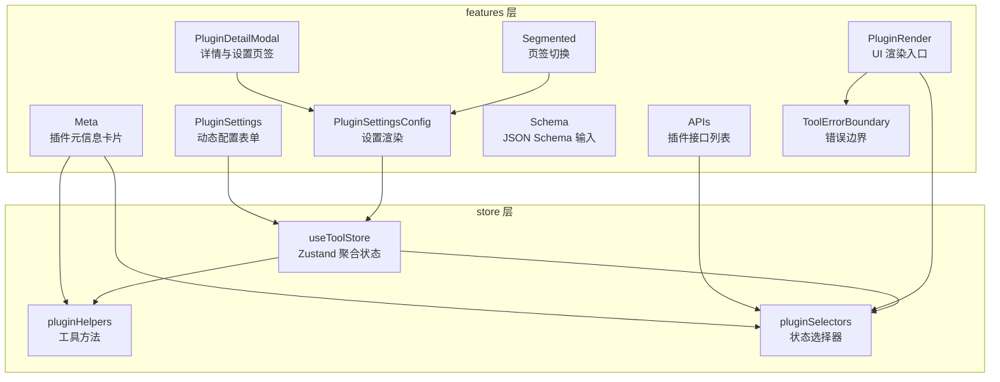
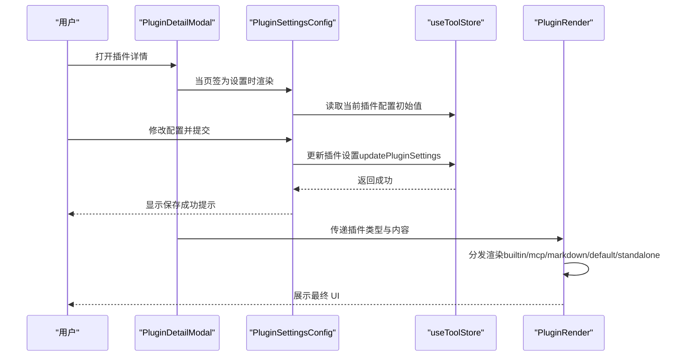
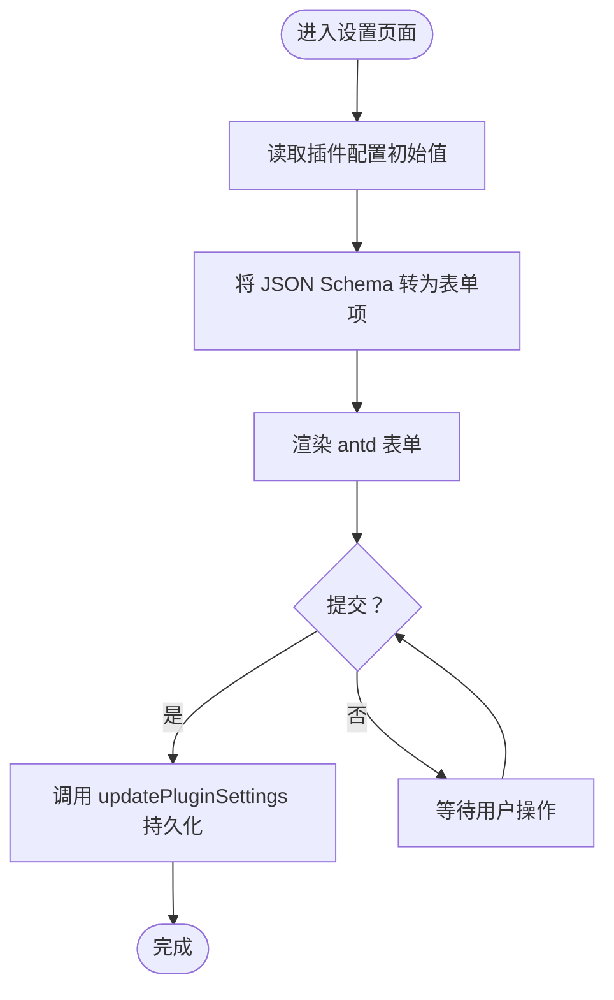
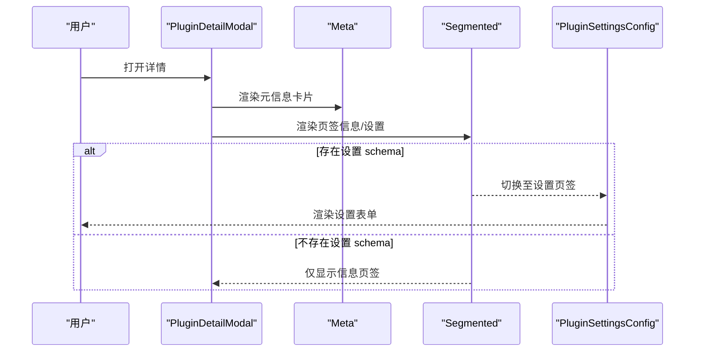
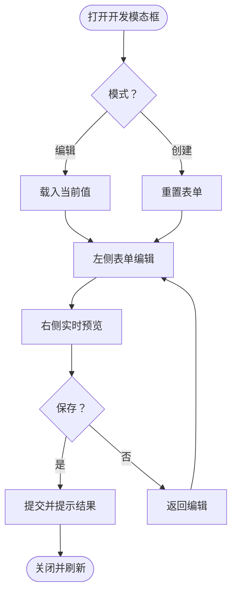
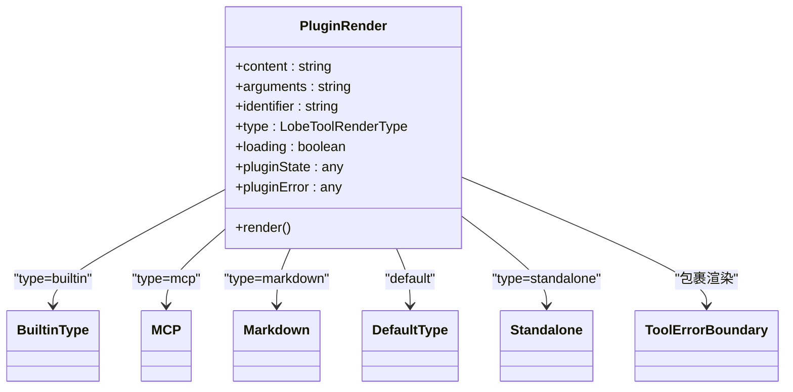
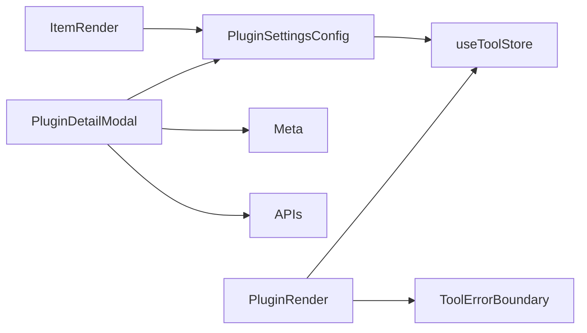

# 插件系统组件

<cite>
**本文引用的文件**
- [src/features/PluginSettings/index.tsx](file://src/features/PluginSettings/index.tsx)
- [src/features/PluginDetailModal/index.tsx](file://src/features/PluginDetailModal/index.tsx)
- [src/features/PluginDetailModal/Meta.tsx](file://src/features/PluginDetailModal/Meta.tsx)
- [src/features/PluginDevModal/index.tsx](file://src/features/PluginDevModal/index.tsx)
- [src/features/PluginsUI/Render/index.tsx](file://src/features/PluginsUI/Render/index.tsx)
- [src/store/tool/store.ts](file://src/store/tool/store.ts)
- [src/store/tool/helpers.ts](file://src/store/tool/helpers.ts)
- [src/store/tool/selectors.ts](file://src/store/tool/selectors.ts)
- [src/components/JSONSchemaConfig/ItemRender.tsx](file://src/components/JSONSchemaConfig/ItemRender.tsx)
- [src/features/Conversation/Messages/AssistantGroup/Tool/Detail/PluginSettings.tsx](file://src/features/Conversation/Messages/AssistantGroup/Tool/Detail/PluginSettings.tsx)
</cite>

## 目录

1. [简介](#简介)
2. [项目结构](#项目结构)
3. [核心组件](#核心组件)
4. [架构总览](#架构总览)
5. [组件详解](#组件详解)
6. [依赖关系分析](#依赖关系分析)
7. [性能考量](#性能考量)
8. [故障排查指南](#故障排查指南)
9. [结论](#结论)
10. [附录：使用示例与最佳实践](#附录使用示例与最佳实践)

## 简介

本文件面向 LobeHub 项目的插件系统组件，围绕以下核心能力进行系统化文档化：

- 插件设置组件：基于 JSON Schema 的动态配置表单渲染与持久化更新
- 插件详情模态框组件：插件元信息展示、API 列表与设置页签切换
- 插件开发模态框组件：自定义插件（含 MCP）的可视化开发、预览与保存流程
- 插件 UI 渲染组件：多类型插件内容的统一渲染（内置、MCP、Markdown、默认等）
- 插件生态集成：与工具存储、消息流、错误边界、状态选择器的协作
- 生命周期与状态同步：从配置变更到渲染更新的端到端链路

## 项目结构

插件系统相关代码主要分布在 features 与 store 两个层面：

- features 层：负责 UI 组件与业务交互（详情、开发、设置、渲染）
- store 层：负责插件状态、选择器与工具聚合（Zustand）

图表来源

- [src/features/PluginSettings/index.tsx](file://src/features/PluginSettings/index.tsx#L1-L88)
- [src/features/PluginDetailModal/index.tsx](file://src/features/PluginDetailModal/index.tsx#L1-L82)
- [src/features/PluginDetailModal/Meta.tsx](file://src/features/PluginDetailModal/Meta.tsx#L1-L28)
- [src/features/PluginsUI/Render/index.tsx](file://src/features/PluginsUI/Render/index.tsx#L1-L108)
- [src/store/tool/store.ts](file://src/store/tool/store.ts#L1-L64)

章节来源

- [src/features/PluginSettings/index.tsx](file://src/features/PluginSettings/index.tsx#L1-L88)
- [src/features/PluginDetailModal/index.tsx](file://src/features/PluginDetailModal/index.tsx#L1-L82)
- [src/features/PluginDetailModal/Meta.tsx](file://src/features/PluginDetailModal/Meta.tsx#L1-L28)
- [src/features/PluginsUI/Render/index.tsx](file://src/features/PluginsUI/Render/index.tsx#L1-L108)
- [src/store/tool/store.ts](file://src/store/tool/store.ts#L1-L64)

## 核心组件

- 插件设置组件（PluginSettingsConfig）
  - 基于 JSON Schema 动态生成表单项，支持枚举、范围、格式等约束
  - 通过工具存储更新插件配置，并在提交时触发持久化
- 插件详情模态框（PluginDetailModal）
  - 提供 “信息” 和 “设置” 双页签，根据是否存在设置模式态切换
  - 集成元信息卡片与 API 列表展示
- 插件开发模态框（DevModal）
  - 支持创建 / 编辑自定义插件（含 MCP），提供表单校验、保存与删除确认
  - 左侧表单、右侧预览，移动端适配
- 插件 UI 渲染（PluginRender）
  - 多类型渲染分发：内置、MCP、Markdown、默认与独立运行（standalone）
  - 统一错误边界包裹，保证渲染稳定性

章节来源

- [src/features/PluginSettings/index.tsx](file://src/features/PluginSettings/index.tsx#L13-L87)
- [src/features/PluginDetailModal/index.tsx](file://src/features/PluginDetailModal/index.tsx#L27-L79)
- [src/features/PluginDevModal/index.tsx](file://src/features/PluginDevModal/index.tsx#L23-L155)
- [src/features/PluginsUI/Render/index.tsx](file://src/features/PluginsUI/Render/index.tsx#L32-L105)

## 架构总览

下图展示了插件系统组件与状态层的交互关系，以及渲染链路：

图表来源

- [src/features/PluginDetailModal/index.tsx](file://src/features/PluginDetailModal/index.tsx#L27-L79)
- [src/features/PluginSettings/index.tsx](file://src/features/PluginSettings/index.tsx#L42-L87)
- [src/features/PluginsUI/Render/index.tsx](file://src/features/PluginsUI/Render/index.tsx#L32-L105)
- [src/store/tool/store.ts](file://src/store/tool/store.ts#L41-L55)

## 组件详解

### 插件设置组件（PluginSettingsConfig）

- 职责
  - 将插件的 JSON Schema 转换为表单项，支持布尔、数值、枚举、格式化输入等
  - 使用 antd Form 渲染，结合 Markdown 描述文本增强可读性
  - 提交后调用工具存储的更新方法，持久化配置
- 关键点
  - 表单初始值来自工具存储的选择器
  - 布尔字段自动映射为 checked
  - 通过 ItemRender 组件将 schema 约束转换为 UI 控件

图表来源

- [src/features/PluginSettings/index.tsx](file://src/features/PluginSettings/index.tsx#L42-L87)
- [src/components/JSONSchemaConfig/ItemRender.tsx](file://src/components/JSONSchemaConfig/ItemRender.tsx)

章节来源

- [src/features/PluginSettings/index.tsx](file://src/features/PluginSettings/index.tsx#L13-L87)
- [src/components/JSONSchemaConfig/ItemRender.tsx](file://src/components/JSONSchemaConfig/ItemRender.tsx)

### 插件详情模态框（PluginDetailModal）

- 职责
  - 展示插件元信息卡片（头像、标题、描述）
  - 提供 “信息” 和 “设置” 页签；当无设置 schema 时不显示设置页签
  - 在 “信息” 页签展示 API 列表，在 “设置” 页签渲染设置表单
- 关键点
  - 使用 useMergeState 管理页签状态
  - 通过 pluginHelpers 判断是否具备非空设置 schema
  - 与 Meta 组件配合展示插件基础信息

图表来源

- [src/features/PluginDetailModal/index.tsx](file://src/features/PluginDetailModal/index.tsx#L27-L79)
- [src/features/PluginDetailModal/Meta.tsx](file://src/features/PluginDetailModal/Meta.tsx#L9-L25)

章节来源

- [src/features/PluginDetailModal/index.tsx](file://src/features/PluginDetailModal/index.tsx#L27-L79)
- [src/features/PluginDetailModal/Meta.tsx](file://src/features/PluginDetailModal/Meta.tsx#L9-L25)

### 插件开发模态框（DevModal）

- 职责
  - 自定义插件（含 MCP）的可视化开发与预览
  - 支持创建 / 编辑两种模式，提供保存与删除确认
  - 左侧表单区域，右侧预览区域，移动端自适应
- 关键点
  - 使用 Form.Provider 监听表单变化并回调上层
  - 保存时统一处理 loading、成功与失败提示
  - 删除时弹出二次确认，防止误操作

图表来源

- [src/features/PluginDevModal/index.tsx](file://src/features/PluginDevModal/index.tsx#L23-L155)

章节来源

- [src/features/PluginDevModal/index.tsx](file://src/features/PluginDevModal/index.tsx#L23-L155)

### 插件 UI 渲染（PluginRender）

- 职责
  - 根据插件类型分发渲染：内置、MCP、Markdown、默认与独立运行（standalone）
  - 统一包裹错误边界，避免单个插件异常影响整体消息流
- 关键点
  - 通过工具选择器获取插件状态与错误信息
  - 使用稳定 key 防止父组件重渲染导致错误边界重置

图表来源

- [src/features/PluginsUI/Render/index.tsx](file://src/features/PluginsUI/Render/index.tsx#L32-L105)

章节来源

- [src/features/PluginsUI/Render/index.tsx](file://src/features/PluginsUI/Render/index.tsx#L32-L105)

### 与插件生态的集成

- 工具存储（Zustand）
  - 聚合插件、内置工具、MCP、技能商店等多切片状态
  - 提供统一的更新方法（如 updatePluginSettings）与选择器（如 getPluginMetaById）
- 插件辅助方法（pluginHelpers）
  - 提供标题、描述、头像等通用方法，简化 UI 展示
- 错误边界（ToolErrorBoundary）
  - 包裹渲染组件，隔离插件异常，保障消息流稳定

章节来源

- [src/store/tool/store.ts](file://src/store/tool/store.ts#L41-L55)
- [src/store/tool/helpers.ts](file://src/store/tool/helpers.ts)
- [src/store/tool/selectors.ts](file://src/store/tool/selectors.ts)

## 依赖关系分析

- 组件耦合
  - PluginSettingsConfig 依赖 JSONSchemaConfig.ItemRender 与工具存储
  - PluginDetailModal 依赖 Meta、APIs 与 PluginSettingsConfig
  - PluginRender 依赖多种渲染类型与错误边界
- 外部依赖
  - antd Form、Markdown 渲染、i18n、响应式断点等
- 状态依赖
  - 所有组件均通过 useToolStore 访问状态，确保一致性与可追踪性

图表来源

- [src/features/PluginSettings/index.tsx](file://src/features/PluginSettings/index.tsx#L11-L43)
- [src/features/PluginDetailModal/index.tsx](file://src/features/PluginDetailModal/index.tsx#L7-L35)
- [src/features/PluginsUI/Render/index.tsx](file://src/features/PluginsUI/Render/index.tsx#L5-L100)

章节来源

- [src/features/PluginSettings/index.tsx](file://src/features/PluginSettings/index.tsx#L11-L43)
- [src/features/PluginDetailModal/index.tsx](file://src/features/PluginDetailModal/index.tsx#L7-L35)
- [src/features/PluginsUI/Render/index.tsx](file://src/features/PluginsUI/Render/index.tsx#L5-L100)

## 性能考量

- 表单渲染优化
  - 使用 memo 与浅比较减少重渲染
  - 初始值直接来自选择器，避免重复计算
- 渲染稳定性
  - 错误边界包裹，避免单插件异常扩散
  - 渲染 key 稳定化，降低重挂载概率
- 状态访问
  - 通过选择器精确订阅所需字段，降低全局状态更新带来的副作用

## 故障排查指南

- 设置无法保存
  - 检查 updatePluginSettings 是否被正确调用
  - 确认表单提交事件绑定与初始值设置
- 详情页签不显示
  - 确认插件 schema 中 settings 是否非空
  - 检查 pluginHelpers 的判断逻辑
- 开发模态框保存失败
  - 查看 onSave 回调中是否有异常抛出
  - 确认消息提示与提交状态切换逻辑
- 渲染崩溃
  - 检查 ToolErrorBoundary 是否包裹
  - 定位具体渲染类型分支与传参

章节来源

- [src/features/PluginSettings/index.tsx](file://src/features/PluginSettings/index.tsx#L80-L82)
- [src/features/PluginDetailModal/index.tsx](file://src/features/PluginDetailModal/index.tsx#L35-L64)
- [src/features/PluginDevModal/index.tsx](file://src/features/PluginDevModal/index.tsx#L96-L113)
- [src/features/PluginsUI/Render/index.tsx](file://src/features/PluginsUI/Render/index.tsx#L99-L103)

## 结论

本插件系统组件以 “可配置、可扩展、可渲染” 为核心目标，通过 JSON Schema 驱动的设置表单、多页签详情面板、可视化开发模态框与统一渲染入口，实现了从配置到 UI 的完整闭环。配合 Zustand 状态层与错误边界，系统在易用性与稳定性之间取得良好平衡。

## 附录：使用示例与最佳实践

- 安装与启用插件
  - 在技能商店或自定义入口添加插件
  - 若存在设置 schema，则在详情页签中完成初始化配置
- 配置管理
  - 使用 PluginSettingsConfig 动态生成表单
  - 提交后由工具存储持久化，确保重启后仍生效
- 开发与调试
  - 使用 DevModal 创建 / 编辑自定义插件
  - 左右分屏对比表单与预览，快速迭代
- 渲染与展示
  - 根据插件类型选择渲染分支
  - 出错时由错误边界接管，避免影响对话体验

章节来源

- [src/features/PluginSettings/index.tsx](file://src/features/PluginSettings/index.tsx#L50-L83)
- [src/features/PluginDetailModal/index.tsx](file://src/features/PluginDetailModal/index.tsx#L37-L76)
- [src/features/PluginDevModal/index.tsx](file://src/features/PluginDevModal/index.tsx#L91-L152)
- [src/features/PluginsUI/Render/index.tsx](file://src/features/PluginsUI/Render/index.tsx#L44-L94)
