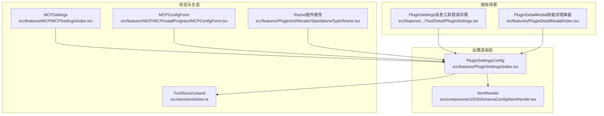
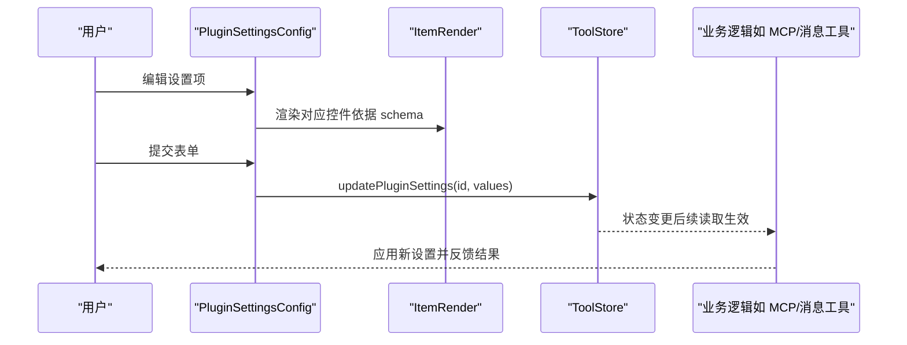
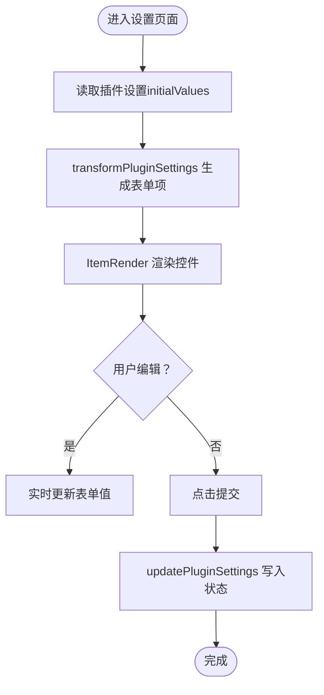
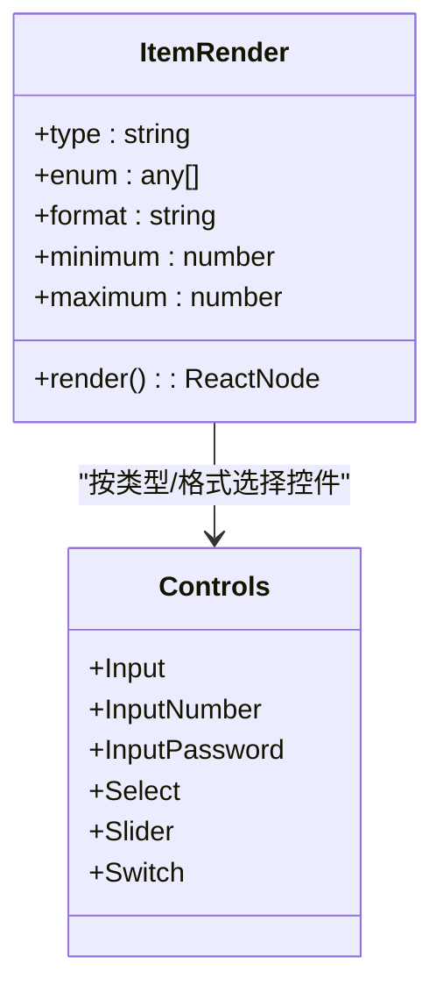
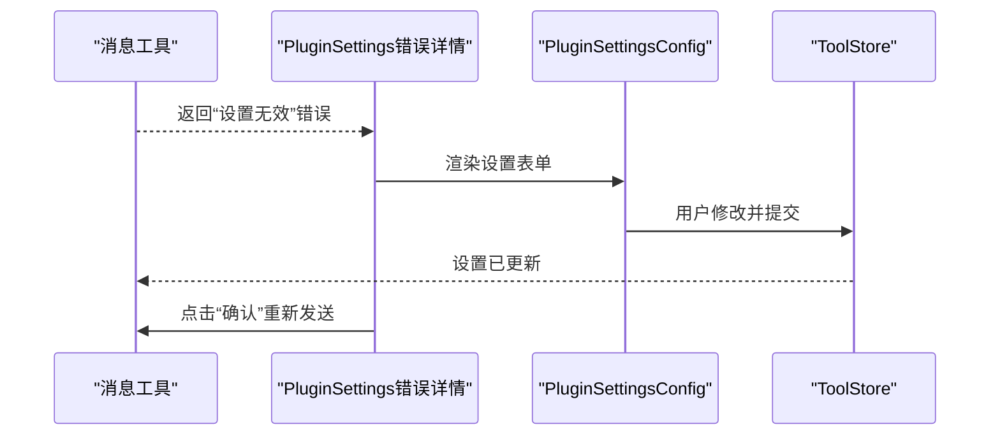
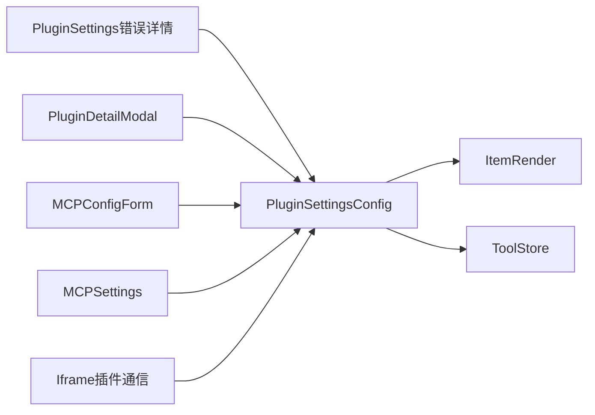

# 插件设置组件

<cite>
**本文引用的文件**
- [src/features/PluginSettings/index.tsx](file://src/features/PluginSettings/index.tsx)
- [src/components/JSONSchemaConfig/ItemRender.tsx](file://src/components/JSONSchemaConfig/ItemRender.tsx)
- [src/features/Conversation/Messages/AssistantGroup/Tool/Detail/PluginSettings.tsx](file://src/features/Conversation/Messages/AssistantGroup/Tool/Detail/PluginSettings.tsx)
- [src/features/PluginDetailModal/index.tsx](file://src/features/PluginDetailModal/index.tsx)
- [src/store/tool/store.ts](file://src/store/tool/store.ts)
- [src/features/MCP/MCPSettings/index.tsx](file://src/features/MCP/MCPSettings/index.tsx)
- [src/features/MCP/MCPInstallProgress/MCPConfigForm.tsx](file://src/features/MCP/MCPInstallProgress/MCPConfigForm.tsx)
- [src/features/PluginsUI/Render/StandaloneType/Iframe.tsx](file://src/features/PluginsUI/Render/StandaloneType/Iframe.tsx)
</cite>

## 目录

1. [简介](#简介)
2. [项目结构](#项目结构)
3. [核心组件](#核心组件)
4. [架构总览](#架构总览)
5. [组件详细分析](#组件详细分析)
6. [依赖关系分析](#依赖关系分析)
7. [性能考量](#性能考量)
8. [故障排查指南](#故障排查指南)
9. [结论](#结论)
10. [附录](#附录)

## 简介

本文件系统性梳理 LobeHub 插件设置组件的设计与实现，覆盖插件状态显示、配置参数管理、设置项编辑、与插件生态系统的交互（启用 / 禁用、参数配置、状态监控）、数据绑定、验证与错误处理、响应式设计与用户交互模式等内容。通过多层级图示与路径引用，帮助开发者快速理解并扩展插件设置能力。

## 项目结构

插件设置组件围绕以下关键模块组织：

- 设置渲染核心：PluginSettingsConfig（负责将 JSON Schema 转换为表单控件）
- 表单控件映射：ItemRender（根据类型 / 格式渲染具体输入控件）
- 使用场景封装：PluginSettings（在消息工具错误详情中展示设置入口）
- 展示容器：PluginDetailModal（技能详情弹窗中切换 “信息 / 设置” 标签）
- 状态存储：ToolStore（Zustand 状态管理，提供更新插件设置的能力）
- MCP 扩展：MCPSettings/MCPConfigForm（MCP 插件的设置表单与环境变量覆盖）
- 插件通信：Iframe（插件与宿主之间的设置同步）

图表来源

- [src/features/PluginSettings/index.tsx](file://src/features/PluginSettings/index.tsx#L42-L85)
- [src/components/JSONSchemaConfig/ItemRender.tsx](file://src/components/JSONSchemaConfig/ItemRender.tsx#L18-L52)
- [src/features/Conversation/Messages/AssistantGroup/Tool/Detail/PluginSettings.tsx](file://src/features/Conversation/Messages/AssistantGroup/Tool/Detail/PluginSettings.tsx#L21-L65)
- [src/features/PluginDetailModal/index.tsx](file://src/features/PluginDetailModal/index.tsx#L27-L79)
- [src/store/tool/store.ts](file://src/store/tool/store.ts#L41-L61)
- [src/features/MCP/MCPSettings/index.tsx](file://src/features/MCP/MCPSettings/index.tsx#L168-L222)
- [src/features/MCP/MCPInstallProgress/MCPConfigForm.tsx](file://src/features/MCP/MCPInstallProgress/MCPConfigForm.tsx#L8-L50)
- [src/features/PluginsUI/Render/StandaloneType/Iframe.tsx](file://src/features/PluginsUI/Render/StandaloneType/Iframe.tsx#L101-L114)

章节来源

- [src/features/PluginSettings/index.tsx](file://src/features/PluginSettings/index.tsx#L1-L88)
- [src/components/JSONSchemaConfig/ItemRender.tsx](file://src/components/JSONSchemaConfig/ItemRender.tsx#L1-L55)
- [src/features/Conversation/Messages/AssistantGroup/Tool/Detail/PluginSettings.tsx](file://src/features/Conversation/Messages/AssistantGroup/Tool/Detail/PluginSettings.tsx#L1-L68)
- [src/features/PluginDetailModal/index.tsx](file://src/features/PluginDetailModal/index.tsx#L1-L82)
- [src/store/tool/store.ts](file://src/store/tool/store.ts#L1-L64)
- [src/features/MCP/MCPSettings/index.tsx](file://src/features/MCP/MCPSettings/index.tsx#L168-L222)
- [src/features/MCP/MCPInstallProgress/MCPConfigForm.tsx](file://src/features/MCP/MCPInstallProgress/MCPConfigForm.tsx#L8-L50)
- [src/features/PluginsUI/Render/StandaloneType/Iframe.tsx](file://src/features/PluginsUI/Render/StandaloneType/Iframe.tsx#L101-L114)

## 核心组件

- PluginSettingsConfig：将插件的 JSON Schema 配置转换为可编辑表单，支持字符串、数字、布尔等类型，并根据 format/enum 等属性选择合适的输入控件；提交时调用状态存储更新插件设置。
- ItemRender：根据 JSON Schema 的 type/format/enum/ 范围等属性，动态渲染对应输入控件（如密码输入、下拉选择、滑块、开关等），并处理布尔类型的 checked 绑定。
- PluginSettings（消息工具错误详情）：在工具执行失败且提示 “插件设置无效” 时，展示插件头像、标题、描述以及设置表单，并提供重新发送消息的按钮。
- PluginDetailModal：在技能详情弹窗中提供 “信息 / 设置” 标签页，当存在设置 schema 时显示设置表单。
- ToolStore：提供 updatePluginSettings 等动作，用于持久化保存插件设置；通过 selector 获取指定插件的当前设置值。
- MCPSettings/MCPConfigForm：针对 MCP 插件的设置表单，支持覆盖环境变量并持久化到插件设置。
- Iframe：在独立运行的插件页面中，与插件通信以获取 / 更新设置。

章节来源

- [src/features/PluginSettings/index.tsx](file://src/features/PluginSettings/index.tsx#L13-L85)
- [src/components/JSONSchemaConfig/ItemRender.tsx](file://src/components/JSONSchemaConfig/ItemRender.tsx#L18-L52)
- [src/features/Conversation/Messages/AssistantGroup/Tool/Detail/PluginSettings.tsx](file://src/features/Conversation/Messages/AssistantGroup/Tool/Detail/PluginSettings.tsx#L21-L65)
- [src/features/PluginDetailModal/index.tsx](file://src/features/PluginDetailModal/index.tsx#L27-L79)
- [src/store/tool/store.ts](file://src/store/tool/store.ts#L41-L61)
- [src/features/MCP/MCPSettings/index.tsx](file://src/features/MCP/MCPSettings/index.tsx#L168-L222)
- [src/features/MCP/MCPInstallProgress/MCPConfigForm.tsx](file://src/features/MCP/MCPInstallProgress/MCPConfigForm.tsx#L8-L50)
- [src/features/PluginsUI/Render/StandaloneType/Iframe.tsx](file://src/features/PluginsUI/Render/StandaloneType/Iframe.tsx#L101-L114)

## 架构总览

插件设置组件采用 “Schema 驱动 + 动态渲染” 的架构：上层通过 JSON Schema 定义插件配置项，底层通过 ItemRender 将其映射为 UI 控件；表单提交后写入 Zustand 状态存储，再由业务逻辑（如 MCP、消息工具）读取并应用。

图表来源

- [src/features/PluginSettings/index.tsx](file://src/features/PluginSettings/index.tsx#L42-L85)
- [src/components/JSONSchemaConfig/ItemRender.tsx](file://src/components/JSONSchemaConfig/ItemRender.tsx#L18-L52)
- [src/store/tool/store.ts](file://src/store/tool/store.ts#L41-L61)

## 组件详细分析

### PluginSettingsConfig 组件

- 数据绑定：从 ToolStore 读取当前插件设置作为表单初始值；提交时调用 updatePluginSettings 写回。
- Schema 转换：transformPluginSettings 将 properties 映射为表单项数组，保留 label/desc/name/tag/type/enum/format/range 等元信息。
- 控件渲染：基于 ItemRender 动态生成输入控件；布尔类型使用 checked 绑定。
- 响应式布局：垂直布局、边框无样式、间距统一，适配不同屏幕尺寸。
- 错误处理：在消息工具错误详情场景中，若设置无效会引导用户打开设置并重试。

图表来源

- [src/features/PluginSettings/index.tsx](file://src/features/PluginSettings/index.tsx#L42-L85)
- [src/components/JSONSchemaConfig/ItemRender.tsx](file://src/components/JSONSchemaConfig/ItemRender.tsx#L18-L52)

章节来源

- [src/features/PluginSettings/index.tsx](file://src/features/PluginSettings/index.tsx#L13-L85)

### ItemRender 控件映射

- 类型分发：string/number/boolean 三类分别映射到输入框、数字输入 / 滑块、开关。
- 格式增强：当 format 为 password 时渲染密码输入框；当存在 enum 时渲染下拉选择。
- 范围控制：当存在 minimum/maximum 时使用滑块控件限制取值范围。
- 布尔绑定：valuePropName 设为 checked，确保与 antd Form 的布尔绑定一致。

图表来源

- [src/components/JSONSchemaConfig/ItemRender.tsx](file://src/components/JSONSchemaConfig/ItemRender.tsx#L18-L52)

章节来源

- [src/components/JSONSchemaConfig/ItemRender.tsx](file://src/components/JSONSchemaConfig/ItemRender.tsx#L1-L55)

### 消息工具错误详情中的设置入口（PluginSettings）

- 场景触发：当工具执行返回 “插件设置无效” 错误时，展示该组件。
- 交互流程：显示插件头像与名称、简要说明、设置表单，底部提供 “确认” 按钮以重新发送消息并删除失败消息。
- 与主设置解耦：此处仅作为错误引导，实际设置仍由 PluginSettingsConfig 管理。

图表来源

- [src/features/Conversation/Messages/AssistantGroup/Tool/Detail/PluginSettings.tsx](file://src/features/Conversation/Messages/AssistantGroup/Tool/Detail/PluginSettings.tsx#L21-L65)
- [src/features/PluginSettings/index.tsx](file://src/features/PluginSettings/index.tsx#L42-L85)

章节来源

- [src/features/Conversation/Messages/AssistantGroup/Tool/Detail/PluginSettings.tsx](file://src/features/Conversation/Messages/AssistantGroup/Tool/Detail/PluginSettings.tsx#L1-L68)

### 技能详情弹窗中的设置标签（PluginDetailModal）

- 标签切换：在 “信息 / 设置” 之间切换；当插件 schema 非空时才显示 “设置” 标签。
- 嵌入设置：在 “设置” 标签下嵌入 PluginSettingsConfig，传入插件 id 与 schema。
- 交互体验：允许全屏、销毁隐藏，保证在复杂信息流中的可用性。

章节来源

- [src/features/PluginDetailModal/index.tsx](file://src/features/PluginDetailModal/index.tsx#L27-L79)

### MCP 插件设置（MCPSettings 与 MCPConfigForm）

- 环境变量覆盖：MCPConfigForm 复用 transformPluginSettings 生成表单项，提交时以 override 模式写入插件设置。
- 全局更新：MCPSettings 中通过 updatePluginSettings 更新插件设置，支持批量或增量覆盖。
- 与插件生态集成：MCP 插件可通过 manifest.settings 定义配置项，统一走此设置流程。

章节来源

- [src/features/MCP/MCPInstallProgress/MCPConfigForm.tsx](file://src/features/MCP/MCPInstallProgress/MCPConfigForm.tsx#L8-L50)
- [src/features/MCP/MCPSettings/index.tsx](file://src/features/MCP/MCPSettings/index.tsx#L168-L222)

### 插件与宿主通信（Iframe）

- 设置获取：当插件请求获取设置时，宿主通过通信通道返回当前设置。
- 设置更新：当插件更新设置时，宿主同步更新至插件设置存储，保持一致性。

章节来源

- [src/features/PluginsUI/Render/StandaloneType/Iframe.tsx](file://src/features/PluginsUI/Render/StandaloneType/Iframe.tsx#L101-L114)

## 依赖关系分析

- 组件耦合
  - PluginSettingsConfig 依赖 ItemRender 进行控件渲染，依赖 ToolStore 进行状态读写。
  - PluginSettings（错误详情）与 PluginDetailModal 均复用 PluginSettingsConfig，形成 “同源不同场景” 的复用。
  - MCP 相关组件与 PluginSettingsConfig 共享 transformPluginSettings，降低重复逻辑。
- 状态管理
  - ToolStore 聚合多领域切片（内置工具、自定义插件、MCP、技能商店等），提供统一的 updatePluginSettings。
- 外部依赖
  - JSON Schema 类型与格式解析、Ant Design 控件库、@lobehub/ui 组件库、i18n 国际化。

图表来源

- [src/features/PluginSettings/index.tsx](file://src/features/PluginSettings/index.tsx#L42-L85)
- [src/components/JSONSchemaConfig/ItemRender.tsx](file://src/components/JSONSchemaConfig/ItemRender.tsx#L18-L52)
- [src/features/Conversation/Messages/AssistantGroup/Tool/Detail/PluginSettings.tsx](file://src/features/Conversation/Messages/AssistantGroup/Tool/Detail/PluginSettings.tsx#L21-L65)
- [src/features/PluginDetailModal/index.tsx](file://src/features/PluginDetailModal/index.tsx#L27-L79)
- [src/features/MCP/MCPInstallProgress/MCPConfigForm.tsx](file://src/features/MCP/MCPInstallProgress/MCPConfigForm.tsx#L8-L50)
- [src/features/MCP/MCPSettings/index.tsx](file://src/features/MCP/MCPSettings/index.tsx#L168-L222)
- [src/features/PluginsUI/Render/StandaloneType/Iframe.tsx](file://src/features/PluginsUI/Render/StandaloneType/Iframe.tsx#L101-L114)

章节来源

- [src/store/tool/store.ts](file://src/store/tool/store.ts#L41-L61)

## 性能考量

- 渲染优化
  - 使用 memo 包装组件，减少不必要的重渲染。
  - 使用 fast-deep-equal 进行 selector 比较，避免浅比较导致的重复订阅。
- 表单性能
  - 初始值一次性注入，避免频繁重算；控件渲染按需进行，滑块与普通输入按条件分支。
- 状态粒度
  - 将插件设置拆分为独立 slice，避免全局状态抖动影响其他模块。

## 故障排查指南

- 设置无效错误
  - 现象：消息工具返回 “插件设置无效”。
  - 处理：通过 PluginSettings（错误详情）打开设置表单，修正后点击 “确认” 重新发送。
  - 关联文件：[src/features/Conversation/Messages/AssistantGroup/Tool/Detail/PluginSettings.tsx](file://src/features/Conversation/Messages/AssistantGroup/Tool/Detail/PluginSettings.tsx#L21-L65)
- 设置不生效
  - 检查是否正确提交：确认 onFinish 已触发 updatePluginSettings。
  - 检查 schema 是否为空：非空时才会显示设置标签。
  - 关联文件：
    - [src/features/PluginSettings/index.tsx](file://src/features/PluginSettings/index.tsx#L42-L85)
    - [src/features/PluginDetailModal/index.tsx](file://src/features/PluginDetailModal/index.tsx#L27-L79)
- MCP 插件设置覆盖
  - 确认 override 模式是否符合预期；检查环境变量键名与 schema 一致。
  - 关联文件：
    - [src/features/MCP/MCPInstallProgress/MCPConfigForm.tsx](file://src/features/MCP/MCPInstallProgress/MCPConfigForm.tsx#L8-L50)
    - [src/features/MCP/MCPSettings/index.tsx](file://src/features/MCP/MCPSettings/index.tsx#L168-L222)
- 插件与宿主通信
  - 若插件无法获取 / 更新设置，检查通信通道与消息格式。
  - 关联文件：[src/features/PluginsUI/Render/StandaloneType/Iframe.tsx](file://src/features/PluginsUI/Render/StandaloneType/Iframe.tsx#L101-L114)

章节来源

- [src/features/Conversation/Messages/AssistantGroup/Tool/Detail/PluginSettings.tsx](file://src/features/Conversation/Messages/AssistantGroup/Tool/Detail/PluginSettings.tsx#L21-L65)
- [src/features/PluginSettings/index.tsx](file://src/features/PluginSettings/index.tsx#L42-L85)
- [src/features/PluginDetailModal/index.tsx](file://src/features/PluginDetailModal/index.tsx#L27-L79)
- [src/features/MCP/MCPInstallProgress/MCPConfigForm.tsx](file://src/features/MCP/MCPInstallProgress/MCPConfigForm.tsx#L8-L50)
- [src/features/MCP/MCPSettings/index.tsx](file://src/features/MCP/MCPSettings/index.tsx#L168-L222)
- [src/features/PluginsUI/Render/StandaloneType/Iframe.tsx](file://src/features/PluginsUI/Render/StandaloneType/Iframe.tsx#L101-L114)

## 结论

插件设置组件通过 “Schema 驱动 + 动态渲染 + 状态持久化” 的方式，实现了对插件配置项的统一管理与高效交互。它既满足了通用插件的设置需求，也兼容 MCP 等特定生态的覆盖策略，并通过错误详情引导与弹窗标签页提升用户体验。建议在扩展新插件时遵循现有 schema 规范与控件映射约定，确保一致的交互与可维护性。

## 附录

- 使用示例（路径指引）
  - 在消息工具错误详情中展示设置入口：[src/features/Conversation/Messages/AssistantGroup/Tool/Detail/PluginSettings.tsx](file://src/features/Conversation/Messages/AssistantGroup/Tool/Detail/PluginSettings.tsx#L21-L65)
  - 在技能详情弹窗中显示设置标签：[src/features/PluginDetailModal/index.tsx](file://src/features/PluginDetailModal/index.tsx#L27-L79)
  - 在 MCP 安装流程中覆盖环境变量：[src/features/MCP/MCPInstallProgress/MCPConfigForm.tsx](file://src/features/MCP/MCPInstallProgress/MCPConfigForm.tsx#L8-L50)
  - 在独立插件页面中与宿主通信：[src/features/PluginsUI/Render/StandaloneType/Iframe.tsx](file://src/features/PluginsUI/Render/StandaloneType/Iframe.tsx#L101-L114)
