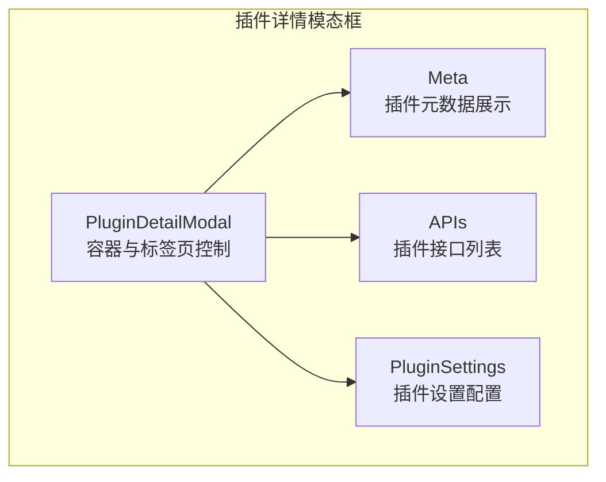
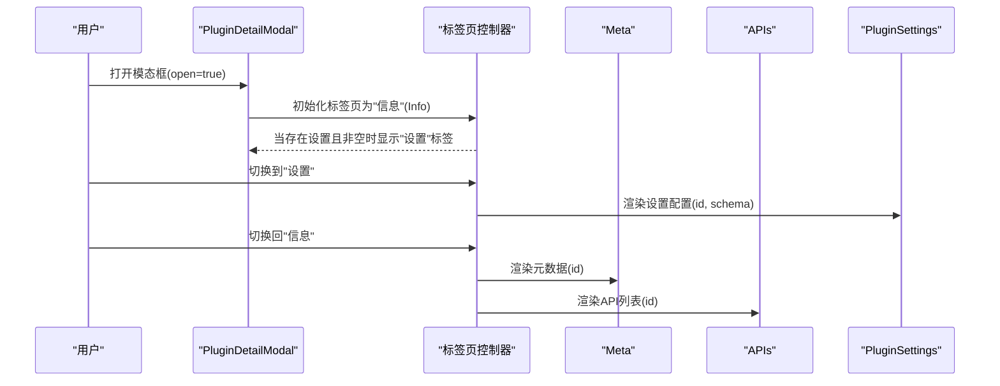
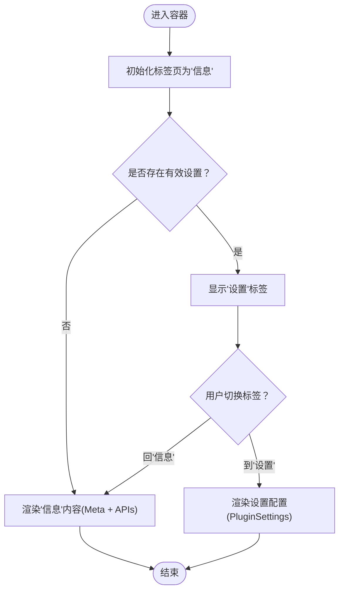
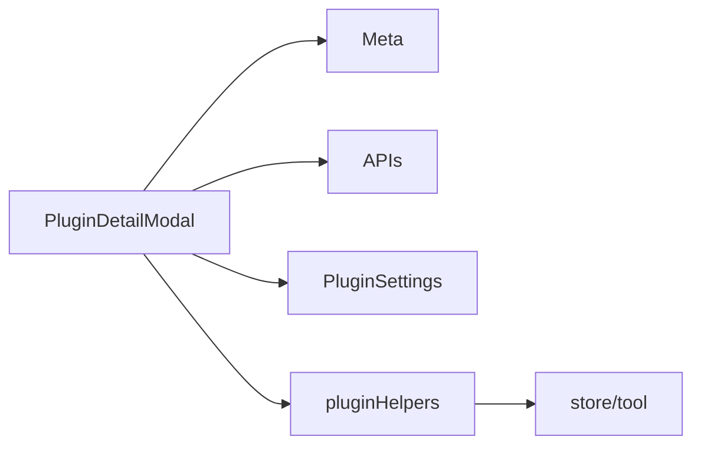
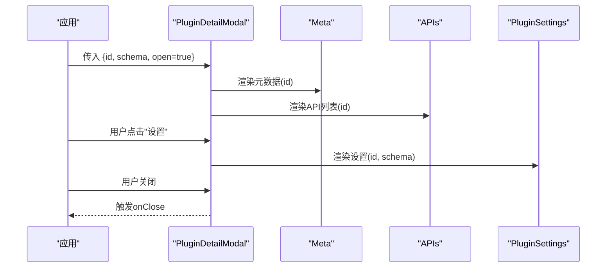

# 插件详情模态框

<cite>
**本文引用的文件**
- [src/features/PluginDetailModal/index.tsx](file://src/features/PluginDetailModal/index.tsx)
- [src/features/PluginDetailModal/Meta.tsx](file://src/features/PluginDetailModal/Meta.tsx)
- [src/features/PluginDetailModal/APIs.tsx](file://src/features/PluginDetailModal/APIs.tsx)
- [src/features/PluginSettings/index.tsx](file://src/features/PluginSettings/index.tsx)
- [src/store/tool/index.ts](file://src/store/tool/index.ts)
- [src/features/PluginDetailModal/index.tsx](file://src/features/PluginDetailModal/index.tsx#L13-L20)
- [src/features/PluginDetailModal/index.tsx](file://src/features/PluginDetailModal/index.tsx#L22-L25)
- [src/features/PluginDetailModal/index.tsx](file://src/features/PluginDetailModal/index.tsx#L27-L79)
- [src/features/PluginDetailModal/Meta.tsx](file://src/features/PluginDetailModal/Meta.tsx)
- [src/features/PluginDetailModal/APIs.tsx](file://src/features/PluginDetailModal/APIs.tsx)
- [src/features/PluginSettings/index.tsx](file://src/features/PluginSettings/index.tsx)
- [src/store/tool/index.ts](file://src/store/tool/index.ts)
</cite>

## 目录
1. [简介](#简介)
2. [项目结构](#项目结构)
3. [核心组件](#核心组件)
4. [架构总览](#架构总览)
5. [详细组件分析](#详细组件分析)
6. [依赖关系分析](#依赖关系分析)
7. [性能考量](#性能考量)
8. [故障排查指南](#故障排查指南)
9. [结论](#结论)
10. [附录](#附录)

## 简介
本文件面向 LobeHub 项目的“插件详情模态框”组件，系统性阐述其设计与实现：包括插件元数据展示、API 列表、设置配置、标签页切换、异步数据加载、错误处理与性能优化等。文档同时提供使用示例与最佳实践，帮助开发者快速集成并扩展该模态框功能。

## 项目结构
插件详情模态框位于 features 层，采用按功能分层组织：
- 模态框入口组件：负责容器、标题、宽度、全屏、销毁策略以及标签页切换逻辑
- 子模块：
  - 元数据展示（Meta）
  - API 列表（APIs）
  - 设置配置（PluginSettings）

图表来源
- [src/features/PluginDetailModal/index.tsx](file://src/features/PluginDetailModal/index.tsx#L27-L79)
- [src/features/PluginDetailModal/Meta.tsx](file://src/features/PluginDetailModal/Meta.tsx)
- [src/features/PluginDetailModal/APIs.tsx](file://src/features/PluginDetailModal/APIs.tsx)
- [src/features/PluginSettings/index.tsx](file://src/features/PluginSettings/index.tsx)

章节来源
- [src/features/PluginDetailModal/index.tsx](file://src/features/PluginDetailModal/index.tsx#L1-L82)

## 核心组件
- 插件详情模态框（PluginDetailModal）：负责容器渲染、标题国际化、宽度与全屏支持、销毁策略、标签页切换、条件渲染设置页
- 元数据模块（Meta）：展示插件基础信息（名称、描述、作者、版本、评分、下载量等）
- API 列表模块（APIs）：展示插件提供的工具接口清单
- 设置配置模块（PluginSettings）：基于 JSON Schema 渲染插件配置表单，并与全局状态联动

章节来源
- [src/features/PluginDetailModal/index.tsx](file://src/features/PluginDetailModal/index.tsx#L13-L20)
- [src/features/PluginDetailModal/index.tsx](file://src/features/PluginDetailModal/index.tsx#L22-L25)
- [src/features/PluginDetailModal/index.tsx](file://src/features/PluginDetailModal/index.tsx#L27-L79)

## 架构总览
整体架构围绕“容器 + 分块展示”的思路展开：容器负责 UI 容器与交互控制；子模块各自承担单一职责，通过 props 注入插件标识与模式数据。

图表来源
- [src/features/PluginDetailModal/index.tsx](file://src/features/PluginDetailModal/index.tsx#L27-L79)
- [src/features/PluginDetailModal/Meta.tsx](file://src/features/PluginDetailModal/Meta.tsx)
- [src/features/PluginDetailModal/APIs.tsx](file://src/features/PluginDetailModal/APIs.tsx)
- [src/features/PluginSettings/index.tsx](file://src/features/PluginSettings/index.tsx)

## 详细组件分析

### 插件详情模态框（容器）
- 职责
  - 容器渲染：宽度、标题、全屏、底部无页脚、关闭回调
  - 标签页控制：信息/设置双标签，根据是否存在有效设置动态显示
  - 数据注入：向子模块传递插件 id 与 schema
- 关键点
  - 使用受控/受管状态管理当前标签页
  - 条件渲染：仅当存在设置时才渲染设置标签
  - 销毁策略：隐藏即销毁，降低内存占用

图表来源
- [src/features/PluginDetailModal/index.tsx](file://src/features/PluginDetailModal/index.tsx#L27-L79)

章节来源
- [src/features/PluginDetailModal/index.tsx](file://src/features/PluginDetailModal/index.tsx#L27-L79)

### 元数据模块（Meta）
- 职责：展示插件基础信息（名称、描述、作者、版本、评分、下载量、更新时间等）
- 数据来源：通过插件 id 从全局状态或服务端拉取元数据
- 展示要点：信息分组、图标、标签、评分可视化、版本号与更新时间

章节来源
- [src/features/PluginDetailModal/Meta.tsx](file://src/features/PluginDetailModal/Meta.tsx)

### API 列表模块（APIs）
- 职责：列出插件提供的工具接口，支持查看接口签名、参数说明、返回值等
- 数据来源：通过插件 id 获取接口清单
- 展示要点：表格化呈现、可折叠详情、语言国际化

章节来源
- [src/features/PluginDetailModal/APIs.tsx](file://src/features/PluginDetailModal/APIs.tsx)

### 设置配置模块（PluginSettings）
- 职责：基于 JSON Schema 动态渲染插件配置表单，支持默认值、校验、变更监听
- 数据来源：插件 schema 与当前已保存配置
- 关键能力：与全局状态联动，持久化配置变更

章节来源
- [src/features/PluginSettings/index.tsx](file://src/features/PluginSettings/index.tsx)

### 插件设置辅助（pluginHelpers）
- 能力：判断设置 schema 是否为空，决定是否显示“设置”标签
- 作用：避免在没有配置项时暴露无意义的设置页

章节来源
- [src/store/tool/index.ts](file://src/store/tool/index.ts)

## 依赖关系分析
- 组件耦合
  - PluginDetailModal 对 Meta、APIs、PluginSettings 的依赖为组合关系，耦合度低、内聚性强
  - 标签页控制与子模块解耦，便于独立演进
- 外部依赖
  - 国际化：使用 react-i18next 提供的 t 函数
  - UI 组件库：@lobehub/ui 的 Modal 与 Segmented
  - 状态管理：通过 store/tool 提供的工具方法与全局状态交互
- 可能的循环依赖
  - 当前结构未见循环导入；若后续扩展，建议保持单向数据流与清晰的边界

图表来源
- [src/features/PluginDetailModal/index.tsx](file://src/features/PluginDetailModal/index.tsx#L7-L11)
- [src/store/tool/index.ts](file://src/store/tool/index.ts)

章节来源
- [src/features/PluginDetailModal/index.tsx](file://src/features/PluginDetailModal/index.tsx#L7-L11)
- [src/store/tool/index.ts](file://src/store/tool/index.ts)

## 性能考量
- 渲染优化
  - 使用 memo 包装容器组件，减少不必要的重渲染
  - destroyOnHidden 在隐藏时销毁 DOM，降低内存占用
- 异步加载
  - 元数据与 API 列表应采用懒加载策略，首次打开时再请求数据
  - 使用骨架屏或占位符提升感知性能
- 状态管理
  - 将插件详情数据与设置配置拆分为独立 store 片段，避免全局状态风暴
- 响应式布局
  - 宽度固定（800px），在移动端可通过全屏模式提升可读性

章节来源
- [src/features/PluginDetailModal/index.tsx](file://src/features/PluginDetailModal/index.tsx#L38-L48)

## 故障排查指南
- 无法显示“设置”标签
  - 检查插件 schema 是否为空；确认 pluginHelpers 的判断逻辑
- 设置页不生效
  - 确认 schema 正确传入 PluginSettings；检查表单字段与默认值映射
- 标题或标签文本未本地化
  - 检查 i18n 资源键是否正确；确保命名空间为 plugin
- 打开后立即销毁
  - 检查 open 与 destroyOnHidden 的配合；确保外部控制逻辑正确
- 性能问题
  - 若页面复杂，考虑将 Meta、APIs、PluginSettings 拆分为独立 Suspense 边界

章节来源
- [src/features/PluginDetailModal/index.tsx](file://src/features/PluginDetailModal/index.tsx#L35-L35)
- [src/features/PluginSettings/index.tsx](file://src/features/PluginSettings/index.tsx)
- [src/store/tool/index.ts](file://src/store/tool/index.ts)

## 结论
插件详情模态框以“容器 + 分块展示”的方式实现了高内聚、低耦合的组件架构。通过标签页控制与条件渲染，既能满足信息浏览需求，又能灵活接入设置配置。结合异步加载与销毁策略，整体具备良好的用户体验与性能表现。

## 附录

### 使用示例（调用流程）
- 打开模态框
  - 传入插件 id 与 schema
  - 设置 open 为 true
  - 监听 onTabChange 获取标签页切换事件
- 关闭模态框
  - 通过 onClose 回调进行清理与状态复位
- 切换标签
  - 信息页：展示元数据与 API 列表
  - 设置页：渲染配置表单并持久化

图表来源
- [src/features/PluginDetailModal/index.tsx](file://src/features/PluginDetailModal/index.tsx#L27-L79)
- [src/features/PluginDetailModal/Meta.tsx](file://src/features/PluginDetailModal/Meta.tsx)
- [src/features/PluginDetailModal/APIs.tsx](file://src/features/PluginDetailModal/APIs.tsx)
- [src/features/PluginSettings/index.tsx](file://src/features/PluginSettings/index.tsx)

### 数据结构与展示要点
- 插件详情数据
  - 元数据：名称、描述、作者、版本、评分、下载量、更新时间
  - API 列表：接口名、参数、返回值、说明
  - 设置 schema：JSON Schema，用于动态生成配置表单
- 展示格式
  - 文本与图标组合，支持多语言
  - 表格化 API 列表，支持折叠与搜索
  - 表单渲染基于 JSON Schema，支持必填、默认值、校验提示

章节来源
- [src/features/PluginDetailModal/Meta.tsx](file://src/features/PluginDetailModal/Meta.tsx)
- [src/features/PluginDetailModal/APIs.tsx](file://src/features/PluginDetailModal/APIs.tsx)
- [src/features/PluginSettings/index.tsx](file://src/features/PluginSettings/index.tsx)