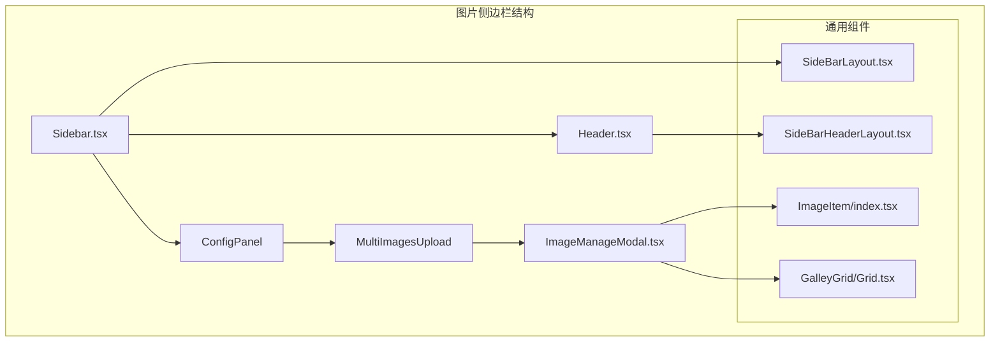
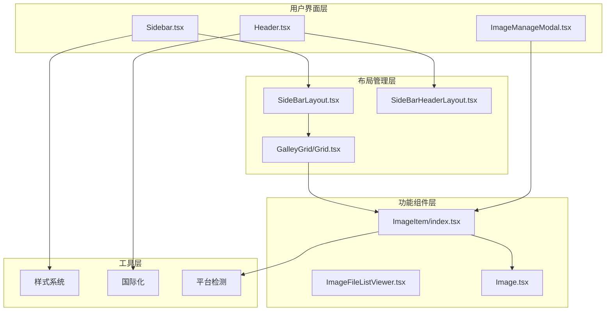
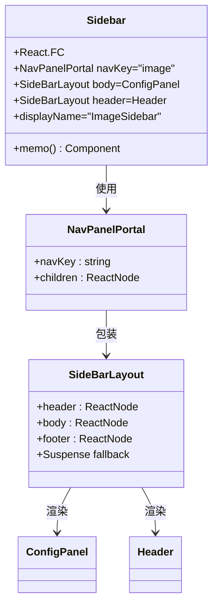
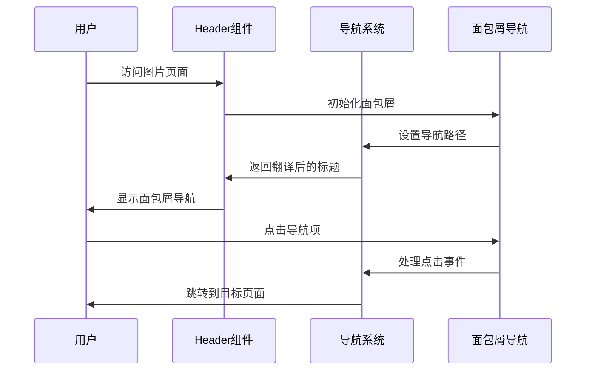
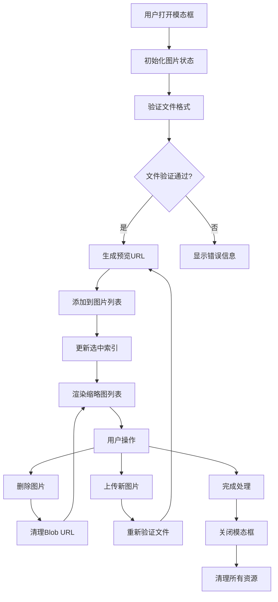
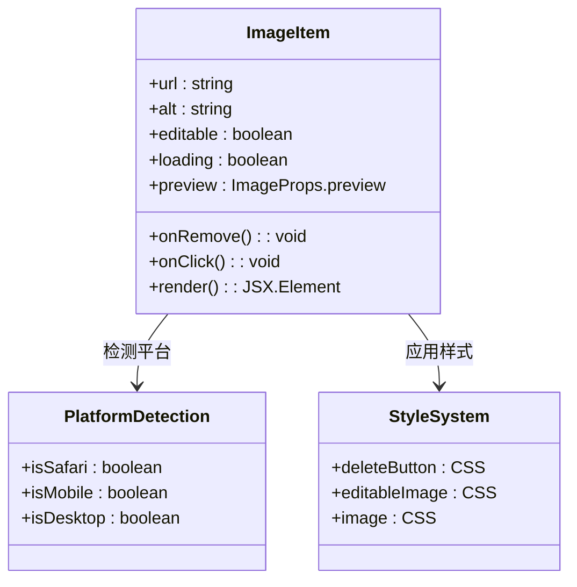
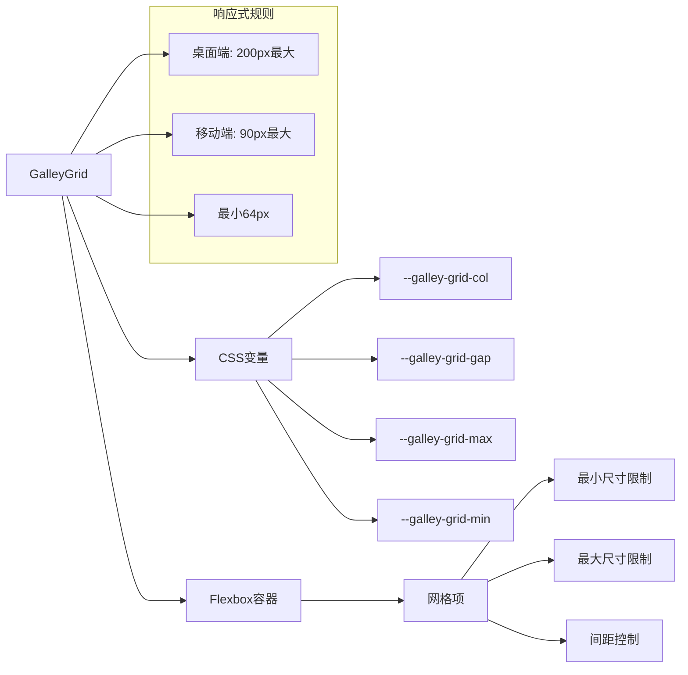

# 图片侧边栏组件

<cite>
**本文档引用的文件**
- [Sidebar.tsx](file://src/routes/(main)/image/_layout/Sidebar.tsx)
- [Header.tsx](file://src/routes/(main)/image/_layout/Header.tsx)
- [SideBarLayout.tsx](file://src/features/NavPanel/SideBarLayout.tsx)
- [SideBarHeaderLayout.tsx](file://src/features/NavPanel/SideBarHeaderLayout.tsx)
- [ImageItem/index.tsx](file://src/components/ImageItem/index.tsx)
- [GalleyGrid/Grid.tsx](file://src/components/GalleyGrid/Grid.tsx)
- [GalleyGrid/style.ts](file://src/components/GalleyGrid/style.ts)
- [ImageFileListViewer.tsx](file://src/features/Conversation/Messages/components/ImageFileListViewer.tsx)
- [Image.tsx](file://src/components/mdx/Image.tsx)
- [ImageManageModal.tsx](file://src/routes/(main)/image/_layout/ConfigPanel/components/MultiImagesUpload/ImageManageModal.tsx)
</cite>

## 目录

1. [简介](#简介)
2. [项目结构](#项目结构)
3. [核心组件](#核心组件)
4. [架构概览](#架构概览)
5. [详细组件分析](#详细组件分析)
6. [依赖关系分析](#依赖关系分析)
7. [性能考虑](#性能考虑)
8. [故障排除指南](#故障排除指南)
9. [结论](#结论)

## 简介

图片侧边栏组件是 LobeHub 应用中的一个关键界面组件，专门用于管理和浏览图片资源。该组件提供了完整的图片浏览、上传、预览和管理功能，支持多图片批量处理、懒加载机制、缓存策略等现代 Web 应用所需的技术特性。

该组件采用模块化设计，通过可复用的子组件构建而成，包括导航面板、图片网格布局、图片项组件等。它集成了响应式设计原则，能够在不同设备和屏幕尺寸下提供一致的用户体验。

## 项目结构

图片侧边栏组件位于应用的路由系统中，采用清晰的层次结构组织：



**图表来源**

- [Sidebar.tsx](<file://src/routes/(main)/image/_layout/Sidebar.tsx#L1-L20>)
- [Header.tsx](<file://src/routes/(main)/image/_layout/Header.tsx#L1-L24>)
- [SideBarLayout.tsx](file://src/features/NavPanel/SideBarLayout.tsx#L1-L29)

**章节来源**

- [Sidebar.tsx](<file://src/routes/(main)/image/_layout/Sidebar.tsx#L1-L20>)
- [Header.tsx](<file://src/routes/(main)/image/_layout/Header.tsx#L1-L24>)

## 核心组件

图片侧边栏组件由多个精心设计的子组件构成，每个组件都有明确的职责和功能：

### 导航面板容器

- **Sidebar.tsx**: 主要的侧边栏容器组件，负责组织整个侧边栏的布局结构
- **SideBarLayout.tsx**: 提供统一的侧边栏布局框架，包含头部、主体和底部区域
- **SideBarHeaderLayout.tsx**: 专门处理面包屑导航和头部内容的布局组件

### 图片展示组件

- **ImageItem/index.tsx**: 单个图片项的渲染组件，支持删除、预览等交互功能
- **GalleyGrid/Grid.tsx**: 响应式的网格布局组件，用于展示图片列表
- **GalleyGrid/style.ts**: 定义网格布局的样式变量和响应式规则

### 图片管理组件

- **ImageManageModal.tsx**: 多图片上传和管理的模态框组件
- **ImageFileListViewer.tsx**: 文件列表查看器，支持图片预览组功能

**章节来源**

- [SideBarLayout.tsx](file://src/features/NavPanel/SideBarLayout.tsx#L1-L29)
- [ImageItem/index.tsx](file://src/components/ImageItem/index.tsx#L1-L87)
- [GalleyGrid/Grid.tsx](file://src/components/GalleyGrid/Grid.tsx#L1-L54)

## 架构概览

图片侧边栏组件采用了分层架构设计，确保了良好的可维护性和扩展性：



**图表来源**

- [Sidebar.tsx](<file://src/routes/(main)/image/_layout/Sidebar.tsx#L1-L20>)
- [SideBarLayout.tsx](file://src/features/NavPanel/SideBarLayout.tsx#L1-L29)
- [ImageItem/index.tsx](file://src/components/ImageItem/index.tsx#L1-L87)

## 详细组件分析

### Sidebar 主组件

Sidebar 组件作为整个图片侧边栏的入口点，采用了简洁而高效的设计模式：



**图表来源**

- [Sidebar.tsx](<file://src/routes/(main)/image/_layout/Sidebar.tsx#L1-L20>)
- [SideBarLayout.tsx](file://src/features/NavPanel/SideBarLayout.tsx#L1-L29)

Sidebar 组件的核心特点：

- 使用 React.memo 进行性能优化
- 通过 NavPanelPortal 实现导航面板的动态挂载
- 采用组合模式，将头部和主体分离
- 支持异步加载和骨架屏显示

**章节来源**

- [Sidebar.tsx](<file://src/routes/(main)/image/_layout/Sidebar.tsx#L1-L20>)

### Header 头部组件

Header 组件负责处理导航和面包屑功能：



**图表来源**

- [Header.tsx](<file://src/routes/(main)/image/_layout/Header.tsx#L1-L24>)
- [SideBarHeaderLayout.tsx](file://src/features/NavPanel/SideBarHeaderLayout.tsx#L1-L149)

Header 组件的关键特性：

- 国际化支持（使用 react-i18next）
- 动态面包屑导航
- 支持返回按钮和面板切换按钮
- 响应式设计适配

**章节来源**

- [Header.tsx](<file://src/routes/(main)/image/_layout/Header.tsx#L1-L24>)

### ImageManageModal 图片管理模态框

ImageManageModal 是图片侧边栏的核心功能组件，提供了完整的图片管理能力：



**图表来源**

- [ImageManageModal.tsx](<file://src/routes/(main)/image/_layout/ConfigPanel/components/MultiImagesUpload/ImageManageModal.tsx#L202-L377>)

ImageManageModal 的主要功能：

- 多图片上传和管理
- 实时预览和缩略图生成
- 内存泄漏防护（Blob URL 清理）
- 批量操作支持
- 错误处理和验证

**章节来源**

- [ImageManageModal.tsx](<file://src/routes/(main)/image/_layout/ConfigPanel/components/MultiImagesUpload/ImageManageModal.tsx#L202-L377>)

### ImageItem 图片项组件

ImageItem 组件提供了单个图片的完整展示和交互功能：



**图表来源**

- [ImageItem/index.tsx](file://src/components/ImageItem/index.tsx#L1-L87)

ImageItem 组件的设计特点：

- 支持编辑模式和只读模式
- 自适应平台差异（特别是 Safari 浏览器）
- 可选的删除操作按钮
- 预览功能集成
- 加载状态指示

**章节来源**

- [ImageItem/index.tsx](file://src/components/ImageItem/index.tsx#L1-L87)

### GalleyGrid 网格布局组件

GalleyGrid 组件实现了响应式的图片网格布局：



**图表来源**

- [GalleyGrid/Grid.tsx](file://src/components/GalleyGrid/Grid.tsx#L1-L54)
- [GalleyGrid/style.ts](file://src/components/GalleyGrid/style.ts#L1-L29)

GalleyGrid 的核心特性：

- CSS 变量驱动的样式系统
- 响应式网格布局
- 可配置的列数、间距和尺寸
- 自动计算网格项的尺寸
- 移动端和桌面端的差异化处理

**章节来源**

- [GalleyGrid/Grid.tsx](file://src/components/GalleyGrid/Grid.tsx#L1-L54)
- [GalleyGrid/style.ts](file://src/components/GalleyGrid/style.ts#L1-L29)

## 依赖关系分析

图片侧边栏组件的依赖关系展现了清晰的分层架构：

```mermaid
graph TB
subgraph "外部依赖"
A[@lobehub/ui]
B[antd]
C[react-i18next]
D[lucide-react]
end
subgraph "内部组件"
E[Sidebar.tsx]
F[Header.tsx]
G[ImageManageModal.tsx]
H[ImageItem/index.tsx]
I[GalleyGrid/Grid.tsx]
end
subgraph "工具和实用程序"
J[样式系统]
K[国际化]
L[平台检测]
M[文件验证]
end
A --> E
B --> F
C --> F
D --> F
E --> G
F --> H
G --> H
H --> I
J --> H
K --> F
L --> H
M --> G
```

**图表来源**

- [Sidebar.tsx](<file://src/routes/(main)/image/_layout/Sidebar.tsx#L1-L20>)
- [ImageManageModal.tsx](<file://src/routes/(main)/image/_layout/ConfigPanel/components/MultiImagesUpload/ImageManageModal.tsx#L202-L377>)

组件间的耦合度分析：

- **低耦合**: 各组件职责明确，相互独立
- **高内聚**: 相关功能集中在同一组件中
- **清晰的依赖链**: 从基础组件到功能组件的层次结构
- **可测试性**: 每个组件都可以独立测试

**章节来源**

- [Sidebar.tsx](<file://src/routes/(main)/image/_layout/Sidebar.tsx#L1-L20>)
- [ImageManageModal.tsx](<file://src/routes/(main)/image/_layout/ConfigPanel/components/MultiImagesUpload/ImageManageModal.tsx#L202-L377>)

## 性能考虑

图片侧边栏组件在设计时充分考虑了性能优化：

### 懒加载机制

- 图片组件使用 `loading="lazy"` 属性实现延迟加载
- IntersectionObserver API 用于智能的可视区域检测
- 骨架屏（Skeleton）提供更好的加载体验

### 内存管理

- Blob URL 的自动清理防止内存泄漏
- 组件卸载时的资源清理机制
- 大图片的缩略图生成和缓存策略

### 缓存策略

- 图片预览的本地缓存
- 国际化资源的缓存
- 样式计算结果的缓存

### 响应式优化

- CSS Grid 的自适应布局
- 不同设备的尺寸优化
- 触摸友好的交互设计

## 故障排除指南

### 常见问题及解决方案

**图片无法显示**

- 检查网络连接和图片 URL
- 验证图片格式是否受支持
- 确认跨域访问权限设置

**内存泄漏问题**

- 确保 Blob URL 在组件卸载时被正确清理
- 检查文件输入元素的值重置
- 验证 useEffect 清理函数的正确性

**性能问题**

- 检查图片尺寸是否过大
- 验证网格布局的列数设置
- 确认懒加载功能正常工作

**章节来源**

- [ImageManageModal.tsx](<file://src/routes/(main)/image/_layout/ConfigPanel/components/MultiImagesUpload/ImageManageModal.tsx#L225-L247>)

## 结论

图片侧边栏组件是一个设计精良、功能完整的图片管理界面。它通过模块化的组件架构、清晰的职责分离和先进的性能优化技术，为用户提供了优秀的图片浏览和管理体验。

该组件的主要优势包括：

- **模块化设计**: 每个组件都有明确的职责和功能边界
- **性能优化**: 采用多种技术确保流畅的用户体验
- **响应式布局**: 适配各种设备和屏幕尺寸
- **可扩展性**: 良好的架构设计便于功能扩展
- **用户体验**: 注重细节的交互设计和反馈机制

通过合理利用这些组件和技术，开发者可以快速构建高效、美观的图片管理界面，满足现代 Web 应用的需求。
