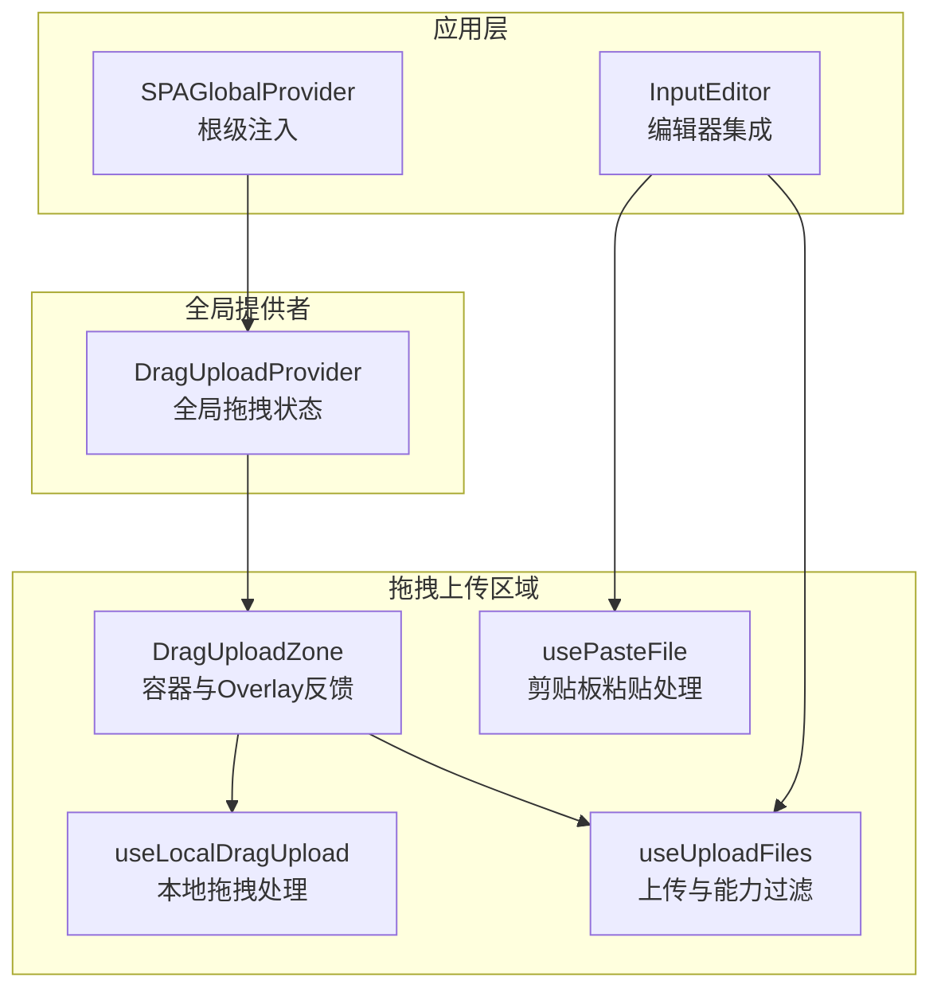
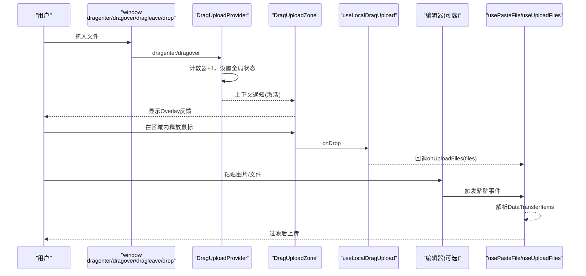
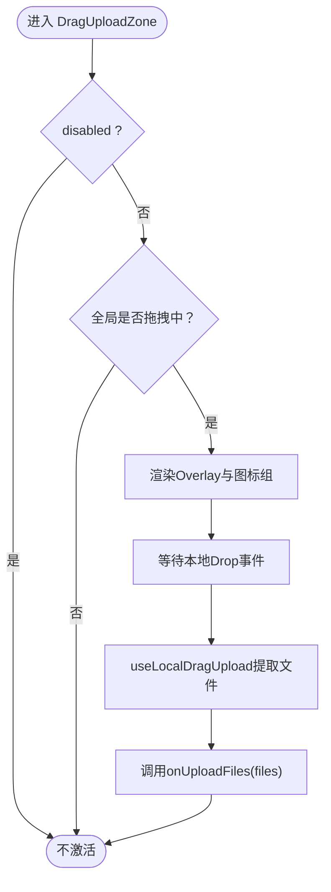
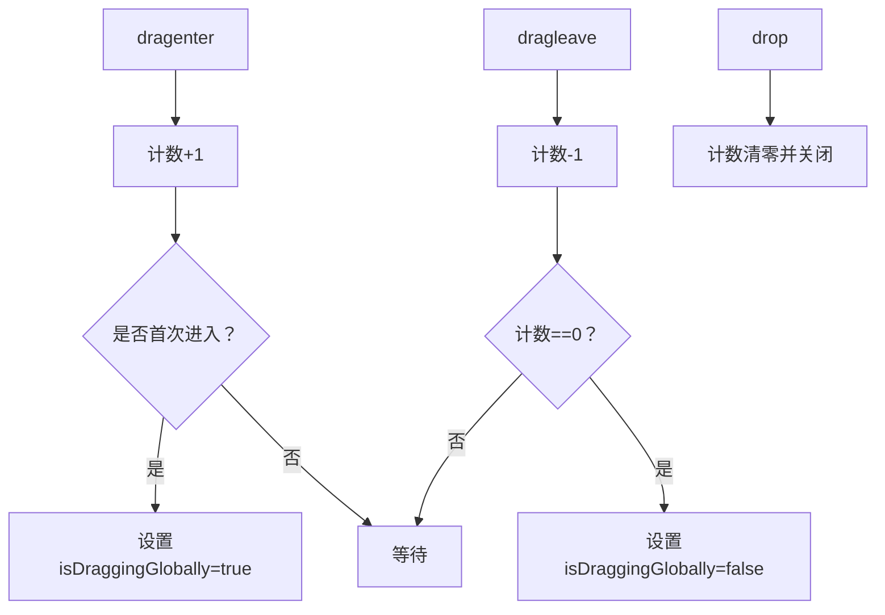
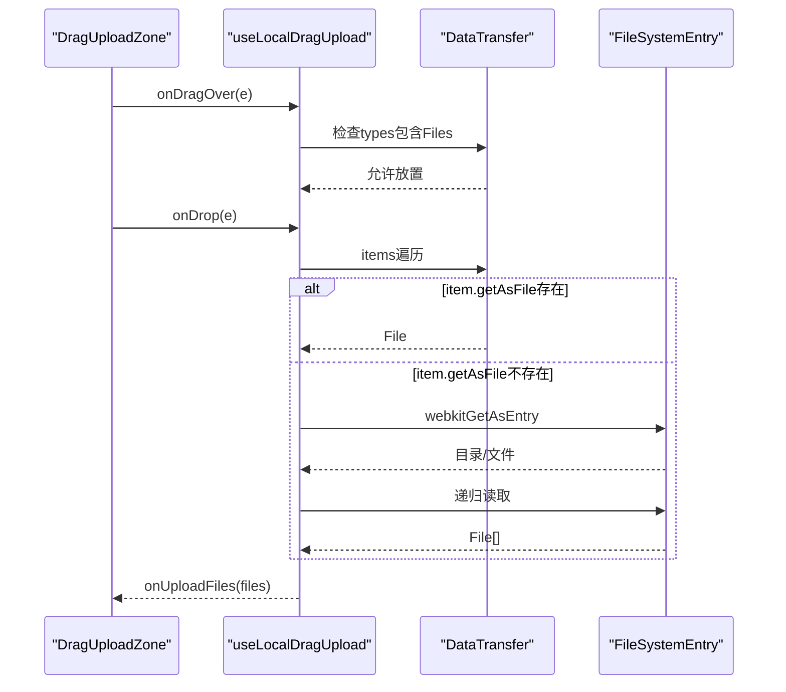
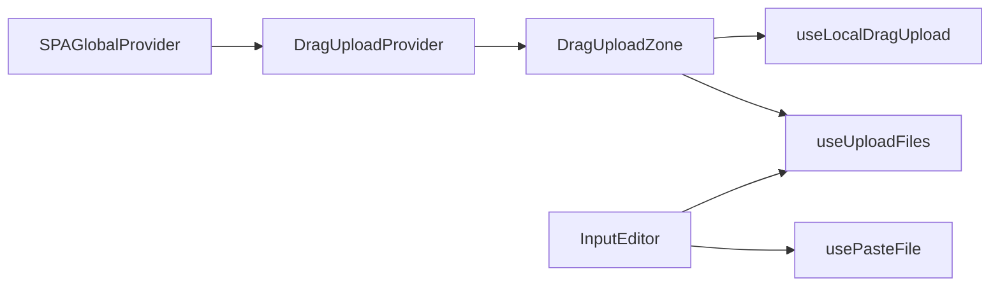

# 拖拽上传区域组件

<cite>
**本文引用的文件**
- [src/components/DragUploadZone/index.tsx](file://src/components/DragUploadZone/index.tsx)
- [src/components/DragUploadZone/DragUploadProvider.tsx](file://src/components/DragUploadZone/DragUploadProvider.tsx)
- [src/components/DragUploadZone/useLocalDragUpload.ts](file://src/components/DragUploadZone/useLocalDragUpload.ts)
- [src/components/DragUploadZone/useUploadFiles.ts](file://src/components/DragUploadZone/useUploadFiles.ts)
- [src/components/DragUploadZone/usePasteFile.ts](file://src/components/DragUploadZone/usePasteFile.ts)
- [src/layout/SPAGlobalProvider/index.tsx](file://src/layout/SPAGlobalProvider/index.tsx)
- [src/features/ChatInput/InputEditor/index.tsx](file://src/features/ChatInput/InputEditor/index.tsx)
- [locales/en-US/components.json](file://locales/en-US/components.json)
- [src/components/DragUpload/index.tsx](file://src/components/DragUpload/index.tsx)
</cite>

## 目录

1. [简介](#简介)
2. [项目结构](#项目结构)
3. [核心组件](#核心组件)
4. [架构总览](#架构总览)
5. [详细组件分析](#详细组件分析)
6. [依赖关系分析](#依赖关系分析)
7. [性能考量](#性能考量)
8. [故障排查指南](#故障排查指南)
9. [结论](#结论)
10. [附录：使用示例与最佳实践](#附录使用示例与最佳实践)

## 简介

本文件系统化梳理 “拖拽上传区域” 组件的设计理念、实现机制与使用方法，覆盖以下关键点：

- 区域激活状态与全局拖拽状态联动
- 拖拽反馈与视觉指示器
- 文件放置检测与多类型文件支持（图片 + 文档）
- 生命周期管理、事件传播与状态同步
- 与全局状态管理的集成、跨组件通信与数据共享
- 动画效果、无障碍访问与可配置性、主题定制、响应式布局

## 项目结构

该组件由 “容器组件 + 全局状态提供者 + 本地拖拽处理 Hook + 剪贴板 Hook + 视觉样式” 构成，并在应用入口进行全局注入。

图表来源

- [src/layout/SPAGlobalProvider/index.tsx](file://src/layout/SPAGlobalProvider/index.tsx#L58-L71)
- [src/components/DragUploadZone/DragUploadProvider.tsx](file://src/components/DragUploadZone/DragUploadProvider.tsx#L31-L84)
- [src/components/DragUploadZone/index.tsx](file://src/components/DragUploadZone/index.tsx#L99-L180)
- [src/components/DragUploadZone/useLocalDragUpload.ts](file://src/components/DragUploadZone/useLocalDragUpload.ts#L85-L134)
- [src/components/DragUploadZone/usePasteFile.ts](file://src/components/DragUploadZone/usePasteFile.ts#L13-L40)
- [src/components/DragUploadZone/useUploadFiles.ts](file://src/components/DragUploadZone/useUploadFiles.ts#L18-L40)
- [src/features/ChatInput/InputEditor/index.tsx](file://src/features/ChatInput/InputEditor/index.tsx#L63-L70)

章节来源

- [src/layout/SPAGlobalProvider/index.tsx](file://src/layout/SPAGlobalProvider/index.tsx#L58-L71)
- [src/components/DragUploadZone/index.tsx](file://src/components/DragUploadZone/index.tsx#L99-L180)

## 核心组件

- DragUploadZone：渲染可拖拽区域与全局高亮 Overlay，负责将本地 Drop 事件与全局状态联动。
- DragUploadProvider：在页面级别维护 isDraggingGlobally，通过计数器精确控制进入 / 离开边界。
- useLocalDragUpload：仅处理 onDragOver/onDrop，允许浏览器允许放置；不阻止事件冒泡，使全局状态生效。
- usePasteFile：监听编辑器的粘贴事件，从剪贴板提取文件并触发上传回调。
- useUploadFiles：根据模型能力（如视觉识别）对上传文件进行过滤，再交由全局文件存储处理。

章节来源

- [src/components/DragUploadZone/index.tsx](file://src/components/DragUploadZone/index.tsx#L67-L97)
- [src/components/DragUploadZone/DragUploadProvider.tsx](file://src/components/DragUploadZone/DragUploadProvider.tsx#L6-L20)
- [src/components/DragUploadZone/useLocalDragUpload.ts](file://src/components/DragUploadZone/useLocalDragUpload.ts#L55-L74)
- [src/components/DragUploadZone/usePasteFile.ts](file://src/components/DragUploadZone/usePasteFile.ts#L13-L29)
- [src/components/DragUploadZone/useUploadFiles.ts](file://src/components/DragUploadZone/useUploadFiles.ts#L18-L39)

## 架构总览

组件采用 “容器 + 提供者 + Hook” 的分层设计，确保：

- 容器组件只负责 UI 展示与事件透传
- 全局提供者统一管理跨区域的状态
- Hook 聚焦单一职责，便于复用与测试

图表来源

- [src/components/DragUploadZone/DragUploadProvider.tsx](file://src/components/DragUploadZone/DragUploadProvider.tsx#L35-L67)
- [src/components/DragUploadZone/index.tsx](file://src/components/DragUploadZone/index.tsx#L111-L121)
- [src/components/DragUploadZone/useLocalDragUpload.ts](file://src/components/DragUploadZone/useLocalDragUpload.ts#L102-L121)
- [src/components/DragUploadZone/usePasteFile.ts](file://src/components/DragUploadZone/usePasteFile.ts#L17-L29)
- [src/features/ChatInput/InputEditor/index.tsx](file://src/features/ChatInput/InputEditor/index.tsx#L63-L70)

## 详细组件分析

### DragUploadZone 组件

- 设计要点
  - 通过全局上下文判断是否显示 Overlay，实现 “全站高亮”
  - 本地 Drop 事件由 useLocalDragUpload 处理，避免重复逻辑
  - 支持 enabledFiles 控制文案与图标组合，适配 “仅图片 / 图片 + 文档” 场景
  - Overlay 内容包含三枚图标与标题 / 描述，配合动画过渡提升反馈
- 关键属性
  - disabled：禁用区域
  - enabledFiles：是否启用文档类型提示
  - onUploadFiles：文件上传回调
  - overlayMinHeight：Overlay 最小高度
  - className/style：自定义样式
- 交互流程
  - 全局激活：DragUploadProvider 设置 isDraggingGlobally → Zone 渲染 Overlay
  - 本地放置：useLocalDragUpload 提取文件列表 → onUploadFiles

图表来源

- [src/components/DragUploadZone/index.tsx](file://src/components/DragUploadZone/index.tsx#L111-L121)
- [src/components/DragUploadZone/useLocalDragUpload.ts](file://src/components/DragUploadZone/useLocalDragUpload.ts#L102-L121)

章节来源

- [src/components/DragUploadZone/index.tsx](file://src/components/DragUploadZone/index.tsx#L67-L97)
- [src/components/DragUploadZone/index.tsx](file://src/components/DragUploadZone/index.tsx#L99-L180)

### DragUploadProvider 全局状态

- 设计要点
  - 使用 ref 计数器跟踪进入 / 离开次数，避免多层嵌套导致误判
  - 仅当 dataTransfer.types 包含 'Files' 时才参与逻辑，过滤非文件拖拽
  - 不阻止事件冒泡，保证与容器组件协作
- 生命周期
  - 挂载：注册 window dragenter/dragover/dragleave/drop 事件
  - 卸载：移除事件监听，防止内存泄漏
- 状态同步
  - isDraggingGlobally 作为上下文值，被所有子树中的 DragUploadZone 读取

图表来源

- [src/components/DragUploadZone/DragUploadProvider.tsx](file://src/components/DragUploadZone/DragUploadProvider.tsx#L35-L67)

章节来源

- [src/components/DragUploadZone/DragUploadProvider.tsx](file://src/components/DragUploadZone/DragUploadProvider.tsx#L31-L84)

### useLocalDragUpload 本地拖拽处理

- 设计要点
  - 仅处理 onDragOver（允许放置）与 onDrop（提取文件），不阻止事件冒泡
  - 支持目录递归解析（webkitGetAsEntry + createReader），兼容多平台
  - Safari 兼容：优先使用 getAsFile，失败回退到 webkitGetAsEntry
- 数据流
  - 从 DataTransferItem 列表提取 File \[]
  - 调用 onUploadFiles，交由上层处理（如 useUploadFiles 进行能力过滤）

图表来源

- [src/components/DragUploadZone/useLocalDragUpload.ts](file://src/components/DragUploadZone/useLocalDragUpload.ts#L29-L53)
- [src/components/DragUploadZone/useLocalDragUpload.ts](file://src/components/DragUploadZone/useLocalDragUpload.ts#L102-L121)

章节来源

- [src/components/DragUploadZone/useLocalDragUpload.ts](file://src/components/DragUploadZone/useLocalDragUpload.ts#L55-L74)
- [src/components/DragUploadZone/useLocalDragUpload.ts](file://src/components/DragUploadZone/useLocalDragUpload.ts#L85-L134)

### usePasteFile 剪贴板处理

- 设计要点
  - 监听编辑器的 onPaste 事件，从 clipboardData 中提取 DataTransferItem
  - 复用本地文件提取逻辑，保持一致性
- 集成位置
  - 在编辑器初始化后绑定，解绑时清理，避免内存泄漏

章节来源

- [src/components/DragUploadZone/usePasteFile.ts](file://src/components/DragUploadZone/usePasteFile.ts#L13-L40)
- [src/features/ChatInput/InputEditor/index.tsx](file://src/features/ChatInput/InputEditor/index.tsx#L63-L70)

### useUploadFiles 模型能力过滤

- 设计要点
  - 依据当前模型 / 提供商是否支持视觉识别，动态过滤图片类文件
  - 将过滤后的文件集合交给全局文件存储处理
- 适用场景
  - 对话输入区、知识库上传等需要按模型能力限制文件类型的场景

章节来源

- [src/components/DragUploadZone/useUploadFiles.ts](file://src/components/DragUploadZone/useUploadFiles.ts#L18-L40)

## 依赖关系分析

- 组件耦合
  - DragUploadZone 依赖 DragUploadProvider 的上下文与 useLocalDragUpload 的容器事件
  - usePasteFile 与 useUploadFiles 依赖 DragUploadZone 的回调接口
- 外部依赖
  - @lobehub/ui：布局与图标组件
  - antd-style：主题变量与样式生成
  - lucide-react：图标库
  - react-i18next：国际化文案
- 入口注入
  - SPAGlobalProvider 将 DragUploadProvider 注入根节点，确保全站可用

图表来源

- [src/layout/SPAGlobalProvider/index.tsx](file://src/layout/SPAGlobalProvider/index.tsx#L58-L71)
- [src/components/DragUploadZone/index.tsx](file://src/components/DragUploadZone/index.tsx#L99-L118)
- [src/features/ChatInput/InputEditor/index.tsx](file://src/features/ChatInput/InputEditor/index.tsx#L24-L70)

章节来源

- [src/layout/SPAGlobalProvider/index.tsx](file://src/layout/SPAGlobalProvider/index.tsx#L58-L71)
- [src/components/DragUploadZone/index.tsx](file://src/components/DragUploadZone/index.tsx#L99-L118)
- [src/features/ChatInput/InputEditor/index.tsx](file://src/features/ChatInput/InputEditor/index.tsx#L24-L70)

## 性能考量

- 事件监听最小化
  - DragUploadProvider 仅监听 window 级别事件，避免在每个区域重复绑定
- 事件冒泡策略
  - useLocalDragUpload 不阻止冒泡，减少重复处理与状态冲突
- 异步解析
  - 目录递归解析使用 Promise.all 并行提取，提升大目录处理效率
- 样式与动画
  - Overlay 使用过渡动画，避免频繁重排；图标尺寸与变换通过静态样式计算，降低运行时开销

\[本节为通用性能建议，无需特定文件引用]

## 故障排查指南

- 问题：拖拽进入区域但 Overlay 未显示
  - 检查 DragUploadProvider 是否正确注入到根节点
  - 确认 dataTransfer.types 是否包含 'Files'
  - 排查 disabled 属性是否被意外开启
- 问题：Drop 事件未触发或文件为空
  - 确认 useLocalDragUpload 的 onDrop 是否被调用
  - 检查 DataTransferItem 类型与浏览器兼容性（Safari 回退路径）
- 问题：粘贴无响应
  - 确认 usePasteFile 已绑定到编辑器实例
  - 检查 clipboardData 是否存在
- 问题：图片被过滤导致无法上传
  - 检查 useUploadFiles 的模型能力判断逻辑
  - 确认当前模型 / 提供商是否支持视觉识别

章节来源

- [src/components/DragUploadZone/DragUploadProvider.tsx](file://src/components/DragUploadZone/DragUploadProvider.tsx#L35-L67)
- [src/components/DragUploadZone/useLocalDragUpload.ts](file://src/components/DragUploadZone/useLocalDragUpload.ts#L102-L121)
- [src/components/DragUploadZone/usePasteFile.ts](file://src/components/DragUploadZone/usePasteFile.ts#L17-L29)
- [src/components/DragUploadZone/useUploadFiles.ts](file://src/components/DragUploadZone/useUploadFiles.ts#L24-L35)

## 结论

该组件以 “全局状态 + 容器 + Hook” 的模式实现了跨区域、跨组件的一致拖拽上传体验。通过清晰的职责划分与事件传播策略，既保证了良好的用户体验，又具备良好的可扩展性与可维护性。结合模型能力过滤与剪贴板支持，进一步提升了在不同场景下的实用性。

\[本节为总结性内容，无需特定文件引用]

## 附录：使用示例与最佳实践

### 在编辑器中集成拖拽与粘贴上传

- 步骤
  - 在编辑器初始化后，调用 useUploadFiles 获取 handleUploadFiles
  - 使用 usePasteFile 绑定编辑器的粘贴事件
  - 将 handleUploadFiles 传给 DragUploadZone 的 onUploadFiles
- 示例参考
  - 编辑器集成位置与参数传递

章节来源

- [src/features/ChatInput/InputEditor/index.tsx](file://src/features/ChatInput/InputEditor/index.tsx#L63-L70)
- [src/components/DragUploadZone/useUploadFiles.ts](file://src/components/DragUploadZone/useUploadFiles.ts#L18-L39)
- [src/components/DragUploadZone/usePasteFile.ts](file://src/components/DragUploadZone/usePasteFile.ts#L13-L40)

### 文案与国际化

- 组件文案来自国际化资源，支持 “仅图片 / 图片 + 文档” 两种提示
- 可通过切换 enabledFiles 控制文案与图标组合

章节来源

- [locales/en-US/components.json](file://locales/en-US/components.json#L5-L8)
- [src/components/DragUploadZone/index.tsx](file://src/components/DragUploadZone/index.tsx#L166-L171)

### 主题与样式定制

- 使用 antd-style 的主题变量与 createStaticStyles 生成样式
- Overlay 背景、图标颜色、圆角等均可通过主题变量统一调整
- Overlay 最小高度可通过 overlayMinHeight 自定义

章节来源

- [src/components/DragUploadZone/index.tsx](file://src/components/DragUploadZone/index.tsx#L16-L65)
- [src/components/DragUploadZone/index.tsx](file://src/components/DragUploadZone/index.tsx#L104-L106)

### 响应式布局与无障碍访问

- 响应式：Overlay 内容居中布局，图标组与文字垂直排列，适应不同屏幕尺寸
- 无障碍：Overlay 为视觉反馈，不改变语义结构；建议在容器上补充 aria-label 或 role 以增强可访问性

章节来源

- [src/components/DragUploadZone/index.tsx](file://src/components/DragUploadZone/index.tsx#L123-L177)

### 与全局状态管理的集成

- 全局状态：DragUploadProvider 在根节点注入，提供 isDraggingGlobally
- 组件内消费：DragUploadZone 通过上下文读取状态，实现跨区域联动
- 应用层：编辑器等组件通过 useUploadFiles/usePasteFile 与上传链路对接

章节来源

- [src/layout/SPAGlobalProvider/index.tsx](file://src/layout/SPAGlobalProvider/index.tsx#L58-L71)
- [src/components/DragUploadZone/index.tsx](file://src/components/DragUploadZone/index.tsx#L111-L112)
- [src/components/DragUploadZone/useUploadFiles.ts](file://src/components/DragUploadZone/useUploadFiles.ts#L18-L39)

### 与全局拖拽反馈组件的关系

- DragUploadZone 是 “区域级” 反馈，仅在区域内高亮
- DragUpload 是 “全局级” 反馈，常用于全屏遮罩式提示
- 两者可并存：区域级用于精准放置，全局级用于引导操作

章节来源

- [src/components/DragUpload/index.tsx](file://src/components/DragUpload/index.tsx#L81-L124)
- [src/components/DragUploadZone/index.tsx](file://src/components/DragUploadZone/index.tsx#L123-L177)
