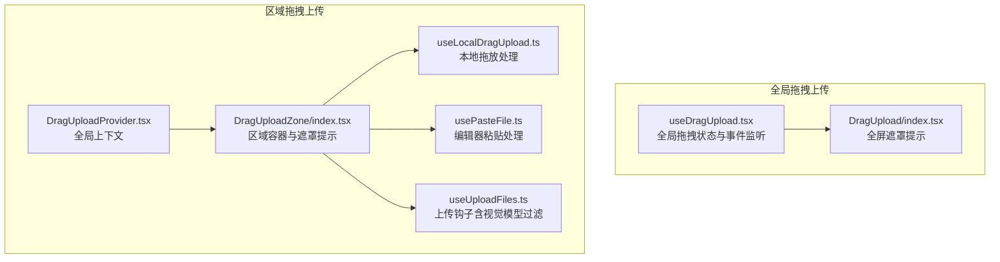
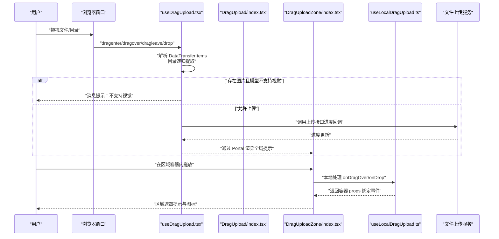
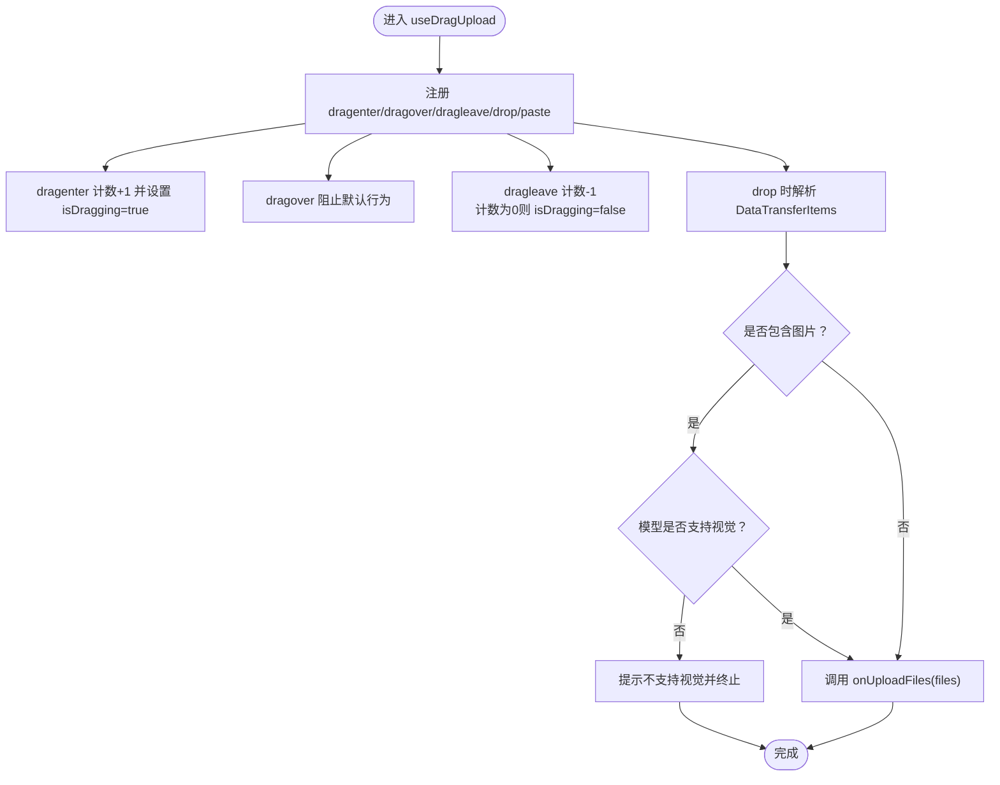
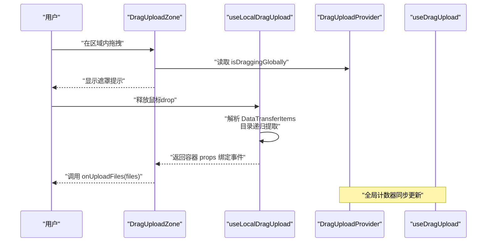
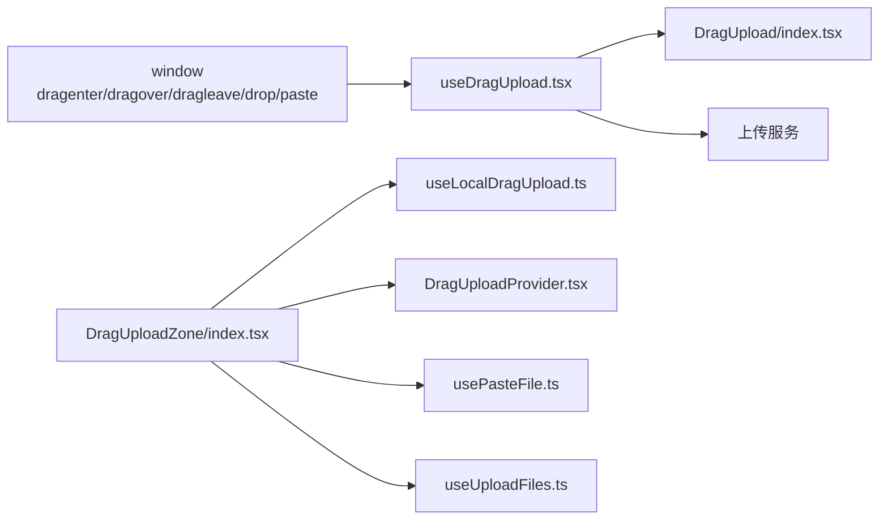

# 拖拽上传组件

<cite>
**本文引用的文件**
- [src/components/DragUploadZone/DragUploadProvider.tsx](file://src/components/DragUploadZone/DragUploadProvider.tsx)
- [src/components/DragUploadZone/index.tsx](file://src/components/DragUploadZone/index.tsx)
- [src/components/DragUploadZone/useLocalDragUpload.ts](file://src/components/DragUploadZone/useLocalDragUpload.ts)
- [src/components/DragUploadZone/usePasteFile.ts](file://src/components/DragUploadZone/usePasteFile.ts)
- [src/components/DragUploadZone/useUploadFiles.ts](file://src/components/DragUploadZone/useUploadFiles.ts)
- [src/components/DragUpload/index.tsx](file://src/components/DragUpload/index.tsx)
- [src/components/DragUpload/useDragUpload.tsx](file://src/components/DragUpload/useDragUpload.tsx)
- [src/routes/(main)/image/_layout/ConfigPanel/components/ImageUpload.tsx](file://src/routes/(main)/image/_layout/ConfigPanel/components/ImageUpload.tsx)
- [src/routes/(main)/image/_layout/ConfigPanel/utils/imageValidation.ts](file://src/routes/(main)/image/_layout/ConfigPanel/utils/imageValidation.ts)
- [src/store/file/slices/fileManager/action.ts](file://src/store/file/slices/fileManager/action.ts)
- [src/store/file/reducers/uploadFileList.ts](file://src/store/file/reducers/uploadFileList.ts)
- [src/services/upload.ts](file://src/services/upload.ts)
- [apps/mobile/src/store/file.ts](file://apps/mobile/src/store/file.ts)
</cite>

## 目录

1. [简介](#简介)
2. [项目结构](#项目结构)
3. [核心组件](#核心组件)
4. [架构总览](#架构总览)
5. [详细组件分析](#详细组件分析)
6. [依赖关系分析](#依赖关系分析)
7. [性能考量](#性能考量)
8. [故障排查指南](#故障排查指南)
9. [结论](#结论)
10. [附录：使用示例与最佳实践](#附录使用示例与最佳实践)

## 简介

本文件系统性地介绍拖拽上传组件的设计与实现，覆盖拖拽区域识别、文件选择机制、上传进度跟踪、事件处理、文件验证、批量上传与并发控制、状态管理与视觉反馈、以及与文件上传服务的集成方式。文档同时给出端到端的使用流程与常见问题排查建议，帮助开发者快速构建直观、可靠的拖拽上传体验。

## 项目结构

拖拽上传相关能力由两套组件协同实现：

- 全局级拖拽上传：在页面级别监听拖拽事件，统一管理全局拖拽状态，并通过 Portal 在全屏遮罩层渲染 “拖拽提示”。
- 区域级拖拽上传：在指定容器内监听拖放事件，仅处理该区域内的拖放行为，同时与全局状态联动以提供一致的视觉反馈。

图表来源

- [src/components/DragUpload/useDragUpload.tsx](file://src/components/DragUpload/useDragUpload.tsx#L70-L185)
- [src/components/DragUpload/index.tsx](file://src/components/DragUpload/index.tsx#L81-L124)
- [src/components/DragUploadZone/DragUploadProvider.tsx](file://src/components/DragUploadZone/DragUploadProvider.tsx#L31-L84)
- [src/components/DragUploadZone/index.tsx](file://src/components/DragUploadZone/index.tsx#L99-L179)
- [src/components/DragUploadZone/useLocalDragUpload.ts](file://src/components/DragUploadZone/useLocalDragUpload.ts#L85-L134)
- [src/components/DragUploadZone/usePasteFile.ts](file://src/components/DragUploadZone/usePasteFile.ts#L13-L40)
- [src/components/DragUploadZone/useUploadFiles.ts](file://src/components/DragUploadZone/useUploadFiles.ts#L18-L40)

章节来源

- [src/components/DragUpload/useDragUpload.tsx](file://src/components/DragUpload/useDragUpload.tsx#L70-L185)
- [src/components/DragUpload/index.tsx](file://src/components/DragUpload/index.tsx#L81-L124)
- [src/components/DragUploadZone/DragUploadProvider.tsx](file://src/components/DragUploadZone/DragUploadProvider.tsx#L31-L84)
- [src/components/DragUploadZone/index.tsx](file://src/components/DragUploadZone/index.tsx#L99-L179)
- [src/components/DragUploadZone/useLocalDragUpload.ts](file://src/components/DragUploadZone/useLocalDragUpload.ts#L85-L134)
- [src/components/DragUploadZone/usePasteFile.ts](file://src/components/DragUploadZone/usePasteFile.ts#L13-L40)
- [src/components/DragUploadZone/useUploadFiles.ts](file://src/components/DragUploadZone/useUploadFiles.ts#L18-L40)

## 核心组件

- 全局拖拽上传
  - useDragUpload：在窗口级别监听 dragenter/dragover/dragleave/drop/paste，维护 isDragging 状态；支持目录拖拽解析、剪贴板文件提取、视觉模型能力过滤与警告提示。
  - DragUpload：基于 Portal 渲染全屏遮罩提示，配合国际化文案与图标，提供统一的拖拽反馈。
- 区域拖拽上传
  - DragUploadProvider：提供全局上下文，跨页面共享 isDraggingGlobally，确保任意位置拖拽时所有区域高亮。
  - DragUploadZone：在容器内渲染遮罩提示，结合 enabledFiles 控制显示文案与图标；通过 useLocalDragUpload 处理本地拖放事件。
  - useLocalDragUpload：解析 DataTransferItems，兼容 Safari 的 webkitGetAsEntry，支持文件与目录递归提取。
  - usePasteFile：监听 @lobehub/editor 的粘贴事件，提取剪贴板中的文件并触发上传。
  - useUploadFiles：根据当前模型是否支持视觉能力，过滤图片类文件后交由文件存储层处理。

章节来源

- [src/components/DragUpload/useDragUpload.tsx](file://src/components/DragUpload/useDragUpload.tsx#L70-L185)
- [src/components/DragUpload/index.tsx](file://src/components/DragUpload/index.tsx#L81-L124)
- [src/components/DragUploadZone/DragUploadProvider.tsx](file://src/components/DragUploadZone/DragUploadProvider.tsx#L31-L84)
- [src/components/DragUploadZone/index.tsx](file://src/components/DragUploadZone/index.tsx#L99-L179)
- [src/components/DragUploadZone/useLocalDragUpload.ts](file://src/components/DragUploadZone/useLocalDragUpload.ts#L85-L134)
- [src/components/DragUploadZone/usePasteFile.ts](file://src/components/DragUploadZone/usePasteFile.ts#L13-L40)
- [src/components/DragUploadZone/useUploadFiles.ts](file://src/components/DragUploadZone/useUploadFiles.ts#L18-L40)

## 架构总览

拖拽上传的整体数据流与控制流如下：

图表来源

- [src/components/DragUpload/useDragUpload.tsx](file://src/components/DragUpload/useDragUpload.tsx#L139-L155)
- [src/components/DragUpload/index.tsx](file://src/components/DragUpload/index.tsx#L88-L123)
- [src/components/DragUploadZone/index.tsx](file://src/components/DragUploadZone/index.tsx#L123-L178)
- [src/components/DragUploadZone/useLocalDragUpload.ts](file://src/components/DragUploadZone/useLocalDragUpload.ts#L102-L121)
- [src/services/upload.ts](file://src/services/upload.ts#L162-L204)

## 详细组件分析

### 全局拖拽上传：useDragUpload

- 功能要点
  - 维护 isDragging 状态，使用计数器避免误判（当拖拽在窗口内移动时不会错误置为 false）。
  - 支持目录拖拽：通过 webkitGetAsEntry 递归遍历目录，提取全部文件。
  - 剪贴板支持：监听 paste 事件，从 clipboardData 中提取文件。
  - 视觉模型能力过滤：若当前模型不支持视觉，对图片类文件进行警告提示并阻止上传。
  - Portal 容器：动态创建根节点用于渲染全局遮罩提示。
- 关键流程图

图表来源

- [src/components/DragUpload/useDragUpload.tsx](file://src/components/DragUpload/useDragUpload.tsx#L83-L137)
- [src/components/DragUpload/useDragUpload.tsx](file://src/components/DragUpload/useDragUpload.tsx#L139-L155)

章节来源

- [src/components/DragUpload/useDragUpload.tsx](file://src/components/DragUpload/useDragUpload.tsx#L70-L185)

### 区域拖拽上传：DragUploadZone 与 useLocalDragUpload

- 功能要点
  - DragUploadZone 通过 DragUploadProvider 获取全局拖拽状态，决定是否显示遮罩提示。
  - useLocalDragUpload 仅处理容器内的 dragover 与 drop 事件，不阻止冒泡，以便全局监听器同步状态。
  - 支持多文件与目录拖拽，兼容 Safari 的 webkitGetAsEntry。
- 交互序列图

图表来源

- [src/components/DragUploadZone/index.tsx](file://src/components/DragUploadZone/index.tsx#L111-L121)
- [src/components/DragUploadZone/useLocalDragUpload.ts](file://src/components/DragUploadZone/useLocalDragUpload.ts#L102-L121)
- [src/components/DragUploadZone/DragUploadProvider.tsx](file://src/components/DragUploadZone/DragUploadProvider.tsx#L35-L67)
- [src/components/DragUpload/useDragUpload.tsx](file://src/components/DragUpload/useDragUpload.tsx#L83-L108)

章节来源

- [src/components/DragUploadZone/index.tsx](file://src/components/DragUploadZone/index.tsx#L99-L179)
- [src/components/DragUploadZone/useLocalDragUpload.ts](file://src/components/DragUploadZone/useLocalDragUpload.ts#L85-L134)
- [src/components/DragUploadZone/DragUploadProvider.tsx](file://src/components/DragUploadZone/DragUploadProvider.tsx#L31-L84)

### 文件验证与批量上传

- 文件验证
  - 图片尺寸与数量校验：提供图片尺寸读取、数量上限与大小上限的组合校验。
  - 视频大小校验：针对视频文件提供固定大小限制。
- 批量上传与队列管理
  - 文件管理器将 ZIP 自动解压并加入上传队列，黑名单过滤，每个文件生成独立上传项与中断控制器。
  - 上传队列支持在队首或队尾添加，状态与进度通过 Redux 风格的 reducer 更新。
- 进度跟踪与错误处理
  - 上传服务通过 XHR 监听 progress，计算速度与剩余时间；网络异常与服务器错误分别处理。
  - 移动端 Store 提供并发上传与失败重试策略参考。

章节来源

- [src/routes/(main)/image/\_layout/ConfigPanel/utils/imageValidation.ts](<file://src/routes/(main)/image/_layout/ConfigPanel/utils/imageValidation.ts#L52-L101>)
- [src/routes/(main)/image/\_layout/ConfigPanel/utils/imageValidation.ts](<file://src/routes/(main)/image/_layout/ConfigPanel/utils/imageValidation.ts#L166-L206>)
- [src/store/file/slices/fileManager/action.ts](file://src/store/file/slices/fileManager/action.ts#L171-L207)
- [src/store/file/reducers/uploadFileList.ts](file://src/store/file/reducers/uploadFileList.ts#L58-L77)
- [src/services/upload.ts](file://src/services/upload.ts#L162-L204)
- [apps/mobile/src/store/file.ts](file://apps/mobile/src/store/file.ts#L45-L76)

### 与上传服务的集成

- 浏览器端上传
  - 通过预签名 URL 使用 XHR PUT 上传，实时上报进度（上传中、成功、失败、取消）。
- 移动端上传
  - Store 层封装上传流程，支持批量并发上传与失败回退。

章节来源

- [src/services/upload.ts](file://src/services/upload.ts#L162-L204)
- [apps/mobile/src/store/file.ts](file://apps/mobile/src/store/file.ts#L45-L76)

## 依赖关系分析

- 组件耦合
  - DragUploadZone 依赖 DragUploadProvider 提供全局状态；依赖 useLocalDragUpload 处理本地事件；可选依赖 usePasteFile 与 useUploadFiles。
  - useDragUpload 作为全局监听器，与 DragUpload 提示组件通过 Portal 协作。
- 数据流
  - 事件自外向内传播：window -> useDragUpload -> DragUpload；容器内：useLocalDragUpload -> DragUploadZone。
  - 上传结果通过 onUploadFiles 回调进入文件管理与状态更新链路。

图表来源

- [src/components/DragUpload/useDragUpload.tsx](file://src/components/DragUpload/useDragUpload.tsx#L168-L182)
- [src/components/DragUpload/index.tsx](file://src/components/DragUpload/index.tsx#L88-L123)
- [src/components/DragUploadZone/index.tsx](file://src/components/DragUploadZone/index.tsx#L123-L178)
- [src/components/DragUploadZone/useLocalDragUpload.ts](file://src/components/DragUploadZone/useLocalDragUpload.ts#L123-L129)
- [src/components/DragUploadZone/DragUploadProvider.tsx](file://src/components/DragUploadZone/DragUploadProvider.tsx#L69-L81)

## 性能考量

- 目录递归提取
  - 目录读取采用 Promise.all 并行处理子项，提升大目录的提取效率；注意避免过深层级导致内存压力。
- 事件监听
  - 全局监听器仅在首次挂载时创建容器与绑定事件；卸载时清理，避免重复绑定。
- 进度上报
  - 上传进度按事件节流上报，避免频繁重渲染；移动端 Store 可通过并发控制减少请求峰值。
- 视觉模型过滤
  - 在上传前进行能力判断与过滤，减少无效请求与后续错误处理成本。

\[本节为通用指导，无需列出具体文件来源]

## 故障排查指南

- 常见问题
  - Safari 下目录拖拽异常：组件已优先使用 getAsFile，再回退到 webkitGetAsEntry；若仍失败，请检查浏览器兼容性。
  - 模型不支持视觉导致无法上传图片：组件会弹出警告提示；请切换至支持视觉的模型或移除图片文件。
  - 上传进度未更新：确认上传服务正确回调 onProgress，且未被拦截或跨域阻断。
  - 上传失败：检查网络状态与服务端响应码；移动端 Store 提供失败回退逻辑，可参考其错误分支处理。
- 排查步骤
  - 打开浏览器开发者工具，观察 dragenter/dragleave 事件计数是否一致。
  - 在控制台打印 DataTransferItems，确认文件列表非空。
  - 检查 onUploadFiles 回调是否被调用，以及后续状态更新是否生效。

章节来源

- [src/components/DragUpload/useDragUpload.tsx](file://src/components/DragUpload/useDragUpload.tsx#L139-L155)
- [src/components/DragUploadZone/useLocalDragUpload.ts](file://src/components/DragUploadZone/useLocalDragUpload.ts#L29-L53)
- [src/services/upload.ts](file://src/services/upload.ts#L192-L200)

## 结论

该拖拽上传组件体系通过 “全局监听 + 区域处理” 的双层设计，实现了跨页面一致的拖拽体验与高效的文件处理能力。结合文件验证、批量上传与进度跟踪，能够满足复杂场景下的上传需求。建议在实际项目中：

- 明确模型能力与文件类型约束，提前过滤不支持的文件；
- 合理配置上传并发与队列策略，平衡吞吐与稳定性；
- 提供清晰的视觉反馈与错误提示，优化用户体验。

\[本节为总结性内容，无需列出具体文件来源]

## 附录：使用示例与最佳实践

- 全局拖拽上传
  - 在应用入口包裹 DragUploadProvider，并在需要的位置渲染 DragUpload，即可获得全屏拖拽提示。
  - 示例路径：[src/components/DragUpload/index.tsx](file://src/components/DragUpload/index.tsx#L81-L124)
- 区域拖拽上传
  - 在目标容器内渲染 DragUploadZone，并传入 onUploadFiles 回调；如需支持粘贴上传，可结合 usePasteFile。
  - 示例路径：[src/components/DragUploadZone/index.tsx](file://src/components/DragUploadZone/index.tsx#L99-L179)，[src/components/DragUploadZone/usePasteFile.ts](file://src/components/DragUploadZone/usePasteFile.ts#L13-L40)
- 文件验证与批量上传
  - 使用图像验证工具进行尺寸与数量校验；ZIP 文件自动解压；上传队列支持在队首 / 队尾插入。
  - 示例路径：[src/routes/(main)/image/\_layout/ConfigPanel/utils/imageValidation.ts](<file://src/routes/(main)/image/_layout/ConfigPanel/utils/imageValidation.ts#L166-L206>)，[src/store/file/slices/fileManager/action.ts](file://src/store/file/slices/fileManager/action.ts#L171-L207)
- 上传进度与错误处理
  - 通过上传服务回调 onProgress 实时更新进度；网络异常与服务器错误分别处理。
  - 示例路径：[src/services/upload.ts](file://src/services/upload.ts#L162-L204)
- 与聊天场景集成
  - 在图片上传页组件中，结合上传进度回调更新 UI 状态，实现预览与进度条联动。
  - 示例路径：[src/routes/(main)/image/\_layout/ConfigPanel/components/ImageUpload.tsx](<file://src/routes/(main)/image/_layout/ConfigPanel/components/ImageUpload.tsx#L467-L588>)

章节来源

- [src/components/DragUpload/index.tsx](file://src/components/DragUpload/index.tsx#L81-L124)
- [src/components/DragUploadZone/index.tsx](file://src/components/DragUploadZone/index.tsx#L99-L179)
- [src/components/DragUploadZone/usePasteFile.ts](file://src/components/DragUploadZone/usePasteFile.ts#L13-L40)
- [src/routes/(main)/image/\_layout/ConfigPanel/utils/imageValidation.ts](<file://src/routes/(main)/image/_layout/ConfigPanel/utils/imageValidation.ts#L166-L206>)
- [src/store/file/slices/fileManager/action.ts](file://src/store/file/slices/fileManager/action.ts#L171-L207)
- [src/services/upload.ts](file://src/services/upload.ts#L162-L204)
- [src/routes/(main)/image/\_layout/ConfigPanel/components/ImageUpload.tsx](<file://src/routes/(main)/image/_layout/ConfigPanel/components/ImageUpload.tsx#L467-L588>)
