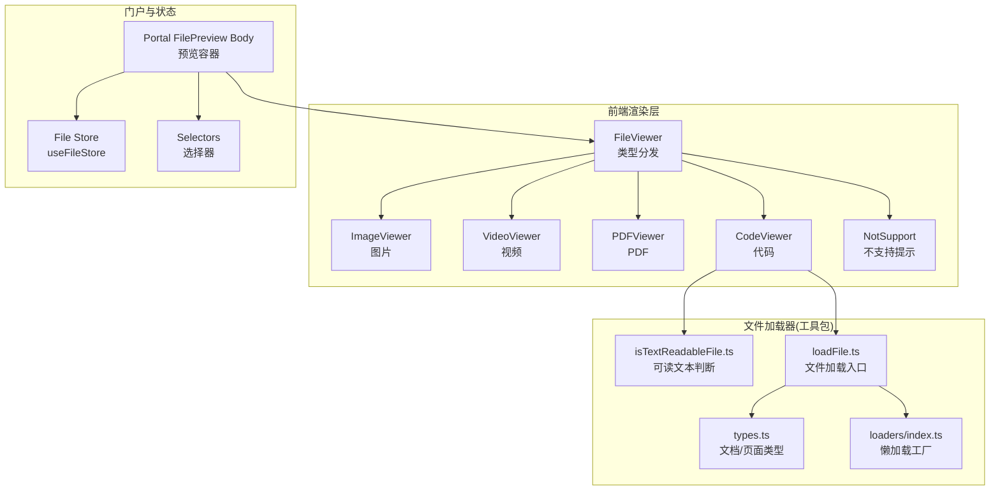
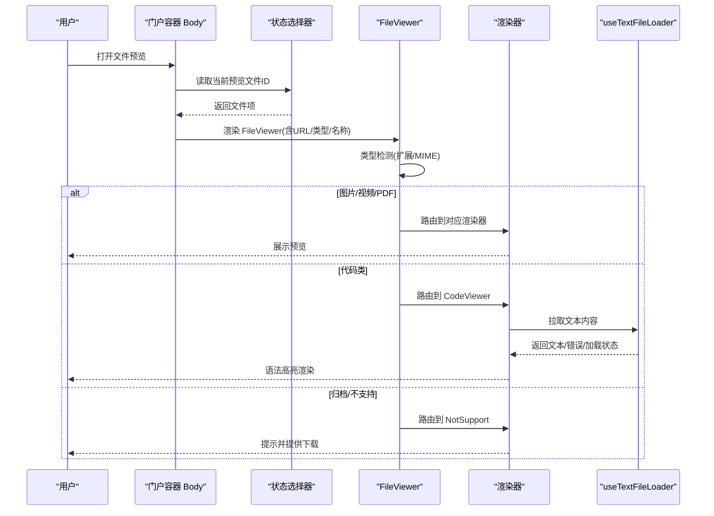
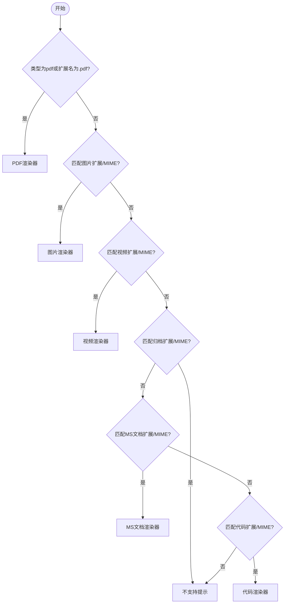
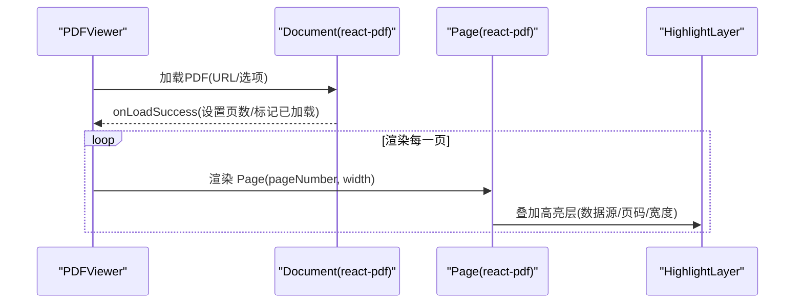
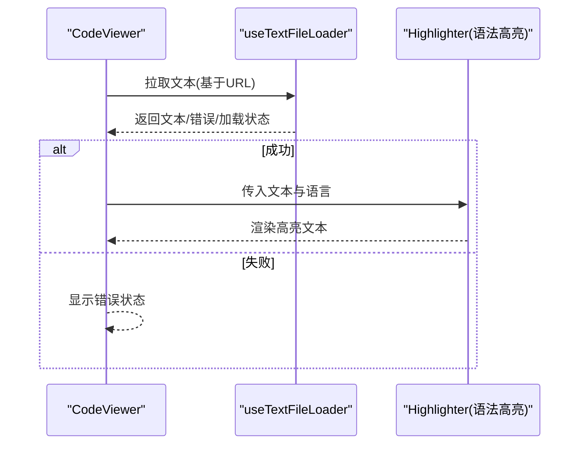
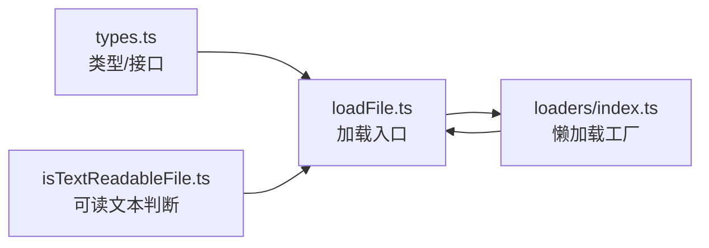

# 文件查看器组件

<cite>
**本文引用的文件**
- [src/features/FileViewer/index.tsx](file://src/features/FileViewer/index.tsx)
- [src/features/FileViewer/Renderer/Code/index.tsx](file://src/features/FileViewer/Renderer/Code/index.tsx)
- [src/features/FileViewer/Renderer/Image/index.tsx](file://src/features/FileViewer/Renderer/Image/index.tsx)
- [src/features/FileViewer/Renderer/PDF/index.tsx](file://src/features/FileViewer/Renderer/PDF/index.tsx)
- [src/features/FileViewer/Renderer/Video/index.tsx](file://src/features/FileViewer/Renderer/Video/index.tsx)
- [src/features/FileViewer/hooks/useTextFileLoader.ts](file://src/features/FileViewer/hooks/useTextFileLoader.ts)
- [src/features/FileViewer/NotSupport/index.tsx](file://src/features/FileViewer/NotSupport/index.tsx)
- [src/features/Portal/FilePreview/Body/index.tsx](file://src/features/Portal/FilePreview/Body/index.tsx)
- [packages/file-loaders/src/types.ts](file://packages/file-loaders/src/types.ts)
- [packages/file-loaders/src/utils/isTextReadableFile.ts](file://packages/file-loaders/src/utils/isTextReadableFile.ts)
- [packages/file-loaders/src/loaders/index.ts](file://packages/file-loaders/src/loaders/index.ts)
- [packages/file-loaders/src/loadFile.ts](file://packages/file-loaders/src/loadFile.ts)
- [src/store/file/store.ts](file://src/store/file/store.ts)
- [src/routes/(main)/resource/features/store/selectors.ts](file://src/routes/(main)/resource/features/store/selectors.ts)
</cite>

## 目录
1. [简介](#简介)
2. [项目结构](#项目结构)
3. [核心组件](#核心组件)
4. [架构总览](#架构总览)
5. [组件详解](#组件详解)
6. [依赖关系分析](#依赖关系分析)
7. [性能考量](#性能考量)
8. [故障排查指南](#故障排查指南)
9. [结论](#结论)
10. [附录：使用示例与最佳实践](#附录使用示例与最佳实践)

## 简介
本文件查看器组件提供对多种文件类型的在线预览能力，覆盖图片、视频、PDF、Microsoft Office 文档以及大量代码类文本文件。系统通过“类型检测 + 渲染器分发”的架构，将不同文件类型路由到对应的渲染器；同时提供文本文件的异步加载与高亮显示、PDF 的分页渲染与高亮层叠加、不支持类型的提示与下载引导等完整体验。

## 项目结构
文件查看器相关代码主要分布在以下位置：
- 前端渲染层：src/features/FileViewer 及其子渲染器（图片、视频、PDF、代码）
- 文本加载钩子：src/features/FileViewer/hooks/useTextFileLoader.ts
- 不支持类型提示与下载：src/features/FileViewer/NotSupport/index.tsx
- 预览门户容器：src/features/Portal/FilePreview/Body/index.tsx
- 文件加载器（服务端/工具包）：packages/file-loaders/src 下的类型、动态加载器工厂与文件加载入口
- 状态与选择器：src/store/file 与路由资源选择器

图表来源
- [src/features/FileViewer/index.tsx](file://src/features/FileViewer/index.tsx#L1-L280)
- [src/features/FileViewer/Renderer/Image/index.tsx](file://src/features/FileViewer/Renderer/Image/index.tsx#L1-L39)
- [src/features/FileViewer/Renderer/Video/index.tsx](file://src/features/FileViewer/Renderer/Video/index.tsx#L1-L48)
- [src/features/FileViewer/Renderer/PDF/index.tsx](file://src/features/FileViewer/Renderer/PDF/index.tsx#L1-L92)
- [src/features/FileViewer/Renderer/Code/index.tsx](file://src/features/FileViewer/Renderer/Code/index.tsx#L1-L225)
- [src/features/FileViewer/NotSupport/index.tsx](file://src/features/FileViewer/NotSupport/index.tsx#L1-L69)
- [src/features/Portal/FilePreview/Body/index.tsx](file://src/features/Portal/FilePreview/Body/index.tsx#L1-L70)
- [packages/file-loaders/src/types.ts](file://packages/file-loaders/src/types.ts#L1-L201)
- [packages/file-loaders/src/utils/isTextReadableFile.ts](file://packages/file-loaders/src/utils/isTextReadableFile.ts#L1-L69)
- [packages/file-loaders/src/loaders/index.ts](file://packages/file-loaders/src/loaders/index.ts#L38-L70)
- [packages/file-loaders/src/loadFile.ts](file://packages/file-loaders/src/loadFile.ts#L1-L145)

章节来源
- [src/features/FileViewer/index.tsx](file://src/features/FileViewer/index.tsx#L1-L280)
- [src/features/Portal/FilePreview/Body/index.tsx](file://src/features/Portal/FilePreview/Body/index.tsx#L1-L70)

## 核心组件
- 类型分发器 FileViewer：根据文件类型与扩展名匹配规则，将文件路由到对应渲染器或“不支持”提示。
- 图片渲染器 ImageViewer：基于 img 标签的懒加载与占位图。
- 视频渲染器 VideoViewer：基于 video 标签并带样式控制。
- PDF 渲染器 PDFViewer：基于 react-pdf 进行分页渲染，并结合高亮层与自适应宽度。
- 代码渲染器 CodeViewer：异步拉取文本内容，按语言进行语法高亮。
- 文本加载钩子 useTextFileLoader：封装 fetch 获取文本、错误与加载状态。
- 不支持提示 NotSupport：展示文案与下载按钮，引导用户反馈。
- 门户容器 Body：在聊天门户中承载文件预览，支持“原文/片段”双标签切换。

章节来源
- [src/features/FileViewer/index.tsx](file://src/features/FileViewer/index.tsx#L242-L277)
- [src/features/FileViewer/Renderer/Image/index.tsx](file://src/features/FileViewer/Renderer/Image/index.tsx#L13-L36)
- [src/features/FileViewer/Renderer/Video/index.tsx](file://src/features/FileViewer/Renderer/Video/index.tsx#L37-L45)
- [src/features/FileViewer/Renderer/PDF/index.tsx](file://src/features/FileViewer/Renderer/PDF/index.tsx#L29-L89)
- [src/features/FileViewer/Renderer/Code/index.tsx](file://src/features/FileViewer/Renderer/Code/index.tsx#L205-L222)
- [src/features/FileViewer/hooks/useTextFileLoader.ts](file://src/features/FileViewer/hooks/useTextFileLoader.ts#L3-L36)
- [src/features/FileViewer/NotSupport/index.tsx](file://src/features/FileViewer/NotSupport/index.tsx#L28-L66)
- [src/features/Portal/FilePreview/Body/index.tsx](file://src/features/Portal/FilePreview/Body/index.tsx#L17-L67)

## 架构总览
文件查看器采用“类型检测 + 渲染器分发 + 异步加载”的架构：
- 类型检测：优先匹配 MIME 类型，其次匹配扩展名（文件名与 fileType），覆盖图片、视频、PDF、MS 文档、归档、代码等。
- 渲染器分发：根据检测结果选择对应渲染器；若为归档类则直接提示不支持。
- 异步加载：代码类文件通过 useTextFileLoader 拉取文本；PDF 使用 react-pdf 分页渲染；图片/视频直接以 URL 渲染。
- 门户集成：在门户中通过状态选择器获取当前预览文件，支持“原文/片段”切换。

图表来源
- [src/features/Portal/FilePreview/Body/index.tsx](file://src/features/Portal/FilePreview/Body/index.tsx#L17-L67)
- [src/features/FileViewer/index.tsx](file://src/features/FileViewer/index.tsx#L242-L277)
- [src/features/FileViewer/Renderer/Code/index.tsx](file://src/features/FileViewer/Renderer/Code/index.tsx#L205-L222)
- [src/features/FileViewer/hooks/useTextFileLoader.ts](file://src/features/FileViewer/hooks/useTextFileLoader.ts#L3-L36)
- [src/features/FileViewer/NotSupport/index.tsx](file://src/features/FileViewer/NotSupport/index.tsx#L28-L66)

## 组件详解

### 类型检测与分发（FileViewer）
- 支持的文件类别与匹配规则：
  - 图片：扩展名与 MIME 类型集合匹配
  - 视频：扩展名与 MIME 类型集合匹配
  - PDF：精确匹配类型或以 .pdf 结尾
  - 归档：扩展名与 MIME 类型集合匹配（不支持预览）
  - MS 文档：扩展名与 MIME 类型集合匹配（优先于代码类）
  - 代码类：大量编程语言与数据格式扩展名集合
- 匹配逻辑：
  - 先检查 fileType 的小写是否在 MIME 集合中
  - 再检查 fileType 是否包含某扩展名（如 doc 包含 c，需先排除）
  - 最后检查文件名是否以某扩展名结尾
- 未命中时统一返回 NotSupport

图表来源
- [src/features/FileViewer/index.tsx](file://src/features/FileViewer/index.tsx#L15-L232)
- [src/features/FileViewer/index.tsx](file://src/features/FileViewer/index.tsx#L242-L277)

章节来源
- [src/features/FileViewer/index.tsx](file://src/features/FileViewer/index.tsx#L15-L232)
- [src/features/FileViewer/index.tsx](file://src/features/FileViewer/index.tsx#L242-L277)

### 图片渲染器（ImageViewer）
- 特性：懒加载占位图 + 完成回调切换显示，保持宽高比与溢出隐藏。
- 适用：常见图片格式（jpg/png/webp/gif/bmp）。

章节来源
- [src/features/FileViewer/Renderer/Image/index.tsx](file://src/features/FileViewer/Renderer/Image/index.tsx#L13-L36)

### 视频渲染器（VideoViewer）
- 特性：带控件的视频播放器，自适应容器尺寸与圆角阴影。
- 适用：mp4/webm/ogg 等常见视频格式。

章节来源
- [src/features/FileViewer/Renderer/Video/index.tsx](file://src/features/FileViewer/Renderer/Video/index.tsx#L37-L45)

### PDF 渲染器（PDFViewer）
- 特性：
  - 使用 react-pdf 加载 PDF 并分页渲染
  - 自适应容器宽度，最大宽度限制
  - 加载占位图与成功回调设置页数
  - 集成高亮层（HighlightLayer）叠加在页面上
- 数据来源：通过 tRPC 查询文件关联的分块列表，用于高亮标注。

图表来源
- [src/features/FileViewer/Renderer/PDF/index.tsx](file://src/features/FileViewer/Renderer/PDF/index.tsx#L29-L89)

章节来源
- [src/features/FileViewer/Renderer/PDF/index.tsx](file://src/features/FileViewer/Renderer/PDF/index.tsx#L29-L89)

### 代码渲染器（CodeViewer）
- 特性：
  - 通过 useTextFileLoader 异步获取文本
  - 基于文件名推断语言，进行语法高亮渲染
  - 加载态显示神经网络占位图
- 适用：大量编程语言与数据格式（JS/TS/Py/Java/C++/Go/Rust/JSON/XML/YAML/TOML/SQL/Markdown 等）。

图表来源
- [src/features/FileViewer/Renderer/Code/index.tsx](file://src/features/FileViewer/Renderer/Code/index.tsx#L205-L222)
- [src/features/FileViewer/hooks/useTextFileLoader.ts](file://src/features/FileViewer/hooks/useTextFileLoader.ts#L3-L36)

章节来源
- [src/features/FileViewer/Renderer/Code/index.tsx](file://src/features/FileViewer/Renderer/Code/index.tsx#L19-L194)
- [src/features/FileViewer/Renderer/Code/index.tsx](file://src/features/FileViewer/Renderer/Code/index.tsx#L205-L222)
- [src/features/FileViewer/hooks/useTextFileLoader.ts](file://src/features/FileViewer/hooks/useTextFileLoader.ts#L3-L36)

### 文本加载钩子（useTextFileLoader）
- 功能：封装 fetch 请求，返回文本、加载状态与错误；当 URL 为空时直接结束。
- 错误处理：捕获异常并设置错误状态与空文本。

章节来源
- [src/features/FileViewer/hooks/useTextFileLoader.ts](file://src/features/FileViewer/hooks/useTextFileLoader.ts#L3-L36)

### 不支持提示（NotSupport）
- 功能：展示“暂不支持在线预览”的提示与下载按钮；点击触发下载。
- 适用：归档类文件或其他未覆盖的类型。

章节来源
- [src/features/FileViewer/NotSupport/index.tsx](file://src/features/FileViewer/NotSupport/index.tsx#L28-L66)

### 门户容器（Portal FilePreview Body）
- 功能：从状态中读取当前预览文件 ID，调用 useFetchFileItem 获取文件项；支持“原文/片段”双标签切换。
- 集成：将文件项透传给 FileViewer 进行渲染。

章节来源
- [src/features/Portal/FilePreview/Body/index.tsx](file://src/features/Portal/FilePreview/Body/index.tsx#L17-L67)

## 依赖关系分析
- 类型定义与接口：packages/file-loaders/src/types.ts 定义了文档与页面的数据结构、文件元数据与加载器接口，供服务端/工具包侧使用。
- 可读文本判断：packages/file-loaders/src/utils/isTextReadableFile.ts 提供扩展名白名单，辅助文件类型识别。
- 动态加载器工厂：packages/file-loaders/src/loaders/index.ts 通过动态导入实现懒加载，避免一次性引入重型依赖（如 pdfjs）。
- 文件加载入口：packages/file-loaders/src/loadFile.ts 负责根据扩展名判定类型、选择加载器并执行加载流程，支持回退到文本加载器。

图表来源
- [packages/file-loaders/src/types.ts](file://packages/file-loaders/src/types.ts#L1-L201)
- [packages/file-loaders/src/utils/isTextReadableFile.ts](file://packages/file-loaders/src/utils/isTextReadableFile.ts#L1-L69)
- [packages/file-loaders/src/loaders/index.ts](file://packages/file-loaders/src/loaders/index.ts#L38-L70)
- [packages/file-loaders/src/loadFile.ts](file://packages/file-loaders/src/loadFile.ts#L1-L145)

章节来源
- [packages/file-loaders/src/types.ts](file://packages/file-loaders/src/types.ts#L1-L201)
- [packages/file-loaders/src/utils/isTextReadableFile.ts](file://packages/file-loaders/src/utils/isTextReadableFile.ts#L1-L69)
- [packages/file-loaders/src/loaders/index.ts](file://packages/file-loaders/src/loaders/index.ts#L38-L70)
- [packages/file-loaders/src/loadFile.ts](file://packages/file-loaders/src/loadFile.ts#L1-L145)

## 性能考量
- 懒加载与按需引入
  - PDF 渲染器使用 react-pdf，且通过动态导入减少初始包体体积。
  - 工具包侧的加载器工厂采用动态导入，仅在需要时加载具体解析器。
- 渲染优化
  - 图片/视频采用占位图与完成回调切换显示，避免闪烁。
  - PDF 分页渲染并限制最大宽度，提升滚动与渲染性能。
- 网络与缓存
  - 代码类文件通过浏览器 fetch 获取文本，建议在上游服务端配置合适的缓存头与 CDN。
  - 门户容器与状态层通过选择器与状态管理减少重复渲染。
- 大文件处理
  - 当前代码聚焦于“在线预览”，对超大文件建议采用分块/分页策略（PDF 已具备分页能力）；对于纯文本，建议在上游进行分块与索引，避免一次性传输过大数据。
- 内存优化
  - 渲染器尽量避免在组件内缓存大对象；PDF 高亮层按页渲染，避免全量计算。
  - 门户容器在切换标签时仅切换渲染视图，不重建整个树。

[本节为通用性能建议，无需特定文件来源]

## 故障排查指南
- 无法加载文本（代码类）
  - 现象：代码渲染器长时间处于加载态或报错。
  - 排查：确认 URL 可访问、响应状态正常；检查 useTextFileLoader 的错误分支。
- PDF 无法渲染或空白
  - 现象：PDF 文档加载占位图一直存在。
  - 排查：确认 URL 可访问；检查 react-pdf 的 options（CMap 与标准字体路径）；确认 onLoadSuccess 回调是否触发。
- 图片/视频无法显示
  - 现象：占位图持续出现。
  - 排查：确认 URL 可访问；检查跨域与安全策略；确保容器尺寸有效。
- 不支持类型仍被误判
  - 现象：某些扩展名被错误识别为代码类（如 doc）。
  - 排查：确认类型检测顺序（MS 文档优先于代码类）；检查扩展名与 MIME 集合是否正确。
- 门户中无内容
  - 现象：打开预览后空白。
  - 排查：确认当前预览文件 ID 是否存在；检查状态选择器与 useFetchFileItem 的返回值。

章节来源
- [src/features/FileViewer/hooks/useTextFileLoader.ts](file://src/features/FileViewer/hooks/useTextFileLoader.ts#L3-L36)
- [src/features/FileViewer/Renderer/PDF/index.tsx](file://src/features/FileViewer/Renderer/PDF/index.tsx#L29-L89)
- [src/features/FileViewer/Renderer/Image/index.tsx](file://src/features/FileViewer/Renderer/Image/index.tsx#L13-L36)
- [src/features/FileViewer/Renderer/Video/index.tsx](file://src/features/FileViewer/Renderer/Video/index.tsx#L37-L45)
- [src/features/FileViewer/index.tsx](file://src/features/FileViewer/index.tsx#L242-L277)
- [src/features/Portal/FilePreview/Body/index.tsx](file://src/features/Portal/FilePreview/Body/index.tsx#L17-L67)

## 结论
该文件查看器组件通过清晰的类型检测与渲染器分发，实现了对图片、视频、PDF、MS 文档与大量代码类文件的高效预览。配合懒加载与分页渲染，兼顾了首屏性能与复杂文档的可浏览性。建议在实际部署中完善上游分块与缓存策略，以进一步提升大文件场景下的用户体验。

[本节为总结性内容，无需特定文件来源]

## 附录：使用示例与最佳实践

### 在门户中使用文件预览
- 通过状态选择器获取当前预览文件 ID，并调用 useFetchFileItem 获取文件项。
- 将文件项透传给 FileViewer，即可自动路由到对应渲染器。
- 若存在分块文本，可在门户容器中切换“原文/片段”。

章节来源
- [src/features/Portal/FilePreview/Body/index.tsx](file://src/features/Portal/FilePreview/Body/index.tsx#L17-L67)

### 支持的文件格式概览
- 图片：jpg、jpeg、png、webp、gif、bmp
- 视频：mp4、webm、ogg
- 代码类：js/ts/jsx/tsx/mjs/cjs/py/java/kotlin/scala/groovy/c/cpp/rs/rb/php/swift/lua/r/dart/html/css/scss/sass/less/json/xml/yaml/toml/sql/ex/exs/erl/hrl/clj/cljs/cljc/md/mdx/vim/graphql/gql/txt 等
- MS 文档：doc/docx/odt/ppt/pptx/xls/xlsx
- 归档类：zip/rar/7z/tar/gz/bz2/xz/tgz（不支持在线预览）

章节来源
- [src/features/FileViewer/index.tsx](file://src/features/FileViewer/index.tsx#L16-L204)

### 文件类型检测最佳实践
- 优先使用 MIME 类型进行匹配，其次再检查扩展名。
- 对可能被误判的类型（如 doc）应优先匹配，避免落入更宽泛的代码类集合。
- 对未知扩展名，建议回退到文本加载器并记录日志以便后续扩展支持。

章节来源
- [src/features/FileViewer/index.tsx](file://src/features/FileViewer/index.tsx#L206-L232)
- [packages/file-loaders/src/utils/isTextReadableFile.ts](file://packages/file-loaders/src/utils/isTextReadableFile.ts#L66-L68)

### 渲染器组件最佳实践
- 图片/视频：始终提供占位图与完成回调，保证视觉连续性。
- PDF：限制最大宽度并按容器宽度自适应；确保高亮层与页面尺寸一致。
- 代码：根据文件名推断语言；对超长文本建议分页或虚拟化渲染。

章节来源
- [src/features/FileViewer/Renderer/Image/index.tsx](file://src/features/FileViewer/Renderer/Image/index.tsx#L13-L36)
- [src/features/FileViewer/Renderer/Video/index.tsx](file://src/features/FileViewer/Renderer/Video/index.tsx#L37-L45)
- [src/features/FileViewer/Renderer/PDF/index.tsx](file://src/features/FileViewer/Renderer/PDF/index.tsx#L29-L89)
- [src/features/FileViewer/Renderer/Code/index.tsx](file://src/features/FileViewer/Renderer/Code/index.tsx#L19-L194)

### 与文件系统的集成
- 门户容器通过状态选择器与文件存储交互，读取当前预览文件项。
- 文件存储与选择器位于 src/store/file 与路由资源选择器中，便于在应用各处复用。

章节来源
- [src/store/file/store.ts](file://src/store/file/store.ts#L45-L65)
- [src/routes/(main)/resource/features/store/selectors.ts](file://src/routes/(main)/resource/features/store/selectors.ts#L65-L79)