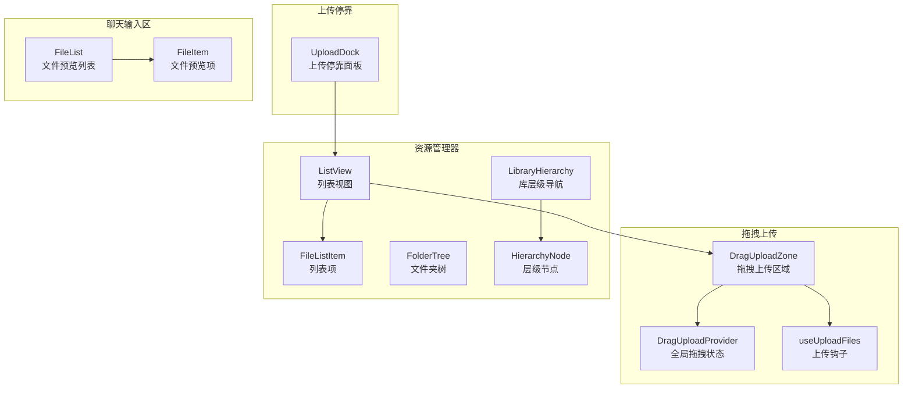
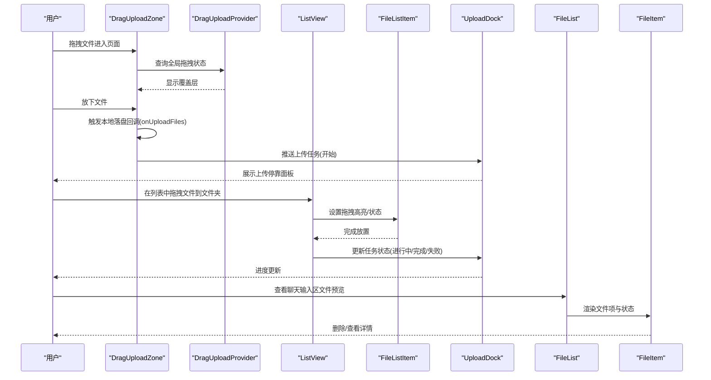
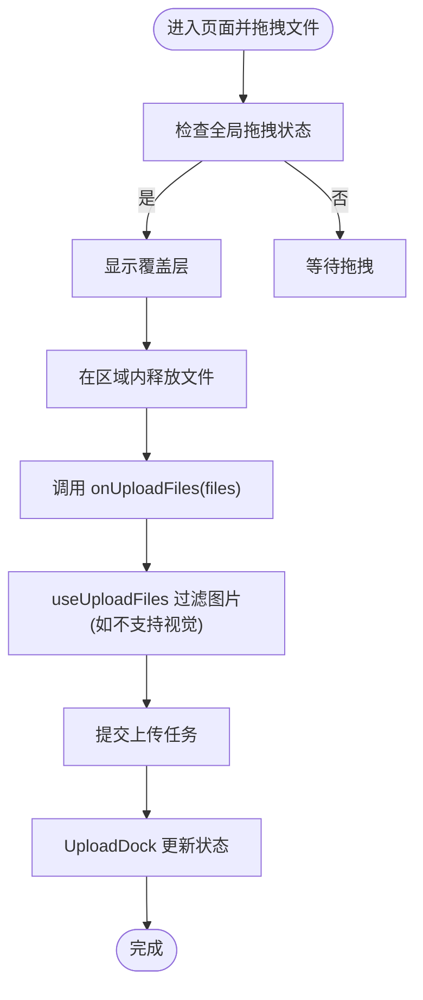
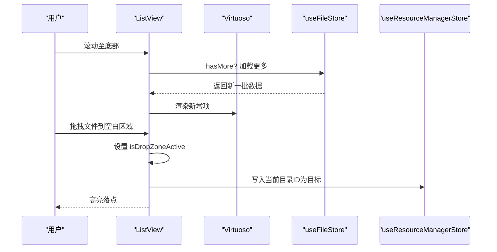
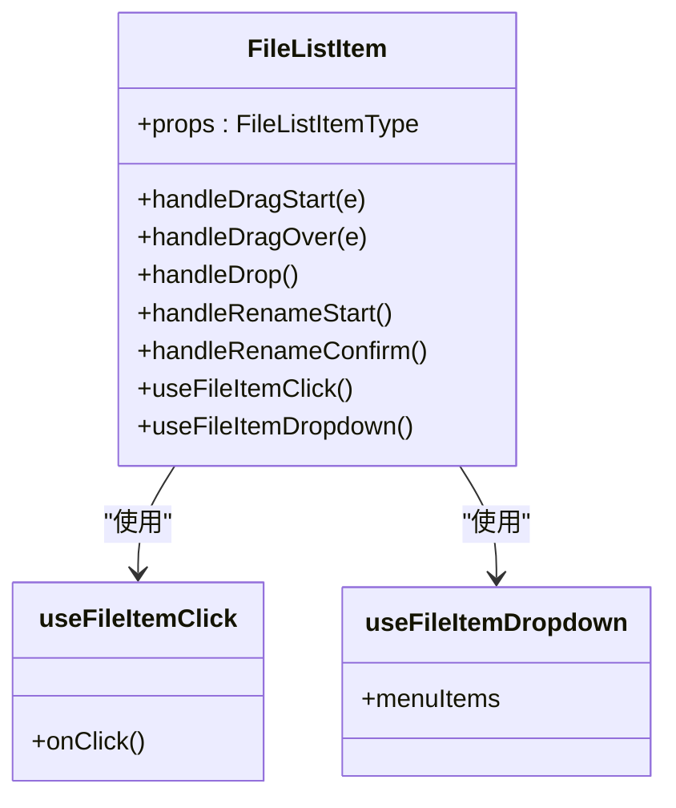
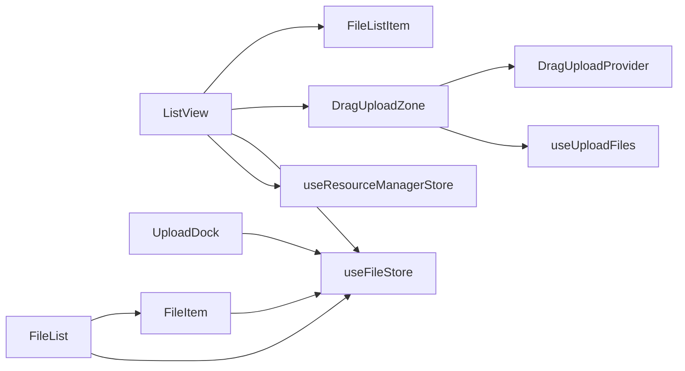

# 文件资源组件

<cite>
**本文引用的文件**
- [src/components/DragUploadZone/index.tsx](file://src/components/DragUploadZone/index.tsx)
- [src/components/DragUploadZone/DragUploadProvider.tsx](file://src/components/DragUploadZone/DragUploadProvider.tsx)
- [src/components/DragUploadZone/useUploadFiles.ts](file://src/components/DragUploadZone/useUploadFiles.ts)
- [src/features/ResourceManager/components/Explorer/ListView/index.tsx](file://src/features/ResourceManager/components/Explorer/ListView/index.tsx)
- [src/features/ResourceManager/components/Explorer/ListView/ListItem/index.tsx](file://src/features/ResourceManager/components/Explorer/ListView/ListItem/index.tsx)
- [src/features/ResourceManager/components/FolderTree/index.tsx](file://src/features/ResourceManager/components/FolderTree/index.tsx)
- [src/features/ResourceManager/components/LibraryHierarchy/index.tsx](file://src/features/ResourceManager/components/LibraryHierarchy/index.tsx)
- [src/features/ResourceManager/components/LibraryHierarchy/HierarchyNode.tsx](file://src/features/ResourceManager/components/LibraryHierarchy/HierarchyNode.tsx)
- [src/features/ResourceManager/components/UploadDock/index.tsx](file://src/features/ResourceManager/components/UploadDock/index.tsx)
- [src/features/ChatInput/Desktop/FilePreview/FileList.tsx](file://src/features/ChatInput/Desktop/FilePreview/FileList.tsx)
- [src/features/ChatInput/Desktop/FilePreview/FileItem/index.tsx](file://src/features/ChatInput/Desktop/FilePreview/FileItem/index.tsx)
</cite>

## 目录

1. [简介](#简介)
2. [项目结构](#项目结构)
3. [核心组件](#核心组件)
4. [架构总览](#架构总览)
5. [组件详解](#组件详解)
6. [依赖关系分析](#依赖关系分析)
7. [性能考量](#性能考量)
8. [故障排查指南](#故障排查指南)
9. [结论](#结论)
10. [附录：使用示例与最佳实践](#附录使用示例与最佳实践)

## 简介

本文件面向 LobeHub 的 “文件资源组件” 子系统，聚焦以下能力：

- 文件查看器（列表视图、网格视图、面包屑）
- 拖拽上传组件（全局拖拽状态、本地落盘处理、粘贴上传）
- 上传停靠面板（任务概览、进度聚合、展开 / 收起）
- 图片侧边栏与文件树（层级导航、折叠展开、上下文菜单）

文档将从架构、数据流、处理逻辑、错误处理与性能优化等维度进行深入解析，并提供可视化图示与可操作的使用建议。

## 项目结构

围绕 “文件资源” 功能，前端代码主要分布在以下路径：

- 组件层：拖拽上传、上传停靠、文件预览
- 资源管理器：列表视图、网格视图、文件树、库层级导航
- 聊天输入区：桌面端文件预览列表与单项卡片

**图表来源**

- [src/components/DragUploadZone/index.tsx](file://src/components/DragUploadZone/index.tsx#L99-L180)
- [src/components/DragUploadZone/DragUploadProvider.tsx](file://src/components/DragUploadZone/DragUploadProvider.tsx#L31-L84)
- [src/components/DragUploadZone/useUploadFiles.ts](file://src/components/DragUploadZone/useUploadFiles.ts#L18-L40)
- [src/features/ResourceManager/components/Explorer/ListView/index.tsx](file://src/features/ResourceManager/components/Explorer/ListView/index.tsx#L59-L468)
- [src/features/ResourceManager/components/Explorer/ListView/ListItem/index.tsx](file://src/features/ResourceManager/components/Explorer/ListView/ListItem/index.tsx#L141-L583)
- [src/features/ResourceManager/components/FolderTree/index.tsx](file://src/features/ResourceManager/components/FolderTree/index.tsx#L169-L201)
- [src/features/ResourceManager/components/LibraryHierarchy/index.tsx](file://src/features/ResourceManager/components/LibraryHierarchy/index.tsx#L370-L398)
- [src/features/ResourceManager/components/LibraryHierarchy/HierarchyNode.tsx](file://src/features/ResourceManager/components/LibraryHierarchy/HierarchyNode.tsx#L232-L374)
- [src/features/ResourceManager/components/UploadDock/index.tsx](file://src/features/ResourceManager/components/UploadDock/index.tsx#L54-L208)
- [src/features/ChatInput/Desktop/FilePreview/FileList.tsx](file://src/features/ChatInput/Desktop/FilePreview/FileList.tsx#L17-L43)
- [src/features/ChatInput/Desktop/FilePreview/FileItem/index.tsx](file://src/features/ChatInput/Desktop/FilePreview/FileItem/index.tsx#L49-L86)

**章节来源**

- [src/components/DragUploadZone/index.tsx](file://src/components/DragUploadZone/index.tsx#L1-L187)
- [src/features/ResourceManager/components/Explorer/ListView/index.tsx](file://src/features/ResourceManager/components/Explorer/ListView/index.tsx#L1-L468)

## 核心组件

- 拖拽上传区域（DragUploadZone）：提供全局拖拽高亮、本地落盘回调、支持显示 “仅图片 / 图片 + 文档” 的提示文案。
- 全局拖拽提供者（DragUploadProvider）：跨页面追踪拖拽状态，统一控制覆盖层显隐。
- 列表视图（ListView）：虚拟滚动、列宽可调、自动加载更多、拖拽到空白区域的落点高亮与自动滚动。
- 列表项（FileListItem）：单行渲染、复选框选择、重命名、分块 / 嵌入状态徽章、右键菜单、拖拽到文件夹。
- 文件夹树（FolderTree）：递归渲染、懒加载、动画展开、选中态样式。
- 库层级导航（LibraryHierarchy + HierarchyNode）：可拖拽的层级节点、上下文菜单、加载状态。
- 上传停靠面板（UploadDock）：上传任务概览、进度条、展开 / 收起、成功 / 失败状态指示。
- 聊天输入区文件预览（FileList + FileItem）：横向滚动预览、单项删除、上传状态详情。

**章节来源**

- [src/features/ResourceManager/components/Explorer/ListView/index.tsx](file://src/features/ResourceManager/components/Explorer/ListView/index.tsx#L59-L468)
- [src/features/ResourceManager/components/Explorer/ListView/ListItem/index.tsx](file://src/features/ResourceManager/components/Explorer/ListView/ListItem/index.tsx#L141-L583)
- [src/features/ResourceManager/components/FolderTree/index.tsx](file://src/features/ResourceManager/components/FolderTree/index.tsx#L169-L201)
- [src/features/ResourceManager/components/LibraryHierarchy/index.tsx](file://src/features/ResourceManager/components/LibraryHierarchy/index.tsx#L370-L398)
- [src/features/ResourceManager/components/LibraryHierarchy/HierarchyNode.tsx](file://src/features/ResourceManager/components/LibraryHierarchy/HierarchyNode.tsx#L232-L374)
- [src/features/ResourceManager/components/UploadDock/index.tsx](file://src/features/ResourceManager/components/UploadDock/index.tsx#L54-L208)
- [src/features/ChatInput/Desktop/FilePreview/FileList.tsx](file://src/features/ChatInput/Desktop/FilePreview/FileList.tsx#L17-L43)
- [src/features/ChatInput/Desktop/FilePreview/FileItem/index.tsx](file://src/features/ChatInput/Desktop/FilePreview/FileItem/index.tsx#L49-L86)

## 架构总览

下图展示了 “拖拽上传 + 资源管理器 + 上传停靠 + 聊天预览” 的整体交互流程：

**图表来源**

- [src/components/DragUploadZone/index.tsx](file://src/components/DragUploadZone/index.tsx#L99-L180)
- [src/components/DragUploadZone/DragUploadProvider.tsx](file://src/components/DragUploadZone/DragUploadProvider.tsx#L31-L84)
- [src/features/ResourceManager/components/Explorer/ListView/index.tsx](file://src/features/ResourceManager/components/Explorer/ListView/index.tsx#L260-L324)
- [src/features/ResourceManager/components/UploadDock/index.tsx](file://src/features/ResourceManager/components/UploadDock/index.tsx#L54-L208)
- [src/features/ChatInput/Desktop/FilePreview/FileList.tsx](file://src/features/ChatInput/Desktop/FilePreview/FileList.tsx#L17-L43)
- [src/features/ChatInput/Desktop/FilePreview/FileItem/index.tsx](file://src/features/ChatInput/Desktop/FilePreview/FileItem/index.tsx#L49-L86)

## 组件详解

### 拖拽上传区域（DragUploadZone）

- 功能要点
  - 全局拖拽高亮：通过 DragUploadProvider 提供的上下文判断是否显示覆盖层。
  - 本地落盘：使用 useLocalDragUpload 处理 drop 事件，回调 onUploadFiles (files)。
  - 可配置：enabledFiles 控制标题 / 描述文案（仅图片或图片 + 文档），overlayMinHeight 控制覆盖层最小高度。
  - 交互反馈：图标组旋转 / 叠加，标题与描述根据 enabledFiles 国际化文案切换。
- 与模型能力联动
  - useUploadFiles 钩子会根据当前模型 / 提供商是否支持视觉能力过滤图片类文件，避免不支持的上传被触发。

**图表来源**

- [src/components/DragUploadZone/index.tsx](file://src/components/DragUploadZone/index.tsx#L99-L180)
- [src/components/DragUploadZone/useUploadFiles.ts](file://src/components/DragUploadZone/useUploadFiles.ts#L18-L40)

**章节来源**

- [src/components/DragUploadZone/index.tsx](file://src/components/DragUploadZone/index.tsx#L67-L186)
- [src/components/DragUploadZone/DragUploadProvider.tsx](file://src/components/DragUploadZone/DragUploadProvider.tsx#L1-L86)
- [src/components/DragUploadZone/useUploadFiles.ts](file://src/components/DragUploadZone/useUploadFiles.ts#L1-L41)

### 列表视图（ListView）

- 功能要点
  - 虚拟滚动：react-virtuoso，提升大数据量下的渲染性能。
  - 自动加载：到达底部触发 loadMoreResources，支持 isLoadingMore 标记。
  - 拖拽到空白区域：监听 dragover/dragleave，设置 isDropZoneActive；支持鼠标靠近底部时自动滚动。
  - 列宽可调：通过全局状态维护列宽，支持拖拽调整并持久化。
  - 选择与多选：支持 shift 键范围选择，自动清理无效选中项。
- 数据与状态
  - 从 useFileStore 获取资源列表与分页参数；从 useResourceManagerStore 获取排序、分类、选中项等。
  - 与 useResourceManagerFetchFolderBreadcrumb 协作，确定当前目录 ID，作为拖拽目标。

**图表来源**

- [src/features/ResourceManager/components/Explorer/ListView/index.tsx](file://src/features/ResourceManager/components/Explorer/ListView/index.tsx#L234-L324)
- [src/features/ResourceManager/components/Explorer/ListView/index.tsx](file://src/features/ResourceManager/components/Explorer/ListView/index.tsx#L434-L461)

**章节来源**

- [src/features/ResourceManager/components/Explorer/ListView/index.tsx](file://src/features/ResourceManager/components/Explorer/ListView/index.tsx#L59-L468)

### 列表项（FileListItem）

- 功能要点
  - 渲染文件名、时间、大小；根据文件类型显示图标或表情。
  - 支持重命名（文件夹）：输入确认 / 取消，乐观更新后刷新树缓存。
  - 分块 / 嵌入状态：非页面文件显示 “分块” 按钮或状态徽章；支持禁用（不支持分块）。
  - 拖拽到文件夹：设置拖拽状态、透明拖拽图像、限制仅库内移动。
  - 右键菜单：根据文件类型与状态生成菜单项（重命名、打开、删除等）。
- 性能优化
  - 使用浅比较订阅多个 store 字段，减少重渲染。
  - 自定义比较函数避免不必要的重渲染。

**图表来源**

- [src/features/ResourceManager/components/Explorer/ListView/ListItem/index.tsx](file://src/features/ResourceManager/components/Explorer/ListView/ListItem/index.tsx#L141-L583)

**章节来源**

- [src/features/ResourceManager/components/Explorer/ListView/ListItem/index.tsx](file://src/features/ResourceManager/components/Explorer/ListView/ListItem/index.tsx#L141-L583)

### 文件夹树（FolderTree）

- 功能要点
  - 递归渲染：支持任意层级；展开 / 收起动画。
  - 懒加载：未展开时按需加载子节点。
  - 选中态：根据 selectedKey 高亮当前项。
- 交互细节
  - 通过 onToggleFolder/onLoadFolder 控制展开与加载；点击项触发 onFolderClick。

**章节来源**

- [src/features/ResourceManager/components/FolderTree/index.tsx](file://src/features/ResourceManager/components/FolderTree/index.tsx#L169-L201)

### 库层级导航（LibraryHierarchy + HierarchyNode）

- 功能要点
  - 可拖拽节点：支持文件与文件夹拖放；节点样式区分文件 / 文件夹。
  - 上下文菜单：右键弹出菜单，支持复制链接、打开、删除等。
  - 加载状态：节点加载时显示旋转图标；支持缓存 folderChildrenCache。
- 交互细节
  - 通过 showContextMenu 弹出菜单；点击节点触发文件 / 文件夹行为。

**章节来源**

- [src/features/ResourceManager/components/LibraryHierarchy/index.tsx](file://src/features/ResourceManager/components/LibraryHierarchy/index.tsx#L370-L398)
- [src/features/ResourceManager/components/LibraryHierarchy/HierarchyNode.tsx](file://src/features/ResourceManager/components/LibraryHierarchy/HierarchyNode.tsx#L232-L374)

### 上传停靠面板（UploadDock）

- 功能要点
  - 任务概览：统计总数、状态（pending/uploading/success/error）。
  - 进度聚合：总进度条随单项进度变化而推进。
  - 展开 / 收起：收起时显示进度条，展开时列出所有任务。
  - 关闭：支持一键关闭并清空队列。

**章节来源**

- [src/features/ResourceManager/components/UploadDock/index.tsx](file://src/features/ResourceManager/components/UploadDock/index.tsx#L54-L208)

### 聊天输入区文件预览（FileList + FileItem）

- 功能要点
  - 横向滚动容器：适合多文件快速浏览。
  - 文件项卡片：显示缩略内容、名称、上传状态与任务详情。
  - 删除：点击垃圾桶移除该文件上传记录。
- 与上传停靠联动
  - FileList 从聊天输入区 store 与文件 store 中读取待上传文件列表；FileItem 与 UploadDock 的状态保持一致。

**章节来源**

- [src/features/ChatInput/Desktop/FilePreview/FileList.tsx](file://src/features/ChatInput/Desktop/FilePreview/FileList.tsx#L17-L43)
- [src/features/ChatInput/Desktop/FilePreview/FileItem/index.tsx](file://src/features/ChatInput/Desktop/FilePreview/FileItem/index.tsx#L49-L86)

## 依赖关系分析

- 组件耦合
  - DragUploadZone 依赖 DragUploadProvider 提供全局状态；依赖 useUploadFiles 做模型能力过滤。
  - ListView 依赖 useFileStore 获取资源数据，依赖 useResourceManagerStore 管理排序 / 选中 / 过渡状态。
  - FileListItem 依赖 useFileStore 与 useResourceManagerStore，负责单行渲染与交互。
  - UploadDock 依赖 file store 的上传队列与状态计算。
  - ChatInput FileList/FileItem 依赖聊天输入区 store 与文件 store。
- 外部依赖
  - react-virtuoso：虚拟滚动。
  - antd-style/motion：样式与动画。
  - zustand：状态管理（浅比较优化）。

**图表来源**

- [src/features/ResourceManager/components/Explorer/ListView/index.tsx](file://src/features/ResourceManager/components/Explorer/ListView/index.tsx#L17-L25)
- [src/features/ResourceManager/components/UploadDock/index.tsx](file://src/features/ResourceManager/components/UploadDock/index.tsx#L10-L11)
- [src/features/ChatInput/Desktop/FilePreview/FileList.tsx](file://src/features/ChatInput/Desktop/FilePreview/FileList.tsx#L5-L6)

**章节来源**

- [src/features/ResourceManager/components/Explorer/ListView/index.tsx](file://src/features/ResourceManager/components/Explorer/ListView/index.tsx#L17-L25)
- [src/features/ResourceManager/components/UploadDock/index.tsx](file://src/features/ResourceManager/components/UploadDock/index.tsx#L10-L11)
- [src/features/ChatInput/Desktop/FilePreview/FileList.tsx](file://src/features/ChatInput/Desktop/FilePreview/FileList.tsx#L5-L6)

## 性能考量

- 虚拟滚动：ListView 使用 react-virtuoso，合理设置 viewport 增量与 overscan，避免大量 DOM 节点造成卡顿。
- 浅比较订阅：FileListItem 对多个 store 字段使用浅比较订阅，减少不必要重渲染。
- 懒加载与缓存：FolderTree 与 LibraryHierarchy 支持懒加载与缓存，避免重复请求。
- 自动滚动：ListView 在拖拽到列表底部时启用定时器与间隔滚动，注意清理计时器防止内存泄漏。
- 上传队列：UploadDock 以聚合进度与状态驱动 UI，避免频繁重绘。

\[本节为通用性能建议，无需特定文件引用]

## 故障排查指南

- 拖拽无覆盖层
  - 检查 DragUploadProvider 是否正确包裹应用根节点；确认全局拖拽计数器逻辑未被外部事件破坏。
- 无法上传图片
  - useUploadFiles 会根据模型能力过滤图片，确认当前模型 / 提供商是否支持视觉。
- 列表项不响应点击 / 拖拽
  - 确认资源管理器处于库内模式（libraryId 存在），否则会阻止拖拽。
- 重命名失败
  - FileListItem 在确认过程中有防抖标志位，确保不会重复提交；检查网络与权限。
- 上传停靠面板不显示
  - 确认存在上传任务且状态非 pending；若已结束，可手动展开查看结果。

**章节来源**

- [src/components/DragUploadZone/DragUploadProvider.tsx](file://src/components/DragUploadZone/DragUploadProvider.tsx#L31-L84)
- [src/components/DragUploadZone/useUploadFiles.ts](file://src/components/DragUploadZone/useUploadFiles.ts#L18-L40)
- [src/features/ResourceManager/components/Explorer/ListView/ListItem/index.tsx](file://src/features/ResourceManager/components/Explorer/ListView/ListItem/index.tsx#L233-L253)
- [src/features/ResourceManager/components/UploadDock/index.tsx](file://src/features/ResourceManager/components/UploadDock/index.tsx#L86-L91)

## 结论

本文件资源组件体系以 “拖拽上传 + 资源管理器 + 上传停靠 + 聊天预览” 为核心，结合虚拟滚动、懒加载、状态聚合与模型能力过滤，实现了高效、可扩展的文件管理体验。通过清晰的组件边界与状态管理策略，既保证了复杂场景下的稳定性，也为后续扩展（如批量处理、缓存策略、类型检测）提供了良好基础。

\[本节为总结性内容，无需特定文件引用]

## 附录：使用示例与最佳实践

- 快速接入拖拽上传
  - 在页面根部包裹 DragUploadProvider。
  - 使用 DragUploadZone 包裹目标区域，传入 onUploadFiles 回调。
  - 如需按模型能力过滤图片，使用 useUploadFiles 并传入 model/provider。
- 在资源管理器中启用拖拽到文件夹
  - 确保当前处于库内模式（libraryId 存在）。
  - 在列表项上设置 data-\* 属性作为拖拽目标标识，配合 ListView 的 drop-zone 逻辑。
- 上传任务管理
  - 通过 UploadDock 查看总体进度与状态；在展开状态下逐项查看详情。
- 聊天输入区文件预览
  - 将 FileList 放置在输入区，FileItem 提供删除与状态展示。

\[本节为通用指导，无需特定文件引用]
