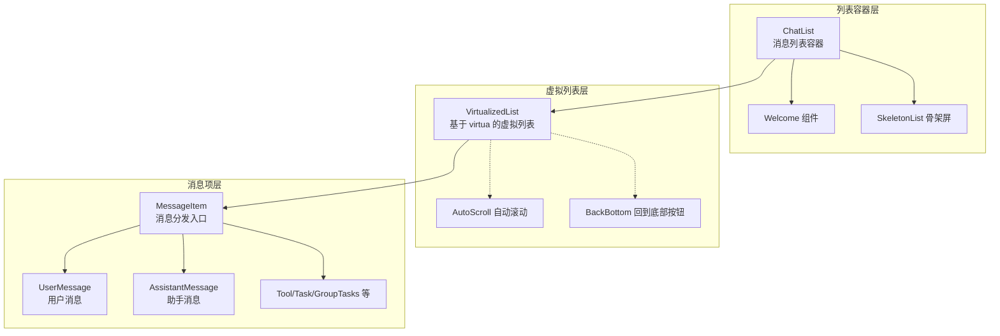
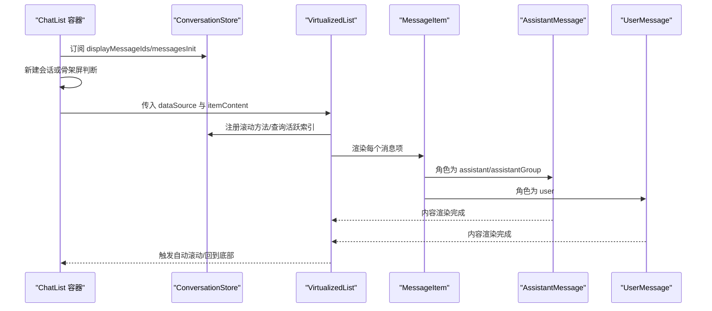
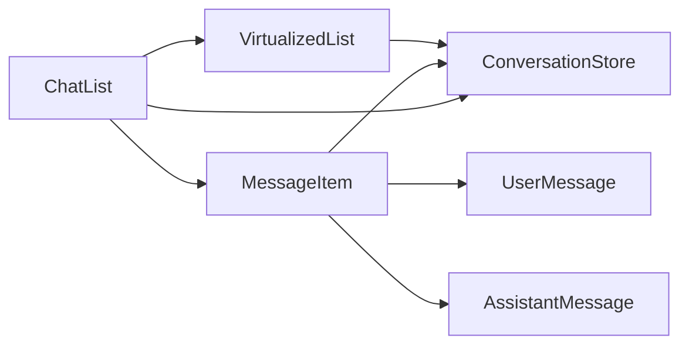

# 对话列表组件

<cite>
**本文引用的文件**
- [src/features/Conversation/ChatList/index.tsx](file://src/features/Conversation/ChatList/index.tsx)
- [src/features/Conversation/ChatList/components/VirtualizedList.tsx](file://src/features/Conversation/ChatList/components/VirtualizedList.tsx)
- [src/features/Conversation/Messages/index.tsx](file://src/features/Conversation/Messages/index.tsx)
- [src/features/Conversation/Messages/Assistant/index.tsx](file://src/features/Conversation/Messages/Assistant/index.tsx)
- [src/features/Conversation/Messages/User/index.tsx](file://src/features/Conversation/Messages/User/index.tsx)
- [src/features/Conversation/store/index.ts](file://src/features/Conversation/store/index.ts)
- [src/features/Conversation/store/action.ts](file://src/features/Conversation/store/action.ts)
- [src/features/Conversation/store/slices/virtuaList/initialState.ts](file://src/features/Conversation/store/slices/virtuaList/initialState.ts)
- [src/features/Conversation/store/slices/virtuaList/action.ts](file://src/features/Conversation/store/slices/virtuaList/action.ts)
- [src/features/Conversation/Markdown/plugins/ImageSearchRef/index.ts](file://src/features/Conversation/Markdown/plugins/ImageSearchRef/index.ts)
- [src/features/Portal/Artifacts/Body/Renderer/index.tsx](file://src/features/Portal/Artifacts/Body/Renderer/index.tsx)
- [src/features/ShareModal/ShareImage/ChatList/index.tsx](file://src/features/ShareModal/ShareImage/ChatList/index.tsx)
- [src/features/Portal/GroupThread/Body/ThreadChatList.tsx](file://src/features/Portal/GroupThread/Body/ThreadChatList.tsx)
</cite>

## 目录
1. [简介](#简介)
2. [项目结构](#项目结构)
3. [核心组件](#核心组件)
4. [架构总览](#架构总览)
5. [详细组件分析](#详细组件分析)
6. [依赖关系分析](#依赖关系分析)
7. [性能考量](#性能考量)
8. [故障排查指南](#故障排查指南)
9. [结论](#结论)
10. [附录：使用示例与最佳实践](#附录使用示例与最佳实践)

## 简介
本文件面向“对话列表组件”的架构与实现进行系统性说明，覆盖消息项渲染、滚动管理、状态同步、错误处理、消息类型区分（用户消息、助手消息、系统消息等）、Markdown 渲染、代码高亮、图片显示、虚拟化滚动、懒加载与内存管理、无限滚动加载、消息搜索高亮、批量操作等能力，并给出完整使用示例与性能优化建议。

## 项目结构
对话列表组件由三层协作构成：
- 列表容器层：负责数据获取、骨架屏、空态、欢迎页与虚拟列表桥接。
- 虚拟列表层：基于 virtua 的高性能虚拟滚动，负责可见项计算、自动滚动、回到底部等交互。
- 消息项层：按角色分发到不同消息组件，负责内容渲染、编辑、工具调用、分支展示等。

图表来源
- [src/features/Conversation/ChatList/index.tsx](file://src/features/Conversation/ChatList/index.tsx#L37-L99)
- [src/features/Conversation/ChatList/components/VirtualizedList.tsx](file://src/features/Conversation/ChatList/components/VirtualizedList.tsx#L27-L185)
- [src/features/Conversation/Messages/index.tsx](file://src/features/Conversation/Messages/index.tsx#L52-L201)

章节来源
- [src/features/Conversation/ChatList/index.tsx](file://src/features/Conversation/ChatList/index.tsx#L1-L104)
- [src/features/Conversation/ChatList/components/VirtualizedList.tsx](file://src/features/Conversation/ChatList/components/VirtualizedList.tsx#L1-L189)
- [src/features/Conversation/Messages/index.tsx](file://src/features/Conversation/Messages/index.tsx#L1-L206)

## 核心组件
- ChatList：对话列表容器，负责根据上下文拉取消息、控制骨架屏与空态、注入欢迎页、将消息 ID 列表交给虚拟列表渲染。
- VirtualizedList：基于 virtua 的虚拟列表，负责滚动事件监听、可见项统计、活跃索引计算、自动滚动至底部、回到顶部按钮等。
- MessageItem：消息分发器，依据消息角色选择具体消息组件（用户、助手、工具、任务、代理委员会等）。
- AssistantMessage/UserMessage：分别承载助手与用户消息的具体渲染逻辑（含 Markdown、工具调用、分支、头像、时间戳等）。
- ConversationStore：Zustand 状态管理，提供数据选择器、滚动方法注册、活跃索引、可见项集合等。

章节来源
- [src/features/Conversation/ChatList/index.tsx](file://src/features/Conversation/ChatList/index.tsx#L37-L99)
- [src/features/Conversation/ChatList/components/VirtualizedList.tsx](file://src/features/Conversation/ChatList/components/VirtualizedList.tsx#L27-L185)
- [src/features/Conversation/Messages/index.tsx](file://src/features/Conversation/Messages/index.tsx#L52-L201)
- [src/features/Conversation/Messages/Assistant/index.tsx](file://src/features/Conversation/Messages/Assistant/index.tsx#L35-L134)
- [src/features/Conversation/Messages/User/index.tsx](file://src/features/Conversation/Messages/User/index.tsx#L30-L104)
- [src/features/Conversation/store/index.ts](file://src/features/Conversation/store/index.ts#L26-L33)

## 架构总览
对话列表采用“容器-虚拟列表-消息项”三层架构，结合 Zustand Store 的选择器模式，确保最小粒度订阅与高效重渲染。滚动行为通过 virtua 的滚动方法与自定义状态联动，实现“自动滚动至最新”“回到底部”“活跃索引计算”等交互。

图表来源
- [src/features/Conversation/ChatList/index.tsx](file://src/features/Conversation/ChatList/index.tsx#L37-L99)
- [src/features/Conversation/ChatList/components/VirtualizedList.tsx](file://src/features/Conversation/ChatList/components/VirtualizedList.tsx#L27-L185)
- [src/features/Conversation/Messages/index.tsx](file://src/features/Conversation/Messages/index.tsx#L52-L201)
- [src/features/Conversation/Messages/Assistant/index.tsx](file://src/features/Conversation/Messages/Assistant/index.tsx#L35-L134)
- [src/features/Conversation/Messages/User/index.tsx](file://src/features/Conversation/Messages/User/index.tsx#L30-L104)

## 详细组件分析

### ChatList 容器组件
职责与流程：
- 根据上下文决定是否跳过远端拉取（新建会话场景），避免无意义的网络请求。
- 控制骨架屏与空态（无消息时显示欢迎页）。
- 将消息 ID 列表交由虚拟列表渲染；支持自定义 itemContent。
- 为消息项提供统一的动作栏上下文。

关键点：
- 新建会话时直接进入欢迎页，不等待远端数据。
- 非新建会话且消息未初始化时显示骨架屏。
- 支持禁用动作栏（如分享页）。

章节来源
- [src/features/Conversation/ChatList/index.tsx](file://src/features/Conversation/ChatList/index.tsx#L37-L99)

### VirtualizedList 虚拟列表组件
职责与流程：
- 基于 virtua 的虚拟滚动，仅渲染可视区域内的消息项。
- 注册滚动方法到 Store，供全局滚动控制（如“回到底部”）。
- 计算活跃索引（最可见消息），用于状态同步与性能优化。
- 监听滚动事件，动态设置滚动状态与活跃索引。
- 在首次渲染时自动滚动到底部。
- 提供“回到底部”按钮与调试检查器（开发模式）。

滚动与状态同步要点：
- 通过 Store 的滚动方法注册，统一管理滚动行为。
- 使用可见项集合与活跃索引计算，减少不必要的重排。
- 底部阈值常量用于判断是否处于底部，避免频繁触发。

章节来源
- [src/features/Conversation/ChatList/components/VirtualizedList.tsx](file://src/features/Conversation/ChatList/components/VirtualizedList.tsx#L27-L185)
- [src/features/Conversation/store/slices/virtuaList/initialState.ts](file://src/features/Conversation/store/slices/virtuaList/initialState.ts#L23-L56)
- [src/features/Conversation/store/slices/virtuaList/action.ts](file://src/features/Conversation/store/slices/virtuaList/action.ts#L77-L131)

### MessageItem 消息分发器
职责与流程：
- 从 Store 获取当前消息对象，依据角色分发到对应消息组件。
- 支持桌面端右键菜单（Look Up、Search 等）与移动端上下文菜单。
- 支持启用历史分割线、禁用编辑、渲染结束节点等扩展能力。
- 对“助手组”消息进行特殊处理（作为助手角色处理）。

消息类型支持：
- 用户消息、助手消息、助手组消息、监督者消息、任务/多任务消息、代理委员会、压缩组、工具消息等。

章节来源
- [src/features/Conversation/Messages/index.tsx](file://src/features/Conversation/Messages/index.tsx#L52-L201)

### AssistantMessage 助手消息
职责与流程：
- 从 Store 读取消息元数据（模型、提供商、用量、性能、工具等）。
- 处理“思考标签”标准化与“产物”处理，便于后续渲染。
- 支持双击编辑、鼠标悬停时动作栏定位、分支展示、错误信息额外渲染等。
- 结合“新屏幕”高度策略，保证生成/编辑过程中的布局稳定。

章节来源
- [src/features/Conversation/Messages/Assistant/index.tsx](file://src/features/Conversation/Messages/Assistant/index.tsx#L35-L134)

### UserMessage 用户消息
职责与流程：
- 读取用户头像与用户名，支持私信可见性标签（DM 指示）。
- 提供用户消息专用 Actions（如复制、删除、编辑等）。
- 支持双击编辑与鼠标悬停动作栏定位。
- 可选隐藏头像与标题，适配不同布局。

章节来源
- [src/features/Conversation/Messages/User/index.tsx](file://src/features/Conversation/Messages/User/index.tsx#L30-L104)

### Markdown 渲染与媒体支持
- Markdown 渲染：在助手消息中对内容进行 AST 处理与产物标记规范化，随后交由 Markdown 渲染器输出。
- 图片显示：支持本地文件引用与图片搜索引用等扩展插件，增强图片渲染与交互。
- 特殊产物渲染：针对 React 组件、Mermaid 图表、SVG、HTML 等类型进行专门渲染器分发。

章节来源
- [src/features/Conversation/Messages/Assistant/index.tsx](file://src/features/Conversation/Messages/Assistant/index.tsx#L70-L71)
- [src/features/Conversation/Markdown/plugins/ImageSearchRef/index.ts](file://src/features/Conversation/Markdown/plugins/ImageSearchRef/index.ts#L7-L14)
- [src/features/Portal/Artifacts/Body/Renderer/index.tsx](file://src/features/Portal/Artifacts/Body/Renderer/index.tsx#L11-L35)

### 状态管理与 Store 设计
- Store 创建：通过 createStoreAction 合并多个 slice（数据、生成、输入、消息、编辑、工具、虚拟列表）。
- 选择器模式：以 dataSelectors、messageStateSelectors、virtuaListSelectors 等提供细粒度订阅，降低重渲染成本。
- 虚拟列表 Slice：维护活跃索引、可见项集合、滚动状态、滚动方法注册与滚动控制（平滑/非平滑）。

章节来源
- [src/features/Conversation/store/index.ts](file://src/features/Conversation/store/index.ts#L26-L33)
- [src/features/Conversation/store/action.ts](file://src/features/Conversation/store/action.ts#L47-L62)
- [src/features/Conversation/store/slices/virtuaList/initialState.ts](file://src/features/Conversation/store/slices/virtuaList/initialState.ts#L23-L56)
- [src/features/Conversation/store/slices/virtuaList/action.ts](file://src/features/Conversation/store/slices/virtuaList/action.ts#L77-L131)

### 其他使用场景与变体
- 分享页渲染：在分享场景下，通过 ChatList 的变体组件直接渲染消息列表，跳过鉴权相关的数据拉取。
- 线程视图：在门户线程中，使用 ThreadChatList 渲染线程内消息，同样基于虚拟列表与消息项组件。

章节来源
- [src/features/ShareModal/ShareImage/ChatList/index.tsx](file://src/features/ShareModal/ShareImage/ChatList/index.tsx#L8-L32)
- [src/features/Portal/GroupThread/Body/ThreadChatList.tsx](file://src/features/Portal/GroupThread/Body/ThreadChatList.tsx#L30-L56)

## 依赖关系分析
- 组件耦合：ChatList 依赖 VirtualizedList 与 MessageItem；VirtualizedList 依赖 Store 的滚动方法与活跃索引；MessageItem 依赖各消息子组件。
- 外部依赖：virtua（虚拟滚动）、fast-deep-equal（浅比较）、@lobehub/ui（通用组件库）。
- 数据流：Store 提供选择器，ChatList 与 VirtualizedList 通过选择器订阅数据，消息项通过选择器获取单条消息。

图表来源
- [src/features/Conversation/ChatList/index.tsx](file://src/features/Conversation/ChatList/index.tsx#L37-L99)
- [src/features/Conversation/ChatList/components/VirtualizedList.tsx](file://src/features/Conversation/ChatList/components/VirtualizedList.tsx#L27-L185)
- [src/features/Conversation/Messages/index.tsx](file://src/features/Conversation/Messages/index.tsx#L52-L201)

## 性能考量
- 虚拟化滚动：仅渲染可视区域，显著降低 DOM 数量与重排开销。
- 深比较与选择器：使用 fast-deep-equal 与选择器，避免无关消息项重渲染。
- 可见项与活跃索引：通过可见项集合与活跃索引计算，减少滚动事件带来的状态抖动。
- 自动滚动策略：仅在新增两条消息且倒数第二条为用户消息时触发自动滚动，避免频繁滚动影响体验。
- 懒加载与 SSR：Markdown 渲染器与特殊产物渲染器采用动态导入，减少首屏包体与首屏阻塞。
- 内存管理：组件卸载时清理定时器与可见项集合，防止内存泄漏。

章节来源
- [src/features/Conversation/ChatList/components/VirtualizedList.tsx](file://src/features/Conversation/ChatList/components/VirtualizedList.tsx#L27-L185)
- [src/features/Conversation/Messages/index.tsx](file://src/features/Conversation/Messages/index.tsx#L52-L201)

## 故障排查指南
- 列表不滚动到底部：检查 Store 中滚动方法是否正确注册，确认首次渲染时 scrollToIndex 的调用时机。
- 活跃索引不更新：确认 onScroll 事件是否触发，visibleItems 是否正确更新，活跃索引计算逻辑是否生效。
- 新消息未自动滚动：确认新增消息数量与倒数第二条消息的角色判断，以及自动滚动触发条件。
- 骨架屏不消失：确认 messagesInit 状态是否被正确置位，或新建会话场景下的逻辑分支。
- 分享页空白：确认 skipFetch 与 hasInitMessages 的配置，确保消息已就绪再渲染。

章节来源
- [src/features/Conversation/ChatList/components/VirtualizedList.tsx](file://src/features/Conversation/ChatList/components/VirtualizedList.tsx#L107-L135)
- [src/features/Conversation/ChatList/index.tsx](file://src/features/Conversation/ChatList/index.tsx#L67-L73)
- [src/features/ShareModal/ShareImage/ChatList/index.tsx](file://src/features/ShareModal/ShareImage/ChatList/index.tsx#L14-L31)

## 结论
对话列表组件通过“容器-虚拟列表-消息项”的清晰分层，结合 Zustand 选择器与 virtua 虚拟滚动，实现了高性能、可扩展、可维护的消息列表渲染体系。其对消息类型、Markdown 渲染、媒体展示、滚动控制、状态同步与错误处理均有完善支持，并提供了分享页、线程视图等多场景变体。配合懒加载与内存管理策略，可在大规模消息场景下保持流畅体验。

## 附录：使用示例与最佳实践
- 实现流畅滚动与实时更新
  - 在 ChatList 中使用默认 itemContent 或自定义 itemContent，确保 isLatestItem 传递给消息项，以便在生成/编辑过程中维持布局稳定。
  - 通过 Store 的 scrollToBottom 平滑滚动到底部，或在特定条件下触发自动滚动。
  - 使用活跃索引与可见项集合，避免在滚动过程中频繁重排。

- 消息类型区分与渲染
  - 用户消息：展示用户头像与用户名，支持 DM 指示与动作栏。
  - 助手消息：展示模型/提供商/用量/性能等元信息，支持工具调用、分支展示与错误额外渲染。
  - 助手组/代理委员会/压缩组/任务/工具等：根据角色选择对应组件，确保内容与交互一致。

- Markdown 渲染与媒体展示
  - 对内容进行 AST 规范化与产物标记处理，再交由 Markdown 渲染器输出。
  - 图片与本地文件：通过扩展插件支持图片搜索引用与本地文件引用。
  - 特殊产物：根据类型选择 React 组件、Mermaid 图表、SVG 或 HTML 渲染器。

- 状态同步与错误处理
  - 使用 Store 的消息状态选择器，精确控制编辑/生成/创建状态，避免全量重渲染。
  - 错误信息通过额外渲染组件展示，必要时提供重试或修复入口。

- 性能优化与内存管理
  - 使用虚拟列表与深比较，减少不必要的重渲染。
  - 在组件卸载时清理定时器与可见项集合，避免内存泄漏。
  - 对动态导入的渲染器进行合理拆分，降低首屏体积。

- 扩展与变体
  - 分享页：通过跳过远端拉取与预置消息，快速渲染消息列表。
  - 线程视图：在门户线程中复用消息项与虚拟列表，实现一致的交互体验。

章节来源
- [src/features/Conversation/ChatList/index.tsx](file://src/features/Conversation/ChatList/index.tsx#L37-L99)
- [src/features/Conversation/ChatList/components/VirtualizedList.tsx](file://src/features/Conversation/ChatList/components/VirtualizedList.tsx#L27-L185)
- [src/features/Conversation/Messages/index.tsx](file://src/features/Conversation/Messages/index.tsx#L52-L201)
- [src/features/Conversation/Messages/Assistant/index.tsx](file://src/features/Conversation/Messages/Assistant/index.tsx#L35-L134)
- [src/features/Conversation/Messages/User/index.tsx](file://src/features/Conversation/Messages/User/index.tsx#L30-L104)
- [src/features/ShareModal/ShareImage/ChatList/index.tsx](file://src/features/ShareModal/ShareImage/ChatList/index.tsx#L8-L32)
- [src/features/Portal/GroupThread/Body/ThreadChatList.tsx](file://src/features/Portal/GroupThread/Body/ThreadChatList.tsx#L30-L56)