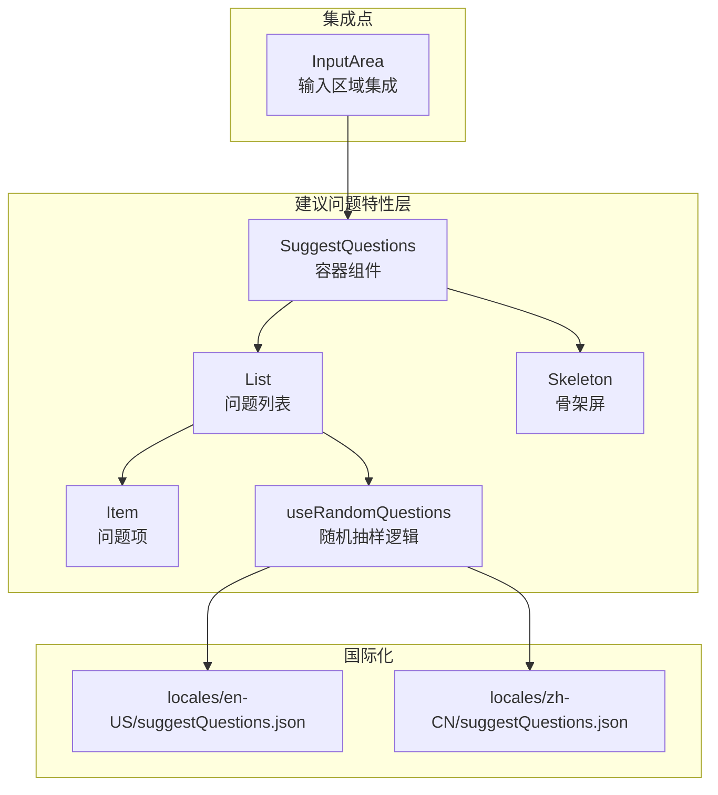
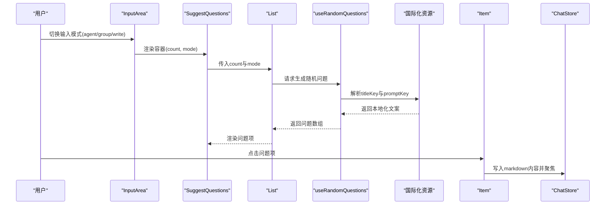
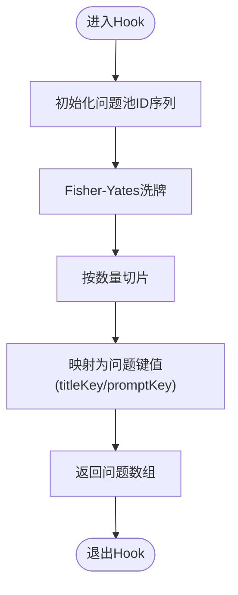
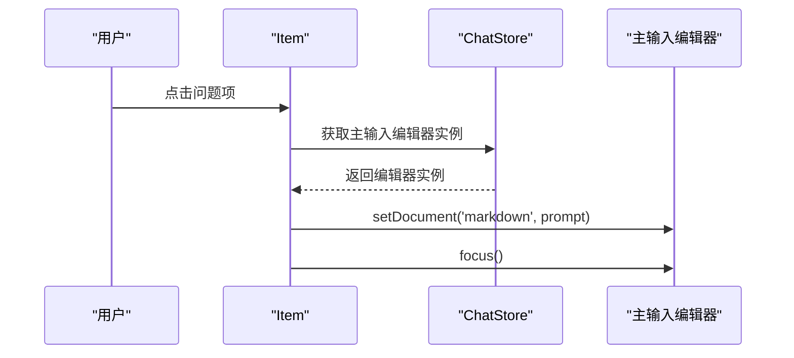
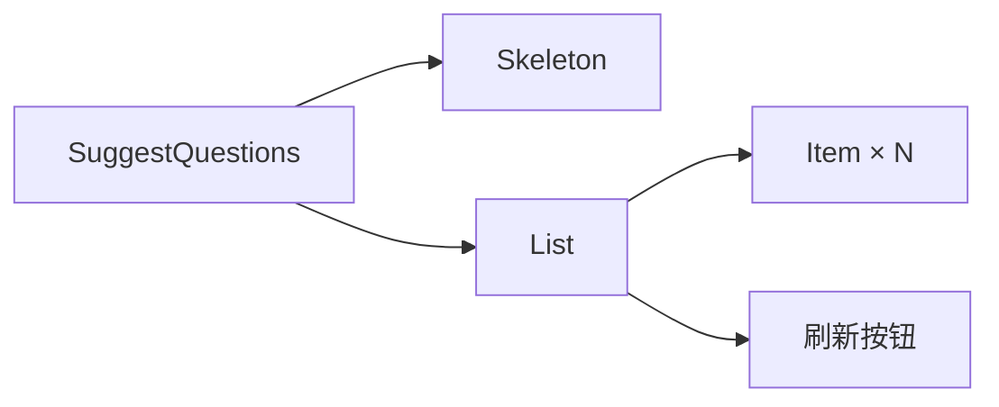
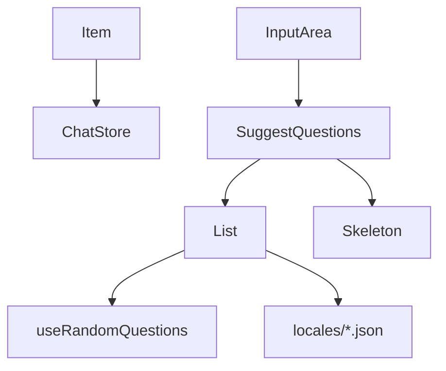

# 建议问题组件

<cite>
**本文档引用的文件**
- [src/features/SuggestQuestions/index.tsx](file://src/features/SuggestQuestions/index.tsx)
- [src/features/SuggestQuestions/List.tsx](file://src/features/SuggestQuestions/List.tsx)
- [src/features/SuggestQuestions/useRandomQuestions.ts](file://src/features/SuggestQuestions/useRandomQuestions.ts)
- [src/features/SuggestQuestions/Item.tsx](file://src/features/SuggestQuestions/Item.tsx)
- [src/features/SuggestQuestions/Skeleton.tsx](file://src/features/SuggestQuestions/Skeleton.tsx)
- [src/routes/(main)/home/features/InputArea/index.tsx](file://src/routes/(main)/home/features/InputArea/index.tsx)
- [locales/en-US/suggestQuestions.json](file://locales/en-US/suggestQuestions.json)
- [locales/zh-CN/suggestQuestions.json](file://locales/zh-CN/suggestQuestions.json)
</cite>

## 目录

1. [简介](#简介)
2. [项目结构](#项目结构)
3. [核心组件](#核心组件)
4. [架构概览](#架构概览)
5. [详细组件分析](#详细组件分析)
6. [依赖关系分析](#依赖关系分析)
7. [性能考量](#性能考量)
8. [故障排查指南](#故障排查指南)
9. [结论](#结论)
10. [附录](#附录)

## 简介

建议问题组件是一个用于在聊天界面中为用户提供引导性问题的交互模块。它通过随机抽取预置的问题池，结合当前聊天模式（如 “创建代理”、“创建群组”、“写作”），为用户生成相关性强且多样化的引导性问题，从而提升用户参与度与对话质量。组件采用轻量的随机抽样与本地缓存策略，确保加载性能与交互流畅性。

## 项目结构

建议问题组件位于前端特性层，围绕以下文件组织：

- 入口与容器：SuggestQuestions 容器组件负责渲染骨架屏与列表
- 列表与项：List 负责展示问题项，Item 负责单个问题的点击行为
- 数据与逻辑：useRandomQuestions 提供问题池生成与刷新逻辑
- 国际化：locales 中的 suggestQuestions.json 提供多语言问题文案
- 集成点：InputArea 将建议问题面板与输入区域集成，控制显示时机与动画

**图表来源**

- [src/features/SuggestQuestions/index.tsx](file://src/features/SuggestQuestions/index.tsx#L1-L28)
- [src/features/SuggestQuestions/List.tsx](file://src/features/SuggestQuestions/List.tsx#L1-L53)
- [src/features/SuggestQuestions/Item.tsx](file://src/features/SuggestQuestions/Item.tsx#L1-L46)
- [src/features/SuggestQuestions/useRandomQuestions.ts](file://src/features/SuggestQuestions/useRandomQuestions.ts#L1-L49)
- [src/features/SuggestQuestions/Skeleton.tsx](file://src/features/SuggestQuestions/Skeleton.tsx#L1-L28)
- [locales/en-US/suggestQuestions.json](file://locales/en-US/suggestQuestions.json#L1-L243)
- [locales/zh-CN/suggestQuestions.json](file://locales/zh-CN/suggestQuestions.json#L1-L243)
- [src/routes/(main)/home/features/InputArea/index.tsx](<file://src/routes/(main)/home/features/InputArea/index.tsx#L1-L148>)

**章节来源**

- [src/features/SuggestQuestions/index.tsx](file://src/features/SuggestQuestions/index.tsx#L1-L28)
- [src/features/SuggestQuestions/List.tsx](file://src/features/SuggestQuestions/List.tsx#L1-L53)
- [src/features/SuggestQuestions/Item.tsx](file://src/features/SuggestQuestions/Item.tsx#L1-L46)
- [src/features/SuggestQuestions/useRandomQuestions.ts](file://src/features/SuggestQuestions/useRandomQuestions.ts#L1-L49)
- [src/features/SuggestQuestions/Skeleton.tsx](file://src/features/SuggestQuestions/Skeleton.tsx#L1-L28)
- [src/routes/(main)/home/features/InputArea/index.tsx](<file://src/routes/(main)/home/features/InputArea/index.tsx#L1-L148>)
- [locales/en-US/suggestQuestions.json](file://locales/en-US/suggestQuestions.json#L1-L243)
- [locales/zh-CN/suggestQuestions.json](file://locales/zh-CN/suggestQuestions.json#L1-L243)

## 核心组件

- SuggestQuestions 容器：负责包裹列表与骨架屏，暴露 count 与 mode 参数，控制渲染范围
- List 列表：根据模式与数量渲染问题项，提供刷新按钮
- Item 项：点击后将问题文案写入主输入编辑器并聚焦
- useRandomQuestions Hook：生成随机问题池，支持刷新
- Skeleton 骨架屏：在数据加载时提供占位样式
- 国际化键值：通过模式 + 序号的命名规范组织问题标题与描述

**章节来源**

- [src/features/SuggestQuestions/index.tsx](file://src/features/SuggestQuestions/index.tsx#L10-L27)
- [src/features/SuggestQuestions/List.tsx](file://src/features/SuggestQuestions/List.tsx#L13-L50)
- [src/features/SuggestQuestions/Item.tsx](file://src/features/SuggestQuestions/Item.tsx#L9-L43)
- [src/features/SuggestQuestions/useRandomQuestions.ts](file://src/features/SuggestQuestions/useRandomQuestions.ts#L26-L48)
- [src/features/SuggestQuestions/Skeleton.tsx](file://src/features/SuggestQuestions/Skeleton.tsx#L6-L25)

## 架构概览

建议问题组件的运行流程如下：

- 输入区域根据当前模式决定是否显示建议问题面板
- 容器组件加载骨架屏，随后渲染列表
- 列表通过 Hook 生成随机问题项并进行本地化渲染
- 用户点击问题项后，组件将问题文案写入主输入编辑器并自动聚焦

**图表来源**

- [src/routes/(main)/home/features/InputArea/index.tsx](<file://src/routes/(main)/home/features/InputArea/index.tsx#L65-L66>)
- [src/features/SuggestQuestions/index.tsx](file://src/features/SuggestQuestions/index.tsx#L15-L23)
- [src/features/SuggestQuestions/List.tsx](file://src/features/SuggestQuestions/List.tsx#L18-L50)
- [src/features/SuggestQuestions/useRandomQuestions.ts](file://src/features/SuggestQuestions/useRandomQuestions.ts#L34-L48)
- [locales/en-US/suggestQuestions.json](file://locales/en-US/suggestQuestions.json#L1-L243)
- [src/features/SuggestQuestions/Item.tsx](file://src/features/SuggestQuestions/Item.tsx#L15-L21)

## 详细组件分析

### 组件 A：随机问题生成与刷新（useRandomQuestions）

- 功能要点
  - 固定问题池规模常量，保证抽样的可控性
  - Fisher-Yates 洗牌算法实现高质量随机性
  - 通过模式与数量生成问题键值，便于国际化与扩展
  - 提供刷新函数以重新生成问题池
- 复杂度与性能
  - 洗牌与切片均为 O (n)，n 为固定池大小，性能稳定
  - 本地状态管理，避免重复网络请求
- 错误处理
  - 未发现边界错误处理逻辑，依赖外部校验（如模式合法性）

**图表来源**

- [src/features/SuggestQuestions/useRandomQuestions.ts](file://src/features/SuggestQuestions/useRandomQuestions.ts#L7-L24)

**章节来源**

- [src/features/SuggestQuestions/useRandomQuestions.ts](file://src/features/SuggestQuestions/useRandomQuestions.ts#L1-L49)

### 组件 B：问题项交互（Item）

- 功能要点
  - 点击后将问题文案写入主输入编辑器（markdown 模式）
  - 自动聚焦编辑器，提升交互连续性
- 依赖关系
  - 依赖 ChatStore 获取主输入编辑器实例
- 可扩展性
  - 可增加点击埋点、A/B 测试开关等

**图表来源**

- [src/features/SuggestQuestions/Item.tsx](file://src/features/SuggestQuestions/Item.tsx#L15-L21)

**章节来源**

- [src/features/SuggestQuestions/Item.tsx](file://src/features/SuggestQuestions/Item.tsx#L1-L46)

### 组件 C：列表与容器（List 与 SuggestQuestions）

- 功能要点
  - List 根据模式与数量渲染网格布局的问题项
  - 提供刷新按钮，触发 Hook 的刷新逻辑
  - SuggestQuestions 容器负责骨架屏与懒加载
- 国际化
  - 通过 i18n 键值渲染标题与描述
- 集成点
  - InputArea 控制显示条件（仅在 agent/group/write 模式下显示）

**图表来源**

- [src/features/SuggestQuestions/index.tsx](file://src/features/SuggestQuestions/index.tsx#L15-L23)
- [src/features/SuggestQuestions/List.tsx](file://src/features/SuggestQuestions/List.tsx#L18-L50)
- [src/features/SuggestQuestions/Skeleton.tsx](file://src/features/SuggestQuestions/Skeleton.tsx#L10-L25)

**章节来源**

- [src/features/SuggestQuestions/index.tsx](file://src/features/SuggestQuestions/index.tsx#L1-L28)
- [src/features/SuggestQuestions/List.tsx](file://src/features/SuggestQuestions/List.tsx#L1-L53)
- [src/features/SuggestQuestions/Skeleton.tsx](file://src/features/SuggestQuestions/Skeleton.tsx#L1-L28)

### 组件 D：国际化与文案组织（locales）

- 结构特点
  - 采用 “模式。序号。字段” 的命名规范，便于程序化生成与查找
  - 支持多语言，通过键值映射到本地化文案
- 扩展建议
  - 可引入质量评估标签（如难度、主题、时效性）以辅助排序或过滤

**章节来源**

- [locales/en-US/suggestQuestions.json](file://locales/en-US/suggestQuestions.json#L1-L243)
- [locales/zh-CN/suggestQuestions.json](file://locales/zh-CN/suggestQuestions.json#L1-L243)

### 组件 E：与输入区域的集成（InputArea）

- 显示逻辑
  - 当输入模式为 agent/group/write 时显示建议问题面板
  - 使用动画与骨架屏提升过渡体验
- 行为保障
  - 切换模式后自动滚动并聚焦输入框，避免遮挡

**章节来源**

- [src/routes/(main)/home/features/InputArea/index.tsx](<file://src/routes/(main)/home/features/InputArea/index.tsx#L65-L66>)
- [src/routes/(main)/home/features/InputArea/index.tsx](<file://src/routes/(main)/home/features/InputArea/index.tsx#L35-L42>)

## 依赖关系分析

- 组件耦合
  - List 依赖 useRandomQuestions 与 i18n 资源
  - Item 依赖 ChatStore 与主输入编辑器
  - SuggestQuestions 容器依赖 List 与 Skeleton
- 外部依赖
  - 国际化资源文件提供文案
  - ChatStore 提供编辑器实例
- 潜在循环依赖
  - 未发现直接循环依赖，各模块职责清晰

**图表来源**

- [src/features/SuggestQuestions/List.tsx](file://src/features/SuggestQuestions/List.tsx#L11-L21)
- [src/features/SuggestQuestions/useRandomQuestions.ts](file://src/features/SuggestQuestions/useRandomQuestions.ts#L34-L48)
- [src/features/SuggestQuestions/Item.tsx](file://src/features/SuggestQuestions/Item.tsx#L7-L21)
- [src/features/SuggestQuestions/index.tsx](file://src/features/SuggestQuestions/index.tsx#L15-L23)
- [src/features/SuggestQuestions/Skeleton.tsx](file://src/features/SuggestQuestions/Skeleton.tsx#L10-L25)
- [src/routes/(main)/home/features/InputArea/index.tsx](<file://src/routes/(main)/home/features/InputArea/index.tsx#L137-L138>)

**章节来源**

- [src/features/SuggestQuestions/List.tsx](file://src/features/SuggestQuestions/List.tsx#L1-L53)
- [src/features/SuggestQuestions/Item.tsx](file://src/features/SuggestQuestions/Item.tsx#L1-L46)
- [src/features/SuggestQuestions/useRandomQuestions.ts](file://src/features/SuggestQuestions/useRandomQuestions.ts#L1-L49)
- [src/features/SuggestQuestions/index.tsx](file://src/features/SuggestQuestions/index.tsx#L1-L28)
- [src/features/SuggestQuestions/Skeleton.tsx](file://src/features/SuggestQuestions/Skeleton.tsx#L1-L28)
- [src/routes/(main)/home/features/InputArea/index.tsx](<file://src/routes/(main)/home/features/InputArea/index.tsx#L1-L148>)

## 性能考量

- 随机抽样复杂度低，适合小规模固定池
- 骨架屏与懒加载减少首屏阻塞
- 本地化文案一次性加载，避免多次网络请求
- 建议
  - 在问题池规模扩大时，可考虑分页或按需加载
  - 引入缓存与失效策略，避免频繁刷新导致的重复计算

\[本节为通用性能建议，无需列出章节来源]

## 故障排查指南

- 问题：建议问题不显示
  - 检查输入模式是否为 agent/group/write
  - 确认国际化资源键值是否存在
- 问题：点击问题项无响应
  - 检查 ChatStore 是否已注入主输入编辑器实例
  - 确认编辑器实例是否可用
- 问题：刷新后问题重复
  - 确认洗牌算法是否正常执行
  - 检查问题池 ID 序列生成逻辑

**章节来源**

- [src/routes/(main)/home/features/InputArea/index.tsx](<file://src/routes/(main)/home/features/InputArea/index.tsx#L65-L66>)
- [src/features/SuggestQuestions/Item.tsx](file://src/features/SuggestQuestions/Item.tsx#L15-L21)
- [src/features/SuggestQuestions/useRandomQuestions.ts](file://src/features/SuggestQuestions/useRandomQuestions.ts#L7-L14)

## 结论

建议问题组件通过简单而有效的随机抽样与本地化策略，为不同输入模式提供了即插即用的引导性问题。其模块化设计与清晰的依赖关系使其易于扩展与维护。未来可在个性化排序、A/B 测试与效果统计方面进一步增强，以提升推荐质量与用户参与度。

\[本节为总结性内容，无需列出章节来源]

## 附录

### 使用示例与场景

- 场景一：创建代理（agent）
  - 展示与代理能力相关的问题，帮助用户快速开始对话
- 场景二：创建群组（group）
  - 展示多人讨论与协作相关的问题，促进群体互动
- 场景三：写作（write）
  - 展示不同文体与写作场景的问题，辅助用户生成内容

**章节来源**

- [src/features/SuggestQuestions/useRandomQuestions.ts](file://src/features/SuggestQuestions/useRandomQuestions.ts#L32-L32)
- [src/routes/(main)/home/features/InputArea/index.tsx](<file://src/routes/(main)/home/features/InputArea/index.tsx#L65-L66>)

### 个性化推荐与 A/B 测试建议

- 个性化推荐
  - 基于用户历史对话与偏好，对问题池进行加权排序
  - 引入质量评估标签（如相关性、新颖性、时效性）进行多维打分
- A/B 测试
  - 对比不同问题池规模、洗牌策略与排序算法的效果
  - 通过埋点统计点击率、转化率与用户停留时长
- 效果统计
  - 记录问题曝光、点击与后续对话质量指标
  - 周期性评估推荐命中率与用户满意度

\[本节为概念性建议，无需列出章节来源]
